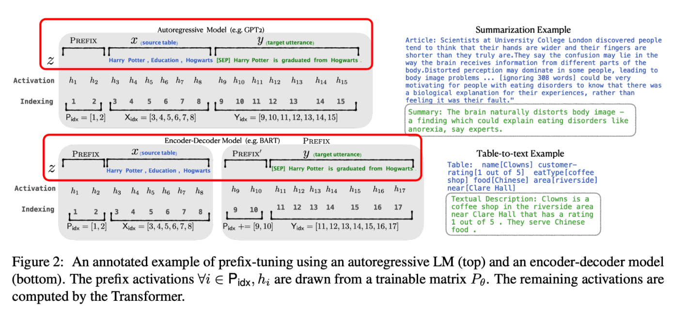

# 3、LLM

[表格内容，请参考原文档]

生态位名称

这一层在干什么（一句话）

典型框架 / 项目（尽量列全、含 NeMo）

0. 硬件与底层加速层

提供算力、显存与通信能力，是一切训练/推理的物理基础。

GPU：NVIDIA A100/H100、4090、MI300 等；互联：NVLink、PCIe、InfiniBand；库：CUDA、cuDNN、cuBLAS/cuBLASLt、ROCm、NCCL；硬件体系：TPU、Habana Gaudi 等

1. 深度学习框架与分布式原语层

提供计算图、自动求导与基本分布式原语，是上层系统的“操作系统”。

PyTorch、TensorFlow、JAX；分布式：torch.distributed、DDP、FSDP、ZeRO（native 版本）、Horovod、XLA(pjit/pmap)、MPI 等

2. 大模型系统 & 训练引擎层

负责大模型的并行策略、内存优化和高效训练，是“把超大模型训得动”的系统层。

Megatron-LM / Megatron-Core、DeepSpeed（含 DeepSpeed-Chat）、NVIDIA NeMo（训练部分）、Colossal-AI、BMTrain、Alpa、FairScale、PaddleFleetX、Zero2/3 实现、MindSpore 大模型方案 等

3. 预训练与基础模型实现层

提供具体的大模型实现与预训练代码/配方，是“基座模型产地”。

LLaMA/CodeLLaMA 官方实现、GPT-NeoX、Bloom / Megatron-DeepSpeed-BLOOM、T5/UL2 官方代码、Mistral/Nous/InternLM/百川/DeepSeek 等各家预训练仓库，NVIDIA NeMo-Megatron 预训练配方，OpenLLaMA / Falcon 等开源预训练 repo

4. LLM 微调 & 对齐 / RLHF 框架层

封装 SFT / DPO / PPO/GRPO 等算法与工程流程，是“对齐 & 下游适配”的主战场。

TRL(HuggingFace TRL)、Unsloth、OpenRLHF、VERL(vLLM-RL)、DeepSpeed-Chat、TRLX、LLaMA-Factory、Axolotl、ORPO / DPO / KTO 各类 recipe 仓库、NeMo-Aligner（NeMo 对齐部分） 等

5. 参数/显存高效微调与压缩层（PEFT & 量化）

让大模型在有限显存下可训可用，包括 LoRA/QLoRA、量化、蒸馏等。

PEFT(HF PEFT)、LoRA、QLoRA、AdaLoRA、Prefix/Prompt Tuning；量化：bitsandbytes、GPTQ、AWQ、GPTQ-for-LLaMa、AutoGPTQ、AQLM、LLM.int8()；蒸馏：TinyLlama、DistilGPT/DistilBERT 等各类蒸馏框架

6. 推理引擎 & Serving 层

负责高吞吐、低延迟推理与服务化，支撑在线产品 QPS。

vLLM、TensorRT-LLM、FasterTransformer、SGLang、TGI(Text Generation Inference)、llama.cpp、ggml/gguf 系列、MLC-LLM、HuggingFace Text Generation Inference、DeepSpeed-Inference、NeMo Inference、Ray Serve/KServe 上的 LLM Serving 方案 等

7. 数据构建 & 数据工程层

负责语料收集、清洗、过滤、去重和数据版本管理，是“模型粮仓”。

HF Datasets、WebDataset、Petals 数据工具、OpenWebText/Pile/RedPajama/SlimPajama/ROOTS/Wudao 等语料工程；Spark/Ray/Dask 数据管线；DataPrep/cleanlab 等数据清洗工具，自研 ETL/标注平台 等

8. 评测与基准测试层

设计并运行评测体系，量化模型能力、偏见与安全性。

lm-eval-harness、LightEval、OpenCompass、HELM、Eval harness of OpenAI/Anthropic 等；基准：MMLU、GSM8K、BBH、TruthfulQA、ARC、HellaSwag、HumanEval、MT-Bench、Arena/Chatbot Arena；安全评测：AdvBench、红队评测脚本 等

9. 检索增强 & 工具/环境交互层（RAG & Tool-Use）

为模型接外部知识和工具（检索、数据库、API），搭建复杂任务环境。

各类 RAG 框架：Haystack、LangChain RAG、LlamaIndex、VectorDB：FAISS、Milvus、Pinecone、Weaviate、Chroma 等；Toolformer/Function Calling/MCP 等工具调用协议及实现，NeMo-Guardrails（工具与安全结合） 等

10. 应用编排 & Agent / Workflow 层

负责多工具、多模型、多步骤的编排，是 Agent / Copilot / 工作流的“操作系统”。

LangChain、LlamaIndex、Guidance、Semantic Kernel、Haystack Agents、CrewAI、AutoGen、DSPy、TaskWeaver、OpenAI Assistants / MCP 客户端实现、各种企业内部 Orchestrator/Workflow 系统 等

11. 安全、合规与策略控制层

提供内容安全、红队、策略执行和合规控制，是“安全生产”的防线。

NeMo Guardrails、OpenAI/Anthropic 等安全 policy 开源实现、安全 RLHF / RLAIF pipeline、red-teaming 工具集、敏感信息检测/审计系统、各家安全评估 benchmark 与规则库 等

12. 运维、监控与 MLOps / LLMOps 层

管理训练/推理作业、监控资源与质量、版本/回滚，是大模型全生命周期运维层。

MLflow、Weights & Biases、ClearML、Kubeflow、SageMaker、Ray Train/Serve、Grafana + Prometheus 监控；LLMOps 平台：Predibase、Arize Phoenix、WhyLabs、Humanloop 等；自研训练/推理调度与实验平台 等

六层生态位：

### AI infra 层

- 代表性组件
- 硬件：A100 / H100 / 4090 / MI300 等 GPU，HBM 显存大小，NVLink、PCIe、InfiniBand。
- 驱动 & 底层库：CUDA、ROCm、cuBLAS、cuDNN、CUBLASLt。
- 集群调度：Slurm、Kubernetes + K8s operator 等。
- GPU 结构与限制：显存、带宽、算力（TFLOPS）、NVLink 互联。
- 训练瓶颈来自哪里：算力瓶颈 vs 内存瓶颈 vs 通信瓶颈。
- 了解不同 GPU 代际对bf16 / fp8 支持、Tensor Core 性能的影响。
### 训练框架层

（Megatron-LM / DeepSpeed / FSDP / NVIDIA NeMo、PaddleFleetX、Zero2/3 实现等）

- 生态位名称：大模型系统 & 分布式训练引擎层
- 典型代表
- Megatron-LM / Megatron-Core（NVIDIA）
- DeepSpeed（Microsoft）
- FSDP（PyTorch 原生）
- 并行策略：5D 并行等
- 内存优化：
- ZeRO-1/2/3
- FSDP 参数分片
- Optimizer & Gradient offload（CPU / NVMe）
- Activation checkpointing
- 吞吐优化：
- 通信重叠（overlap comm&compute）
- micro-batch，gradient accumulation
- FlashAttention、xFormers 等高效算子集成
- 算法工程师“必须”掌握的程度：概念层 + 能看懂配置 / 日志；知道哪些配置在控制并行（TP/PP/DP）、ZeRO stage；看得懂 DeepSpeed/Megatron 日志里的内存、吞吐、通信指标。能根据模型大小 / 显存 / 集群规模，大致算出一个可行的并行策略和 batch 设置。不一定要自己从零写 Megatron，但要读得懂别人写好的配置脚本；会 debug 常见的 OOM / 通信 timeout / 死锁问题的大致来源。
### LLM 微调 & 对齐 / RLHF 框架层

（VERL / OpenRLHF / TRL / Unsloth 所在）

- 生态位名称：LLM 微调 & 对齐 / RLHF 框架层
- 代表性项目
- 面向 RLHF / 对齐的系统级框架（偏在线 / RL）
- OpenRLHF
- VERL（vLLM-RL）
- 面向 SFT / DPO / GRPO 等微调的框架（偏离线 / Recipe）
- TRL（HuggingFace TRL）
- Unsloth
- LLaMA-Factory
- 和上一层的关系：自己一般不实现分布式原语，而是调用 PyTorch + DeepSpeed/FSDP。专注于：“如何实现 SFT / RLHF / DPO 这种算法流程 + 工程细节”。
- 算法工程师必须掌握的“算法 & 流程知识”
- SFT（监督微调）
- loss：交叉熵、label smoothing 等。
- 数据构造：指令 / 角色 / system prompt、Concat pack（多样本拼接）、max_length 截断策略。
- Preference-based 对齐方法
- DPO / IPO / ORPO / KTO 的基本公式、优缺点、稳定性问题。
- Pairwise / Listwise 偏好数据格式（(chosen, rejected)）。
- RLHF / RLAIF
- 整体 pipeline：SFT → RM → PPO/GRPO（或 RLAIF）→ 合成数据。
- 典型算法：
- PPO / PPO-clip
- GRPO / RLOO / ReMax 等变种
- KL 惩罚、Advantage 估计（GAE）、价值函数建模等。
- 对 exploding/vanishing reward、collapse 的常见 failure mode 有直觉。
- LoRA / QLoRA / Prefix-tuning 等参数高效微调：
- rank、alpha、target modules、梯度缩放的影响。
- 实现层面能看懂 TRL / OpenRLHF / VERL 等的核心训练 loop。能自己手写一个简化版 DPO / PPO loss，并在框架中替换 /扩展。
### 服务层

- 代表性项目
- 推理引擎 / runtime
- vLLM
- TensorRT-LLM / FasterTransformer
- SGLang
- llama.cpp / ggml / MLC-LLM
- 服务层
- TGI（Text Generation Inference）
- OpenAI Compatible REST 服务（很多公司自己包装）
- Ray Serve / KServe 等通用 Serving 框架上的 LLM 部署。
- 这层你需要掌握的知识
- 推理时的性能瓶颈：
- KV Cache、prefill vs decode 两个阶段。
- 并发（batching / continuous batching / speculative decoding）。
- 量化 & 压缩：INT8、INT4、GPTQ、AWQ、GQA 结构等。
- 服务 SLO：延迟 / 吞吐 / 稳定性与 batch / 并发数的关系。
- 能够根据业务需求，大致判断：
- 用 vLLM 还是 TensorRT-LLM / llama.cpp；
- 该用哪种量化方案、预填充策略、是否需要多副本 / 多机。

整理：

https://github.com/datawhalechina/happy-llm/blob/main/docs/chapter4/%E7%AC%AC%E5%9B%9B%E7%AB%A0%20%E5%A4%A7%E8%AF%AD%E8%A8%80%E6%A8%A1%E5%9E%8B.md

训练流程：

https://github.com/datawhalechina/happy-llm/blob/main/docs/chapter6/%E7%AC%AC%E5%85%AD%E7%AB%A0%20%E5%A4%A7%E6%A8%A1%E5%9E%8B%E8%AE%AD%E7%BB%83%E6%B5%81%E7%A8%8B%E5%AE%9E%E8%B7%B5.md

[大语言模型（LLM）微调技术笔记](https%3A%2F%2Fninehills.tech%2Farticles%2F92.html)

[大语言模型（LLM）后训练数据准备相关笔记](https%3A%2F%2Fninehills.tech%2Farticles%2F95.html)

微调可以分为全微调和重用两个方法：

1. 全微调（Full Fine-tuning）：全微调是指对整个预训练模型进行微调，包括所有的模型参数。在这种方法中，预训练模型的所有层和参数都会被更新和优化，以适应目标任务的需求。这种微调方法通常适用于任务和预训练模型之间存在较大差异的情况，或者任务需要模型具有高度灵活性和自适应能力的情况。Full Fine-tuning需要较大的计算资源和时间，但可以获得更好的性能。经典的Fine tuning方法包括将预训练模型与少量特定任务数据一起继续训练。在这个过程中，预训练模型的权重被更新，以更好地适应任务。所需的Fine-tuning量取决于预训练语料库和任务特定语料库之间的相似性。如果两者相似，可能只需要少量的Fine tuning。如果两者不相似，则可能需要更多的Fine tuning。
1. 部分微调（Repurposing）：部分微调是指在微调过程中只更新模型的顶层或少数几层，而保持预训练模型的底层参数不变。这种方法的目的是在保留预训练模型的通用知识的同时，通过微调顶层来适应特定任务。Repurposing通常适用于目标任务与预训练模型之间有一定相似性的情况，或者任务数据集较小的情况。由于只更新少数层，Repurposing相对于Full Fine-tuning需要较少的计算资源和时间，但在某些情况下性能可能会有所降低。
### 1.1、Adapt Tuning

2019年谷歌的研究人员首次在论文《Parameter-Efficient Transfer Learning for NLP》提出针对 BERT 的 PEFT微调方式，拉开了 PEFT 研究的序幕。他们指出，在面对特定的下游任务时，如果进行 Full-Fintuning（即预训练模型中的所有参数都进行微调），太过低效；而如果采用固定预训练模型的某些层，只微调接近下游任务的那几层参数，又难以达到较好的效果。

Adapter 结构：

- 首先是一个 down-project 层将高维度特征映射到低维特征
- 然后过一个非线形层之后，再用一个 up-project 结构将低维特征映射回原来的高维特征
- 同时也设计了 skip-connection 结构，确保了在最差的情况下能够退化为identity（类似残差结构）。
### 1.2、Prefix Tuning

2021年斯坦福的研究人员在论文《Prefix-Tuning: Optimizing Continuous Prompts for Generation》中提出了 Prefix Tuning 方法。与Full-finetuning 更新所有参数的方式不同，该方法是在输入 token 之前构造一段任务相关的 virtual tokens 作为 Prefix，然后训练的时候只更新 Prefix 部分的参数，而 Transformer 中的其他部分参数固定。该方法其实和构造 Prompt 类似，只是 Prompt 是人为构造的“显式”的提示，并且无法更新参数，**而Prefix 则是可以学习的“隐式”的提示**。

同时，为了防止直接更新 Prefix 的参数导致训练不稳定的情况，他们在 Prefix 层前面加了 MLP 结构(相当于将Prefix 分解为更小维度的 Input 与 MLP 的组合后输出的结果)，训练完成后，只保留 Prefix 的参数。

### 1.3、P-Tuning / Prompt Tuning

Prompt Tuning 是2021年谷歌在论文《The Power of Scale for Parameter-Efficient Prompt Tuning》中提出的微调方法。

该方法可以**看作是 Prefix Tuning 的简化版本**，只在输入层加入 prompt tokens，并不需要加入 MLP 进行调整来解决难训练的问题，主要在 T5 预训练模型上做实验。似乎只要预训练模型足够强大，其他的一切都不是问题。作者也做实验说明随着预训练模型参数量的增加，Prompt Tuning的方法会逼近 Fine-tune 的结果。

固定预训练参数，为每一个任务额外添加一个或多个 embedding，之后拼接 query 正常输入 LLM，并只训练这些 embedding。左图为单任务全参数微调，右图为 Prompt tuning。

P-Tuning 提出 **将 Prompt 转换为可以学习的 Embedding 层**，只是考虑到直接对 Embedding 参数进行优化会存在这样两个挑战：

- Discretenes： 对输入正常语料的 Embedding 层已经经过预训练，而如果直接对输入的 prompt embedding进行随机初始化训练，容易陷入局部最优。
- Association：没法捕捉到 prompt embedding 之间的相关关系。
P-Tuning 和 Prefix-Tuning 差不多同时提出，做法其实也有一些相似之处，主要区别在：

1. Prefix Tuning 是将额外的 embedding 加在开头，看起来更像是模仿 Instruction 指令；而 P-Tuning 的位置则不固定。
1. Prefix Tuning 通过在每个 Attention 层都加入 Prefix Embedding 来增加额外的参数，通过 MLP 来初始化；而 P-Tuning 只是在输入的时候加入 Embedding，并通过 LSTM+MLP 来初始化。
### 1.5、P-Tuning v2

P-Tuning 的问题是在小参数量模型上表现差。于是就有了v2版本：《P-Tuning v2: Prompt Tuning Can Be Comparable to Fine-tuning Universally Across Scales and Tasks》。

从标题就可以看出，P-Tuning v2 的目标就是要让 Prompt Tuning **能够在不同参数规模的预训练模型**、针对不同下游任务的结果上都达到匹敌 Fine-tuning 的结果。

那也就是说当前 Prompt Tuning 方法在这两个方面都存在局限性。

- 不同模型规模：Prompt Tuning 和 P-tuning **这两种方法都是在预训练模型参数规模够足够大时，才能达到和Fine-tuning 类似的效果，而参数规模较小时效果则很差。**
- 不同任务类型：Prompt Tuning 和 P-tuning 这两种方法在 sequence tagging 任务上表现都很差。
相比 Prompt Tuning 和 P-tuning 的方法， P-tuning v2 方法在多层加入了 Prompts tokens 作为输入，带来两个方面的好处：

- 带来更多可学习的参数（从 P-tuning 和 Prompt Tuning 的0.1%增加到0.1%-3%），同时也足够 parameter-efficient。
- 加入到更深层结构中的 Prompt 能给模型预测带来更直接的影响。
### 1.6、LoRA

LoRA，英文全称Low-RankAdaptation of Large Language Models，直译为大语言模型的低阶适应，是一种PEFT（Parameter-Efficient Tuning，简称PEFT），这是微软的研究人员为了解决大语言模型微调而开发的一项技术。

LoRA的基本原理是冻结预训练好的模型权重参数，在冻结原模型参数的情况下，通过往模型中加入额外的网络层，并只训练这些新增的网络层参数。由于这些新增参数数量较少，这样不仅 finetune 的成本显著下降，还能获得和全模型微调类似的效果。

### 1.7、QLoRA

QLoRA 是由 Tim Dettmers 等人提出的量化 LoRA 的缩写。QLoRA 是一种在微调过程中进一步减少内存占用的技术。在反向传播过程中，QLoRA 将预训练的权重量化为 4-bit，并使用分页优化器来处理内存峰值。

使用LoRA时可以节省33%的GPU内存。然而，由于QLoRA中预训练模型权重的额外量化和去量化，训练时间增加了39%。

LoRA微调缺点

1. 参数空间小：LoRA中参与训练的参数量较少，解空间较小，效果相比全量微调有一定的差距。
1. 微调大模型成本高：对于上百亿参数量的模型，LoRA微调的成本还是很高。
1. 精度损失：针对第二点，可以采用int8或int4量化，进一步对模型基座的参数进行压缩。但是又会引发精度损失的问题，降低模型性能。
QLoRA优点：

1. 4-bit NormalFloat：提出一种理论最优的4-bit的量化数据类型，优于当前普遍使用的FP4与Int4。对于正态分布权重而言，一种信息理论上最优的新数据类型，该数据类型对正态分布数据产生比 4 bit整数和 4bit 浮点数更好的实证结果。QLORA包含一种低精度存储数据类型（通常为4-bit）和一种计算数据类型（通常为BFloat16）。在实践中，QLORA权重张量使用时，需要将将张量去量化为BFloat16，然后在16位计算精度下进行矩阵乘法运算。模型本身用4bit加载，训练时把数值反量化到bf16后进行训练。
1. Double Quantization：对第一次量化后的那些常量再进行一次量化，减少存储空间。相比于当前的模型量化方法，更加节省显存空间。每个参数平均节省0.37bit，对于65B的LLaMA模型，大约能节省3GB显存空间。
1. Paged Optimizers：使用NVIDIA统一内存特性，该特性可以在在GPU偶尔OOM的情况下，进行CPU和GPU之间自动分页到分页的传输，以实现无错误的 GPU 处理。该功能的工作方式类似于 CPU 内存和磁盘之间的常规内存分页。使用此功能为优化器状态（Optimizer）分配分页内存，然后在 GPU 内存不足时将其自动卸载到 CPU 内存，并在优化器更新步骤需要时将其加载回 GPU 内存。
1. 增加Adapter：4-bit的NormalFloat与Double Quantization，节省了很多空间，但带来了性能损失，作者通过插入更多adapter来弥补这种性能损失。在LoRA中，一般会选择在query和value的全连接层处插入adapter。而QLoRA则在所有全连接层处都插入了adapter，增加了训练参数，弥补精度带来的性能损失。
### 1.8、LoRA+MoE

由于大模型全量微调时的显存占用过大，LoRA、Adapter、IA 3 这些参数高效微调方法便成为了资源有限的机构和研究者微调大模型的标配。PEFT方法的总体思路是冻结住大模型的主干参数，引入一小部分可训练的参数作为适配模块进行训练，以节省模型微调时的显存和参数存储开销。

传统上，LoRA这类适配模块的参数和主干参数一样是稠密的，每个样本上的推理过程都需要用到所有的参数。近来，大模型研究者们为了克服稠密模型的参数效率瓶颈，开始关注以Mistral、DeepSeek MoE为代表的混合专家（Mixure of Experts，简称MoE）模型框架。在该框架下，模型的某个模块（如Transformer的某个FFN层）会存在多组形状相同的权重（称为专家），另外有一个路由模块（Router）接受原始输入、输出各专家的激活权重。

### 1.9、RLHF

**第一步**是 supervised-fintuning，首先进行模型微调，预训练一个语言模型 (LM) 。

**第二步**是训练一个奖励模型，它通过对于同一个 prompt 的不同输出进行人工排序，聚合问答数据并训练一个奖励模型 (Reward Model，RM) ；

RM 的训练是 RLHF 区别于旧范式的开端。这一模型接收一系列文本并返回一个标量奖励，数值上对应人的偏好。我们可以用端到端的方式用 LM 建模，或者用模块化的系统建模 (比如对输出进行排名，再将排名转换为奖励) 。这一奖励数值将对后续无缝接入现有的 RL 算法至关重要。

关于模型选择方面，RM 可以是另一个经过微调的 LM，也可以是根据偏好数据从头开始训练的 LM。例如 Anthropic 提出了一种特殊的预训练方式，即用偏好模型预训练 (Preference Model Pretraining，PMP) 来替换一般预训练后的微调过程。因为前者被认为对样本数据的利用率更高。但对于哪种 RM 更好尚无定论。

关于训练文本方面，RM 的 **提示 - 生成 **对文本是从预定义数据集中采样生成的，并用初始的 LM 给这些提示生成文本。Anthropic 的数据主要是通过 Amazon Mechanical Turk 上的聊天工具生成的，并在 [Hub](https%3A%2F%2Fhuggingface.co%2Fdatasets%2FAnthropic%2Fhh-rlhf) 上 可用，而 OpenAI 使用了用户提交给 GPT API 的 prompt。

关于训练奖励数值方面，这里需要**人工对 LM 生成的回答进行排名。起初我们可能会认为应该直接对文本标注分数来训练 RM，但是由于标注者的价值观不同导致这些分数未经过校准并且充满噪音。通过排名可以比较多个模型的输出并构建更好的规范数据集。**

对具体的排名方式，一种成功的方式是对不同 LM 在相同提示下的输出进行比较，然后使用 [Elo](https%3A%2F%2Fen.wikipedia.org%2Fwiki%2FElo_rating_system) 系统建立一个完整的排名。这些不同的排名结果将被归一化为用于训练的标量奖励值。

**第三步**则是用强化学习算法(RL) 方式微调 LM。

目前多个组织找到的可行方案是使用策略梯度强化学习 (Policy Gradient RL) 算法、近端策略优化 (Proximal Policy Optimization，PPO) 微调初始 LM 的部分或全部参数。

让我们首先将微调任务表述为 RL 问题。首先，该 **策略** (policy) 是一个接受提示并返回一系列文本 (或文本的概率分布) 的 LM。这个策略的 **行动空间** (action space) 是 LM 的词表对应的所有词元 (一般在 50k 数量级) ，**观察空间 **(observation space) 是可能的输入词元序列，也比较大 (词汇量 ^ 输入标记的数量) 。**奖励函数** 是偏好模型和策略转变约束 (Policy shift constraint) 的结合。

最后根据 PPO 算法，我们按当前批次数据的奖励指标进行优化 (来自 PPO 算法 on-policy 的特性) 。PPO 算法是一种信赖域优化 (Trust Region Optimization，TRO) 算法，它使用梯度约束确保更新步骤不会破坏学习过程的稳定性。DeepMind 对 Gopher 使用了类似的奖励设置，但是使用 A2C (synchronous advantage actor-critic) 算法来优化梯度。

