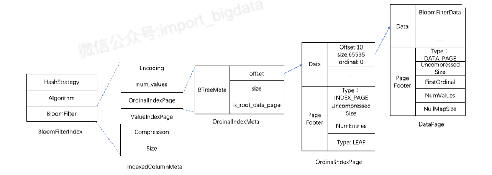
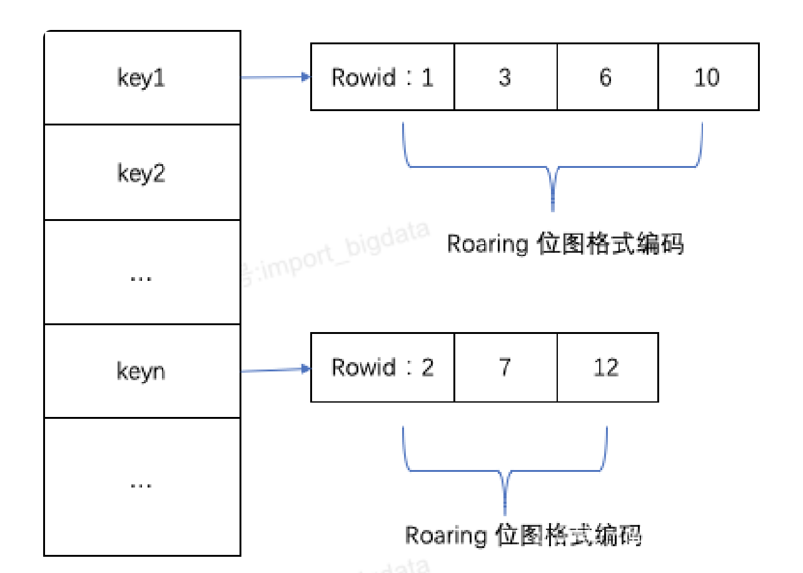

# 存储结构

# 一、高效索引流程

Doris是基于MPP架构的交互式SQL数据仓库，主要用于解决**近实时的报表和多维分析**。Doris高效的导入、查询离不开其存储结构精巧的设计。

在查询一个Segment中的数据时，根据执行的查询条件，会对首先根据字段加索引的情况对数据进行过滤。然后在进行读取数据，整体的查询流程如下：

1. **row_bitmap**：首先，会按照Segment的行数构建一个row_bitmap，表示记录那些数据需要进行读取，没有使用任何索引的情况下，需要读取所有数据。
1. **ShortKey Index**：当查询条件中按前缀索引规则使用到了key时，会先进行ShortKey Index的过滤，可以在ShortKey Index中匹配到的ordinal行号范围，合入到row_bitmap中。
1. **BitMap Index**：当查询条件中列字段存在BitMap Index索引时，会按照BitMap索引直接查出符合条件的ordinal行号，与row_bitmap求交过滤。这里的过滤是精确的，之后去掉该查询条件，这个字段就不会再进行后面索引的过滤。
1. **BloomFilter**：当查询条件中列字段存在BloomFilter索引并且条件为等值（eq，in，is）时，会按BloomFilter索引过滤，这里会遍历所有 Page的BloomFilter，找出查询条件能命中的所有Page。将索引信息中的ordinal行号范围与row_bitmap求交过滤。
1. **ZoneMap**：当查询条件中列字段存在ZoneMap索引时，会按ZoneMap索引过滤，这里同样会走完所有索引，找出查询条件能与ZoneMap有交集的所有Page。将索引信息中的ordinal行号范围与row_bitmap求交过滤。
1. **OrdinalIndex Seek Page**：生成好row_bitmap之后，批量通过每个Column的OrdinalIndex找到到具体的Data Page。
1. **Read data**：批量读取每一列的Column Data Page的数据。在读取时，对于有null值的page，根据null值位图判断当前行是否是null，如果为null进行直接填充即可。
# 二、储存文件格式

## 2.1、存储目录结构

存储层对存储数据的管理通过storage_root_path路径进行配置，路径可以是多个。存储目录下一层按照分桶进行组织，分桶目录下存放具体的tablet，按照tablet_id命名子目录。

Segment文件存放在tablet_id目录下按SchemaHash管理。Segment文件可以有多个，一般按照大小进行分割，默认为256MB。其中，Segment v2文件命名规则为：${rowset_id}_${segment_id}.dat。

Segment整体的文件格式分为**数据区域**，**索引区域**和**footer**三个部分，如下图所示：

- **Data Region**: 用于存储各个列的**数据内容**，这里的数据是按 **column-page **加载的
- 存储数据的具体内容，**colum 0 ~ column N**
-  每个 column 下面存放 **page 0 ~ page N**
- **Index Region**: 用于存储各个列的**索引数据**，结构与数据域类似，都是列存
- **Footer信息**
## 2.2、Footer

Footer信息段在文件的尾部，**存储了文件的整体结构、数据域的位置、索引域的位置**等元数据信息，其中有

- **SegmentFootPB（重点）**：SegmentFooterPB 定义文件的元数据信息
- **PB Checksum**：4个字节的FooterPB内容的checksum
- **PB Length**：4个字节的FileFooterPB消息长度
- **MAGIC CODE**：8个字节，用于读取FileFooterPB，末位存储是方便不同的场景进行文件类型的识别
SegmentFooterPB数据结构如下：

SegmentFooterPB采用了PB格式进行存储，主要**存储数据和索引的元数据信息**，包含了column meta、ShortKeyIndex PagePointer、num_rows

- 数据域 meta 信息
- ColumnId：当前列在schema中的序号
- UniqueId：全局唯一的id
- Type：列的类型信息
- Length：列的长度信息
- Encoding：编码格式
- Compression：压缩格式
- Dict PagePointer：字典信息
- 索引域 meta 信息
- OrdinalIndex：存放列的稀疏索引meta信息。
- ZoneMapIndex：存放ZoneMap索引的meta信息，内容包括了最大值、最小值、是否有空值、是否没有非空值。SegmentZoneMap存放了全局的ZoneMap信息，PageZoneMaps则存放了每个页面的统计信息。
- BitMapIndex：存放BitMap索引的meta信息，内容包括了BitMap类型，字典数据BitMap数据。
- BloomFilterIndex：存放了BloomFilter索引信息。
## 2.3、Data Region 数据域

Column的data数据按照**Page**为单位分块存储，每个Page大小一般为64*1024个字节。Page在存储的位置和大小由一级索引管理。

### 2.3.1、DataPage 存储结构

DataPage主要为Data部分、Page Footer两个部分。

- Data部分存放了当前Page的列的数据
- 当允许存在Null值时，对空值单独存放了Null值的Bitmap，由RLE格式编码通过bool类型记录Null值的行号。
- Page Footer 包含 page type 等元数据信息
- Page类型Type
- UncompressedSize未压缩时的数据大小
- FirstOrdinal当前Page第一行的RowId
- NumValues为当前Page的行数
- NullMapSize对应了NullBitmap的大小。
### 2.3.2、数据压缩

针对不同的字段类型采用了不同的编码。默认情况下，针对不同类型采用的对应关系如下：

TINYINT/SMALLINT/INT/BIGINT/LARGEINT

BIT_SHUFFLE

FLOAT/DOUBLE/DECIMAL

BIT_SHUFFLE

CHAR/VARCHAR

DICT

BOOL

RLE

DATE/DATETIME

BIT_SHUFFLE

HLL/OBJECT

PLAIN

默认采用**LZ4F格式对数据进行压缩**。

## 2.4、Index Region 索引域

为了防止索引本身数据量过大，**ZoneMapIndex、BitMapIndex、BloomFilterIndex 采用了两级的Page管理**。对应了IndexColumnMeta的结构，当一个Page能够放下时，当前Page直接存放索引数据，即采用1级结构；当一个Page无法放下时，索引数据写入新的Page中，Root Page存储数据Page的地址信息。

### 2.4.1、Ordinal Index (一级索引)

Ordinal Index索引提供了**通过行号**来查找Column Data Page数据页的物理地址。Ordinal Index能够将按列存储数据按行对齐，可以理解为一级索引。其他索引查找数据时，都要通过Ordinal Index查找数据Page的位置。

在一个segment中，数据始终按照key（AGGREGATE KEY、UNIQ KEY 和 DUPLICATE KEY）排序顺序进行存储，即key的排序决定了数据存储的物理结构。确定了列数据的物理结构顺序，在写入数据时，Column Data Page是由Ordinal index进行管理，Ordinal index记录了每个Column Data Page的**位置offset**、**大小size**和**第一个数据项行号信息Ordinal**。这样每个列具有按行信息进行快速扫描的能力。

稀疏索引结构：就像是一本书目录，记录了每个章节对应的页码。

Ordinal index元信息存储在SegmentFooterPB中的每个列的OrdinalIndexMeta中。具体结构如下图所示：

**在OrdinalIndexMeta中存放了索引数据对应的root page地址**

- 当数据仅有一个page时，这里的地址可以直接指向唯一的数据page；
- 当一个page放不下时，指向OrdinalIndex类型的二级结构索引page，索引数据中每个数据项对应了Column Data Page offset位置、size大小和ordinal行号信息。其中Ordinal index索引粒度与page粒度一致，默认64*1024字节。
### 2.4.2、Short Key Index  前缀索引

Short Key Index前缀索引，是在key（AGGREGATE KEY、UNIQ KEY 和 DUPLICATE KEY）排序的基础上，实现的一种根据给定前缀列，快速查询数据的索引方式。Short Key Index索引也采用了稀疏索引结构，在数据写入过程中，每隔一定行数，会生成一个索引项。这个行数为索引粒度默认为1024行，可配置。该过程如下图所示：

其中，KeyBytes中存放了索引项数据，OffsetBytes存放了索引项在KeyBytes中的偏移。

Short Key Index**采用前36 个字节作为这行数据的前缀索引**。当遇到 VARCHAR 类型时，前缀索引会直接截断。

具体的看中前缀索引的举例

### 2.4.3、ZoneMap Index索引

ZoneMap索引存储了**Segment和每个列对应每个Page的统计信息**。这些统计信息可以帮助在查询时提速，减少扫描数据量

在SegmentFootPB结构中，每一列索引元数据ColumnIndexMeta中存放了当前列的ZoneMapIndex索引数据信息。ZoneMapIndex有两个部分，**SegmentZoneMap**和**PageZoneMaps**。

- 四种统计信息
- Min
- Max
- HasNull
- HasNotNull
- 两种粒度的 ZoneMap：在列数据写入Page时，自动对数据进行比较，**不断维护当前Segment的ZoneMap和当前Page的ZoneMap索引信息。**
- Segment 粒度，SegmentZoneMap存放了当前Segment全局的ZoneMap索引信息
- Page 粒度，PageZoneMaps存放了每个Data Page的ZoneMap索引信息。
ZoneMap索引存储结构如下图所示：

PageZoneMaps对应了索引数据存放的Page信息IndexedColumnMeta结构

- IndexedColumnMeta中的OrdinalIndexPage 这里同样做了优化二级Page优化
- 当仅有一个DataPage时，OrdinalIndexMeta直接指向这个DataPage；
- 多个DataPage时，OrdinalIndexMeta先指向OrdinalIndexPage，OrdinalIndexPage是一个二级Page结构，里面的数据项为索引数据DataPage的地址偏移offset，大小Size和ordinal信息。
**索引生成规则**：Doris默认为key列开启ZoneMap索引；当表的模型为DUPULCATE时，会所有字段开启ZoneMap索引。

### 2.4.4、BloomFilter

当一些字段不能利用Short Key Index并且字段存在区分度比较大时，Doris提供了BloomFilter索引。

BloomFilter的存储结构如下图所示：

BloomFilterIndex信息存放了生产的Hash策略、Hash算法和BloomFilter过对应的数据Page信息。Hash算法采用了HASH_MURMUR3，Hash策略采用了BlockSplitBloomFilter分块实现策略，期望的误判率fpp默认配置为0.05。

BloomFilter索引数据对应数据Page的存放与ZoneMapIndex类似，也是做了二级Page的优化，不再阐述。

**索引生成规则**：BloomFilter 按 **Page 粒度 **生成，在数据写入一个完整的Page时，Doris会根据Hash策略同时生成这个Page的BloomFilter索引数据。目前bloom过滤器不支持tinyint/hll/float/double类型，其他类型均已支持。**使用时需要在PROPERTIES中指定bloom_filter_columns要使用BloomFilter索引的字段**。

### 2.4.5、Bitmap Index索引

Bitmap存储格式如下：

BitmapIndex的meta信息同样存放在SegmentFootPB中

BitmapIndex包含了三部分

- **BitMap的类型**
- **字典信息DictColumn**
- **位图索引数据信息BitMapColumn**。
其中DictColumn、BitMapColumn都对应IndexedColumnData结构，分别存放了字典数据和索引数据的Page地址offset、大小size。这里同样做了二级page的优化，不再具体阐述。

这里与其他索引存储结构有差异的地方是DictColumn字典数据进行了LZ4F压缩，在记录二级Page偏移时存放的是Data Page中的第一个值。

**索引生成规则**：BitMap创建时需要通过 CREATE INDEX 进行创建。**Bitmap的索引是整个Segment中的Column字段的索引，而不是为每个Page单独生成一份**。在写入数据时，会维护一个map结构记录下每个key值对应的行号，并采用Roaring位图对rowid进行编码。主要结构如下：

生成索引数据时，首先将map结构的key值写入到DictColumn中。然后，key对应Roaring编码的rowid以字节方式将数据写入到BitMapColumn中。
