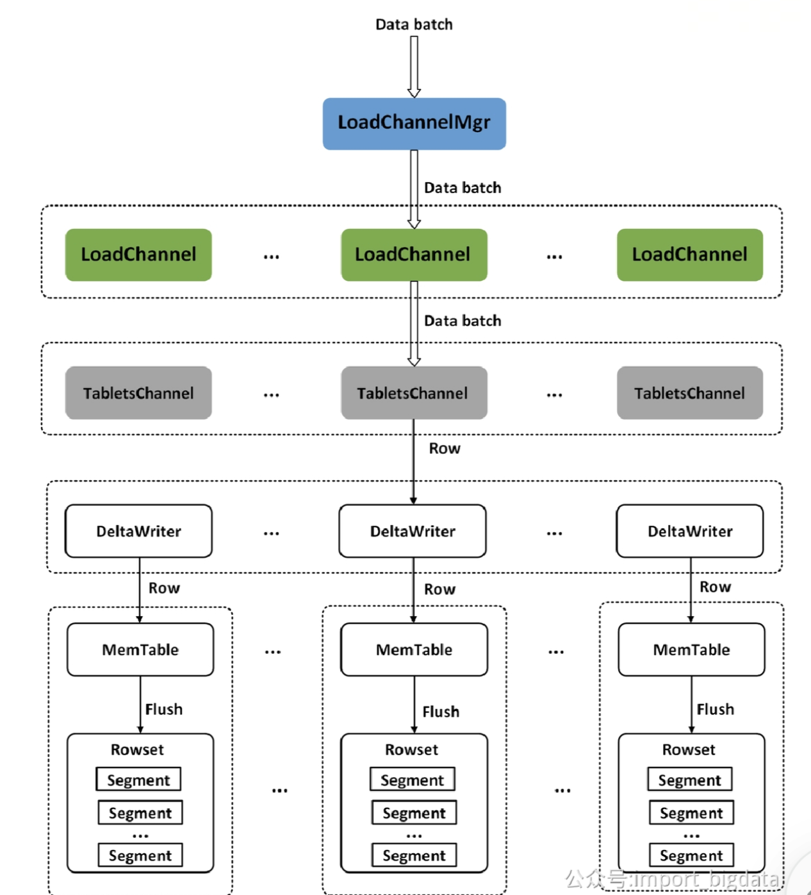

# 读写原理待归档

## 二、数据导入

### 2.1、 导入基础流程

-  一次导入流程中，Doris 会选定一个节点作为 Coordinator 节点。该节点负责读取数据并分发数据到其他数据节点。
- Coordinator BE在接收到读取请求时会从FE获取到导入的执行计划，导入的执行计划分为BrokerScanNode和OlapTableSink，对应了数据的读取和数据的分发。
### 2.2、Prepare 阶段

- FE 创建事务：Coordinator BE在执行StreamLoad请求时，会发送TLoadTxnBeginRequest请求到FE以创建事务 所有的事务都由GlobalTransactionMgr进行管理，创建事务时会做一些Quota、Label的检查。每个事务用TransactionState管理当前事务的状态，每当状态发生变化，都会写一条Log
- 初始化Writer：Coordinator BE在执行之前会遍历当前表的所有Partition下的Tablet，然后发送PTabletWriterOpenRequest 请求到对应的BE节点。BE节点收到请求后，会为每个Tablet创建一个DeltaWriter用于后续的数据写入 DeltaWriter在第一次数据写入时才会进行初始化（**懒加载**），初始化的时候会在BE侧注册对应的TXN信息。之所以采用懒加载的方式，因为最终写入的分区并不总是所有的分区。
- 写入数据：Coordinator BE会读取Http请求或文件的数据，然后做一些Schema的校验，校验成功后按照分桶列分发到对应机器上进行数据写入。如果失败就告诉 FE 进行回滚。
### 2.3、Commit 阶段

- eos（end of stream）请求：当所有数据读取完成后，Coordinator BE会进入 close 状态，然后给写入的节点传递一个eos（end of stream）请求，并且携带了实际写入的分区。
- 将RowsetMeta持久化到RocksDB、更新TXN事务信息：对应的节点会将对应Partition下所有Tablet在内存中的剩余数据全部写成Segment，然后创建一个Rowset用于管理所有写好的Segment。最后DeltaWriter会完成当前Tablet的commit操作，主要包括：将RowsetMeta持久化到RocksDB、更新TXN事务信息
- 返回 commit 结果：写入节点会返回成功commit的Tablet给Coordinator BE，Coordinator BE收集到所有Tablet的完成情况后会生成tablet_commit_infos，然后调用FE的loadTxnCommit接口提交事务
- 更新 log：根据传递的tablet_commit_infos检查FE元数据中的每个Tablet的副本的写入情况，如果失败个数小于总副本的一半，则认为本次commit是可以进行的。此时会从FE对应的Partition获取最新的Version，记录在TransactionState中，并且写一条log。
### 2.4、Publish

- 获取已提交的事务：后台会启动一个PublishVersionDaemon线程不断获取已经Commit的事务，然后根据TransactionState中记录的Version信息、节点信息创建对应的PublishVersionTask到BE
- 分发 PublishTask：BE接收到PublishVersionTask后，会根据传递的Partition ID从TXN Manager中获取到所有相关的Tablet，然后标记对应的Rowset为Visible，持久化到RocksDB，最终加入Tablet的Rowset列表来提供查询
- 更新元数据：PublishVersionDaemon会检查PublishVersionTask的返回结果，如果一个Partition的所有Tablet的成功副本数超过一半，就会设置该Version为Visible，从而完成一次导入事务。 PublishTask并不严格按照Version的顺序提交和执行，所以还需要检查Version是否连续，如果不连续需要等待其连续之后才能设置为成功。
### 2.5、分发流程

- IndexChannel：指的是RollUp表，每个表在写入时会同步写入所有对应的Rollup表
- NodeChannel：指的是具体的节点（多副本），相同RollUp下的所有Replica会被划分成多个NodeChannel。当读取数据时，会通过分桶列确认具体的TabletId，然后将该行写入该Tablet的多个副本对应的NodeChannel中的Batch，Batch满了会放入发送队列
-  Data Batch：OlapTableSink会启动一个后台的线程定期地从NodeChannel的发送队列取出Batch然后发送到指定的BE去执行写入。
### 2.6、写入流程

- 在BE中数据分层写入存储层，一个LoadChannel维护对应StreamLoad任务的写入通道。
- 一次StreamLoad任务对应的Table可能有多个RollUp，对应了多个TabletsChannel。TabletsChannel会逐行读取数据Batch并通过DeltaWriter写入对应的Tablet中
- DeltaWriter会在内存中维护一个Memtable(SkipList实现)，用于对数据进行聚合和排序，在使用内存到达256MB会异步写成一个Segment，最终会被一个Rowset管理。 Memtable保证了同一个Segment的有序性和语义正确性
- 由于每次是按照Batch发送，为了保证写入的正确性，每个Batch都会分配一个自增的SeqID，写入侧需要保证该ID不要重复和遗漏。重复返回Success，遗漏则直接报错。
**为什么每个BE自己也需要Txn Manager对事务进行管理？**

1. 需要保证写入的Rowset的一致性，通过TransactionID和PartitionID能够唯一确认是否是同一个导入任务
1. 需要方便对事务进行回滚和Publish
**写入过程中如果某个BE一直写不成功会怎么样？**

- 对应NodeChannel会被标记为Failed，然后不会再往该Channel写入
**每个BE的Txn Manager管理是全内存的，如果宕机会出问题吗？**

1. 如果还未commit，显然会直接失败，由Coordinator标记该NodeChannel为失败
1. 如果已经commit，那么BE读取Commited状态的Rowset时会提交Txn用于Publish Task的正常执行。