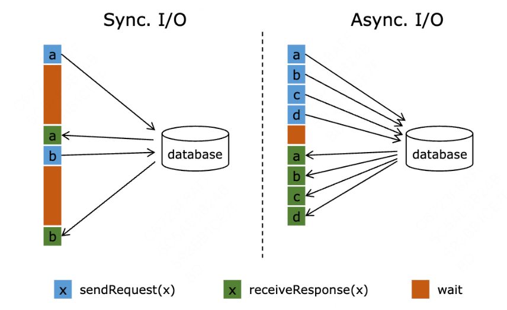

# Flink 调优

在前期的任务开发阶段，为了快速响应业务需求，我们通常不会针对每个任务进行调优，每次战役期间，我们通常通过临时加队列，加资源，战役前扩并发来应对高峰。扩并发对绝大多数情况是有效的，但在某些情况下也会不起作用，所以我们后来做了一些优化专项来针对 Flink 作业进行优化。

## 一、问题定位

要进行任务的优化首先必须要确定任务的瓶颈在哪。通常可能在三个部分：算子内部，算子间，数据倾斜

作业调优的方向主要可以归结为四大类：**是否合理地使用资源、大状态作业的 Checkpoint优化、状态访问性能调优、反压及数据倾斜优化。**

### 逻辑调优（数据倾斜 / 反压 / 关联）

- 关联
- 倾斜
### 数据倾斜 / 反压

即某个算子被分配了过多数据消费不过来，如果有 shuffle 操作那么发生反压的算子就会成为整个作业的瓶颈。即使没有 shuffle 也会导致堆积的算子中数据延迟，整体造成更大程度的数据乱序。此时增大并发或算子调优方式都效果有限，最好消除倾斜。

### 资源配置

如果作业整体逻辑没有问题，也没有明显倾斜，也不存在明显算子瓶颈，那么此时加并发是最有效的，比如 10 个并行消费 1000 个 partition，如果此时扩大并发可能效果就非常明显。常用方式：

1. 调整并发
1. 调整内存
### CP 调优

非常重要的调优环节，很多作业的问题都是状态引起的，常用方式：

1. CP 参数
1. 状态访问调优
## 二、排查思路

不考虑如果机器有问题、或者调度造成文件变动异常（h2h、h2m）的场景，考虑联系平台或者具体情况具体分析。

这个排查思路用于应对常见的 Flink 故障报警，比如 CP 连续制作失败、作业频繁重启、数据延迟报警，详细监控指标 

思路

检查项

检查内容

解决方案

grafana 看整体作业表现

上游流量

上游数据是否正常，dod 流量是否有明显上涨

如果流量明显上升

CP 制作问题

- CP 对齐时间
- CP 制作时间
- CP 大小
1. CP 调优（下文）
1. 调整 CP 间隔
GC 情况

网络情况

 Flink Web UI 看 subtask 细节

数据倾斜

报错信息

 Flink 作业代码

作业逻辑

检查完仍未发现问题

-

-

联系平台进行内存分析

## 三、调优指南

### 逻辑调优（数据倾斜 / 反压 / 关联）

#### 增加 Tair 关联缓存

- 原理：**关联时引入缓存**，命中缓存提升关联效率，减少 Lookup Join 算子耗时。
- 配置：通过配置 Tair 的 join_success_cache_size 成功缓存的条数和 join_success_ttl_second缓存过期时间来调整。观测缓存命中率来调整参数。
- 适用：关联非实时变化的维表，适合更新频率比较低的场景
#### 异步关联

[nightlies.apache.org](https%3A%2F%2Fnightlies.apache.org%2Fflink%2Fflink-docs-release-1.12%2Fzh%2Fdev%2Fstream%2Foperators%2Fasyncio.html)

- 原理：在与外部系统交互（用数据库中的数据扩充流数据）的时候，需要考虑与外部系统的通信延迟对整个流处理应用的影响。简单地访问外部数据库的数据，比如使用 MapFunction，通常意味着**同步**交互： MapFunction 向数据库发送一个请求然后一直等待，直到收到响应。在许多情况下，等待占据了函数运行的大部分时间。
异步关联允许同时发送和接受多个请求，均分等待时间，在 Lookup Join 算子是瓶颈的时候，通过异步可以大幅度提升性能



- 适用：当发现 Lookup Join 算子耗时 1 ms 以上就可以尝试开启，如果 QPS 高的情况下会效果明显（40 微秒），作业峰值 QPS 提升可能几倍甚至一个量级
- 参数：
```
-- 关联超时时间10s
timeout = 10000,
-- 重试次数
retry_times = 5,
-- 关联成功队列大小
join_success_cache_size = 10000,
-- 关联成功数据过期时间
join_success_ttl_second = 1800,
-- 关联失败队列大小
join_fail_cache_size = 5000,
-- 关联失败数据过期时间
join_fail_ttl_second = 1800,
-- 异步关联
lookup_async_enable = true
```

#### 数据倾斜

通过flink ui的subtask标签定位，观察各个subtask之间处理数据量（Bytes Received/Sent、Records Received/Sent）是否有较大差距

- source并发：调整source并发=souce kafka topic分区数或倍数（均分 partition）
- Local-Global：Local-Global聚合是为了解决数据倾斜问题提出的，通过将一组聚合拆成两个阶段，首先在上游进行一次本地聚合，然后再进行一次全局聚合，类似于MapReduce中的Combine+Reduce的模式
- 加盐：Shuffle前先对加盐后相同key数据进行预聚合，降低Shuffle过程传输和处理的数据量。
- 解盐：第二阶段的全局聚合会将原本相同的 key 完全聚合
```
configuration.setString("table.exec.mini-batch.enabled", "true");
configuration.setString("table.exec.mini-batch.allow-latency", "2 s");
configuration.setString("table.exec.mini-batch.size", "5000");
configuration.setString("table.optimizer.agg-phase-strategy", "TWO_PHASE");
```


- split-distinct，处理distinct聚合。
- 第一次聚合：使用group key和bucket key进行shuffle，bucket key使用`hash_code(distinct key)%BUCKET_NUM`计算，默认1024个桶，可以使用`table.optimizer.distinct-agg.split.bucket-num`配置。
- 第二次聚合：使用group key聚合，并使用sum计算来自不同bucket的count distinct值。
```
优化前
SELECT day, COUNT(DISTINCT user_id)
FROM table
GROUP BY day

优化后
SELECT day, SUM(cnt)
FROM (
    SELECT day, COUNT(DISTINCT user_id) as cnt
    FROM table
    GROUP BY day, MOD(HASH_CODE(user_id), 1024)
)
GROUP BY day
```

```
configuration.setString("table.optimizer.distinct-agg.split.enabled", "true");
```

### CP 调优

**Cp失败的影响：**不断重复消费数据

- 消费了半小时的 lag 数据，dev 发现这半小时任务的消费速率慢，达不到预期，想调大任务并行度并重启来提升消费能力。如果 Checkpoint 一直失败，则需要从15min 前的 Checkpoint 恢复，这段时间内消费过的数据会被重复消费，导致资源浪费和业务数据可能重复的风险。
- 当消费 lag 时，如果 tolerable-failed-checkpoints（容忍 CP 失败的次数默认是 0）太低，Flink job 可能进入死循环（消费 lag 导致 job 反压严重，反压严重导致 Checkpoint 超时失败，Checkpoint 失败导致 job 失败，job 失败导致消费更多的 lag），lag 永远不能消费完成。
我们一般认为，正常任务的Checkpoint耗时在秒级完成，甚至是毫秒级完成。如果Checkpoint耗时过长（超过2min），就要考虑任务是否存在稳定性风险？

1. 任务**可能存在数据倾斜**，导致barrier对齐的Checkpoint在barrier对齐阶段花费很长的时间，需要优化任务，解决数据倾斜问题；
1. 任务可能存在**慢节点导致算子背压高**，导致barrier流动慢，需要找到瓶颈算子，优化处理逻辑，或者相应加大并发；
1. 当前时刻**是否上游数据量陡增**，达到作业的处理瓶颈；
1. 如果场景可以接受At Least Once语义，考虑使用At Least Once语义替换掉Exactly Once语义；如不能接受，考虑使用非barrier对齐的Exactly Once语义的Checkpoint；
非对齐的checkpoint配置：**set** `execution.checkpointing.unaligned` = `true`;

1. 使用非对齐的checkpoint需要注意：对于1.12版本，开启非对齐的ck的作业，更改并发之后，不可使用平台的CK持久化来从CK恢复作业。因为社区在1.12版本上没有实现改并发后的buffer数据回放问题（需要保证同一个key，hash到同一个并发中），所以在1.12版本直接抛了异常，社区在1.13实现了这个功能。[https://issues.apache.org/jira/browse/FLINK-17979](https%3A%2F%2Fissues.apache.org%2Fjira%2Fbrowse%2FFLINK-17979)
短期解决办法：1，通过AB部署启动作业；2，手动触发Savepoint恢复作业。
未来解决办法：升级到Flink1.16，就可以正常通过CK持久化功能正常恢复作业。注意是 At Least Once 语义
#### 状态制作

##### **UC**

- 原理：
- 适用：当 AC 的对齐时间超过 1 分钟，就可以考虑开启 UC
- 配置：execution.checkpointing.unaligned:true
风险：UC 相比 AC 会写 network buffer 到 Checkpoint 中，所以引入了一些额外风险：

- 会写更多的文件到 HDFS，给 NameNode 造成额外压力；（假设一个流处理作业有5个算子，每个算子都有自己的 checkpoint。在 UC 模式下，每个算子都会生成一个 HDFS 文件，总共5个文件。而在 AC 模式下，可能只需要一个文件来保存整个作业的状态。）
- 数据的 schema 升级以后，如果序列化不兼容，则数据无法恢复；（比如加字段后）
- 当算子之间的连接发生变化时，算子之间的 buffer 数据无法恢复（例如：从 rebalance 改为 forward）。
##### **Network buffer**

[Flink官方文档网络缓冲调优](https%3A%2F%2Fnightlies.apache.org%2Fflink%2Fflink-docs-release-1.19%2Fzh%2Fdocs%2Fdeployment%2Fmemory%2Fmem_tuning%2F)

- 原理：IO 环节缓存，很重要一点是会影响 barrier 流动，进而影响 CP 制作
- 适用：大数据量、大 CP 场景
- 配置：
- taskmanager.memory.managed.fraction（默认0.1，适当调大）
- taskmanager.memory.network.max（默认1G，需要根据TM内存和上述比例的乘积判断是否超出默认1G大小，如果超出，需要调整）
#### 状态访问

##### **mini-batch**

[Flink SQL流式聚合Mini-Batch优化原理浅析](https%3A%2F%2Fcloud.tencent.com%2Fdeveloper%2Farticle%2F1815645)

- 原理：在默认情况下，聚合算子对摄入的每一条数据，都会执行“读取累加器状态→修改状态→写回状态”的操作。如果数据流量很大，状态操作的overhead也会随之增加，影响效率(特别是RocksDB这种序列化成本高的Backend)。开启Mini-Batch之后，摄入的数据会攒在算子内部的buffer中，达到指定的容量或时间阈值后再做聚合逻辑。


- 配置：每个微批内的 key 只写入一次，也会减少下游写压力（比如写 Tair）
```
set table.exec.mini-batch.enabled = true;
set table.exec.mini-batch.allow-latency = 1 s;
set table.exec.mini-batch.size = 2000;
```

上面只开启 mini-batch 是基于 GlobalGroupAggregate 算子来实现，属于全局聚合。还可以开启两阶段聚合来实现 Local-Global 机制优化的结果

```
set table.optimizer.agg-phase-strategy = TWO_PHASE；
```

- 适用：对于所有**有状态访问的**作业效果提升都很明显，比如有 group by 和 join 算子的作业。
##### new-top1

在实时作业开发中，为了屏蔽掉上游刷数的影响、并做到数据保序，往往会使用 row_number()，row_number() 在某些特定的情况下会被优化成 Deduplication，例如：

```
**SELECT** [column_list]
**FROM** (
   **SELECT** [column_list],
     ROW_NUMBER() OVER ([PARTITION **BY** col1[, col2...]]
       **ORDER** **BY** time_attr [**asc**|**desc**]) **AS** rownum
   **FROM** table_name)
**WHERE** rownum = 1
```

当 order by了一个非时间属性的字段，或者rownum > 1时，则被优化成 Rank，Rank 会使用 mapstate 存数据，RocksDB 采用 Seek() 的方式读 mapstate 的数据，效率很低。我们使用row_number() 的绝大部分场景都是 rownum = 1，order by 非时间属性字段，为了优化这个场景，引擎侧引入了 fast-top1，即 new-top1，即使 order by 了非时间字段，也能使用 valuestate 存数据，读 valuestate 的数据，可以使用布隆过滤器进行加速，RocksDB 采用 Get() 的方式读 valuestate 的数据，效率很高。

```
**set** `table.exec.use-new-top1-func.enable` = true;
**set** `state.backend.rocksdb.use-bloom-filter`= true;
```

##### rocksDB 调优

RocksDB是基于LSM-Tree的kv存储，写入数据时，先缓存到内存中，批量flush到磁盘上，所以写入效率很高。每次读取数据时，会先从内存中的blockcache中查，如果内存没有命中，则从L0到Ln逐级查磁盘。

**写入逻辑**：

- 新的数据保存在内存中称为memtable。当memtable达到设定阈值后会变成只读不可变的immutable memtable，只可用做查询，并创建新memtable供写入。两种情况会导致 flush：
- 当memtable和immutable memtable总大小达到设定阈值，会触发flush刷写到磁盘上成为L0层的sst文件。
- CP 被触发时也会导致 flush
- flush 就是将数据组织成有序的文件集，数据写入一个或几个新文件，顺序写入且不能修改，从而将随机读写转化成顺序读写，每一个文件集就是一个level，level之间互相隔离。
- 每个L0 上的sst文件按key排序，当L0的sst文件达到设定阈值（默认4个），会触发compaction将数据去重、压缩并merge join到L1层，L1~LN的触发条件是每个level的总大小。每层的阈值都不一样，越往下阈值越大，更新越不频繁；越往上，文件越新，大小越小。
**读取逻辑**：

- 每次读取时，先从内存中的memtable、immutable memtable、blockcache查，如果内存没有命中，则从L0到Ln逐级查磁盘。找到后，会将sst文件缓存到blockcache中
- 由于L0层的sst文件是直接由Memtable和Immutable Memtable刷写到磁盘上的，因此L0层的sst文件中有key的重叠，每一次查询都需要遍历所有的L0层文件，但是L1层以及更深层的sst文件是由compaction得到，因此不存在相同key存在于同一层其他sst文件的可能性，并且文件也是有序的，每层只需要访问一个sst文件即可。如果开启了布隆过滤器，在get方式查找数据的时候，可以大大加速查询性能。
建议调整的参数

`state.backend.rocksdb.block.blocksize` + `state.backend.rocksdb.block.cache-size`

- `blocksize`默认值是4KB，建议生产环境中调整为16KB～128KB，`cache-size`默认8MB，建议调整至64MB～256MB。一同调整（如果总内存不调，只调整单块大小，cache 命中率反而可能下降，更多 IO）
- 作用：总数据量不变的情况下，单词读取数据量变多，单 block 数据变多，索引占用降低
`state.backend.rocksdb.write-batch-size`

- 调整触发flush的阈值，减少刷写次数，从而提升写性能。
- 默认2MB，建议调整至8MB。
### 资源调优

#### 调整并发

开发完成一个Flink作业后，首先将任务并行度设置一个较小的水平，比如2/4个并发，然后通过回溯数据的方式积压一批数据，启动Flink任务，让任务处于背压高的状态，即达到当前并发的最大的处理能力，这时候可以得到该作业的单并行度的最大处理能力，并基于此计算出作业的最小并行度配置 = 上游近3～7日的高峰（qps）/单并行度最大处理能力（qps）。

- source 端并发：建议与 kafka source partition 数量保持 1 : 1；如果 kafka source  的并发太大了，source 端并发也可以配置小一些，一个并行度消费多个 partition，但注意不要多，会造成资源浪费
- tranform 并发：一般瓶颈都在 transform 端，如果逻辑复杂，可以适当增加并行度（）
- sink 端并发：一般sink端的并行度是 kafka sink partition 数；同理如果太多可以适当降低并行度；如果出现 sink 算子处理性能不足，可以考虑扩展 kafka sink partition 增大消费能力，但也要考虑下游的影响。
#### Flink 内存调优（重点）

[Flink 官方文档内存调优](https%3A%2F%2Fnightlies.apache.org%2Fflink%2Fflink-docs-release-1.19%2Fzh%2Fdocs%2Fdeployment%2Fmemory%2Fmem_tuning%2F)

案例：https://cloud.tencent.com/developer/article/1884177

**子项**

**flink-1.12**

**描述**

**备注**

taskmanager.heap.size/taskmanager.memory.process.size

2G

总进程内存

taskmanager.memory.flink.size

1587.2M

flink内存

总进程内存（2gb）- jvm metaspace（256mb） - jvm overhead（204.8mb）

JVM heap -xmx/xms

665.6M

JVM 堆内存

taskmanager.memory.framework.heap.size

128M

框架堆内存：用于 Flink 框架的 JVM 堆内存（进阶配置）

堆内，堆外均有，即TM本身所占用的内存，不计入Slot的资源。

taskmanager.memory.task.heap.size

537.6M

task内存：用于 Flink 应用的算子及用户代码的 JVM 堆内存。

由Flink内存扣除掉其他部分的内存得到。1587.2mb-128mb-634.88mb-158.72mb-128mb

Managed Memory

634.88M

托管内存：由 Flink 管理的用于排序、哈希表、缓存中间结果及 RocksDB State Backend 的本地内存。

taskmanager.memory.managed.fraction=0.4
taskmanager.memory.managed.size=none（即不显式指定该参数，默认使用fraction计算）规则：flink内存*fraction（1587.2mb*0.4）

-XX:MaxDirectMemorySize

286.72M

直接内存

Networks buffers/Network

158.72M

网络buffers flink 内部shuffle：用于任务之间数据传输的直接内存（例如网络传输缓冲）。该内存部分为基于 [Flink 总内存](https%3A%2F%2Fci.apache.org%2Fprojects%2Fflink%2Fflink-docs-release-1.12%2Fzh%2Fdeployment%2Fmemory%2Fmem_setup.html%23configure-total-memory)的[受限的等比内存部分](https%3A%2F%2Fci.apache.org%2Fprojects%2Fflink%2Fflink-docs-release-1.12%2Fzh%2Fdeployment%2Fmemory%2Fmem_setup.html%23capped-fractionated-components)。

网络数据传输所使用的内存（属于堆外内存的直接内存）taskmanager.memory.network.fraction=0.1
taskmanager.memory.network.min=64mb
taskmanager.memory.network.max=1gb规则：flink内存*fraction（1587.2mb*0.1），如果小于配置内存的min（64mb），则使用min大小（64mb）；如果大于配置的max（1gb），则使用max大小（1gb）。

taskmanager.memory.task.off-heap.size

0

task 堆外：用于 Flink 应用的算子及用户代码的[堆外内存（直接内存或本地内存）](https%3A%2F%2Fci.apache.org%2Fprojects%2Fflink%2Fflink-docs-release-1.12%2Fzh%2Fdeployment%2Fmemory%2Fmem_setup_tm.html%23configure-off-heap-memory-direct-or-native)。

默认不使用堆外内存。

taskmanager.memory.framework.off-heap.size

128M

框架堆外：用于 Flink 框架的[堆外内存（直接内存或本地内存）](https%3A%2F%2Fci.apache.org%2Fprojects%2Fflink%2Fflink-docs-release-1.12%2Fzh%2Fdeployment%2Fmemory%2Fmem_setup_tm.html%23configure-off-heap-memory-direct-or-native)（进阶配置）。

堆内，堆外均有，即TM本身所占用的内存，不计入Slot的资源。

taskmanager.memory.jvm-metaspace.size

256M

metaspace 类元信息：Flink JVM 进程的 Metaspace。jvm加载的类的元数据，加载的类越多，需要的空间越大

taskmanager.memory.jvm-overhead.size

204.8M

flink1.12预留用于其他 JVM 开销的本地内存，例如栈空间、垃圾回收空间、native memory、code cache、thread stack等。该内存部分为基于[进程总内存](https%3A%2F%2Fci.apache.org%2Fprojects%2Fflink%2Fflink-docs-release-1.12%2Fzh%2Fdeployment%2Fmemory%2Fmem_setup.html%23configure-total-memory)的[受限的等比内存部分](https%3A%2F%2Fci.apache.org%2Fprojects%2Fflink%2Fflink-docs-release-1.12%2Fzh%2Fdeployment%2Fmemory%2Fmem_setup.html%23capped-fractionated-components)。

taskmanager.memory.jvm-overhead.fraction=0.1
taskmanager.memory.jvm-overhead.min=192mb
taskmanager.memory.jvm-overhead.max=1gb规则：总进程内存*fraction（2gb*0.1），如果小于配置的min（192mb），则使用min大小（192mb）；如果大于配置的max（1gb），则使用max大小（1gb）。

补充：看火焰图来看任务的运行情况

### 其他技巧

#### Hash Lookup Join（数平实现）

实时数据开发在加工宽表时，往往会通过 Lookup Join 的方式去关联一些维表，维表主要的存储介质是 Tair，为了避免频繁地访问外部存储，作业中一般会引入缓存队列，但是缓存队列不能无限大。所以，针对一些动辄百万级、千万级数据量的维表 Lookup Join，缓存命中率会比较低。

Hash Lookup Join 的方式，让实时流在进行 Lookup Join 前自动做一次 keyby hash，确保 hash 分组之后实时流中相同 key 的数据会在同一个 subtask 中处理，在任务处理消息量相同的情况下这样就缩小单个 container 上处理 Key 的数量，提高缓存命中率，减少访问外部存储频次。

使用 SQL Hint 的方式可以对相同 key 进行提前聚合，提升缓存命中率

方式一：自动推断

```
SELECT /*+ SHUFFLE_HASH('dim_table'='a') */ * 
FROM left_table l 
LEFT JOIN dim_table FOR SYSTEM_TIME AS OF l.process_time AS d ON l.did=d.id
```

方式二：指定字段

```
SELECT /*+ SHUFFLE_HASH('dim_table'='a,b') */ * 
FROM left_table l 
LEFT JOIN dim_table FOR SYSTEM_TIME AS OF l.process_time AS d ON l.did=d.id
```

效果：缓存命中率从原来 1%提升至 99%，单条消息处理耗时从 1ms 降至 50 μs，数据回溯时长 10h 降低至 10min

#### 4.2 Binlog 采集方式（数平实现）

也不是通用方式，但是可以作为特殊场景的解决方案。

binlog 采集的都是整个库的 binlog，默认按照 table_name 进行 hash，但如果某个核心表数据量特别特别大，就会导致 partition 倾斜；因此在采集 binlog 的时候就按照 user_id hash 直接 hash 来避免 partition 之间不均衡

### 四、调优案例

背景：topic-用户流量，记录用户最后一次访问/浏览的信息（可以融入定价系统一起讲，视为 SLA 的数据）

```
source A 单日6000w数据，QPS 100以下
source B 单日45亿数据，QPS 5W-13W
作业逻辑：A流LEFT JOIN B流
配置：64并发，单TM 4G内存
```

现象：

1. 线上作业一直延迟，发现 cp 制作失败，但 cp 也不大，整体制作时间较长达到 10min，更细化来看 3min 对齐，7min制作
1. ratelimiter和deserlialize算子的耗时非常长，判断可能在读写状态时有问题，ratelimiter算子耗时增加的原因是下游反压，deserialize一样也会增加耗时，原因是反序列化性能不够，所以这个表现不是问题出现的原因，而是表现的结果
调优方式：

```
**开启非对齐 + 增加network buffer + 调整Rocksdb参数**
execution.checkpointing.unaligned:true
taskmanager.memory.network.fraction:0.25
taskmanager.memory.managed.fraction:0.6
state.backend.rocksdb.block.blocksize:128 kb
state.backend.rocksdb.block.cache-size:256 mb
state.backend.rocksdb.write-batch-size:8 mb
```

优化后，峰值吞吐 40k - 90k，对齐时间 3min - 1s（）
