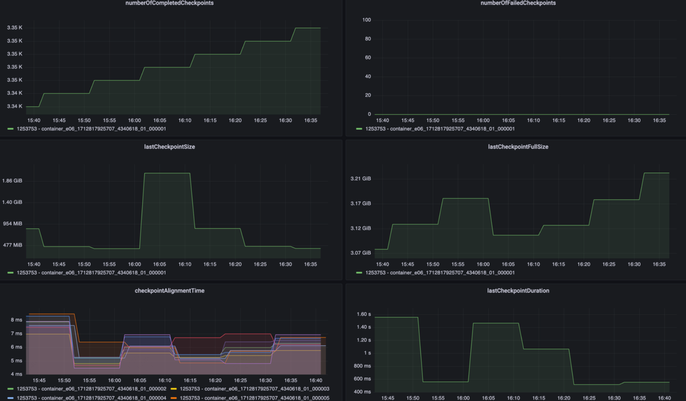

# 监控指标

看数方式：主要就是看尖刺

### State 状态

核心指标：大小、成功/失败数量、对齐时间、制作时间

### Network 网络

核心指标：network buffer

### IO 吞吐

核心指标：1min 延迟、10min 延迟、任务/算子吞吐（numRecordsInPerSecond、numRecordsOutPerSecond）

### CPU

核心指标：JM 和 TM 的 CPU 负载

### Memory 内存

核心指标：TM 和 JM 的堆内/堆外内存

### GC 垃圾回收

核心指标：细分指标可以很多，Full / Young GC 的次数、rate、平均每秒 GC 时长
