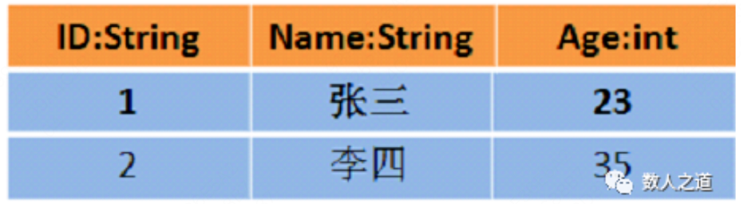

# RDD / DataFrame / DataSet

**Spark数据抽象**

RDD[Person]中两条数据：

DataFrame=RDD[Person] - 泛型 + Schema + SQL + 优化

DataSet[Person]=DataFrame + 泛型 = RDD[Person] + Schema + SQL + 优化

版本更迭：RDD(Spark 1.0) -> DataFrame(Spark 1.3) -> DataSet(Spark 1.6)

RDD优点：

- 编译时类型安全，面向对象编程。
- 内置多种函数操作，方便处理结构化或非结构化数据。
RDD缺点：

- 序列化和反序列化性能开销大。
- 存储在JVM堆内存中，频繁创建和销毁对象，GC开销大。
 

DF优点：

- 保存Schema元数据信息，方便处理结构化数据。
- spark可直接识别数据结构元数据信息，只需要序列化和反序列化数据。
- 保存在堆外内存中，减少了GC次数。
- 优化执行计划，通过spark sql catalyst进行优化。
DF缺点：

- 编译时类型不安全。
- 无法操作域对象，row对象无法转为自定义类对象。
 

DS整合RDD和DF优点：

- 相比RDD，只需要序列化和反序列化数据，降低开销；堆外内存存储，gc友好。
- 相比DF，类型转化安全且面向对象。
- 支持编解码器Encoder，Encoder与堆外内存交互，可以按需访问数据，而不需要反序列化整个对象。