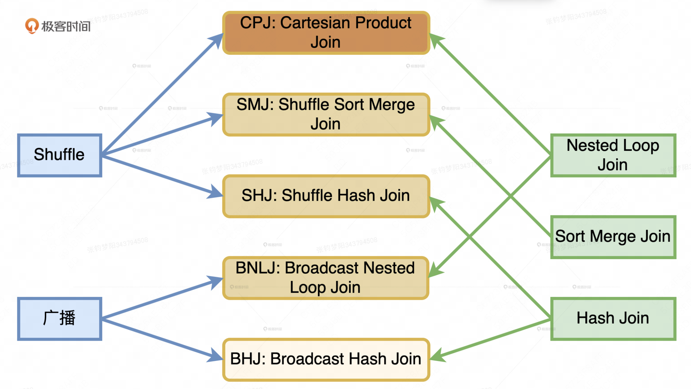
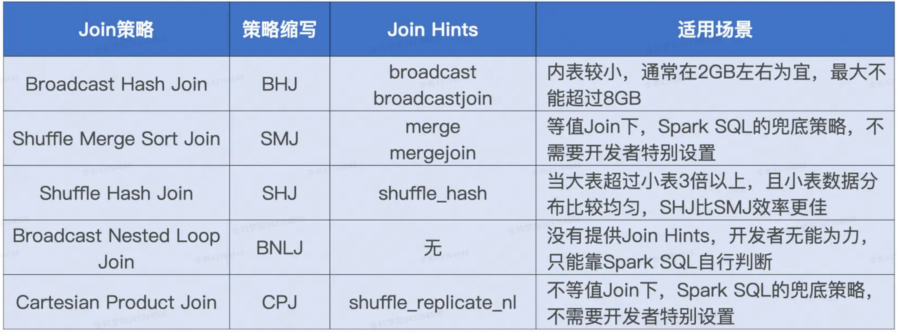

# Spark Join

## 一、Join 类型

Spark3 数据网络分发方式有：Shuffle、广播两种。计算方式有NLJ、SMJ和HJ 3种。两个结合一共能组合出5种join策略。

### 1、Broadcast Hash Join(BHJ)

将小表数据拷贝至Driver端，Driver将小表广播到各Executor，然后根据小表构建哈希表，最后大表与哈希表Join。

使用条件：

- 通过spark.sql.autoBroadcastJoinThreshold限制小表大小，默认10MB。
- 只支持等值连接，不支持full join，因为full join的两个表都需要遍历和查找。
### 2、Shuffle Hash Join(SHJ)

对两张表使用相同的分区函数进行分区，即shuffle，保证相同hash值的数据被分在同一个分区中，然后对分区内小表构建哈希表，最后进行本地hash join。

使用条件：

- 小表大小必须小于spark.sql.autoBroadcastJoinThreshold*spark.sql.shuffle.partitions，也就是小表的每个分区要小于spark.sql.autoBroadcastJoinThreshold，大表必须是小表的3倍以上。
- 只能等值连接，且不支持full join。
### 3、Shuffle Sort Merge Join(SMJ)

对两张表使用相同的分区函数进行分区，即shuffle，在shuffle read阶段对key进行排序，然后对排好序的同一分区内两个表进行merge join。遍历两个表，pa<pb，pa往下走一步；pa=pb，Join成功，pb往下走一步；pa>pb，pb往下走一步，直到遍历完所有数据。

使用条件：

- 连接的key可排序。
- 只能等值连接，支持full join。
- 对表的大小没有限制。
### 4、Cartesian Product Join(CPJ)

笛卡尔积。

使用条件：

- 必须inner join，因为两个表的每条记录都会连接。
- 支持等值和非等值。
### 5、Broadcast nested loop Join(BNLJ)

先对小表进行广播，但不会根据小表建立哈希表，而是for循环遍历小表。

使用条件：

- 支持等值和非等值。
- 性能非常低。
**Join优先级**

等值连接：Broadcast Hash Join -> Shuffle Hash Join -> Sort Merge Join -> Cartesian Product Join -> Broadcast nested loop Join

非等值连接：Broadcast nested loop Join -> Cartesian Product Join 

Spark3.2新特性 push-based shuffle

Spark push-based shuffle 是一种优化 Spark Shuffle 过程的机制，它通过将 Map 阶段产生的数据主动推送到 Remote Shuffle Service（Magnet Shuffle Service），从而提高 Shuffle 效率和数据处理的性能。

在传统的 pull-based shuffle 中，Reduce 任务需要从各个 Map 任务中拉取数据，这可能导致大量的网络传输和磁盘 I/O 操作。而 push-based shuffle 通过提前将数据推送到 Remote Shuffle Service，可以减少 Reduce 任务的等待时间，并且可以利用 Remote Shuffle Service 的合并功能，减少小文件的数量，提高磁盘的吞吐量。

push-based shuffle 的主要特点包括：

1. 数据推送：Map 任务在完成时将数据推送到 Remote Shuffle Service，而不是等待 Reduce 任务来拉取。
1. 合并小文件：Remote Shuffle Service 会将来自不同 Map 任务的小文件合并成大文件，减少磁盘 I/O 和网络传输的开销。
1. 提高效率：通过减少网络传输和磁盘 I/O，push-based shuffle 能够显著提高 Spark 应用程序的性能，尤其是在处理大规模数据集时。
1. 兼容性：push-based shuffle 与 Spark 原生的 Shuffle 机制集成，可以无缝地与其他 Spark 组件协同工作。
1. 稳定性：由于数据被推送到 Remote Shuffle Service，Reduce 任务在获取数据时更加稳定，减少了因网络问题导致的失败。
push-based shuffle 的实现依赖于 Spark 3.2 及以上版本中引入的 Magnet Shuffle Service，这是一个增强的 Spark External Shuffle Service（ESS），可以接受远程推送的 shuffle 块，并按照每个 shuffle 合并。

## 二、Join 优先级

- **等值 Join**：BHJ > SMJ > SHJ
- **非等值 Join**：BNLJ> CPJ

等值join场景下，SMJ的优先级是高于SHJ的。用户数据组在性能优化的过程中使用**SHJ**，取得不错的效果。但SHJ的使用有一些限制条件：

- **外表大小至少是内表的3倍，只有尺寸悬殊到一定程度，HJ的优势才会比SMH更显著**
- **内表数据分片的平均大小要小于广播变量阈值，确保内表的数据分表都能够放进内存**