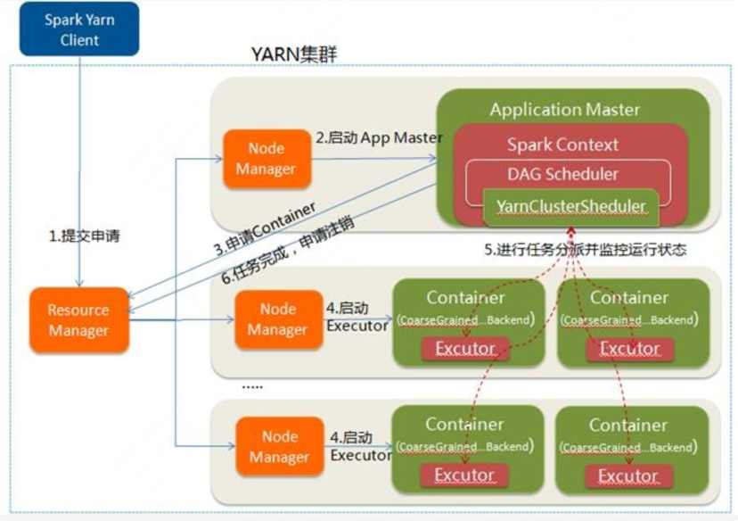

# Spark on Yarn

**8.3、Spark on Yarn**

Spark on Yarn根据Driver在集群中的位置分为两种：Yarn-Client和Yarn-Cluster。

Yarn-Client：

Yarn-Cluster：

区别：**yarn-cluster 适用于生产环境。而 yarn-client 适用于交互和调试，也就是希望快速地看到 application 的输出。**

Yarn-Cluster：Driver运行在AM，负责向RM申请资源，并监督作业运行情况。当作业提交后，就可以关闭Client，作业会继续在Yarn上运行。

Yarn-Client：Driver运行在Client，AM仅负责向RM申请资源运行Executor，Client会和Container通信进行Task调度，Client不能关闭。
