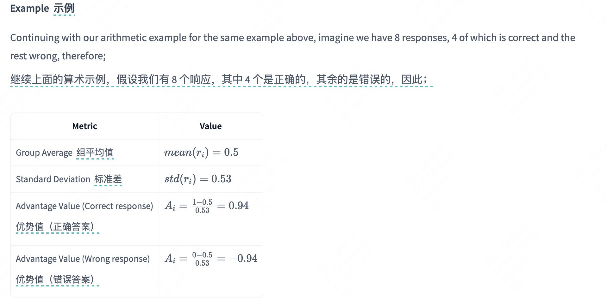
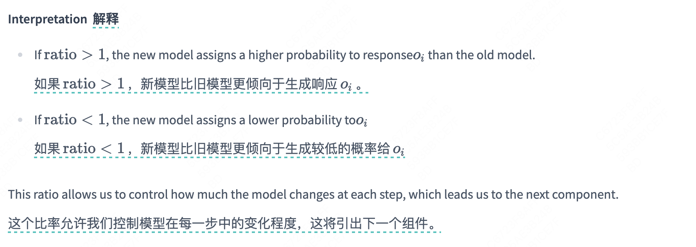

# 3. GRPO 深度理解

让我们深入理解 GRPO，以便改进我们的模型训练过程。

GRPO 通过在生成组内比较模型生成的响应来直接评估模型生成的响应，以优化策略模型，而不是训练一个单独的价值模型（Critic）。这种方法导致了显著的计算成本降低！

GRPO 可以应用于任何可以验证响应正确性的任务，例如，在数学推理中，可以通过将其与真实值进行比较来轻松验证响应的正确性。

在深入技术细节之前，让我们从宏观上了解一下 GRPO 是如何工作的：


现在我们已经有了一个视觉概述，让我们逐步分解 GRPO 是如何工作的。

## GRPO 理论

GRPO 的核心创新在于其同时评估和学习多个生成响应的方法。它不依赖于单独的奖励模型，而是比较同一组内的输出，以确定哪些应该被强化。

让我们详细地走一遍算法的每一步。

### 1、Step 1: Group Sampling  第一步：分组采样

第一步是为每个问题生成多个可能的答案。这创建了一个可以相互比较的多样化输出集。


为了具体说明，让我们看一个简单的算术问题：


### 2、Step 2: Advantage Calculation 第二步：优势计算

一旦我们有了多个响应，就需要一种方法来确定哪些响应比其他响应更好。这就是优势计算发挥作用的地方。

首先，我们为每个生成的响应分配一个奖励分数。在这个例子中，我们将使用一个奖励模型，但正如我们在上一节中学到的，我们可以使用任何返回奖励的函数。

根据正确性（例如，正确响应得 1 分，错误响应得 0 分）为每个生成的响应分配一个 RM 分数，然后计算每个 *ri* 的以下优势值。




这种标准化（即 *Ai* 加权）可以让模型评估每个响应的相对表现，从而引导优化过程朝着优于平均水平（高奖励）的响应进行优化，并抑制那些表现较差的响应。例如，如果 *Ai*>0 ，那么 *oi* 的响应比其组内的平均水平要好；如果 *Ai*<0 ，那么 *oi* 的响应质量低于平均水平（即质量较差/表现不佳）。

对于上面的例子，如果 *Ai*=0.94(correct output) ，那么在优化步骤中，其生成概率将会增加。

在计算出优势值之后，我们现在可以更新策略了。

### 3、Step 3: Policy Update  第 3 步：策略更新

策略更新的目标函数：


这个公式初看可能会让人感到棘手，但它是由几个各自承担重要功能的组件构成的。让我们一一拆解它们。

GRPO 更新函数结合了多种技术以确保学习的稳定性和有效性。让我们逐一检查每个组成部分：

#### 概率比




#### 截断函数


虽然裁剪函数有助于防止剧烈变化，但我们还需要一个额外的保障来确保我们的模型不会偏离其原始行为太远。

#### KL 散度


KL 散度惩罚项使模型的输出接近其原始分布，防止极端变化。而不是朝着完全不合理的输出漂移，模型会改进其理解，同时仍然允许一些探索。

- **KL 散度定义**


- **β参数的作用：**系数 *β* 控制我们如何严格地执行 KL 散度约束
- 更高的 β（更强的 KL 奖励惩罚）：
-  策略更新的更多约束。模型保持接近其参考分布。
- 可能减慢适应速度：模型可能难以探索更好的回应。
- 较低的β（较弱的 KL 惩罚）：
- 更多自由更新策略：模型可以从参考中更大幅度地偏离。
- 更快的适应性但存在不稳定性风险：模型可能会学习到奖励作弊行为。
- 过度优化风险：如果奖励模型有缺陷，策略可能会生成无意义的输出。
原始 DeepSeekMath 论文在此处设置了 β=0.04

现在我们已经了解了 GRPO 的各个组成部分，让我们看看它们是如何在一个完整的示例中协同工作的。

## Worked Example with GRPO

例题：


### 1、Step 1: Group Sampling

首先，我们从模型生成多个响应。


### 2、Step 2: Advantage Calculation

Statistic

Value

Group Average  组平均值

mean(ri)=0.5*mean*(*ri*)=0.5

Standard Deviation  标准差

std(ri)=0.53*std*(*ri*)=0.53

Advantage Value (Correct response)
优势值（正确答案）

Ai=1−0.50.53=0.94*Ai*=0.531−0.5=0.94

Advantage Value (Wrong response)
优势值（错误答案）

Ai=0−0.50.53=−0.94*Ai*=0.530−0.5=−0.94

### 3、Step 3: Policy Update  第 3 步：策略更新

计算概率比：疑问，怎么算的


#### 代码实现

让我们通过一个实际例子把所有的东西放在一起。以下代码演示了如何在 PyTorch 中实现 GRPO。

1. Loading the Model and Generating Responses
```
import torch
import torch.nn.functional as F
from transformers import AutoModelForCausalLM, AutoTokenizer

# Load the model and tokenizer
model_name = "Qwen/Qwen2-Math-1.5B"
model = AutoModelForCausalLM.from_pretrained(model_name)
tokenizer = AutoTokenizer.from_pretrained(model_name)
model.eval()

# Move model to GPU if available
device = torch.device("cuda" if torch.cuda.is_available() else "cpu")
model.to(device)

# Input prompt
prompt = "Solve y = 2x + 1 for x = 2, y = "  # Correct answer: 5
inputs = tokenizer(prompt, return_tensors="pt", padding=True)
input_ids = inputs["input_ids"].to(device)  # Shape: (1, prompt_len)
attention_mask = inputs["attention_mask"].to(device)

# Step 1: Generate 8 responses (B = 2 groups, G = 4 responses per group)
batch_size, num_generations = 2, 4
outputs = model.generate(
    input_ids=input_ids,  # Shape: (1, prompt_len)
    attention_mask=attention_mask,
    max_new_tokens=1,  # seq_len = 1 (single token per response)
    num_return_sequences=batch_size * num_generations,  # 8 responses total
    do_sample=True,
    top_k=10,
    temperature=0.7,
    pad_token_id=tokenizer.eos_token_id,
    return_dict_in_generate=True,
    output_scores=True,
)
```

输出类似：

Output 1: 5.0

Output 2: 6.0

Output 3: 7.0

Output 4: 5.0

Output 5: 10.0

Output 6: 2.0

Output 7: 5.0

Output 8: 5.0
