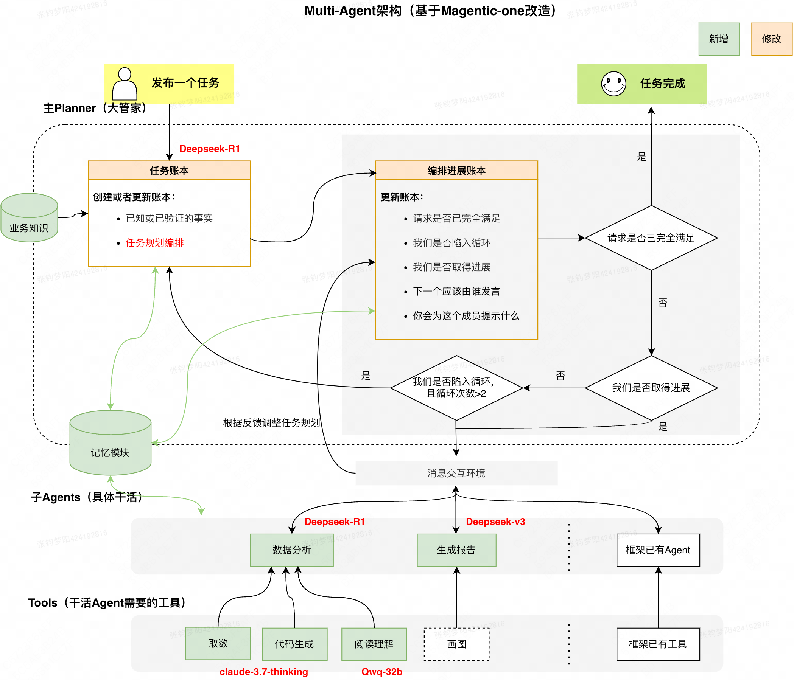

#  Multi-Agent 节假日

更多指的讨论的点：长期应该由 report agent 来调用取数，写着写着发现数据不够，也回不去了，随着写报告的过程也是深入思考的过程，中间是需要取数的

**多 Agent 系统做到极致就是仿生学、社会学**

- 取数问题
- 口径问题
- 对齐偏好
- 分析路径
- 技术本身的问题：框架、工程、包括记忆
**复盘总结：**验证了多agent框架在节假日分析场景的效果，初步证明使用**商用开源模型结合工程化手段**基本可以输出一个接近L6BA水平的分析报告。针对这次探索暴露出的问题，接下来会联动算法和工程，升级框架能力（并行及记忆模块），强化LLM的表格分析能力及规划能力（微调等后训练手段）。讨论未来泛化需要做功点和实践过程中的认知迭代。

# 一、背景和目标

现阶段，对于固化类的场景（xBR异动分析、播报等），已实践证明可采用工作流编排的方式来为业务提效（住宿在业务小助手平台已沉淀730+工作流，覆盖战役播报、周报月报、销售定策略及xBR监控分析等各类场景），工作流编排的好处在于：将复杂问题人为拆解成多个节点，并编排成工作流，执行稳定，结果可解释。但其弊端也很明显：有学习成本，依赖人梳理SOP，需要时间配置。

对于非固化类场景，分析思路不固定，即无法通过工作流编排的方式来穷举分析路径，对于这类场景，业务也不希望千篇一律地按照固有思路去分析，更希望借助LLM的能力，来启发式地给一些建议和策略。对于业界有几个比较知名的开源框架：MetaGPT、AutoGen、LangGraph等，但是司内司外尚未有最佳实践。为此我们亟需探索LLM自主规划并完成复杂任务的范式，并积累经验。

# 二、关键结果

**目标：以节假日场景为试点，结合工程化手段来探索模型的能力边界。驱动升级框架能力，扩展工具，不断打磨效果，为未来进一步泛化到其他分析场景铺路。**

核心能力/依赖项：

- 取数：有 nl2param 和 nl2sql 两种，前者是依赖指标管理平台，基于数据模型构成的数据应应用进行查询；后者是直接走物理表查询。
- 分析：强依赖于模型本身的能力，涉及到多种分析方法，详细见提示词
核心难点：都能展开讲讲

- 工具
- 框架
- 效果
- 技术选型：怎么做的？框架怎么选的？模型怎么选的？怎么评估好不好，都考虑了哪些因素？
- 分析能力的分级：
- 响应式：问啥答啥，就是 chat，类似于现在很多 paperchat，本质上是指令导向的。
- 理解式洞察：问了啥，在此基础上提供更多的帮助，能合理拆解问题，结合模型和工具的多种能力完成一次洞察任务，这种是目标驱动的。
- 辅助建议式：这种有一些助手的雏形，除了对事实的洞察和基础的分析以外，能结合多种信息源对复杂问题做出推断和决策，比如分析场景根据外部 search 的一些结果中热点信息去推断峰值变化的归因、包括说根据社会热点能做到预测下一波的热点，能给出有效建议
- 经验决策式：具备丰富领域认知，不仅能通过数据知道当前的表现怎么样，比如 yoy 怎么样，还知道历史的经验一般 yoy 怎么样，一般情况下哪个高哪个低，是不是有些不符合预期，以及可能的原因是什么。
- **对标L6商分能力矩阵**，通过90%简单题+10%困难题构成的评测集考察模型表现，当前**评测得分在70分左右**（春节70分、五一可评测项中各项得分略优于春节、清明暂未经最新模型实验）。区分4大能力项来看：
- 数据准确性（100分）：在商分可接受的数据源差异和基期差异范围内，模型可做到基期选择和指标统计完全准确；
- 分析覆盖度（77分）：核心指标召回较为全面（85%+），**核心维度召回不全**（～50%），单次执行时交叉分析和维度下钻次数受限、输出不稳定；
- 业务洞察力（33分）：趋势性洞察数量丰富但有效召回不足（～50%），贡献性洞察有但丰富度不足（<20%），关联性洞察基本没有（0%）；
- 文档可读性（100分）：模型可做到稳定输出分析所选当期和基期，同时按照总-分结构输出报告。
评测框架也可以仔细整理，思考如何去评估，如何量化：https://km.sankuai.com/collabpage/2706563565

- 评测标准
- 测评集建设：如何沟通对齐，如何建设，有哪些方面的问题
- 自动化测评
关键迭代/实验： planner、子 agent、summary

- 偏离主题
- 上下文
- 工具问题
- 通信问题
- 记忆模块：为什么需要记忆，遇到了什么问题？最初是上下文过长，不是想记住什么东西，而是想忘掉过去，但是有需要保留关键信息，就需要摘要和压缩。最后选择的是裁剪
# 三、框架架构

架构说明：

1. 层级上分为主Planner、子Agent和工具三层，工具绑定到子Agent上，主Planner调度子Agent完成任务，三者可以通过记忆模块共享必要记忆，过滤无用信息。
1. 对于涉密数据及知识，均使用Friday本地部署的商用开源模型。按照任务类型不同，选择规划和分析能力更强的Deepseek-R1模型支持主Planner和分析子Agent；选择速度更快的Deepseek-V3模型来做最终文档的整合和撰写。
1. 分析子agent中大模型对于工具调用（function call）结合分析过程中推理总结能力有Gap，因此将分析agent 抽象成 取数、代码生成等节点以及用于专门做表格分析的推理工具
# 四、核心组件

## 4.1、planner

主Planner 在框架中扮演着“**大管家**”的角色。其核心是将用户复杂的分析请求转化为一份清晰的、可执行的“任务账本”， 它可以将具体的任务分发给各子Agent，并参照动态更新的“编排进展账本”来引导、监控和调整整个分析流程，确保多步骤、多维度的分析任务能够系统、高效且准确地完成**，**并最终交付一个全面“分析报告”。

**主Planner主要功能如下：**

1. **准备与知识获取**：接收用户请求后，Planner 会查询知识库，获取与请求相关的指标定义、分析方法等背景信息，为后续制定任务清单提供专业支持。
1. **任务清单的制定**：基于用户请求和获取的知识，Planner 会引导LLM制定一份结构化的、多步骤的“**任务账本 (Task Ledger)**”。这份账本是整个分析任务的行动指南，明确了各分析步骤的主题和关键指标。
1. **执行与监控：**** **任务清单账本一旦确立，Planner 就转入执行指挥与监控阶段；它会参照“**任务账本**”中当前待执行的步骤，决定下一步应由哪个智能体（专项分析子Agent 或 报告生成子Agent）承接工作。然后，它会向选定的智能体发出明确、聚焦的任务指令；Planner 会持续维护一个“**编排进展账本 (Progress Ledger)**”，动态记录任务的执行历史、当前状态（是否按计划进行、是否有进展、是否遇阻等）。
1. **调整与优化（修正任务）**：若“编排进展账本”显示执行不畅或任务清单不再适用，Planner 会启动调整。它会引导LLM分析问题原因，并据此**修正**“任务账本”或**制定新的**执行策略，以克服障碍。
## 4.2 数据分析Agent

该Agent负责应对每个专题的分析报告生成，可调用三种工具：取数工具(get_data)、代码工具(python_code)和表格分析(table_analysis)。

对于涉及复杂工具链调用、复杂分析逻辑的场景，模型能力有限，具体现象是随着分析层级变深，指令遵循能力明显变差。核心问题主要体现在三个方面：

1. **LLM复述能力欠缺**：对要求精准性极高的分析场景，对表格错误容忍程度极低。而经过大量对比实验，我们发现LLM 并不擅长复述表格和大段文本[001-表格处理&复述能力实验](https%3A%2F%2Fkm.sankuai.com%2Fcollabpage%2F2709803764)。因此我们采取单独解读表格的处理方式，并对比了多种模型的解读效果[009-table 解读能力对比](https%3A%2F%2Fkm.sankuai.com%2Fcollabpage%2F2710079126)，实现数据解读的可信度和专业度。
2. **工具调用以及解读效果变差：**输入过长后，数据分析Agent调用Tool 时会出现大量幻觉，以及无依据的计算或分析：

--->"query":"对bi_query_75cc4fa4.xlsx文件执行以下操作：1.计算各BU的DAU贡献度=日均DAU(2025.5.1-5.5)/SUM(日均DAU) 2.计算交易频次=日均支付订单量/日均DTU 3.**流量质量指数=0.4*访购率+0.3*用户ARPU+0.3*交易频次** 4.筛选条件：DAU贡献度>5% & 实付GTV爆发系数>1.2 5.按流量质量指数倒序排列取TOP5，输出[业务BU,DAU贡献度,流量质量指数,实付GTV爆发系数]四列"

解决方案是减少 system prompt 的长度，为此我们使用消融 prompt 的方式，在不降低效果的前提下，尽可能减少 system prompt 的长度，例如[006-子Agent Prompt 消融](https%3A%2F%2Fkm.sankuai.com%2Fcollabpage%2F2710134308)，经过上述优化 system prompt token 数量大幅降低（3w -> 1.5w），整个项目中进行多次prompt消融，保证 system prompt 长度不会过长。

3. **上下文堆叠导致分析崩溃现象**：分析崩溃会使多 Agent 系统直接不可用。而且经过实践发现，这种“崩溃”会随着ReAct进一步变差，因此难以通过提示手段或反思机制来解决这种问题，唯一的方式是减少 user context，使模型不会因过长上下文而失控。解决方式是减少内循环和外循环的 user context 长度。

存在分析崩溃现象：

- **减少外循环  user context 长度**：我们配合工程尝试了多种上下文处理方式，包括基于规则的裁剪、基于 LLM 的上下文压缩、结合裁剪+压缩等。在节假日场景中，不同章节之间分析相对独立，比如交易主题数据通常不会和流量主题数据重复分析，而是分别分析，基于这种共识，我们对数据分析Agent的 每一轮任务分析前，清空所有历史上文，这样保证了避免因 user context 输入过长导致初始时分析崩溃。
- **减少内循环  user context 长度**：我们发现随着工具调用次数增多，消息会不断堆叠导致分析效果显著变差，因此也对历史工具调用的消息例如 JSON、失败消息等进行了裁剪，仅保留有效的如数据描述信息。
## 

“生成报告Agent ” 采用了一种分阶段、模块化、逐步精炼的工程方法，以确保最终输出报告的质量。这里是落地过程中的一个**典型Trade-off案例，牺牲部分泛化性，而强化生成报告的效果**。

## 4.3 生成报告 Agent

“生成报告Agent ” 采用了一种分阶段、模块化、逐步精炼的工程方法，以确保最终输出报告的质量。这里是落地过程中的一个**典型Trade-off案例，牺牲部分泛化性，而强化生成报告的效果**。

- 为什么要使用工程化手段来保障报告的生成效果，而非利用LLM的总结摘要能力写报告？
1. **数据处理能力：模型处理长上下文能力弱***（各独立分析子报告汇总后长度过长）*
1. **信息丢失：**LLM在一次处理中能够有效编码和理解的输入文本长度（即“上下文窗口”）是有限的。当输入的子报告总体量过大（数据表过多），超出此窗口限制时，模型可能无法完整、准确地保留所有输入信息，尤其是较早输入的内容，从而导致最终报告在内容覆盖上出现遗漏或偏差。
1. **数据幻觉**：在处理大规模、高信息密度的输入时，LLM存在一定概率生成与源数据不符、缺乏依据甚至凭空捏造的内容，这种现象被称为“幻觉”。对于以事实为基础、追求高度准确性的分析报告而言，任何形式的内容失实都是不可接受的。
1. **数据输出能力：模型输出长文本能力弱**
1. **无法控制模型输出长度：**LLM单次调用所能生成的文本长度通常存在一个实际的上限（实践发现，我们拿到3篇2K字的报告，要求模型汇总输出一个7K字的报告，但是实际上模型只能输出3K字）此外：对于需要生成篇幅较长、分析层次较深、结构复杂的综合报告，单一、泛化的指令难以精确控制其输出达到预期的篇幅、细节丰富度、逻辑深度和章节编排。此外，LLM的本质其实是一个“概率模型”，在进行长文本输出时，越到后面幻觉的可能会越大。
1. **缺乏精细化的结构规划与风格定制能力**：一份高质量的综合报告往往需要清晰的章节布局、统一的论证风格、明确的逻辑主线和突出的核心观点。简单的“整合并总结所有输入”这类指令，不足以引导LLM自主完成如此精细的报告规划和内容定制。
“生成报告Agent” 利用大模型的**规划能力**将一个复杂、庞大的报告生成任务，拆解为一系列更小、更易于管理、更可控的子任务。逐章节产出符合预期的中间结果，最终汇集成高质量的综合报告。

最难的难点在于：符合预期，也就是与人类的偏好对齐。

最后这个项目好不好，能不能用，分析够不够足够有洞察力，足够有见解，是否对BA 真实有用，都是基于除了分析过程、跟写的风格也密不可分。

流程详解：

1. **准备阶段：**收集生成完整报告的所有原材料（各个表格分析的输出，即子报告）。
1. **子报告摘要化**：对每一份输入的子报告，引导LLM提炼出包含**核心主题、关键发现和数据范围的结构化摘要**。
1. **章节结构设计：**拥有全局视角，确保报告的逻辑性和完整性，并为后续每个章节确定依赖的原始“子报告”。
1. **逐章节生成报告：**
1. 对于**专题章节**，在生成其内容时，会向LLM提供**两个核心的上下文输**入：
1. **已生成的上文内容**：即当前章节之前所有已完成章节的文本。
1. **本章节所依赖的原始子报告**（归属关系由“章节设计”确定）
1. **“后置生成”摘要**：**借鉴了人类专业写作的常见实践，**从直觉上看，人类自己本身通常也是在完成主体内容的撰写和梳理后，才回过头来撰写能够精准概括全文并吸引读者的引言或摘要。
1. **集成与输出**：将前序步骤中独立生成的各个组成部分按照预定的逻辑顺序和格式规范进行拼接组合。作为整个自动化报告生成流程的收尾环节，它将所有经过模块化、精细化处理的优质内容片段，整合成一份结构完整、内容连贯、格式统一的最终交付成果。
## 4.4 工具

# 五、算法方面

根据多Agent框架方案及初步摸底，优先优化核心分析子agent模块，目标建设能够端到端思考、工具调用、反思的推理模型，内化节假日分析业务知识，减少框架prompt工程。

完成模型训练路径从报告撰写能力->端到端分析推理能力迭代，在分析子agent评测上超越deepseekv3、qwen3-32b模型，端到端评测逼近目前最好商业模型版本。

# 六、现存问题及优化方向
