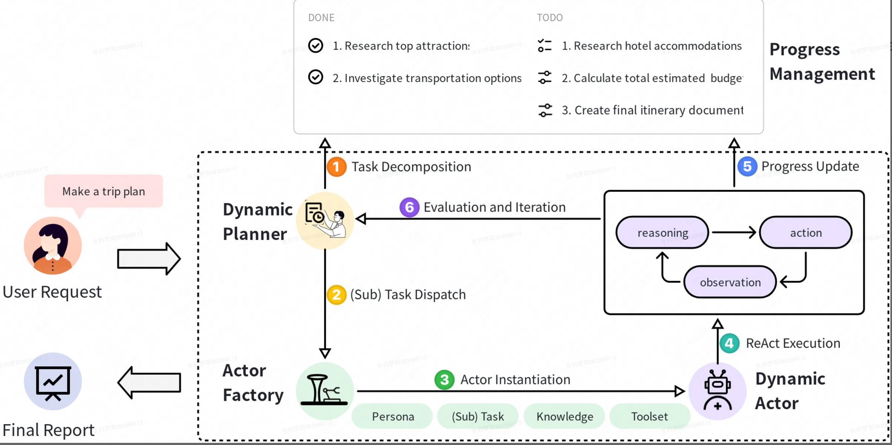

# Aime 框架调研

# 引言

随着大语言模型（LLM）技术的快速发展，基于LLM的智能体系统已成为解决复杂多步骤任务的重要范式。传统的多智能体系统（MAS）主要采用"计划-执行"（plan-and-execute）框架，但这种静态的工作模式在面对动态环境时存在显著局限性。AIME基于字节跳动团队提出的（Towards Fully-Autonomous Multi-Agent Framework）框架构建，通过引入动态规划和执行机制，为多智能体协作提供了全新的解决方案。

# 传统多智能体系统的局限性分析

### 2.1 传统Plan-and-Execute框架的问题

传统的多智能体系统通常采用三阶段工作流程：

1. **全局规划**：规划者智能体分析用户请求并分解为结构化子任务
1. **任务分配**：根据执行者智能体的预定义能力分配子任务
1. **执行与反馈**：执行者完成任务并报告结果
这种模式存在三个核心问题：

**刚性计划执行**：一旦制定计划，规划者在执行期间保持空闲状态，无法根据实时反馈调整策略。这类似于传统的瀑布式软件开发模型，缺乏敏捷性。

**静态智能体能力**：智能体被限制在预定义的角色和工具集中。例如，在AutoGen框架中，一个"代码审查员"智能体只能执行代码审查任务，无法动态扩展为"调试专家"。

**低效通信机制**：智能体间的信息传递容易导致上下文丢失，缺乏集中式状态管理。这在LangChain的多智能体实现中尤为明显，智能体间的状态同步依赖于消息传递，容易出现信息不一致。

### 2.2 与现有框架的对比分析

相比于现有的多智能体框架：

- **AutoGen**：提供灵活的对话模式，但智能体角色相对固定
- **LangGraph**：支持图状工作流，但规划阶段相对静态
- **LangChain**：提供丰富的工具集成，但缺乏动态智能体实例化机制
AIME框架的创新在于将静态的规划-执行分离转变为动态的协作模式。

# AIME框架核心设计理念

### 3.1 动态适应性原则

AIME的核心设计理念是**动态适应性**，即系统能够根据实时执行反馈和进度更新，持续调整任务分配和智能体能力。这种设计类似于敏捷开发中的迭代式方法，强调响应变化胜过遵循计划。

### 3.2 四大核心组件

AIME框架由四个核心组件构成，形成一个有机的协作生态系统：

1. **动态规划器（Dynamic Planner）**：动态规划器是任务管理的中央协调者。它将高级目标分解为可执行的子任务分层结构，并维护一个全局任务列表以跟踪每个子任务的状态。它持续监控执行进度，并根据动态执行器和进度管理模块的状态更新动态调整计划。
1. **智能体工厂（Actor Factory）**：负责根据特定子任务需求实例化专门的Agent。在接收到子任务后，工厂分析其规格以确定Agent的最佳配置。此过程包括选择合适的角色、相关的知识库以及必要的工具集。工厂随后使用定制的提示和系统配置组装Agent，确保每个Agent都为其分配的任务量身定制。
1. **动态智能体（Dynamic Actor）**：使用ReAct执行被动态规划器分配的特定子任务。
1. **进度管理模块（Progress Management Module）**：进度管理模块作为系统级协调的共享内存和中央状态。它维护整个任务层次结构的结构化表示以及所有子任务的真实状态。这个中央记录确保动态规划器和所有参与者对进度的理解保持一致。关键在于，通过在每个任务条目中嵌入明确的完成标准，该模块为验证任务完成提供了清晰和客观的标准。

# 技术实现详解

### 4.1 动态规划器（Dynamic Planner）

#### 4.1.1 核心工作机制

动态规划器的核心创新在于将战略规划与战术执行融合在单一迭代过程中。其工作机制可用以下公式表示：

**参数含义**：

#### 4.2.2 工具包选择策略

AIME采用**工具包束**（Tool Bundle）的概念，而非单一工具选择。这种设计类似于现代IDE中的插件包管理：

- **WebSearch Bundle**：包含搜索引擎API、网页解析、信息提取工具
- **FileSystem Bundle**：包含文件读写、目录操作、格式转换工具
- **CodeExecution Bundle**：包含代码运行、调试、测试工具
核心是封装成一系列工具集

#### 4.2.3 动态提示生成

系统提示的动态组装公式为：
