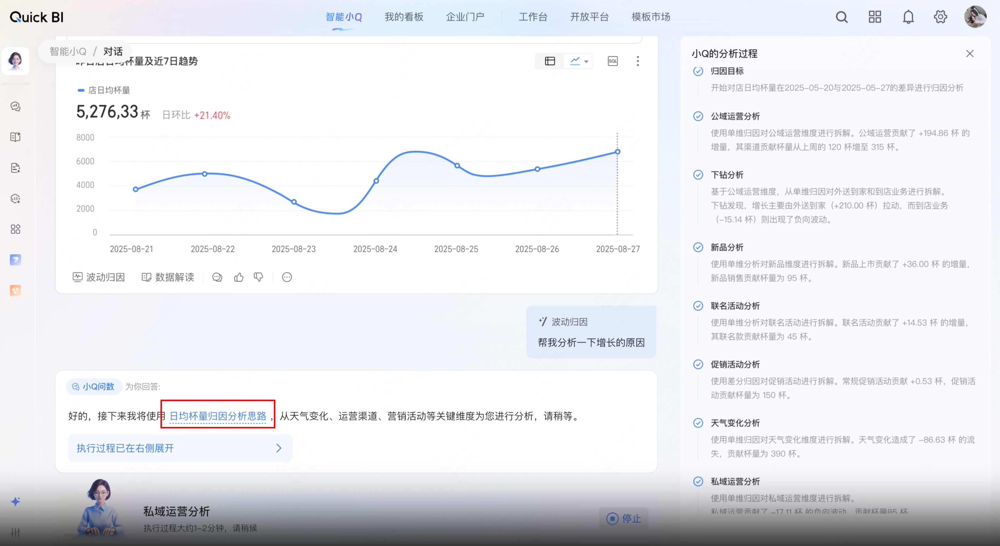
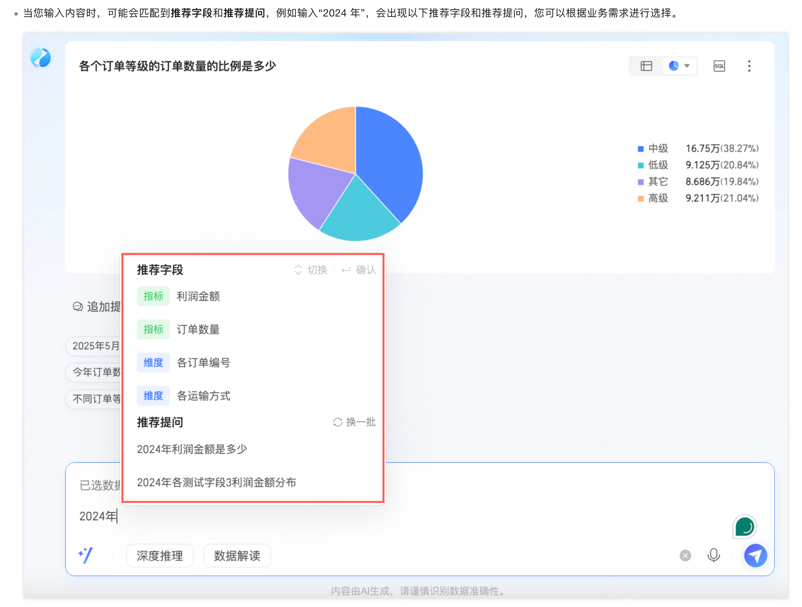
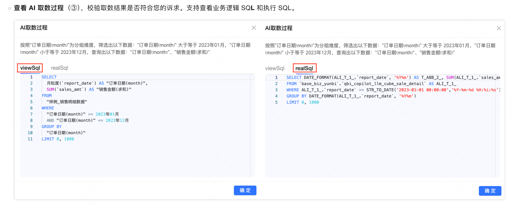
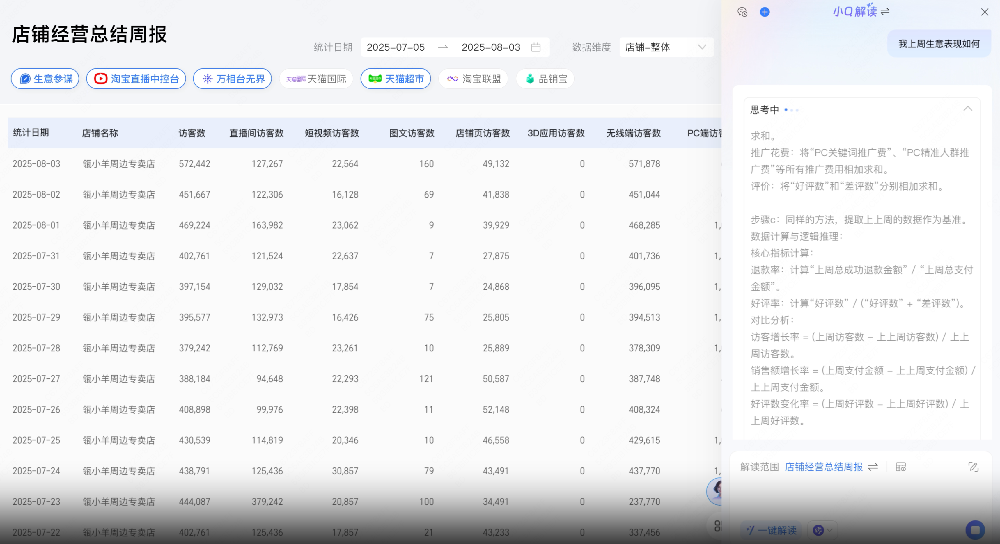
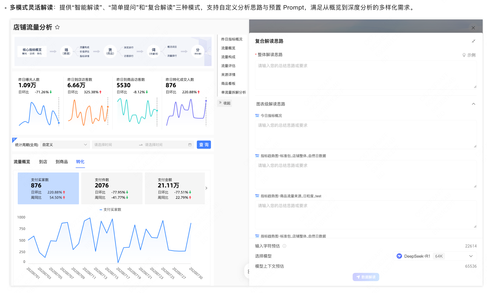
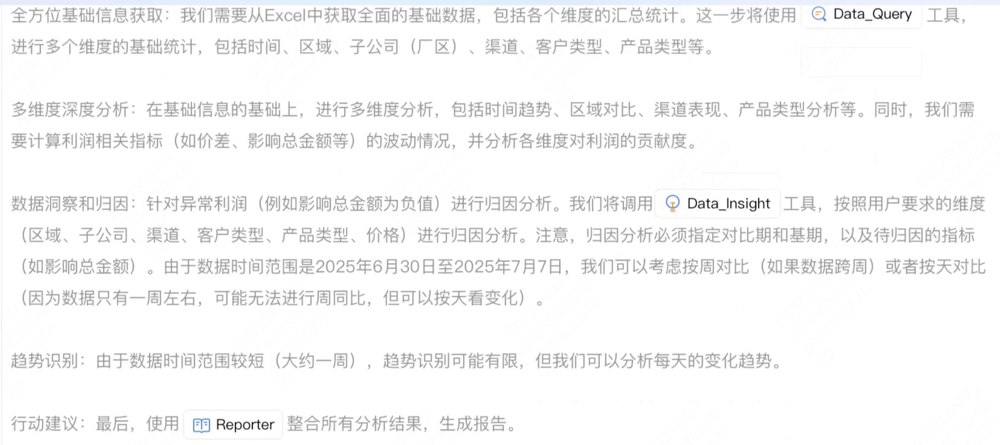
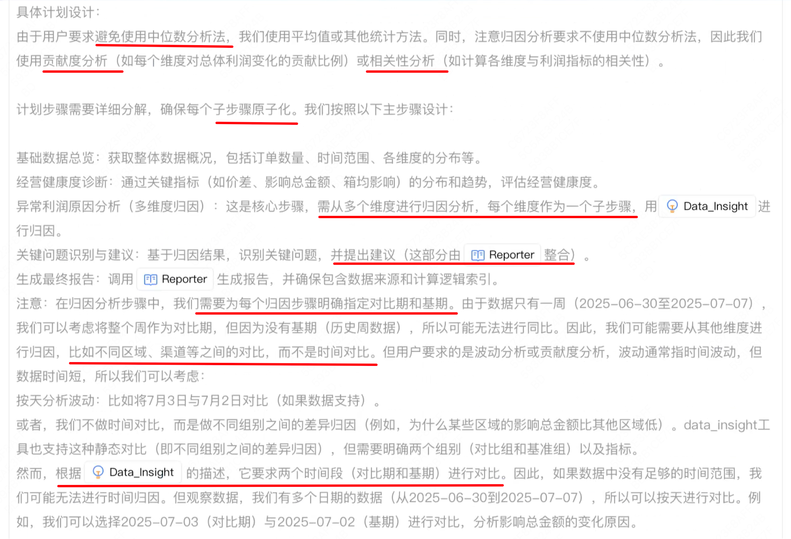
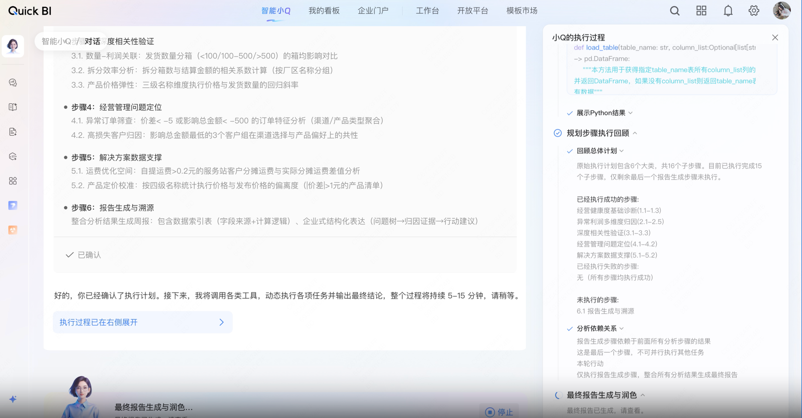
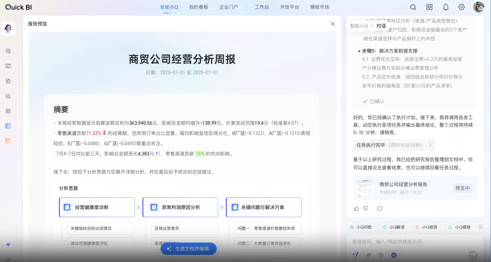
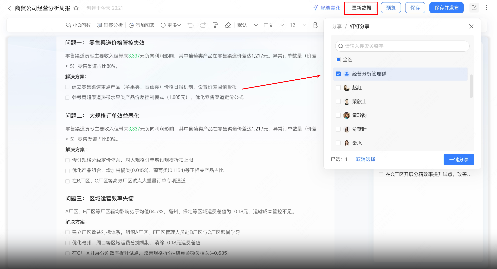

# 阿里 data agent 调研

智能小Q是Quick BI集成多种大模型和Agent能力的增值服务模块，通过一系列AI功能如**小Q问数Agent**、**小Q解读Agent**、**小Q报告Agent**、**小Q搭建Agent**革新了整个BI的数据分析链路，帮助用户实现数据分析的智能化与个性化。用户能够通过自然语言交互进行数据提问和数据解读，一键快速生成数据报表和数据报告。同时智能小Q支持自动化数据洞察、AI助手编辑调整报告、多轮对话深入分析、深度数据分析解读与自定义AI服务管理。

# 一、问数能力拆解

小Q问数使用户能够通过自然语言交互，直接获取数据结果，实现数据即问即答，人人都可上手分析数据，牵引数据消费新方式。您可以在**PC端**或**移动端**的智能问数对话界面**预览和选择数据集**、在提问框内直接输入问题提问或快捷提问并进行**多轮对话**、在**对话列表**中查看历史的智能问数对话等。

**应用场景**：

- **快速取数**：问答高效获取数据，释放取数压力，快速响应领导的各种问数诉求。
- **洞察数据异常**：从报表或数据文件中识别异常数据，并进一步自动下钻发现异常的详情源自于更细分的对象（如利润月度异常可拆解识别客户等）。
- **波动归因**：基于不同时间周期的指标波动对比，从不同视角分析引起波动的原因，呈现不同的贡献度，从而定位和明确可采取的行动方向。
能力项

截图

实现方式分析

目前分析框架是否具备

分析思路召回

包含预设分析思路，大概率通过 RAG 召回的方式匹配适用的**分析模板。**

然后根据分析模板对任务提供 COT 引导

关键词：

- 日均杯量分析思路
归因方式：

- 下钻分析
- 单维分析
- 差分分析
否

数据洞察层（report 前先洞察）

会先过一层 LLM 总结，然后才开始生成报告，相当于先总结数据中的关键小结论，然后给出大结论。

报告只负责写好报告，不担任任何分析职责。

有一定参考价值。

否

报告可读性 + 可编辑 + 可对话交互

- 报告为 HTML
- 可以一键生成文档并编辑
- 右侧仍然有对话框，推测可以继续提出报告修改建议
否

数据学习

前提准备：

数据集的字段质量对于问数准确性的提升至关重要，在开启前，您可以根据以下提示再次检测自己的数据集：

- **优化字段命名**
- 字段的命名应该清晰易懂，有助于模型理解和处理，避免复杂或模糊的表述。
- **提供详细字段描述**
- 为每个字段添加描述信息，以便模型更好地理解其含义和用途。
- **谨慎开启占位符**
- 占位符配置可能影响问数结果，开启问数前，建议您关闭占位符。
- **丰富知识库信息**
- 在知识库管理中添加和编辑当前数据集的额外知识，以帮助大模型更好地理解用户意图。
可能是预先加工好关键的元数据信息，包括每一行每一列的统计信息。

行动：

- 自动添加别名
知识库管理

知识库用于配置企业内知识和用词偏好，配置后，模型会学习该知识并将其用于数据获取和分析。支持对**业务逻辑**、**正则匹配**规则进行配置。

- 黑话改写
归因分析

全部用户自己决定，优先归因的维度

推荐提问

其他

语音交互

 SQL

# 二、解读能力拆解

小Q解读，结合大模型的能力，能够有效帮助用户解读仪表板背后的信息，从而实现更深刻的洞察。例如，作为某公司销售部门的数据分析师，您需要对本年度的销售数据进行整体分析，可以通过一键智能解读功能来实现；如果除了对本年度的销售数据进行全面分析外，您还需要对各项指标进行更深入的洞察与剖析，此时您可以针对多个图表进行更加细致的数据解读。

**应用场景**：

- **报表分析**：针对仪表板的数据，希望利用DeepSeek给我解读；针对周月报中数据，生成指定格式的洞察分析，辅助完成指定格式的洞察分析。
能力项

截图

实现方式分析

目前分析框架是否具备

解读计划生成

对应 writer 的解读能力

否

数据处理

暂不清楚实现方式，以下两种之一：

- tool 工具调用计算
- CoT 计算简单数据
关键流程：

- 提取日期列
- 定位关键指标，提供计算公式
- 关联性推理

否

解读报告

- 核心问题还是数据是怎么计算的，正常应该有工具调用才可靠
是

报告对话 & 运营建议

一看就没什么用，非常虚，大概率没有分析思路，完全由 LLM 自己发挥。

是

多种模式

- 支持固化和非固化
- 可以灵活探索，也可以直接填入 prompt
如果我们的 prompt 模板对应到复杂模式，同时支持自由探索模式，就对齐了。

# 三、报告能力拆解

小Q报告功能将传统的人肉找数据、手工分析、截图整理等繁琐且耗时的报告编制流程，转变为智能数据获取、自动化洞察、动态数据引入的智能化报告生成体验。

作为可编辑的在线分析文档，无论您是需要制作周报、月报等周期性报告，还是需要快速获取一份经营分析报告以支撑决策，都可以使用小Q报告，实现从传统的人工数据分析向智能化数据决策的升级。

**应用场景**：

- **活动营销**：公司的活动运营人员，在策划本次618促销方案时，需要通过参考公司上季度促销活动的数据结果及活动表现，来制定本次促销方案。
- **经营分析**：公司的财务分析人员，每个月都需要制作月度经营分析报告，用于在月度经营分析会中支撑公司业财决策，提供以数据为基础的深度洞察，从而使决策层无需在冗长的报表中寻找关键信息，就能快速对公司核心财务问题有清新的认知。
- **客户拜访**：公司的销售人员，需要在拜访客户前制作一份拜访报告，复盘客户情况、合作情况等关键信息，帮助制定更有效的拜访策略和建立更紧密的客户关系。
能力项

截图

实现方式分析

目前分析框架是否具备

数据上传

- 支持 word 作为格式参考
- 支持 Excel
word 作为临时格式参考这个很有参考意义，相当于直接更改了分析报告生成的风格。

这意味着内部的分析 SOP 非固化。而是由用户提供。

部分具备

工具

- 报告工具（对标）
- 取数工具（对标）
- 数据洞察（缺失）

推断：

1. 把取数和 code 工具合并为一个了（用于数据查询和指标运算）
1. Data insight 用于归因，推断可能对应 问数能力 中的数据洞察层
部分具备

双层计划推理（粗粒度 + 细粒度）

粗粒度：

细粒度：

细粒度归因推理中依然有很多模糊或者矛盾存在，应该表现也不会好。

但是直接生成细粒度规划的思路可以考虑借鉴。

核心结论：

- demo 场景偏简单
- 不存在硬性要求的固化分析思路
换句话说，**用户不像 BA 这么专业，给一份差不多的分析报告用户就会比较满意，而且也有一定作用**。

否

计划可干预

- 计划可干预，修改后直接执行
- 无二次生成或者多次修改的途径，都是单次干预。
是

计划执行

- 这个流程类似确定 DAG plan，确定依赖关系
- 中间数据处理全部由 python 执行
 报告生成 + 报告编辑

- HTML
- 类似夏战场景，更新数据可重新执行
- 支持分享 todo
编辑能力非常强大，内嵌 AI，对标学城：

[文档编辑_智能商业分析 Quick BI(Quick BI)-阿里云帮助中心](https%3A%2F%2Fhelp.aliyun.com%2Fzh%2Fquick-bi%2Fuser-guide%2Fdocument-editing%3Fscm%3D20140722.H_2950244._.OR_help-T_cn~zh-V_1)

 否

# 四、搭建能力拆解

能力项

截图

实现方式分析

目前分析框架是否具备

报表搭建

对应部分魔数能力

否

否

否

# 五、后训练

不是简单的 SFT 或者 DPO 注入知识或者工具调用能力，而是专注多任务混合训练。

比如 Agent 调用 tool 的轨迹，以及不同任务的解决任务的能力，相关论文如：https://arxiv.org/abs/2504.20073
