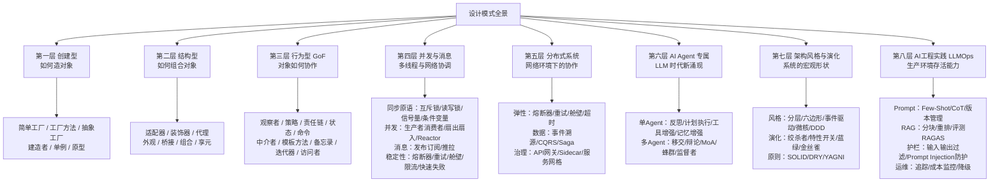
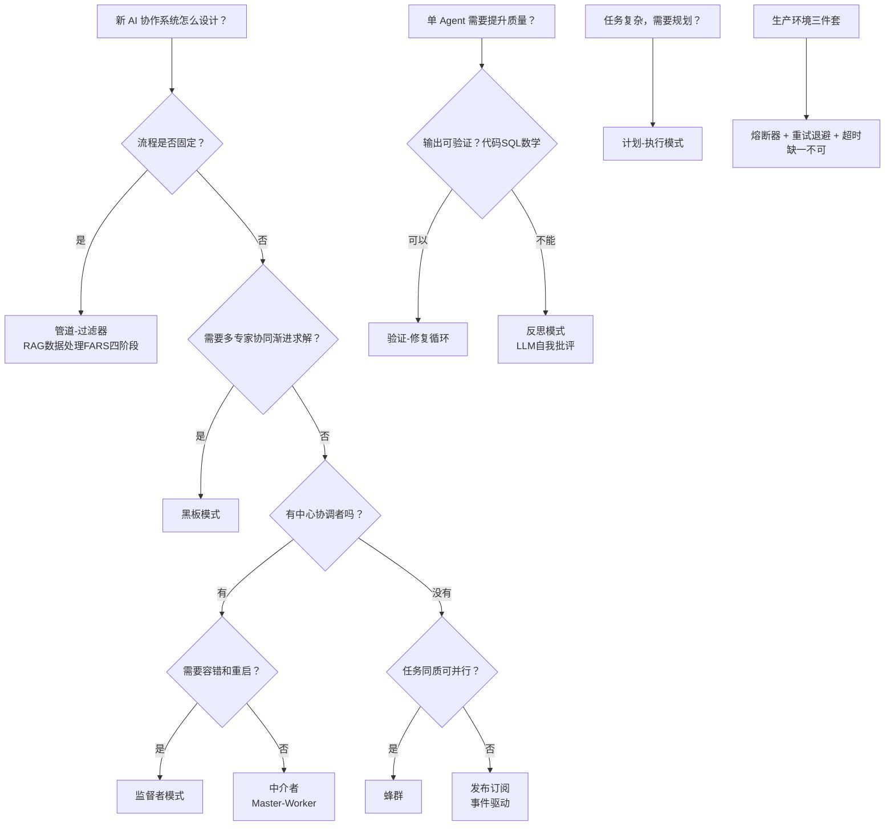
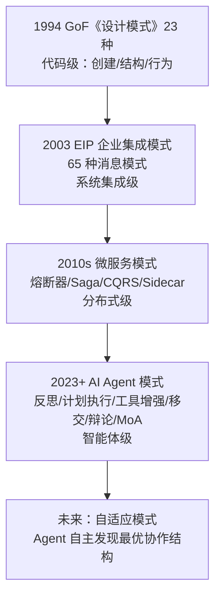
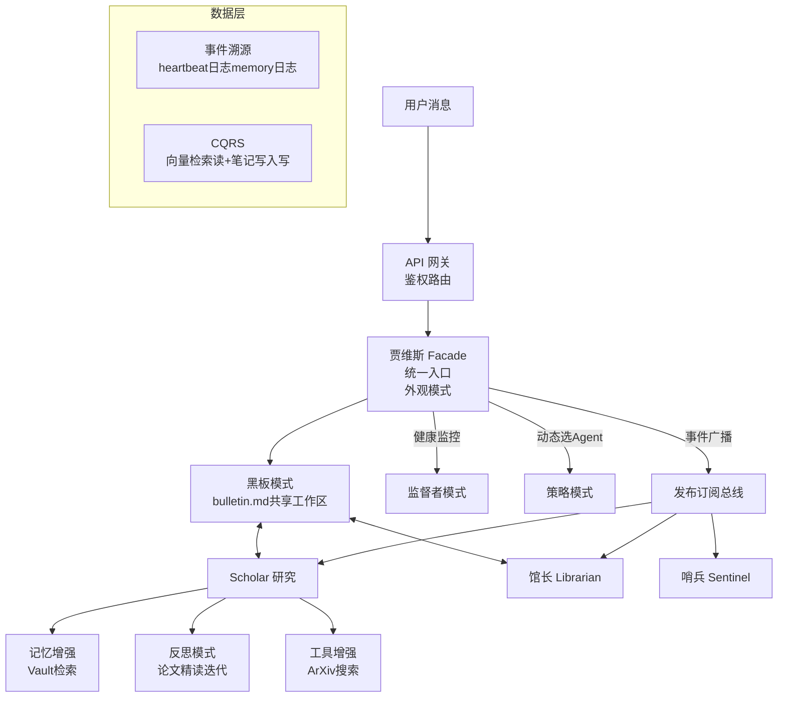

# 设计模式总览

> **目的**：建立架构师视角的思维工具箱。
> 每个模式是**一个经过验证的、解决特定问题的思路**。
> 理解它们，就是掌握系统设计的共同语言。

---

## 完整体系

---

## 文件导航

- [[01-创建型模式]] — 工厂 / 建造者 / 单例 / 原型（6个）
- [[02-结构型模式]] — 适配器 / 装饰器 / 代理 / 外观 / 组合（7个）
- [[03-行为型模式-GoF]] — 观察者 / 策略 / 责任链 / 状态 / 命令 / 中介者（10个）
- [[04-架构模式与AI协作]] — 管道 / 黑板 / 发布订阅 / 监督者 / 蜂群（6个）+ 选型决策树
- [[05-分布式系统模式]] — 熔断器 / Saga / CQRS / 事件溯源 / Sidecar（13个）
- [[06-AI-Agent专属模式]] — 反思 / 计划执行 / 工具增强 / 移交 / 辩论 / MoA（10个）
- [[07-架构风格与演化模式]] — 六边形 / EDA / DDD / 绞杀者 / 蓝绿 / 金丝雀 / SOLID（15个概念）
- [[08-AI工程实践模式-LLMOps]] — Prompt管理 / RAG工程 / 评测 / 护栏 / 可观测性（15个）
- [[09-并发与消息模式]] — 同步原语 / 并发 / 消息传递 / 稳定性（16个）⭐ 新增

**总计：90+ 个模式与概念，覆盖从代码到生产的完整体系**

---

## 选模式的心法

问题导向，不是模式导向。先问"我遇到的问题是什么"：

| 问题 | 推荐模式 |
|---|---|
| 怎么造对象，调用方不关心细节 | 工厂系列 |
| 动态给对象加功能，不改原类 | 装饰器 |
| 一件事发生，很多地方响应 | 观察者 / 发布订阅 |
| 有多种算法，运行时切换 | 策略 |
| 请求经过多个处理环节 | 责任链 / 管道 |
| 多组件共享一块数据 | 黑板 |
| 需要总指挥统一协调 | 监督者 / 中介者 |
| 大量同质 Agent 并行 | 蜂群 |
| 下游挂了不能级联崩溃 | 熔断器 |
| 跨服务的事务需要回滚 | Saga |
| 需要完整操作历史 | 事件溯源 |
| LLM 输出质量不够好 | 反思模式 |
| 复杂任务需要全局规划 | 计划-执行 |
| LLM 需要访问外部系统 | 工具增强 |
| 任务到了专业边界需要转交 | 移交模式 |
| 多个模型答案互相验证 | 辩论 / MoA |
| 多线程访问共享资源 | 互斥锁 / 读写锁 |
| 控制并发数量上限 | 信号量 / 有界并行 |
| 生产速度与消费速度不匹配 | 生产者-消费者 |
| 对外调用需要限速保护 | 限流 + 熔断器 + 重试（三件套） |

---

## AI Agent 协作模式选型决策树

---

## 模式进化谱系

---

## 军团架构的模式映射

---

## 参考资料

- GoF《设计模式：可复用面向对象软件的基础》1994
- 《企业集成模式》Hohpe & Woolf 2003
- <https://github.com/onexstack/design-pattern> — 58种模式Go实现
- [[09-并发与消息模式]] — 同步/并发/消息/稳定性扩展
