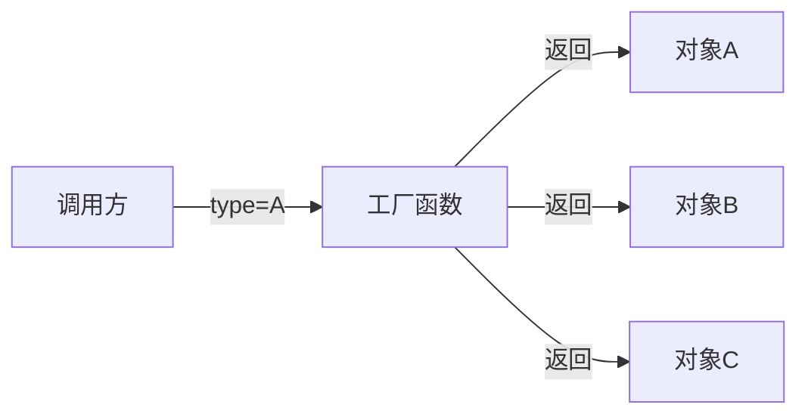
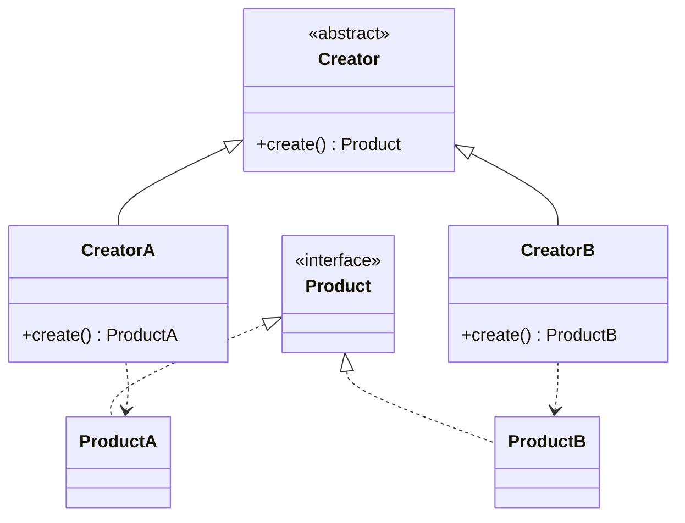
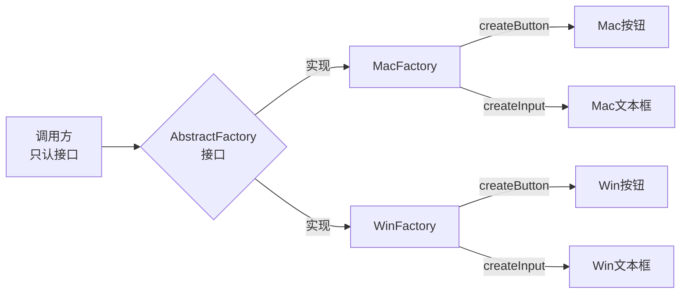
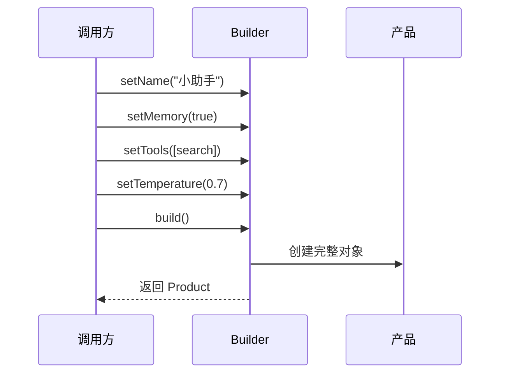
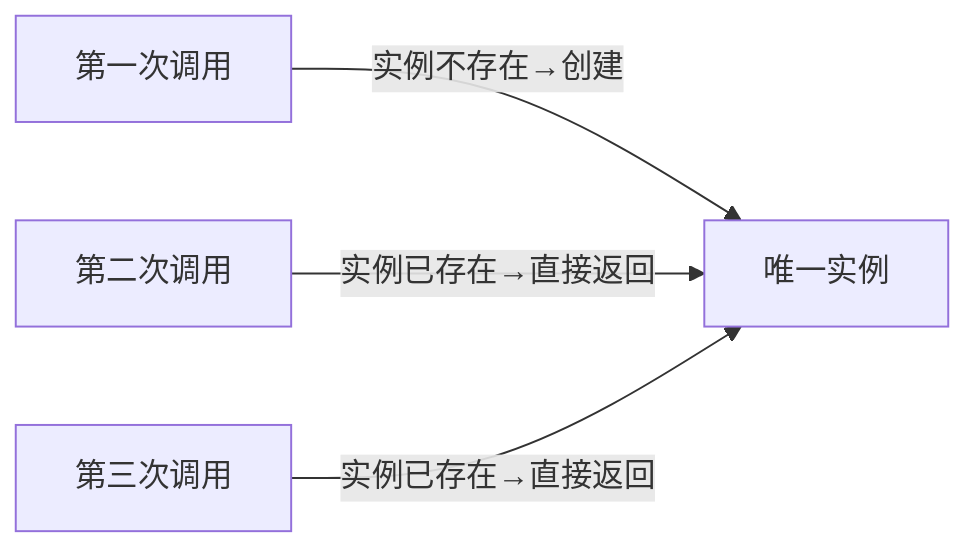
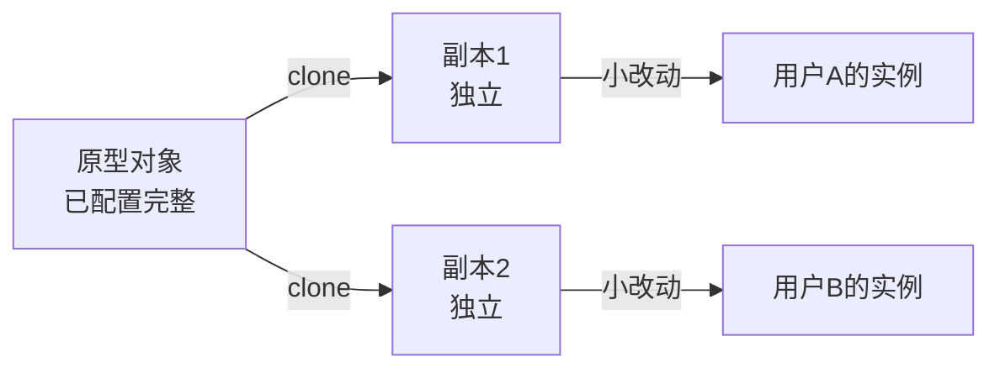
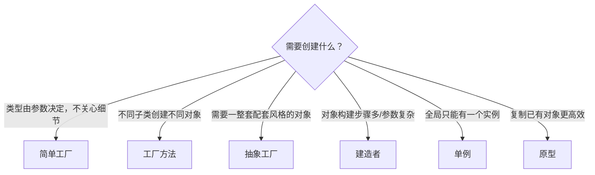

# 创建型模式

> 核心问题：**如何创建对象**，同时让调用方不依赖具体实现。
> 一句话：把"怎么造"和"怎么用"分开。

---

## 1. 简单工厂（Simple Factory）

**问题**：调用方需要某种对象，但不想关心具体怎么创建。

**本质**：一个 if-else 集中在工厂里，调用方只传类型名。
**缺点**：加新类型要改工厂——违反开闭原则。
**AI 映射**：根据任务类型路由到不同 Agent（`type="search"` → SearchAgent）。

---

## 2. 工厂方法（Factory Method）

**问题**：不同子类需要创建自己特定的对象，但创建逻辑各不相同。

**本质**：把"创建"这个动作推迟到子类决定。
**vs 简单工厂**：增加新类型不改现有代码，只加新工厂。
**AI 映射**：不同平台/模型商用各自的 Agent 工厂创建 Agent 实例。

---

## 3. 抽象工厂（Abstract Factory）

**问题**：需要一族相关对象，保证"配套"（不能拿 A 风格的按钮配 B 风格的文本框）。

**本质**：工厂方法的升级版，一次创建一整套风格一致的产品族。
**AI 映射**：为不同业务线提供"配套 Agent 套件"（搜索+写作+审核三件套，每条线定制一套）。

---

## 4. 建造者（Builder）

**问题**：对象构建过程很复杂，有很多可选参数，想一步一步配置。

**本质**：把"配置"和"最终构建"分离，支持链式调用。
**vs 工厂**：工厂关注"造哪种"，Builder 关注"怎么一步步造"。
**AI 映射**：Agent 初始化配置（工具列表、记忆类型、模型参数）。OpenAI Assistants API 就是 Builder 风格。

---

## 5. 单例（Singleton）

**问题**：某个对象全局只能有一个实例（配置中心、连接池、日志系统）。

**本质**：构造函数私有化 + 静态持有自身引用。
**注意**：单例是最常被滥用的模式——不是"全局变量"的替代品。只有真正需要唯一性的场景才用。
**AI 映射**：全局的模型推理池、共享的 Token 计数器、系统级配置。

---

## 6. 原型（Prototype）

**问题**：创建一个新对象的成本很高，但新对象和已有对象差别不大——直接复制更快。

**本质**：复制比重新创建更高效。
**AI 映射**：Fork 一个已配置好的 Agent 实例，只改少数参数（同一个 Agent 模板，给不同用户各克隆一份）。

---

## 创建型模式对比

| 模式 | 解决的核心问题 | 关键词 |
|------|---|---|
| 简单工厂 | 集中创建逻辑 | 一个工厂，if-else |
| 工厂方法 | 子类决定创建 | 可扩展，不改原代码 |
| 抽象工厂 | 创建配套产品族 | 整套风格一致 |
| 建造者 | 复杂对象分步构建 | 链式配置 |
| 单例 | 全局唯一实例 | 只有一个 |
| 原型 | 复制比创建快 | clone |

---

## 选型决策树

## See Also
- [[02-结构型模式]] — 有了对象，怎么组合
- [[03-行为型模式-GoF]] — 对象之间如何协作
- [[00-设计模式总览MOC]] — 全局导览
