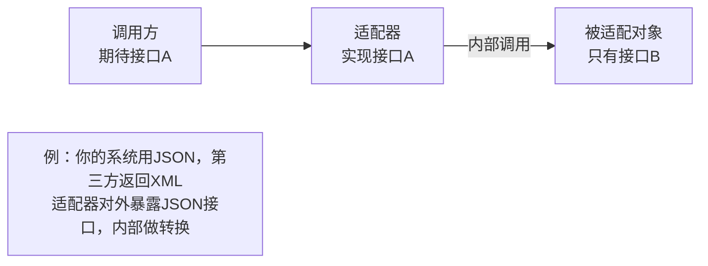
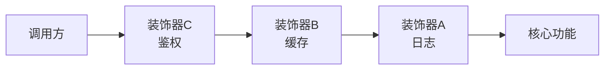
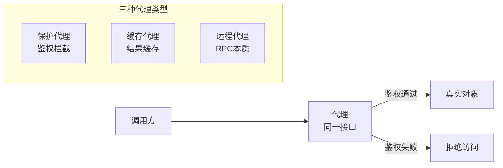
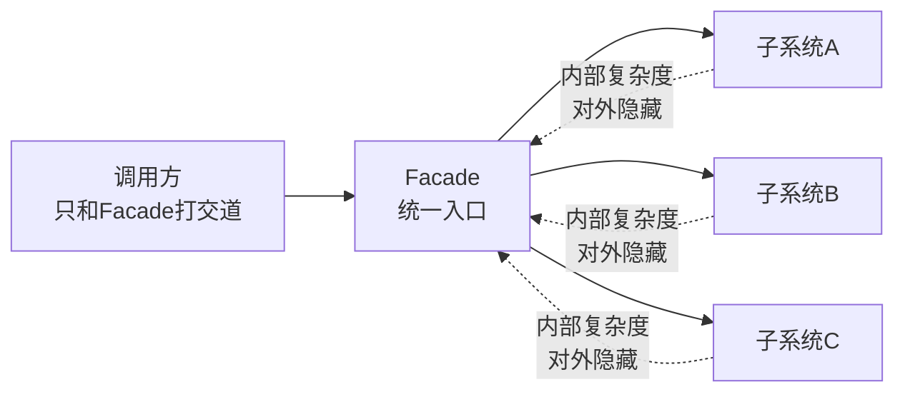
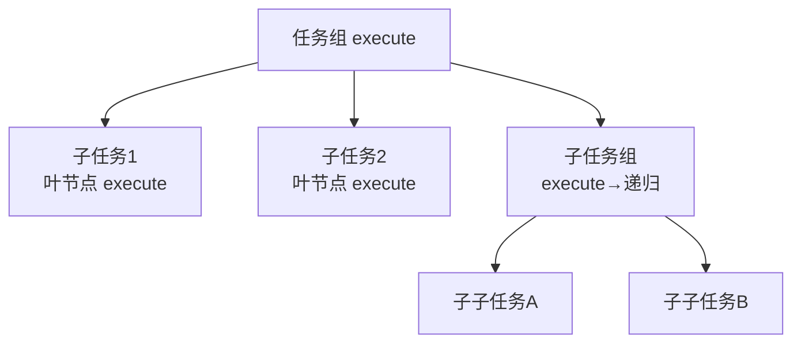
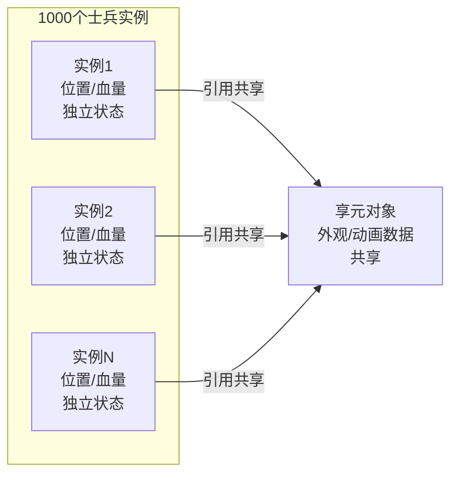
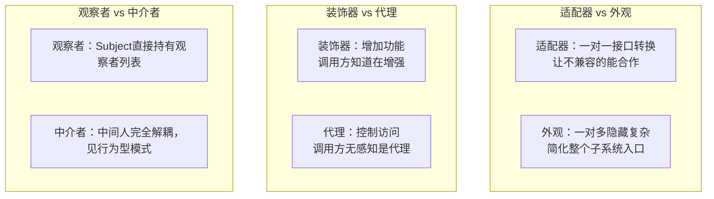

# 结构型模式

> 核心问题：**如何组合对象和类**，形成更大的结构。
> 一句话：把已有的"积木"拼出新形状，而不是重新造积木。

---

## 1. 适配器（Adapter）

**问题**：两个接口不兼容，无法直接合作，但又不能改原有代码。



**本质**：转换接口，让不兼容的东西能合作。现实类比：电源转接头。
**AI 映射**：
- 对接不同 LLM 厂商 API（统一封装为同一个调用接口）
- 把旧系统的 SQL 查询适配成 Agent 可理解的工具调用格式

---

## 2. 装饰器（Decorator）

**问题**：想给对象动态加功能，但不想改原来的类，也不想用继承（继承会爆炸）。



**本质**：像套娃一样，每层包一个功能，层层叠加。运行时动态叠加，而非编译时继承确定。
**vs 继承**：继承是编译时确定（组合爆炸）；装饰器是运行时动态叠加（灵活）。
**AI 映射**：
- 给 Agent 动态加能力：基础 Agent → 加记忆层 → 加日志层 → 加限速层
- LangChain 的 Chain 本质就是装饰器链

---

## 3. 代理（Proxy）

**问题**：想在访问某个对象前后做额外工作（鉴权、缓存、延迟加载），但不让调用方感知。



**本质**：代理和真实对象实现同一个接口，调用方无感知。
**vs 装饰器**：代理控制**访问**，装饰器**增加功能**。概念相近，意图不同。
**AI 映射**：
- 模型调用代理（限速、计费、fallback 到备用模型）
- Tool 调用代理（记录每次调用、做安全过滤）

---

## 4. 外观（Facade）

**问题**：子系统很复杂，调用方需要和很多组件打交道——给我一个简单的统一入口。



**本质**：简化接口，隐藏复杂度。现实类比：遥控器（不用知道电视内部电路）。
**AI 映射**：
- Agent Orchestrator 就是 Facade：对外暴露"帮我查航班"，内部协调搜索+预订+支付 Agent
- OpenAI Assistant API 对外是 Facade，内部管 Thread/Message/Run/Tool 的复杂状态

---

## 5. 桥接（Bridge）

**问题**：有两个维度在变化（形状×颜色），用继承会产生 M×N 个子类爆炸。

```mermaid
flowchart TD
    subgraph 抽象层（形状）
        Circle[圆形]
        Square[方形]
    end
    subgraph 实现层（颜色/渲染）
        Red[红色实现]
        Blue[蓝色实现]
    end
    Circle -->|组合持有| Red
    Circle -->|组合持有| Blue
    Square -->|组合持有| Red
    Square -->|组合持有| Blue
    note["两个维度独立扩展\n加新形状/加新颜色互不影响"]
```

**本质**：把抽象和实现分离，各自独立扩展，通过组合而非继承连接。
**AI 映射**：Agent 类型（搜索/写作/编码）× 底层模型（GPT-4/Claude/Gemini）独立变化，不用写 M×N 个组合类。

---

## 6. 组合（Composite）

**问题**：处理树形结构，希望对叶节点和组合节点用同一套接口操作。



**本质**：统一叶节点和容器节点的接口，递归组合。调用任意节点的 `execute()`，叶节点直接执行，组合节点递归执行。
**AI 映射**：
- 任务分解树（Task Decomposition）：每个节点可以是原子任务或子任务组
- 多 Agent 层级编排（Supervisor → Worker → Sub-Worker）

---

## 7. 享元（Flyweight）

**问题**：大量相似对象消耗内存，能不能共享公共部分？



**本质**：把**不变的部分共享**，只保留**变化的部分**在实例里。
**AI 映射**：大量 Agent 实例共享同一个基础模型权重，只有各自的上下文/状态不同（推理服务的本质：KV Cache 之外的模型参数全部共享）。

---

## 结构型模式对比

| 模式 | 核心意图 | 关键词 | AI 相关度 |
|------|---|---|---|
| 适配器 | 接口转换 | 不兼容→兼容 | ⭐⭐⭐ 多模型接入 |
| 装饰器 | 动态加功能 | 套娃、运行时叠加 | ⭐⭐⭐ Agent 能力叠加 |
| 代理 | 控制访问 | 中间人、透明代理 | ⭐⭐⭐ 限速/计费/fallback |
| 外观 | 简化接口 | 统一入口、隐藏复杂度 | ⭐⭐⭐ Orchestrator |
| 桥接 | 分离两变化维度 | 组合替代继承爆炸 | ⭐⭐ 模型×任务类型 |
| 组合 | 统一树形结构操作 | 递归、叶=容器同接口 | ⭐⭐⭐ 任务分解树 |
| 享元 | 共享复用减内存 | 大量相似对象 | ⭐⭐ 模型权重共享 |

---

## 容易混淆的三对



## See Also
- [[01-创建型模式]] — 怎么造对象
- [[03-行为型模式-GoF]] — 对象之间如何协作
- [[00-设计模式总览MOC]] — 全局导览
