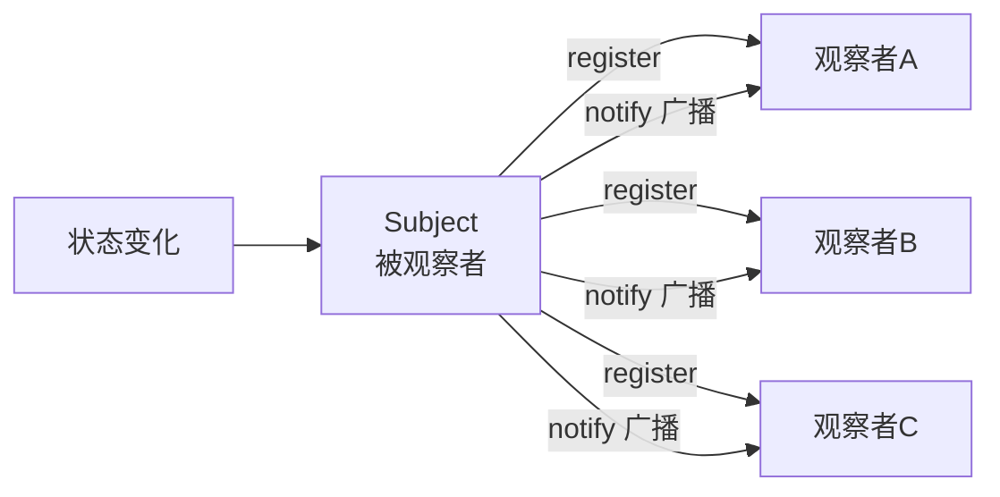
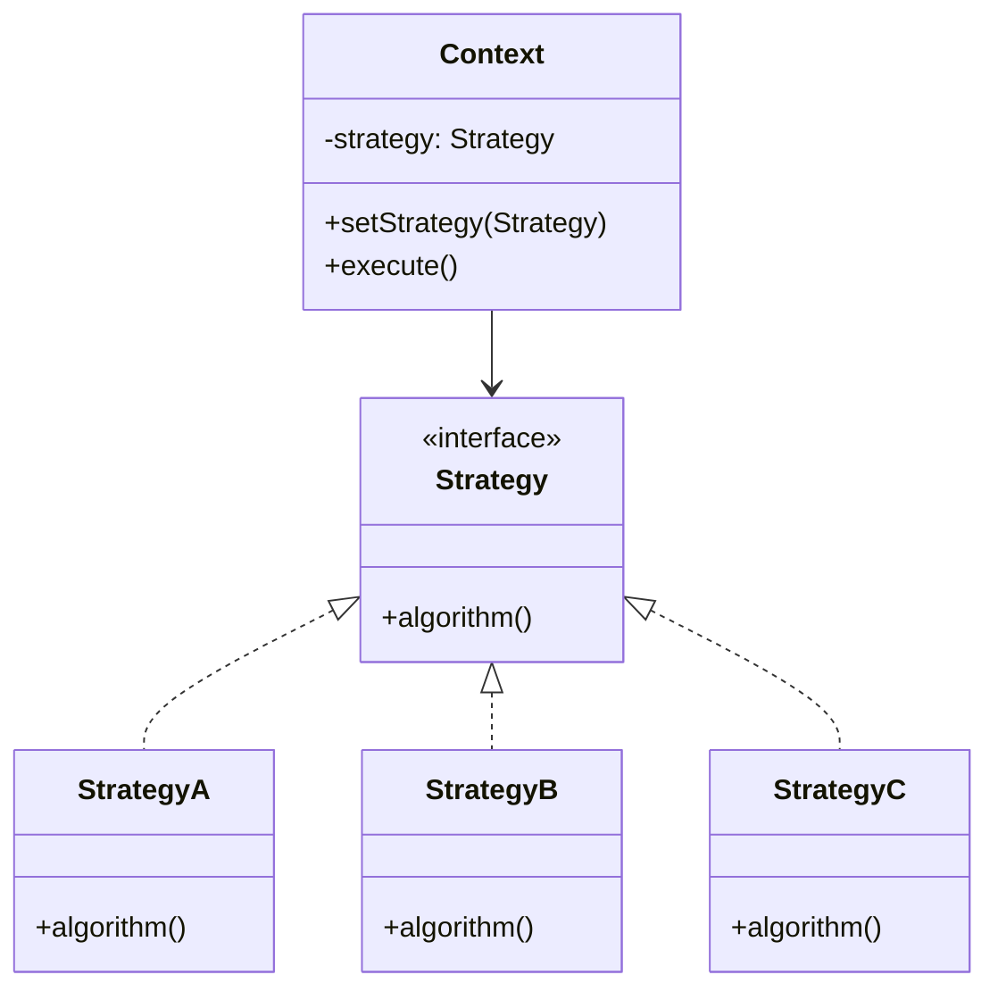
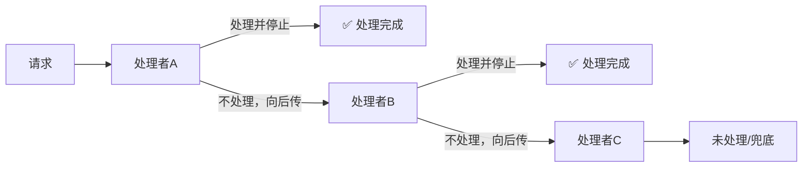
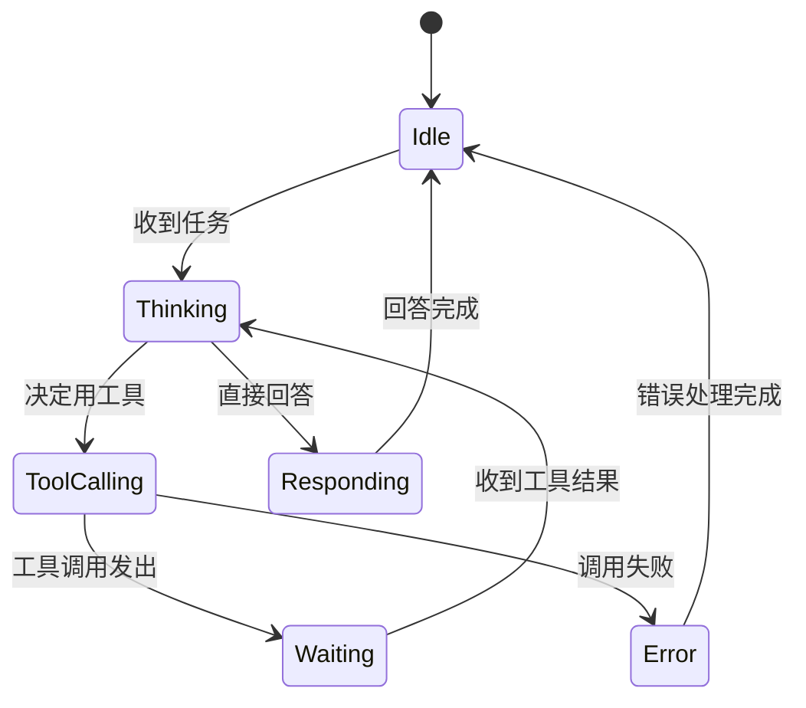
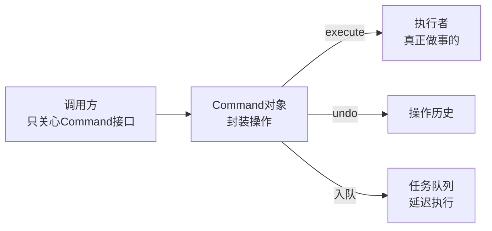
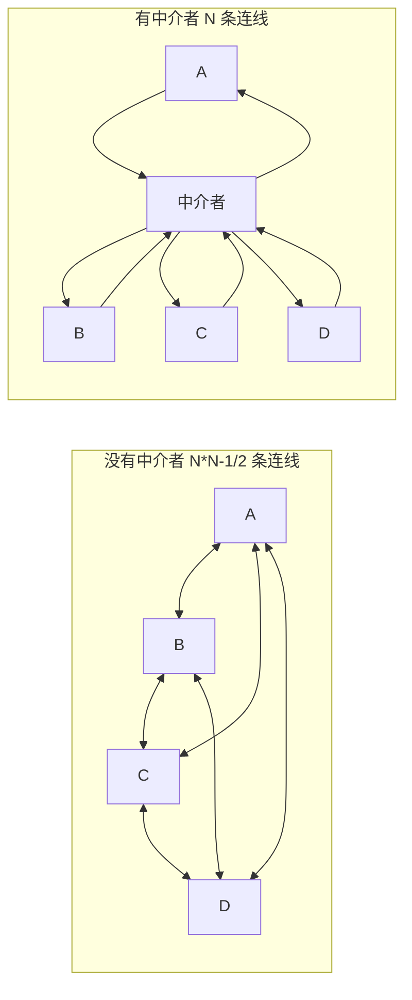
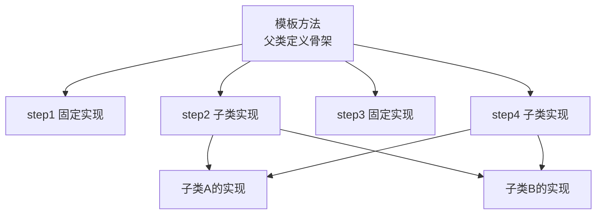
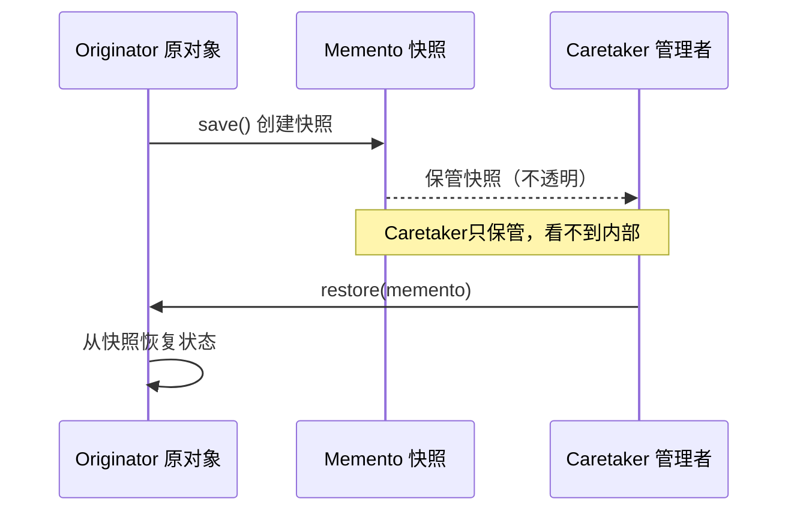
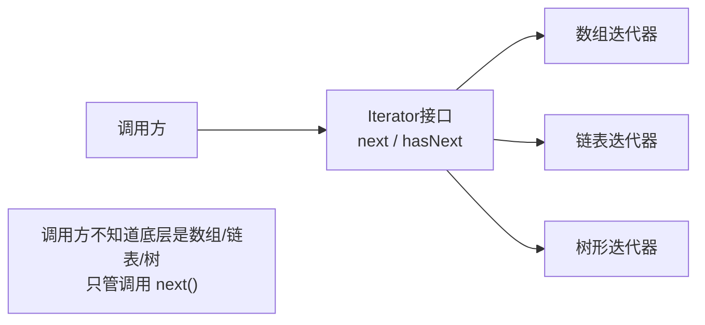
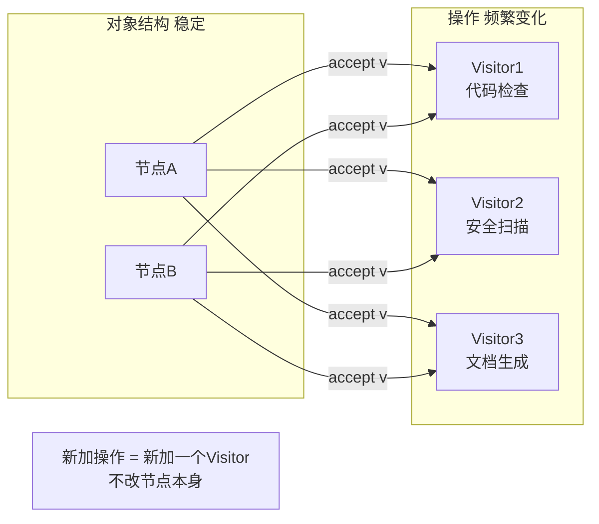

# 行为型模式（GoF）

> 核心问题：**对象之间如何分工协作、如何传递消息**。
> 一句话：定义"谁做什么、怎么配合"的规则。

---

## 1. 观察者（Observer）⭐

**问题**：一个对象状态变化，需要通知一批依赖它的对象——但不想让它们紧耦合。

**本质**：一对多依赖关系，状态变化自动通知。Subject 不知道观察者是谁，只管广播。
**vs 发布订阅**：观察者模式里 Subject 直接持有观察者列表（仍有耦合）；发布订阅中间多了一个消息总线，完全解耦。
**AI 映射**：
- 工具调用完成 → 通知等待结果的 Agent
- 模型推理完成 → 触发下游记忆写入、日志记录、UI 更新
- 贾维斯的事件驱动：一条消息到来 → 触发意图识别、历史检索、响应生成等多个并发动作

---

## 2. 策略（Strategy）⭐

**问题**：同一件事有多种做法，希望运行时灵活切换，而不是写一堆 if-else。

**本质**：把"算法"封装成可替换的对象。切换策略 = 换一个实现，Context 代码不变。
**AI 映射**：
- 检索策略（BM25 / 向量检索 / 混合检索）运行时切换
- Reward 计算策略（规则 / RM / LLM-as-Judge）
- 路由策略（关键词路由 / 语义路由 / 模型路由）

---

## 3. 责任链（Chain of Responsibility）

**问题**：一个请求需要经过多个处理者，每个处理者决定是否处理、是否继续传递。

**本质**：处理者形成链，请求沿链传递直到被处理。每个节点可以决定是否拦截。
**vs 管道**：责任链里每个节点可以拦截不继续；管道里每个节点都必须处理并传递。
**AI 映射**：
- 内容安全检查链：违禁词过滤 → 语义审核 → 人工复核
- Agent 降级链：Claude → GPT-4 → 本地模型（前一个失败才到下一个）

---

## 4. 状态（State）

**问题**：对象在不同状态下行为差异巨大，写一堆 if-else 判断当前状态很难维护。

**本质**：把状态转移逻辑封装在 State 对象里，Context 委托给当前 State 执行。
**AI 映射**：
- Agent 的状态机（Thinking → Tool_Calling → Waiting → Responding）
- OpenAI Run 对象的状态（queued → in_progress → requires_action → completed）

---

## 5. 命令（Command）

**问题**：想把一个操作封装成对象，支持撤销、队列、延迟执行。

**本质**：把"做什么"封装成一等公民对象，解耦"发出请求"和"执行请求"。
**AI 映射**：
- 工具调用封装为 Command（支持重试、撤销、异步执行）
- 批量任务队列（把 Agent 任务封装成 Command 放入 Job Queue）
- 代码编辑 Agent 的 Undo/Redo 操作历史

---

## 6. 中介者（Mediator）

**问题**：多个对象互相通信，两两之间都有连线，关系如蜘蛛网——引入一个中间人统一协调。

**本质**：用一个中心节点替代网状关系，降低耦合。
**vs 外观（Facade）**：外观是单向的（外部→内部）；中介者是双向的（各组件通过中介者互通）。
**AI 映射**：
- Multi-Agent Orchestrator（各 Agent 不直接通信，通过 Orchestrator 协调）
- 事件总线（各 Agent 向总线发消息，不需要知道谁在监听）

---

## 7. 模板方法（Template Method）

**问题**：一个算法的骨架固定，但其中某些步骤因子类而异。

**本质**：父类定义流程，子类填充细节。**控制反转**——不是子类调用父类，而是父类骨架调用子类钩子。
**AI 映射**：
- ReAct 循环（Think → Act → Observe 骨架固定，具体 Tool 调用由子类实现）
- FARS 四阶段骨架固定（Fetch/Analyze/Reason/Summarize），各阶段内容可替换

---

## 8. 备忘录（Memento）

**问题**：需要保存对象状态并在之后恢复，但不暴露内部细节。

**本质**：对象自己创建快照，快照是不透明的（外部不能读内部状态）。
**AI 映射**：
- Agent 上下文快照（保存推理中间状态，支持回滚）
- Conversation Checkpoint（长对话的状态保存与恢复）

---

## 9. 迭代器（Iterator）

**问题**：遍历一个集合，但不想暴露集合内部结构。

**本质**：统一遍历接口，隐藏内部数据结构。
**AI 映射**：流式输出（Streaming）本质是迭代器——调用方通过 iterator 逐 token 读取，不关心模型内部如何生成。

---

## 10. 访问者（Visitor）

**问题**：有一批稳定的对象结构，但需要频繁添加新操作，不想每次都改这些对象。

**本质**：把操作和数据结构分离，操作可以独立扩展。
**AI 映射**：对 AST/知识图谱节点做多种分析（代码检查、安全扫描、文档生成），每种分析是一个 Visitor。

---

## 行为型模式对比

| 模式 | 核心意图 | AI 场景关联度 |
|------|---|---|
| 观察者 | 状态变化广播通知 | ⭐⭐⭐ 事件驱动核心 |
| 策略 | 算法可替换 | ⭐⭐⭐ 路由/检索/优化策略 |
| 责任链 | 请求沿链传递可拦截 | ⭐⭐⭐ 安全过滤/降级 |
| 状态 | 状态切换行为变化 | ⭐⭐⭐ Agent 状态机 |
| 命令 | 操作封装为对象 | ⭐⭐ 工具调用队列/撤销 |
| 中介者 | 集中协调多组件 | ⭐⭐⭐ Orchestrator 核心 |
| 模板方法 | 固定流程，可变步骤 | ⭐⭐ ReAct/FARS 骨架 |
| 备忘录 | 状态快照与恢复 | ⭐⭐ Checkpoint |
| 迭代器 | 统一遍历接口 | ⭐ Streaming 输出 |
| 访问者 | 操作与结构分离 | ⭐ 代码/AST 分析工具 |

## See Also
- [[01-创建型模式]] — 如何创建对象
- [[02-结构型模式]] — 如何组合对象
- [[04-架构模式与AI协作]] — 系统级的协作模式
- [[00-设计模式总览MOC]] — 全局导览
