# 并发与消息模式

> GoF 23 种模式解决的是单机代码的对象协作问题。
> 这一层解决的是：**多线程、网络、分布式场景下的协调与稳定性**。
> 工程师进阶必须掌握——面试考的不少，生产环境用得更多。

---

## 一、同步原语（Synchronization Primitives）

并发的基础积木。多个执行流（线程/协程）访问共享资源时，需要协调。

### 1. 互斥锁（Mutex / Lock）

**问题**：多个线程同时写共享变量，导致数据竞争。

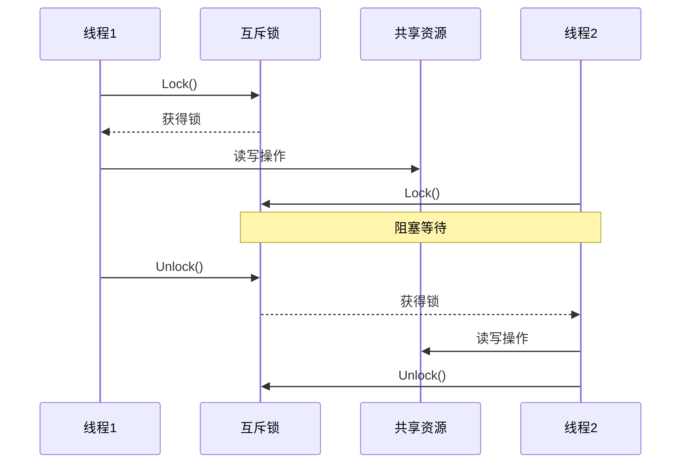

**本质**：同一时刻只有一个执行流能进入临界区。
**注意**：锁的粒度要小（只保护必要的代码段），否则并发退化为串行。

---

### 2. 读写锁（Read-Write Lock）

**问题**：读操作远多于写操作，互斥锁让读也串行化——性能浪费。

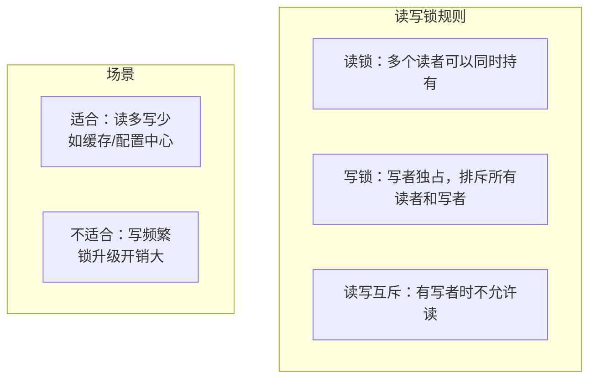

**本质**：读可以并发，写必须独占。大幅提升读密集型场景的吞吐量。
**AI 映射**：Agent 知识库（高频读取/低频更新）用读写锁，避免读操作串行化。

---

### 3. 信号量（Semaphore）

**问题**：需要限制同时访问某资源的并发数量（不是互斥，是限额）。

```mermaid
flowchart LR
    subgraph 信号量 S=3
        S[计数=3]
    end
    T1[线程1] -->|acquire S=2| S
    T2[线程2] -->|acquire S=1| S
    T3[线程3] -->|acquire S=0| S
    T4[线程4] -->|acquire 阻塞等待| S
    T1 -->|release S=1| S
    T4 -->|获得许可| S
```

**本质**：计数器控制并发数，acquire 减 1，release 加 1，为 0 时阻塞。
**vs 互斥锁**：互斥锁是信号量=1的特例；信号量可以允许 N 个并发。
**AI 映射**：
- 限制同时调用 LLM API 的并发数（防止超出速率限制）
- 工具调用的并发控制（如同时最多 5 个搜索请求）

---

### 4. 条件变量（Condition Variable）

**问题**：线程需要等待某个条件满足才能继续，而不是无脑自旋检查（浪费 CPU）。

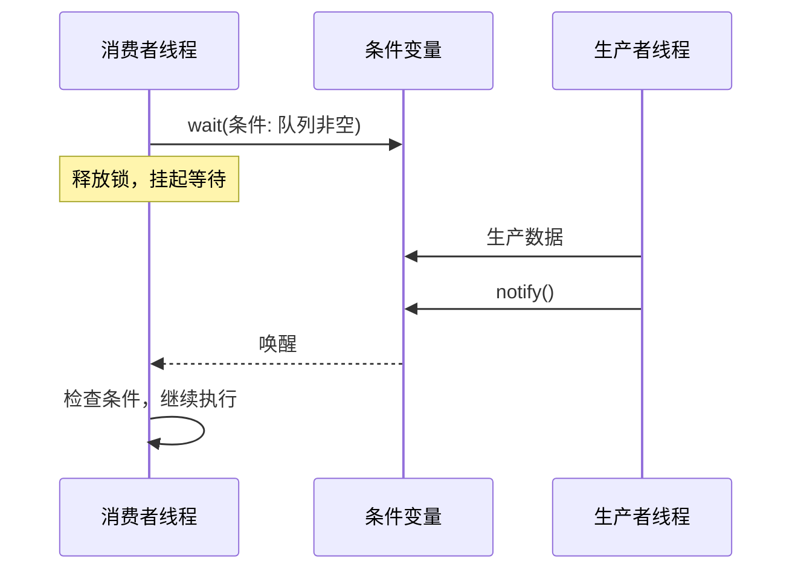

**本质**：等待某个条件成立，被通知时再醒来检查。通常和互斥锁配合使用。
**AI 映射**：等待工具调用返回结果（阻塞等待条件：结果已就绪）。

---

## 二、并发模式（Concurrency Patterns）

### 5. 生产者-消费者（Producer-Consumer）⭐

**问题**：生产速度和消费速度不匹配，需要一个缓冲区解耦。

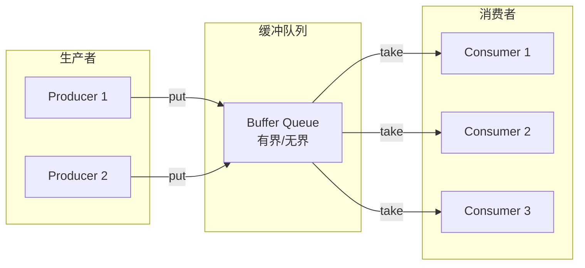

**本质**：队列作为缓冲，解耦生产和消费的速率差异。
**两个关键参数**：
- 队列容量（有界队列避免内存耗尽，无界队列避免生产者阻塞）
- 消费者数量（决定吞吐上限）

**AI 映射**：
- Agent 任务队列（用户请求 → 队列 → Worker Pool 消费）
- LLM 批处理（批量攒请求再一起推理，提升 GPU 利用率）

---

### 6. 扇出-扇入（Fan-Out / Fan-In）

**问题**：一个任务可以拆成多个子任务并行执行，最后汇总结果。

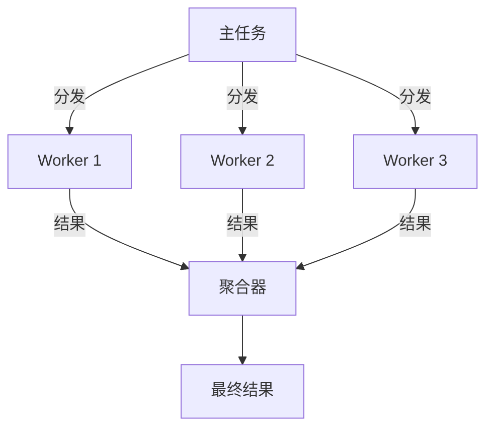

**Fan-Out**：一个任务拆成多个并行执行。
**Fan-In**：多个结果汇总成一个。
**AI 映射**：
- 并行检索多个数据源（同时查 3 个向量库），结果合并重排序（Fan-Out + Fan-In）
- Mixture of Agents（MoA）：多个 LLM 并行生成 → 聚合器选最优

---

### 7. Reactor 模式

**问题**：服务器需要同时处理大量并发连接，每个连接一个线程的方式代价太高。

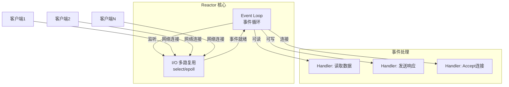

**本质**：单线程 + 事件循环 + 非阻塞 I/O = 支撑数万并发连接。
**现实映射**：Node.js / Nginx / Redis 底层都是 Reactor 模式。
**AI 映射**：高并发推理服务（vLLM/TGI 的并发请求处理）的核心架构。

---

### 8. 有界并行（Bounded Parallelism）

**问题**：并行执行 N 个任务，但不能无限制并发（防止资源耗尽）。

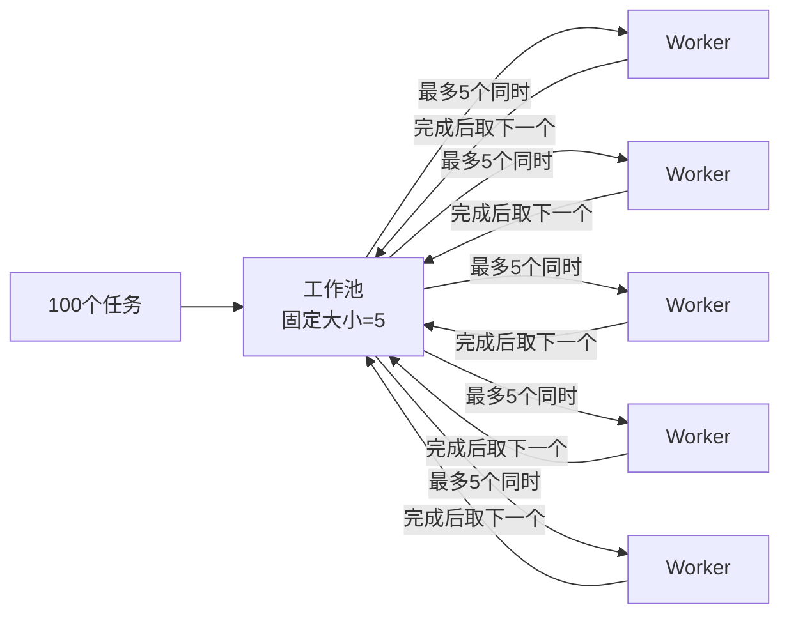

**本质**：Goroutine/Thread Pool + Semaphore 的组合，控制并发上限。
**AI 映射**：并行工具调用的并发控制（同时最多 5 个外部 API 请求）。

---

## 三、消息传递模式（Messaging Patterns）

### 9. 发布-订阅（Pub/Sub）⭐

**问题**：消息发送方不想知道谁在接收，接收方不想知道谁在发送——完全解耦。

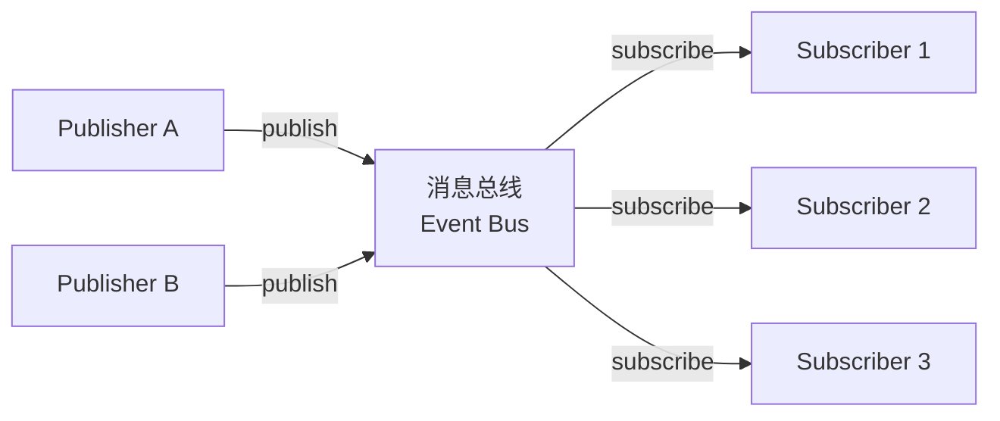

**vs 观察者**：
- 观察者：Subject 直接持有 Observer 列表，仍有耦合
- 发布订阅：中间有消息总线，Publisher 和 Subscriber 完全不知道对方存在

**AI 映射**：
- 军团公告板（bulletin.md）本质是 Pub/Sub：贾维斯发布任务，任何 Agent 订阅并认领
- 事件驱动 AI 系统（工具调用完成 → 发布事件 → 多个下游 Agent 响应）

---

### 10. 推-拉模式（Push / Pull）

**问题**：数据更新通知的两种基本策略。

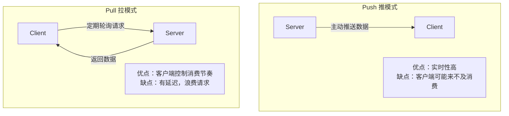

**组合策略（Long Poll / WebSocket）**：
- Long Poll：客户端发请求，服务器有数据时才返回（介于推拉之间）
- WebSocket：建立双向通道，真正实时双向推送

**AI 映射**：
- LLM 流式输出（SSE）= Push 模式——服务器逐 token 推给客户端
- 心跳检查（馆长心跳）= Pull 模式——定期轮询触发

---

### 11. 扇入（Fan-In）消息聚合

**问题**：多个来源的消息需要合并到一个通道处理。

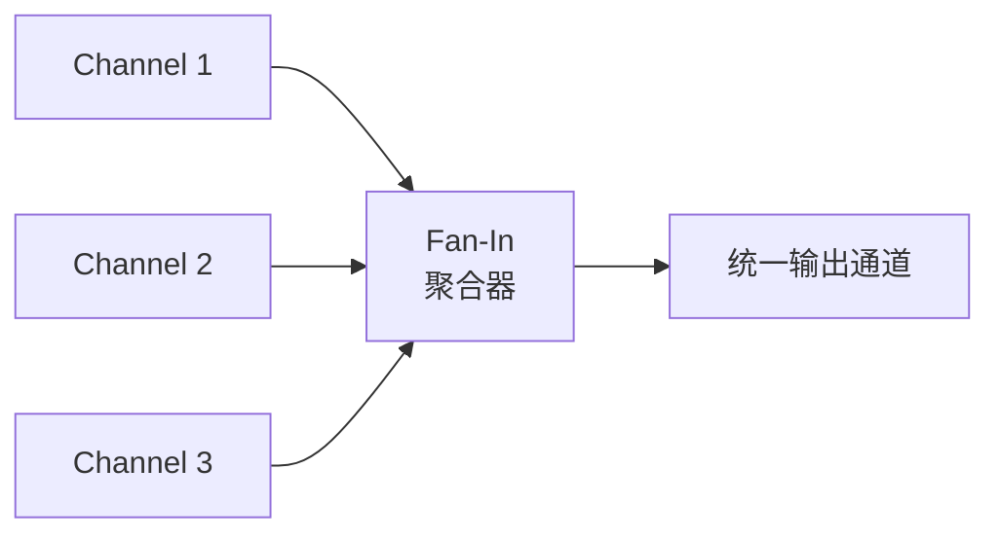

**AI 映射**：多个 Agent 并行产出结果 → 汇总到 Orchestrator 统一处理（与 Fan-Out 搭配形成 Scatter-Gather 模式）。

---

## 四、稳定性模式（Stability Patterns）

生产环境存活的保障。下游不可靠时，自己不能跟着挂掉。

### 12. 熔断器（Circuit Breaker）⭐

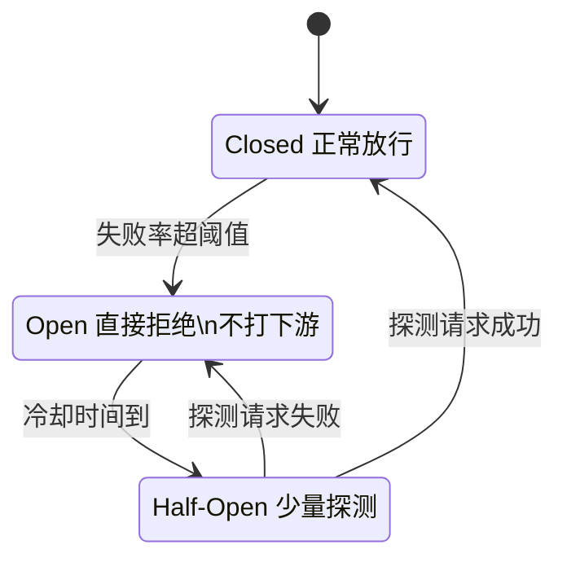

**本质**：主动放弃，保护自己，给下游恢复时间。现实类比：保险丝。
**AI 映射**：
- LLM API 限速/超时 → 熔断，切换 fallback 模型
- 工具调用失败率过高 → 熔断，返回降级响应

---

### 13. 重试（Retry）

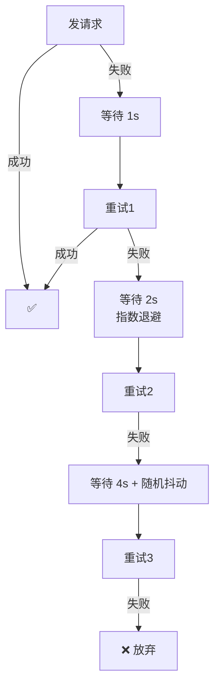

**三个关键设计**：
- **指数退避**：每次等待时间翻倍，避免持续冲击
- **抖动（Jitter）**：加随机偏移，避免所有客户端同时重试（惊群效应）
- **幂等前提**：只有幂等操作才能重试（查询✅ / 支付❌）

**AI 映射**：LLM API 调用的 429 / 超时 → 指数退避重试。

---

### 14. 舱壁（Bulkhead）

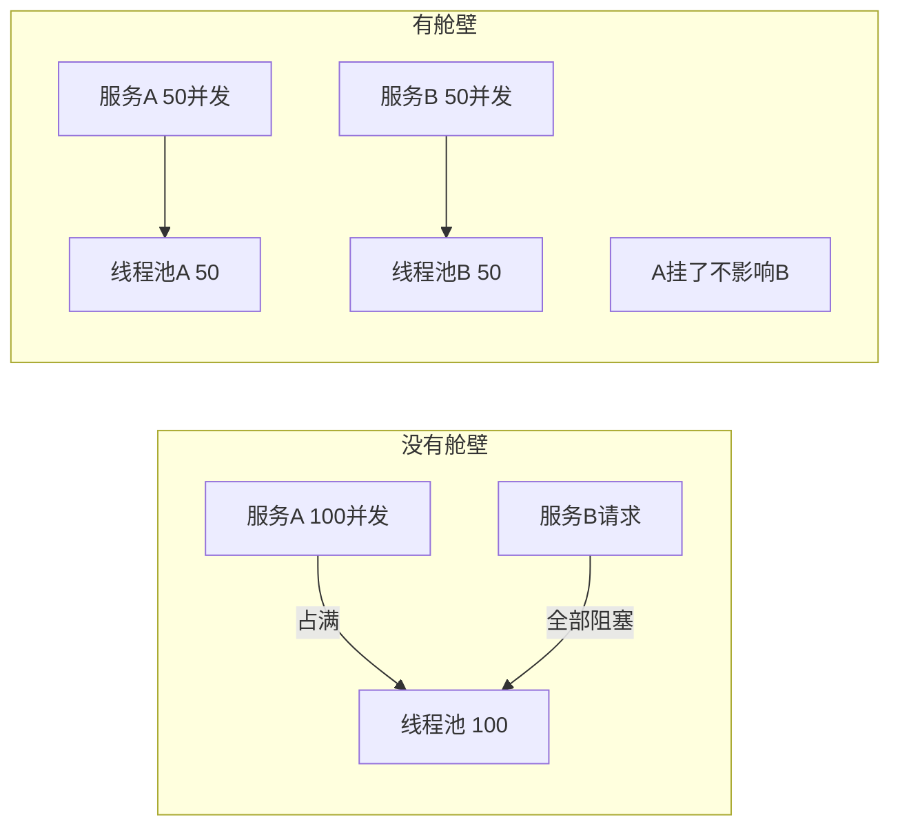

**本质**：像船舱隔板，一个舱漏水不影响其他舱。通过资源隔离防止级联故障。
**AI 映射**：
- 高优先级请求（付费用户）和低优先级请求（免费用户）用不同线程池
- 不同工具的调用使用独立连接池，一个工具挂了不影响其他工具

---

### 15. 限流（Rate Limiting）

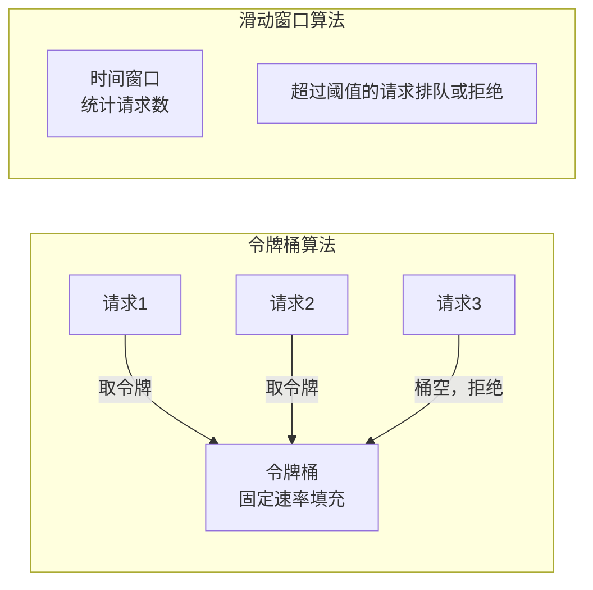

**两种主流算法**：
- **令牌桶**：固定速率生成令牌，请求消耗令牌，允许突发（桶满时可存），长期平均速率受限
- **滑动窗口**：统计最近 N 秒的请求数，超过阈值拒绝，更精确

**AI 映射**：
- LLM API 调用限速（每分钟最多 60 次请求）
- 多租户系统的用户级限流（每个用户每天 1000 次调用）

---

### 16. 快速失败（Fail Fast）

**问题**：与其让错误的请求慢慢超时消耗资源，不如早发现早拒绝。

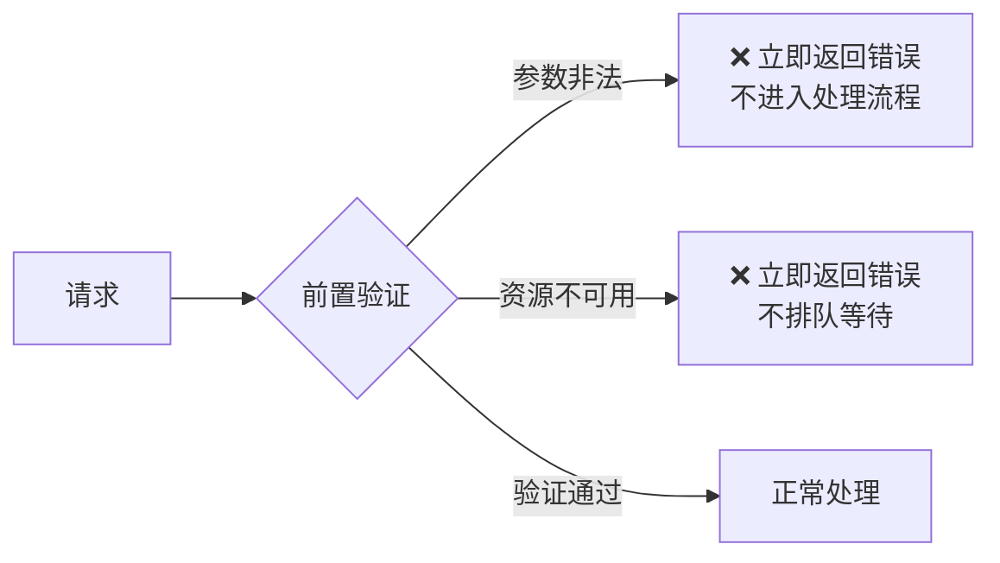

**本质**：尽早发现问题，比在系统深处发现要好得多。
**AI 映射**：
- 工具调用参数校验（LLM 生成的参数格式错误 → 立即返回错误 + 错误信息反馈给 LLM 修正）
- Context 长度超限 → 立即截断而非等到推理失败

---

## 四类模式关系图

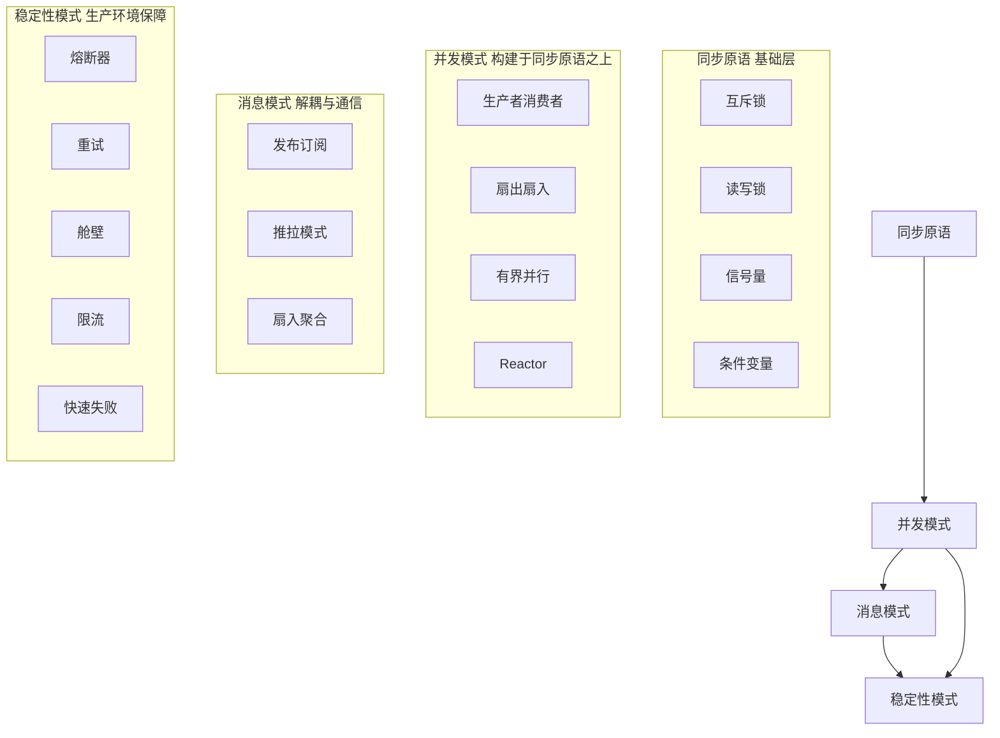

---

## 生产环境最低配置

> 任何对外的 LLM/Tool 调用，至少需要：

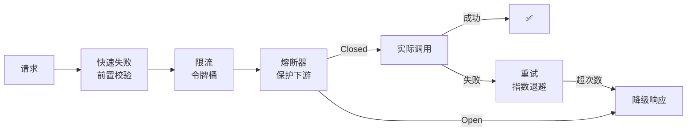

**缺了哪个都是生产事故的根源。**

## See Also
- [[05-分布式系统模式]] — 更高层的分布式模式（Saga/CQRS/事件溯源）
- [[03-行为型模式-GoF]] — 观察者 vs 发布订阅的深度对比
- [[04-架构模式与AI协作]] — AI 系统的架构级模式
- [[00-设计模式总览MOC]] — 全局导览
