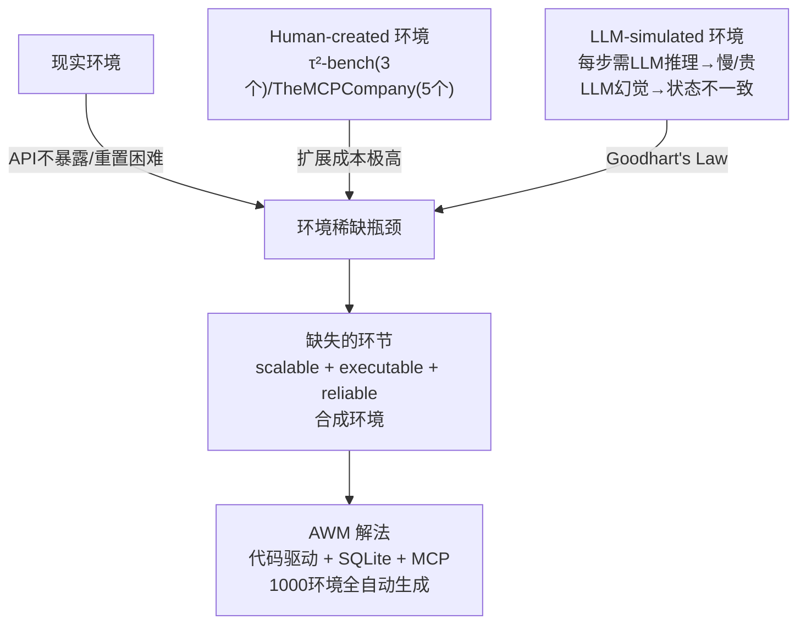

# AWM: Agent World Model — Infinity Synthetic Environments for Agentic RL

> **arXiv**: 2602.10090 | **会议**: **ICML 2026** | **机构**: Snowflake AI Research + UIUC | **时间**: 2026-02-10  
> **评分**: ★★★★☆ | **主题**: Agent RL 环境工程 / 合成环境生成  
> **代码**: https://github.com/Snowflake-Labs/agent-world-model  
> **关键词**: environment synthesis, code-driven environments, MCP, tool-use RL, OOD generalization

---

## 一句话定位

AWM 构建了**全自动的合成环境生成流水线**，用 LLM 生成 1000 个代码驱动（非 LLM 模拟）、数据库支持的可执行环境，每个环境平均 35 个 MCP 工具，解决 agentic RL 训练中的**环境稀缺瓶颈**，并在 OOD benchmark 上验证了泛化能力。

---

## 核心问题：为什么 Agent RL 缺环境



---

## AWM 的核心架构：五阶段合成流水线

### 环境形式化（POMDP）

每个环境 $E_i$ = $(S_{E_i}, A_{E_i}, O_{E_i}, T_{E_i}, R_\tau)$：
- 状态空间 $S_{E_i}$ → **SQLite 数据库**（结构化、持久化、一致）
- 动作空间 $A_{E_i}$ → **MCP 工具调用**（Python 实现，明确 schema）
- 观察空间 $O_{E_i}$ → 工具返回值
- 转移函数 $T_{E_i}$ → 代码执行（不是 LLM 生成）
- 奖励函数 $R_\tau$ → **验证代码**（比较执行前后数据库状态）

### 五个阶段（关键 insight：软件工程的逆向工程）

```
阶段1：场景生成（Scenario）
  输入：100 个种子域名（shopping / finance / travel / social...）
  过程：LLM 生成 1000 个有状态应用场景
  过滤：嵌入去重 + CRUD 操作分类器（排除静态内容站点）
  关键设计：专注 stateful applications（需要 DB 交互，不是纯信息检索）

阶段2：任务生成（Task）
  为每个场景生成 10 个用户任务（= 功能需求）
  原则：API-solvable（不依赖 UI 点击）+ post-authentication context
  产出：10,000 任务（这些任务后续驱动 DB 设计）

阶段3：数据库生成（Database）
  根据任务集推断所需实体/关系/约束 → 生成 SQLite schema
  再生成 sample data（初始状态 s₀），确保每个任务从初始状态可执行
  关键：任务先于数据库 → "需求驱动设计"，避免 schema 和任务脱节

阶段4：接口生成（Interface / MCP）
  基于数据库 schema 生成 MCP 工具接口（Python 实现）
  每个工具 = 一组 DB 操作（读写），有明确 input/output schema
  统一通过 MCP 暴露 → agent 用一致的协议与任何环境交互
  平均 35 个工具/环境，总计 35,062 个工具

阶段5：验证生成（Verification）
  生成验证代码：比较任务执行前后的数据库状态
  reward = code verification（精确）+ LLM-as-a-Judge（语义兜底）
  关键：可编程 reward 比纯 LLM judge 更稳定，减少 reward hacking

每个阶段都有自纠错：代码运行失败 → 错误信息反馈给 LLM → 重试
```

### 规模对比

| 系统 | 环境数 | 工具数 | 开源 |
|------|--------|--------|------|
| τ²-bench | 3 | ~ | ✅ |
| TheMCPCompany | 5 | ~ | ✅ |
| AutoEnv | 36 | ~ | ✅ |
| EnvScaler | 191 | ~ | ✅（并发工作）|
| **AWM** | **1,000** | **35,062** | ✅ |
| DeepSeek-V3.2 内部 | 数千 | ~ | ❌（未开源）|

---

## RL 训练设计

**规模**：每步 1,024 个并行环境实例（这是 RL 训练扩展的关键——并行 rollout）

**算法**：GRPO（actor-only，不需 critic）

**reward 设计**：
- Primary：verification code（程序正确性，Binary）
- Auxiliary：LLM-as-a-Judge（语义完成度，连续分）

**关键工程优势**：
1. 快速 reset：SQLite 状态可以 snapshot + restore，毫秒级重置
2. 并行隔离：每个 episode 有独立的 DB 实例，不互相干扰
3. Deterministic 状态转移：代码执行确定性 >> LLM 模拟

---

## 实验结果

**三个 OOD benchmark**（训练时未见到这些任务/环境）：
- τ²-bench
- BFCL v4（Berkeley Function-Calling Leaderboard）
- TheMCPCompany

**核心结论：** 仅在合成环境（AWM）中训练的 agent，在三个 OOD benchmark 上都优于在 benchmark-specific 环境训练的 agent。

这验证了 AWM 的多样性和结构一致性能让 agent 学到可迁移的通用工具使用能力，而不是 benchmark overfitting。

---

## 与 Agent RL 环境工程系统论的关系

我的「Agent RL 环境工程系统论」笔记中提到了 **六大设计原则**，AWM 精确实现了其中几个：

| 原则 | AWM 的对应实现 |
|------|--------------|
| Verifiable reward | ✅ 验证代码（程序正确性）|
| Real workflow patterns | ✅ 以 user requirement 为起点，逆向工程环境 |
| Diversity | ✅ 1000 场景，嵌入去重，cap 防止类别坍缩 |
| Task-centric design | ✅ 任务先于数据库设计（需求驱动）|
| Curriculum | ❌ 没有明显课程学习 |
| Expert rubrics | 部分✅ LLM-as-Judge 兜底 |

**AWM 的核心工程洞察**（值得写入环境工程专题）：

1. **LLM 模拟环境 vs 代码驱动环境**：LLM 模拟的 state transition 有幻觉，且每步需要 LLM 调用（慢/贵）；代码驱动 = 确定性 + 毫秒级；这是 RL 训练可扩展性的关键差异。

2. **任务→数据库（而非数据库→任务）**：先生成用户任务（需求），再生成满足这些需求的 DB schema。这保证了任务可解性，避免了"DB 有数据但任务无法执行"的设计失误。

3. **MCP 标准接口的价值**：统一接口让 agent 学到的是"如何与工具交互的通用策略"，而不是某个特定 API 的 quirks。OOD 泛化来自于接口一致性。

4. **验证代码 + LLM-as-Judge 组合**：程序验证处理 exact-match 类任务（精确性高），LLM 处理需要语义理解的开放任务（覆盖率高）。组合优于单一。

---

## 批判性评价

**证据强度**：ICML 同行评审，三个 OOD benchmark 一致验证，开源可复现。

**真正 novel 的地方**：
- "任务先于数据库"的逆向工程思路是工程上的 elegant 解法
- MCP 标准化接口 + 代码驱动 + SQLite 的三角组合，比先前工作都更完整
- 规模（1000 环境）是实质性的

**值得质疑的地方**：
- **OOD 泛化的机制解释不足**：为什么 AWM 训练的 agent 能泛化到 OOD？是 diversity？是 MCP 接口一致性？是任务结构相似性？论文实验没有充分消融。
- **合成场景的现实代表性**：1000 个"stateful application"是否覆盖了真实 tool-use 场景的分布？可能过多偏向 CRUD 类任务，对非结构化工具（搜索、浏览）覆盖有限。
- **Reward 设计简单**：binary verification code。对于需要多步规划的复杂任务，binary terminal reward 本身就是 credit assignment 难题（这正是 GiGPO/SeeUPO 要解决的问题）。AWM 的 RL 实验可能因此低估了复杂任务的 agent 潜力。

**与现有工作的互补性**：
- AWM 解决"有哪些环境训练"
- GiGPO/SeeUPO 解决"如何用这些环境训练"
- 两者是 agentic RL 训练基础设施的两个维度

---

## 实践意义

**如果要训练 tool-use agent（工程角度）**：
1. 从 AWM 的 1000 环境出发（开源可用）
2. 用 GRPO 训练（AWM 已验证）
3. 或叠加 GiGPO 的 anchor state grouping 提升 credit assignment
4. Reward 设计：程序验证（精确）+ LLM judge（语义），组合使用

**AWM 的核心局限（未来工作）**：
- 只涵盖 tool-call API 类任务，不包含 GUI 操作（OSWorld/WebArena 的场景）
- 1000 环境对于大模型 RL 训练仍然相对有限（DeepSeek-V3.2 内部可能是数千级）
- 课程学习（难度递进）尚未实现

---

## See Also

- [[AI/2-Agent/Agentic-RL/Agent-RL-环境工程系统论|Agent RL 环境工程系统论]] — AWM 是该专题"合成环境"章节最完整的实现案例；AWM 的五阶段流水线直接对应六大设计原则
- [[AI/2-Agent/Agentic-RL/Tool-Use-RL-训练专题|Tool Use RL 训练专题]] — AWM 为 tool-use RL 提供训练基础设施；ASTRA/ARTIST/ToRL 等都需要可靠的 tool-use 训练环境
- [[AI/2-Agent/Agentic-RL/ASTRA-Automated-Tool-Agent-Training|ASTRA（Beike）]] — **技术栈同源**：ASTRA 用 MCP tool graph 合成轨迹，AWM 用 MCP 标准接口构建环境；两者合用 = 端到端 tool-use agent 训练流水线
- [[AI/2-Agent/Agentic-RL/EnterpriseGym-Corecraft|EnterpriseGym Corecraft]] — 同为高保真 Agent RL 环境；EnterpriseGym 真实企业系统，AWM 合成规模化；两者是真实 vs 合成的互补路线
- [[AI/2-Agent/Agentic-RL/GiGPO-Group-in-Group-Policy-Optimization|GiGPO（NeurIPS 2025）]] — AWM 用 binary terminal reward → credit assignment 难题；GiGPO 的 anchor state grouping 正是在 AWM 类环境中解 credit 的最优方案
- [[AI/2-Agent/Agentic-RL/SeeUPO-Sequence-Level-Agentic-RL-Convergence-Guarantees|SeeUPO（arXiv:2602.06554）]] — AWM 的多轮 tool-call RL 场景正是 SeeUPO 理论证明的 multi-turn contextual bandit；逆序更新在 AWM 环境上有直接应用价值
- [[AI/2-Agent/Agentic-RL/CM2-Checklist-Rewards-Multi-Turn-Tool-Use-RL|CM2（Checklist Rewards）]] — **Reward 设计的互补方案**：AWM 构建训练环境（基础设施），CM2 设计 unverifiable tool-use 的 reward 信号（监督信号）；两者合用 = 完整的 open-ended tool-use RL 训练基础设施（AWM 环境 + CM2 checklist reward）

## 推荐阅读

1. **AWM 原文**：arXiv:2602.10090 — 重点读 Section 3（五阶段流水线）和 Section 4（OOD 实验设计）
2. **AWM 代码**：https://github.com/Snowflake-Labs/agent-world-model — 开源可直接使用
3. **τ²-bench**：Tool-use RL 的 OOD 评测标准，AWM 的主要目标 benchmark
4. **ASTRA**（arXiv:2601.21558）— 另一条合成环境路线，对比 MCP tool graph vs AWM 的五阶段方法

---

*笔记时间：2026-02-24 | 馆长炼化（frontmatter/Mermaid/See Also）*
