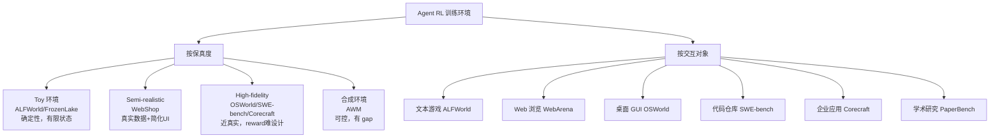
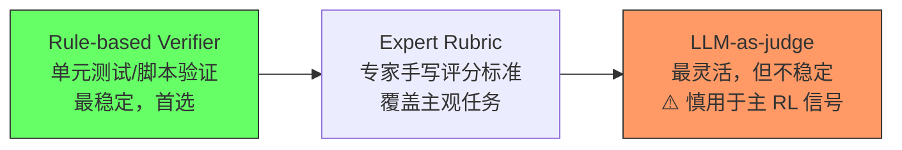
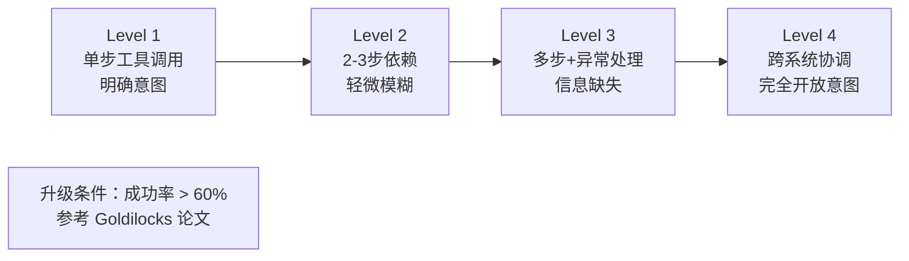
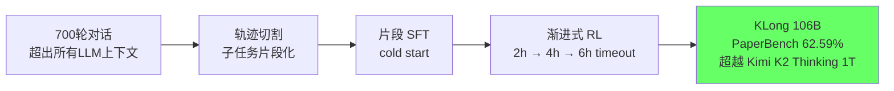
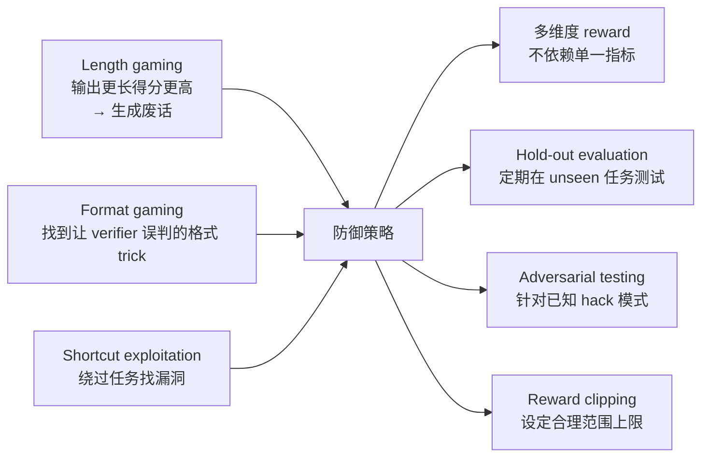
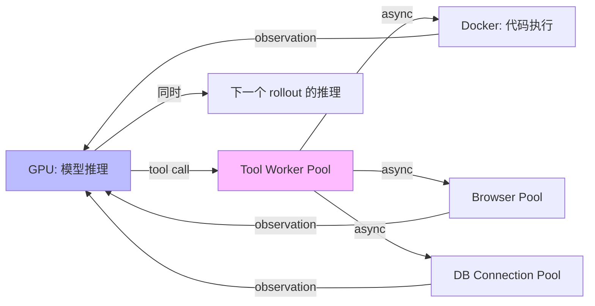

# Agent RL 环境工程系统论

> 核心命题：**环境质量是 Agent RL 泛化能力的硬上限**。Toy 环境出 toy agent——这不是直觉，是 EnterpriseGym（arXiv 2602.16179）的实验结论。

---

## 一、为什么环境比算法更重要

### 1.1 标准失败模式


失败原因：模型学到的是"hack 这个游戏的解题技巧"，不是真正的 agent 能力。训练环境 10 种商品 / 5 个固定意图，真实场景百万商品 / 意图模糊——distribution gap 是本质。

### 1.2 EnterpriseGym 的硬数据（arXiv 2602.16179）

| 模型 | 低保真 benchmark | Corecraft 企业环境 |
|------|-----------------|------------------|
| GPT-5.2 | >70% | **< 30%** |
| Claude Opus 4.6 | >70% | **< 30%** |

在高保真 Corecraft 上用 GRPO 训练 GLM 4.6 **一个 epoch**，OOD 泛化：
- +4.5% BFCL Parallel
- +7.4% τ²-Bench Retail
- +6.8% Toolathlon

同等条件在 toy 环境上训练：OOD 提升接近 0。

**结论**：算法（GRPO）固定，决定泛化能力的是环境质量。

---

## 二、训练环境分类体系



**保真度谱系的代价**：

$$\text{训练成本} \propto \text{保真度}^{1.5}$$

（粗略估计：高保真环境 rollout 时间长 10-100x，reward 设计工作量大 10x）

---

## 三、环境设计六大原则

基于 EnterpriseGym、OSWorld、SWE-bench、PaperBench 设计哲学综合：

### 原则 1：Task-Centric World Building

**错误顺序**：先设计"真实感"世界 → 再想任务  
**正确顺序**：先定义目标能力 → 倒推世界需要什么

Corecraft 例子（arXiv 2602.16179）：
- 目标：企业客服（退款/换货/查询/跨部门协调）
- → 2500+ 客户实体 / 14 种实体类型 / 23 种工具
- 不是"模拟公司"，是"为任务量身造世界"

### 原则 2：Expert-Authored Rubrics

**Reward 来源优先级**（重要！）：



专家 rubric 示例（退款任务）：

```yaml
rubric:
  - criterion: "识别退款资格"
    required: true
    points: 20
    verifier: "check_refund_eligibility(state)"
  - criterion: "查询正确订单状态"
    required: true
    points: 20
  - criterion: "按流程提交退款"
    required: true
    points: 30
  - criterion: "发送确认邮件"
    required: false
    points: 15
  - criterion: "SLA 内完成"
    required: false
    points: 15
```

### 原则 3：Enterprise Workflows（反映真实工作流）

真实 agent 任务的四个关键特征：

| 特征 | 描述 | Toy 环境是否有 |
|------|------|--------------|
| Multi-step with dependencies | 步骤有依赖，顺序不能乱 | 通常无 |
| Exception handling | 工具出错/数据缺失才是真挑战 | 无 |
| Ambiguity | 模糊自然语言输入，需理解意图 | 无 |
| Side effects | 动作有真实影响（发邮件/改DB） | 无 |

### 原则 4：Task Diversity Over Instance Count

$$\text{1000 个相似任务} \ll \text{100 个覆盖不同能力维度的任务}$$

多样性维度：难度谱系 / 异常类型 / 工具组合 / 意图类型 / 状态初始化

### 原则 5：Verifiable Terminal States

```python
# ❌ 差：
reward = llm_judge("Did the agent complete the task?")

# ✅ 好：
def task_success(final_state, goal_spec) -> bool:
    return (
        final_state.order_status == "refunded" and
        final_state.customer_email_sent == True and
        abs(final_state.refund_amount - goal_spec.expected_amount) < 0.01
    )
```

LLM judge 的随机性会让 RL 学到"糊弄 judge"的策略，而不是真正完成任务。

### 原则 6：Controllable Difficulty Progression



---

## 四、主流环境 RL 训练详解

### 4.1 SWE-bench — 软件工程

**设计亮点**：GitHub Issues + PR + test suite，reward 100% deterministic（unit test pass/fail）

**RL 训练的根本挑战**：

$$\text{pass@1}_{\text{7B}} < 10\% \implies P(\text{reward}>0) < 10\% \implies \text{几乎无正向梯度}$$

**Agent-RLVR 解法**（arXiv 2506.11425）：Guidance rewards，两阶段循环（见[[AI/2-Agent/Agentic-RL/Tool-Use-RL-训练专题|Tool-Use-RL-训练专题]]）→ 9.4% → 22.4%

**基础设施**：每 rollout 需要独立 Docker container，并行需要 container 编排系统

### 4.2 OSWorld — 计算机使用

**设计亮点**：真实 OS（Win/Linux/Mac）+ 真实应用，多模态（截图 + DOM），任务是真实用户任务

**重要发现（UI-TARS-2, arXiv 2509.02544）**：在 web 任务（Online-Mind2Web）上做 RL 训练，OOD 迁移到 OSWorld +10.5%，AndroidWorld +8.7%。GUI agent 底层能力有通用性。

**挑战**：截图 token 多（状态表征贵），动作粒度问题（像素级 vs 元素级）

### 4.3 WebArena — Web 任务

**设计亮点**：自建 web 服务器（GitLab/Reddit/Shopping 风格），可离线，Functional Correctness Verifier（脚本验证）

**RL 训练经验（WebAgent-R1, arXiv 2505.16421）**：

| 变体 | warm-up | 收敛速度 |
|------|---------|---------|
| WebAgent-R1-Zero | ❌ 直接 RL | 极慢，早期几乎无正向 reward |
| WebAgent-R1-CoT | ✅ SFT behavior cloning | 快很多 |

**结论**：Web Agent RL 必须有 behavior cloning warm-up，理由：random exploration 在 web 任务中几乎找不到成功 trajectory。

### 4.4 PaperBench — 极长任务（12h / 700+ 轮）

**RL 训练的特殊处理（KLong, arXiv 2602.17547）**：



渐进式 timeout 的原理：直接 6h → 成功率极低，无正向信号；从 2h 开始 → 有足够成功案例，RL 能学习。

---

## 五、合成环境：AWM 方法论

**AWM = Agent World Model**（arXiv:2602.10090，**ICML 2026**，Snowflake AI + UIUC）  
**完整精读笔记**：[[AI/2-Agent/Agentic-RL/AWM-Agent-World-Model-Synthetic-Environments|AWM 精读笔记]]

### 核心思路

AWM 的根本思路不是"用 LLM 模拟环境"，而是**用 LLM 生成代码，让代码作为环境**：

```
场景描述（文字）
    ↓ LLM 生成
用户任务（需求）
    ↓ 任务驱动
数据库 Schema（SQLite）
    ↓
MCP 工具接口（Python 代码）
    ↓
验证代码（Reward 信号）
    ↓
可执行环境（POMDP）
```

**关键 insight：任务→数据库（需求驱动设计）**

大多数系统是"先设计 DB，再看能做什么任务"。AWM 反过来："先生成用户任务，再设计能支持这些任务的 DB"——这保证了每个任务从初始状态都可执行，避免了"DB 有数据但任务无法完成"的设计失误。

### AWM 的规模

- **1,000 个唯一场景**（finance / travel / retail / social media / CRM...）
- **35,062 个 MCP 工具**（平均每环境 35 个）
- **10,000 个任务**（每环境 10 个）+ 配套验证代码
- 每步 1,024 并行环境实例支持大规模 RL

### 为什么代码驱动 >> LLM 模拟

| 维度 | LLM 模拟环境 | AWM 代码驱动环境 |
|------|------------|--------------|
| 状态一致性 | ❌（幻觉问题）| ✅（代码确定性）|
| 速度 | 慢（每步需 LLM 调用）| 快（毫秒级执行）|
| 成本 | 高 | 低（只生成时需要 LLM）|
| Reward 可靠性 | ❌（LLM judge 可被 game）| ✅（程序验证）|
| RL 训练可用性 | 困难 | ✅（并行 + 快速 reset）|

### AWM 的 Reward 设计

双层 reward：
1. **Verification code**（主）：比较执行前后 DB 状态，binary correctness
2. **LLM-as-Judge**（辅）：语义完成度评分，兜底无法程序化验证的任务

### OOD 泛化结论

仅在 AWM 合成环境训练，在 τ²-bench / BFCL v4 / TheMCPCompany 三个 OOD benchmark 上均超越 benchmark-specific 训练的 agent。

机制：MCP 标准接口的一致性 + 场景多样性（1000 场景）让 agent 学到可迁移的通用工具使用策略，而非 benchmark-specific 技巧。

### 适用场景与局限

| 适用 | 局限 |
|------|------|
| 真实环境数据稀缺 | 只涵盖 API/CRUD 类任务（不含 GUI 操作）|
| 真实环境运行成本高 | 合成→真实 distribution gap 仍存在 |
| 需要精准 curriculum 控制 | 课程学习（难度递进）尚未实现 |
| tool-use RL 基础设施搭建 | 1000 环境对于大模型 RL 仍有限 |

---

## 六、Reward 工程系统论

### 6.1 三种来源对比

| 来源 | 稳定性 | 覆盖范围 | 成本 | 适用场景 |
|------|--------|---------|------|---------|
| Rule-based Verifier | ★★★★★ | 窄（需程序化） | 低 | SWE-bench/WebArena |
| Expert Rubric | ★★★★ | 中等 | 高（专家时间） | 企业 agent，客服 |
| LLM-as-judge | ★★★ | 广（任何任务） | 中 | 开放式任务，辅助信号 |

### 6.2 Potential-based Reward Shaping

理论保证：不改变最优策略，但让 reward 更密集（Ng et al. 1999）：

$$R_{\text{shaped}}(s,a,s') = R(s,a,s') + \gamma \cdot \Phi(s') - \Phi(s)$$

其中 $\Phi(s)$ 是势函数（potential function），可以设计为"任务进度"的估计。

### 6.3 Progress Reward（进度奖励）

对长任务特别有效：

$$R_{\text{progress}} = \sum_{c \in \text{checkpoints}} w_c \cdot \mathbb{1}[\text{达到检查点}\ c]$$

```python
# SWE-bench 风格的进度 reward 设计
progress_reward = {
    "found_relevant_file": +0.1,      # 定位到相关文件
    "identified_bug_location": +0.2,   # 精确定位 bug
    "wrote_fix": +0.3,                 # 写出了修复代码
    "tests_pass": +1.0                 # 单元测试通过
}
```

### 6.4 Reward Hacking 防御

**常见 hack 模式**：



---

## 七、基础设施考量

### 7.1 异步 Rollout 架构

Agent RL rollout 不同于单步 RL：每步可能有外部 I/O（代码执行/浏览器/DB），分钟级。



VerlTool（arXiv 2509.01055）实测：异步 rollout 近 **2x speedup**

### 7.2 评估策略

**不能只看训练 reward**：

$$\text{评估分层} = \begin{cases} \text{Task-level} & \text{整体任务成功率} \\ \text{Step-level} & \text{每步决策质量（debug 用）} \\ \text{Tool-level} & \text{工具调用准确率} \\ \text{OOD-level} & \text{迁移到 unseen 环境} \end{cases}$$

---

## 八、启发思考

### So What

环境工程的深层含义：**数据飞轮的起点**。好环境 → 好训练数据 → 好 agent → 可以在更难环境里 rollout → 更好数据。反之，toy 环境是恶性循环的起点。这比算法改进重要得多，因为算法可以移植，但环境质量决定上限。

### 局限与未解问题

1. **高保真环境构建成本**：Corecraft 这样的企业环境需要大量专家时间设计 rubric，难以快速扩展到新域
2. **Reward 的 completeness**：如何保证 rubric 覆盖了所有重要的任务维度？遗漏的维度会被 agent 利用
3. **合成 vs 真实的 gap 量化**：目前没有好的指标衡量合成环境与真实环境的"接近程度"
4. **动态环境**：真实环境会随时间变化（API 版本更新/网站改版），训练好的 agent 如何应对？

### 脑暴拓展

- **自适应环境**：让环境根据 agent 当前能力自动调整难度（类似 KLong 渐进式，但全自动）
- **环境生成 LLM**：用 LLM 自动生成高质量 rubric 和 edge cases，降低专家成本
- **跨环境 transfer curriculum**：先在便宜环境训练，再在贵环境 fine-tune，节省计算
- **环境对抗**：专门训练一个"环境生成器"来创造 agent 的弱点场景（类似 adversarial training）

---

## 九、落地应用

### 可用场景

| 业务场景 | 推荐环境方案 | 关键设计决策 |
|---------|------------|------------|
| 企业内部 agent | 仿 Corecraft 方法，自建高保真环境 | Expert rubric + rule-based verifier 组合 |
| 代码 review/修复 | SWE-bench 框架移植 | Guidance rewards 解决稀疏问题 |
| 客户服务 | 合成环境 + 少量真实任务验证 | 多样性 > 数量 |
| 桌面/Web 自动化 | OSWorld/WebArena 框架 | 必须 behavior cloning warm-up |

### 工程要点

1. **先设任务，再建世界**——原则 1 的工程化：写任务列表 → 确认需要什么工具/状态 → 才开始实现环境
2. **reward verifier 优先于 judge**——上线前做 reward sanity check：100 条手工对比，确认 verifier 和人工判断一致性 >95%
3. **环境隔离**——每个 rollout 独立容器，任务结束后 snapshot reset
4. **定期 OOD 评估**——每 1000 training steps 在 held-out benchmark 跑一次，监测 reward hacking

### 面试高频问法

**Q: 为什么说环境比算法更重要？**
> EnterpriseGym（arXiv 2602.16179）提供了直接证据：GPT-5.2 和 Claude Opus 4.6 在低保真 benchmark 上 >70%，在高保真企业环境 <30%。说明 frontier model 能力远没被解决，低保真分数是幻觉。更关键的是：在高保真 Corecraft 上训练 GLM 一个 epoch，OOD 泛化 +4-8%；toy 环境训练几乎 0 OOD 提升。算法（GRPO）固定，环境决定泛化上限。

**Q: Reward function 怎么设计？**
> 三层优先级：(1) Rule-based verifiable——代码 unit test / 功能验证脚本，稳定无噪声，首选；(2) Expert rubric——专家手写 pass/fail 标准，覆盖主观任务；(3) LLM-as-judge——最灵活但不稳定，只作辅助信号，必须加 ensemble 和 consistency check。关键是防 reward hacking：多维度打分 + 定期 held-out 评估。

**Q: 极长任务（PaperBench 这种）怎么做 RL 训练？**
> KLong（arXiv 2602.17547）的方案：轨迹切割 SFT（cold start）+ 渐进式 RL（2h → 4h → 6h timeout）。核心思路是先让模型在短片段上建立基础能力（有足够成功轨迹），再逐步增加 horizon。直接用全 timeout 训练成功率极低，RL 无法获得正向信号。

---

## 推荐阅读

### 原始论文
- **EnterpriseGym/Corecraft**: https://arxiv.org/abs/2602.16179
- **SWE-bench**: https://arxiv.org/abs/2310.06770（ICLR 2024）
- **OSWorld**: https://arxiv.org/abs/2404.07972
- **WebArena**: https://arxiv.org/abs/2307.13854（ICLR 2024）
- **PaperBench**: https://openai.com/research/paperbench
- **KLong**: https://arxiv.org/abs/2602.17547
- **Agent-RLVR**: https://arxiv.org/abs/2506.11425

### 相关 Vault 笔记
- [[AI/2-Agent/Agentic-RL/EnterpriseGym-Corecraft|EnterpriseGym-Corecraft]] — Corecraft 单独深读
- [[AI/2-Agent/Agentic-RL/AWM-Agent-World-Model-Synthetic-Environments|AWM-Agent-World-Model-Synthetic-Environments]] — 合成环境方法论
- [[AI/2-Agent/Agentic-RL/Tool-Use-RL-训练专题|Tool-Use-RL-训练专题]] — Reward 设计详细展开
- [[AI/2-Agent/Agentic-RL/Long-Horizon-Credit-Assignment专题|Long-Horizon-Credit-Assignment专题]] — 长任务 credit assignment 算法
- [[AI/2-Agent/Agentic-RL/KLong-Extremely-Long-Horizon-Agent|KLong-Extremely-Long-Horizon-Agent]] — KLong 单独深读
- [[AI/2-Agent/Evaluation/Agent-评测与-Benchmark|Agent 评测与 Benchmark]] — 评估体系
