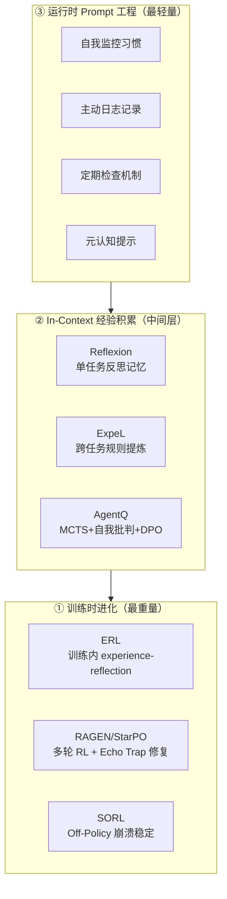
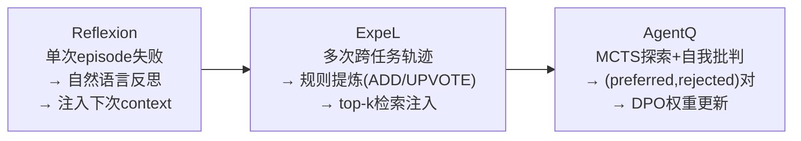
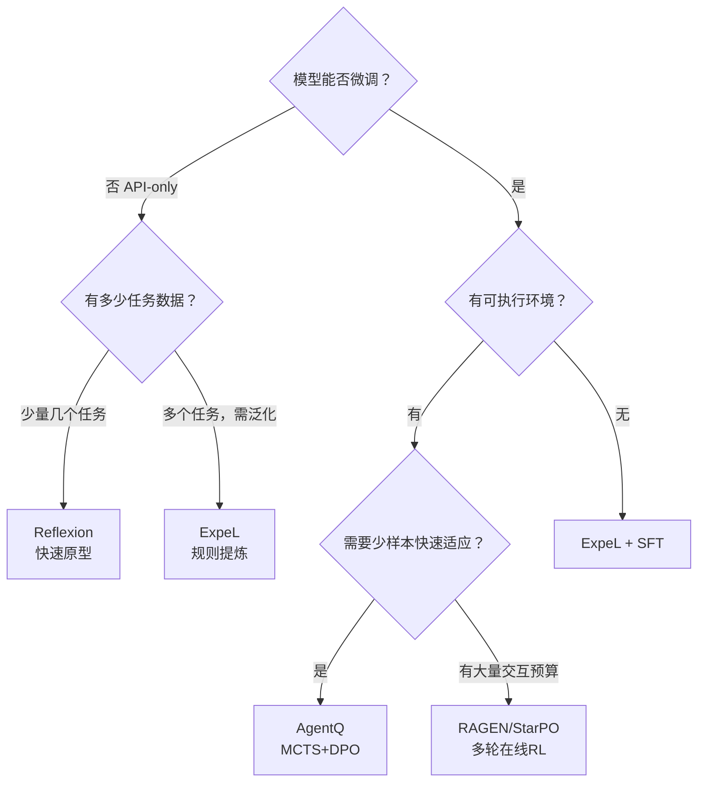

# Agent 进化模式谱系：三层框架与工程选择

> 老板指令（2026-02-27）：Vault 里缺少训练时/运行时/in-context 三层统一框架，且必须映射到贾维斯实践。

---

## 为什么需要谱系视角

"让 Agent 变得更好"这件事有很多做法：写更好的 Prompt、让它反思、让它积累经验规则、用 RL 训练、MCTS 探索……这些方法并不是同一个问题的不同答案，而是**不同问题的正确答案**。

混用会产生严重的认知错误：
- 用 Reflexion 解决"模型根本不会某类任务"→ 无效（in-context 无法弥补知识缺失）
- 用 RL 解决"Agent 忘了上次踩过的坑"→ 过度工程（MEMORY.md 就够了）

谱系视角的价值：**给每种进化需求匹配正确的方法，避免用大炮打蚊子或用竹竿敲老虎**。

---

## 三层框架



---

## 第①层：训练时进化（权重永久更新）

**本质**：通过 RL/监督信号直接更新模型权重，进化效果持久。

### 代表方法

| 方法 | 核心机制 | 解决的问题 |
|------|---------|-----------|
| **ERL** | 训练内嵌 experience-reflection-consolidation 三循环 | 训练本身学会如何从经验中学习 |
| **RAGEN/StarPO** | 多轮 trajectory-level RL + Echo Trap 三修复机制 | 多步 Agent RL 训练稳定性 |
| **SORL** | Turn-level IS + CTN 解决 off-policy 崩溃 | 长 horizon off-policy 训练不崩 |
| **AgentQ（越层）** | MCTS + 自我批判 + DPO 少量数据更新权重 | 少样本快速领域适应 |

### 适用判断

- 有明确的任务分布 + 可执行的环境 + 计算资源 → 用第①层
- 需要突破模型的"知识天花板"（模型本来就不会）→ 必须第①层
- 优化已有能力的"执行质量"（会但执行不稳）→ 考虑第②层

**天花板**：训练数据和环境的覆盖范围决定上限。

---

## 第②层：In-Context 经验积累（不更新权重）

**本质**：把经验转化为 context（文字、规则、案例），让 LLM 在有更多信息的情况下做更好的决策。

### 三阶梯进化



| 方法 | 记忆粒度 | 跨任务 | 是否更新权重 | Context 效率 |
|------|---------|--------|------------|------------|
| Reflexion | 单 episode 反思 | ❌ | ❌ | 低（全量注入） |
| ExpeL | 跨任务规则库 | ✅ | ❌ | 高（检索 top-k） |
| AgentQ | MCTS 轨迹对 | ✅ | ✅（DPO） | 无需在线 |

### 适用判断

- 模型 API-only（无法微调）→ Reflexion/ExpeL
- 有少量真实任务数据 + 能执行环境 → AgentQ
- 需要跨任务积累规则 → ExpeL
- 快速原型验证（几天内） → Reflexion

**天花板**：Context window 和基础模型能力的双重限制。

---

## 第③层：运行时 Prompt 工程（最轻量）

**本质**：通过 Prompt 设计，让 Agent 在单次对话/执行中表现更好。不积累跨 session 经验。

Vault 已有详细的 10 种模式：[[AI/2-Agent/Agentic-RL/Agent自我进化策略-从记忆习惯到自主成长|Agent 自我进化策略]]

- 自我监控习惯、主动日志记录、定期自我检查
- 元认知提示、失败分析模板、目标对齐确认
- ...

**适用判断**：这是所有 Agent 的基础配置，成本几乎为零，先做完再考虑上层。

---

## 贾维斯/魂匣军团的现状与升级路径

### 现状定位

```
贾维斯 MEMORY.md 机制：
├── 心跳日志 = Reflexion 的 episodic memory buffer
├── memory/YYYY-MM-DD.md = 单日反思记录
├── MEMORY.md = 跨日提炼（雏形规则库，但缺机制）
└── heartbeat-state.json = 状态追踪
→ 定位：第②层 Reflexion 级别
```

### 缺少的组件

1. **Evaluator 缺失**：Reflexion 的关键是外部验证信号（单元测试通过/环境返回）；我们的反思质量完全依赖 Agent 自我判断，没有外部验证
2. **规则置信度机制缺失**：MEMORY.md 里的"方法论发现"是规则库雏形，但没有 UPVOTE/DOWNVOTE——好规则和坏规则同等待遇
3. **跨 Agent 规则共享缺失**：贾维斯积累的规则和学者积累的规则是隔离的，ExpeL 式的跨任务迁移没有发生

### 具体升级方案

**第一步（可立即做）：强化 Evaluator**
- 每次心跳结束：给自己的工作质量打分（1-5分），说明理由
- 老板的"空汇报零容忍"等反馈 = 外部 Evaluator 信号，应该显式记录并提炼规则

**第二步（中期）：规则库机制化**
- MEMORY.md 增加 `## 规则库（置信度排序）` 章节
- 每条规则标注出处（基于哪次经验）+ 验证次数（UPVOTE）+ 反例（DOWNVOTE）

**第三步（长期）：多 Agent 规则共享**
- 公告板机制延伸：不只是任务派发，也分享"我发现的有效工作规则"
- 馆长维护全局规则库，各 Agent 贡献和消费

---

## 选型决策树



---

## 启发思考

1. **进化的本质是记忆压缩**：三层的区别在于记忆以什么形式存储、压缩到哪个粒度。Prompt 工程 = 即时记忆；in-context = 短期记忆；训练 = 长期记忆（权重）。这和人类认知的三级记忆系统高度同构。

2. **没有一种方法能覆盖所有场景**：Reflexion 做不到权重更新，RL 做不到 API-only 场景。谱系视角最重要的价值是**不再问"哪个方法最好"，而是问"这个场景最适合哪一层"**。

3. **2026年的新趋势：层间融合**：AgentQ 模糊了第①②层的边界（in-context 探索 + 权重更新）；RAGEN 让训练时进化也有了 in-context 的灵活性（StarPO 框架统一了多种 RL 变体）。未来可能的方向：动态选择当前应该在哪一层进化。

---

## See Also

**第②层（in-context）核心论文**
- [[AI/2-Agent/Agentic-RL/Reflexion-Verbal-Reinforcement-Learning|Reflexion]] — in-context 进化奠基（NeurIPS 2023）
- [[AI/2-Agent/Agentic-RL/ExpeL-Experiential-Learning-Agent|ExpeL]] — 跨任务规则提炼（AAAI 2024）
- [[AI/2-Agent/Agentic-RL/AgentQ-MCTS-Self-Critique-DPO|AgentQ]] — MCTS+DPO 桥接（2024）

**第①层（训练时）核心论文**
- [[AI/2-Agent/Agentic-RL/ERL-Experiential-Reinforcement-Learning|ERL]] — 训练内 experience-reflection
- [[AI/2-Agent/Agentic-RL/RAGEN-StarPO-Multi-Turn-RL-Self-Evolution|RAGEN/StarPO]] — 多轮 RL 奠基（★★★★★）
- [[AI/2-Agent/Agentic-RL/SORL-Stabilizing-Off-Policy-RL-Long-Horizon-Agent|SORL]] — Off-Policy 稳定化

**第③层（运行时）**
- [[AI/2-Agent/Agentic-RL/Agent自我进化策略-从记忆习惯到自主成长|Agent 自我进化策略]] — 10 种 Prompt 工程进化模式

**工程实现案例**
- [[Projects/Agent-Self-Evolution/004-记忆代谢|实验 004：记忆代谢]] — 贾维斯从第②层 Reflexion 升级到 ExpeL 的实际工程路径（S/A/B 三级规则库 + Phase 2 Evaluator 机制）
