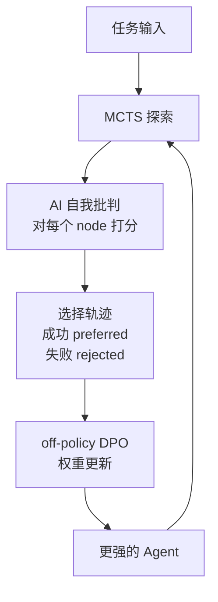
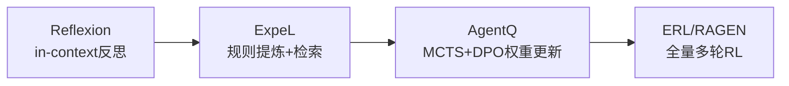

# AgentQ: Advanced Reasoning and Learning for Autonomous AI Agents

> **核心一句话**：用 MCTS 系统性探索动作空间 + AI 自我批判打分 + off-policy DPO 更新权重——这是从"in-context 反思进化"到"权重级进化"的过渡方案。

## 问题背景

Web Agent 的核心难题：
1. **监督微调（SFT）的局限**：行为克隆依赖专家演示，遇到分布外的状态就崩溃
2. **在线 RL 成本高**：需要大量环境交互，Web 环境 step 慢且不稳定
3. **纯 in-context 方法（Reflexion/ExpeL）**：上限是模型本身的能力，不能突破权重

**AgentQ 的思路**：用 MCTS 把少量真实环境交互放大为丰富的训练信号，再用 DPO 把这些信号烧入权重。

## 三核心机制

**机制1 — Guided MCTS**
- 不是随机搜索，用当前 LLM 的先验概率指导搜索方向
- 每个 node = 一个中间状态（网页上的某个操作点）
- UCB 公式平衡探索/利用，避免局部最优

**机制2 — AI 自我批判（Self-Critique）**
- 不依赖人工标注或真实任务结果信号
- LLM 自己对每个中间状态/轨迹打分：这一步是否朝着目标前进？
- 关键：这让系统可以从**失败轨迹的中间步骤**中学习，不只是最终 success/failure

**机制3 — Off-policy DPO**
- 把 MCTS 产生的 (preferred, rejected) 轨迹对送给 DPO
- Off-policy：数据来自过去的探索，不需要 online 实时收集
- 权重真正更新——这是和 Reflexion/ExpeL 的本质区别

## 实验结果

| 设置 | 零样本 | 行为克隆 | AgentQ |
|------|--------|---------|--------|
| WebShop | baseline | +10% | **超越人类均值** |
| 真实预订（Llama-3 70B） | 18.6% | — | **81.7%**（+340%） |
| + 在线搜索 | — | — | **95.4%** |

**单日数据收集后即达到如此提升**——这说明 MCTS 的采样效率极高。

## AgentQ 在进化谱系中的位置

| 方法 | 是否更新权重 | 进化范式 | 适用场景 |
|------|------------|---------|---------|
| Reflexion | ❌ | in-context 反思 | 快速原型，无训练资源 |
| ExpeL | ❌ | 规则提炼+检索 | 多任务，规则可迁移 |
| AgentQ | ✅ | MCTS+DPO | 有少量真实任务，需永久提升 |
| RAGEN/StarPO | ✅ | 多轮 online RL | 有大规模训练环境 |

## 局限

- MCTS 计算开销较大（对每个 node 多次 rollout）
- 需要可以执行的真实/模拟环境（Web Agent 有，但很多任务场景没有）
- 自我批判的质量依赖基础模型能力

## 落地应用

- **Web 自动化**：用少量真实浏览器环境交互快速训练领域专用 Agent
- **客服 Agent**：从客服记录中提取 (好回答/差回答) 对，DPO 迭代
- **代码 Agent**：MCTS 搜索不同代码实现路径，测试通过/失败作为 critic 信号

## 启发思考

1. **MCTS + 自我批判 = 无监督数据飞轮**：不需要人工标注，让 Agent 自己生成训练数据——这是 scalable 的关键
2. **DPO 比 PPO 更适合 Agent**：DPO 是 off-policy 的，可以用历史数据训练；PPO 需要 online rollout，Web 环境太慢
3. **340% 提升的本质**：不是模型变聪明了，是从"不知道 Web 操作序列"到"知道了"的分布跃迁——说明 LLM 能力早就在那，缺的是正确的训练数据

## See Also

- [[AI/2-Agent/Agentic-RL/ExpeL-Experiential-Learning-Agent|ExpeL]] — 前驱：in-context 规则提炼（不更新权重）
- [[AI/2-Agent/Agentic-RL/RAGEN-StarPO-Multi-Turn-RL-Self-Evolution|RAGEN/StarPO]] — 同期：多轮 RL 进化（更大规模训练时进化）
- [[AI/2-Agent/Agentic-RL/ERL-Experiential-Reinforcement-Learning|ERL]] — 相关：从经验中强化学习的另一路线
- [[AI/2-Agent/Agentic-RL/Agent-进化模式谱系|Agent 进化模式谱系]] — 三层统一框架
