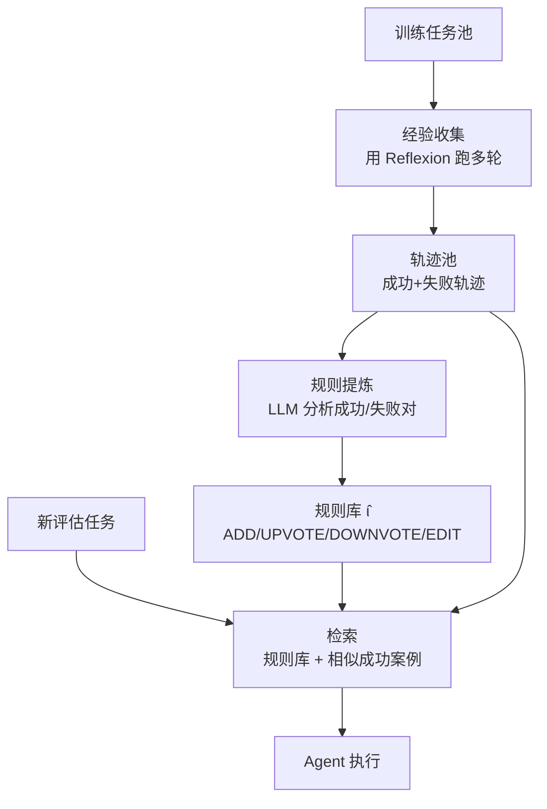

# ExpeL: LLM Agents Are Experiential Learners

> **核心一句话**：Reflexion 让 Agent 从单次失败中学习；ExpeL 让 Agent 从大量轨迹中提炼通用规则，并在新任务中即时检索相关成功案例。

## 动机：Reflexion 的天花板

Reflexion 的反思只存在于当前 episode 的 context 里，跨任务无法迁移，且 context window 限制了可积累的反思数量。**如何把多次经验压缩为可复用的通用知识？**

## 三阶段流程

**阶段1 — 经验收集（Collection）**
- 用 Reflexion 机制在训练任务上跑多轮，收集成功轨迹 + 失败轨迹
- 每个任务最多 N 次尝试（失败则 Reflexion 反思后重试）

**阶段2 — 规则提炼（Extraction）**
- LLM 分析成功/失败轨迹对，提炼跨任务可复用的规则
- 四种动态操作：
  - `ADD`：发现新规则
  - `UPVOTE`：同一规则在多个轨迹中验证 → 置信度提升
  - `DOWNVOTE`：规则失效 → 置信度降低
  - `EDIT`：规则需要细化/纠正
- 结果：一个置信度排序的规则库 ι̂

**阶段3 — 推理时应用（Retrieval + Application）**
- 新任务来了：检索规则库（top-k 相关规则）+ 检索最相似的成功轨迹
- 同时注入 context，让 Agent 在有「通用规则」和「具体案例」的情况下决策

## 实验结果

在 HotPotQA / ALFWorld / WebShop 等任务上，ExpeL 显著优于：
- 纯 ReAct（无记忆）
- Reflexion（任务级记忆）
- 且随经验积累持续提升（learning curve 正相关）

关键发现：**规则库 + 案例检索双管齐下效果最好**，单独用规则或单独用案例都不如组合。

## ExpeL vs Reflexion 对比

| 维度 | Reflexion | ExpeL |
|------|-----------|-------|
| 记忆粒度 | 单次 episode 的文字反思 | 跨任务提炼的规则 + 成功案例 |
| 跨任务泛化 | ❌ 无 | ✅ 规则库全局共享 |
| Context 效率 | 低（全量反思注入） | 高（检索 top-k 相关） |
| 知识压缩 | 无 | ADD/UPVOTE/DOWNVOTE/EDIT |
| 适用场景 | 单任务反复优化 | 多任务、需要规则迁移 |

## 落地应用

- **多工具 Agent**：从历史工具调用轨迹提炼"何时用哪个工具"的规则，新任务直接应用
- **客服/对话 Agent**：从大量对话日志提炼沟通规则，注入新 session
- **代码生成**：从失败的代码修复轨迹提炼"常见 bug 模式"规则库

## 对贾维斯/魂匣的启发

我们的 MEMORY.md 更接近 Reflexion（任务级记忆），而非 ExpeL（规则库）。

**升级路径**：
1. 当前：心跳日志写入 MEMORY.md（Reflexion 级别）
2. 目标：定期从心跳日志提炼「Agent 工作规则库」（ExpeL 级别）
3. 具体：MEMORY.md 里的「方法论发现」章节 = 雏形规则库，但缺乏 UPVOTE/DOWNVOTE 机制

## 启发思考

1. **规则置信度管理是关键**：UPVOTE/DOWNVOTE 机制让规则有生命周期——错误规则会被降权，这比 Reflexion 的"写了就存在"更健康
2. **检索比全量注入更实用**：从大规则库检索 top-k 相关，比把所有规则全塞 context 更高效，这是 RAG 思路在 Agent 记忆上的应用
3. **训练/推理解耦**：经验收集在训练任务上做，规则在新任务上用——这让系统可以离线积累、在线应用，适合生产环境

## See Also

- [[AI/2-Agent/Agentic-RL/Reflexion-Verbal-Reinforcement-Learning|Reflexion]] — 前驱：ExpeL 的 经验收集阶段直接使用 Reflexion 框架
- [[AI/2-Agent/Agentic-RL/AgentQ-MCTS-Self-Critique-DPO|AgentQ]] — 进一步进化：用 MCTS + DPO 做系统性探索（训练权重而非 in-context）
- [[AI/2-Agent/Agentic-RL/Agent-进化模式谱系|Agent 进化模式谱系]] — 三层框架（ExpeL 是 in-context 进化层的进阶版）
- [[AI/2-Agent/Fundamentals/Agent-Memory-机制|Agent Memory 机制]] — 更宽泛的 Agent 记忆系统设计
- [[Projects/Agent-Self-Evolution/004-记忆代谢|实验 004：记忆代谢]] — ExpeL 规则库机制在贾维斯 MEMORY.md 的工程实现（ADD/UPVOTE/DOWNVOTE → S/A/B 三级置信度）
