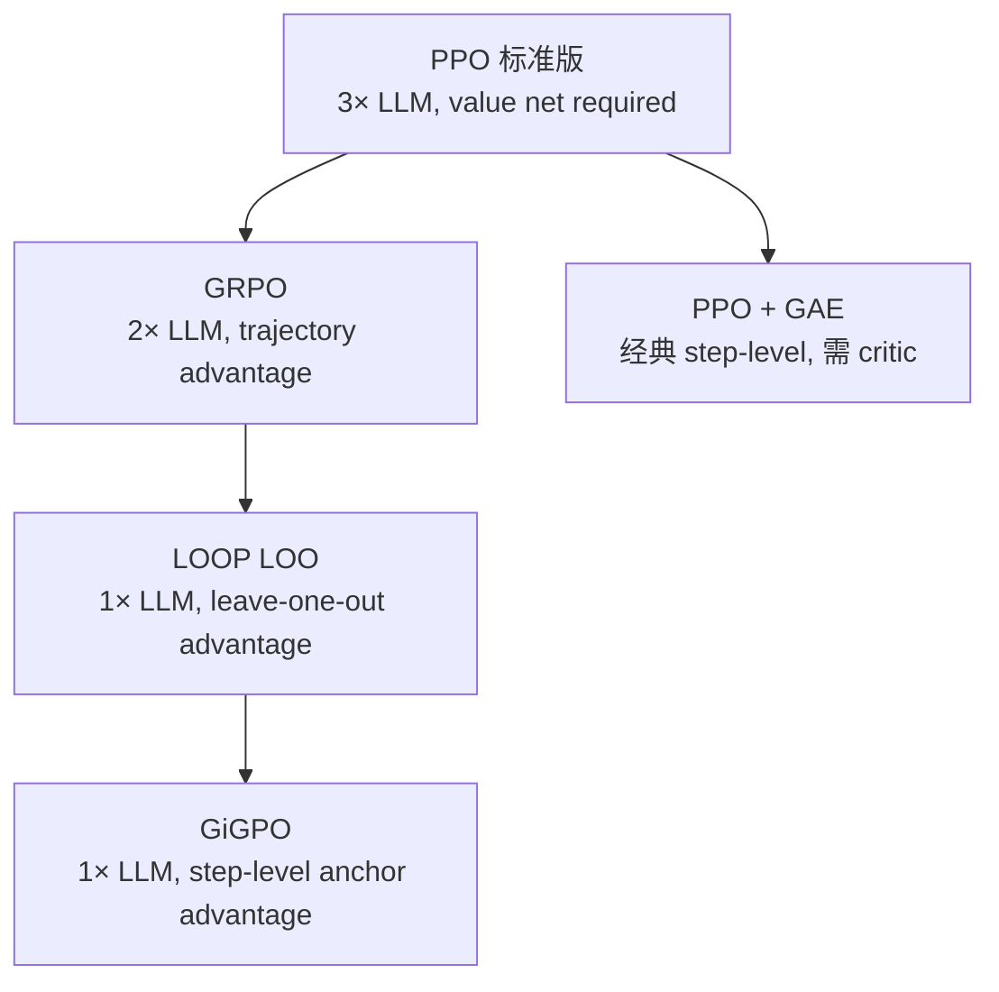

# LOOP: Leave-One-Out PPO for Long-Horizon Interactive LLM Agents

## 一、问题：为什么现有方法不够用？

Interactive Digital Agents（IDA）的任务范式：
- 用户发出自然语言请求（"帮我安排一次所有人都有空的会议"）
- Agent 通过多轮 API 调用完成任务（查各人日历 → 找共同空闲 → 创建事件 → 通知参与者）
- 环境是**有状态**的（stateful）：第 n 步的 API 调用会改变环境，影响后续步骤
- **信息不完全**：Agent 不能一次性看到所有所需信息，必须主动探索

**现有方法的上限**：Instruction-tuned LLM（SFT）在 AppWorld 上准确率 < 50%，原因：
1. 静态数据集训练，无法适应特定环境的 API 细节
2. 开环控制倾向（Open-Loop Bias）：倾向于一次性生成所有代码，不检查中间结果
3. 过度依赖假设（confabulation）：未查 API 就假设"所有联系人都在支付 app 里"

**LOOP 的切入点**：直接在目标环境中用 RL 训练，而非在静态 demonstration 数据上 SFT。

---

## 二、核心贡献：LOOP = Leave-One-Out PPO

### 2.1 POMDP 建模

将 IDA 训练形式化为**部分可观测 MDP（POMDP）**：

$$\mathcal{M} = (\mathcal{S}, \mathcal{A}, \mathcal{T}, \mathcal{R}, \mathcal{O}, \mathcal{Z}, \gamma)$$

- **State** $s$：环境的完整状态（数据库内容、日历条目、用户关系等）
- **Observation** $o \in \mathcal{O}$：Agent 看到的 API 返回结果（不是全部状态）
- **Action** $a \in \mathcal{A}$：生成的 API 调用代码（token 序列）
- **Reward** $r$：任务完成程度（二值或连续，基于单元测试）

为什么是 POMDP 而非 MDP？Agent 无法直接读取数据库，必须通过 API 调用逐步发现信息——这是部分可观测的本质。

### 2.2 Leave-One-Out Baseline（核心机制）

**问题**：PPO 需要 value network 来估计状态价值 $V(s)$，但 value network 需要额外 LLM，内存翻倍+。

**LOOP 的解法**：用 **Leave-One-Out（LOO）baseline** 替代 value network：

对同一任务生成 $K$ 个 rollout，第 $k$ 个 rollout 的 advantage 估计：

$$\hat{A}_k = R_k - \frac{1}{K-1} \sum_{j \neq k} R_j$$

即：**用"其他所有 rollout 的平均 reward"作为当前 rollout 的 baseline**。

**类比理解**（来自论文分析）：
- 5 名学生考试，学生 A 得 90 分
- Baseline = 其他 4 人平均 = 85 分
- A 的 advantage = 90 - 85 = +5（正向强化）
- 学生 B 得 80 分，baseline = 85，advantage = -5（负向惩罚）

**与 GRPO 的关系**：GRPO 用所有 rollout 的均值和方差做归一化：
$$A_k^{\text{GRPO}} = \frac{R_k - \mu_R}{\sigma_R}$$

LOO 是另一种 variance reduction 方法，不需要归一化。论文还测试了 `LOOP RwNorm`（GRPO advantage + LOOP 框架），两者都强，但 LOO 更简洁。

### 2.3 Per-Token Importance Weighting

**背景**：标准 PPO 对整个 response 做 importance sampling ratio $\rho_t = \pi_\theta(a_t|s_t)/\pi_{\theta_{\text{old}}}(a_t|s_t)$。

**LOOP 的做法**：在 **token 级别** 做 importance weighting，对 agent 思维过程中每个 token 的策略变化单独追踪，而非 turn 级别或 trajectory 级别。

**工程意义**：精细化 credit，避免长 turn 中"一个好动作被坏 token 淹没"的问题。

### 2.4 Per-Token Clipping

对每个 token 做独立的 PPO clip：
$$L_t^{\text{CLIP}} = \min\left(\rho_t \hat{A}, \text{clip}(\rho_t, 1-\epsilon, 1+\epsilon) \hat{A}\right)$$

per-token clipping 比 per-turn clipping 更稳定，避免长 turn 中累积的策略漂移。

### 2.5 内存效率

| 方案 | GPU 内存需求 |
|------|-----------|
| 标准 PPO（policy + value net + reference）| 3× LLM |
| GRPO（policy + reference）| 2× LLM |
| **LOOP（仅 policy，reference 用 KL 惩罚）**| **1× LLM** |

LOOP 内存占用**与 SFT 完全相同**。实现：GPUs [0-3] 训练，GPUs [4-7] 推理（8×A100/H100 节点）。

---

## 三、环境：AppWorld

**AppWorld** = 高保真数字环境模拟器：
- **9 个日常 app**：日历、联系人、支付、社交媒体、地图、购物等
- **457 个 API** 端点
- **106 个模拟用户**（带有真实的数字活动历史）
- **任务类型**：多域协作（跨 app 信息聚合）、需要多步推理
- **评估标准**：Task Goal Completion（TGC）+ Scenario Goal Completion（SGC）基于单元测试（程序化）

**AppWorld 为什么是好的 RL 训练环境**：
- Verifiable reward（程序化，不需要 LLM judge）
- Stateful（行为有后果，不可逆操作）
- 多域多 App（需要真正的 API 理解，不能靠记忆）

---

## 四、实验结果

### 主要结果（AppWorld Normal + Challenge Test Set）

| 方法 | 模型规模 | TGC (Normal) |
|------|---------|-------------|
| ICL (GPT-4o) | —— | ~47% |
| ICL (OpenAI o1) | 极大 | ~55% |
| **LOOP（本文）** | **32B Qwen2.5** | **~64%** |

**关键数字**：32B LOOP agent 比 o1 agent **+9 个百分点（+15% 相对提升）**。

**训练规模**：
- 总 iterations：200
- 每 iteration：40 个 scenarios × 6 rollouts = 240 rollout/iteration
- max_interactions per episode：40 步
- learning_max_seq_len：32,000 tokens
- 4 GPU 训练 + 4 GPU 推理（8×H100 节点）

### 涌现行为（最有价值的分析）

论文详细分析了 RL 训练带来的**行为层变化**：

**1. 从开环到闭环控制**
- SFT model：倾向一次性提交所有代码（Open-Loop），假设它们会成功
- LOOP model：暂停 → 检查 API 返回 → 调整策略（Closed-Loop）
- 类比：初级程序员一次性写完所有代码提交 vs 高级程序员逐步调试

**2. 主动查阅 API 文档**
- LOOP agent 在执行前会主动调用文档 API 了解接口细节
- 避免了 SFT model 常见的"猜接口参数"错误

**3. 消除无根据假设（confabulation）**
- SFT model 假设"联系人 = 支付 app 好友"→ 错误的数据关联
- LOOP model 主动验证每个假设（调用 API 确认）

**4. 错误恢复能力**
- SFT model：API 失败 → 直接放弃任务
- LOOP model：API 失败 → 调试 → 尝试替代路径

这些涌现行为不是显式编程的，而是从 trial-and-error 中自发习得。

---

## 五、批判性分析

### 优点
1. **内存效率**：单 LLM 内存占用，工程上极为友好，比 PPO 降 2/3
2. **任务类型匹配**：AppWorld 有 Verifiable reward，适合 RLVR；论文不需要复杂 reward model
3. **涌现行为分析**：不只说数字，还解释了 RL 为什么 work（机制层分析）
4. **开源代码**：Apple 开源 ml-loop，可以直接复现

### 局限性
1. **Single-environment over-fitting 问题**：直接在 AppWorld 环境训练，泛化到其他环境的能力未测试。RL 的经典 generalization 困境——LOOP 解决了 AppWorld，但这个 agent 在 OSWorld 或 WebArena 上可能退化
2. **Credit assignment 仍是 trajectory-level**：虽然 per-token 做了 importance weighting，但 LOO advantage 仍是 trajectory reward 的线性组合——没有真正的 step-level credit。对于 40 步的长 horizon，哪些具体 action 贡献了 reward 仍然模糊
3. **计算量**：6 rollouts × 32 parallel runners × 200 iterations = 大量 AppWorld 交互，能否 scale 到更复杂环境？
4. **AppWorld 只有 9 apps**：现实场景（企业 ERP、复杂工具链）API 数量可能是 10x，环境复杂度不同

### 对比 GiGPO 的信用分配
| 维度 | LOOP | GiGPO (NeurIPS 25) |
|------|------|-------------------|
| Baseline 类型 | LOO（trajectory 平均） | Anchor State Grouping（step-level） |
| Value network | 无 | 无 |
| 额外 rollout | 需要 6 rollouts/scenario | 无额外 rollout（复用重叠状态） |
| Credit 粒度 | Trajectory-level（per-token 只是 IS 权重）| Step-level（真正 step advantage）|
| 环境假设 | 任意（AppWorld 为例）| 结构化环境（anchor state 需有复用性）|

**核心区别**：LOOP 的 per-token 只是 PPO importance sampling 的粒度，不是真正的 step-level credit assignment。GiGPO 的 Anchor State Grouping 才是真正的 step-level credit（某个中间状态后的 action 对比）。

---

## 六、LOOP 在 Agent RL 谱系中的位置

**位置**：LOOP 填补了"无 value network + 长 horizon agent 任务"的空白。比 GRPO 更节省内存（1× vs 2× LLM），但 credit 粒度不如 GiGPO。

---

## 七、落地应用

### 工程要点
- **8×H100 节点**：4 GPU 做 training，4 GPU 做 rollout inference（异步）
- **底座模型**：Qwen2.5-32B（论文主要实验），代码支持其他 LLM
- **关键超参**：
  - `rollouts_per_scenario=6`（LOO 需要至少 2，6 是实验最优）
  - `max_interactions=40`（每个 episode 最多 40 步 API 调用）
  - `learning_max_seq_len=32000`（长 horizon 需要大 context）
- **训练时长**：200 iterations，在 8×H100 上约 3-5 天

### 面试高频问法
- "LOOP 和 GRPO 的区别？"→ 内存：1× vs 2× LLM；Advantage：LOO vs normalized group advantage
- "为什么 RL 在 AppWorld 比 SFT 效果好？"→ 涌现行为：闭环控制、API 文档查阅、错误恢复
- "为什么 32B LOOP 比 o1 强？"→ 在目标环境直接训练，而非通用预训练；环境专化适应

---

## 八、启发思考

**So What？**

LOOP 证明了一件事：**对于有 verifiable reward 的长 horizon agent 任务，直接 RL 胜过 SFT**，且涌现出的行为（主动查文档、闭环调试、错误恢复）正好是工程师认为 AI Agent 应该有的能力——但这些没有被显式训练，是 trial-and-error 自发学到的。

**未解问题**：
- 如何将 LOOP 泛化到 AppWorld 以外的环境（OSWorld/WebArena/SWE-bench）？
- 能否在更 open-ended 的 action space（代码生成 vs 固定 API）上保持效果？
- 6 rollouts 是否是最优？rollout 数量 vs 训练效率的 trade-off？
- LOO baseline 的方差比 GRPO 更高还是更低？在什么条件下 LOO 优于 GRPO advantage？

**与 GiGPO/AgentPRM 的互补方向**：
- LOOP：解决了"value-free + 内存效率"问题
- GiGPO：解决了"step-level credit 无额外 rollout"问题
- AgentPRM：解决了"通过 MC rollout 估计 step value"问题
- **未来方向**：GiGPO + LOOP 结合——用 LOO 做 trajectory baseline，再用 Anchor State Grouping 分解到 step-level，不需要 value network 也不需要额外 rollout

---

## 推荐阅读

- **原始论文**：[arXiv:2502.01600](https://arxiv.org/abs/2502.01600)
- **代码**：[github.com/apple/ml-loop](https://github.com/apple/ml-loop)
- **AppWorld 环境**：[appworld.dev](https://appworld.dev/)
- **关联笔记**：
  - [[AI/2-Agent/Agentic-RL/RAGEN-StarPO-Multi-Turn-RL-Self-Evolution|RAGEN & StarPO]] — **LOOP 的问题来源**：RAGEN 系统诊断了 multi-turn RL 的 gradient collapse（Echo Trap），LOOP 的 LOO baseline 是直接解法之一
  - [[AI/2-Agent/Agentic-RL/GiGPO-Group-in-Group-Policy-Optimization|GiGPO]] — Step-level credit 的 zero-cost 方案
  - [[AI/2-Agent/Agentic-RL/AgentPRM-Process-Reward-Models-for-LLM-Agents|AgentPRM（arXiv:2502.10325）]] — MC rollout 估计 step value
  - [[AI/2-Agent/Agentic-RL/Long-Horizon-Credit-Assignment专题|Long-Horizon Credit Assignment 专题]] — credit assignment 谱系全景
  - [[AI/2-Agent/Agentic-RL/Tool-Use-RL-训练专题|Tool-Use-RL 训练专题]] — 工具调用 RL 的系统性综述
  - [[AI/2-Agent/Agentic-RL/Agentic-RL-2026前沿综合分析|Agentic-RL-2026 前沿综合分析]] — Agentic RL 全景图
