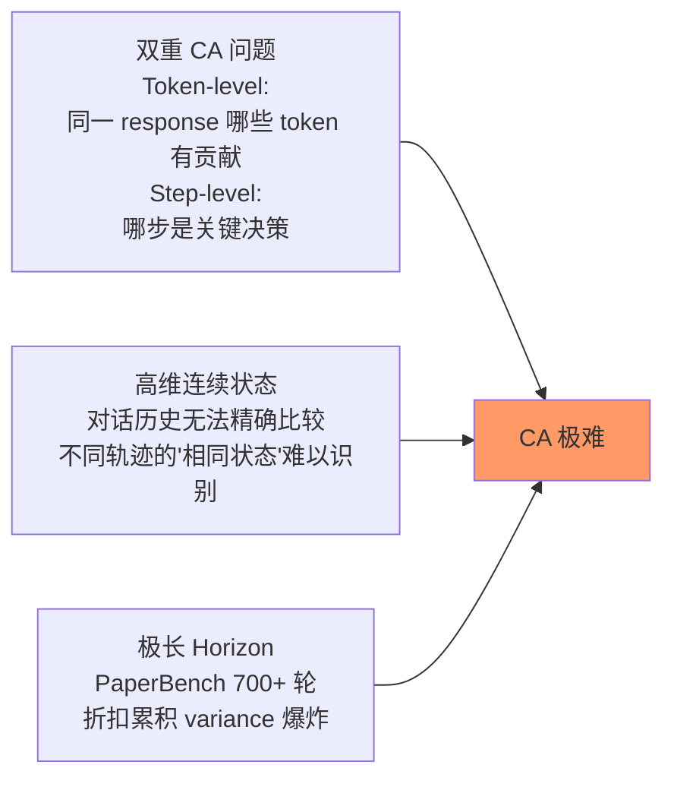
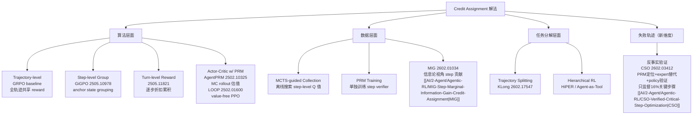
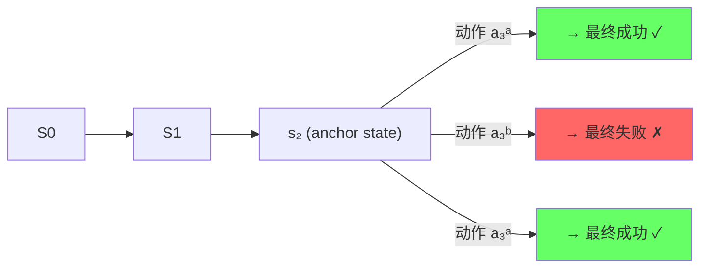
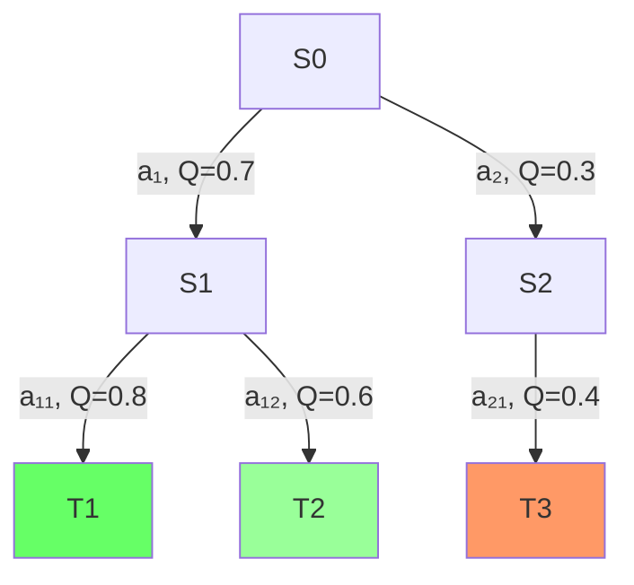
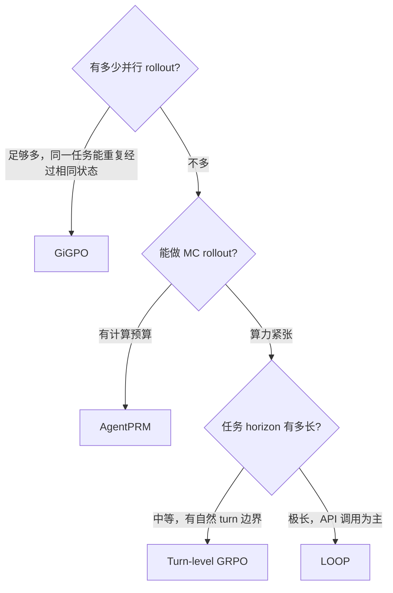

# Long-Horizon Credit Assignment 专题 — Agent RL 的核心难题

> 核心问题：一条 700 步的交互轨迹，最终 reward = 0——**每一步的贡献是多少？** 这是 Agentic RL 最本质的技术挑战。这篇笔记系统整理问题定义和全解法图谱。

---

## 一、问题的精确定义

### 1.1 LLM Agent 的 credit assignment 为什么比传统 RL 更难

传统 RL（Atari/棋类）：
- 每步 action 是离散原子动作（"向右移动"）
- 状态精确可比（像素 hash / 棋盘状态）
- Horizon 10~100 步

LLM Agent RL 的三重困难：



### 1.2 Reward 稀疏性谱系

| 任务 | Horizon | 稀疏程度 | 典型场景 |
|------|---------|---------|---------|
| 数学推理 (CoT) | 30 步 | 低 | 步骤间有逻辑连贯性 |
| Web 任务 | 20 步 | 中 | 操作间关联性弱 |
| SWE-bench | 50 步 | 高 | 探索步骤多，关键步骤少 |
| PaperBench | 700+ 步 | **极高** | 早期选择影响全程 |

---

## 二、解法全图谱



---

## 三、GRPO baseline 的失效模式

标准 GRPO 的 advantage 估计：

$$A_i = \frac{R_i - \mu_G}{\sigma_G}, \quad \mu_G = \frac{1}{G}\sum_{j=1}^G R_j$$

**关键缺陷**：$A_i$ 是 trajectory-level，轨迹内所有 token 共享同一个值。

```python
# 具体后果：
# 轨迹1（成功）: [step1正确, step2出错修正了, step3正确] → A = +1
# step2 的错误尝试也被 reinforce（因为整条轨迹成功了）

# 轨迹2（失败）: [step1正确, step2正确, step3出了问题] → A = -1
# step1 和 step2 明明对的，但被 penalize
```

结论：好步骤在失败轨迹里被惩罚，坏步骤在成功轨迹里被强化 → 训练信号嘈杂。

---

## 四、GiGPO — 当前最优无 Critic 方案

**arXiv 2505.10978 | Feng et al. 2025**

### 核心 Insight：Anchor State Grouping

在大量并行 rollout 中，**不同轨迹会多次经过相同的环境状态**（anchor state）。



在 anchor state $s_2$，可以计算 step-level micro advantage：

$$A_{\text{micro}}(s_2, a_3^a) = \frac{R(a_3^a) - \mu_{\text{anchor}}}{\sigma_{\text{anchor}}}$$

即：同一 state 下不同 action 的相对 reward，精确反映该步决策的价值。

### 两层嵌套结构

**Episode-level（macro advantage）**：

$$A_{\text{macro},i} = \frac{R_i - \mu_G}{\sigma_G}$$

**Step-level（micro advantage，via anchor grouping）**：

$$A_{\text{micro},t} = \frac{R_{\tau(t)} - \mu_{\text{anchor}(s_t)}}{\sigma_{\text{anchor}(s_t)}}$$

**最终 advantage**：

$$A_t = \alpha \cdot A_{\text{macro},i} + (1-\alpha) \cdot A_{\text{micro},t}$$

其中 $\alpha$ 是超参，平衡全局 trajectory 质量和局部 step 贡献。

### 核心优势

- **无 critic**：无需 value network，内存 = GRPO
- **无额外 rollout**：复用已有轨迹中的重合状态（anchor state 天然出现）
- **精确 step 归因**：相同 state 下不同 action 的结果直接比较，因果明确

### 效果（arXiv 2505.10978, Table 2）
- ALFWorld: vs GRPO **+12%**
- WebShop: vs GRPO **+9%**
- PA-MoE（arXiv 2602.17038）在 GiGPO 基础上加 phase-aware MoE：ALFWorld +7.7%，WebShop +14.9%

---

## 五、AgentPRM — MC Rollout 估 Step Value

**arXiv 2502.10325 | Choudhury et al.**

### 问题：LLM-scale Critic 太贵

传统 actor-critic 需要一个与 policy 同规模的 value network（即两倍 LLM）。

**AgentPRM 解法**：用 Monte Carlo rollout 替代 learned critic：

$$V_{\text{MC}}(s_t) = \frac{1}{K} \sum_{k=1}^K R(\tau_k), \quad \tau_k \sim \pi(\cdot | s_t)$$

即从 $s_t$ 出发做 $K$ 次 rollout，取平均末端 reward 作为 step value 估计。

### Step Advantage 计算

$$A_t = V_{\text{MC}}(s_t) - b, \quad b = \frac{1}{T} \sum_{t'=1}^T V_{\text{MC}}(s_{t'})$$

### InversePRM 变体

从演示数据反向学习 process reward，无需 outcome 标注：

$$\text{InversePRM: } \hat{r}(s_t, a_t) = f_\theta(s_t, a_t) \approx \text{边际贡献}(s_t, a_t \to \text{outcome})$$

### 效果（arXiv 2502.10325, Table 1）
- ALFWorld benchmark: **3B 模型 + AgentPRM > GPT-4o baseline**

---

## 六、LOOP — Value-free PPO for Long-Horizon IDA

**arXiv 2502.01600 | Apple Research | Interactive Digital Agents**
**完整笔记**：[[AI/2-Agent/Agentic-RL/LOOP-Leave-One-Out-PPO-Long-Horizon-Agent-RL]]

### 核心设计：Leave-One-Out Baseline（重要更正）

> ⚠️ **注意**：LOOP 不使用 GAE，也不使用折扣 return + critic。核心机制是 **Leave-One-Out（LOO）baseline**，属于 REINFORCE with baseline 家族。

对同一任务生成 $K$ 个 rollout，第 $k$ 个的 advantage：

$$\hat{A}_k = R_k - \frac{1}{K-1} \sum_{j \neq k} R_j$$

- 不需要 value network（没有 critic）
- 不需要折扣计算（用 end-of-episode 稀疏 reward）
- **Per-token importance weighting**：在 token 级别做 IS ratio，而非 turn 级别
- **Per-token clipping**：PPO clip 施加在每个 token 上，提升稳定性
- **内存效率 = SFT（只需要一个 LLM）**

### POMDP 建模

IDA 训练形式化为部分可观测 MDP：Agent 无法直接读取数据库，必须通过 API 调用逐步发现信息。环境有状态（stateful）：第 n 步的 API 结果会改变后续可用状态。

### 任务场景（AppWorld）

9 个日常 App，457 个 API，106 个模拟用户，任务通过单元测试程序化评估（verifiable reward）。

RL 训练后涌现的行为（arXiv 2502.01600, Section 5）：
1. **闭环控制**：暂停检查 API 结果，而非一次性提交所有代码
2. **主动查文档**：调用 API 文档端点了解接口细节，不猜参数
3. **消除 confabulation**：不再假设"联系人 = 支付 app 好友"
4. **错误恢复**：API 失败 → 调试 → 尝试替代路径（而非直接放弃）

### 效果（arXiv 2502.01600, Table 1）
- 32B Qwen2.5 + LOOP: 超过 OpenAI o1 agent **+9pp（+15% 相对）**
- AppWorld Normal + Challenge test set，TGC 指标

---

## 七、Turn-Level Reward

**arXiv 2505.11821 | Wei et al.**（详见 [[AI/2-Agent/Agentic-RL/Tool-Use-RL-训练专题|Tool-Use-RL 训练专题]]）

Turn-level advantage 公式：

$$A_t = r_t^{\text{turn}} + \gamma r_{t+1}^{\text{turn}} + \gamma^2 r_{t+2}^{\text{turn}} + \cdots + \gamma^k R_{\text{final}}$$

通过对每步单独定义 $r_t^{\text{turn}}$（verifiable 或 LLM-as-judge），把 trajectory-level 粒度降到 turn-level。

---

## 八、MIG — Marginal Information Gain（信息论视角）

**arXiv 2602.01034**

### 核心思路

**步骤的贡献 = 该步减少了多少对最终答案的不确定性**：

$$\text{MIG}_t = H(Y \mid C_{1:t-1}) - H(Y \mid C_{1:t})$$

其中 $C_{1:t}$ 是到第 $t$ 步为止的 CoT prefix，$Y$ 是最终答案。

- $\text{MIG}_t$ 越大 → 该步越有信息量，越关键
- $\text{MIG}_t \approx 0$ → 该步是废话，不应给 credit

### Monotonic Historical Watermark

防止后续步骤通过重复前面信息来 inflate credit：

$$r_t^{\text{process}} = \begin{cases} \text{MIG}_t & \text{if } \text{MIG}_t > \max_{t' < t} \text{MIG}_{t'} \\ 0 & \text{otherwise} \end{cases}$$

只有真正带来新信息的步骤才获得 reward。

### Decoupled Masking

$$\mathcal{L} = \mathcal{L}_{\text{CoT}}(\text{process reward}) + \mathcal{L}_{\text{output}}(\text{outcome reward})$$

CoT 部分用 MIG，final output 用 answer correctness——避免两种 reward 的混淆。

---

## 九、MCTS 在 Credit Assignment 中的角色

### 为什么 MCTS 天然解决 credit assignment

MCTS 通过 backup 显式计算每个节点的 $Q$ 值：

$$Q(s_t, a_t) \approx \frac{1}{N(s_t, a_t)} \sum_{\tau \ni (s_t,a_t)} R(\tau)$$

即经过 $(s_t, a_t)$ 的轨迹的平均末端 reward——这直接就是 step-level value。



### 实际应用模式

**离线数据增强**（推荐）：
1. 用 MCTS 在训练环境搜索，收集带 step-level $Q$ 值的轨迹
2. 用 MCTS $Q$ 值训练 PRM
3. 用 PRM 提供 dense reward 给 RL 训练

**Agent Q**（Putta et al. 2024）：MCTS + DPO，在每个 state 下用 MCTS 找好/坏 action，自动构建 pairwise 数据。比纯 RL 数据效率更高。

**MCTS 的局限**：
- 计算代价高（每步搜索树）
- 不可回溯的真实环境（web browser/OS）无法使用——需要模拟器

---

## 十、HiPER — 层级 Advantage 估计（ICML 2026）

**独立精读笔记**：[[AI/2-Agent/Agentic-RL/HiPER-Hierarchical-Plan-Execute-RL-Credit-Assignment]]  
**全文精读补全于 2026-02-23**

### 核心机制（精读后更正）

单一 LLM 每 turn 输出三段结构：
- `<switch>SWITCH/KEEP</switch>`：二元切换决策（**learned，不是预定义**）
- `<subgoal>...</subgoal>`：当前子目标自然语言描述
- `<action>...</action>`：原始环境动作

**Credit 分配（HAE = Hierarchical Advantage Estimation）**：

```
Planning-level advantage（在每个 boundary b_k）：
A^high_{b_k} = Σ_{t=b_k}^{b_{k+1}-1} γ^{t-b_k} r_t  - V^high(s_{b_k})
               ↑整个 segment 的聚合 discounted return

Execution-level advantage（在 segment 内每 step）：
A^low_t = local GAE within subgoal segment
```

**理论保证**：HAE 无偏 + 方差缩减（相对 flat GAE），ICML 2026 正式 proof。

**结果**：ALFWorld 97.4%（+6.6% vs GiGPO）；WebShop 83.3%（+8.3%）

与 GiGPO 的对比：

| | HiPER | GiGPO |
|-|-------|-------|
| Credit 粒度 | **segment-level**（新维度）| step-level（anchor state）|
| 边界如何确定 | **Agent learned SWITCH/KEEP** | 自动发现（并行 rollout 重合状态）|
| 额外标注成本 | 无（learned） | 无 |
| 理论保证 | 无偏 + 方差缩减（ICML proof）| 无额外显存 |
| 适用场景 | 有内在层次结构的任务 | 并行 rollout 中存在重合状态 |

**Credit Assignment 谱系（精准版本）**：
- trajectory-level：GRPO / LOOP
- **segment-level：HiPER**（新维度，介于两者之间）
- step-level：GiGPO / AgentPRM / iStar / MIG / Tree-GRPO

---

## 十一、方法综合对比

| 方法 | 需要 Critic | 额外 Rollout | 精度 | 内存 | 适用场景 |
|------|-----------|------------|------|------|---------|
| GRPO（baseline） | ❌ | ❌ | 低（traj-level） | 低 | 短任务/简单工具 |
| GiGPO | ❌ | ❌ | 高（step-level） | 低（同 GRPO） | 多步 agent，需并行 rollout |
| AgentPRM | ❌ | ✅（MC rollout） | 高 | 中 | 中等 horizon，有计算预算 | → [[AI/2-Agent/Agentic-RL/AgentPRM-Process-Reward-Models-for-LLM-Agents|AgentPRM]] |
| Turn-level GRPO | ❌ | ❌ | 中高（turn-level） | 低 | 多轮工具调用 |
| LOOP | ❌ | ✅（K=6 rollouts/task）| 中（LOO traj-level）| 最低（1× LLM）| 长 horizon API agent，AppWorld |
| MIG | ❌ | ❌ | 高（信息论） | 低 | CoT 推理 |
| MCTS + PRM | ❌（PRM） | ✅（搜索树） | 最高 | 高 | reversible env，数据效率优先 |
| **iStar** | ❌ | ❌ | 高（step-level，implicit） | 中（2x LLM） | **unverifiable reward** / 对话 / 社交 Agent |
| **HiPER** | ❌ | ❌ | 高（segment-level） | 低（1× LLM） | **有内在层次结构**的长 horizon 任务（ICML 2026）|
| **CSO** | ❌ | ✅（验证 rollout）| 高（反事实验证）| 中（需 expert）| **失败轨迹挖掘**；有 expert model；任务有可验证结果 |

> **CSO 在谱系中的独特定位**：上述所有方法都从**成功轨迹**学习（"什么步骤做对了"）。CSO 是首个系统性从**失败轨迹**出发的方案——"什么步骤换一个动作能让整件事成功"（反事实因果推断）。两个信号来源互补：成功轨迹告诉模型好策略的分布，失败轨迹告诉模型精准的决策分叉点。详见：[[AI/2-Agent/Agentic-RL/CSO-Verified-Critical-Step-Optimization|CSO（arXiv:2602.03412）]]

---

## 十一-B、iStar — Implicit Step Rewards via Trajectory DPO

**arXiv 2509.19199 | Xiaoqian Liu et al., Tongyi Lab（阿里通义）/ UCAS | 2025-09**

### 核心问题：现有方案在 unverifiable reward 场景全部失效

GiGPO 需要 state overlap；AgentPRM 需要 MC rollout（计算贵）；MCTS 需要 reversible env。但对话 Agent / 社交交互（SOTOPIA）没有 ground truth reward，只有 LLM judge 给的 preference signal。

### 解法：Trajectory-based DPO → Implicit Step Reward

关键公式：

$$r_\phi(o_{1:t}, a_t) = \beta \log \frac{\pi_\phi(a_t | o_{1:t}, x)}{\pi_{\theta_\text{old}}(a_t | o_{1:t}, x)}$$

- $\pi_\phi$：隐式 PRM，用 trajectory-level DPO 训练
- $\pi_{\theta_\text{old}}$：动态 reference（上一 policy 快照，而非初始冻结模型）
- **粒度**：step 级（action），比 token-level PRM 粒度粗 → variance 更低

**PRM 的训练目标（trajectory-based DPO）**：

$$\mathcal{J}_\text{PRM}(\phi) = -\mathbb{E}\left[ \log \sigma \left( \beta \log \frac{\pi_\phi(\tau^+|x)}{\pi_{\theta_\text{old}}(\tau^+|x)} - \beta \log \frac{\pi_\phi(\tau^-|x)}{\pi_{\theta_\text{old}}(\tau^-|x)} \right) \right]$$

**理论保证**：上式等价于 Bradley-Terry 模型 + **step-wise reward function**（数学证明，不是 empirical claim）。

**双层 Advantage**：

$$A_\text{final}(\tau, t) = A^E(\tau) + A^S(o_{1:t}, a_t)$$

episode-level（全局任务成功）+ step-level（单步贡献）组合。

### 效果

| Benchmark | 结果 |
|-----------|------|
| WebShop | **SOTA**，超 frontier LLMs |
| VisualSokoban | **SOTA** |
| SOTOPIA (self-chat) | goal completion **+14%** vs vanilla RL |
| SOTOPIA (vs GPT-4o) | goal completion **+48%** vs vanilla RL |

SOTOPIA 的 +48% 是证明 unverifiable reward 可以用隐式 DPO 做 credit assignment 的关键数字。

### iStar vs GiGPO

| | GiGPO | iStar |
|-|-------|-------|
| Verifiable reward 要求 | 需要（计算 outcome reward 排序）| 只需 preference（可 unverifiable）|
| 状态重叠假设 | 需要 anchor state overlap | 无此假设 |
| 额外模型 | 无 | 需要维护 implicit PRM（2x 内存）|
| 主要场景 | multi-step task agent | 对话 / 社交 / preference-based agent |

### iStar 与 OAPL 的 KL-reg 框架同根关系

> **这是一个 Vault 内跨域洞察，值得在面试时展开**

iStar 的隐式 step reward：

$$r_\phi(o_{1:t}, a_t) = \beta \log \frac{\pi_\phi(a_t | o_{1:t}, x)}{\pi_{\theta_\text{old}}(a_t | o_{1:t}, x)}$$

OAPL 的 off-policy RL 目标中，闭合解同样含有：

$$\pi^* \propto \pi_{\text{ref}} \exp\left(\frac{r}{\beta}\right) \quad \Rightarrow \quad r = \beta \log \frac{\pi^*}{\pi_{\text{ref}}}$$

**两者共享同一理论根**：KL-regularized RL 框架（$\mathcal{J} = \mathbb{E}[r] - \beta D_{KL}[\pi||\pi_\text{ref}]$）的最优解 $\pi^*$ 与参考策略之间的对数比率 $\beta \log \frac{\pi}{\pi_\text{ref}}$，正是 reward 的最优隐式编码。

| | iStar | OAPL |
|-|-------|------|
| 应用层面 | 把 $\beta\log\frac{\pi_\phi}{\pi_\text{old}}$ 用作 step-level reward 信号 | 把 $\mathbb{E}_{\pi^*}[\frac{\pi^*}{\pi_\text{old}}]$ 写成闭合 squared regression loss |
| 目标 | Credit assignment（哪步贡献大）| Off-policy 训练稳定性 |
| 参考策略 | 动态快照 $\pi_{\theta_\text{old}}$（随 policy 更新）| 固定初始参考 $\pi_\text{ref}$ |
| 理论保证 | DPO ≡ step-wise BT model（等价证明）| 闭合解消除 IS 估计（variance 消除）|

**设计启发**：iStar 和 OAPL 分别在 credit assignment 和 off-policy 训练两个维度利用了 KL-reg 框架的同一数学性质——两者可以组合：OAPL 提供稳定的 off-policy 训练框架，iStar 提供 step-level reward 信号，两者结合可能是 unverifiable reward + 数据复用场景的完整解法。

相关笔记：[[AI/3-LLM/RL/Other-Algorithms/OAPL-Off-Policy-RL-LLM-Reasoning|OAPL（Off-policy RL for LLM Reasoning）]]

---

## 十二、启发思考

### So What

Credit assignment 是 Agentic RL 能否 scale 到真实任务的关键瓶颈。GiGPO 的贡献不只是性能提升，更重要的是**证明了 step-level credit 可以无代价获得**——只需要并行 rollout 中的 anchor state，不需要额外的模型或数据。这是一个 elegant 的解法：用并行 rollout 中本就存在的信息（重合状态），解决了之前需要 critic 才能解决的问题。

### 局限与未解问题

1. **GiGPO 的 anchor state 密度**：如果并行 rollout 数量少，anchor state 很少，micro advantage 估计方差大。需要多少并行 rollout 才够？论文没有充分讨论
2. **连续状态空间的 anchor state 识别**：ALFWorld/WebShop 有离散状态，容易找 anchor；对于 OS/browser 这种连续状态，"相同状态"如何定义？
3. **PRM 的 scalability**：MC rollout 估 step value 计算贵，K 次 rollout × T 步 horizon = K×T 条轨迹。实践中 K 多大合适？
4. **稀疏 credit 的组合**：哪些方法可以组合？GiGPO + Turn-level？有没有 interference？

### 脑暴拓展

- **Implicit anchor state**：能不能用语义相似度（embedding distance）来识别"近似相同"的状态，扩展 GiGPO 到连续状态空间？
- **Credit assignment 用于 curriculum**：能不能根据哪些 step 的 credit variance 大（即"难以决策"的步骤），自动生成针对性训练数据？
- **Process reward 自举**：用已训练的 policy 给出 PRM 标注，再用这个 PRM 训练更好的 policy——类似 self-improvement loop，是否可行？

---

## 十三、落地应用

### 选型指南



### 面试高频问法

**Q: 什么是 credit assignment 问题？LLM Agent 为什么特别难？**
> Credit assignment 是多步决策中 reward 归因的问题。LLM Agent 有三重困难：(1) 双重粒度——每步 action 是长文本，token-level 和 step-level 都需要归因；(2) 极长 horizon——PaperBench 700 轮，折扣累积 variance 爆炸；(3) 连续高维状态——对话历史无法精确比较，不同轨迹的"相同状态"难以识别。传统 RL 的 Bellman 方程在这里不再适用，需要新的解法。

**Q: GiGPO 怎么在不增加内存的情况下实现 step-level credit assignment？**
> GiGPO 的 insight：并行 rollout 中不同轨迹会多次经过相同 anchor state。在这些 state 上，把"从该 state 出发的不同 action"组成 step-level group，用各 action 对应轨迹的最终 reward 对比计算 micro advantage $A_{\text{micro}} = (R - \mu_{\text{anchor}})/\sigma_{\text{anchor}}$。不需要额外 rollout（用已有轨迹的重合状态），不需要 critic（无参数化 value model），内存 = GRPO。ALFWorld 上 +12% vs GRPO（arXiv 2505.10978）。

**Q: MCTS 在 Agent RL 里起什么作用？为什么不是主流？**
> MCTS 通过 backup 显式计算每个 (state, action) 的 Q 值，天然提供 step-level value，是最直接的 credit assignment 解法（Agent Q：MCTS + DPO）。不是主流的原因：(1) 计算贵，每步需要 rollout 树搜索；(2) 不可回溯的真实环境（web browser/OS）无法使用，必须有模拟器或 virtual env。只在有 reversible env 且数据效率要求高时才推荐。

**Q: PRM 和 ORM 的区别，什么时候用哪个？**
> ORM 对整条轨迹末端打分，简单但稀疏；PRM 对每步打分，dense 但需要 step 标注。实践原则：短任务 / 有中间检查点 → ORM 够用；长 horizon / reward 极稀疏 → 需要某种形式的 PRM；标注充足 → 离线训练 PRM；标注不足 → GiGPO（无标注）或 AgentPRM（MC rollout 自动估）。

---

## 推荐阅读

### 原始论文
- **GiGPO**: https://arxiv.org/abs/2505.10978
- **AgentPRM**: https://arxiv.org/abs/2502.10325 | 代码: https://github.com/sanjibanc/agent_prm
- **LOOP**: https://arxiv.org/abs/2502.01600
- **Turn-Level Reward**: https://arxiv.org/abs/2505.11821
- **MIG**: https://arxiv.org/abs/2602.01034
- **PA-MoE**: https://arxiv.org/abs/2602.17038

### 相关 Vault 笔记
- [[AI/2-Agent/Agentic-RL/GiGPO-Group-in-Group-Policy-Optimization|GiGPO 深度精读笔记（NeurIPS 2025）]] — anchor state grouping 完整推导 + 实验分析 + 批判性评价
- [[AI/2-Agent/Agentic-RL/HiPER-Hierarchical-Plan-Execute-RL-Credit-Assignment|HiPER（ICML 2026）]] — segment-level hierarchical advantage 方法（正式版）
- [[AI/2-Agent/Agentic-RL/PA-MoE-Phase-Aware-Mixture-of-Experts|PA-MoE]] — GiGPO 基础上加 phase-aware MoE
- [[AI/2-Agent/Agentic-RL/Tool-Use-RL-训练专题|Tool-Use-RL 训练专题]] — Turn-level reward 详细展开
- [[AI/2-Agent/Agentic-RL/KLong-Extremely-Long-Horizon-Agent-RL|KLong]] — 任务分解层面的解法
- [[AI/2-Agent/Agentic-RL/Agent-RL-训练实战指南|Agent-RL 训练实战指南]] — 训练实战中的坑
- [[AI/2-Agent/Agentic-RL/Agentic-RL-2026前沿综合分析|Agentic RL 2026 综合分析]] — 宏观框架
- [[AI/2-Agent/Agentic-RL/Tree-GRPO-Tree-Search-LLM-Agent-RL|Tree-GRPO（ICLR 2026）]] — 树结构 intra-tree advantage 是另一种 credit assignment 策略：GiGPO 用 anchor state grouping，Tree-GRPO 用兄弟节点 outcome 对比——同问题，不同粒度，可组合
- [[AI/2-Agent/Agentic-RL/iStar-Implicit-Step-Rewards-Agentic-RL|iStar（2509.19199）]] — trajectory DPO → implicit step reward，唯一支持 unverifiable reward 场景的 step-level CA 方案，SOTOPIA +48%
- [[AI/2-Agent/Agentic-RL/AgentPRM-Process-Reward-Models-for-LLM-Agents|AgentPRM（2502.10325）深度精读笔记]] — MC rollout 自动标注 Q 值，actor-critic 框架，3B 超 GPT-4o；InversePRM 变体无需 outcome supervision
- [[AI/2-Agent/Agentic-RL/CSO-Verified-Critical-Step-Optimization|CSO（2602.03412，Tencent AI Lab+HKU）]] — **反事实验证视角**：从失败轨迹出发，只监督 16% 关键步骤做 DPO，GAIA +37%，8B 超 GPT-4.1；谱系中唯一来自"失败轨迹"的 CA 方案
- [[AI/2-Agent/Agentic-RL/CSO-Verified-Critical-Step-Optimization|CSO（2602.03412）]] — **反事实验证视角**：从失败轨迹出发，PRM 找弱点，expert 生成替代动作，policy rollout 验证，只在 16% 关键步骤上 DPO。GAIA +37%，8B 超 GPT-4.1。唯一以 counterfactual causality 视角做 credit assignment 的方法

> **see-also（维度扩展）**：
> - [[AI/2-Agent/Agentic-RL/Multi-Agent-RL-训练专题|Multi-Agent RL 训练专题]] — Credit assignment 问题在 Multi-Agent 场景进一步复杂化：不只是"哪个 step 贡献大"，而是"哪个 agent 贡献大"（joint reward → individual credit）。Shapley Value 是理论解但计算代价 O(2^n)，MAGRPO/AT-GRPO 用 grouping 近似——是 Long-Horizon CA 的 multi-agent 延伸。
> - [[AI/2-Agent/Agentic-RL/SHARP-Shapley-Credit-Multi-Agent-Tool-Use-RL|SHARP（ICML 2026，arXiv:2602.08335）]] — **横向 Credit Assignment 的精确实现**：用 counterfactual masking 近似 Shapley value，对 Long-Horizon CA 专题中"哪个 agent 贡献大"问题给出了真正的博弈论解答；与本专题的纵向（步骤级）CA 正交互补
