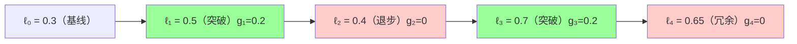
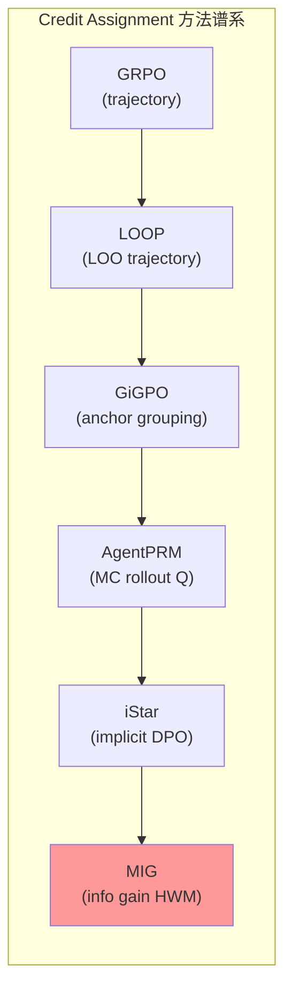

# MIG: Step-wise Marginal Information Gain — 信息论视角的 Credit Assignment

> 核心问题：**如何给多步推理链中的每个步骤分配 dense、内在的信用——不依赖人工标注 PRM，不被 reward hacking 攻击？**

---

## 一、问题背景与动机

### 现有方案的三重困境

| 方案 | 问题 |
|------|------|
| RLVR（outcome-only）| reward sparsity：长推理链中 binary feedback 对中间步骤无梯度信号 |
| PRM（Process Reward Model）| 需要昂贵的人工标注；容易 reward hacking |
| 基于概率的密集信号（VeriFree/LaTRO）| trace-level 整体信号，缺粒度；无法区分真实逻辑突破 vs 冗余 token |

**MIG 的核心思路**：不依赖外部标注，从模型自身的内部概率空间提取逐步语义进展。

---

## 二、核心机制：三个关键组件

### 2.1 Step-Conditioned Likelihood

对于推理步骤 $s_k$，计算截至该步骤后模型对正确答案 $y^*$ 的长度归一化对数似然：

$$\ell_k = \frac{1}{|y^*|} \sum_{t=1}^{|y^*|} \log \pi_\theta(y^* \mid x, s_{1\dots k}, y^*_{<t})$$

- $\ell_0$：只给 prompt 时的基线似然
- $\ell_k$ 越高 = 模型在做完第 $k$ 步后对正确答案越"有把握"
- 这是一个**实时代理指标**：用模型自己的置信度衡量步骤质量，无需外部评判

### 2.2 Monotonic Historical Watermark (HWM)

为防止 "pump-and-dump" 攻击（故意降低似然再拉升，刷虚假奖励），引入单调水印：

$$h_k = \max(h_{k-1}, \ell_k), \quad h_0 = \ell_0$$

- $h_k$ 是截至第 $k$ 步的历史最高似然
- 严格单调递增（或不变），永不下降

### 2.3 Rectified Breakthrough Reward

**MIG 奖励 = 超越历史高点的增量**：

$$g_k = \max(0, \ell_k - h_{k-1})$$

| 情形 | $g_k$ | 含义 |
|------|--------|------|
| $\ell_k > h_{k-1}$（新突破）| $> 0$ | 该步骤带来了新的语义进展，获得正奖励 |
| $\ell_k \leq h_{k-1}$（重复/退步）| $= 0$ | 冗余步骤，零信用 |
| "pump-and-dump"（先降后升）| 被 HWM 拦截 | 最终值 $\leq h_{k-1}$，无奖励 |



**关键性质**：
- **位置无关（position-agnostic）**：早期突破和晚期突破同等对待
- **内容感知（content-aware）**：只看语义进展，不看位置
- **防 hacking**：HWM 使任何先降后升的操纵策略无效

---

## 三、Decoupled Masking — Process/Outcome 分离

**核心设计原则**：推理过程（divergent）和输出结果（convergent）是对立目标，不能混用相同的 loss。

```mermaid
graph TD
    A[完整 rollout] --> B{解耦掩码}
    B -->|CoT tokens (Mcot)| C[MIG Loss ← dense reward]
    B -->|Full completion| D[Outcome Loss ← sparse binary reward]
    B -->|成功轨迹| E[Gated-SFT Loss ← 高质量自生成数据]
    C & D & E --> F["总 Loss = αL_MIG + βL_Outcome + γL_Gated-SFT"]
```

### 三部分损失详解

**① MIG Loss（推理过程）**

$$\mathcal{L}_{MIG} = -\frac{1}{G}\sum_{i=1}^{G}\frac{1}{|z^{(i)}|}\sum_{t \in M_{cot}}\frac{\pi_\theta(z^{(i)}_t|\cdot)}{\pi_{ref}(z^{(i)}_t|\cdot)} A^{step}_i$$

- $A^{step}_i$：组内 $\sum g_k$ 归一化后的 advantage
- 只作用于 CoT token（不影响 answer token）
- 鼓励**探索多样化推理路径**

**② Outcome Loss（结果约束）**

- 标准 GRPO loss，作用于全序列
- advantage = $r_{acc}$（正确性）+ $r_{format}$（格式）
- 确保推理探索在正确答案的流形内发生

**③ Gated-SFT Loss（自我改进）**

- 只对**模型自己生成的正确轨迹**施加 SFT
- "Gate" = 必须正确答案 AND 有 MIG 信号（非空 $\sum g_k > 0$）
- 防止"lucky guess"污染训练数据：猜对了但没有真实推理进展的轨迹被过滤掉

---

## 四、与其他 Credit Assignment 方案对比

| 方案 | 粒度 | 外部依赖 | 防 hacking | 信号来源 |
|------|------|---------|-----------|---------|
| GRPO | trajectory | 无 | 无 | outcome reward |
| PRM | step | 人工标注 | 中等 | 外部标注 |
| AgentPRM | turn (Q-value) | MC rollout | 中 | 额外采样 |
| GiGPO | step (anchor) | 无 | 中 | rollout 重叠状态 |
| iStar | step (implicit) | 2× LLM | 中 | DPO 隐式 PRM |
| **MIG** | **step (信息论)** | **无** | **强 (HWM)** | **模型自身概率** |

**MIG 的独特优势**：
1. **无需任何外部依赖**：既不需要额外 rollout（AgentPRM），也不需要 reference model 两次调用（iStar）
2. **最强的防 hacking**：Monotonic HWM 从数学上保证 pump-and-dump 无效
3. **信息论基础**：$\ell_k$ 是模型对目标的条件似然——这是真正意义上的"语义信息量"度量

**MIG 的局限**：
1. 需要已知 ground truth $y^*$ 来计算 $\ell_k$——只适用于有 verifiable reward 的任务（数学/代码/视觉推理），不适用于 open-ended 对话
2. 计算 $\ell_k$ 需要额外前向传播（每步都要对答案做条件似然计算），训练开销较高
3. 只在 step 级别有信号，但 agent 任务中的"step"通常是 turn 级别——MIG 在论文中主要验证了推理场景（数学），在多步 agent 场景的有效性尚待验证

---

## 五、实验结果

| 任务 | 对比 baseline | MIG 提升 |
|------|--------------|---------|
| MATH | GRPO | 显著提升（sample efficiency 更高）|
| Super-CLEVR（多模态）| GRPO | 显著提升 |
| OOD 零样本迁移 | GRPO | MIG 更优（说明学到了可迁移的推理模式）|

**关键实验设计**：作者特别验证了 OOD 泛化——MIG 训练出的模型在未见任务上比 GRPO 更健壮，说明 MIG 奖励的是"可迁移的逻辑突破"，而不是 dataset-specific 的技巧。

---

## 六、与 iStar 的深度对比（两种信息论视角）

iStar（arXiv:2509.19199）和 MIG 都声称从信息论视角解决 credit assignment，但机制完全不同：

| 维度 | iStar | MIG |
|------|-------|-----|
| 信息量定义 | 隐式 PRM（step-level DPO online reward）| 条件似然增量 $\Delta \ell_k$ |
| 目标函数 | DPO-style，reference model 比较 | 自身历史高点比较（HWM） |
| ground truth 需要？| 不一定（支持 unverifiable reward）| **需要**（$\ell_k$ 对 $y^*$ 计算）|
| 防 hacking | 依赖 KL 约束 | **HWM 结构保证** |
| 适用范围 | **更宽**（unverifiable reward 也支持）| 窄（只有 verifiable reward）|

**洞察**：iStar 和 MIG 是 credit assignment 方法的两个极点——iStar 更通用但更复杂；MIG 更精确但受限于 verifiable setting。

---

## 七、与 Credit Assignment 谱系的定位



MIG 是谱系中**唯一基于内在信息量**（模型自身条件似然）的方案。其他方案都需要某种形式的"比较"（组间比较/anchor比较/MC均值/reference model），而 MIG 只比较当前步骤与历史最高点。

---

## 八、批判性评估

### 新颖性 ★★★★☆

**真正 novel**：Monotonic Historical Watermark 是一个聪明的工程设计，从数学上杜绝了 pump-and-dump。条件似然作为信息增益的代理也有理论依据。

**可疑点**：
1. 论文中 $\ell_k$ 的计算需要 teacher-forcing forward pass with $y^*$——这意味着每步都需要额外 LLM 推理，实际开销可能比论文报告的更高
2. "信息论"的说法有些夸大：$\ell_k$ 是条件似然，不是严格意义上的互信息或 KL 散度——命名比实际数学更 fancy

### 工程可用性 ★★★☆☆

- Verifiable reward 限制了适用范围（数学/代码任务 OK，agent 开放式任务 NO）
- Step 分割依赖 `<think>...### Step i...` 结构化 tag——prompt 设计敏感
- 三部分 loss 的超参数 $(\alpha, \beta, \gamma)$ 调节增加了实践复杂度

---

## 九、推荐阅读

- [arXiv:2602.01034](https://arxiv.org/abs/2602.01034) — 原文
- [[GiGPO-Group-in-Group-Policy-Optimization|GiGPO]] — Anchor State Grouping（Credit Assignment 谱系对比）
- [[AI/2-Agent/Agentic-RL/AgentPRM-Process-Reward-Models-LLM-Agents|AgentPRM]] — MC rollout Q-value（绝对 Q vs 相对 advantage）
- [[iStar-Implicit-Step-Rewards-Agentic-RL|iStar]] — unverifiable reward 场景下的 credit assignment
- [[Long-Horizon-Credit-Assignment专题|Long-Horizon Credit Assignment 专题]] — Credit Assignment 全谱系综合
- [[TSR-Trajectory-Search-Rollouts-Multi-Turn-RL|TSR]] — 训练时树搜索提升 rollout 质量（与 MIG dense reward 正交互补）
- [[GRPO 深度理解|GRPO 深度理解]] — MIG 是 GRPO episode-level reward 的信息论升级版；MIG 验证对比基准即 GRPO
- [[RICOL-Retrospective-In-Context-Online-Learning|RICOL（arXiv:2602.17497，NeurIPS 2025）]] — 同为 Credit Assignment 谱系的替代方案：RICOL 用 ICL 回顾估计 advantage，MIG 用信息论量化步骤贡献；方法论互为对照
- [[CoT-Monitorability-Information-Theory|CoT Monitorability（arXiv:2602.18297，ICLR 2026）]] ⭐ — **信息论交叉**：MIG 量化 CoT 每步对正确答案的信息增益（RL训练视角）；CoT Monitorability 量化 CoT 对 misbehavior 的信息保留（安全监控视角）——同一问题"CoT 有多少信息"，一个从 RL 训练看，一个从安全监控看

---

## 启发思考

**So What**：
- MIG 的 HWM 设计是防 reward hacking 的一个 elegant 工程解——可以作为通用思路借鉴到其他场景（任何需要防止模型"先降后升刷数字"的场景都可以用 watermark 机制）
- 但 verifiable reward 的限制是真实的——Agent 任务中很多步骤没有 ground truth $y^*$，MIG 在纯 agent 场景的直接应用还需要扩展

**核心洞察**（永久有效）：
> Credit assignment 本质上是在问：这一步让我们离答案更近了多少？MIG 用"对正确答案的条件似然增量"来量化"更近"，并用 watermark 防止反向操纵。这是一个从信息量角度定义"进展"的优雅方案——尽管有适用范围限制。

---
**数学基础**：[[信息论|信息论]] — MIG 的"条件似然增量"本质是条件互信息增量 I(y*; CoT_k | CoT_{k-1})，数学根基在信息论笔记

*Source: arXiv:2602.01034 | 写于 2026-02-23 | Agentic-RL Credit Assignment 系列*
