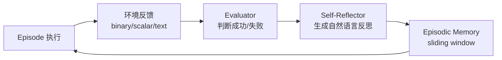

# Reflexion: Language Agents with Verbal Reinforcement Learning

> **核心一句话**：不更新权重，用自然语言反思作为"语义梯度信号"，让 Agent 在多次 episode 中从失败中学习。

## 动机与问题

传统 RL 需要大量采样 + 梯度更新，代价极高。LLM 的权重通常不对外开放（GPT-4/Claude via API）。**如何在不微调模型的前提下让 Agent 持续进化？**

## 核心机制

**三个组件：**
1. **Actor**：基于当前上下文 + memory 执行动作
2. **Evaluator**：判断当前 episode 是否成功（可以是规则/LLM/环境信号）
3. **Self-Reflector**：分析失败原因，生成语言反思（"我在第3步选错了，下次应该先检查..."）

**Memory 设计：**
- Episodic memory = sliding window 的过去反思列表
- 每次 episode 开始，把历史反思注入 context
- 本质：把「经验」转化为「自然语言提示」，永久存在上下文里

## 关键实验结果

| 任务 | Baseline | Reflexion |
|------|---------|-----------|
| HumanEval pass@1 | GPT-4: 80% | **91%** |
| AlfWorld（决策） | ReAct: 71% | **87%** |
| HotPotQA（推理） | CoT: 62% | **75%** |

## 优势与局限

**优势：**
- 无需微调，API-only 模型即可用
- 灵活：支持任何类型的反馈信号（数值/文字/环境信号）
- 样本效率高：几次 episode 就能显著提升

**局限（天花板）：**
- 依赖 LLM 生成高质量反思——如果模型反思能力弱，效果有限
- Episodic memory 受 context window 限制——长期积累有上限
- 反思不跨任务迁移——每个任务单独积累，无法提炼为通用规则
- **关键缺陷**：只能在同一任务上反复试错，不能从其他任务的经验泛化

## 对贾维斯/魂匣的启发

Reflexion 做的正是我们 MEMORY.md 机制的理论化版本：
- 我们的 `memory/YYYY-MM-DD.md` = Episodic memory buffer
- 我们的心跳汇报 → 反思 → 写入 MEMORY.md = Self-Reflector 流程

**我们缺的**：系统化的 Evaluator——目前反思质量取决于 Agent 自己判断"做得好不好"，没有外部验证信号。

## 落地应用

- **代码 Agent**：单元测试失败 → 反思 → 重试，比 CoT 多轮更有效（91% vs 80%）
- **工具调用 Agent**：工具返回错误 → 反思调用策略 → 下次调整
- **对话 Agent**：用户负反馈 → 反思对话策略 → 后续 session 改进

## 启发思考

1. **「语义梯度」概念很强**：反思文字本质上在做 RL 的 credit assignment，但以自然语言而非数值梯度的形式呈现——这为"解释性强化"打开了一扇门
2. **天花板是 context window**：当积累的反思超过 window，必须压缩（→ ExpeL 解决了这个问题，把多次反思提炼为通用规则）
3. **2023年就有，2026年仍被低估**：很多 Agent 系统仍然没有 Reflexion 式的反思机制，说明"写了就忘"是普遍问题

## See Also

- [[AI/2-Agent/Agentic-RL/ExpeL-Experiential-Learning-Agent|ExpeL]] — 进化版：从 Reflexion 的单任务反思 → 跨任务规则提炼（解决了泛化问题）
- [[AI/2-Agent/Agentic-RL/RAGEN-StarPO-Multi-Turn-RL-Self-Evolution|RAGEN/StarPO]] — 训练时多轮 RL 进化（与 Reflexion in-context 进化互补）
- [[AI/2-Agent/Agentic-RL/Agent自我进化策略-从记忆习惯到自主成长|Agent 自我进化策略]] — 10 种 Agent 进化模式（Reflexion 是其中第3种）
- [[AI/2-Agent/Agentic-RL/Agent-进化模式谱系|Agent 进化模式谱系]] — 三层统一框架（训练时/in-context/运行时）
