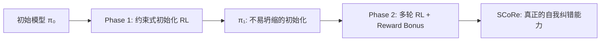
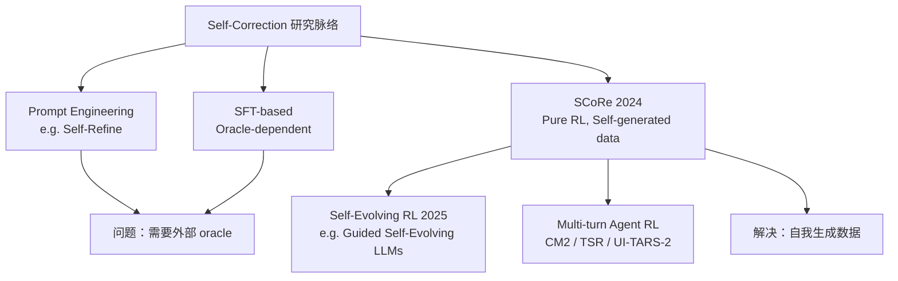

# SCoRe：用强化学习训练 LLM 自我纠错

> **核心命题**：LLM 具备自我纠错的内在知识，但缺乏激活机制。SFT 会导致 behavior collapse——模型学会在第一次就给出最优答案，而非真正学会纠错。RL 在合适的正则化下能解决这一问题。

## 论文基础

| 项目 | 内容 |
|------|------|
| arXiv | [2409.12917](https://arxiv.org/abs/2409.12917) |
| 机构 | Google DeepMind |
| 第一作者 | Aviral Kumar（IRL Lab / CMU → DeepMind） |
| 发表 | NeurIPS 2024 |
| 模型 | Gemini 1.0 Pro + Gemini 1.5 Flash |
| 任务 | 数学推理（MATH）+ 代码生成（HumanEval） |

---

## 1. 问题：为什么现有方法无法训练 LLM 自我纠错

### 1.1 自我纠错的根本价值

人类解题不是 zero-shot 的——我们会回头检查、试错、修正。LLM 也具备内在知识来纠错，但 training objective 从未鼓励这种行为。模型被训练成"第一次给出最好答案"，而非"多轮迭代收敛到正确答案"。

### 1.2 SFT 的两个致命缺陷

**缺陷 1：分布偏移（Distribution Mismatch）**
- SFT 使用外部模型（更强的 oracle 或人类标注者）生成纠错轨迹
- 但测试时，模型需要纠错自己的错误，而非数据收集策略的错误
- 数据分布与测试分布不一致 → 泛化失败

**缺陷 2：Behavior Collapse（行为坍缩）**
- SFT 训练后，模型学会一种捷径：第一次直接给出正确答案，后续"纠错"步骤变成复述
- 看起来像在自我纠错，实际上完全没有纠错能力
- 用 Aviral Kumar 的话说：**"模型学会了忽略纠错指令"**

### 1.3 Naive RL 也有 Behavior Collapse

直接用 RL 进行多轮自我纠错训练同样失败：
- 模型发现可以在 Turn 1 就最大化 reward
- Turn 2 的纠错步骤不再必要
- RL 的探索机制没有充分探索"真正纠错"的轨迹空间

---

## 2. SCoRe：两阶段多轮 RL 框架

### 2.1 核心思路

**关键洞察**：不能直接在 Stage 2 做 RL，需要先建立一个"不会坍缩"的初始化。

### 2.2 Phase 1：约束式初始化

**目标**：在优化纠错能力的同时，约束 Turn 1（初始回答）的分布不要偏离基础模型太多。

**形式化**：

$$\max_\pi \mathbb{E}\left[R(\text{Turn 2 response})\right] - \alpha \cdot D_{KL}\left(\pi(\cdot | x, \text{Turn 1}) \| \pi_0(\cdot | x, \text{Turn 1})\right)$$

- $R$：Turn 2 的任务 reward（正确性）
- $D_{KL}$：Turn 1 分布与基础模型的 KL 散度
- $\alpha$：正则化系数

**为什么这有效**：
- KL 约束防止 Turn 1 变成"第一次就完美"的捷径
- 模型被迫在 Turn 1 保持"像基础模型一样不完美"，然后在 Turn 2 学会真正修正

### 2.3 Phase 2：多轮 RL + Reward Bonus

**目标**：同时优化 Turn 1 和 Turn 2 的 reward，并用额外 bonus 放大真正的纠错行为。

**Reward 设计**：

$$R_{\text{total}} = R(\text{Turn 1}) + R(\text{Turn 2}) + \beta \cdot \mathbb{1}[R(\text{Turn 1}) < R(\text{Turn 2})]$$

- 最后一项：Turn 1 答错、Turn 2 答对时给额外 bonus $\beta$
- **关键**：这直接奖励"纠错成功"这个行为，而非仅奖励"最终答对"

**Multi-turn RL 机制**：
- 模型在自己生成的数据上训练（完全无需外部 oracle）
- 利用自己生成的错误轨迹进行纠错学习
- 彻底解决 SFT 的分布偏移问题

### 2.4 为什么两阶段顺序关键

| 方案 | 问题 |
|------|------|
| 直接 RL（无 Phase 1）| Turn 1 快速坍缩，Phase 2 从坏的初始化开始 |
| 仅 Phase 1 | 只优化 Turn 2，Turn 1 能力退化 |
| Phase 1 → Phase 2 ✅ | Phase 1 建立"不坍缩的底子"，Phase 2 全局优化两轮 |

Phase 1 的本质是**约束探索空间**：不让 Turn 1 退化，从而保留了真正需要纠错的场景。

---

## 3. 实验结果

### 3.1 核心数字

| 指标 | 模型 | SCoRe 提升 |
|------|------|-----------|
| MATH | Gemini 1.0 Pro | **+15.6%** absolute |
| HumanEval | Gemini 1.0 Pro | **+9.1%** absolute |
| MATH | Gemini 1.5 Flash | 显著提升（具体数字见原文） |

超越所有先前自我纠错方法若干个百分点。

### 3.2 补充实验数据（合并自副本 2026-02-26）

| 指标 | 数值 |
|------|------|
| MATH Accuracy@t2 绝对提升 | **+23.0%** |
| MATH 自我纠错 delta（错→对比率）| **+4.4%** |
| MBPP-R（代码生成）| 47.3% → **60.6%**（≈ GPT-3.5 到 GPT-4 的跃迁）|
| vs Pair-SFT on MATH | **+10.2%** |

**推理时 scaling 组合**：
- 并行采样 alone：+7.4%
- 并行 + 串行自我纠错（SCoRe）：**+10.5%**

**消融实验关键发现**：
- 去掉 Phase 1 → 自我纠错增益下降 2%，Accuracy@t2 下降 3%（Phase 1 初始化是必要的）
- 去掉 reward shaping → 明显性能下降
- 单轮训练（不用 multi-turn）→ 第一轮提升但第二轮纠错能力消失
- 用 STaR 替代 REINFORCE 做 Phase 2 → 大幅性能下降（on-policy 采样对 multi-turn 至关重要）

### 3.3 SFT 基线的对比

- **SFT w/ oracle**: 初始回答变好，但多轮纠错能力下降——正好印证 behavior collapse 理论
- **SFT w/ self**: 分布偏移导致纠错效果不如 SCoRe
- **Naive RL**: 同样存在 collapse，Turn 1 直接给出最优解，Turn 2 无意义

---

## 4. 为什么这个工作重要

### 4.1 范式意义

SCoRe 证明了一件重要的事：**LLM 不是不能自我纠错，而是没有被正确训练**。

这个发现改变了整个自我纠错领域的研究方向：
- 之前：用更强的外部模型/oracle 来引导
- 之后：正确的 RL formulation + 合适的正则化，靠自身数据即可

### 4.2 对 Agentic RL 的启发

SCoRe 的两阶段思路在更大范围的 Agentic RL 中普遍适用：

| SCoRe 的设计原则 | 在 Agent 中的对应 |
|-------------------|-----------------|
| Phase 1 约束初始化 | RL 热身：先用 SFT 轨迹初始化，防止 Agent 早期坍缩 |
| Reward Bonus for correction | 过程奖励：奖励"成功纠错错误 tool call"的步骤 |
| Self-generated data only | 无需人工标注错误，Agent 在自有轨迹中学 |
| 防止 behavior collapse | 防止 Agent 学会"每次第一步就完美"的捷径 |

### 4.3 与 RLVR 的关系

SCoRe 使用了 verifiable reward（数学题答对/答错，代码能否通过测试），因此属于 RLVR 家族。但它的关键创新不是 reward 本身，而是**multi-turn 训练的稳定化方法**。

这和 RC-GRPO（reward conditioning 解决 GRPO 全0/全1问题）从不同角度处理同一问题：**multi-turn sparse reward 如何有效训练**。

### 4.4 KL 约束的深层语义：不只是稳定化工具

SCoRe Phase 1 的 KL 约束与 GRPO/PPO 中常见的 KL 约束**语义不同**：

| 用途 | KL 约束的角色 |
|------|------------|
| GRPO/PPO 中 | 防止更新步长过大，**稳定优化** |
| SCoRe Phase 1 | **锁定第一次 attempt 的语义**，防止优化器把 Turn 1 优化成"设计好的失败诱饵" |

SCoRe 的 KL 是在**解决优化景观的多模态问题**——训练 LLM 纠错的真正难点不是梯度，而是优化器面对多个等价均衡时的选择。均衡 A（真正纠错）有泛化性但学习路径更长，均衡 B（假纠错刷分）没有泛化性但优化路径更短。**KL 约束通过限制 Turn 1 的分布，在优化景观中人为删除了均衡 B 的可行域**，迫使优化器只能找到均衡 A。

这也区别于 SFT 冷启动等"格式约束"初始化——SCoRe Phase 1 是**语义约束**（防止学到假纠错均衡），而非格式约束（防止格式混乱）。

---

## 5. 局限与未解问题

1. **任务域限制**：MATH + HumanEval 都有明确的 verifiable reward。开放式任务（写作、对话）的 self-correction RL 如何设计？
2. **Turn 数量**：SCoRe 主要验证 2-turn 场景，更长的 k-turn 纠错链是否还有收益？
3. **错误检测 vs 错误修正**：SCoRe 同时训练"发现错误"和"修正错误"。这两个能力是否应该分开训练？
4. **Reward Hacking**：模型可能学会策略性地在 Turn 1 故意答错（保留 Turn 2 的 bonus 空间），需要监控。
5. **适用模型规模**：在 3B 以下的小模型上，内在知识是否足以支撑自我纠错？

---

## 6. 与相关工作的关系

### 具体关联

- **[[CM2-Checklist-Rewards-Multi-Turn-Tool-Use-RL|CM2（Checklist Rewards）]]**：SCoRe 的 reward bonus 思路与 CM2 的 sparse+dense 解耦设计互补——SCoRe 解决"何时给 bonus"，CM2 解决"如何细化 reward 质量"
- **[[RC-GRPO-Reward-Conditioned-Tool-Calling-RL|RC-GRPO]]**：都在处理 multi-turn sparse reward 的同质化问题，SCoRe 用 bonus 打破，RC-GRPO 用 conditioning token 打破
- **[[TSR-Trajectory-Search-Rollouts-Multi-Turn-RL|TSR（Trajectory-Search Rollouts）]]**：TSR 修 rollout 多样性，SCoRe 修 reward 设计——可以组合
- **[[iStar-Implicit-Step-Rewards-Agentic-RL|iStar（2509.19199）]]**：SCoRe 解决"如何稳定 multi-turn RL 训练"（初始化+bonus），iStar 解决"如何做 step-level credit assignment"（隐式 DPO）——两者互补，可以组合：SCoRe 的训练稳定框架 + iStar 的 step reward 信号
- **[[Memory-R1-RL-for-LLM-Memory-Management|Memory-R1]]**：Memory-R1 用下游 QA reward 训练 memory management，SCoRe 用 task reward 训练 self-correction——同属"用外部可验证信号训练内部能力"
- **[[AI/LLM/RL/GRPO/GRPO-Improvement-Panorama-2026|GRPO Improvement Panorama]]**：SCoRe 的 behavior collapse 分析与 GRPO 全0/全1问题有相似的底层机制

---

## 7. 落地应用

### 工程要点
1. **验证 Phase 1 是否真正阻止了坍缩**：监控 Turn 1 分布与基础模型的 KL 散度，确保 Phase 1 有效
2. **Reward Bonus 的 $\beta$ 调参**：$\beta$ 太大会让模型故意在 Turn 1 答错；太小没有放大效果
3. **多轮 rollout 成本**：每条训练数据需要生成 2+ turns，成本约为单轮的 2x；可参考 TSR 的树搜索剪枝
4. **评估指标**：不只看 Turn 2 准确率，要同时看 "correction rate"（Turn 1 错 → Turn 2 对的比例）

### 面试高频问法
- **Q: 为什么 LLM 不能自我纠错？** → A: 不是能力问题，是 training objective 问题。SFT 的 behavior collapse + RL 的提前坍缩。
- **Q: SCoRe 如何防止 behavior collapse？** → A: 两阶段：Phase 1 用 KL 约束冻结 Turn 1 分布；Phase 2 用 reward bonus 专门奖励纠错成功。
- **Q: SCoRe 和 RLHF 的区别？** → A: SCoRe 无需人工 preference 标注，reward 来自任务可验证性（RLVR），且专注于 multi-turn self-correction 这个特定目标。

### 可用场景
- 数学/代码推理 Agent：Turn 1 生成草稿，Turn 2 自检纠正
- RAG Pipeline 的结果验证：检索 → 生成 → 自我验证
- 工具调用 Agent：工具返回结果 → 模型自我判断是否需要重新调用

---

## 8. 启发思考

**So What？**

SCoRe 在 2024 年解决了一个被认为"用 RL 无法解决"的问题（LeCun 曾声称自我纠错的 RL 会坍缩）。它的两阶段框架成为后续 multi-turn Agent RL 研究的重要参考。

**核心洞察**：**初始化质量决定了 RL 能探索多远**。Phase 1 的本质是约束初始化，而非训练纠错——这个分离的思想在 KLong、PA-MoE 等工作中也有体现。

**未解问题**：
1. 纠错能力是否可迁移？在 MATH 上学到的 self-correction policy 能用于 code 吗？
2. k > 2 时，reward bonus 如何设计？每一轮纠错都给 bonus 吗？
3. 如何区分"真正理解了自己的错误"和"随机尝试直到答对"？

**脑暴拓展**：
- SCoRe Phase 1 的 KL 约束思路可以用在盾卫的内容过滤中：约束 Agent 的行为空间在"可信行为流形"内，而非完全自由探索

---

## 推荐阅读

1. **原始论文**：[arXiv:2409.12917](https://arxiv.org/abs/2409.12917) — SCoRe 全文（NeurIPS 2024）
2. **VentureBeat 解读**：[DeepMind's SCoRe](https://venturebeat.com/ai/deepminds-score-shows-llms-can-use-their-internal-knowledge-to-correct-their-mistakes/) — Aviral Kumar 访谈，解释核心动机
3. **相关工作**：[Self-Refine (2303.17651)](https://arxiv.org/abs/2303.17651) — SFT-based 对比基线
4. **后续延伸**：[Guided Self-Evolving LLMs (2512.02472)](https://arxiv.org/abs/2512.02472) — 2025 年自我演化方向
5. **实践资源**：SCoRe 代码暂未开源（Gemini 内部），但框架可在开源模型上复现（参考 RC-GRPO 仓库的 multi-turn RL 实现）
6. **理论背景**：[[RLHF-DPO-2026-技术全景|RLHF/DPO 2026 技术全景]] — SCoRe 是 RLHF 的 multi-turn 延伸；RLHF 用人工 preference 对齐 single-turn，SCoRe 用任务可验证性 reward 对齐 multi-turn 自我修正能力
7. **正交同族**：[[ERL-Experiential-Reinforcement-Learning|ERL（arXiv:2602.13949）]] — SCoRe 是"架构层修正"（KL 约束删除假均衡），ERL 是"训练动态修正"（显式反思循环 + 内化蒸馏）；两者都认为纯 RLVR 不足以学会纠错，各自从不同角度修复——SCoRe 解决多均衡选择，ERL 解决稀疏反馈利用不足

<!-- 2026-02-26 dedup: 删除了SCoRe副本（SCoRe-Self-Correction-via-RL.md），合并了MBPP-R实验数据、majority voting scaling数据、消融实验详细结果 -->
