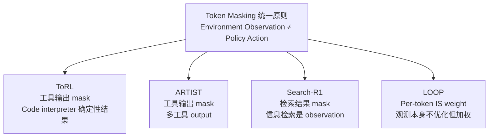

# Search-R1: Training LLMs to Reason and Leverage Search Engines with RL

> **一句话**：把搜索引擎当成 RL 环境的一部分，用 retrieved token masking 隔离检索结果（不计入梯度），让模型通过 outcome reward 自主学会在推理过程中何时发起搜索、如何构造 query。

## 背景与动机

**RAG 的局限**：传统 RAG 在 input 阶段一次性检索，LLM 被动消费检索结果——没有学到"主动决策何时检索"的能力。

**Prompting/SFT 工具调用的局限**：需要大量高质量标注轨迹（LLM 如何与搜索引擎交互），且无法应对 out-of-distribution 的查询策略。

**RL 的机会**：只需要 outcome reward（最终答案对不对），不需要 step-level 监督——让模型自己探索搜索策略，包括何时发起查询、如何构造 query、如何整合多轮检索结果。

## 方法

### 推理轨迹结构

```
<think> 初步分析：问题涉及 X，需要查一下 Y... </think>
<search> [搜索引擎] 2026 年 Y 的最新数据 </search>
<information> [检索返回的文本段落] 根据 X 资料，Y 的数据是... </information>
<think> 看到检索结果，进一步分析 Z... </think>
<search> [搜索引擎] Z 与 W 的关系 </search>
<information> [第二次检索结果] ... </information>
<think> 整合两次检索信息，推导最终答案... </think>
<answer> 最终答案 </answer>
```

- `<think>...</think>`：模型推理
- `<search>...</search>`：模型生成的搜索 query
- `<information>...</information>`：搜索引擎返回的检索结果（**不参与梯度**）
- `<answer>...</answer>`：最终答案

### 核心设计：Retrieved Token Masking

**形式化**：在 PPO/GRPO 目标函数中，引入指示函数 $I(y_t)$：

$$I(y_t) = \begin{cases} 1 & y_t \text{ 是 LLM 生成 token（推理 + 搜索 query）} \\ 0 & y_t \text{ 是检索返回 token（} \langle\text{information}\rangle \text{ 内部）} \end{cases}$$

**PPO with search**（只对 $I(y_t)=1$ 的 token 计算损失）：

$$\mathcal{J}_{PPO}(\theta) = \mathbb{E}\left[\frac{1}{\sum_t I(y_t)} \sum_{t: I(y_t)=1} \min\left(\frac{\pi_\theta}{\pi_{old}} A_t, \text{clip}(\cdot) A_t\right)\right]$$

**GRPO with search**（同理，只对 LLM 生成 token 计算优势和梯度）：

$$\mathcal{J}_{GRPO}(\theta) = \mathbb{E}\left[\frac{1}{G} \sum_i \frac{1}{\sum_t I(y_{i,t})} \sum_{t: I(y_{i,t})=1} \min\left(\frac{\pi_\theta}{\pi_{old}} \hat{A}_{i,t}, \text{clip}(\cdot)\hat{A}_{i,t}\right) - \beta D_{KL}\right]$$

**为什么 mask 检索结果 token？**

检索结果是**确定性 observation**（给定 query，搜索引擎返回固定结果），如果让模型对这些 token 计算梯度：
1. 梯度会驱使模型"预测搜索引擎会返回什么"——变成了语言模型任务而不是 RL 任务
2. 不同 rollout 中同一 query 的检索结果是相同的，引入的梯度信号是噪声

**这是和 ARTIST/ToRL 共享的统一设计原则**：environment observation 不应参与梯度更新，只有 agent action（模型生成）才需要优化。

### RL 算法选择

论文同时支持 PPO（有 value function）和 GRPO（value-free），并进行了消融对比：
- GRPO 在搜索推理场景表现更稳定（无需 critic，简化了 search engine 集成的工程复杂度）
- PPO 在 value function 估计上引入额外的训练噪声

### Reward 设计

纯 **outcome-based reward**（不需要 process reward）：

$$r(y, y^*) = \begin{cases} 1 & \text{答案正确（exact match 或 F1 超阈值）} \\ 0 & \text{答案错误} \end{cases}$$

**重要结论**：简单 binary outcome reward 足以驱动模型自主学会多轮搜索策略，**不需要 process reward**（对搜索行为本身奖励）——这和 ToRL 的发现一致。

## 实验结果

### 主要结果（7 个 QA 数据集平均）

| 方法 | Qwen2.5-7B | Qwen2.5-3B |
|------|-----------|-----------|
| Vanilla RAG | baseline | baseline |
| Prompting + Search | 略好于 RAG | - |
| SFT + Search | 中等 | - |
| **Search-R1** | **+41%** vs RAG | **+20%** vs RAG |

- 7 个数据集：HotpotQA / 2WikiMQA / MuSiQue / Bamboogle / PopQA / NQ / TriviaQA
- 同等检索模型、训练数据、基础 LLM 条件下，RL 方法显著优于所有 non-RL 方法

### 详细分析发现

**1. RL 方法选择的影响**：
- GRPO ≥ PPO（在搜索增强场景，GRPO 的 value-free 设计更简洁稳定）
- RLOO 表现居中

**2. LLM 选择的影响**：
- Qwen2.5 > Llama 同参数量：推理能力更强的基座提升更显著
- 推理能力是 RL 搜索训练的必要条件，不是充分条件

**3. Response Length 分析**：
- 搜索-推理交织使 response 更长（更多推理 token + 搜索 token）
- 但更长 ≠ 更好：存在"废话搜索"（搜索不必要的信息）的问题
- 长度和性能的关系是倒 U 型（适度深度思考最优）

**4. 多轮搜索的涌现**：
- 简单问题：0-1 次搜索（模型判断不需要外部信息）
- 复杂多跳问题：2-3 次搜索，每次 query 基于前次结果动态调整
- 模型自主学到了"Iterative Retrieval"策略，未显式训练

## Search-R1 在 Token Masking 设计谱系中的位置



| 论文 | 被 mask 的内容 | 原因 |
|------|-------------|------|
| ToRL | `<output>` code execution | 确定性计算结果 |
| ARTIST | `<output>` tool response | 环境返回的确定性响应 |
| **Search-R1** | `<information>` retrieved text | 搜索引擎检索结果 |

**三篇论文的统一框架**：$\pi_\theta(\cdot | x; \mathcal{E})$ 中，$\mathcal{E}$ 是外部环境（code interpreter / tool API / search engine），梯度只更新 $\pi_\theta$ 生成的部分，不更新 $\mathcal{E}$ 返回的部分。这在 POMDP 框架里对应：只优化 action 的生成分布，observation 本身不可优化。

## Search-R1 vs RAG 的本质差异

**RAG**：检索是固定的 preprocessing 步骤，LLM 被动消费结果
$$\text{Answer} = f_\theta(\text{query, retrieved\_docs})$$

**Search-R1**：搜索是 RL policy 的一部分，query 是 action
$$\text{Query}_t = \pi_\theta(\text{reasoning}_{1:t-1}) \quad [\text{action}]$$
$$\text{Info}_t = \text{SearchEngine}(\text{Query}_t) \quad [\text{observation}]$$

**关键区别**：Search-R1 的模型学到了 **when to search** 和 **how to construct query given context**——这两个能力 RAG 完全不具备，SFT-based 方法需要大量标注轨迹才能学。

## 批判性评估

### 值得肯定
- **Token masking 的理论化**：Search-R1 论文最显式地给出了 masking 的数学形式（$I(y_t)$）和动机说明，比 ARTIST/ToRL 更清晰
- **跨 7 个数据集验证**：覆盖面广，不是单一数据集过拟合
- **RL 算法消融**：PPO vs GRPO vs RLOO 的对比为社区提供了实用参考

### 局限
1. **单工具**：只有搜索引擎，多工具组合（搜索 + 代码）未研究
2. **Reward 稀疏性**：binary outcome reward 在多跳问题上信号仍然稀疏——为什么够用？论文没有理论解释
3. **检索质量依赖**：如果搜索引擎检索质量差，RL 也无法弥补（garbage in, garbage out）
4. **Query 质量评估缺失**：模型生成的搜索 query 质量如何？是否学到了有效的 query formulation？没有专项分析

## 统一洞察：为什么 outcome reward 就够了？

Search-R1 / ToRL / ARTIST 都用 pure outcome reward 驱动工具/搜索使用——没有 process reward（对中间步骤奖励）。**为什么够？**

直觉解释：工具调用是**instrumental action**（工具性行动），其价值通过最终结果传导。如果一次搜索最终帮助得到了正确答案，这次搜索的整条路径（query 构造 + 结果利用）都会被强化，无需额外的 process supervision。

这和 GRPO 的 group-level credit assignment 结合：同一问题多次 rollout，调用了搜索的 rollout 如果得分更高，模型学到了"搜索 → 更好结果"的关联——无需精确的 step-level 奖励。

## 启发思考

**So What**：Search-R1 最重要的贡献不是性能数字，而是**证明了 RL 可以驱动 adaptive retrieval**——不是固定步骤的 RAG，而是 policy-driven 的动态信息获取。这对 RAG 系统设计有范式级的影响：未来的 RAG 可能不再是 retrieval → generation 的流水线，而是 RL-trained policy 的自主决策过程。

**未解问题**：
- 多工具 + 搜索的组合：何时用 code interpreter，何时用搜索？这个策略能 RL 学出来吗？
- 检索质量的自适应：如果搜索结果质量差，模型能学会"再搜一次"或"放弃搜索"吗？
- Long-horizon 多跳搜索的 credit assignment：哪次搜索对最终答案贡献最大？这仍是 credit assignment 问题

**面试高频问法**：
- "Search-R1 和 RAG 最大的区别？" → Policy-driven adaptive retrieval（what/when to search）vs static preprocessing（when = always, at input）
- "为什么 retrieved token 需要 mask？" → 检索结果是确定性 observation，梯度回传会让模型学"预测检索结果"而非"决策何时检索"
- "为什么 outcome reward 就够？" → 工具性行动的价值通过结果传导 + GRPO group-level credit 自然关联

## 推荐阅读

- **原始论文**：[arXiv:2503.09516](https://arxiv.org/abs/2503.09516)（v5，2025-08-05）
- **代码**：[github.com/PeterGriffinJin/Search-R1](https://github.com/PeterGriffinJin/Search-R1)
- **设计原则统一**：[[AI/2-Agent/Agentic-RL/ARTIST-Agentic-Reasoning-Tool-Integration-RL|ARTIST]] — tool output masking
- **单工具对比**：[[AI/2-Agent/Agentic-RL/ToRL-Tool-Integrated-Reinforcement-Learning|ToRL]] — code interpreter masking
- **谱系总览**：[[AI/2-Agent/Agentic-RL/Tool-Use-RL-训练专题|Tool Use RL 训练专题]] — Tool Use RL 全景
- **评估体系对应**：[[AI/2-Agent/Evaluation/Agent评估体系批判-Goodhart法则与Benchmark陷阱|Agent评估体系批判：Goodhart's Law]] — Search-R1 的 7 数据集评估策略体现了"多 benchmark 组合 > 单一指标"原则；两篇互补：训练方法（Search-R1）↔ 评估体系（Goodhart批判）

> **⚠️ 后续工作 vault_gap**：**Search-R1++（arXiv:2602.19526）** 对 Search agent 训练做了系统性消融，发现三条关键结论：①REINFORCE > PPO > GRPO 稳定性（group sampling 方差在搜索场景过大）；②F1 reward 导致 answer avoidance（model 学会不给答案以规避 partial match 扣分），EM reward 更稳；③action-level penalty（惩罚不必要搜索）可修复 F1 reward 的崩溃问题。独立深度笔记待 Scholar 补写。参见：[[AI/2-Agent/Agentic-RL/Agentic-RL-2026前沿综合分析|Agentic RL 综合分析 v6]] 第 136 行。

## 落地应用

**可用场景**：
- 知识密集型 QA（需要实时外部信息）
- 多跳推理（需要串联多次检索）
- 替代传统 RAG 管道（无需固定检索步骤）

**工程要点**：
- **搜索引擎延迟**：每次工具调用引入网络延迟，需要 batch 级别的异步调度（类似 VerlTool）
- **Retrieved token 边界识别**：需要可靠地识别 `<information>...</information>` 边界，复杂 HTML 返回需要预处理
- **Query 截断**：LLM 生成的 query 可能过长，需要截断 + 格式检查

**面试准备**：
- Token masking 的数学形式（$I(y_t)$）
- Search-R1 vs RAG 的架构对比
- 为什么 outcome reward 在搜索场景足够

## See Also

- [[AI/2-Agent/Agentic-RL/Search-R1plus-Tool-Use-RL-Ablation|Search-R1++（消融升级）]] — REINFORCE > PPO > GRPO 稳定性发现；F1 reward 崩溃根因；action-level penalty 修复——本文直接后续工作
- [[AI/2-Agent/Agentic-RL/Search-P1-Path-Centric-Reward-Agentic-RAG|Search-P1（路径中心奖励）]] — 同类 Agentic RAG RL，奖励路径过程而非仅结果；与 Search-R1 outcome reward 形成对比
- [[AI/2-Agent/Agentic-RL/Agentic-RL-2026前沿综合分析|Agentic-RL 综合分析]] — Search-R1 在工具调用 RL 时间线中的位置
- [[AI/3-LLM/Inference/vLLM|vLLM]] — Token masking 的生产实现依赖 vLLM 的 attention mask 支持
