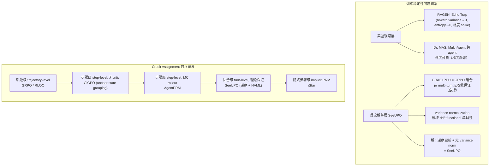

# SeeUPO: Sequence-Level Agentic-RL with Convergence Guarantees

> **arXiv**: 2602.06554 | **机构**: Tongyi Lab, Alibaba Group | **时间**: 2026-02-06  
> **评分**: ★★★★★ | **主题**: Multi-turn RL 收敛理论 + Agentic RL 算法设计  
> **关键词**: sequence-level RL, convergence guarantee, backward induction, multi-turn agent, critic-free

---

## 一句话定位

SeeUPO 是第一个在 multi-turn agentic RL 场景下同时具备 **critic-free** 和 **严格收敛保证** 的算法，通过将多轮交互建模为 multi-agent bandit + **逆序更新**（backward induction）实现全局最优。

---

## 核心问题：现有算法的收敛悖论

### 两个维度的分类框架

| | REINFORCE（全 on-policy）| PPU（部分 on-policy，带 clip）|
|---|---|---|
| **GAE（critic 依赖）** | GAE-REINFORCE ✅ 收敛 | GAE-PPU (PPO) ✅ 收敛 |
| **GRAE（critic-free）** | GRAE-REINFORCE ✅ 收敛（仅 undiscounted）| GRAE-PPU (GRPO) ❌ 收敛失效 |

**核心发现（Theorem）**：GRAE + PPU 的组合（= GRPO 的主体）**破坏了 PPO 的单调改进属性**。

原因：GRPO 中 variance normalization（除以 σ）破坏了 Mirror Learning 框架的 drift functional 非负性条件，使单调改进无法保证。

### 二维不可能定理

> **定理 3.2（非正式版）**：在 multi-turn 场景中，不存在一种算法能同时满足：
> 1. Critic-free（无需额外 value network）
> 2. 收敛到全局最优

这个定理揭示了一个根本性的 trade-off，是整篇论文的理论起点。

---

## SeeUPO 的解决方案

### 关键 Insight：把多轮看成 Multi-Agent 问题

**核心建模**：将 T-turn 交互视为 T 个 **虚拟 agent** 按序执行的 multi-agent bandit 问题。
- 每个 turn t 是一个独立的 virtual agent $\pi_t$
- 每个 agent 只控制本 turn 的 action，但共享同一套模型参数
- 状态转移由环境（工具调用返回值等）驱动

### 核心机制：逆序更新（Backward Induction）

```
更新顺序：T → T-1 → T-2 → ... → 1
```

- **为什么逆序？** 因为 turn t 的最优 policy 取决于 turn t+1,...,T 的 policy
- 逆序更新使得每个 turn 在更新时，后续所有 turn 已经是已知的最优 policy
- 这正是动态规划（backward induction）的思想，天然保证全局最优

**数学保证**（来自 HAML 框架）：
$$\mathcal{J}(\theta_{k+1}) \geq \mathcal{J}(\theta_k)$$
单调改进属性严格成立。

**全局最优证明**（Appendix B）：
- 非逆序（forward/random 顺序）缺少 continuation value 的最优性保证
- 逆序确保每步的 advantage estimation 基于已优化的后续 policy

### 实现细节

**1. Sequence-level PPO-style Update（实践版本）**
```python
# 每个 turn 独立计算 importance ratio
for turn_t in range(T, 0, -1):  # 逆序
    advantage_t = compute_advantage(turn_t, ...)
    ratio_t = pi_theta(action_t) / pi_theta_old(action_t)
    loss_t = -min(ratio_t * advantage_t, clip(ratio_t, 1-eps, 1+eps) * advantage_t)
```

**2. GRAE-based Advantage（critic-free）**
$$\hat{A}^{\text{GRAE}}(\bm{s}_t, \bm{a}_t) = R^{(i)} - \bar{R}$$
- 注意：**不除以方差**！这是关键区别于 GRPO
- 除以方差（variance normalization）会破坏 drift functional 的单调性条件
- 使用 batch-level normalization 代替 group-level variance normalization

**3. Turn-level Credit Assignment（隐式）**
通过 advantage function decomposition 实现：
$$A(\bm{s}_t, \bm{a}_t) = Q(\bm{s}_t, \bm{a}_t) - V(\bm{s}_t)$$
每个 turn 的 advantage 自然捕获了该 turn 对全局 return 的贡献。

---

## 与 GRPO/GSPO 的关键区别

| 维度 | GRPO | GSPO | SeeUPO |
|------|------|------|--------|
| **更新粒度** | token-level | sequence-level | sequence-level（per-turn）|
| **更新顺序** | 并行（所有 turn 同时）| 并行 | **逆序** sequential |
| **Variance Norm** | ✅（除以 σ）| ✅（GSPO 变体）| ❌（不除，保 drift）|
| **收敛保证** | ❌（多轮场景）| 部分 ❌ | ✅（全局最优）|
| **Critic** | ❌ | ❌ | ❌ |
| **训练稳定性** | 一般 | 一般 | 优（无 catastrophic failure）|

**GSPO 的问题（Appendix H）**：GSPO 虽然是 sequence-level，但仍然使用 variance normalization，这破坏了 drift functional 的 KKT 条件，导致 contextual bandit 外的场景仍然缺乏收敛保证。

---

## 实验结果

### 主要 Benchmark

**AppWorld**（多步工具调用，35个互联apps，736个任务）：
| 算法 | Qwen3-14B avg@4 | Qwen2.5-14B avg@4 |
|------|------|------|
| GRPO | ~40% | ~43% |
| RLOO | ~43% | ~44% |
| PPO | ~42% | ~41% |
| GSPO | ~44% | ~45% |
| **SeeUPO** | **60.80%** | **53.07%** |

相对改进：Qwen3-14B +43.3%~54.6%，Qwen2.5-14B +24.1%~41.9%

**BFCL v4**（工具调用 benchmark）：类似结果，SeeUPO 全面领先。

### Ablation：更新顺序的影响

| 更新顺序 | AppWorld 性能 |
|---------|-------------|
| Forward (1→T) | baseline |
| Random | baseline |
| **Reverse (T→1)** | **最高** |

实验完美验证了理论预测：只有逆序更新才能通过 backward induction 保证全局最优。

### Ablation：Normalization 影响

- Group-level variance normalization → **破坏收敛**（与 GSPO 问题相同）
- Batch-level normalization → **保持收敛**，同时提供数值稳定性

---

## 理论框架：Mirror Learning + HAML

论文基于两个理论工具：

**Mirror Learning（Grudzien et al., 2022）**：
- 统一框架，分析 RL 算法的收敛性
- 需要三个条件：drift function 非负、neighborhood operator 有界、mirror operator 正确性
- SeeUPO 通过 sequence-level PPU 满足所有条件

**Heterogeneous-Agent Mirror Learning (HAML, Zhong et al., 2024)**：
- 扩展 Mirror Learning 到 heterogeneous agent 设置
- 允许不同 agent（turn）有不同的 reward 分布
- SeeUPO 的 multi-agent 建模直接继承 HAML 的收敛保证

---

## 我的评价

### 最重要的贡献

1. **不可能定理**（Theorem 3.2）：这是 multi-turn agentic RL 领域第一个正式证明的理论下界。意味着 GRPO/GSPO 在 multi-turn 场景中的不稳定性不是工程问题，而是**算法本质缺陷**。

2. **逆序更新**：看似 simple，但 backward induction in RL 是一个被忽视的设计原则。SeeUPO 把这个经典思想精确地对应到 multi-turn agent 训练上，并给出严格证明。

3. **Variance normalization 的毒性**：除以 σ 这一 GRPO 的标准操作被证明会破坏收敛，这是一个重要的反直觉结论。GRPO 的开发者当初加这一步是为了数值稳定，但在 multi-turn 场景中代价是丧失收敛性。

### 批判性审查

**证据**：实验结果非常显著（+40%+），两个独立 benchmark，两个模型规格，结果一致。

**机制**：理论严格，backward induction 的数学正确性无疑问，HAML 框架是成熟工具。

**边界条件**：
- 结论在 multi-turn **contextual bandit** 设置下严格成立
- 对于更一般的 MDP（带真实状态转移），全局最优保证需要额外假设
- 计算效率：逆序更新需要 T 次 forward pass（per turn），开销比并行更新高

**替代解释**：有没有可能 SeeUPO 的提升主要来自更细粒度的 credit assignment，而不是收敛性本身？论文的 ablation 部分（update order 对比）基本排除了这个可能，但仍是可以探讨的方向。

**与 RAGEN 的关系**：
- RAGEN 发现 multi-turn RL 中 Echo Trap（reward variance collapse）
- SeeUPO 从理论上解释了为什么 GRPO 类算法在 multi-turn 中不收敛
- 两者是互补的：一个描述症状，一个给出理论根因

### 历史定位

这是 multi-turn agentic RL 算法理论的**奠基性工作**。以前大家都在实验上发现 GRPO 在多轮 agent 训练中不稳定，现在有了理论解释：这是 GRAE+PPU 的组合无法保证 multi-turn 场景收敛的必然结果。SeeUPO 的逆序更新给了一条出路。

---

## 与 Vault 现有笔记的关联

| 论文 | 关联点 |
|------|--------|
| RAGEN/StarPO | Echo Trap = GRPO 在 multi-turn 失效的实验观察，SeeUPO 给出理论解释 |
| LOOP (2502.01600) | 同样关注 multi-turn 长 horizon RL，用 Leave-One-Out PPO |
| CM2 (TSR) | multi-turn RL 稳定性的另一条路：辅助 reward 而非算法改进 |
| Dr. MAS (2602.08847) | 解决 multi-agent 跨 agent 异质性（稳定性维度不同）|
| GiGPO (2505.10978) | 解决 credit assignment（与 SeeUPO 的 turn-level 方式互补）|
| WebAgent-R1 | M-GRPO 的三层归一化实践上规避了部分问题，但缺乏理论保证 |

---

## Credit Assignment 谱系更新



---

## 实用意义

**何时用 SeeUPO？**
- Multi-turn agent 训练（工具调用 / 网页操作 / 代码生成）
- 希望有理论保证的训练稳定性
- 不想维护 critic network

**何时仍用 GRPO？**
- 单轮推理任务（数学/代码一次性生成）—— GRPO 在单轮 contextual bandit 下是有收敛保证的
- 计算资源有限，无法承受逆序更新的额外开销

**工程注意**：
- 不要 group-level variance normalization，用 batch-level
- 逆序更新需要显式 track 每个 turn 的 policy 快照（θ_old per turn）
- AppWorld 等环境需要 trajectory 级 sparse reward，SeeUPO 通过 advantage decomposition 自然处理

---

---

## See Also

- [[RAGEN-StarPO-Multi-Turn-RL-Self-Evolution|RAGEN & StarPO]] — Echo Trap = SeeUPO 不可能定理的实验征兆；RAGEN 描述症状，SeeUPO 给出理论根因
- [[Dr-MAS-Stable-RL-Multi-Agent-LLM-Systems|Dr. MAS]] — 多 Agent 跨 agent 异质性问题；与 SeeUPO 的 turn-level 建模互补（agent维度 vs turn维度）
- [[LOOP-Leave-One-Out-PPO-Long-Horizon-Agent-RL|LOOP]] — Leave-One-Out PPO：同样是 critic-free long-horizon agent RL，不同角度解决 multi-turn 稳定性
- [[GiGPO-Group-in-Group-Policy-Optimization|GiGPO]] — step-level credit assignment（anchor state grouping）；与 SeeUPO 的 turn-level CA 粒度互补，可组合
- [[AI/3-LLM/RL/GRPO深度理解|GRPO 深度理解]] — SeeUPO 证明 GRPO 在 multi-turn 场景无收敛保证；单轮任务仍首选 GRPO
- [[WebAgent-R1-Multi-Turn-RL-Web-Agent|WebAgent-R1]] — M-GRPO 的三层归一化工程实践规避部分问题，但缺乏 SeeUPO 级别的理论保证
- [[Long-Horizon-Credit-Assignment专题|Long-Horizon Credit Assignment 专题]] — SeeUPO 是 turn-level CA 的理论保证版本，在该谱系中处于顶层

## 推荐阅读

1. **SeeUPO 原文**：arXiv:2602.06554 — 重点读 Theorem 3.2（不可能定理）和 Appendix B（逆序最优性证明）
2. **RAGEN**（arXiv:2504.20073）— 先读 Echo Trap 现象，再读 SeeUPO 理论解释，形成完整认知
3. **HAML**（Zhong et al., 2024）— SeeUPO 的理论工具，理解 heterogeneous-agent mirror learning
4. **Mirror Learning**（Grudzien et al., 2022）— 收敛分析的基础框架，drift functional 概念来源

---

*笔记时间：2026-02-24 | 心跳第24次*
