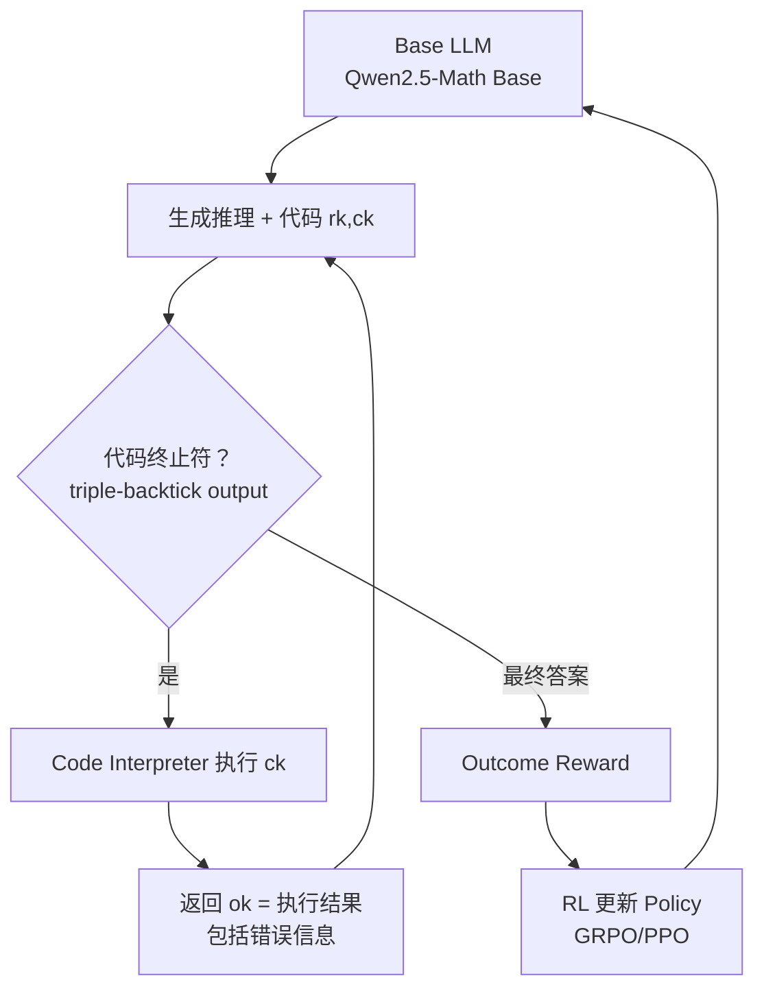

# ToRL: Scaling Tool-Integrated Reinforcement Learning

> **一句话**：直接从 base model 用 RL 训工具调用，绕过 SFT 的"先入为主"，让模型自由探索何时/如何调用 code interpreter——涌现出比 SFT 更灵活的工具使用策略。

## 背景

**Tool-Integrated Reasoning (TIR)**：LLM 交织生成自然语言推理和可执行代码，调用 code interpreter 获取结果，再基于结果继续推理。代表工作：ToRA、MathCoder、Qwen2.5-Math-Instruct-TIR。

**问题**：现有 TIR 依赖 SFT（从更强模型蒸馏轨迹）→ 模型只学到人类预设的工具使用模式，探索空间被限制。

**ToRL 的思路**：直接从 **base model**（无 SFT 后处理）出发，用 RL 让模型通过 reward 信号自主发现最优工具使用策略。

## 方法

### TIR 轨迹形式化

每步生成 $(r_k, c_k, o_k)$：

$$s_k = r_1, c_1, o_1, \dots, r_k, c_k, o_k$$

$$\begin{aligned}
(r_k, c_k) &= M(Q \oplus s_{k-1}) \\
o_k &= I(c_k) \quad \text{(code interpreter)} \\
s_k &= s_{k-1} \oplus r_k \oplus c_k \oplus o_k
\end{aligned}$$

其中 $r_k$ = 推理文本，$c_k$ = 生成代码，$o_k$ = 执行结果。

### ToRL RL 训练框架



**关键工程细节：**
1. **错误回传**：代码执行失败 → 把 error message 原文返回给 LLM，让它自我修正（而不是静默失败）
2. **工具调用上限 C**：每个 response 最多 C 次工具调用，平衡性能与计算开销
3. **Reward**：纯 outcome-based（答案正确 = 1，错误 = 0）；没有 process reward

### 数据集
- 来源：NuminaMATH + MATH + DeepScaleR → 75,149 题（过滤证明题和模糊题）
- 用 LIMR 蒸馏：保留有区分度的高质量样本 → 最终 **28,740 题**
- 特点：Olympic-level 数学竞赛，验证性强（有精确数值答案）

## 实验结果

### 主要结果（AIME24）

| 模型 | AIME24 |
|------|--------|
| Qwen2.5-Math-7B Base（无 RL） | ~10% |
| RL without tool（DeepSeek-R1 风格） | ~29% |
| Qwen2.5-Math-Instruct-TIR（SFT）| ~26% |
| **ToRL-7B（RL from scratch + tool）** | **43.3%** |
| ToRL-1.5B | 也超 RL-only baseline |

- ToRL-7B 相当于某些 32B RL 模型的水平
- **RL + tool > RL-only by 14%**
- **RL + tool > SFT TIR by 17%**

### 训练动态（涌现行为分析）

**1. 代码使用率演变**：随训练进程，用代码解题的比例持续上升（自发学会"在哪些问题上调用工具"）

**2. 代码质量提升**：语法正确 + 可执行代码比例增加（通过 reward 约束，不需要显式监督）

**3. 工具调用频率 Trade-off**：
- 增加 C（最大工具调用次数）→ 性能显著提升
- 但每次多一个 tool call 就多一次 interpreter 执行 → GPU idle time ↑↑
- 找到平衡点是实践关键

### 涌现认知行为（最有价值的发现）

这些行为**完全没有显式训练**，纯粹从 reward 信号中自发习得：

**1. 交叉验证（Cross-Validation）**
- LLM 先做自然语言推理得出答案 A
- 再写代码跑出答案 B  
- 发现 A ≠ B → 反思，进一步验证
- 体现："工具是推理的 oracle，而不仅是计算器"

**2. 无效代码自我调控（Self-Regulation）**
- 模型识别某类代码模式不产生有用结果
- 主动减少此类代码的生成
- 体现元认知：知道"这个工具调用没用"

**3. 推理策略动态切换（Dynamic Adaptation）**
- 对于计算密集题 → 倾向 code-heavy
- 对于逻辑/组合题 → 倾向 reasoning-heavy
- 策略选择完全由问题特征自适应，不是规则写死

**4. 错误恢复（Error Recovery）**
- 代码执行报错 → 读错误信息 → 修改代码重试
- 这依赖于"把错误信息回传"这个工程细节

```
图示（Figure 1 Bottom）：
训练前：无法区分工具有效/无效
训练后：遇到inconsistency → 自发reflection → tool cross-check
```

## 与 Tool-Use RL 谱系的对比

| 论文 | 出发点 | RL 基础 | 工具类型 | 核心洞察 |
|------|--------|---------|--------|--------|
| **ToRL** | Base model（无 SFT） | GRPO | Code Interpreter | 自由探索发现更优策略；SFT 限制探索 |
| ToolRL | SFT 之后 | PPO | 通用 API | reward 粒度（per-turn）是关键变量 |
| ARTIST | SFT 之后 | PPO | Multi-tool | 工具调用 diversity 重要 |
| ASTRA | SFT + RL | 混合 | MCP 工具图 | MCP 协议 + verifiable env 双轮驱动 |
| Search-R1 | Base model | GRPO | 搜索引擎 | 搜索+推理交织，CoT 内嵌 retrieval |

**ToRL vs Search-R1**：同样是"base model + RL + 外部工具"，ToRL 用 code interpreter（确定性计算），Search-R1 用搜索引擎（检索 + 语义理解）。ToRL 的 reward 更 clean（数学答案 binary）。

## 关键 Insight：为什么 RL > SFT for Tool Use？

**SFT 的局限**（ToolRL 论文也强调过）：
- SFT 学的是"模仿 expert 的工具调用模式"——格式、触发时机都被固化
- 如果 expert 数据本身有次优策略，SFT 会继承这些次优

**RL 的优势**：
- 无约束探索 → 可以发现 expert 数据中没有的策略
- 通过 trial-and-error 学到"工具的实际 utility function"（而不是 surface pattern）

**关键证据**（ToRL 论文）：
- ToRL 学到了"先推理再验证"的 cross-validation 行为 → SFT TIR 数据里罕见
- ToRL 学到了"错误恢复" → SFT 数据几乎不包含失败然后重试的轨迹

**统一原则**：RL 胜过 SFT 的根本原因是 **exploration space 不受人类 demonstration 约束**。RL 可以发现 out-of-distribution 的有效策略。

## 批判性评估

### 值得肯定
- **Base model → RL 直接**：跳过 SFT 的实验设计，论证了"SFT 是约束而不是必要条件"
- **涌现行为分析严谨**：定量追踪工具调用频率/代码质量随训练演变，不只是 cherry-pick examples
- **错误回传工程细节**：error message 返回这个细节很实用，论文明确说明并分析其重要性

### 局限
1. **仅限数学计算**：Code interpreter = Python 执行确定性计算，reward clean。推广到其他工具（API、搜索）需要 reward 设计
2. **工具调用 overhead**：C 越大性能越好，但计算开销是 hard constraint
3. **Base model 前提**：实际生产中 base model 稳定性差于 SFT 模型，直接 RL 训练难度更高
4. **无 InversePRM 对比**：没有与 AgentPRM/demonstration-based 方法的对比

## 启发思考

**So What**：ToRL 的最大价值不是 AIME 43.3%（这个数字会很快被超越），而是它提供了一个干净的实验证明：**工具使用策略中有无法通过 SFT 传授的 emergent 部分**。这对设计 agent 训练 curriculum 有指导意义——如果先 SFT 再 RL，SFT 的先验是 bias 还是 initialization？

**未解问题**：
- 能否把 ToRL 的思路推广到 agentic tool use（多工具 + 长 horizon）？ARTIST 是一个尝试
- "错误信息回传"是否应该被纳入 reward 设计（惩罚错误次数）？当前 ToRL 只有 final outcome reward
- 为什么 Cross-Validation 行为涌现？理论上 outcome reward 不直接鼓励这个行为——可能是因为 cross-validation 提高了最终正确率的期望

**面试高频问法**：
- "ToRL 和 SFT-based TIR 的本质区别？" → 探索空间：SFT 限制到 expert 模式，RL 无约束
- "涌现的 cross-validation 行为怎么解释？" → 从 outcome reward 角度：验证 reduces 答案 wrong 的概率，RL 发现了这个信号
- "为什么把错误信息返回给 LLM？" → 让模型观察到 execution failure 的 observation，把错误恢复学进 policy

## 推荐阅读

- **原始论文**：[arXiv:2503.23383](https://arxiv.org/abs/2503.23383)
- **代码**：[github.com/GAIR-NLP/ToRL](https://github.com/GAIR-NLP/ToRL)
- **补充**：[[AI/2-Agent/Agentic-RL/Tool-Use-RL-训练专题|Tool Use RL 训练专题]] — Tool Use RL 全景谱系
- **对比**：[[AI/2-Agent/Agentic-RL/ASTRA-Automated-Tool-Agent-Training|ASTRA（MCP工具图+verifiable env）]] — MCP 工具图 + verifiable env 路线
- **原理**：[[AI/2-Agent/Agentic-RL/RC-GRPO-Reward-Conditioned-Tool-Calling-RL|RC-GRPO（reward conditioning）]] — reward conditioning 解决同质化问题
- **数学 RL**：Search-R1 (arXiv:2503.09516) — 搜索引擎 + 推理 RL 同期工作

## 落地应用

**可用场景**：
- 数学推理：code interpreter 作为外部计算工具
- 数据分析：RL 训练"何时用 pandas/numpy 辅助"
- 编程 agent：错误回传 + 自我修正是核心能力

**工程要点**：
- **C 的选择**：实测需要平衡 performance vs latency；C=8 通常是较好起点
- **Base model vs SFT model**：base model 探索更充分，但训练不稳定；SFT cold-start 后再 RL 是更稳妥的路线
- **错误信息格式化**：返回的 error message 需要结构化（避免 LLM 忽略），可加 `<error>` 标签

**面试准备**：
- ToRL 训练流程
- 三种涌现行为的描述与解释
- RL vs SFT for tool use 的本质差异论点

## See Also

- [[AI/2-Agent/Agentic-RL/ARTIST-Agentic-Reasoning-Tool-Integration-RL]] — ARTIST：ToRL 的多工具扩展版（ToRL 单工具 base model 路线 vs ARTIST 多工具 GRPO + token masking）
- [[AI/2-Agent/Agentic-RL/ASTRA-Automated-Tool-Agent-Training]] — ASTRA：MCP 工具图 + SFT → RL 路线（ToRL 的对比基准，更重工程投入）
- [[AI/2-Agent/Agentic-RL/Tool-Use-RL-训练专题]] — Tool Use RL 训练专题（ToRL 在其中的位置和对比）
- [[AI/2-Agent/Agentic-RL/Search-R1-Reasoning-Search-Engine-RL]] — Search-R1：单工具（搜索）专项 RL（与 ToRL 同路线，不同工具类型）
- [[AI/3-LLM/RL/GRPO/GRPO 深度理解]] — GRPO 深度理解（ToRL 使用的底层 RL 算法）
