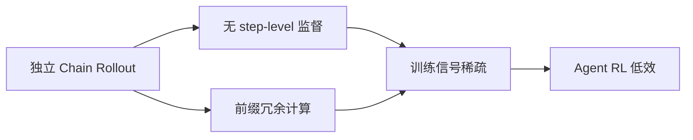
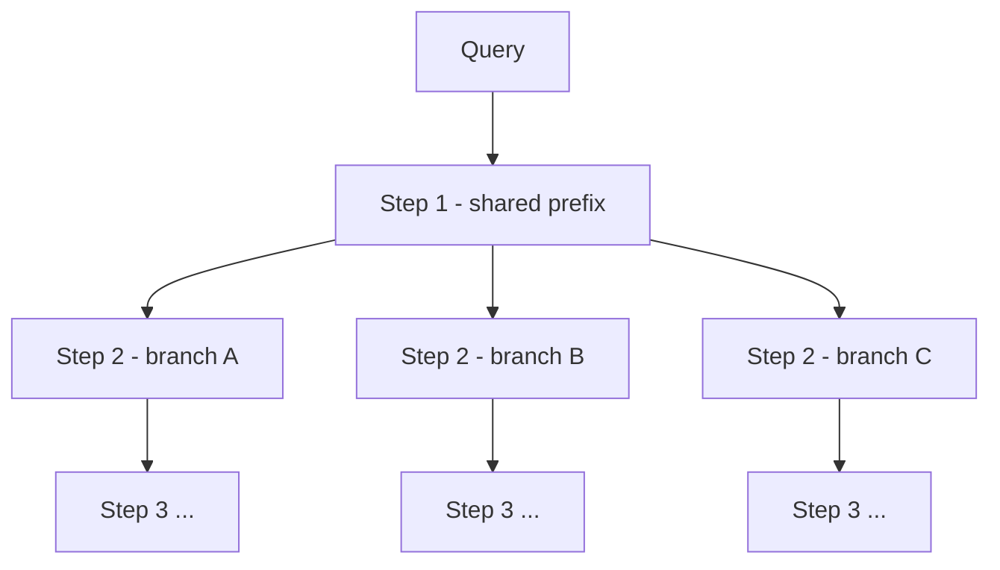
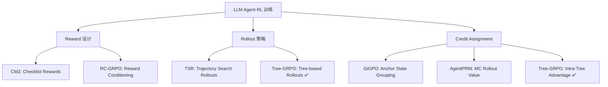

# Tree-GRPO：树搜索 + GRPO 的 LLM Agent RL

> **核心 Insight**：GRPO 的独立 chain rollout 在 Agent 任务中有两个问题——token/工具调用预算浪费，且无 step-level 监督信号。树搜索可以同时解决两个问题：共享前缀节省预算，树结构天然提取 process supervision。

## 论文基础

| 项目 | 内容 |
|------|------|
| arXiv | [2509.21240](https://arxiv.org/abs/2509.21240) |
| 机构 | 厦门大学 + Alibaba AMAP + SUSTech |
| 发表 | **ICLR 2026**（2026-01-27 接收） |
| 代码 | [github.com/AMAP-ML/Tree-GRPO](https://github.com/AMAP-ML/Tree-GRPO) |
| 任务 | Single-hop QA + Multi-hop QA + Web Agent |
| 基础框架 | veRL + Search-R1（受 TreeRL 启发） |

---

## 1. 问题：GRPO 在 Agent RL 中的两个缺陷

### 缺陷 1：稀疏监督（Sparse Supervision）

长 horizon Agent 任务的 outcome reward 只在轨迹末尾给出：
- 轨迹中间的 N 个步骤全部共享同一个 reward
- 哪些步骤"做对了"、哪些"做错了"——GRPO 一无所知
- 训练信号极度稀疏，更新方向模糊

### 缺陷 2：预算浪费（Rollout Budget）

标准 GRPO 对每个 prompt 并行生成 G 条独立轨迹：
- 每条轨迹从头开始，G 条之间没有共享
- 实际上，同一问题的不同 rollout 在前几步往往产生相似的 prefix
- 相同计算预算下，独立采样的多样性远不如从关键决策点分叉的树搜索

### 根本问题

---

## 2. Tree-GRPO 方法

### 2.1 核心思路

把 GRPO 的独立 chain rollout 换成**树搜索 rollout**：
- 每个 tree node = 一个完整的 Agent 交互步骤（Observation → Thought → Action）
- 从每个节点展开多个分支，共享 prefix 计算
- 树结构 = 搜索空间，而非多条独立轨迹

**预算优势**：同样 G×N 个 token/工具调用，树搜索可以覆盖更多有意义的分叉点。

### 2.2 双层 Advantage 估计

Tree-GRPO 在两个粒度上计算相对 advantage：

#### Intra-Tree Level（树内）

比较**同一父节点下的不同子分支**：

$$\hat{A}^{\text{intra}}_{t,k} = \frac{R_k - \bar{R}_{\text{siblings}}}{\text{std}(R_{\text{siblings}})}$$

- $R_k$：分支 k 的 outcome reward（最终结果）
- 分母：同级兄弟节点的 reward 均值
- **含义**：这条路比同一决策点的其他路好/差多少？

**理论发现（Proposition 3.1）**：intra-tree GRPO 目标在梯度形式上等价于 **step-level DPO**（在线版）——即，Tree-GRPO 隐式地在做在线 step-level preference learning，**无需任何显式标注的 preference pair，也无需 PRM**。

#### Inter-Tree Level（跨树）

比较**不同 query 的整体树**，对应原始 GRPO 的跨 prompt 归一化。

$$\hat{A}^{\text{inter}}_{t} = \frac{R_{\text{tree}} - \bar{R}_{\text{trees}}}{\text{std}(R_{\text{trees}})}$$

#### 组合 Advantage

$$\hat{A}_{t,k} = \lambda \cdot \hat{A}^{\text{intra}}_{t,k} + (1-\lambda) \cdot \hat{A}^{\text{inter}}_t$$

双层组合：兼顾局部（路径选择）和全局（问题难度）。

### 2.3 从 Outcome Reward 免费提取 Process Supervision

这是 Tree-GRPO 最精妙的地方：

- **标准 PRM**：需要人工或 oracle 标注每个推理步骤的质量，成本极高
- **Tree-GRPO**：只用 outcome reward，通过树结构的**兄弟节点对比**，自动产生 step-level 监督信号
- 共享同一 prefix 的兄弟节点，它们的 reward 差异 = 该决策步骤的质量差异

这避免了 PRM 的标注需求，同时获得了 step-level 训练信号。

### 2.4 树搜索策略

- 每个步骤 $t$：从当前状态扩展 $K$ 个分支（类似 BFS 按层展开）
- 深度由任务决定（QA: 3-5 步，Web Agent: 更深）
- 使用 outcome reward 为叶节点评分，向上传播用于 intra-tree advantage

---

## 3. 实验结果

### 3.1 主要数字（基于 GitHub Preliminary Results）

**Single-hop QA**（NQ/Trivia/PopQA）：

| 方法 | Avg3 |
|------|------|
| GRPO (Qwen2.5-1.5b) | 43.4 |
| **Tree-GRPO (Qwen2.5-1.5b)** | **47.5** (+4.1) |
| GRPO (Qwen2.5-3b) | 48.1 |
| **Tree-GRPO (Qwen2.5-3b)** | **50.0** (+1.9) |
| GRPO (Qwen2.5-7b) | 50.5 |
| **Tree-GRPO (Qwen2.5-7b)** | **52.2** (+1.7) |
| GRPO (Qwen2.5-14b) | 55.1 |
| **Tree-GRPO (Qwen2.5-14b)** | **55.7** (+0.6) |

**Multi-hop QA**（HotpotQA/2Wiki/MusiQue/BambooQA）：

| 方法 | Avg4 |
|------|------|
| GRPO (Qwen2.5-1.5b) | 11.3 |
| **Tree-GRPO (Qwen2.5-1.5b)** | **19.1** (+7.8) |
| GRPO (Qwen2.5-3b) | 31.8 |
| **Tree-GRPO (Qwen2.5-3b)** | **36.8** (+5.0) |
| GRPO (Llama3.2-3b-it) | 26.7 |
| **Tree-GRPO (Llama3.2-3b-it)** | **36.8** (+10.1) |
| GRPO (Qwen2.5-7b) | 36.4 |
| **Tree-GRPO (Qwen2.5-7b)** | **37.8** (+1.4) |
| GRPO (Qwen2.5-14b) | 41.8 |
| **Tree-GRPO (Qwen2.5-14b)** | **45.3** (+3.5) |

### 3.2 关键结论

- **Multi-hop 提升最大**：long-chain reasoning 的 step-level 监督需求最强，Tree-GRPO 优势最明显
- **小模型提升更显著**：1.5B/3B 的绝对提升远大于 14B，说明树搜索提供了小模型自身缺乏的 credit assignment
- **rollout 预算效率**：仅用 1/4 预算的 Tree-GRPO 超越全预算的 chain-based GRPO（论文核心 claim）
- **跨架构一致**：Qwen2.5 和 Llama3.2 上均有效

### 3.3 11 Datasets 覆盖

3 任务类型：
1. Single-hop QA：NQ / Trivia / PopQA
2. Multi-hop QA：HotpotQA / 2WikiMultiHop / MuSiQue / BambooQA
3. Web Agent QA（Bing 搜索）：数据集即将发布

---

## 4. 理论分析

### 4.1 Intra-Tree GRPO ≡ Step-level DPO（在线版）

**Proposition 3.1**（论文核心定理）：

intra-tree level 的 GRPO 目标函数的梯度形式，等价于带特定权重的 preference advantage 梯度——和 Step-DPO（step-level DPO）的梯度形式相同，区别仅在权重项。

**含义**：
- Tree-GRPO 不需要 preference pair 标注
- 不需要 PRM
- 纯 outcome reward + 树结构 → 自动产生 step-level preference 学习效果
- 这是理论上的 free lunch：**结构本身提供监督**

### 4.2 与 PRM 的关键区别

| 维度 | PRM | Tree-GRPO |
|------|-----|-----------|
| step-level 信号来源 | 人工/LLM 标注 | 树内 outcome 对比 |
| 训练时成本 | 高（标注） | 低（仅 rollout） |
| 信号准确性 | 高（有监督） | 中（相对比较） |
| 在线适应 | 困难 | 天然在线 |

---

## 5. 与相关工作的关系

### 具体关联

- **[[AI/2-Agent/Agentic-RL/TSR-Trajectory-Search-Rollouts-Multi-Turn-RL|TSR（Trajectory-Search Rollouts）]]**：TSR 在 inference-time 做树搜索增强 rollout 多样性；Tree-GRPO 在 training-time 的 rollout 阶段就用树结构——目标相似，实现层次不同
- **[[AI/2-Agent/Agentic-RL/Long-Horizon-Credit-Assignment专题|GiGPO（Long-Horizon Credit Assignment 专题）]]**：GiGPO 用 anchor state grouping 解决 credit assignment；Tree-GRPO 用 intra-tree 对比——两种不同的 credit assignment 策略，可组合
- **[[AI/2-Agent/Agentic-RL/RC-GRPO-Reward-Conditioned-Tool-Calling-RL|RC-GRPO]]**：RC-GRPO 解决 GRPO 全0/全1问题；Tree-GRPO 通过树内对比自然引入差异度——Root cause 相同（GRPO group 内缺乏对比），解法不同
- **[[AI/2-Agent/Agentic-RL/CM2-Checklist-Rewards-Multi-Turn-Tool-Use-RL|CM2（Checklist Rewards）]]**：CM2 优化 reward 质量（什么 reward）；Tree-GRPO 优化 rollout 结构（怎么采样）——正交互补
- **[[AI/2-Agent/Agentic-RL/SCoRe-Self-Correction-via-Reinforcement-Learning|SCoRe（NeurIPS 2024）]]**：SCoRe Phase 1 的 KL 约束防止坍缩，Tree-GRPO 的树结构本身就防止了"只走一条路"的坍缩——不同机制，相同效果

---

## 6. 局限与未解问题

1. **树宽度 vs 深度权衡**：如何决定每个节点展开多少分支 K，以及展开到多深？当前看起来是超参数，有没有自适应方案？
2. **Memory 开销**：树结构存储 N 条不独立的轨迹，KV cache 共享策略复杂，实际显存消耗如何？
3. **环境交互成本**：每个 Agent 步骤需要真实环境交互（调用搜索引擎/工具），树展开意味着 K 倍的环境调用——实际推理成本如何控制？
4. **更复杂的 Agent 任务**：实验以 QA（单一 verifiable reward）为主，对 open-ended coding / GUI 任务是否同样有效？
5. **与 MCTS 的完整对比**：MCTS 有 selection/expansion/simulation/backpropagation 完整循环；Tree-GRPO 的树搜索是简化版，对比实验是否充分？

---

## 7. 落地应用

### 工程要点

1. **KV Cache 复用**：树中共享 prefix 的节点可以共享 KV cache，关键优化，显著降低计算成本
2. **环境并行**：K 个子分支的环境交互可以并行化（多 worker），不串行
3. **树深度控制**：可以先用 GRPO 训一个 warm-start 策略，再用 Tree-GRPO 精调
4. **超参数**：分支数 K ≈ 3-5（太多则搜索空间爆炸），深度由任务决定

### 面试高频问法

- **Q: GRPO 在长 horizon Agent 任务中的主要问题？** → A: 稀疏监督（step-level 无反馈）+ 预算浪费（独立 rollout，无共享前缀）
- **Q: Tree-GRPO 如何免费获得 process supervision？** → A: 树内兄弟节点共享前缀，outcome 差异 = 该决策步骤的质量差异，intra-tree advantage 本质上是 step-level preference signal
- **Q: Tree-GRPO 和 PRM 的本质区别？** → A: PRM 需要显式标注，是监督信号；Tree-GRPO 用结构对比，是自监督信号

### 可用场景

- **RAG Agent**：多跳推理（Multi-hop QA），Tree-GRPO 提升最显著的场景
- **Tool-use Agent**：工具选择的分叉点自然形成树结构
- **Code Agent**：不同实现路径的 branch search → 最终可执行性作为 outcome reward
- **Search-R1 类项目**：已开源，直接在 Search-R1 框架上替换 rollout 策略

---

## 8. 启发思考

**So What？**

Tree-GRPO 回答了一个深层问题：**GRPO 的 "group" 应该从哪里来？**

标准 GRPO 的 group = 同一 prompt 的独立采样。这在 single-turn 任务里 OK，因为不同采样确实能覆盖不同输出。但在 multi-turn Agent 任务里，独立采样不能给出 step-level 对比——你知道最终结果，但不知道哪一步导致了这个结果。

Tree-GRPO 用树结构重定义了 "group"：group = 同一状态的不同延续。这个语义上的转换，使 intra-tree advantage 天然具有 credit assignment 的含义。

**核心洞察**：**RL 的监督结构应该由任务的因果结构决定**。Agent 任务是有状态的顺序决策，group 应该在状态空间对齐，而非仅在输入空间对齐。

**未解问题**：
1. 最优树结构是否应该 adaptive（根据模型当前能力动态调整分支数）？
2. 能否把 Tree-GRPO 的 intra-tree advantage 和 GiGPO 的 anchor state grouping 统一？两者都在解决同一问题，可能有更一般的框架

**盾卫安全启发**：
- Tree-GRPO 的"共享前缀 → 分叉检测"思路可以用于 prompt injection 检测：同一 context 的不同 response 分叉处，检测异常的 advantage pattern（突然高 reward 的分支可能是 injection 触发点）

---

## 推荐阅读

1. **原始论文**：[arXiv:2509.21240](https://arxiv.org/abs/2509.21240) — Tree-GRPO 全文（ICLR 2026）
2. **代码仓库**：[github.com/AMAP-ML/Tree-GRPO](https://github.com/AMAP-ML/Tree-GRPO) — 基于 veRL，含完整训练脚本
3. **理论基础**：[TreeRL (THUDM)](https://github.com/THUDM/TreeRL) — 启发来源，GRPO 的树搜索早期实现
4. **Search-R1**：[github.com/PeterGriffinJin/Search-R1](https://github.com/PeterGriffinJin/Search-R1) — 底层框架，RAG + RL 的 Agent 训练
5. **Step-DPO**：step-level DPO 的原始论文（理解 Proposition 3.1 的理论背景）
6. **对比阅读**：[[AI/2-Agent/Agentic-RL/TSR-Trajectory-Search-Rollouts-Multi-Turn-RL|TSR]]、[[AI/2-Agent/Agentic-RL/Long-Horizon-Credit-Assignment专题|GiGPO/Long-Horizon Credit Assignment]]、[[AI/2-Agent/Agentic-RL/RC-GRPO-Reward-Conditioned-Tool-Calling-RL|RC-GRPO]]
7. **元原则**：[[AI/3-LLM/RL/Theory/RL-Signal-Granularity-Causal-Structure-Principle|RL 信号粒度与因果结构匹配原则]] — Tree-GRPO 是该原则路径1（重定义 Group）的典型实现
8. **理论基础**：[[AI/3-LLM/RL/GRPO/GRPO 深度理解|GRPO 深度理解]] — Tree-GRPO 是 GRPO 的树搜索改造：线性 rollout → 树状 rollout，双层 advantage 取代单层 group advantage
