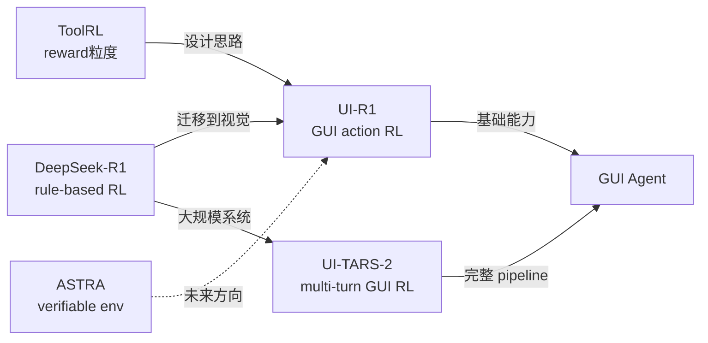

# UI-R1: Rule-Based RL for GUI Action Prediction

## 一句话定位

**把 DeepSeek-R1 的 rule-based RL 范式搬到 GUI，证明仅 136 条数据能做到 SFT 用 76K 数据才达到的性能。**

GUI Agent 领域第一篇将 R1 风格 RL 系统化应用于 action prediction 的工作。

---

## 问题：SFT 训练 GUI Agent 的三个代价

1. **大数据依赖**：OS-Atlas-7B 需要 76K GUI 标注数据（昂贵）
2. **OOD 泛化差**：在手机数据 SFT 的模型，放到 desktop/web 场景就崩
3. **推理能力弱**：SFT 让模型模仿格式，不是学会"分析截图 → 推理 → 决定动作"

---

## UI-R1 核心设计

### Reward 函数：三分量线性组合

$$R_{\mathcal{A}} = R_{\mathcal{T}} + R_{\mathcal{C}} + R_{\mathcal{F}}$$

**1. Action Type Reward** $R_{\mathcal{T}}$
- 动作空间：Click / Scroll / Back / Open_App / Input_Text（5 类日常操作）
- $R_{\mathcal{T}} = 1$ if 预测类型 = ground truth，否则 0
- 最简单的 rule-based reward

**2. Coordinate Accuracy Reward** $R_{\mathcal{C}}$（Click 操作专属）

$$R_{\mathcal{C}} = \begin{cases} 1 & \text{if coord } \mathcal{C} \in \text{box } \mathcal{B} \\ 0 & \text{else} \end{cases}$$

**关键设计选择**：不用 IoU（预测 box vs ground truth box），而是判断**预测坐标是否落在 ground truth box 内**。

为什么这样设计比 IoU 更好？
- GUI agent 的目标是"点到正确位置"，不是"框出正确元素"
- 用户直觉对齐：点到按钮中间和边缘都算成功，不需要精确框
- 去除了"先识别元素 → 再预测坐标"的两步依赖

**3. Format Reward** $R_{\mathcal{F}}$
- 强制结构化输出：`<think>...</think>` 推理过程 + `<answer>...</answer>` 最终答案
- 有 reasoning 的模型比直接输出动作 **+6%**（内部实验验证）
- 格式约束 = 强制 chain-of-thought，触发 GUI 场景的 slow thinking

---

### 训练算法：GRPO（无 Critic）

$$A_i = \frac{r_i - \text{Mean}(\mathbf{r})}{\text{Std}(\mathbf{r})}$$

- Base model：Qwen2.5-VL-3B
- 生成 N 条候选动作 → 计算各自 reward → 归一化 advantage → PPO-style 更新
- 无需 value function，资源消耗远低于 PPO

---

### 数据选择：136 条 = 刚刚够用

**选数据的三个维度**（借鉴 Muennighoff et al. 2025）：

| 维度 | 标准 |
|------|------|
| **Difficulty** | 不能太容易（不产生 gradient），不能太难（全 fail，也不产生 gradient）|
| **Diversity** | 五种动作类型均匀分布；不同 app、不同 UI 布局 |
| **Quality** | instruction 清晰明确，ground truth bbox 准确 |

**训练域**：仅 mobile（Android）
**测试域**：mobile + desktop + web（OOD）→ 证明泛化能力

---

## 实验结果

**In-Domain（AndroidControl）**：

| 指标 | Base (Qwen2.5-VL-3B) | UI-R1-3B | 提升 |
|------|---------------------|----------|------|
| Action Type Accuracy | baseline | +**15%** | 显著 |
| Grounding Accuracy | baseline | +**10.3%** | 显著 |

**Out-of-Domain（ScreenSpot-Pro + desktop/web subsets）**：

| 模型 | ScreenSpot-Pro | 数据量 | 模型大小 |
|------|----------------|--------|--------|
| OS-Atlas-7B（SFT） | competitive | 76K | 7B |
| **UI-R1-3B（RL）** | **competitive** | **136** | 3B |

结论：**3B + 136 条 RL ≈ 7B + 76K SFT**，数据效率 560x，参数效率 2.3x。

---

## 批判性分析

### 真正的贡献

**IoU → coordinate-in-box 的 reward 设计**是本文最有价值的洞察。GUI grounding 和通用视觉 grounding 的评估目标本质不同——前者关心"动作执行点"，后者关心"元素边界"。这个细节在很多 GUI 论文里被忽视。

**Rule-based RL 在多模态视觉场景的可行性验证**：证明 R1 范式不只适用于文本推理和数学，同样适用于"看截图 → 推理 → 操作"。

### 值得怀疑的地方

1. **仅 low-level instruction**：论文明确说只做"Click the menu icon"这类指令，不做"Create an event"这类 high-level task。high-level task 需要多步规划，本文的单步 reward 不适用

2. **只 Click 的坐标 reward**：Scroll / Input_Text 等动作的 argument reward 未设计——这些动作的错误率可能同样高，但 reward 信号缺失

3. **OOD 数字细节缺失**："competitive"的说法比较模糊，没有给出具体差距是多少。从 Figure 1 看，desktop/web 提升幅度小于 mobile

4. **训练数据规模的下界**：136 是选择的结果，不是最小值——没有做 ablation，不知道 50 条够不够

### 与 UI-TARS-2 的关系对比

```
维度          UI-R1                    UI-TARS-2
目标          action prediction        全流程 GUI agent
RL 规模       136 条数据，单步          数千 VM，多轮长 horizon
Reward        rule-based 三分量        outcome + shaping
训练复杂度    极低（一台 GPU）          极高（数千 VM 集群）
贡献类型      算法验证                 工程系统
适用场景      快速迁移到新 GUI 领域     产品级 GUI Agent 研发
```

两篇论文在 GUI RL 谱系的两端——UI-R1 是"极简路线"，UI-TARS-2 是"工程极致路线"。

---

## 面向 GUI Agent RL 的知识整合



**UI-R1 的 reward 设计和 ToolRL 的 reward 粒度分析高度对应**：
- ToolRL：工具名 / 参数名 / 参数值分别打分
- UI-R1：动作类型 / 坐标 / 格式分别打分
- 结论一致：**分项细粒度 reward 比 binary outcome 好**

---

## 工程要点

**快速在新 GUI 领域启动 RL 训练的 checklist**：

```python
# 1. 数据：选 136 条（难度/多样性/质量三维筛选）
# 2. Reward 设计：
R_action = R_type + R_coordinate + R_format
# 其中 R_coordinate: 坐标是否在 bbox 内（不是 IoU）

# 3. 强制 chain-of-thought 格式（+6% 的来源）
prompt = """
<think>分析截图，推理该做什么操作</think>
<answer>{"action": "click", "coordinate": [x, y]}</answer>
"""

# 4. GRPO（无 critic，适合小团队）
# 5. Base: Qwen2.5-VL-3B（或更大）
```

**关键经验**：
- 数据质量 >> 数据数量（136 > 76K）
- Format reward 是隐性 chain-of-thought 约束
- OOD 泛化来自"学会推理"，不来自"记忆数据"

---

## 落地应用

**可用场景**：
- 快速给新 GUI 场景（新 App、新 OS）建立基础 RL agent
- 低资源团队的 GUI agent 起步（不需要 VM 集群）
- 作为 UI-TARS-2 那样大系统的冷启动 warm-up 阶段

**面试高频问法**：
- Q: GUI grounding 的 reward 为什么不用 IoU？
  - A: UI-R1 的核心洞察：GUI agent 的目标是"操作坐标正确"，不是"元素 box 正确"。"坐标是否在 ground truth bbox 内"比 IoU 更直接对齐操作目标，也更鲁棒（不要求预测 box）
- Q: 136 条数据怎么够 RL 训练？
  - A: Rule-based RL 不需要覆盖全部情况，需要的是能产生有效 gradient signal 的 hard examples。选择标准：不太容易（全对，advantage=0）、不太难（全错，advantage=0），就能驱动学习

---

## 启发思考

**So What**：UI-R1 的价值在于把 GUI Agent RL 的准入门槛大幅降低——136 条数据、一台 GPU、3B 模型就能开始。这意味着企业内部特定 GUI（如内部 ERP 系统、特定 App）的 Agent 训练成为可能，不再需要巨量数据和算力。

**局限**：
- 仅 single-step，不能处理多步任务
- 缺少 Scroll / Input_Text 的坐标级 reward

**脑暴**：
- UI-R1 的极简路线 + UI-TARS-2 的 Data Flywheel：能否用 UI-R1 式 RL 做 cold start，再用 Data Flywheel 迭代？这应该就是字节实际做的
- 把 UI-R1 的坐标 reward 扩展到 Scroll（距离）、Input_Text（编辑距离）：完整 5 动作的 rule-based reward
- 与 ASTRA 对接：ASTRA 合成工具调用环境，能否同样合成 GUI 动作验证环境？

---

## 推荐阅读

- 原论文：[arXiv:2503.21620](https://arxiv.org/abs/2503.21620)
- 对比大系统：[[UI-TARS-2 论文|UI-TARS-2]] — GUI Agent 工程极致路线（Data Flywheel + 异步 multi-turn RL）；UI-R1 可作其冷启动 warm-up
- Reward 设计参考：[[Tool-Use-RL-训练专题|Tool Use RL 训练专题]] — ToolRL reward 粒度分析（坐标级 reward 思路相通）
- 基础环境：[AndroidControl](https://arxiv.org/abs/2310.04716) | [ScreenSpot-Pro](https://arxiv.org/abs/2504.07981)
- GUI Agent RL 综述定位：[Agentic RL Survey §4.4](https://arxiv.org/abs/2509.02547) — GUI Agent RL 章节
