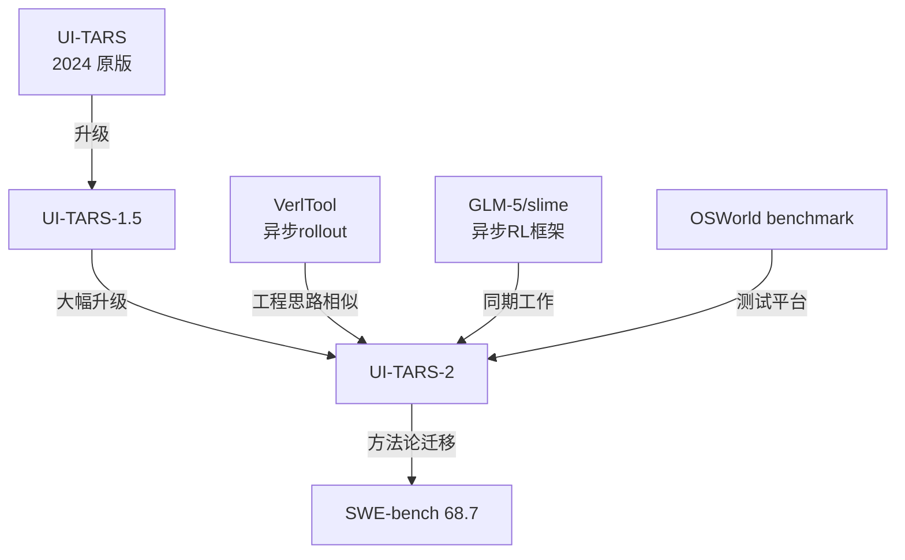

# UI-TARS-2: Advancing GUI Agent with Multi-Turn RL

## 定位

**这不是一篇算法论文，是一份系统性工程报告。**

UI-TARS-2 要解决的不是"模型够不够聪明"，而是"怎么把 GUI Agent 的整条训练流水线规模化、稳定化"。字节跳动面对的是真实的工程挑战，然后系统性地解决了。

---

## 四大挑战 → 四支柱解法

| 挑战 | 解法 |
|------|------|
| **数据稀缺**：GUI 轨迹采集成本极高，不像文本/代码有现成语料 | **Data Flywheel** — 模型与数据共同进化的自强化循环 |
| **多轮 RL 不稳定**：长序列 credit assignment、梯度爆炸、长尾轨迹拖慢训练 | **稳定化 Multi-turn RL** — 异步有状态 rollout + streaming updates + 增强 PPO |
| **GUI-only 局限**：只能点击、打字、滚动，无法做文件操作/终端任务 | **Hybrid GUI 环境** — GUI + 文件系统 + Terminal + MCP Tool 统一沙盒 |
| **环境扩展性差**：VM 集群崩溃、状态不一致、并发数不足 | **All-in-One Sandbox** — 数千 VM + 浏览器 sandbox 统一管理 |

---

## Agent 形式化

采用 **ReAct 范式**（Reason → Act → Observe 循环）：

$$\tau = \{(t_0, a_0, o_0), (t_1, a_1, o_1), \ldots, (t_T, a_T, o_T)\}$$

**分层记忆架构**：

$$\mathcal{M}_t = (\mathcal{W}_t, \mathcal{E}_t)$$

- $\mathcal{W}_t$（Working Memory）：最近 N 步的高保真记录（screenshots + actions + observations）
- $\mathcal{E}_t$（Episodic Memory）：过去 episode 的语义压缩摘要（保留意图和结果）

策略预测：

$$P(t_n, a_n \mid \text{instruction}, \mathcal{W}_n, o_n, \mathcal{E}_n)$$

**Action Space**：
- GUI Actions：click / type / scroll（鼠标键盘操作）
- SDK Functions：terminal commands、MCP tool invocations

---

## Data Flywheel：自强化循环

```mermaid
graph LR
    A[当前 RL 模型] -->|生成轨迹| B[Rejection Sampling]
    B -->|V(s)=1 高质量| C[SFT Dataset +]
    B -->|V(s)=0 低质量| D[CT Dataset +]
    C --> E[CT → SFT → RL 训练]
    D --> E
    E -->|更好的模型| A
```

**三阶段训练**：
1. **CT（Continual Pre-training）**：大规模、多样化数据，奠定广泛知识基础
2. **SFT（Supervised Fine-tuning）**：高质量任务特定轨迹，对齐 GUI 操作格式
3. **RL（Reinforcement Learning）**：端到端在可验证交互任务上优化

**关键设计**：
- 每次迭代，RL 模型生成的高质量轨迹进 SFT，低质量的进 CT
- 不浪费任何轨迹——质量决定去哪个阶段，而不是丢弃
- 随迭代进行，$P(V(s)=1 \mid t) > P(V(s)=1 \mid t-1)$，高质量输出比例持续上升

**冷启动**：从 UI-TARS 和 UI-TARS-1.5 的所有训练数据 + 网络教程 + 开源轨迹 + 内部标注

---

## Sandbox 架构

### GUI Env：云虚拟机平台

- 支持 Windows、Ubuntu、Android
- PyAutoGUI + ADB 接口，跨设备操作
- VM 集群：**数千台实例**，VM Manager 管理，数千 QPS
- VNC/RTC 实时可视化
- Lease-based 生命周期管理（防资源泄漏）
- 集成 terminal、file access、VS Code、Jupyter 供标注

### Game Env：硬件加速浏览器 Sandbox

- HTML5/WebGL 游戏，浏览器是唯一可行执行环境
- GPU 硬件加速截图，重实现 Window timing API（可加速时间）
- Chrome DevTools Protocol + Playwright 接口
- 每 container 多浏览器实例 + 弹性调度
- 自动 crash recovery + checkpoint 确保可复现

### 创新点：共享文件系统

GUI agent 可以"用浏览器下载文件，然后立刻用 shell 命令处理"——这在之前的 GUI-only 系统里做不到。

---

## Multi-Turn RL 稳定化

### 关键工程问题

**多轮 GUI RL 比文本 RL 难在哪**：
- 每步 observation 是高分辨率截图（高维、慢）
- 长轨迹（50-200 步）的 credit assignment 极难
- 长尾轨迹（某些任务需要 300+ 步）拖慢整个 batch
- 环境 crash → rollout 失败率高

### 解法：增强版 PPO

四个关键创新：

1. **Asynchronous Rollout + Stateful Environment**
   - rollout 异步执行，不等慢的任务
   - stateful environment 保存中间状态，支持 multi-turn 上下文恢复
   - 不因单个慢任务阻塞整个训练

2. **Streaming Updates**
   - 避免长尾轨迹的 sync barrier
   - 轨迹完成即更新，不等 batch 全部完成

3. **Reward Shaping**
   - 纯 outcome reward（任务成功/失败）之外，加入中间 step reward
   - GUI 操作正确性（点击正确元素？）可以部分验证

4. **Adaptive Advantage Estimation + Value Pretraining**
   - Value function 单独预训练，避免 cold start 时 advantage 估计不准
   - Adaptive normalization 处理长轨迹的 reward scale 问题

**Parameter Interpolation for Vertical Agents**（2.6 节）：
- 训练多个 domain-specific vertical agents（GUI / 游戏 / 代码）
- 用参数插值（模型权重线性组合）合并成通用 agent
- 避免灾难性遗忘，保留各领域能力

---

## 实验结果

**GUI Benchmarks**：

| Benchmark | UI-TARS-2 | 对比 |
|-----------|-----------|------|
| Online-Mind2Web | **88.2** | SOTA |
| OSWorld | **47.5** | 超越 Claude Computer Use |
| WindowsAgentArena | **50.6** | 超越 OpenAI CUA |
| AndroidWorld | **73.3** | SOTA |

**游戏环境（15 款游戏套件）**：
- Mean normalized score：**59.8**（约人类水平 60%）
- 超 OpenAI CUA：**2.4×**
- 超 Claude Computer Use：**2.8×**

**跨域泛化**（GUI-SDK 扩展）：
- BrowseComp（长 horizon 信息检索）：**29.6**
- Terminal Bench：**45.3**
- SWE-Bench Verified：**68.7**

这个跨域泛化结果很关键——**GUI Agent 的 multi-turn RL 方法论可以迁移到 SWE-bench 这类代码任务**。

---

## 批判性分析

### 真正的贡献

**最重要的贡献不是 benchmark 数字，而是 GUI Agent 工程方法论**：

1. **Data Flywheel 的质量路由机制**：把"好数据进 SFT，差数据进 CT"做成系统，而不是手工筛选——这解决了 GUI 数据的根本稀缺问题
2. **Async + Stateful 异步 rollout**：让数千 VM 的并行训练成为可能，不被单个慢任务卡死
3. **Hybrid GUI + Terminal 统一沙盒**：第一次让 GUI agent 能真正处理"下载文件 → 用代码分析"这类跨模态工作流

### 值得怀疑的地方

1. **OSWorld 47.5 仍然距人类（71.8）有差距**：复杂桌面任务（多应用协作、异常处理）仍然弱
2. **VM 集群成本极高**：数千台 VM 不是普通团队能复现的，论文未讨论更轻量的替代方案
3. **Parameter Interpolation 的局限**：线性插值的 domain mixture 可能在新 domain 上泛化不足，强于简单 fine-tune 但未必是最优

### 与其他工作的关系



---

## 工程要点

**GUI Agent RL 基础设施清单**：

```
环境层：
- VM 集群（Windows/Linux/Android）
- 浏览器 Sandbox（HTML5/WebGL 游戏）
- 共享文件系统（GUI ↔ Terminal 互通）
- 统一 SDK（PyAutoGUI + ADB + MCP）

训练层：
- 异步有状态 rollout 框架
- Streaming 梯度更新
- PPO + Reward Shaping + Value Pretraining
- Data Flywheel（CT/SFT/RL 分层质量路由）

观测层：
- 截图（GPU 加速）
- 录像（可回放）
- VNC 实时监控
- Checkpoint（可复现）
```

**关键经验**：
- GUI 轨迹数据的质量路由比数量更重要
- Long-tail 任务必须用 async + streaming 处理，否则整个 batch 被拖死
- 分层记忆（Working + Episodic）对 100+ 步长任务是必需的

---

## 落地应用

**可用场景**：
- 桌面自动化（RPA 升级版）
- 网页操作 Agent（客服、表单、数据采集）
- 移动端 Agent（Android 自动化测试）
- 游戏 AI（需要视觉理解 + 策略规划）

**面试高频问法**：
- Q: GUI Agent 和 Code Agent 的 RL 训练有什么本质区别？
  - A: GUI Agent 的 observation 是截图（高维、慢），action 是鼠标键盘操作（连续空间），reward 主要是 task outcome（稀疏）；Code Agent 的 observation 是代码/终端输出（文本），action 是代码行，reward 可以用测试覆盖率等中间信号。UI-TARS-2 的关键工程贡献是异步 stateful 环境和 streaming updates，解决 GUI RL 的 long-tail 问题。

- Q: Data Flywheel 是什么，和一般的 rejection sampling 有什么区别？
  - A: Data Flywheel 的核心是质量路由：高质量输出进 SFT（高价值精调），低质量输出进 CT（低价值知识扩充），而不是简单丢弃。这样模型迭代越来越好，高质量输出比例不断上升，形成自强化循环。

---

## 启发思考

**So What**：UI-TARS-2 证明了 GUI Agent 的 multi-turn RL 方法论具有强泛化性——从 GUI 任务到 SWE-bench 代码任务的迁移成功（68.7），说明"学会在复杂环境中做多步决策"是一种通用能力，不局限于 GUI 领域。

**最值得关注的洞察**：Data Flywheel 中的质量路由（好数据→SFT，差数据→CT）可以推广到所有 Agent RL 场景，是一个通用的数据管理范式。

**局限/未解**：
- 如何在资源受限环境下复现（中小公司没有数千台 VM）
- OSWorld 到人类水平（71.8）的差距主要来自哪类任务？
- Parameter Interpolation 的能力上界

**脑暴**：
- UI-TARS-2 的 Data Flywheel + ASTRA 的 verifiable RL env：能否把 ASTRA 的 tool-use RL 方法论迁移到 GUI 领域？
- 短视记忆（Working）+ 长视记忆（Episodic）的分层机制 + Memory-R1 的 RL 训练记忆管理：能否在 GUI Agent 中用 RL 动态决定哪些截图值得写入 Episodic Memory？

---

## 推荐阅读

- 原论文：[arXiv:2509.02544](https://arxiv.org/abs/2509.02544)
- 代码：[bytedance/ui-tars](https://github.com/bytedance/ui-tars)
- Demo：[seed-tars.com](https://seed-tars.com/showcase/ui-tars-2)
- 相关 Vault 笔记：
  - [[Agentic-RL-2026前沿综合分析|Agentic RL 2026 前沿综合分析]] — GUI Agent 宏观定位
  - [[Agent-RL-环境工程系统论|Agent RL 环境工程系统论]] — 环境设计原则（OSWorld/WebArena 分析）
  - [[ASTRA-Automated-Tool-Agent-Training|ASTRA]] — Tool-use RL 方法论（数据合成 vs Data Flywheel 的哲学对比）
  - [[Memory-R1-RL-for-LLM-Memory-Management|Memory-R1]] — Working/Episodic Memory 的 RL 训练（可扩展至 GUI 场景）
  - [[Long-Horizon-Credit-Assignment专题|Long-Horizon Credit Assignment 专题]] — Multi-turn credit assignment 方法论
  - [[UI-R1-GUI-Action-Prediction-RL|UI-R1]] — GUI Agent RL 极简对立路线：136 条数据 rule-based GRPO（vivo+CUHK）；UI-R1 可作 UI-TARS-2 Data Flywheel 的冷启动 seed
- GUI Agent 生态：[OSWorld](https://os-world.github.io/) | [AndroidWorld](https://google-deepmind.github.io/android_world/) | [Online-Mind2Web](https://arxiv.org/abs/2306.06070)
