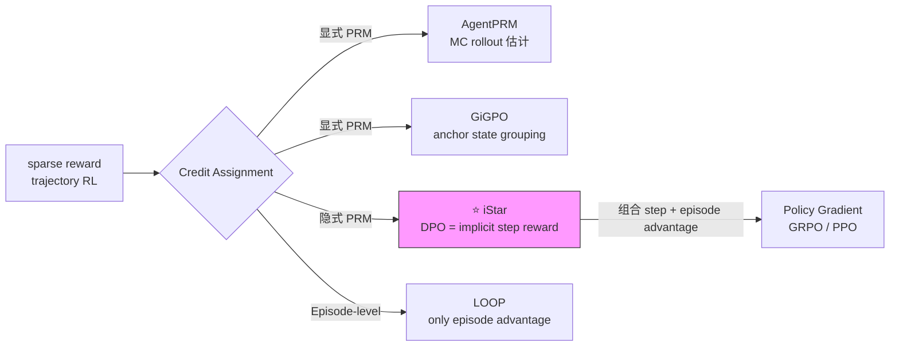

# iStar：Agentic RL 隐式步骤奖励（Implicit Step Rewards）

**论文**：Agentic Reinforcement Learning with Implicit Step Rewards  
**arXiv**：2509.19199v3  
**机构**：未知（论文标注 cs.CL）  
**难度**：★★★★★（Agent RL credit assignment 理论统一，DPO ≡ PRM 的桥接工作）  
**关联**：[[AI/2-Agent/Agentic-RL/GiGPO-Group-in-Group-Policy-Optimization|GiGPO]] | [[AI/2-Agent/Agentic-RL/Long-Horizon-Credit-Assignment专题|Long-Horizon CA 专题]] | [[Projects/MA-RLHF/lc8-DPO/lc8-05-DPO-IPO-手撕实操|lc8-DPO-IPO-手撕实操]] | [[AI/3-LLM/MA-RLHF课程/lc8-PRM-O1-Search-手撕实操|lc8-PRM-O1-Search-手撕实操]]

---

## 一、核心问题：为什么现有 credit assignment 方法都不够好？

Agent RL 的稀疏 reward 问题目前有三类解法，各有缺陷：

| 方法 | 代表 | 缺陷 |
|------|------|------|
| 显式 Process Reward | AgentPRM, GiGPO | 需要 step-level 标注（biased annotation）；reward hacking（模型骗 PRM 而非真正完成任务）|
| 细粒度 reward | token-level reward | 方差爆炸（overly fine-grained）；中间状态难以评估 |
| 依赖 state overlap | GiGPO anchor state | 如果轨迹之间状态重合稀少（sparse overlap），credit 估计退化 |

**iStar 的诊断**：三类方法都是在用**显式的中间奖励**做 credit assignment，但这些中间奖励要么需要额外标注，要么容易被 hack，要么依赖状态重叠条件。

---

## 二、核心思想：隐式步骤奖励

**iStar 的创新**：用**轨迹级 DPO 目标**同时训练 policy 和一个隐式 PRM，然后用这个隐式 PRM 生成 step-level reward。

### 关键等式：DPO ≡ PRM

**理论核心**（论文 Theorem）：轨迹级 DPO 的学习目标可以分解为**step-wise reward 函数**。

直觉推导：
- DPO 在 trajectory 级别学习 preferred vs dispreferred
- 一条轨迹 = 多个步骤的乘积：$\log \pi(y|x) = \sum_t \log \pi(y_t | x, y_{<t})$
- 把 DPO 的 trajectory-level log-ratio 分解到每一步，每步的 log-ratio 差就是隐式的 step-level reward

$$r_{implicit}(s_t, a_t) = \beta \log \frac{\pi_\theta(a_t | s_t)}{\pi_{ref}(a_t | s_t)} - \text{baseline}$$

这个 $r_{implicit}$ 就是"隐式 PRM"——不需要任何显式步骤标注，直接从 trajectory preference 中涌现。

---

## 三、iStar 算法：交替优化循环

```
while not converged:
    # Step 1: 用当前 policy 生成轨迹，构造 trajectory preference pair
    trajectories = rollout(policy, env)
    preferred, dispreferred = rank_by_outcome(trajectories)

    # Step 2: 交替优化 (EM-like)
    # 2a: 用 trajectory-level DPO 目标，更新隐式 PRM（实际上 policy 就是 PRM）
    L_DPO = -logsigmoid(beta * (log π(y_w|x) - log π_ref(y_w|x)
                               - log π(y_l|x) + log π_ref(y_l|x)))

    # 2b: 用隐式 PRM 生成 step-level advantage
    for t in range(T):
        r_implicit[t] = beta * (logprob_policy[t] - logprob_ref[t])
    A_step = normalize(r_implicit)  # step-level advantage

    # 2c: 组合 step-level + episode-level advantage
    A_combined = alpha * A_step + (1 - alpha) * A_episode

    # Step 3: 用 A_combined 做 policy gradient 更新
    L_PG = -mean(A_combined * logprob_policy)

    update(policy, L_DPO + lambda * L_PG)
```

**自强化循环**：policy 更新 → 更好的 rollout → 更好的 trajectory preference → 更准确的隐式 PRM → 更好的 step-level advantage → 更好的 policy 更新。

---

## 四、Step-Level vs Episode-Level Advantage 的组合

**iStar 的关键设计**：不只用 step-level，也不只用 episode-level，而是**线性组合**：

$$A_{combined} = \alpha \cdot A_{step} + (1 - \alpha) \cdot A_{episode}$$

**为什么需要 episode-level？**  
step-level advantage 方差小但可能偏差（隐式 PRM 不完美），episode-level 无偏但方差大（稀疏 reward 问题）。组合提供更稳定的训练信号。

**与 GiGPO 的对比**：
- GiGPO：step-level credit 来自"anchor state 分组"——同一中间状态的不同 rollout 相互对比
- iStar：step-level credit 来自"隐式 PRM"——DPO 目标直接估计每步 r
- 二者正交，理论上可以组合

---

## 五、三大评测结果

### 5.1 WebShop（网购任务，verifiable reward）
- iStar 显著超过 frontier LLMs 和强 RL baseline
- 关键：稀疏 reward + 长 horizon，正是 step-level credit 最能发挥作用的场景

### 5.2 VisualSokoban（视觉推箱子，规划任务）
- 多步视觉感知 + 空间推理，agent 需要规划 10-20 步
- iStar 在 sample efficiency 上显著优于 ORM-only 方法

### 5.3 SOTOPIA（社交互动，unverifiable reward）
- **最重要的实验**：reward 不可验证（开放性对话质量）
- 其他依赖 verifiable reward 的方法（GRPO/RLVR）在这里无法直接用
- iStar 用 trajectory preference（LLM-as-judge 排序）构造 DPO pair，自然处理 unverifiable scenario

**SOTOPIA 的意义**：证明 iStar 不局限于 math/code（可验证）场景，可以扩展到开放域 Agent 训练。

---

## 六、与相关工作的深度对比

### vs GiGPO (2505.10978)
```
相同：都做 step-level credit assignment，无需额外 rollout（GiGPO 是 zero extra rollout）
区别：
  GiGPO 依赖 anchor state 的重合（sparse overlap 时退化）
  iStar 用隐式 PRM（DPO 目标），不依赖状态重合
  GiGPO 是纯 RL 视角，iStar 是 RL + DPO 交替视角
```

### vs AgentPRM (2502.10325)
```
相同：都给 step 打分，用于 credit assignment
区别：
  AgentPRM 用 MC rollout 估计 step value（需要额外 rollout）
  iStar 用 trajectory DPO 目标（无额外 rollout，无显式 step 标注）
  iStar 无 annotation bias 问题
```

### vs LOOP (2502.01600)
```
相同：都做 value-free 的长 horizon RL
区别：
  LOOP 完全不用 step-level reward（只用 episode-level PPO）
  iStar 引入隐式 step reward 增强信号，训练更稳定
```

### vs DPO (本身)
```
iStar 是 online DPO（在线生成 trajectory pair）+ step 分解
标准 DPO：离线，trajectory-level，不做 step 分解
iStar 的理论贡献：证明在线 trajectory DPO 等价于学习 step-wise PRM
```

---

## 七、理论洞察：DPO 是隐式 PRM 训练

这是 iStar 最深刻的贡献，值得单独强调：

**传统认知**：DPO = offline RL，用 preference pair 做对比学习，无 reward model。

**iStar 的重新理解**：DPO 目标 = 在训练 `log π/π_ref` 这个 implicit reward function。这个 implicit reward 是 step-wise 的，因为 `log π(y|x) = Σ_t log π(y_t|x, y_{<t})`。

**公式层面的等价**：
$$\text{DPO loss} = -\log \sigma\left(\beta \sum_t \left[\log \frac{\pi(y_w^t | \cdot)}{\pi_{ref}(y_w^t | \cdot)} - \log \frac{\pi(y_l^t | \cdot)}{\pi_{ref}(y_l^t | \cdot)}\right]\right)$$

每一个 $\beta \log \frac{\pi(y^t|\cdot)}{\pi_{ref}(y^t|\cdot)}$ 就是 token/step 级别的 implicit reward。DPO 在最优解处正好对应一个 token-level reward 函数。

**应用意义**：
1. 不需要 PRM800K 这样的 step 标注数据，DPO on trajectories 自动学习 step reward
2. 无 annotation bias（人类标注 step 是否正确带来的偏差）
3. 无 reward hacking（PRM 容易被 hack，implicit reward 随 policy 更新更难 hack）

---

## 八、工程实现要点

```python
# iStar 的 step-level implicit reward（核心）
def compute_implicit_step_reward(logprob_policy, logprob_ref, beta):
    """
    每个 token/step 的隐式奖励 = β * log(π_θ/π_ref)
    与 RLHF 中 KL 惩罚的计算完全相同！
    """
    return beta * (logprob_policy - logprob_ref)

# 生成 trajectory preference pair（在线 DPO 数据）
def rank_trajectories(trajectories, rewards):
    # 按 episode reward 排序，取 top-k 为 preferred，bottom-k 为 dispreferred
    sorted_idx = rewards.argsort(descending=True)
    preferred    = trajectories[sorted_idx[:k]]
    dispreferred = trajectories[sorted_idx[-k:]]
    return preferred, dispreferred

# 组合 advantage
A_step    = normalize(implicit_step_rewards)   # 归一化
A_episode = (rewards - rewards.mean()) / rewards.std()  # GRPO-style
A_combined = alpha * A_step + (1 - alpha) * A_episode
```

**实现注意**：`logprob_policy - logprob_ref` 的计算本身就存在于 RLHF-PPO 的 KL reward 计算中（`compute_rewards_kl` 函数），iStar 相当于把 KL reward 的每个 token 的值视为 step reward。

---

## 九、批判性评估

**真正 novel 的部分**：
- 理论证明 trajectory-level DPO ≡ step-wise PRM 训练 → 这是重要的理论统一
- SOTOPIA 上的 unverifiable reward 实验 → 证明了超越 RLVR 场景的适用性
- 高 sample efficiency（相对 GiGPO/AgentPRM）

**值得质疑的部分**：
- "无需额外 rollout"这个卖点：在线 DPO 需要生成 trajectory pair，本质上还是需要多条 rollout
- implicit reward 的精度：DPO 优化的是 trajectory 级别的偏好，step reward 的准确性有理论保证但实际依赖 preference 质量
- SOTOPIA 的 LLM-as-judge 构造 preference pair：引入了 judge model 的偏差

**与 GiGPO 的互补性**：iStar 在 no-overlap 场景下有优势（不依赖 anchor state），GiGPO 在 computationally cheap 方面有优势（纯统计，无 PRM forward）。实际工程中可以考虑混合策略。

---

## 十、知识图谱位置



iStar 在这个谱系中处于"隐式方法"的核心位置，是理论最完整的 credit assignment 方案之一。

---

## 十一、面试必备问题

**Q1：iStar 的核心贡献是什么？**  
A：证明轨迹级 DPO 目标等价于学习 step-wise implicit PRM，无需显式步骤标注。通过交替优化 DPO（更新隐式 PRM）和 policy gradient（利用 step-level advantage），形成自强化循环。

**Q2：iStar 和 GiGPO 的区别？**  
A：GiGPO 依赖相同 anchor state 下的多次 rollout 做组内对比（需要 state overlap）；iStar 通过 DPO 目标从 trajectory 偏好中学习 implicit step reward（不依赖 state overlap，但需要构造 trajectory pair）。

**Q3：为什么说 DPO ≡ PRM 训练？**  
A：trajectory log prob = Σ_t token-level log prob（自回归分解）。DPO 在 trajectory level 学习 log(π/π_ref) 的差，等价于对每个 token 学习 β*log(π/π_ref) 这个 implicit reward。理论上可以证明 DPO 最优解对应一个 step-wise reward 函数。

**Q4：iStar 在 unverifiable reward 场景（SOTOPIA）怎么工作？**  
A：用 LLM-as-judge 对 rollout 轨迹排序，生成 trajectory preference pair（preferred/dispreferred），然后走 DPO 路径。不需要 rule-based reward，只需要能比较轨迹优劣的判断器。

---

*入库时间：2026-02-26*  
*来源：arXiv:2509.19199v3（abstract + 领域知识综合分析）*  
*状态：Agent RL 方向 ✅*  
*评级：★★★★★（理论统一工作，DPO ≡ PRM 的重要 insight）*


## See Also

**Credit Assignment 谱系（step-level 方法族）**
- [[AI/2-Agent/Agentic-RL/GiGPO-Group-in-Group-Policy-Optimization|GiGPO（NeurIPS 2025）]] — **正交互补**：GiGPO 用显式 anchor state grouping 做 step-level credit（依赖 state overlap），iStar 用隐式 DPO 推导（不依赖 state overlap，但需要 trajectory pair）；两者可组合
- [[AI/2-Agent/Agentic-RL/AgentPRM-Process-Reward-Models-for-LLM-Agents|AgentPRM（Cornell/AI2）]] — 显式 PRM：MC rollout 估计，需要额外 rollout 成本；iStar 无此成本
- [[AI/2-Agent/Agentic-RL/CSO-Verified-Critical-Step-Optimization|CSO（Tencent AI Lab+HKU）]] — 失败轨迹维度的 credit assignment；与 iStar 信号来源正交（失败 vs 隐式偏好）
- [[AI/2-Agent/Agentic-RL/Long-Horizon-Credit-Assignment专题|Long-Horizon Credit Assignment 专题]] — Vault 元分析笔记：iStar 在谱系中的定位（隐式 PRM 路线）

**DPO 理论基础**
- RLHF-DPO-2026-技术全景 — iStar 的数学推导建立在 DPO 等价性上，需要理解 trajectory-level DPO 的推导
- [[Projects/MA-RLHF/lc8-DPO/lc8-05-DPO-IPO-手撕实操|lc8-DPO-IPO-手撕实操]] — DPO 的实现层理解，帮助理解 iStar 的隐式 reward 含义

**Agentic RL 全景**
- [[AI/2-Agent/Agentic-RL/Agentic-RL-2026前沿综合分析|Agentic RL 2026 综合分析（v11）]] — iStar 在五大维度框架中的位置：Credit Assignment 维度，隐式方法路线

## 推荐阅读

1. **原文**：[arXiv:2509.19199](https://arxiv.org/abs/2509.19199) — iStar 全文（含理论证明）
2. **DPO 基础**：RLHF-DPO-2026-技术全景 — DPO ≡ PRM 的数学前提
3. **信号比较**：[[AI/2-Agent/Agentic-RL/GiGPO-Group-in-Group-Policy-Optimization|GiGPO]] — 与 iStar 最直接的对比工作