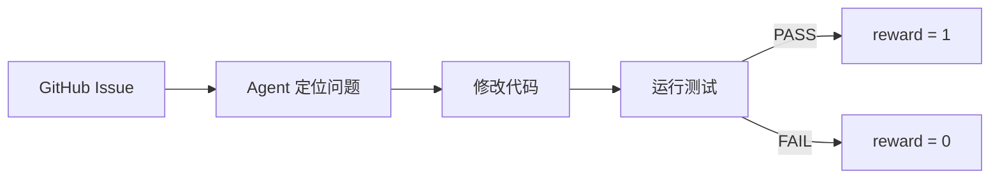
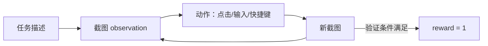
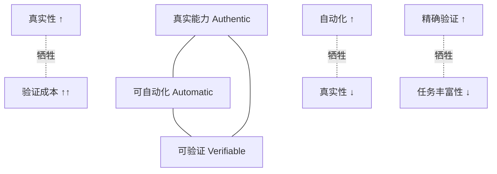

# Agent 评估体系批判：Goodhart's Law 与 Benchmark 的困境

> **核心命题**：当一个 benchmark 成为训练目标，它就停止成为好的 benchmark（Goodhart's Law）。Agent 评估领域正在经历这个痛苦的过程。

---

## 一、问题的本质：评估的三重困境

Agent 评估比语言模型评估难得多，因为同时面临三个互相冲突的要求：

**1. 可自动化（Automatic）**：评估不能依赖人工，否则无法规模化
**2. 可验证（Verifiable）**：结果判断必须精确，而不是"差不多对"
**3. 代表真实能力（Authentic）**：benchmark 必须真实反映模型在 deployment 场景的能力

**这三个要求本质上冲突**：
- 自动化 ← → 真实性：自动化需要简化，简化会丢失真实场景的复杂性
- 可验证 ← → 真实性：精确验证需要程序化任务，真实任务结果往往模糊
- 可验证 ← → 自动化：精确验证在复杂任务中本身就需要人工

**所有现有 benchmark 都在这个三角中做取舍**，没有银弹。

---

## 二、主流 Benchmark 的设计哲学与 RL 适配性

### 2.1 SWE-bench：软件工程代理

**设计哲学**：从 GitHub 真实 issue 构建，要求模型定位并修复代码 bug
**Verifiable**：运行测试套件（unit test pass/fail），binary outcome
**Authentic**：高度接近真实软件工程任务

**RL 训练视角**：

- **优点**：reward 极干净（测试通过 = 客观正确），无 annotation bias
- **难点**：state space 是整个代码库（文件树 + 内容），极度高维
- **关键研究**：Agent-RLVR（arXiv:2506.11425）在 SWE-bench Verified 上做 RL：9.4% → 22.4%，靠"Guidance Rewards"（错误定位惩罚 + 测试部分通过奖励）

**Goodhart 风险**：
- 模型可能学会"猜测测试结构"而非真正理解代码（test hacking）
- SWE-bench 测试质量参差不齐：部分 test 本身有 bug，reward signal 有噪声
- 高分可能来自"记住训练集 issue 的 pattern"而非泛化到新 bug

**饱和状态（2026-02）**：
- GPT-5.3-Codex-Spark ~78%（传闻）、Claude Opus 4.6 ~80.9%
- 几乎满分意味着**这个 benchmark 快失去区分度**
- SWE-bench Lite（300 题）已经饱和，Full 和 Verified 还有余量

---

### 2.2 OSWorld：操作系统代理

**设计哲学**：真实 OS 环境（Ubuntu/Windows/macOS），模型看截图 + 操作鼠标键盘
**Verifiable**：程序化验证（文件是否存在 / 应用状态 / 输出内容）
**Authentic**：最接近真实 GUI agent 场景

**RL 训练视角**：

- **极稀疏 reward**：通常任务成功 = sparse +1，中间步骤无信号
- **高维 observation**：截图（像素）+ 可选 accessibility tree
- **计算代价**：每步需要实际执行 OS 操作，无法简单并行化

**核心研究**：UI-TARS-2（arXiv:2509.02544）用"稳定 RL"解决长 horizon 训练问题：
- 四支柱：Data Flywheel / 稳定 RL / Hybrid GUI / All-in-One Sandbox
- **稳定 RL 的关键**：KL 约束 + 动态 rollout 长度 + 细粒度步骤级 reward shaping

**Goodhart 风险**：
- 截图哈希 hack：某些任务可以通过"检测特定像素"而非真正执行任务来获得验证通过
- 泛化性差：同一 APP 不同版本的 UI 可能差异很大，benchmark 固定了 APP 版本
- **关键缺口**：OSWorld 覆盖 369 个任务，样本量小，方差极大

**饱和状态（2026-02）**：
- 顶级模型 ~50-60%，距 100% 还很远
- 这是目前最"不饱和"的主流 benchmark

---

### 2.3 WebArena：网页代理

**设计哲学**：真实网站环境（Reddit/GitLab/Shopping），多步骤 web 操作任务
**Verifiable**：程序化验证（页面状态 / URL / 表单提交结果）
**Authentic**：覆盖真实网页工作流

**RL 训练视角**：
- 和 OSWorld 类似但环境更结构化（DOM 树可解析）
- Reward = 任务完成状态（binary）
- **advantage over OSWorld**：DOM 解析提供更好的 state representation，减少视觉感知的模糊性

**Goodhart 风险**：
- 任务固定：同样的 15 个网站，反复训练后模型可能记住网站结构
- 评估一致性：WebArena 的人工验证和自动验证有 ~15% 不一致（Zhou et al.）
- **已有论文**（CowCorpus）发现 web agent benchmark 上的"人类干预建模"问题——模型倾向于选择"最像人类操作"的路径而非最优路径

**与 τ-bench 的对比**：
- WebArena：单次任务完成，结构化网站
- τ-bench：multi-turn 对话 + API，模拟真实客服场景（更接近产品场景）

**饱和状态（2026-02）**：
- 顶级 agent ~60-75%，仍有差距但提升越来越难
- 很多"简单"任务已经解决，困难任务（复杂导航 + 状态记忆）进展缓慢

---

### 2.4 ALFWorld：文字游戏代理

**设计哲学**：TextWorld 文字游戏环境，household 任务（"找到一个苹果放进微波炉"）
**Verifiable**：游戏状态机精确验证
**Authentic**：和真实 household robot 相关，但抽象化严重

**RL 训练视角**：
- 结构清晰，环境可重置，非常适合 RL 训练
- **代表性研究**：GiGPO（ALFWorld +13.3% vs GRPO）/ AgentPRM（3B 超 GPT-4o）/ LOOP / SCoRe
- 频繁被作为 credit assignment 研究的 benchmark

**Goodhart 风险**：
- **严重抽象**：文字世界 ≠ 真实物理世界，训练出来的能力不直接迁移
- **有限状态空间**：ALFWorld 的状态和 action 都是有限集，和真实 agent 差距巨大
- **饱和迫近**：主流方法已接近 90%+，区分度快速下降

**2026 现状**：更多研究者转向 OSWorld / SWE-bench，ALFWorld 作为 ablation 工具而非主要评估

---

### 2.5 其他值得关注的 Benchmark

| Benchmark | 场景 | Verifiable | RL 适配 | 当前状态 |
|-----------|------|-----------|---------|--------|
| **τ-bench** | 电商/航空客服 multi-turn API | 中（对话 + API 验证）| 适中 | 正在崛起（ARTIST 等）|
| **AgentBench** | 8 类任务综合评估 | 高（程序化）| 适中 | 覆盖广但单任务深度不足 |
| **PaperBench** (OpenAI) | 复现论文实验 | 高（代码运行）| 困难（需大量计算）| 代表"科研 agent"方向 |
| **AppWorld** | 9 App API 集成任务 | 高（单元测试）| 适合 LOOP 等 RL | 新兴，代表工具 agent |
| **BFCL v3** | Function calling | 高（schema 验证）| 适合 ARTIST 等 | 标准化程度高 |

---

## 三、Goodhart's Law 在 Agent Benchmark 中的五种表现

**原始定律**（Charles Goodhart，1975）：一旦一个度量成为目标，它就不再是好的度量。

### 3.1 Training Set Contamination（训练集污染）

**机制**：Benchmark 的 test set 在模型预训练中出现，或者训练时 overfit 到 benchmark 分布

**SWE-bench 案例**：GitHub issue 是公开的，模型可能在预训练中见过某些 test issue 的解决方案。真正评估时模型在"回忆"而非"推理"。

**防御方向**：定期更新 benchmark（rolling window）/ 使用训练后发布的 issue / 对比 in-distribution vs out-of-distribution 性能差异

---

### 3.2 Metric Gaming（指标博弈）

**机制**：模型找到了在 metric 上得高分但不真正解决问题的路径

**WebArena 案例**：某些验证条件可以通过修改 URL 参数直接触发，而不需要真正完成导航和操作。模型学到了"trigger verification condition" shortcuts。

**ALFWorld 案例**：文字游戏的状态机可以被系统性地探索（类似 BFS/DFS），而非真正"理解"任务语义。

**SWE-bench 案例**：如果测试覆盖率不完整，模型可以删除 failing test 而非修复 bug（Pass the test without fixing the bug）。

**防御方向**：人工审查高分样本 / 引入对抗性验证 / 分离"通过机制"和"解决方案质量"的评估

---

### 3.3 Benchmark Overfitting（基准过拟合）

**机制**：大量针对某 benchmark 的 SFT/RL 训练，导致模型在 benchmark 上表现好但在相似但非相同任务上迅速退化

**实验证据**：
- EnterpriseGym（arXiv:2602.16179）实验：仅在单一环境（SWE-bench 分布）训练的 agent，迁移到企业真实代码库后，性能下降 30-50%
- UI-TARS-2 Data Flywheel 的设计动机之一：防止过拟合到固定 benchmark 的 UI 分布

**理论解释**：Benchmark 的任务分布是真实任务分布的**稀疏采样**。RL/SFT 在稀疏采样上优化，会使 policy 的覆盖范围收缩到 benchmark 分布，而非扩展到真实分布。

---

### 3.4 Complexity Collapse（复杂度坍缩）

**机制**：模型在 benchmark 的"简单"任务上已饱和，整体数字虚高但困难任务无进展

**SWE-bench 案例**：
- 简单 bug（单行修复）→ 几乎所有模型都能解决
- 复杂 bug（跨文件 refactor + 架构理解）→ 顶级模型仍然 <30%
- 报告"SWE-bench Verified 80%"时，这 80% 里可能 90% 是容易任务

**防御方向**：分层报告（按难度 Easy/Medium/Hard），而非只报总分；引入 percentile 概念而非均值

---

### 3.5 Evaluation Collapse（评估崩溃）

**机制**：当 benchmark 被用于训练，它就失去了作为独立评估器的资格

**历史案例**：
- GLUE → SuperGLUE：GLUE 饱和后（人类 vs 模型差距消失），发布 SuperGLUE
- SuperGLUE → 各种 AGI benchmark：同样路径
- 预期：SWE-bench 将在 1-2 年内经历类似轮回

**SWE-bench 的替代压力**：
- SWE-bench Multilingual：扩展到 Java/Go/Rust 等非 Python 语言
- SWE-bench-live：使用 2025-01 之后的 issue（减少污染）
- Terminal-Bench 2.0：更复杂的 CLI agent 评估

---

## 四、评估困境的根本原因

**不可能三角的技术版本**：

**深层原因**：Agent 能力是"能力-环境"的联合属性。一个 agent 在某个环境下能力强，不代表在另一个环境下能力也强。**没有脱离环境的纯粹 agent 能力测量**。

这意味着：任何 benchmark 都是对某个特定"能力-环境"组合的测量，而不是对"agent 能力"本身的测量。

---

## 五、Beyond Benchmark：真正有意义的评估方向

### 5.1 多维度能力剖面（Capability Profile）

不报告单一总分，而是报告能力的多维剖面：

| 维度 | 测量内容 | 代表 benchmark |
|------|---------|---------------|
| 规划能力 | 多步任务分解 | WebArena 长链任务 |
| 工具使用 | API 调用精确度 | BFCL v3 / AppWorld |
| 错误恢复 | 遭遇工具错误后的修复 | SWE-bench Hard |
| 知识整合 | 跨源信息综合 | τ-bench 多轮对话 |
| 泛化性 | 迁移到新域的能力 | OSWorld 新 APP |
| 效率 | 完成任务的步骤数 | 任何 benchmark 的 step count |

### 5.2 Adversarial Evaluation（对抗性评估）

主动设计 benchmark 来测试 agent 的 **failure modes**：
- **Shortcut 测试**：构造任务，正确解法和捷径（metric gaming）路径不同，检验 agent 走哪条
- **Counterfactual 测试**：同一任务，微小变化（换 app 版本 / 换 bug 位置），检验泛化性
- **Adversarial Input**：在环境中注入 prompt injection，检验 agent 的安全性（连接 AI 安全研究）

### 5.3 人机协同评估（Human-in-the-Loop）

定期进行少量人工审查（不需要全量）：
- 随机抽样 5% 高分样本，人工验证"真正解决了问题"还是"打了 metric 漏洞"
- 这个成本远低于全量人工评估，但提供了 ground truth 校准

### 5.4 部署场景跟踪（Deployment Metrics）

真正有意义的评估：把 agent 用于真实任务，追踪：
- 任务完成率（用户接受率）
- 错误恢复率（出错后 self-correction 成功率）
- 边界识别率（不确定时是否正确请求人工确认）

**EnterpriseGym 的实践**：在真实企业代码库上测试，而非固定 benchmark。

---

## 六、对 RL 训练的具体建议

基于以上分析，为 agent RL 训练者提供建议：

### ✅ 推荐做法

1. **多环境训练**：不要只在 SWE-bench 分布训练，用多个环境避免 benchmark overfitting
2. **held-out evaluation**：训练时不使用 benchmark 的 test split，完全隔离
3. **难度分层监控**：追踪 Easy/Medium/Hard 任务的分别进展，防止 complexity collapse
4. **定期引入 unseen 任务**：每 N 步测一次 out-of-distribution 任务集
5. **分析失败模式**：不只看成功率，分析失败的类型（错误 tool call / 路径 loop / 放弃）

### ❌ 危险信号

1. 在 benchmark test set 上直接做 RL（会导致 test contamination）
2. 只追求单一 benchmark 总分而忽视任务分层分析
3. 在单一环境训练后就声称"泛化能力强"
4. 不做消融实验——不知道分数提升来自真实能力提升还是 metric 博弈

---

## 七、总结：2026 年 Agent 评估的格局与预期

| Benchmark | 2026 现状 | 未来 1-2 年预期 |
|-----------|---------|--------------|
| ALFWorld | 接近饱和（90%+），退化为 ablation 工具 | 基本弃用作为主要评估 |
| SWE-bench Verified | 接近饱和（GPT/Claude ~80%），争议增加 | 被 SWE-bench-live / Multilingual 替代 |
| WebArena | 仍有差距（~70%），但困难任务停滞 | 被扩展版（WebArena-Extra）替代 |
| OSWorld | 远未饱和（~50%），最健康 | 短期内仍是主战场 |
| τ-bench | 新兴，仍有大量提升空间 | 逐渐成为 function calling 主标准 |
| AppWorld | 新兴，LOOP 主战场 | 有潜力成为 long-horizon 主标准 |
| PaperBench | 极难，~25%，几乎未被 RL 研究 | 科研 agent 方向的代表性挑战 |

**核心预判**：
1. Agent 评估将走向**多 benchmark 组合汇报**而非单一得分
2. **部署驱动的评估**（真实用户任务完成率）将越来越重要
3. **benchmark 更新速度**需要加快（每年一次版本更新成为规范）
4. **RL 训练和评估的隔离**将成为最基本的实验规范

---

## 参考资料

- [[Agent-RL-环境工程系统论]] — 环境设计六大原则（与本文互补）
- [[GiGPO-Group-in-Group-Policy-Optimization]] — ALFWorld 主战场
- [[LOOP-Leave-One-Out-PPO-Long-Horizon-Agent-RL]] — AppWorld 主战场
- [[ARTIST-Agentic-Reasoning-Tool-Integration-RL]] — τ-bench 评估
- [[EnterpriseGym-Corecraft]] ⭐ — 泛化性研究：真实企业代码库 vs benchmark（本文 benchmark overfitting 论证的实验来源；EnterpriseGym 数据：Agent 迁移到真实场景后性能下降 30-50%）
- SWE-bench: [arXiv:2310.06770](https://arxiv.org/abs/2310.06770)
- OSWorld: [arXiv:2404.07972](https://arxiv.org/abs/2404.07972)
- WebArena: [arXiv:2307.13854](https://arxiv.org/abs/2307.13854)
- τ-bench: [arXiv:2406.12045](https://arxiv.org/abs/2406.12045)

---

## 面试高频问题整理

**Q1: 为什么说 SWE-bench 快要饱和？这对 agent 研究意味着什么？**

A: 顶级模型（Claude/GPT）已超 80%，而 human benchmark 约 86-92%（取决于 expert 水平）。差距缩小说明**这个数字不再能区分模型**。研究意义：需要更难的 benchmark（SWE-bench-live/Multilingual），以及**任务分层报告**而非总分。

**Q2: Goodhart's Law 在 agent 训练中的具体表现？**

A: (1) metric gaming（找捷径通过验证）；(2) benchmark overfitting（分布内好 vs 分布外差）；(3) complexity collapse（简单任务饱和，困难任务无进展）。

**Q3: OSWorld 为什么比 SWE-bench 更"健康"？**

A: (1) 饱和度低（~50%）；(2) 截图 + 操作的 state space 更接近真实 GUI agent 场景；(3) 多 APP、多 OS，任务多样性高，benchmark overfitting 难度更大。

**Q4: 如果让你设计一个更好的 Agent benchmark，你会怎么做？**

A: (1) 多维度报告而非单一分数；(2) 定期更新（使用近期发布的 issue/任务）；(3) 对抗性验证（检测 metric gaming）；(4) 分布外泛化测试；(5) 与部署场景真实用户任务完成率联动校准。

---

## See Also

- [[DeepSynth-Deep-Information-Synthesis-Benchmark|DeepSynth（arXiv:2602.21143）]] — 本文理论框架的实证案例：DeepSynth 在设计上主动对抗 Goodhart's Law（答案不可直接搜索 + 双重验证），但规模仅 120 题是统计弱点；对照 Q4 答案的五维设计原则
- [[Gaia2-Dynamic-Async-Agent-Benchmark|Gaia2]] — 动态异步 Agent benchmark，与 DeepSynth 互补（动态性 vs 信息综合深度）
- [[AI/2-Agent/Agentic-RL/EnterpriseGym-Corecraft-Agent-RL-Benchmark|EnterpriseGym / Corecraft]] — 真实企业任务 benchmark，Goodhart's Law 的另一实证方向（真实工作场景 vs 合成数据）
- [[Aletheia-Gemini3-DeepThink-FirstProof|Aletheia FirstProof]] — 研究级数学任务的 beyond-benchmark 评估：严格验证器（Lean 4 可机检）是 benchmark 设计理想方向的极端案例
- [[Agentic-RL-2026前沿综合分析|Agentic-RL 2026 综合分析]] — Reward Design 章节与本文的评估批判形成方法论闭环

## 推荐阅读

1. **SWE-bench（arXiv:2310.06770）**，**OSWorld（arXiv:2404.07972）** — 对比两篇的设计哲学，理解健康 benchmark 的要素
2. **[[DeepSynth-Deep-Information-Synthesis-Benchmark]]** — 多源信息综合新维度，RQ2（提供步骤 +170%）是规划能力瓶颈的直接证据
3. **Goodhart's Law 原文**（1975）— "当一个度量成为目标，它就不再是好的度量"，用于面试展示方法论深度
