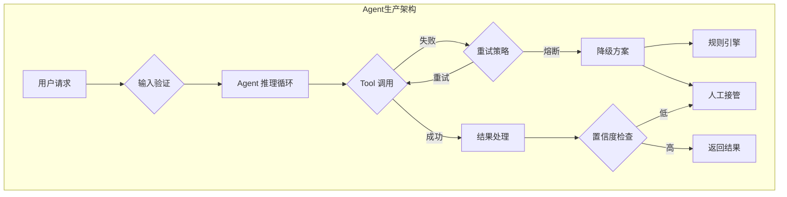

# Agent 生产落地经验

## 概述

> 参考：[Anthropic — Building Effective Agents](https://www.anthropic.com/research/building-effective-agents) ; [AgentBench](https://arxiv.org/abs/2308.03688) — 生产环境 Agent 可靠性评估框架

AI Agent 从原型演示到生产落地存在巨大鸿沟。生产环境中的 Agent 需要面对网络异常、API 限流、用户输入多样性等复杂挑战。本文基于实际项目经验，深入探讨错误处理、超时管理、可观测性建设、人机协作以及成本控制的最佳实践，为 Agent 系统的稳定运行提供全方位指导。

## 错误处理策略

### 错误分类与处理

**系统级错误**
- **网络异常**：API 调用失败、超时
- **资源不足**：内存溢出、磁盘空间
- **服务依赖**：数据库连接、第三方服务不可用

**业务级错误**
- **输入异常**：用户输入格式错误、恶意输入
- **逻辑错误**：推理链断裂、工具调用失败
- **数据异常**：缺失关键信息、数据格式不匹配

### 重试策略设计

**指数退避重试**
```python
import asyncio
import random
from typing import Callable, Any

class RetryConfig:
    def __init__(self):
        self.max_retries = 3
        self.base_delay = 1.0
        self.max_delay = 60.0
        self.backoff_factor = 2.0
        self.jitter = True

async def exponential_backoff_retry(
    func: Callable,
    config: RetryConfig,
    *args, **kwargs
) -> Any:
    """指数退避重试装饰器"""
    
    for attempt in range(config.max_retries + 1):
        try:
            return await func(*args, **kwargs)
        
        except Exception as e:
            if attempt == config.max_retries:
                raise e
            
            # 计算延迟时间
            delay = min(
                config.base_delay * (config.backoff_factor ** attempt),
                config.max_delay
            )
            
            # 添加抖动避免雷群效应
            if config.jitter:
                delay *= (0.5 + random.random() * 0.5)
            
            logger.warning(f"Attempt {attempt + 1} failed: {e}, retrying in {delay:.2f}s")
            await asyncio.sleep(delay)
```

**智能重试策略**
```python
class SmartRetryHandler:
    def __init__(self):
        self.retry_configs = {
            # 网络错误：快速重试
            "ConnectionError": RetryConfig(max_retries=5, base_delay=0.5),
            # 限流错误：慢重试
            "RateLimitError": RetryConfig(max_retries=3, base_delay=10.0),
            # 服务不可用：中等重试
            "ServiceUnavailable": RetryConfig(max_retries=4, base_delay=2.0),
            # 认证错误：不重试
            "AuthenticationError": RetryConfig(max_retries=0)
        }
    
    def should_retry(self, error: Exception) -> bool:
        """判断是否应该重试"""
        error_type = type(error).__name__
        config = self.retry_configs.get(error_type)
        return config and config.max_retries > 0
    
    async def execute_with_retry(self, func, *args, **kwargs):
        """智能重试执行"""
        try:
            return await func(*args, **kwargs)
        except Exception as e:
            if self.should_retry(e):
                error_type = type(e).__name__
                config = self.retry_configs[error_type]
                return await exponential_backoff_retry(func, config, *args, **kwargs)
            else:
                raise e
```

### 降级方案

**功能降级**
```python
class AgentFallbackHandler:
    def __init__(self):
        self.fallback_chain = [
            self.primary_model,      # 主模型
            self.backup_model,       # 备用模型  
            self.rule_based_handler, # 规则引擎
            self.human_handoff       # 人工接管
        ]
    
    async def process_with_fallback(self, request):
        """带降级的请求处理"""
        last_error = None
        
        for handler in self.fallback_chain:
            try:
                result = await handler(request)
                if self.is_valid_result(result):
                    return result
                    
            except Exception as e:
                logger.warning(f"Handler {handler.__name__} failed: {e}")
                last_error = e
                continue
        
        # 所有降级方案都失败
        raise Exception(f"All fallback handlers failed. Last error: {last_error}")
    
    def is_valid_result(self, result):
        """结果质量检查"""
        if not result or len(result.strip()) < 10:
            return False
        if "I don't know" in result or "error" in result.lower():
            return False
        return True
```

**熔断机制**
```python
import time
from enum import Enum

class CircuitState(Enum):
    CLOSED = "closed"      # 正常状态
    OPEN = "open"          # 熔断状态
    HALF_OPEN = "half_open"  # 半开状态

class CircuitBreaker:
    def __init__(self, failure_threshold=5, timeout=60):
        self.failure_threshold = failure_threshold
        self.timeout = timeout
        self.failure_count = 0
        self.last_failure_time = None
        self.state = CircuitState.CLOSED
    
    async def call(self, func, *args, **kwargs):
        """熔断器包装的函数调用"""
        
        if self.state == CircuitState.OPEN:
            if time.time() - self.last_failure_time > self.timeout:
                self.state = CircuitState.HALF_OPEN
                self.failure_count = 0
            else:
                raise Exception("Circuit breaker is OPEN")
        
        try:
            result = await func(*args, **kwargs)
            
            # 成功时重置计数
            if self.state == CircuitState.HALF_OPEN:
                self.state = CircuitState.CLOSED
            self.failure_count = 0
            
            return result
            
        except Exception as e:
            self.failure_count += 1
            self.last_failure_time = time.time()
            
            if self.failure_count >= self.failure_threshold:
                self.state = CircuitState.OPEN
                logger.error(f"Circuit breaker opened due to {self.failure_count} failures")
            
            raise e
```

## 超时管理

### 多层超时设计

**请求级超时架构**
```python
import asyncio
from contextlib import asynccontextmanager

class TimeoutManager:
    def __init__(self):
        self.default_timeouts = {
            "llm_call": 30.0,      # LLM API 调用
            "tool_execution": 60.0, # 工具执行
            "total_request": 300.0, # 总请求时间
            "user_input": 600.0     # 用户输入等待
        }
    
    @asynccontextmanager
    async def timeout_context(self, timeout_type: str, custom_timeout=None):
        """超时上下文管理器"""
        timeout = custom_timeout or self.default_timeouts.get(timeout_type, 30.0)
        
        try:
            async with asyncio.timeout(timeout):
                yield
        except asyncio.TimeoutError:
            logger.warning(f"{timeout_type} timed out after {timeout}s")
            raise TimeoutError(f"{timeout_type} timeout ({timeout}s)")

# 使用示例
timeout_mgr = TimeoutManager()

async def call_llm_with_timeout(prompt):
    async with timeout_mgr.timeout_context("llm_call"):
        return await llm_client.chat(prompt)
```

### 分段超时策略

**复杂任务分解**
```python
class StepwiseTimeoutHandler:
    def __init__(self):
        self.step_timeouts = {
            "planning": 15.0,       # 计划生成
            "tool_search": 10.0,    # 工具搜索
            "tool_execution": 45.0, # 工具执行
            "response_generation": 20.0  # 响应生成
        }
    
    async def execute_with_step_timeouts(self, agent_workflow):
        """分步骤执行，每步独立超时"""
        results = {}
        
        for step_name, step_func in agent_workflow.items():
            timeout = self.step_timeouts.get(step_name, 30.0)
            
            try:
                async with asyncio.timeout(timeout):
                    results[step_name] = await step_func(results)
                    logger.info(f"Step {step_name} completed")
                    
            except asyncio.TimeoutError:
                logger.error(f"Step {step_name} timed out after {timeout}s")
                # 可以选择继续下一步或直接失败
                if step_name in ["planning", "response_generation"]:
                    raise  # 关键步骤失败则整体失败
                else:
                    results[step_name] = None  # 非关键步骤可以跳过
        
        return results
```

### 自适应超时

**动态调整策略**
```python
class AdaptiveTimeout:
    def __init__(self):
        self.timeout_history = {}
        self.base_timeout = 30.0
        self.min_timeout = 10.0
        self.max_timeout = 120.0
    
    def get_adaptive_timeout(self, operation_type: str) -> float:
        """基于历史数据动态调整超时时间"""
        history = self.timeout_history.get(operation_type, [])
        
        if len(history) < 5:
            return self.base_timeout
        
        # 使用 P95 作为超时基准
        p95_duration = sorted(history)[-max(1, len(history) // 20)]
        
        # 添加 50% 缓冲
        adaptive_timeout = p95_duration * 1.5
        
        # 限制在合理范围内
        return max(self.min_timeout, 
                  min(self.max_timeout, adaptive_timeout))
    
    def record_duration(self, operation_type: str, duration: float):
        """记录操作耗时"""
        if operation_type not in self.timeout_history:
            self.timeout_history[operation_type] = []
        
        # 保留最近 100 次记录
        history = self.timeout_history[operation_type]
        history.append(duration)
        if len(history) > 100:
            history.pop(0)
```

## 可观测性建设

### 分布式链路追踪

**OpenTelemetry 集成**

> 来源：[OpenTelemetry 官方文档](https://opentelemetry.io/docs/) — 分布式可观测性标准

```python
from opentelemetry import trace
from opentelemetry.exporter.jaeger.thrift import JaegerExporter
from opentelemetry.sdk.trace import TracerProvider
from opentelemetry.sdk.trace.export import BatchSpanProcessor

class AgentTracer:
    def __init__(self):
        # 初始化 tracer
        trace.set_tracer_provider(TracerProvider())
        tracer = trace.get_tracer(__name__)
        
        # 配置 Jaeger 导出
        jaeger_exporter = JaegerExporter(
            agent_host_name="localhost",
            agent_port=14268,
        )
        
        span_processor = BatchSpanProcessor(jaeger_exporter)
        trace.get_tracer_provider().add_span_processor(span_processor)
        
        self.tracer = tracer
    
    def trace_agent_execution(self, session_id: str):
        """Agent 执行链路追踪"""
        def decorator(func):
            async def wrapper(*args, **kwargs):
                with self.tracer.start_as_current_span(
                    func.__name__,
                    attributes={
                        "session_id": session_id,
                        "operation": func.__name__
                    }
                ) as span:
                    try:
                        result = await func(*args, **kwargs)
                        span.set_attribute("success", True)
                        span.set_attribute("result_length", len(str(result)))
                        return result
                    except Exception as e:
                        span.set_attribute("success", False)
                        span.set_attribute("error", str(e))
                        raise
            return wrapper
        return decorator
```

**LangSmith 集成**
```python
from langsmith import Client as LangSmithClient
from langsmith.run_helpers import traceable

class LangSmithIntegration:
    def __init__(self, api_key: str, project_name: str):
        self.client = LangSmithClient(api_key=api_key)
        self.project_name = project_name
    
    @traceable(run_type="chain", project_name="agent-production")
    async def trace_agent_workflow(self, user_input: str, session_id: str):
        """完整 Agent 工作流追踪"""
        
        # 计划阶段
        plan = await self.trace_planning(user_input)
        
        # 执行阶段
        execution_results = []
        for step in plan.steps:
            result = await self.trace_step_execution(step)
            execution_results.append(result)
        
        # 响应生成
        response = await self.trace_response_generation(execution_results)
        
        return {
            "response": response,
            "plan": plan,
            "execution_results": execution_results,
            "session_id": session_id
        }
    
    @traceable(run_type="llm", project_name="agent-production")
    async def trace_planning(self, user_input: str):
        """计划生成追踪"""
        # LLM 调用会自动被 LangSmith 追踪
        return await planning_llm.generate(user_input)
```

### 结构化日志

**日志标准化**
```python
import logging
import json
from datetime import datetime
from typing import Dict, Any

class AgentLogger:
    def __init__(self):
        self.logger = logging.getLogger("agent")
        self.logger.setLevel(logging.INFO)
        
        # JSON 格式化器
        formatter = logging.Formatter(
            '%(asctime)s - %(name)s - %(levelname)s - %(message)s'
        )
        
        handler = logging.StreamHandler()
        handler.setFormatter(formatter)
        self.logger.addHandler(handler)
    
    def log_agent_event(self, event_type: str, session_id: str, 
                       data: Dict[str, Any], level: str = "info"):
        """结构化 Agent 事件日志"""
        
        log_entry = {
            "timestamp": datetime.utcnow().isoformat(),
            "event_type": event_type,
            "session_id": session_id,
            "data": data
        }
        
        log_message = json.dumps(log_entry, ensure_ascii=False)
        
        if level == "error":
            self.logger.error(log_message)
        elif level == "warning":
            self.logger.warning(log_message)
        else:
            self.logger.info(log_message)

# 使用示例
logger = AgentLogger()

async def agent_step_with_logging(step_name: str, session_id: str):
    start_time = time.time()
    
    try:
        result = await execute_step(step_name)
        
        logger.log_agent_event("step_completed", session_id, {
            "step_name": step_name,
            "duration": time.time() - start_time,
            "success": True,
            "result_summary": result[:100]
        })
        
        return result
        
    except Exception as e:
        logger.log_agent_event("step_failed", session_id, {
            "step_name": step_name,
            "duration": time.time() - start_time,
            "success": False,
            "error": str(e)
        }, level="error")
        raise
```

### 性能监控

**关键指标追踪**
```python
import time
import psutil
from prometheus_client import Counter, Histogram, Gauge

class AgentMetrics:
    def __init__(self):
        # 计数器
        self.request_total = Counter(
            'agent_requests_total',
            'Total agent requests',
            ['session_type', 'success']
        )
        
        # 响应时间分布
        self.response_time = Histogram(
            'agent_response_seconds',
            'Agent response time',
            ['operation_type']
        )
        
        # 当前状态
        self.active_sessions = Gauge(
            'agent_active_sessions',
            'Number of active sessions'
        )
        
        self.memory_usage = Gauge(
            'agent_memory_usage_bytes',
            'Memory usage in bytes'
        )
    
    def track_request(self, session_type: str, success: bool):
        """追踪请求数量"""
        self.request_total.labels(
            session_type=session_type,
            success=str(success).lower()
        ).inc()
    
    def track_response_time(self, operation: str, duration: float):
        """追踪响应时间"""
        self.response_time.labels(operation_type=operation).observe(duration)
    
    def update_system_metrics(self):
        """更新系统指标"""
        process = psutil.Process()
        self.memory_usage.set(process.memory_info().rss)
```

## 人机协作模式

### Human-in-the-loop 设计

**协作触发机制**
```python
class HumanLoopHandler:
    def __init__(self):
        self.escalation_rules = {
            "low_confidence": 0.7,     # 置信度阈值
            "sensitive_operation": ["delete", "modify", "send"],
            "high_value_decision": 1000,  # 金额阈值
            "error_retry_limit": 3
        }
    
    def should_escalate(self, context: dict) -> tuple[bool, str]:
        """判断是否需要人工介入"""
        
        # 低置信度检查
        if context.get("confidence", 1.0) < self.escalation_rules["low_confidence"]:
            return True, "low_confidence"
        
        # 敏感操作检查
        operation = context.get("operation", "").lower()
        if any(sensitive in operation for sensitive in self.escalation_rules["sensitive_operation"]):
            return True, "sensitive_operation"
        
        # 高价值决策检查
        value = context.get("value", 0)
        if value > self.escalation_rules["high_value_decision"]:
            return True, "high_value_decision"
        
        # 错误重试次数检查
        retry_count = context.get("retry_count", 0)
        if retry_count >= self.escalation_rules["error_retry_limit"]:
            return True, "max_retries_exceeded"
        
        return False, ""
    
    async def request_human_input(self, context: dict, reason: str):
        """请求人工输入"""
        request_data = {
            "session_id": context["session_id"],
            "reason": reason,
            "context": context,
            "timestamp": datetime.utcnow().isoformat(),
            "priority": self.get_priority(reason)
        }
        
        # 发送到人工审核队列
        await self.send_to_human_queue(request_data)
        
        # 等待人工响应
        return await self.wait_for_human_response(context["session_id"])
    
    def get_priority(self, reason: str) -> str:
        """根据原因确定优先级"""
        priority_map = {
            "low_confidence": "medium",
            "sensitive_operation": "high", 
            "high_value_decision": "high",
            "max_retries_exceeded": "low"
        }
        return priority_map.get(reason, "medium")
```

**协作界面设计**
```python
class HumanCollaborationUI:
    def __init__(self):
        self.pending_requests = {}
        self.ui_components = {
            "context_display": self.render_context,
            "action_selector": self.render_actions,
            "feedback_input": self.render_feedback
        }
    
    def render_collaboration_request(self, request_data: dict):
        """渲染人工协作请求界面"""
        return {
            "title": f"Human Input Required: {request_data['reason']}",
            "context": {
                "session_id": request_data["session_id"],
                "user_query": request_data["context"]["user_input"],
                "agent_analysis": request_data["context"]["agent_analysis"],
                "confidence_score": request_data["context"]["confidence"],
                "suggested_actions": request_data["context"]["suggestions"]
            },
            "actions": [
                {"type": "approve", "label": "Approve Agent Action"},
                {"type": "modify", "label": "Modify and Continue"},
                {"type": "takeover", "label": "Take Over Manually"},
                {"type": "escalate", "label": "Escalate to Expert"}
            ],
            "feedback_form": {
                "fields": [
                    {"name": "comments", "type": "textarea", "required": False},
                    {"name": "confidence", "type": "slider", "min": 0, "max": 100}
                ]
            }
        }
```

## 成本控制策略

### Token 预算管理

**预算分配**
```python
class TokenBudgetManager:
    def __init__(self):
        self.budgets = {
            "daily_limit": 100000,      # 每日总预算
            "session_limit": 5000,      # 单会话预算
            "operation_limits": {
                "planning": 1000,       # 计划生成
                "tool_calls": 2000,     # 工具调用
                "response": 1500,       # 响应生成
                "reflection": 500       # 反思优化
            }
        }
        
        self.usage_tracker = {
            "daily_used": 0,
            "session_usage": {},
            "operation_usage": {}
        }
    
    def check_budget(self, operation: str, estimated_tokens: int, 
                    session_id: str) -> bool:
        """检查是否有足够预算"""
        
        # 检查日预算
        if self.usage_tracker["daily_used"] + estimated_tokens > self.budgets["daily_limit"]:
            return False
        
        # 检查会话预算
        session_used = self.usage_tracker["session_usage"].get(session_id, 0)
        if session_used + estimated_tokens > self.budgets["session_limit"]:
            return False
        
        # 检查操作预算
        operation_limit = self.budgets["operation_limits"].get(operation, 1000)
        if estimated_tokens > operation_limit:
            return False
        
        return True
    
    def consume_budget(self, operation: str, actual_tokens: int, 
                      session_id: str):
        """消费预算"""
        self.usage_tracker["daily_used"] += actual_tokens
        
        if session_id not in self.usage_tracker["session_usage"]:
            self.usage_tracker["session_usage"][session_id] = 0
        self.usage_tracker["session_usage"][session_id] += actual_tokens
        
        if operation not in self.usage_tracker["operation_usage"]:
            self.usage_tracker["operation_usage"][operation] = 0
        self.usage_tracker["operation_usage"][operation] += actual_tokens
```

### 缓存策略

**多层缓存设计**
```python
import hashlib
import json
from typing import Optional, Any

class AgentCacheManager:
    def __init__(self):
        self.memory_cache = {}  # 内存缓存
        self.redis_client = redis.Redis()  # 分布式缓存
        
        self.cache_policies = {
            "llm_responses": {
                "ttl": 3600,  # 1小时
                "max_size": 1000
            },
            "tool_results": {
                "ttl": 1800,  # 30分钟
                "max_size": 500
            },
            "user_profiles": {
                "ttl": 86400,  # 24小时
                "max_size": 100
            }
        }
    
    def generate_cache_key(self, cache_type: str, content: Any) -> str:
        """生成缓存键"""
        content_str = json.dumps(content, sort_keys=True, ensure_ascii=False)
        content_hash = hashlib.md5(content_str.encode()).hexdigest()
        return f"{cache_type}:{content_hash}"
    
    async def get_cached_response(self, cache_type: str, 
                                content: Any) -> Optional[Any]:
        """获取缓存响应"""
        cache_key = self.generate_cache_key(cache_type, content)
        
        # 先检查内存缓存
        if cache_key in self.memory_cache:
            return self.memory_cache[cache_key]
        
        # 再检查 Redis 缓存
        cached_data = await self.redis_client.get(cache_key)
        if cached_data:
            result = json.loads(cached_data)
            # 回填内存缓存
            self.memory_cache[cache_key] = result
            return result
        
        return None
    
    async def cache_response(self, cache_type: str, content: Any, 
                           response: Any):
        """缓存响应"""
        cache_key = self.generate_cache_key(cache_type, content)
        policy = self.cache_policies.get(cache_type, {})
        
        # 更新内存缓存
        self.memory_cache[cache_key] = response
        self._trim_memory_cache(cache_type)
        
        # 更新 Redis 缓存
        await self.redis_client.setex(
            cache_key,
            policy.get("ttl", 3600),
            json.dumps(response, ensure_ascii=False)
        )
```

### 成本监控告警

**成本监控仪表板**
```python
class CostMonitor:
    def __init__(self):
        self.cost_config = {
            "gpt-4": {"input": 0.03, "output": 0.06},   # per 1K tokens
            "gpt-3.5": {"input": 0.001, "output": 0.002},
            "claude-3": {"input": 0.015, "output": 0.075}
        }
        
        self.alerts = {
            "daily_budget": {"threshold": 100, "current": 0},
            "session_spike": {"threshold": 10, "lookback": "1h"},
            "error_rate": {"threshold": 0.1, "lookback": "5m"}
        }
    
    def calculate_cost(self, model: str, input_tokens: int, 
                      output_tokens: int) -> float:
        """计算单次调用成本"""
        if model not in self.cost_config:
            return 0.0
        
        config = self.cost_config[model]
        input_cost = (input_tokens / 1000) * config["input"]
        output_cost = (output_tokens / 1000) * config["output"]
        
        return input_cost + output_cost
    
    def check_cost_alerts(self) -> list:
        """检查成本告警"""
        alerts = []
        
        # 检查日预算
        if self.alerts["daily_budget"]["current"] > self.alerts["daily_budget"]["threshold"]:
            alerts.append({
                "type": "budget_exceeded",
                "message": f"Daily budget exceeded: ${self.alerts['daily_budget']['current']:.2f}"
            })
        
        return alerts
```

## 面试常见问题

### Q1: Agent 生产环境中最常见的问题是什么？

**答案要点：**
- **网络异常**：API 调用失败、超时，需要完善的重试机制
- **成本控制**：Token 消费失控，需要预算管理和缓存优化
- **质量稳定性**：输出不一致，需要置信度评估和人工兜底
- **并发处理**：高并发时的资源争抢和性能下降

### Q2: 如何设计 Agent 的错误处理策略？

**答案要点：**
- **分类处理**：系统错误 vs 业务错误，不同的重试策略
- **指数退避**：避免雷群效应，加入抖动机制
- **熔断降级**：服务不可用时快速失败，避免级联故障
- **兜底方案**：规则引擎 → 人工接管的多层降级

### Q3: Agent 的可观测性如何建设？

**答案要点：**
- **链路追踪**：完整的执行流程追踪，问题快速定位
- **结构化日志**：统一格式，便于搜索和分析
- **性能监控**：响应时间、成功率、资源使用等关键指标
- **业务监控**：用户满意度、任务完成率等业务指标

### Q4: 何时引入人工介入（Human-in-the-loop）？

**答案要点：**
- **低置信度**：Agent 对结果不确定时
- **敏感操作**：涉及删除、修改、发送等关键操作
- **高价值决策**：超过一定金额或影响范围的决策
- **异常情况**：多次重试失败或出现未知错误

### Q5: Agent 系统的成本如何控制？

**答案要点：**
- **预算管理**：日/周/月预算限制，超预算自动停止
- **智能缓存**：结果缓存、语义缓存减少重复调用
- **模型选择**：根据任务复杂度选择合适规模的模型
- **监控告警**：实时监控成本异常，及时介入处理

---

## 📚 推荐阅读

### 原始论文 / 文档
- [Building Effective Agents — Anthropic](https://www.anthropic.com/research/building-effective-agents) — 生产 Agent 设计的最权威工程指南 ⭐⭐⭐⭐⭐
- [AgentBench: Evaluating LLMs as Agents](https://arxiv.org/abs/2308.03688) — Liu et al., 8 个维度评估 Agent 可靠性
- [LangGraph Documentation](https://langchain-ai.github.io/langgraph/) — 有状态 Agent 工作流的生产级框架 ⭐⭐⭐⭐
- [Practices for Governing Agentic AI Systems — OpenAI](https://cdn.openai.com/papers/practices-for-governing-agentic-ai-systems.pdf) — Agent 治理与安全的实践指南

### 深度解读
- [OpenTelemetry for LLM Observability](https://opentelemetry.io/blog/2024/llm-observability/) — LLM 应用可观测性最佳实践 ⭐⭐⭐⭐
- [LangSmith Cookbook](https://docs.smith.langchain.com/cookbook) — Agent 追踪与调试的实战案例集 ⭐⭐⭐

### 实践资源
- [LangGraph](https://github.com/langchain-ai/langgraph) — 基于图的 Agent 工作流框架，原生支持持久化/中断/恢复
- [CrewAI](https://github.com/joaomdmoura/crewAI) — 多 Agent 协作框架，内置角色分工与任务编排
- [Prometheus + Grafana Agent 监控模板](https://grafana.com/) — 开箱即用的 Agent 性能监控仪表板

---

## 🔧 落地应用

### 直接可用场景
- **API 密集型 Agent**：使用本文的指数退避重试 + 熔断机制（CircuitBreaker）处理 LLM API 的限流和不稳定
- **企业客服 Agent**：Human-in-the-loop 设计（低置信度/敏感操作自动升级人工），成本控制用 Token 预算管理
- **长时任务 Agent**：分段超时策略（StepwiseTimeoutHandler）+ 自适应超时（P95 历史数据动态调整）

### 工程实现要点
- **重试策略黄金法则**：网络错误 → 快重试（0.5s base, 5 retries）；限流 → 慢重试（10s base, 3 retries）；认证错误 → 不重试
- **成本控制核心公式**：

$$C_{total} = \sum_{i=1}^{N} \frac{T_{input}^{(i)}}{1000} \cdot P_{input} + \frac{T_{output}^{(i)}}{1000} \cdot P_{output}$$

其中 $T$ 是 token 数，$P$ 是每千 token 价格。日预算上限 + 会话预算 + 操作预算三层控制

- **可观测性三支柱**：Traces（链路追踪，每步骤耗时+参数）+ Metrics（QPS/延迟/成功率）+ Logs（结构化 JSON，含 session_id）

### 面试高频问法
- Q: Agent 生产环境最常见的问题？
  A: 网络异常（重试+熔断）、成本失控（预算管理+缓存）、质量不稳定（置信度评估+人工兜底）、并发性能（连接池+限流）
- Q: 何时引入 Human-in-the-loop？
  A: 低置信度(<0.7) / 敏感操作(delete/send/pay) / 高价值决策(>阈值金额) / 多次重试失败

---

## 💡 启发与思考

### So What？对老板意味着什么
- **Agent 可靠性 = 系统工程，不是模型能力**：最强的 GPT-4 也需要重试/熔断/降级/监控，生产 Agent 的核心竞争力在工程体系而非模型选型
- **成本控制是 Agent 规模化的关键瓶颈**：Token 消费随 Agent 复杂度指数增长，智能缓存（语义缓存）+ 模型路由（简单任务用小模型）是必备能力

### 未解问题与局限
- **端到端延迟优化**：多 tool 调用场景下，总延迟 = Σ(LLM推理 + tool执行) 可能超过用户容忍阈值（通常 <30s），流式输出+并行 tool 调用是方向但实现复杂
- **Agent 状态持久化**：长时 Agent 的中间状态如何安全存储和恢复？LangGraph 的 checkpointing 是当前最佳实践但仍有序列化限制
- **多 Agent 协作的可观测性**：当多个 Agent 并行执行，trace 的因果关系和时序对齐变得极为复杂

### 脑暴：如果往下延伸
- 将本文的熔断降级模式与 [[AI/2-Agent/Fundamentals/ReAct 与 CoT|ReAct]] 的 Reflexion 结合：Agent 在熔断后不只是降级到规则引擎，而是基于失败原因反思并自动切换推理策略
- Token 预算管理 + [[AI/3-LLM/Application/幻觉问题|幻觉检测]]：预算紧张时 Agent 倾向于生成更短回答 → 可能增加幻觉率。需要在成本和质量之间建立动态平衡机制
- 6 个月预判：Agent 可观测性将从"自建"走向"标准化"，OpenTelemetry 的 LLM 语义约定将成为行业标准



---

## 相关概念

- [[AI/2-Agent/Fundamentals/ReAct 与 CoT|ReAct 与 CoT]] — Agent 推理模式的理论基础
- [[AI/2-Agent/Fundamentals/Tool Use|Tool Use]] — 工具调用安全与最佳实践
- AI Agent 技术全景 — Agent 生产架构在全景中的位置
- AI 安全与对齐 — Agent 安全防护的完整框架
- [[AI/3-LLM/Application/幻觉问题|幻觉问题]] — Agent 输出可靠性的核心挑战