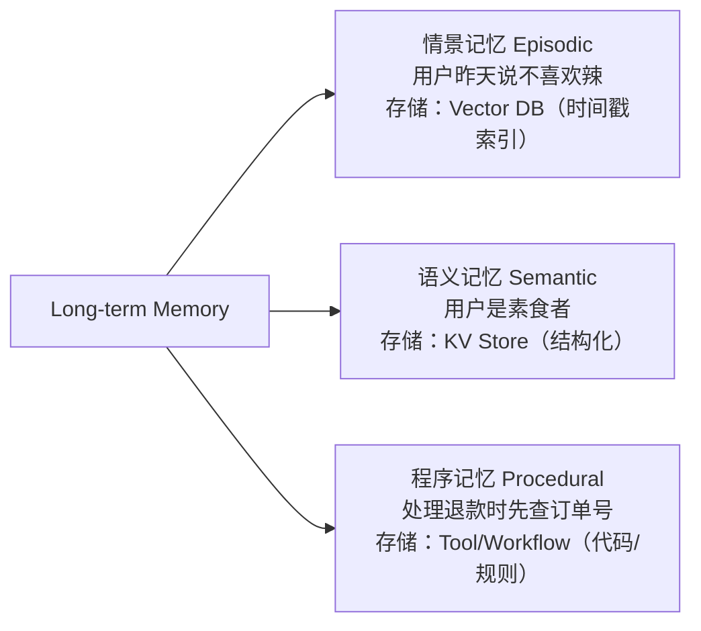
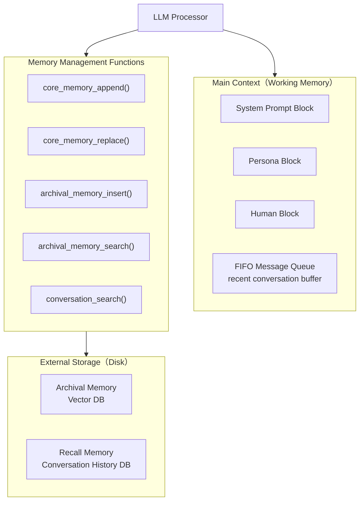

# Agent Memory 机制

> LLM Agent 的核心瓶颈不是推理，而是记忆。Context Window 有限、对话会被截断、用户偏好会遗忘——Memory 系统是让 Agent 从"无状态函数"进化为"有状态个体"的关键。

## 1. 记忆的三层分类

借鉴认知科学，Agent Memory 可分为三类：

| 记忆类型 | 类比 | Agent 实现 | 生命周期 |
|---------|------|-----------|---------|
| **感觉记忆 (Sensory)** | 视觉/听觉暂留 | 当前 turn 的输入 tokens | 毫秒级 |
| **短期/工作记忆 (Working)** | 心算时的暂存 | Context Window 中的对话历史 + scratchpad | 单次会话 |
| **长期记忆 (Long-term)** | 海马体 → 皮层固化 | 外部存储（向量数据库、KV store、图数据库） | 跨会话持久 |

### 1.1 工作记忆 (Working Memory)

工作记忆 = Context Window 中当前可访问的信息：

- **系统提示词**：角色设定、工具描述、约束规则
- **对话历史**：最近 N 轮 user/assistant 消息
- **Scratchpad**：中间推理步骤（ReAct 的 Thought/Action/Observation）
- **检索结果**：从长期记忆中 recall 回来的片段

关键限制：即使 200K context，放入过多信息会导致 **Lost in the Middle** 问题——模型对中间位置信息的注意力显著下降。

### 1.2 长期记忆的存储形式



- **情景记忆 (Episodic)**：具体事件和对话片段，带时间戳，用于"回忆过去发生了什么"
- **语义记忆 (Semantic)**：从多次交互中提炼的事实和偏好，如"用户偏好简洁回复"
- **程序记忆 (Procedural)**：学到的操作流程和技能，如工具调用的最佳实践

## 2. RAG-based Memory

最主流的长期记忆实现——将历史信息存入向量数据库，查询时检索相关片段注入 Context：

```python
from langchain.memory import VectorStoreRetrieverMemory
from langchain_openai import OpenAIEmbeddings
from langchain_community.vectorstores import Chroma

# 1. 创建向量存储
vectorstore = Chroma(
    collection_name="agent_memory",
    embedding_function=OpenAIEmbeddings()
)

# 2. 包装为 Memory
memory = VectorStoreRetrieverMemory(
    retriever=vectorstore.as_retriever(search_kwargs={"k": 5}),
    memory_key="relevant_history",
    input_key="input"
)

# 3. 存储交互
memory.save_context(
    {"input": "我对花生过敏"},
    {"output": "好的，我已记录您的花生过敏信息，后续推荐会避开花生成分。"}
)

# 4. 检索相关记忆
relevant = memory.load_memory_variables({"input": "帮我推荐一道菜"})
# → 自动检索出"用户对花生过敏"这条记忆
```

### RAG Memory 的关键设计决策

| 决策点 | 选项 | 权衡 |
|--------|------|------|
| **存什么** | 原始对话 vs 摘要 vs 实体提取 | 原始保留细节但冗余；摘要节省空间但可能丢信息 |
| **何时存** | 每轮 vs 会话结束 vs 触发式 | 实时存有延迟成本；批量存可能丢失中途信息 |
| **怎么检索** | 语义相似 vs 时间衰减 vs 重要性加权 | 纯语义可能忽略时效性；混合策略更鲁棒 |
| **检索多少** | Top-K 固定 vs 动态 | 太多塞满 context；太少漏关键信息 |

## 3. MemGPT / Letta：操作系统式记忆管理

MemGPT（现已发展为 Letta 框架，暂无独立笔记）的核心洞察：**把 LLM 当 CPU，Context Window 当 RAM，外部存储当 Disk——让 LLM 自己管理内存的分页调度**。

### 3.1 架构设计



### 3.2 核心机制

1. **自主内存编辑**：LLM 通过 function calling 主动决定何时读写内存
2. **分层存储**：Core Memory（常驻 context）→ Archival Memory（长期向量存储）→ Recall Memory（对话历史）
3. **Heartbeat 机制**：Agent 可以连续调用多个内存函数而不需要用户输入，通过 `request_heartbeat` 实现多步内存操作

```python
# Letta (MemGPT v2) 的使用示例
from letta import create_client

client = create_client()

# 创建带记忆的 Agent
agent = client.create_agent(
    name="memory_agent",
    memory_blocks=[
        {"label": "human", "value": "Name: Unknown\nPreferences: Unknown"},
        {"label": "persona", "value": "I am a helpful assistant with persistent memory."}
    ],
    tools=["archival_memory_insert", "archival_memory_search"]
)

# Agent 会自动管理记忆——当获知用户信息时主动调用 core_memory_replace
response = client.send_message(
    agent_id=agent.id,
    message="我叫小明，我是一名 ML 工程师"
)
# Agent 内部会调用: core_memory_replace("human", "Name: Unknown", "Name: 小明 (ML Engineer)")
```

## 4. 记忆压缩与遗忘策略

随着交互增长，记忆系统必须解决"信息爆炸"问题：

### 4.1 压缩策略

| 策略 | 方法 | 适用场景 |
|------|------|---------|
| **摘要压缩** | 定期用 LLM 将 N 轮对话压缩为摘要 | 长对话历史 |
| **实体提取** | 提取 (主体, 关系, 客体) 三元组存入图数据库 | 知识密集型对话 |
| **分层摘要** | 按时间窗口递归摘要：小时→天→周 | 超长期记忆 |
| **重要性评分** | 对每条记忆打分，低分自动归档 | 资源受限场景 |

```python
# 滑动窗口 + 摘要压缩的混合策略
class HybridMemory:
    def __init__(self, llm, window_size=10, summary_threshold=20):
        self.recent = []          # 最近 N 轮完整保留
        self.summary = ""         # 压缩后的历史摘要
        self.window_size = window_size
        self.summary_threshold = summary_threshold
        self.llm = llm

    def add_message(self, role, content):
        self.recent.append({"role": role, "content": content})
        if len(self.recent) > self.summary_threshold:
            self._compress()

    def _compress(self):
        # 将旧消息压缩为摘要，只保留最近 window_size 条
        old_messages = self.recent[:-self.window_size]
        old_text = "\n".join(f"{m['role']}: {m['content']}" for m in old_messages)
        new_summary = self.llm.invoke(
            f"请将以下对话历史与已有摘要合并为简洁摘要：\n"
            f"已有摘要：{self.summary}\n"
            f"新对话：{old_text}"
        )
        self.summary = new_summary
        self.recent = self.recent[-self.window_size:]

    def get_context(self):
        return f"[历史摘要] {self.summary}\n[最近对话] {self.recent}"
```

### 4.2 遗忘策略

- **时间衰减**：记忆的检索权重随时间指数衰减，模拟 Ebbinghaus 遗忘曲线
  - `score = relevance × exp(-λ × Δt)`
- **访问频率**：频繁被检索的记忆权重提升（LRU/LFU 变体）
- **矛盾消解**：新信息与旧记忆矛盾时，标记旧记忆为 deprecated
- **容量限制**：设定最大记忆条数，超出时按 score 淘汰

## 5. 前沿方向

### 5.1 基于 KV Cache 的记忆

直接在 Transformer 的 KV Cache 层面做记忆持久化，避免重复 encoding：

- **InfiniAttention**（Google, 2024）：在标准注意力之外加一个 compressive memory，用 linear attention 检索历史 KV
- **MemoryFormer**：用外部可训练的 memory module 替代部分 FFN 层

### 5.2 反思与自我进化

- **Reflexion**：Agent 从失败中总结经验，写入长期记忆指导未来行动
- **Generative Agents**（Stanford，2023）：对记忆流做周期性 reflection，抽取更高层次的认知

### 5.3 多模态记忆

不仅记住文本，还记住图像、音频、视频的语义表示——跨模态检索成为新挑战。

## 6. 面试常考题

### Q1: Agent 的短期记忆和长期记忆有什么区别？如何实现？
**答**：短期记忆（工作记忆）= Context Window 中的内容，包括系统提示、对话历史和 scratchpad，生命周期为单次会话；长期记忆 = 外部持久化存储（向量数据库、KV Store、图数据库），跨会话存在。实现上，短期记忆靠管理 prompt 的滑动窗口或摘要；长期记忆靠 RAG 检索、MemGPT 式的自主内存管理或知识图谱。

### Q2: MemGPT 的核心设计思想是什么？
**答**：将 OS 的虚拟内存概念引入 LLM——Context Window 是 RAM（有限），外部存储是 Disk（无限）。LLM 作为 CPU，通过 function calling（core_memory_append/replace, archival_memory_insert/search 等）自主决定何时将信息在 RAM 和 Disk 之间 page in/out。Heartbeat 机制允许 Agent 连续执行多步内存操作而不需等待用户输入。

### Q3: RAG-based Memory 有什么局限性？如何改进？
**答**：局限：(1) 纯语义检索可能忽略时间顺序和因果关系；(2) embedding 质量决定检索质量，跨域迁移差；(3) 缺乏全局视角，无法做推理。改进：(1) 混合检索——语义 + 时间衰减 + 关键词；(2) 图结构记忆——用知识图谱保留实体关系；(3) 分层摘要——保留不同粒度的信息；(4) 让 Agent 自主评估记忆质量并更新。

### Q4: 如何处理记忆爆炸问题？
**答**：四种策略组合使用：(1) 压缩——定期 LLM 摘要或实体抽取；(2) 遗忘——时间衰减 + 重要性评分 + 容量限制淘汰；(3) 分层——热数据在 context，温数据在缓存，冷数据在 archival；(4) 矛盾消解——新信息覆盖旧的、互相矛盾的记忆。

### Q5: Generative Agents 的记忆架构是怎样的？Reflection 机制如何工作？
**答**：Stanford Generative Agents 使用三层记忆架构：Memory Stream（所有观察的时间流）→ Retrieval（基于 recency × importance × relevance 的加权检索）→ Reflection（周期性对记忆做高阶总结，如"我和 Alice 是好朋友"）。Reflection 触发条件是累积的 importance 分数超过阈值，生成的反思结果本身也存入 Memory Stream，形成递归的认知层次。

---

## See Also

- [[AI/2-Agent/Agentic-RL/RAGEN-StarPO-Multi-Turn-RL-Self-Evolution|RAGEN（StarPO）]] — Echo Trap 的核心原因之一：多轮 Agent 记忆管理不当导致 reward 同质化
- [[AI/2-Agent/Agentic-RL/KLong-Extremely-Long-Horizon-Agent-RL|KLong]] — 超长 horizon Agent 的 Context Overflow 处理（轨迹切割策略）
- [[AI/2-Agent/Fundamentals/ReAct与CoT|ReAct 与 CoT]] — Agent 工作记忆的使用方式（scratchpad 机制）
- [[RAG 原理与架构|RAG 原理]] — 向量数据库实现长期记忆检索的技术基础
-  — Agent 整体知识导航
- [[AI/4-模型/DeepSeek/Engram-Conditional-Memory-DeepSeek-V4|Engram：条件记忆（DeepSeek V4）]] — LLM 架构层面的记忆机制创新（参数化 vs 外部记忆对比视角）

## 推荐阅读

- [[AI/2-Agent/Agentic-RL/Agentic-RL-2026前沿综合分析|Agentic RL 2026 综合分析]] — 记忆在 Agentic RL 训练中的角色
- MemGPT 论文：arXiv:2310.08560 — 虚拟内存 OS 类比的完整技术方案
- Generative Agents：arXiv:2304.03442 — 三层记忆架构（Stream/Retrieval/Reflection）

*笔记覆盖：短期/长期/情景/语义记忆四类 + MemGPT/Generative Agents 实现 + 面试5题*
