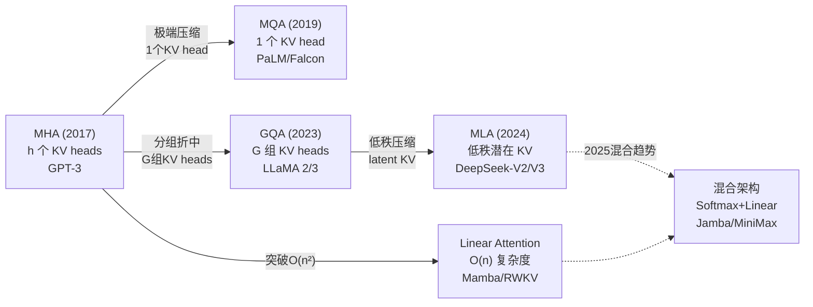

# Attention 变体综述：从 MHA 到 Linear Attention

> 注意力机制的演进本质是在**表达能力**与**计算/显存效率**之间寻找最优平衡点

## 1. 演进脉络总览



**核心矛盾**：标准 Attention 的 $O(n^2)$ 复杂度在序列长度增长时成为瓶颈；KV Cache 在推理时线性增长，限制 batch size 和吞吐。

## 2. Multi-Head Attention (MHA)

> 来源：Vaswani et al., "Attention Is All You Need", arXiv:1706.03762, Sec. 3.2

### 标准定义

每个 head 拥有独立的 Q、K、V 投影：

$$\text{Attention}_i = \text{softmax}\left(\frac{Q_i K_i^T}{\sqrt{d_k}}\right) V_i$$

```python
# MHA 伪代码
Q = x @ W_q  # (B, N, h*d_k) → 拆成 h 个 (B, N, d_k)
K = x @ W_k  # 同上
V = x @ W_v  # 同上
# 每个 head 独立做 attention，最后 concat + 线性投影
```

### 复杂度

| 指标 | 复杂度 |
|------|--------|
| 计算 (FLOPs) | $O(n^2 \cdot d)$ |
| KV Cache (每 token 每层) | $2 \times h \times d_k$ |
| 参数量 | $4 \times d^2$（Q/K/V/O 各一个） |

**问题**：LLaMA-1 65B 在 4096 长度下 KV Cache 就需要 ~10.5 GB。

## 3. Multi-Query Attention (MQA)

> 来源：Shazeer, "Fast Transformer Decoding: One Write-Head is All You Need", arXiv:1911.02150

### 核心改进

**所有 Q head 共享同一组 K 和 V**，KV Cache 压缩至 $1/h$：

```python
class MultiQueryAttention(nn.Module):
    def __init__(self, d_model, n_heads):
        super().__init__()
        self.n_heads = n_heads
        self.d_k = d_model // n_heads
        self.W_q = nn.Linear(d_model, d_model)       # h 个 Q head
        self.W_k = nn.Linear(d_model, self.d_k)       # 1 个 K head!
        self.W_v = nn.Linear(d_model, self.d_k)       # 1 个 V head!
        self.W_o = nn.Linear(d_model, d_model)

    def forward(self, x):
        B, N, _ = x.shape
        Q = self.W_q(x).view(B, N, self.n_heads, self.d_k).transpose(1, 2)
        K = self.W_k(x).view(B, N, 1, self.d_k).transpose(1, 2)
        V = self.W_v(x).view(B, N, 1, self.d_k).transpose(1, 2)
        # 广播到所有 head
        K = K.expand(-1, self.n_heads, -1, -1)
        V = V.expand(-1, self.n_heads, -1, -1)
        scores = (Q @ K.transpose(-2, -1)) / (self.d_k ** 0.5)
        attn = torch.softmax(scores, dim=-1)
        out = (attn @ V).transpose(1, 2).contiguous().view(B, N, -1)
        return self.W_o(out)
```

**代价**：所有 head 被迫共享同一 attention pattern，质量下降 2-3%。

**代表模型**：PaLM、Falcon、StarCoder。

## 4. Grouped Query Attention (GQA)

> 来源：Ainslie et al., "GQA: Training Generalized Multi-Query Attention from Multi-Head Checkpoints", arXiv:2305.13245

详见 [[AI/3-LLM/Architecture/GQA-MQA|GQA/MQA 深度解析]]。

### 核心思想

将 $h$ 个 Q head 分成 $G$ 组，每组共享一套 KV。GQA 是 MHA ($G=h$) 和 MQA ($G=1$) 的泛化：

```
GQA (h=32, G=8):
  每 4 个 Q head 共享 1 个 KV head
  KV Cache 节省 = (32-8)/32 = 75%
  质量下降 < 0.5%
```

**2025 年事实标准**：LLaMA 2/3、Mistral、Qwen 2.5 系列全部采用 GQA (G=8)。

## 5. Multi-head Latent Attention (MLA)

> 来源：Liu et al., "DeepSeek-V2: A Strong, Economical, and Efficient MoE Language Model", arXiv:2405.04434, Sec. 3.1

### DeepSeek-V2/V3 的核心创新

MLA 不是简单减少 KV head 数量，而是通过**低秩压缩**将 KV 投射到一个 latent space：

```
传统 MHA:
  cache: [K_1, K_2, ..., K_h, V_1, V_2, ..., V_h]  → 2*h*d_k per token

MLA:
  compress: c_KV = x @ W_DKV           # d_model → d_c (d_c << h*d_k)
  cache:    c_KV                        # 只缓存 d_c 维向量！
  decompress: K = c_KV @ W_UK           # d_c → h*d_k (on-the-fly)
              V = c_KV @ W_UV           # d_c → h*d_k (on-the-fly)
```

### 关键设计

```python
class MultiHeadLatentAttention(nn.Module):
    """MLA 简化版（不含 Decoupled RoPE）"""
    def __init__(self, d_model, n_heads, d_compress):
        super().__init__()
        self.n_heads = n_heads
        self.d_k = d_model // n_heads
        self.d_compress = d_compress  # 压缩维度，远小于 n_heads * d_k

        # 下压缩矩阵（用于推理时缓存）
        self.W_DKV = nn.Linear(d_model, d_compress)
        # 上解压矩阵（推理时按需计算）
        self.W_UK = nn.Linear(d_compress, n_heads * self.d_k)
        self.W_UV = nn.Linear(d_compress, n_heads * self.d_k)
        # Q 也有类似压缩
        self.W_DQ = nn.Linear(d_model, d_compress)
        self.W_UQ = nn.Linear(d_compress, n_heads * self.d_k)
        self.W_o = nn.Linear(d_model, d_model)

    def forward(self, x):
        B, N, _ = x.shape
        # 压缩 KV → latent vector（推理时只缓存这个！）
        c_kv = self.W_DKV(x)              # (B, N, d_c)
        K = self.W_UK(c_kv).view(B, N, self.n_heads, self.d_k).transpose(1, 2)
        V = self.W_UV(c_kv).view(B, N, self.n_heads, self.d_k).transpose(1, 2)
        # Q 也经过低秩压缩
        c_q = self.W_DQ(x)
        Q = self.W_UQ(c_q).view(B, N, self.n_heads, self.d_k).transpose(1, 2)
        # 标准 Attention
        scores = (Q @ K.transpose(-2, -1)) / (self.d_k ** 0.5)
        attn = torch.softmax(scores, dim=-1)
        out = (attn @ V).transpose(1, 2).contiguous().view(B, N, -1)
        return self.W_o(out)
```

### Decoupled RoPE

MLA 的低秩分解与 [[AI/3-LLM/Architecture/Transformer 位置编码|RoPE]] 不兼容（RoPE 改变了矩阵的秩），因此 DeepSeek 提出 **Decoupled RoPE**：

```
K = concat([K_nope, K_rope])
  K_nope: 从 c_KV 解压，不含位置信息
  K_rope: 单独的小矩阵，应用 RoPE
  两者拼接成完整 K head

Q 类似处理
```

### KV Cache 对比

```
                 KV Cache per token per layer
MHA (h=128)   :  2 × 128 × d_k = 256 d_k
GQA (G=8)     :  2 × 8 × d_k = 16 d_k
MLA (d_c=512) :  d_c + d_rope = 512 + 64 ≈ 576  (等效 ~4.5 d_k)

DeepSeek-V3: 压缩比达 ~93%，且质量不降反升
```

## 6. Linear Attention

### 动机

标准 Attention 的 $O(n^2)$ 在超长序列时是根本瓶颈。Linear Attention 将复杂度降至 $O(n)$。

### 核心思路：Kernel 分解

标准 softmax attention：
$$A_{ij} = \frac{\exp(q_i^T k_j)}{\sum_l \exp(q_i^T k_l)}$$

Linear Attention 用 kernel 函数 $\phi$ 替代 exp：
$$A_{ij} = \frac{\phi(q_i)^T \phi(k_j)}{\sum_l \phi(q_i)^T \phi(k_l)}$$

关键：改变计算顺序，先算 $\phi(K)^T V$，再乘 $\phi(Q)$：

```python
def linear_attention(Q, K, V, feature_map):
    """O(n*d^2) 代替 O(n^2*d)"""
    Q_prime = feature_map(Q)  # (B, h, N, d') 
    K_prime = feature_map(K)  # (B, h, N, d')
    # 先计算 KV 的外积和（不用显式算 N×N 矩阵！）
    KV = torch.einsum('bhnd,bhnv->bhdv', K_prime, V)  # (B, h, d', d_v)
    # 再用 Q 查询
    out = torch.einsum('bhnd,bhdv->bhnv', Q_prime, KV)  # (B, h, N, d_v)
    # 归一化
    Z = torch.einsum('bhnd,bhd->bhn', Q_prime, K_prime.sum(dim=2))
    return out / Z.unsqueeze(-1)
```

### 主流变体

| 方法 | 核心创新 | 复杂度 | 代表模型 |
|------|---------|--------|---------|
| Linear Transformer | ELU+1 kernel | O(nd²) | — |
| RWKV | 时间混合 + 通道混合 | O(nd) | RWKV-6/7 |
| Mamba/Mamba-2 | 选择性 SSM | O(nd) | Jamba |
| RetNet | 多尺度指数衰减 | O(nd) | — |
| GLA | 门控 + 数据依赖衰减 | O(nd) | MiniMax-01 |
| Lightning Attention | 硬件优化的线性注意力 | O(nd) | MiniMax-01 |

### Linear Attention 的局限

```
✅ 优势：
  - O(n) 复杂度，序列长度无上限
  - 推理时 RNN 形式，无需 KV Cache
  - 训练时可并行

❌ 劣势：
  - in-context retrieval 能力弱（"大海捞针"测试表现差）
  - 长距离精确匹配不如 softmax attention
  - 2025 年实际模型质量仍不及同规模 Transformer
```

### 2025 趋势：混合架构

最新趋势是**混合使用** softmax attention 和 linear attention：

```
Jamba (AI21):    Mamba 层 + Transformer 层交替
MiniMax-01:      Lightning Attention + Softmax Attention 混合
DeepSeek-V3.1:   MLA + 稀疏 Attention 模式

理念: 关键层用 softmax（精确检索）+ 其余层用 linear（高效处理）
```

## 7. 复杂度综合对比

| 方法 | 训练复杂度 | 推理 KV Cache | 质量 (同规模) | 代表 |
|------|-----------|-------------|-------------|------|
| MHA | $O(n^2 d)$ | $2hd_k$ / token | ★★★★★ | GPT-3 |
| MQA | $O(n^2 d)$ | $2d_k$ / token | ★★★☆☆ | PaLM |
| GQA | $O(n^2 d)$ | $2Gd_k$ / token | ★★★★☆ | LLaMA 3 |
| MLA | $O(n^2 d)$ | $d_c$ / token | ★★★★★ | DeepSeek-V3 |
| Linear | $O(nd^2)$ | $O(d^2)$ 固定 | ★★★☆☆ | RWKV |
| 混合 | $O(n \cdot d)$ ~ $O(n^2 d)$ | 取决于比例 | ★★★★☆ | Jamba |

## 8. 选型指南

```
场景                → 推荐方案
──────────────────────────────────────
标准 LLM (7B-70B)   → GQA (G=8)，已成为默认
极致 KV 压缩       → MLA（需要改模型架构）
超长序列 (>128K)    → 混合架构 或 Ring Attention
边缘部署/低显存     → MQA 或 MLA
实时流式处理       → Linear Attention / RWKV
```

## 面试常见问题

### Q1: 从 MHA → MQA → GQA → MLA，每一步解决了什么问题？

**MHA** 是标准 Transformer 注意力，表达力最强但 KV Cache 大；**MQA** 将 KV 压缩到 1 个 head，节省 ~98% KV Cache 但质量下降明显；**GQA** 折中取 G 组 KV，成为 2024 年事实标准（节省 75-87.5%，质量损失 < 0.5%）；**MLA** 通过低秩压缩进一步将 KV Cache 压缩到 ~7% 原始大小，且因为每个 head 仍能获得独特 KV（从 latent 解压），质量不降反升。核心脉络是**用更聪明的方式共享/压缩 KV 信息**。

### Q2: MLA 的低秩压缩为什么不损失质量？

两个原因：(1) 注意力权重矩阵本身就具有低秩特性（多项研究表明有效秩远小于维度），低秩压缩只是利用了这一内在结构；(2) MLA 解压后每个 head 得到**独特的** K/V（而非 MQA 的共享），表达力类似 MHA。本质上 MLA 是在**参数空间**做压缩（类似 LoRA 思想），而非在**信息空间**做裁剪（如 GQA/MQA）。

### Q3: Linear Attention 为什么没有取代 Transformer？

Linear Attention 通过 kernel 分解将 $O(n^2)$ 降至 $O(n)$，但丢失了 softmax 的**锐利聚焦**能力——softmax 能产生接近 one-hot 的 attention 分布（精确检索），而 linear kernel 的 attention 分布更均匀，导致 in-context recall 能力弱。实际表现为"大海捞针"测试失败。2025 年的趋势是混合架构：关键层保留 softmax attention，其余层用 linear attention。

### Q4: Decoupled RoPE 解决了什么问题？

RoPE 对 Q 和 K 施加旋转变换（位置相关），这会**破坏低秩结构**——旋转后的矩阵秩可能升高，导致压缩损失增大。MLA 将每个 head 拆成两部分：不含位置信息的主体（从 latent 解压）和携带 RoPE 的小额外向量（单独缓存），两者拼接形成完整 head。这样既保证了位置编码的效果，又维持了 KV 压缩的高效性。

### Q5: 实际部署中 GQA 的 G 值如何选择？有什么约束？

经验最优区间是 **G = h/8 ~ h/4**。主流选择 G=8（LLaMA 2/3 70B、Qwen 2.5 72B）。选择 G 时需要满足：(1) G 能被 Tensor Parallel degree 整除（否则 KV heads 无法均匀切分）；(2) h 能被 G 整除（每组 Q head 数相等）；(3) 更大模型可用更大 G/h 比（如 70B 用 8:1 而 7B 用 4:1），因为大模型有更多冗余。过小的 G 质量损失明显，过大则节省不够。

---

## 🔧 落地应用

### 直接可用场景
- **新模型设计**：2025 年新训 LLM 默认选 GQA (G=8)，无需讨论。MLA 仅在有能力修改 attention kernel 的团队（如 DeepSeek）适用
- **推理服务选型**：根据 KV Cache 预算倒推可服务的最大 batch size，公式 $\text{max\_batch} = \frac{\text{GPU\_mem} - \text{model\_size}}{2 \times G \times d_k \times L \times \text{seq\_len} \times \text{bytes}}$
- **长上下文部署**：128K+ 场景优先考虑混合架构（Jamba 风格）或 MLA + Ring Attention

### 工程实现要点
- GQA 的 G 必须能被 TP degree 整除，否则 KV heads 无法均匀切分
- MLA 的 Decoupled RoPE 实现需要额外缓存 $d_{\text{rope}}$ 维向量，实际压缩比需计入此项
- Linear Attention 推理时可退化为 RNN 形式（无 KV Cache），适合流式场景

---

## 💡 启发与思考

### So What？对老板意味着什么
- **MLA 的低秩压缩思想与 LoRA 同源**：都是利用参数矩阵的内在低秩性。这个 insight 可以迁移到其他需要压缩的场景（如 [[AI/3-LLM/SFT/LoRA|LoRA 微调]]）
- **混合架构是工程妥协的典范**：纯 linear attention 质量不够，纯 softmax attention 序列长度受限。最终落地的总是折中方案

### 未解问题与局限
- Linear Attention 的 in-context retrieval 能力弱是根本性的——kernel 分解丢失了 softmax 的锐利聚焦能力，目前无优雅解法
- MLA 目前仅 DeepSeek 使用，生态支持（推理框架、量化工具）不如 GQA 成熟

### 脑暴：如果往下延伸
- 如果把 [[AI/3-LLM/Architecture/Mamba-SSM|Mamba]] 的选择性 SSM 和 Transformer 的 MLA 在同一模型中混合，可能在超长上下文（>1M tokens）场景取得突破
- 6 个月后预测：会出现自动化的 attention 架构搜索——哪些层用 softmax、哪些用 linear，由 NAS 自动决定

---

## 📚 推荐阅读

### 原始论文
- [Attention Is All You Need](https://arxiv.org/abs/1706.03762) — Transformer 和 MHA 的奠基论文
- [Fast Transformer Decoding (MQA)](https://arxiv.org/abs/1911.02150) — 第一个提出 KV head 共享的工作
- [GQA: Training Generalized Multi-Query Attention](https://arxiv.org/abs/2305.13245) — GQA 原论文，含 MHA→GQA 的 uptraining 方法
- [FlashAttention](https://arxiv.org/abs/2205.14135) — IO-aware attention 计算，与本文 Sec. 6 的 linear attention 形成对比
- [Longformer (Sliding Window Attention)](https://arxiv.org/abs/2004.05150) — 长文档 Attention 的经典方案
- [DeepSeek-V2 (MLA)](https://arxiv.org/abs/2405.04434) — MLA 和 Decoupled RoPE 的原始设计

### 深度解读
- [Jay Alammar: The Illustrated Transformer](https://jalammar.github.io/illustrated-transformer/) — MHA 可视化最佳入门 ⭐⭐⭐⭐⭐

### 实践资源
- [FlashAttention GitHub](https://github.com/Dao-AILab/flash-attention) — FlashAttention 的高效实现，支持 GQA/MQA
- [vLLM](https://github.com/vllm-project/vllm) — GQA + PagedAttention 的工业级推理框架

### 代码手撕（理论 → 代码）
- [[Projects/MA-RLHF/lc10/lc10-00-FlashAttention-手撕实操|FlashAttention-手撕实操]] — **必看**：从 Tiling/SRAM 管理到 CUDA kernel 的 IO-aware 完整实现，MA-RLHF 项目配套 ⭐⭐⭐⭐⭐
- [[Projects/MA-RLHF/lc2/lc2-01-Transformer-手撕实操|Transformer-手撕实操]] — 包含 MHA 的完整 Transformer 从零实现（含 Self-Attention/Cross-Attention）

---

## See Also

> 🔗 See also: [[AI/3-LLM/Architecture/GQA-MQA|GQA/MQA 深度解析]] — KV head 共享机制的详细实现和性能对比
> 🔗 See also: [[AI/3-LLM/Architecture/FlashAttention|FlashAttention]] — Attention 计算加速，与本文架构优化互补
> 🔗 See also: [[AI/3-LLM/Inference/KV Cache|KV Cache]] — Attention 变体直接影响 KV Cache 大小，推理优化的核心关联
> 🔗 See also: [[AI/3-LLM/Architecture/Multi-Head Latent Attention|MLA 详解]] — DeepSeek MLA 的完整技术细节
> 🔗 See also: [[AI/3-LLM/Architecture/Mamba-SSM|Mamba/SSM]] — Linear Attention 的替代路线：选择性状态空间模型
