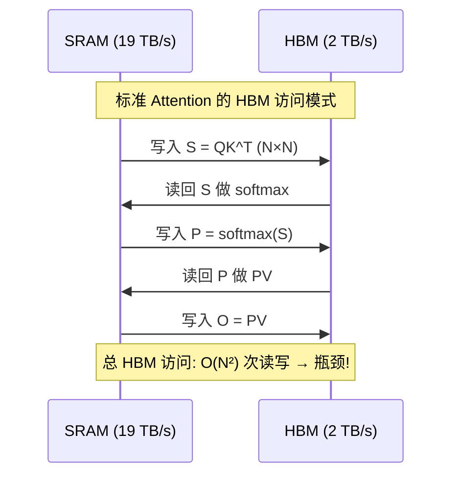
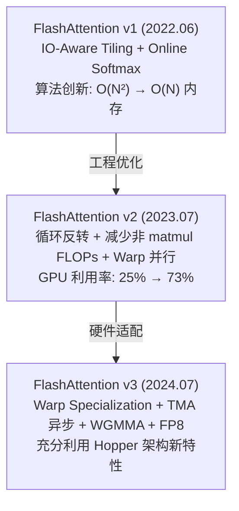

# FlashAttention v1/v2/v3 深度解析

> IO-aware Attention 算法——通过 tiling 与 kernel fusion 将 Attention 从 memory-bound 变为 compute-bound

## 1. 为什么需要 FlashAttention？

### 标准 Attention 的内存瓶颈

标准 Self-Attention 计算：

```
Attention(Q, K, V) = softmax(QK^T / √d_k) · V
```

问题在于中间矩阵 `S = QK^T` 的大小为 `N×N`（N 为序列长度）：

| 序列长度 N | S 矩阵大小 (FP16) | 说明 |
|-----------|-------------------|------|
| 2K | 8 MB | 可接受 |
| 8K | 128 MB | 显存压力大 |
| 32K | 2 GB | 单层就吃满 |
| 128K | 32 GB | 无法放入 HBM |

更关键的是 **IO 瓶颈**：标准实现需要将 `S` 矩阵写入 HBM，再读回来做 softmax，再写回，再读回做 `S·V`——大量时间浪费在 HBM 读写上：



A100 GPU 的 SRAM（192KB/SM）速度约 19 TB/s，而 HBM（80GB）仅 2 TB/s，**差距近 10 倍**。标准 Attention 完全没有利用这个层次结构。

## 2. FlashAttention v1：IO-Aware Tiling

> 来源：Dao et al., "FlashAttention: Fast and Memory-Efficient Exact Attention with IO-Awareness", arXiv:2205.14135, Sec. 3

### 核心思想

**不把 N×N 的中间矩阵写入 HBM**，而是分块（tiling）在 SRAM 中完成所有计算，一次性输出最终结果。

### Tiling 策略

将 Q、K、V 切成块，每块大小为 `B_r × d` 或 `B_c × d`：

```python
# FlashAttention v1 伪代码
def flash_attention_v1(Q, K, V, B_r, B_c):
    N, d = Q.shape
    O = zeros(N, d)           # 输出
    l = zeros(N)              # softmax 分母（log-sum-exp）
    m = full(N, -inf)         # 行最大值

    # 外层循环遍历 K, V 的块
    for j in range(0, N, B_c):
        K_j = K[j:j+B_c]     # 从 HBM 加载
        V_j = V[j:j+B_c]

        # 内层循环遍历 Q 的块
        for i in range(0, N, B_r):
            Q_i = Q[i:i+B_r]  # 从 HBM 加载
            O_i = O[i:i+B_r]
            l_i = l[i:i+B_r]
            m_i = m[i:i+B_r]

            # --- 以下全在 SRAM 中完成 ---
            S_ij = Q_i @ K_j.T / sqrt(d)   # B_r × B_c，在 SRAM 中
            m_new = max(m_i, S_ij.max(dim=-1))
            P_ij = exp(S_ij - m_new[:, None])
            l_new = exp(m_i - m_new) * l_i + P_ij.sum(dim=-1)
            O_i = (exp(m_i - m_new)[:, None] * O_i + P_ij @ V_j) / l_new[:, None]
            # --- 写回 HBM ---
            O[i:i+B_r] = O_i
            l[i:i+B_r] = l_new
            m[i:i+B_r] = m_new

    return O
```

### Online Softmax 技巧

关键创新：**不需要看到整行就能增量计算 softmax**。通过维护 running max `m` 和 running sum `l`，每处理一个 K 块就更新：

```
m_new = max(m_old, max(S_block))
l_new = e^(m_old - m_new) * l_old + Σ e^(S_block - m_new)
O_new = (e^(m_old - m_new) * l_old * O_old + P_block @ V_block) / l_new
```

### 反向传播：重计算策略

前向只保存 O、l、m（不保存 N×N 的 S 矩阵），反向时用 Q、K、V 重新算出 S 块——用计算换内存：

- 内存：O(N) vs 标准的 O(N²)
- 计算：多一次前向计算，但因为减少了 HBM 读写，**实际更快**

### v1 性能

- **训练加速**：比 PyTorch 标准实现快 **2-4x**
- **内存节省**：从 O(N²) 降到 O(N)，支持 16K+ 序列长度
- **精确计算**：不是近似，结果与标准 Attention 数值一致

## 3. FlashAttention v2：工程优化

> 来源：Dao, "FlashAttention-2: Faster Attention with Better Parallelism and Work Partitioning", arXiv:2307.08691

v2 (2023.07) 不改变算法本质，专注于 GPU 利用率优化：

### 三大改进

#### (1) 循环顺序反转

```
v1: 外层遍历 K/V 块，内层遍历 Q 块
     → 每个 Q 块需要反复读写 O 累加器

v2: 外层遍历 Q 块，内层遍历 K/V 块
     → 每个 Q 块的 O 只需一次最终写回 HBM

┌─── v1 ───────────────────┐  ┌─── v2 ───────────────────┐
│ for kv_block:             │  │ for q_block:             │
│   for q_block:            │  │   load O_i once          │
│     load/store O_i ←HBM  │  │   for kv_block:          │
│                           │  │     update O_i in SRAM   │
│ HBM writes: O(T_k * N)   │  │   store O_i once         │
└───────────────────────────┘  │ HBM writes: O(N)         │
                               └───────────────────────────┘
```

#### (2) 减少非矩阵乘 FLOPs

v1 在 online softmax 中有大量标量运算（rescaling）。v2 将其最小化，让 Tensor Core 利用率从 ~25% 提升到 ~70%。

#### (3) Warp 间并行

v1 中 4 个 warp 分别处理 Q 的不同部分，需要通信同步。v2 让 4 个 warp 分处理 K/V 的不同块，最后 reduce——减少 shared memory 读写和同步。

### v2 性能数据

| 指标 | v1 | v2 | 理论峰值 |
|------|-----|-----|---------|
| A100 TFLOPS 利用率 | 25-40% | 50-73% | 312 TFLOPS |
| 前向速度 (seq=2K) | 1.0x | 2.0x | — |
| 端到端训练 | 1.0x | 1.3x | — |

## 4. FlashAttention v3：Hopper 架构深度优化

> 来源：Shah et al., "FlashAttention-3: Fast and Accurate Attention with Asynchrony and Low-precision", arXiv:2407.08608

v3 (2024.07) 针对 NVIDIA Hopper (H100/H200) 架构的三大新特性：

### (1) 异步化 (Warp Specialization + TMA)

H100 引入了 **TMA (Tensor Memory Accelerator)**，可以异步搬运数据。v3 利用 warp specialization 将 warp 分为两组：

```
                    ┌── Producer Warps ──┐
                    │  TMA 异步加载      │
                    │  K, V → SRAM       │
                    └────────┬───────────┘
                             │ (数据就绪)
                    ┌────────▼───────────┐
                    │  Consumer Warps    │
                    │  WGMMA 计算       │
                    │  Q @ K^T, P @ V   │
                    └────────────────────┘
                    
  数据搬运与计算完全重叠 → 隐藏内存延迟
```

### (2) WGMMA 指令

利用 H100 的 **Warpgroup MMA** 指令，直接从 shared memory 发起矩阵乘，避免 register 中转：

```
v2 (Ampere): 数据路径为 SMEM → Registers → Tensor Core
v3 (Hopper): 数据路径为 SMEM → Tensor Core (WGMMA)
                                 ↑ 减少一跳
```

### (3) FP8 低精度支持

v3 原生支持 FP8 (E4M3/E5M2) 精度，throughput 翻倍：

- **非连贯处理 (Incoherent Processing)**：对 Q 和 K 施加随机正交变换，减少量化误差
- Block-wise quantization：每个 tile 独立量化缩放

### v3 性能数据

| 指标 | v2 (A100) | v3 (H100) | 提升 |
|------|-----------|-----------|------|
| FP16 TFLOPS | 230 | 740 | 3.2x |
| FP8 TFLOPS | — | 1200+ | — |
| FP16 利用率 | 62% | 75% | — |

## 5. v1 → v2 → v3 演进总结



## 6. FlashAttention vs PagedAttention

两者解决的是 **不同层面** 的问题，互为补充：

| 维度 | FlashAttention | PagedAttention |
|------|---------------|----------------|
| **目标** | 加速 Attention 计算 | 优化 KV Cache 内存管理 |
| **核心思想** | IO-aware tiling，减少 HBM 读写 | 虚拟内存分页，减少碎片 |
| **解决问题** | 计算慢、内存占用大 | 显存浪费、碎片化 |
| **作用阶段** | 训练 + 推理 | 仅推理 |
| **协同** | FlashAttention 计算 Attention kernel，PagedAttention 管理 KV 存储 |

在 [[AI/3-LLM/Inference/vLLM|vLLM]] 中，两者协同工作：PagedAttention 管理 KV Cache 的物理内存分页，FlashAttention 负责高效计算 Attention 得分。

## 7. 实际使用

### PyTorch SDPA (推荐)

```python
import torch
import torch.nn.functional as F

# PyTorch 2.2+ 自动选择 FlashAttention v2
with torch.backends.cuda.sdp_kernel(
    enable_flash=True,        # FlashAttention
    enable_math=False,        # 关闭标准实现
    enable_mem_efficient=False # 关闭 xformers
):
    output = F.scaled_dot_product_attention(
        query, key, value,
        attn_mask=None,
        dropout_p=0.0,
        is_causal=True  # causal mask，适用于 decoder
    )
```

### Hugging Face Transformers

```python
from transformers import AutoModelForCausalLM

model = AutoModelForCausalLM.from_pretrained(
    "meta-llama/Llama-3.1-8B-Instruct",
    attn_implementation="flash_attention_2",  # 显式指定
    torch_dtype=torch.bfloat16,
    device_map="auto"
)
```

### 手动安装

```bash
# 需要 CUDA 11.8+, PyTorch 2.0+
pip install flash-attn --no-build-isolation

# 验证
python -c "import flash_attn; print(flash_attn.__version__)"
```

## 8. 与其他优化技术的关系

- **[[AI/3-LLM/Inference/KV Cache|KV Cache 优化]]**：FlashAttention 降低计算开销，KV Cache 减少重复计算
- **[[AI/3-LLM/Inference/量化综述|量化]]**：v3 的 FP8 支持与量化互补，进一步降低显存
- **[[AI/3-LLM/Architecture/GQA-MQA|GQA/MQA]]**：减少 KV head 数量 → KV Cache 更小 → FlashAttention 每块处理更高效
- **[[AI/3-LLM/Inference/推理优化|推理优化]]**：FlashAttention 是推理优化 stack 中 Attention 层的核心组件
- **[[AI/3-LLM/Inference/Speculative Decoding|Speculative Decoding]]**：正交优化，FlashAttention 加速单次 Attention，SD 减少解码步数

## 面试常见问题

### Q1: FlashAttention 为什么能加速？它是近似计算吗？

**不是近似**，是精确计算。加速的核心在于 **IO-aware**：通过 tiling 将 Q、K、V 分块加载到 SRAM（快 10x），在 SRAM 中完成所有 Attention 计算（包括 softmax），避免将 O(N²) 的中间矩阵写入 HBM。本质是减少 HBM 读写量，从 O(N² + Nd) 降到 O(N²d / M)（M 为 SRAM 大小），在典型配置下接近最优。

### Q2: Online Softmax 是什么？为什么需要它？

标准 softmax 需要先看到整行的所有值才能计算 max 和 sum。但 tiling 策略下，每次只看到一部分 K 块，所以需要 **增量更新**：维护 running max `m` 和 running sum `l`，每处理一个新 K 块时 rescale 之前的结果。数学上等价于标准 softmax，但允许分块流式计算。

### Q3: v2 相比 v1 的核心改进是什么？

三点：(1) **反转循环顺序**，外层遍历 Q、内层遍历 K/V，使每个 Q 块的 Output 只需一次 HBM 写回；(2) **减少非 matmul FLOPs**，最大化 Tensor Core 利用率；(3) **改进 warp 并行策略**，减少 shared memory 同步。综合效果是 GPU 计算利用率从 25% 提升到 73%。

### Q4: FlashAttention 和 PagedAttention 是什么关系？能一起用吗？

**完全互补**：FlashAttention 优化 Attention **计算**（减少 HBM IO），PagedAttention 优化 KV Cache **内存管理**（分页减少碎片）。在 vLLM 中二者协同：PagedAttention 负责将 KV Cache 按页存储在非连续物理内存中，FlashAttention（或其变体 FlashInfer）负责高效计算注意力。

### Q5: v3 如何利用 H100 的新特性？

三大硬件特性利用：(1) **TMA** (Tensor Memory Accelerator) 实现异步数据搬运，用 warp specialization 将 producer（搬数据）和 consumer（算矩阵乘）分开，计算与搬运重叠；(2) **WGMMA** 指令让数据直接从 shared memory 进入 Tensor Core，跳过 register 中转；(3) **FP8** 原生支持，配合非连贯处理减少量化误差，吞吐再翻倍。

---

## 🔧 落地应用

### 直接可用场景
- **训练加速**：PyTorch 2.2+ 的 `F.scaled_dot_product_attention` 自动调用 FlashAttention v2，零代码改动获得 2-4x 训练加速
- **推理部署**：HuggingFace Transformers 指定 `attn_implementation="flash_attention_2"` 即可启用
- **长上下文训练**：FlashAttention 将内存从 $O(N^2)$ 降到 $O(N)$，使 32K-128K 序列长度训练成为可能

### 工程实现要点
- 安装需要 CUDA 11.8+：`pip install flash-attn --no-build-isolation`
- v3 需要 H100/H200 硬件（Hopper 架构），A100 最高只能用 v2
- Causal mask 使用 `is_causal=True` 参数，性能优于手动构建 mask 矩阵
- FlashAttention 的反向传播用重计算策略（不保存 $N \times N$ 矩阵），额外计算量由减少的 IO 补偿

### 面试高频问法
- Q: FlashAttention 是近似计算吗？
  A: 不是。Online Softmax 数学上精确等价标准 softmax，只是改变了计算顺序
- Q: 为什么重计算反而更快？
  A: 因为减少了 HBM 读写（IO-bound → compute-bound），省下的 IO 时间远超多一次前向计算的时间

---

## 💡 启发与思考

### So What？对老板意味着什么
- **FlashAttention 是"免费"的性能提升**——不改变模型质量，纯工程优化。任何 Transformer 训练/推理都应该默认开启
- **IO-aware 的设计哲学可以迁移**：不只是 Attention，任何涉及大矩阵中间结果的计算都可以用 tiling + 重计算的思路优化

### 未解问题与局限
- FlashAttention 目前主要优化 self-attention，cross-attention 和特殊 attention pattern（如 sparse attention）的支持不完整
- v3 的 FP8 支持依赖 Hopper 架构，A100 用户无法受益
- Online Softmax 的增量更新引入了浮点累积误差，极长序列（>100K）可能有数值精度问题（实践中通常可忽略）

### 脑暴：如果往下延伸
- 如果把 FlashAttention 的 tiling 策略和 [[AI/3-LLM/Architecture/GQA-MQA|GQA]] 的 KV head 共享结合，可以在 kernel 层面做更深度的融合优化（减少 KV broadcast 的开销）
- v4 可能的方向：针对 Blackwell (B200) 架构的进一步适配，以及原生支持 MLA 的解压缩计算

---

## 📚 推荐阅读

### 原始论文
- [FlashAttention v1](https://arxiv.org/abs/2205.14135) — IO-aware tiling 的原创论文，Sec. 3 的算法描述极为清晰
- [FlashAttention v2](https://arxiv.org/abs/2307.08691) — 工程优化细节，循环反转和 warp 并行策略
- [FlashAttention v3](https://arxiv.org/abs/2407.08608) — Hopper 架构深度适配，TMA/WGMMA/FP8

### 深度解读
- [Tri Dao's Blog: FlashAttention](https://tridao.me/blog/) — 作者亲自解读 FlashAttention 的设计动机 ⭐⭐⭐⭐⭐
- [ELI5: FlashAttention](https://gordicaleksa.medium.com/eli5-flash-attention-5c44017022ad) — 通俗易懂的图解 ⭐⭐⭐⭐

### 实践资源
- [FlashAttention GitHub](https://github.com/Dao-AILab/flash-attention) — 官方实现，支持 v1/v2/v3
- [PyTorch SDPA 文档](https://pytorch.org/docs/stable/generated/torch.nn.functional.scaled_dot_product_attention.html) — PyTorch 集成的 FlashAttention 接口

---

## See Also

> 🔗 See also: [[AI/3-LLM/Architecture/Attention 变体综述|Attention 变体综述]] — FlashAttention 加速的计算层与 Attention 变体的架构层互补
> 🔗 See also: [[AI/3-LLM/Architecture/GQA-MQA|GQA/MQA]] — GQA 减少 KV 数量，FlashAttention 减少 IO，二者协同
> 🔗 See also: [[AI/3-LLM/Inference/KV Cache|KV Cache]] — FlashAttention（计算加速）与 PagedAttention（内存管理）在 vLLM 中协同工作
> 🔗 See also: [[AI/3-LLM/Inference/量化综述|量化综述]] — v3 的 FP8 支持与量化技术的交叉点
> 🔗 See also: Transformer 全景 — FlashAttention 是 Transformer 推理优化 stack 的核心组件
