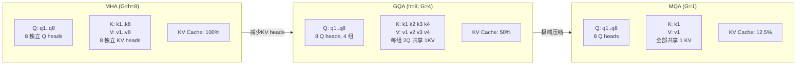

# GQA / MQA 深度解析

> Grouped Query Attention & Multi-Query Attention——KV Cache 大小与模型质量的精妙平衡

## 1. 从 MHA 说起

### Multi-Head Attention (MHA)

标准 Transformer 使用 MHA：每个 head 有独立的 Q、K、V 投影矩阵：

```
MHA (Multi-Head Attention):
  Q heads: h 个独立的 Q 投影  → h 个 Q head
  K heads: h 个独立的 K 投影  → h 个 K head
  V heads: h 个独立的 V 投影  → h 个 V head

  每个 head: Attention_i = softmax(Q_i @ K_i^T / √d_k) @ V_i

例: LLaMA-1 65B
  h = 64 heads, d_model = 8192, d_k = d_v = 128
  KV Cache per token per layer = 2 × 64 × 128 × 2 bytes = 32 KB
  80 layers × 32 KB = 2.56 MB per token
  4096 tokens × 2.56 MB = 10.5 GB  ← 仅 KV Cache！
```

**问题**：推理时 KV Cache 随序列长度线性增长，长上下文场景下 KV Cache 甚至超过模型权重本身的显存占用。

## 2. Multi-Query Attention (MQA)

> 来源：Shazeer, "Fast Transformer Decoding: One Write-Head is All You Need", arXiv:1911.02150

### 核心思想

**所有 Q head 共享同一组 K 和 V**：

```
MQA:
  Q heads: h 个独立的 Q 投影  → h 个 Q head  (不变)
  K heads: 1 个共享 K 投影   → 1 个 K head   (h 个 head 共享!)
  V heads: 1 个共享 V 投影   → 1 个 V head   (h 个 head 共享!)

  所有 head: Attention_i = softmax(Q_i @ K^T / √d_k) @ V
                                     ↑共享    ↑共享
```

### KV Cache 节省

```
MHA:  KV Cache = 2 × h × d_k × n_layers × seq_len
MQA:  KV Cache = 2 × 1 × d_k × n_layers × seq_len

节省比例 = 1/h = 1/64 ≈ 98.4% (对 h=64 的模型)
```

### 代码实现

```python
import torch
import torch.nn as nn

class MultiQueryAttention(nn.Module):
    def __init__(self, d_model, n_heads):
        super().__init__()
        self.n_heads = n_heads
        self.d_k = d_model // n_heads

        # Q: 多个 head (正常)
        self.W_q = nn.Linear(d_model, d_model)
        # K, V: 只有 1 个 head
        self.W_k = nn.Linear(d_model, self.d_k)    # d_model → d_k (非 d_model!)
        self.W_v = nn.Linear(d_model, self.d_k)
        self.W_o = nn.Linear(d_model, d_model)

    def forward(self, x, kv_cache=None):
        B, N, _ = x.shape

        Q = self.W_q(x).view(B, N, self.n_heads, self.d_k).transpose(1, 2)
        K = self.W_k(x).view(B, N, 1, self.d_k).transpose(1, 2)
        V = self.W_v(x).view(B, N, 1, self.d_k).transpose(1, 2)

        # K, V 广播到所有 head: (B, 1, N, d_k) → (B, h, N, d_k)
        K = K.expand(-1, self.n_heads, -1, -1)
        V = V.expand(-1, self.n_heads, -1, -1)

        # 标准 Attention
        scores = (Q @ K.transpose(-2, -1)) / (self.d_k ** 0.5)
        attn = torch.softmax(scores, dim=-1)
        out = (attn @ V).transpose(1, 2).contiguous().view(B, N, -1)
        return self.W_o(out)
```

### MQA 的问题

- **质量下降**：所有 head 共享 K/V，表达能力受限
- 在大模型（> 30B）上下降较明显，尤其是需要多种 attention pattern 的任务
- 代表模型：PaLM (Google)、Falcon、StarCoder

## 3. Grouped Query Attention (GQA)

> 来源：Ainslie et al., "GQA: Training Generalized Multi-Query Attention from Multi-Head Checkpoints", arXiv:2305.13245

### 核心思想

MQA 太激进（1 组 KV），MHA 太浪费（h 组 KV）。GQA 取折中：**将 h 个 Q head 分成 G 组，每组共享一组 KV**：

```
GQA (G 组):
  Q heads: h 个独立 Q head，分成 G 组
  K heads: G 个 K head，每组 h/G 个 Q head 共享一个 K
  V heads: G 个 V head，每组 h/G 个 Q head 共享一个 V

  h=32, G=8 时:
  每 4 个 Q head 共享 1 个 K/V head

特殊情况:
  G = h → GQA 退化为 MHA (每个 Q 有独立 KV)
  G = 1 → GQA 退化为 MQA (所有 Q 共享同一 KV)
```

### 直观理解



**文本对照**：

| 配置 | Q heads | KV heads | 每组 Q 共享数 | KV Cache 占比 |
|------|---------|----------|-------------|-------------|
| MHA (G=8) | 8 独立 | 8 独立 | 1:1 | 100% |
| GQA (G=4) | 8, 分 4 组 | 4 | 2:1 | 50% |
| GQA (G=2) | 8, 分 2 组 | 2 | 4:1 | 25% |
| MQA (G=1) | 8 | 1 共享 | 8:1 | 12.5% |

### 代码实现

```python
class GroupedQueryAttention(nn.Module):
    def __init__(self, d_model, n_heads, n_kv_heads):
        super().__init__()
        self.n_heads = n_heads          # Q head 数
        self.n_kv_heads = n_kv_heads    # KV head 数 (G)
        self.n_groups = n_heads // n_kv_heads  # 每组 Q head 数
        self.d_k = d_model // n_heads

        self.W_q = nn.Linear(d_model, n_heads * self.d_k)
        self.W_k = nn.Linear(d_model, n_kv_heads * self.d_k)  # 只有 G 个 head
        self.W_v = nn.Linear(d_model, n_kv_heads * self.d_k)
        self.W_o = nn.Linear(d_model, d_model)

    def forward(self, x):
        B, N, _ = x.shape

        Q = self.W_q(x).view(B, N, self.n_heads, self.d_k).transpose(1, 2)
        K = self.W_k(x).view(B, N, self.n_kv_heads, self.d_k).transpose(1, 2)
        V = self.W_v(x).view(B, N, self.n_kv_heads, self.d_k).transpose(1, 2)

        # 关键: 将 KV 扩展到匹配 Q heads
        # (B, n_kv_heads, N, d_k) → (B, n_heads, N, d_k)
        K = K.repeat_interleave(self.n_groups, dim=1)
        V = V.repeat_interleave(self.n_groups, dim=1)

        # 标准 Attention
        scores = (Q @ K.transpose(-2, -1)) / (self.d_k ** 0.5)
        attn = torch.softmax(scores, dim=-1)
        out = (attn @ V).transpose(1, 2).contiguous().view(B, N, -1)
        return self.W_o(out)
```

## 4. 主流模型的选择

| 模型 | Attention 类型 | Q heads | KV heads (G) | 组比 | KV Cache 节省 |
|------|-------------|---------|-------------|------|-------------|
| GPT-3 175B | MHA | 96 | 96 | 1:1 | 0% |
| PaLM 540B | MQA | 48 | 1 | 48:1 | 97.9% |
| Falcon 40B | MQA | 64 | 1 | 64:1 | 98.4% |
| [[AI/3-LLM/Architecture/LLaMA|LLaMA]] 2 70B | GQA | 64 | 8 | 8:1 | **87.5%** |
| LLaMA 3 8B | GQA | 32 | 8 | 4:1 | **75%** |
| LLaMA 3 70B | GQA | 64 | 8 | 8:1 | **87.5%** |
| Mistral 7B | GQA | 32 | 8 | 4:1 | **75%** |
| DeepSeek-V3 | MLA | — | — | — | 更激进压缩 |
| Qwen 2.5 72B | GQA | 64 | 8 | 8:1 | **87.5%** |

> **2025 年趋势**：GQA 已成为开源 LLM 的事实标准。MQA 因质量下降明显逐渐被弃用。DeepSeek 的 MLA（Multi-head Latent Attention）代表更激进的 KV 压缩方向。

## 5. KV Cache 内存计算

### 公式

```
KV Cache 大小 = 2 × n_kv_heads × d_k × n_layers × seq_len × batch_size × bytes_per_param

示例: LLaMA 3 70B, seq_len=8192, batch=16, FP16
  = 2 × 8 × 128 × 80 × 8192 × 16 × 2
  = 2 × 8 × 128 × 80 × 8192 × 16 × 2
  = 34.36 GB

对比 MHA 版本 (KV heads=64):
  = 2 × 64 × 128 × 80 × 8192 × 16 × 2
  = 274.88 GB  ← 不可能放入任何单卡！

GQA 节省: 274.88 - 34.36 = 240.52 GB (87.5%)
```

### 与 [[AI/3-LLM/Inference/KV Cache|PagedAttention]] 的协同

GQA 减少 KV heads 数量 → 每个 page 更小 → PagedAttention 管理更高效 → 相同显存可服务更多并发请求。

## 6. MHA → GQA 转换（Uptraining）

Google 的 GQA 论文提出了将已训练的 MHA 模型转换为 GQA 的方法：

```
步骤:
1. 将 h 个 KV head 按组分组
2. 组内 KV 权重取均值 (mean pooling)
3. 用原始数据继续训练 5-10% 的 tokens (uptraining)

效果:
  MHA (h=64) → GQA (G=8): 仅需原训练 5% 的额外训练
  质量下降: < 1% (在大多数 benchmark 上)
```

## 7. 性能对比

### 推理吞吐量

```
模型: 70B, A100 80GB × 4, seq_len=4096

配置          | 吞吐 (tokens/s) | 最大 batch | 延迟 (ms/token)
MHA (G=64)    |     800         |     4      |     5.0
GQA (G=8)     |    3200         |    32      |     1.25
MQA (G=1)     |    4000         |    48      |     1.0

GQA vs MHA: 吞吐提升 4x，因为 KV Cache 小 → batch 大 → 并行度高
MQA vs GQA: 仅额外 25% 提升，但质量损失更大
```

### 质量对比

```
模型: 30B scale, 相同训练数据和 tokens

           MMLU    HumanEval   GSM8K    平均
MHA        68.5    42.1        54.2     54.9
GQA (G=8)  68.1    41.5        53.8     54.5  (-0.4)
MQA (G=1)  66.8    38.9        51.1     52.3  (-2.6)

GQA 几乎无损，MQA 下降明显
```

## 8. 与其他优化的关系

- **[[FlashAttention|FlashAttention]]**：GQA 减少 KV head → 每个 head 的 KV 序列不变，但总 KV 少 → FlashAttention 计算更快
- **[[AI/3-LLM/Inference/KV Cache|KV Cache 优化]]**：GQA 是 KV Cache 优化的 **架构层** 方案，与 PagedAttention（系统层）互补
- **[[推理优化|推理优化]]**：GQA 是推理优化中最重要的架构设计选择之一
- **[[Continuous Batching|Continuous Batching]]**：KV Cache 小 → 相同显存可容纳更多并发请求 → Continuous Batching 效率更高
- **[[量化综述|量化]]**：GQA + INT4 量化 = KV Cache 双重压缩

## 面试常见问题

### Q1: GQA 和 MQA 的核心区别是什么？各自适合什么场景？

**GQA** 将 Q heads 分成 G 组，每组共享一套 KV；**MQA** 是 G=1 的极端情况，所有 Q heads 共享同一套 KV。GQA 在质量和效率间取得更好平衡——以 LLaMA 3 70B 为例，8 个 KV heads 已节省 87.5% KV Cache，质量下降 < 0.5%；而 MQA 虽然节省 98%+，但质量下降 2-3%。**2025 年 GQA 已成为业界默认选择**。

### Q2: GQA 如何节省 KV Cache？具体节省多少？

KV Cache 大小正比于 `n_kv_heads`。GQA 将 KV heads 从 h 减少到 G，节省比例 = `(h - G) / h`。例如 LLaMA 3 70B (h=64, G=8)：节省 87.5%，8192 长度 batch=16 时从 ~275 GB 降至 ~34 GB。这不仅节省显存，更关键的是允许更大 batch size → 提高吞吐。

### Q3: 如何将已训练的 MHA 模型转换为 GQA？

Google 的 uptraining 方法：(1) 将 KV heads 按目标分组；(2) 组内 KV 权重取均值作为共享权重初始化；(3) 继续训练约 5% 的原始训练 token 数。成本远低于从头训练，质量接近原始 MHA 模型。

### Q4: DeepSeek 的 MLA 和 GQA 有什么区别？

MLA (Multi-head Latent Attention) 比 GQA 更激进：不是简单减少 KV head 数量，而是将 KV 投射到一个低秩潜在空间，缓存压缩后的 latent vector（维度远小于原始 KV）。解码时再解压缩。效果是 KV Cache 压缩到原始的 ~5-10%，比 GQA (12.5%) 还小，且质量下降更少。缺点是需要额外的压缩/解压计算。

### Q5: GQA 的 G 值如何选择？

经验法则：**G = h/8 到 h/4** 是最佳区间。太小（接近 MQA）质量下降明显；太大（接近 MHA）节省不够。主流选择是 G=8：LLaMA 2/3 70B、Qwen 2.5 72B、Mistral 系列都用 G=8。对小模型（7B-13B），G=4（如 n_heads=32, n_kv_heads=8）也很常见。选择还需考虑 TP 并行——G 应该能被 TP degree 整除。

---

## 🔧 落地应用

### 直接可用场景
- **推理服务容量规划**：KV Cache 公式 $\text{size} = 2 \times G \times d_k \times L \times s \times b \times \text{bytes}$，直接计算最大 batch size
- **模型选型**：同等规模下优先选 GQA 模型（LLaMA 3 > LLaMA 1），推理吞吐可差 4x
- **MHA→GQA 迁移**：对已有 MHA 模型，用 Google 的 uptraining 方法只需原训练量 5% 即可转换

### 工程实现要点
- GQA 实现的关键是 `repeat_interleave`：将 G 个 KV heads 扩展到 h 个 Q heads 对齐
- TP 并行时 G 必须能被 TP degree 整除，否则需要 KV heads replication
- GQA + [[FlashAttention|FlashAttention]] + [[AI/3-LLM/Inference/KV Cache|PagedAttention]] 三者协同是 2025 年推理优化的标准 stack

### 面试高频问法
- Q: GQA 和 MQA 的数学关系是什么？
  A: GQA 是泛化——G=h 时退化为 MHA，G=1 时退化为 MQA。KV Cache 节省比例 = $(h-G)/h$

---

## 💡 启发与思考

### So What？对老板意味着什么
- GQA 是"免费的午餐"——几乎不损失质量就能大幅提高推理效率。任何新项目选模型时，GQA 支持是硬性要求
- **KV Cache 大小直接决定了你的推理成本**：GQA 让同样的 GPU 集群多服务 4-8 倍用户

### 未解问题与局限
- GQA 的 uptraining 只适用于同架构的 MHA→GQA 转换，跨架构（如 MHA→MLA）没有成熟方案
- G 值的最优选择仍靠经验，没有理论指导（取决于任务、模型规模、硬件配置的交互）

### 脑暴：如果往下延伸
- 如果 G 值可以 per-layer 不同（浅层用小 G，深层用大 G），是否能进一步优化质量/效率 tradeoff？类似 [[MoE 深度解析|MoE]] 的 per-layer expert 数量调整
- MLA 的成功说明 KV 的低秩压缩比简单的 head 共享更优——未来可能出现自适应的 per-head 压缩率

---

## 📚 推荐阅读

### 原始论文
- [GQA: Training Generalized Multi-Query Attention from Multi-Head Checkpoints](https://arxiv.org/abs/2305.13245) — GQA 原论文，含 uptraining 方法和详细消融实验
- [Fast Transformer Decoding: One Write-Head is All You Need](https://arxiv.org/abs/1911.02150) — MQA 原论文，Noam Shazeer 的经典之作

### 深度解读
- [Efficient Transformers: A Survey](https://arxiv.org/abs/2009.06732) — Attention 效率优化的系统性综述 ⭐⭐⭐⭐

### 实践资源
- [LLaMA 3 Technical Report](https://arxiv.org/abs/2407.21783) — GQA 在 LLaMA 3 中的实际应用
- [vLLM GitHub](https://github.com/vllm-project/vllm) — GQA + PagedAttention 的工业级推理框架

---

## See Also

> 🔗 See also: [[Attention 变体综述|Attention 变体综述]] — 本文是其 GQA/MQA 章节的深度展开
> 🔗 See also: [[FlashAttention|FlashAttention]] — GQA 减少 KV 总量，FlashAttention 加速 Attention 计算，二者协同
> 🔗 See also: [[AI/3-LLM/Inference/KV Cache|KV Cache]] — GQA 是 KV Cache 架构层优化的核心，与 PagedAttention（系统层）互补
> 🔗 See also: [[Multi-Head Latent Attention|MLA 详解]] — 比 GQA 更激进的 KV 压缩路线
> 🔗 See also: [[LLaMA|LLaMA]] — GQA 在 LLaMA 2/3 系列中的实际部署
