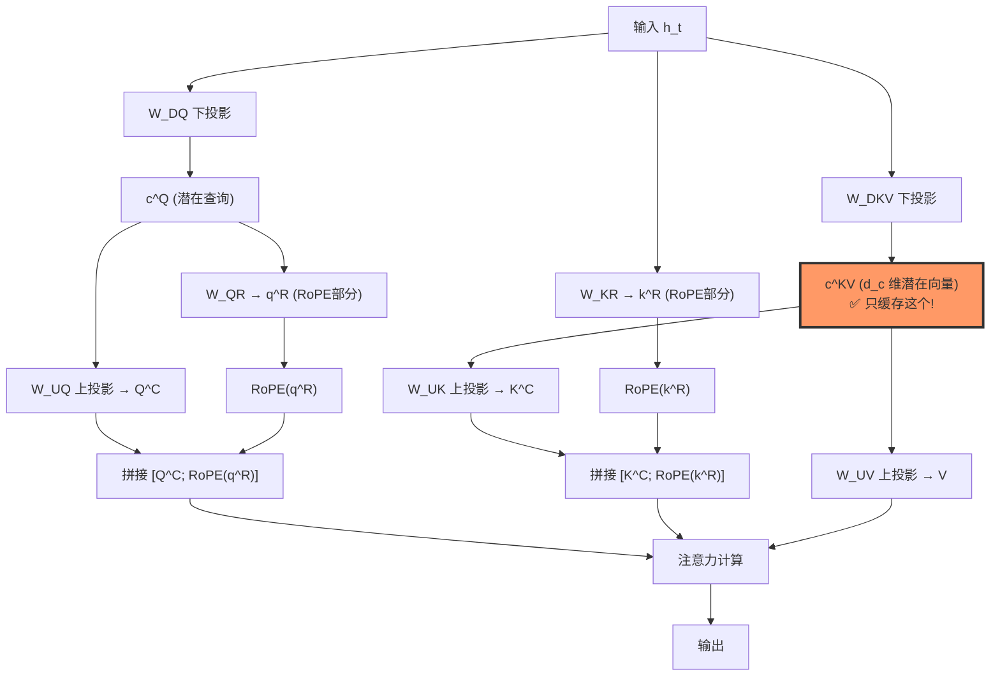

# Multi-Head Latent Attention (MLA)：KV 缓存优化革命

## 核心概念

> 来源：DeepSeek-V2 arXiv:2405.04434, Sec. 3.1

Multi-Head Latent Attention (MLA) 是 2025-2026 年 Transformer 架构的重大突破，核心思想是**将 Key-Value 张量压缩到共享潜在空间，而非为每个头存储全分辨率 KV**。这一创新显著减少了内存使用，同时保持模型质量。

### 解决的核心问题

传统 Multi-Head Attention (MHA) 在长序列推理中的致命问题：

#### KV 缓存瓶颈
- 内存占用：`O(layers × heads × seq_len × head_dim × 2)`
- 对于 Llama-2-7B (28k context)：KV 缓存约 14GB，与模型权重相当
- 推理性能不再受限于计算，而是受限于内存带宽和容量

#### 具体数据
- **标准 MHA**: 4096 维模型，32 头，每头 128 维 → 每 token 需 4096 值
- **MLA**: 压缩到 512 值 → **8x 内存减少**

## 技术原理

### 1. 低秩 KV 投影（Low-Rank KV Projection）

#### 数学基础

> 来源：DeepSeek-V2 arXiv:2405.04434, Eq. 3-7

标准 MHA：

$$Q = XW^Q, \quad K = XW^K, \quad V = XW^V$$

MLA 创新——通过低秩投影压缩 KV：

$$c^{KV}_t = W^{DKV} h_t \quad \text{(下投影, } d_c \ll d_h n_h \text{)}$$

$$k^C_{t,i} = W^{UK}_i c^{KV}_t, \quad v^C_{t,i} = W^{UV}_i c^{KV}_t \quad \text{(按需上投影恢复)}$$

其中 $d_c$ 是潜在维度（如 512），远小于 $n_h \cdot d_h$（如 32×128=4096）。**KV Cache 只需存储 $c^{KV}_t$**。

#### 关键优势
- **存储优化**: 只缓存低维潜在向量
- **带宽优化**: 减少内存访问
- **计算优化**: 利用过参数化的线性冗余

### 2. 上投影恢复（Up-Projection）

当需要进行注意力计算时，MLA 通过上投影恢复全分辨率表示：

$$K_{t,i} = W^{UK}_i \cdot c^{KV}_t, \quad V_{t,i} = W^{UV}_i \cdot c^{KV}_t$$

#### 计算优化技巧（吸收矩阵乘法）

> 来源：DeepSeek-V2 arXiv:2405.04434, Sec. 3.1.2

注意力分数 $q^T_i W^{UK}_i c^{KV}$ 可以改写为 $(W^{UK}_i{}^T q_i)^T c^{KV}$，即**将上投影矩阵吸收进 Query**，推理时只需缓存 $c^{KV}$ 而非完整 K。

### 3. 解耦 RoPE（Decoupled Rotary Position Embeddings）

> 来源：DeepSeek-V2 arXiv:2405.04434, Sec. 3.1.3

#### RoPE 在 MLA 中的挑战
- 低秩压缩和上投影无法与 RoPE 的非线性旋转操作"交换"——$\text{RoPE}(W^{UK} c^{KV}) \neq W^{UK} \text{RoPE}(c^{KV})$
- 标准做法会破坏位置编码的数学性质

#### 解耦方案

将 K/Q 分解为位置相关和位置无关两个部分：

$$k_{t,i} = \begin{bmatrix} k^{C}_{t,i} \\ \text{RoPE}(k^{R}_t, t) \end{bmatrix}, \quad q_{t,i} = \begin{bmatrix} q^{C}_{t,i} \\ \text{RoPE}(q^{R}_{t,i}, t) \end{bmatrix}$$

- **nope 部分** ($k^C, q^C$)：从潜在空间压缩/恢复，可吸收矩阵乘法
- **rope 部分** ($k^R, q^R$)：额外的小维度向量（$d^R_h$ 维），直接应用 [[Transformer 位置编码|RoPE]]
- **拼接后**计算注意力：位置信息由 rope 部分提供，内容信息由 nope 部分提供

### MLA 数据流架构



## 性能表现

### 内存效率对比

| 配置 | 标准 MHA | MLA | 减少倍数 |
|------|----------|-----|----------|
| 4096维模型, 32头 | 4096 值/token | 512 值/token | 8x |
| Llama-2-7B (28k) | ~14GB | ~1.75GB | 8x |
| DeepSeek-V2 | - | 93.7x 减少 | 93.7x |

### 计算性能
- **解码速度**: 线性提升
- **内存访问**: 显著减少
- **延迟**: 特别是长序列场景下大幅改善

### 实际应用效果
- **长文档处理**: 上下文窗口扩展到 128k+ tokens
- **批处理吞吐**: 内存效率提升支持更大批次
- **边缘部署**: 内存受限环境下的可行性

## 与现有方案对比

### vs 标准 Multi-Head Attention
| 维度 | 标准 MHA | MLA |
|------|----------|-----|
| KV 存储 | 每头全分辨率 | 共享潜在空间 |
| 内存复杂度 | O(L×H×D) | O(L×D_latent) |
| 计算复杂度 | O(L²×H×D) | O(L²×D_latent) |
| 位置编码 | 直接应用 | 解耦处理 |

### vs Grouped Query Attention (GQA)
- **GQA**: 减少 KV 头数量，多个 Q 头共享 KV
- **MLA**: 保持头数，但压缩 KV 维度
- **组合**: MLA + GQA 可进一步优化

### vs 其他 KV 缓存优化
- **量化**: 精度换空间，MLA 无精度损失
- **稀疏注意力**: 改变注意力模式，MLA 保持完整注意力
- **流式处理**: 丢弃历史，MLA 保持完整上下文

## 架构实现细节

### 核心模块设计
```python
class MultiHeadLatentAttention(nn.Module):
    def __init__(self, d_model, num_heads, q_latent_dim, kv_latent_dim):
        # Query 潜在投影
        self.Wq_d = nn.Linear(d_model, q_latent_dim)
        # 预计算 KV 上投影
        self.W_qk = nn.Linear(q_latent_dim, num_heads * kv_latent_dim)
        # KV 潜在投影
        self.Wkv_d = nn.Linear(d_model, kv_latent_dim)
        # V 上投影
        self.Wv_u = nn.Linear(kv_latent_dim, num_heads * head_dim)
```

### 前向传播流程
1. **压缩**: 输入 → 潜在空间 (`C_q`, `C_kv`)
2. **缓存**: 更新 KV 缓存（只存储潜在向量）
3. **计算**: 注意力分数计算
4. **恢复**: 上投影恢复 V 进行加权求和

### 优化技巧
- **预计算权重**: `W_q^u * W_k^u^T` 预计算缓存
- **并行处理**: 多头并行上投影
- **内存管理**: 动态 KV 缓存增长

## 在 DeepSeek 模型中的应用

### DeepSeek-V2 突破
- 首次大规模应用 MLA
- KV 缓存减少 **93.7 倍**
- 支持 128k+ 上下文长度

### 与其他技术的协同
- **MLA + MoE**: 同时优化内存和计算
- **MLA + FP8**: 进一步量化压缩
- **MLA + Multi-Token Prediction**: 加速训练

### V3/V4 演进
- V3: 优化 MLA 实现
- V4: 预计结合 [[DeepSeek Engram|DeepSeek Engram]] 条件记忆

## 行业影响

### 架构设计范式转变
- 从"更多参数"到"更智能压缩"
- 内存效率成为首要考虑
- 长上下文应用成为可能

### 硬件需求重构
- GPU 内存压力显著缓解
- DRAM 带宽重要性相对下降
- 边缘设备部署可行性提升

### 开源生态推动
- Hugging Face Transformers 支持
- 多个开源实现版本
- 成为新模型标准配置

## 面试要点

### 技术深度问题

#### Q1: MLA 如何实现内存压缩？
**核心机制**: 
- 将每头的 KV 向量（通常 128 维）压缩到共享潜在空间（如 16-64 维）
- 通过低秩矩阵分解利用 Transformer 过参数化特性
- 需要时通过上投影恢复，实现无损压缩

#### Q2: 解耦 RoPE 为什么必要？
**数学约束**: 
- RoPE 的旋转操作是非线性的
- 低秩压缩和 RoPE 不能"交换次序"
- 必须分离位置相关和位置无关部分
- 确保位置编码的数学性质不被破坏

#### Q3: MLA 与 GQA 的本质区别？
**优化维度不同**:
- GQA: 减少头数量（H 维度优化）
- MLA: 压缩头内容（D 维度优化）
- 可以组合使用实现双重优化

### 架构设计问题

#### Q1: 如何选择潜在空间维度？
**权衡考虑**:
- 太小: 表达能力不足，性能下降
- 太大: 压缩效果有限
- 经验: `kv_latent_dim = head_dim / 4 ~ head_dim / 8`
- 需要根据具体任务调优

#### Q2: MLA 的计算开销如何？
**复杂度分析**:
- 额外计算: 上投影矩阵乘法
- 预计算优化: `W_q^u * W_k^u^T` 缓存
- 净效应: 内存访问减少超过计算增加
- 特别是长序列场景下净收益明显

### 实际应用问题

#### Q1: MLA 适合什么场景？
**最佳应用**:
- 长上下文任务（文档分析、代码理解）
- 内存受限环境（边缘设备、移动端）
- 高并发推理（服务器批处理）
- 实时交互应用（对话系统）

#### Q2: 实现 MLA 的主要挑战？
**工程难点**:
- 需要重新设计 KV 缓存机制
- 预计算权重的内存管理
- 与现有优化（量化、并行）的兼容性
- 调试和性能调优复杂性

## 常见面试问题

**Q1: MLA 解决了什么核心问题？**
A: 传统 MHA 的 KV 缓存随序列长度和头数线性增长，成为长序列推理的内存瓶颈。MLA 通过将 KV 压缩到共享潜在空间，实现 8-100x 内存减少。

**Q2: MLA 的核心创新是什么？**
A: 三个关键创新：1）低秩 KV 投影压缩存储；2）按需上投影恢复计算；3）解耦 RoPE 处理位置编码。这些技术结合实现无损内存压缩。

**Q3: 为什么不直接量化 KV 缓存？**
A: 量化是精度换空间，而 MLA 是结构性优化。MLA 不损失精度，压缩比更高，且与量化技术可以组合使用。

**Q4: MLA 与稀疏注意力的区别？**
A: 稀疏注意力改变注意力模式（如 sliding window），可能丢失信息；MLA 保持完整注意力模式，只是优化存储和计算。

**Q5: MLA 的未来发展方向？**
A: 1）与条件记忆（Engram）结合；2）更智能的潜在空间设计；3）硬件专用加速；4）多模态扩展。

## 🔧 落地应用

### 直接可用场景
- **长上下文推理**：128K+ tokens 场景下 KV Cache 从 ~330GB 降至 ~10GB（70B 模型），使单节点推理成为可能
- **高并发服务**：KV Cache 减少 → 同一 GPU 可服务更多并发请求，vLLM 支持 MLA 的模型可显著提升 QPS
- **边缘部署**：内存受限环境（移动端/嵌入式）下使用 MLA 模型推理更可行

### 工程实现要点
- **潜在维度选择**：$d_c$ 通常为 $n_h \cdot d_h / 4 \sim n_h \cdot d_h / 8$，DeepSeek-V2 使用 $d_c = 512$（压缩比 8x）
- **RoPE 维度**：解耦 RoPE 部分维度 $d^R_h$ 远小于 $d_h$（如 64 vs 128），额外缓存开销很小
- **矩阵吸收**：推理时将 $W^{UK}$ 吸收进 Query 投影，避免上投影的额外计算

### 面试高频问法
- **Q: MLA 和 GQA 能不能结合？**
  A: 可以。GQA 减少 KV 头数量（$H$ 维度），MLA 压缩每头内容（$D$ 维度），两者正交可组合使用。
- **Q: MLA 有精度损失吗？**
  A: DeepSeek-V2 实验表明 MLA 在多个 benchmark 上与 MHA 持平甚至更优，因为低秩约束起到了正则化效果。

## 💡 启发与思考

### So What？对老板意味着什么
- MLA 证明了 KV 缓存存在巨大冗余——过参数化的 Transformer 中，KV 信息可以被压缩到 1/8 甚至 1/93 而不损失质量
- 这意味着**推理成本的核心瓶颈正在从"模型太大"转向"如何聪明地压缩"**

### 未解问题与局限
- MLA 的上投影增加了 prefill 阶段的计算量，对短序列场景可能得不偿失
- 解耦 RoPE 的额外缓存（$k^R_t$）在极端长上下文下仍会增长
- 目前只有 DeepSeek 系列大规模使用，其他模型（LLaMA、Qwen）仍用 GQA

### 脑暴：如果往下延伸
- MLA + [[长上下文技术|长上下文技术]]：MLA 的低 KV Cache 天然适配百万级上下文
- MLA 的思想是否可以扩展到**多模态**？视觉 token 的 KV 也可以压缩
- 如果把 MLA 和 FP8 KV Cache 量化结合，压缩比可能达到 **200x+**

## 📚 推荐阅读

### 原始论文
- [DeepSeek-V2: A Strong, Economical, and Efficient MoE LM](https://arxiv.org/abs/2405.04434) — MLA 的首次提出和大规模验证，Sec. 3.1 是核心
- [DeepSeek-V3 Technical Report](https://arxiv.org/abs/2412.19437) — MLA 在 V3 中的工程优化和 FP8 训练配合

### 深度解读
- [DeepSeek-V2 架构解读](https://zhuanlan.zhihu.com/p/700395369) — 知乎，⭐⭐⭐⭐，MLA 公式推导清晰
- [Understanding MLA: The Key Innovation Behind DeepSeek](https://magazine.sebastianraschka.com/p/understanding-multihead-latent-attention) — Sebastian Raschka 解读 ⭐⭐⭐⭐⭐

### 实践资源
- [HuggingFace DeepSeek-V2 模型](https://huggingface.co/deepseek-ai/DeepSeek-V2) — 可直接加载体验 MLA 架构
- [vLLM DeepSeek 支持](https://docs.vllm.ai/en/latest/) — 推理框架层面的 MLA KV Cache 优化

---

## See Also

- [[Attention 变体综述|Attention 变体综述]] — MHA/MQA/GQA/MLA 的完整对比图谱；MLA 是 KV 压缩维度的优化，与 GQA 的头数优化正交
- [[Transformer 位置编码|Transformer 位置编码]] — 解耦 RoPE 是 MLA 的关键设计挑战；理解 RoPE 才能理解为什么低秩压缩和旋转操作不可交换
- [[长上下文技术|长上下文技术]] — MLA 的低 KV Cache 是实现 128K+ 上下文的关键使能技术
- [[FlashAttention|FlashAttention]] — MLA 的注意力计算仍可用 FlashAttention 加速；IO 感知优化与 KV 压缩互补
- [[MoE 进阶|MoE 进阶]] — DeepSeek-V2/V3 同时采用 MLA + MoE，两者协同优化内存和计算