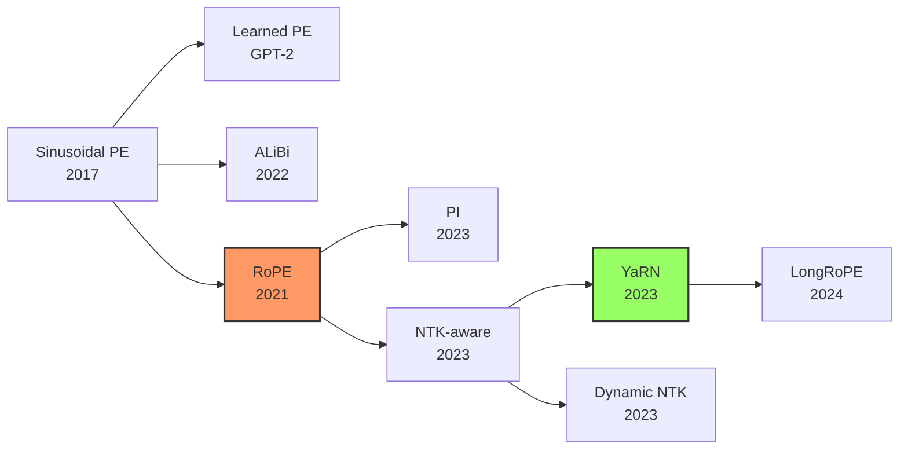

# Transformer 位置编码：从 Sinusoidal 到 YaRN

> 位置编码是 Transformer 感知序列顺序的唯一机制——从固定三角函数到旋转嵌入再到长上下文外推，理解这条演进线是 LLM 面试核心题

## 1. 为什么需要位置编码？

Transformer 的 Self-Attention 本质是**集合运算**——对输入 token 的排列具有置换不变性（permutation invariant）。没有位置编码，模型无法区分 "猫吃鱼" 和 "鱼吃猫"。

位置编码的核心需求：
- **唯一性**：每个位置有唯一表示
- **泛化性**：能处理训练时未见过的序列长度
- **相对关系**：能捕捉 token 间的距离信息
- **高效性**：不显著增加计算量

## 2. 绝对位置编码：Sinusoidal PE

### 原始 Transformer 方案（Vaswani et al., 2017）

```python
import torch
import math

def sinusoidal_pe(max_len: int, d_model: int) -> torch.Tensor:
    """经典正弦位置编码"""
    pe = torch.zeros(max_len, d_model)
    position = torch.arange(0, max_len).unsqueeze(1).float()
    div_term = torch.exp(
        torch.arange(0, d_model, 2).float() * (-math.log(10000.0) / d_model)
    )
    pe[:, 0::2] = torch.sin(position * div_term)  # 偶数维
    pe[:, 1::2] = torch.cos(position * div_term)  # 奇数维
    return pe  # [max_len, d_model]
```

核心公式：

> 来源：Vaswani et al. arXiv:1706.03762, Sec. 3.5

$$PE_{(pos, 2i)} = \sin\left(\frac{pos}{10000^{2i/d_{model}}}\right), \quad PE_{(pos, 2i+1)} = \cos\left(\frac{pos}{10000^{2i/d_{model}}}\right)$$

**设计直觉**：
- 不同维度使用不同频率的正弦/余弦函数，形成"频率谱"
- 低维度变化快（高频），高维度变化慢（低频）
- 关键性质：`PE(pos+k)` 可以表示为 `PE(pos)` 的线性变换 → 隐式编码相对位置

**局限性**：
- 绝对位置编码与内容无关，缺乏灵活性
- 外推能力有限——超出训练长度后性能急剧下降
- 直接加到 embedding 上，位置信号随层数衰减

## 3. 相对位置编码家族

### 3.1 ALiBi（Attention with Linear Biases）

Press et al., 2022 提出的极简方案——**不修改 embedding，直接在 attention score 上加线性偏置**：

```
Attention(Q, K, V) = softmax(QK^T / √d + m · [-(i-j)])V
```

其中 `m` 是每个 attention head 的固定斜率，几何级数分配：

```python
# ALiBi 斜率计算
def get_alibi_slopes(num_heads: int):
    """为每个 head 分配不同的衰减斜率"""
    closest_power_of_2 = 2 ** math.floor(math.log2(num_heads))
    base = 2 ** (-(2 ** -(math.log2(closest_power_of_2) - 3)))
    slopes = [base ** i for i in range(1, closest_power_of_2 + 1)]
    if closest_power_of_2 != num_heads:
        extra_base = 2 ** (-(2 ** -(math.log2(2 * closest_power_of_2) - 3)))
        extra_slopes = [extra_base ** i for i in range(1, 2 * (num_heads - closest_power_of_2) + 1, 2)]
        slopes = slopes + extra_slopes
    return slopes

# 8-head 示例: m = [1/2, 1/4, 1/8, ..., 1/256]
```

**优点**：
- 零参数，无需学习
- 天然外推——线性偏置对未见距离自动生效
- 实现极简，与 [[FlashAttention|FlashAttention]] 完美兼容

**缺点**：
- 单调线性衰减假设过于简单，不适合所有任务
- 效果不如 [[Transformer 位置编码|RoPE]] 在长上下文场景

代表模型：BLOOM、MPT

### 3.2 RoPE（Rotary Position Embedding）— 核心重点 ⭐

Su et al., 2021 提出，现已成为 **LLM 主流位置编码方案**（[[LLaMA|LLaMA]]、Qwen、[[DeepSeek-R1|DeepSeek]]、Mistral 均采用）。

#### 核心思想

> 来源：RoFormer arXiv:2104.09864 (Su et al., 2021)

**将位置信息编码为旋转角度**，对 Q/K 向量应用旋转矩阵：

$$f(\mathbf{x}, m) = \mathbf{x} \cdot e^{im\theta} \quad \text{(复数形式)}$$

对于 $d$ 维向量，将其视为 $d/2$ 个二维子空间，每个子空间独立旋转：

$$R_m \mathbf{q} = \begin{pmatrix} \cos m\theta_1 & -\sin m\theta_1 & & \\ \sin m\theta_1 & \cos m\theta_1 & & \\ & & \cos m\theta_2 & -\sin m\theta_2 \\ & & \sin m\theta_2 & \cos m\theta_2 \\ & & & & \ddots \end{pmatrix} \begin{pmatrix} q_1 \\ q_2 \\ q_3 \\ q_4 \\ \vdots \end{pmatrix}$$

其中 $\theta_i = 10000^{-2i/d}$，$m$ 为位置索引。

#### 关键性质

**内积只依赖相对位置**：

$$\langle f(\mathbf{q}, m), f(\mathbf{k}, n) \rangle = \langle R_m \mathbf{q}, R_n \mathbf{k} \rangle = \mathbf{q}^T R_{n-m} \mathbf{k} = g(\mathbf{q}, \mathbf{k}, n-m)$$

→ RoPE 在**绝对位置编码**的形式下实现了**相对位置编码**的效果！（利用旋转矩阵正交性：$R_m^T R_n = R_{n-m}$）

#### 高效实现

```python
import torch

def precompute_freqs_cis(dim: int, max_seq_len: int, theta: float = 10000.0):
    """预计算旋转频率（LLaMA 实现风格）"""
    freqs = 1.0 / (theta ** (torch.arange(0, dim, 2).float() / dim))
    t = torch.arange(max_seq_len)
    freqs = torch.outer(t, freqs)  # [seq_len, dim/2]
    freqs_cis = torch.polar(torch.ones_like(freqs), freqs)  # 复数形式 e^{iθ}
    return freqs_cis

def apply_rotary_emb(xq: torch.Tensor, xk: torch.Tensor, freqs_cis: torch.Tensor):
    """对 Q, K 应用旋转位置编码"""
    # xq, xk: [batch, seq_len, n_heads, head_dim]
    xq_ = torch.view_as_complex(xq.float().reshape(*xq.shape[:-1], -1, 2))
    xk_ = torch.view_as_complex(xk.float().reshape(*xk.shape[:-1], -1, 2))
    freqs_cis = freqs_cis[:xq_.shape[1]]  # 截取对应长度
    # 旋转操作 = 复数乘法
    xq_out = torch.view_as_real(xq_ * freqs_cis).flatten(-2)
    xk_out = torch.view_as_real(xk_ * freqs_cis).flatten(-2)
    return xq_out.type_as(xq), xk_out.type_as(xk)
```

#### 频率分布的直觉

| 维度 | 频率 $\theta_i$ | 波长 $\lambda_i = 2\pi / \theta_i$ | 作用 |
|------|-----------------|-------------------------------------|------|
| $i=0$ | $\theta_0 = 1.0$ | $\lambda_0 \approx 6.3$ | 高频，捕捉局部位置 |
| $i=16$ | $\theta_{16} = 10000^{-32/128}$ | $\lambda_{16} \approx 63$ | 中频 |
| $i=62$ | $\theta_{62} \approx 0.0001$ | $\lambda_{62} \approx 62832$ | 低频，捕捉全局位置 |

**"低维高频、高维低频"** → 类似傅里叶变换的频域分解。这也是外推问题的根源——高频维度先"用完"角度范围。

## 4. RoPE 的长上下文外推

RoPE 训练于固定长度 L_train，直接推理到 L > L_train 会崩溃——原因是**高频维度出现未见过的角度值**。

### 4.1 Position Interpolation (PI)

最朴素的方法——**等比缩小位置索引**：

```python
# 原始: θ(m) = m * freq
# PI:   θ(m) = (m * L_train / L_target) * freq
# 等价于将 [0, L_target] 压缩到 [0, L_train]
scale = L_train / L_target
freqs = freqs * scale  # 所有频率等比缩小
```

**问题**：高频信息被过度压缩，近距离 token 的区分度下降。

### 4.2 NTK-aware Interpolation

核心洞察来自 **Neural Tangent Kernel 理论**——高频分量比低频分量更难学习：

```python
def ntk_aware_rope(dim, max_seq_len, theta=10000.0, scale=1.0):
    """NTK-aware: 修改 base theta 而非缩放位置"""
    # 关键：调整 base，让高频维度几乎不变，低频维度做大幅插值
    theta_new = theta * scale ** (dim / (dim - 2))
    freqs = 1.0 / (theta_new ** (torch.arange(0, dim, 2).float() / dim))
    t = torch.arange(max_seq_len)
    return torch.outer(t, freqs)
```

**直觉**：高频维度对局部位置敏感，不该压缩；低频维度对全局位置敏感，可以大幅插值。NTK-aware 通过**调大 base θ** 实现非均匀缩放。

### 4.3 Dynamic NTK

根据实际输入长度**动态调整** scale factor：

```python
def dynamic_ntk_rope(dim, seq_len, max_trained_len, theta=10000.0):
    if seq_len <= max_trained_len:
        scale = 1.0
    else:
        scale = seq_len / max_trained_len
    # 使用 NTK-aware 公式动态计算
    theta_new = theta * scale ** (dim / (dim - 2))
    ...
```

### 4.4 YaRN（Yet another RoPE extensioN）

Peng et al., 2023（ICLR 2024）——目前最完善的 RoPE 外推方案，结合三个创新：

```
YaRN = NTK-by-parts + 温度缩放 + 少量微调

1. NTK-by-parts: 将频率维度分三组
   - 高频（λ < L_train）：不做插值，保持原样
   - 低频（λ > L_target）：做完全 PI 插值
   - 中间频率：线性混合插值

2. 温度缩放：对 attention logit 乘 √(1/t)
   → 补偿插值导致的 attention 分布变平

3. 仅需 ~400 steps 微调（vs PI 需要 ~10K steps）
```

```python
def yarn_rope(dim, max_seq_len, original_max=4096, target_max=128000, 
              beta_fast=32, beta_slow=1):
    """YaRN 频率计算（简化版）"""
    freqs = 1.0 / (10000 ** (torch.arange(0, dim, 2).float() / dim))
    
    # 计算每个维度的波长
    wavelengths = 2 * math.pi / freqs
    
    # 分三组
    scale = target_max / original_max
    low_freq_wavelen = original_max / beta_slow   # 低频阈值
    high_freq_wavelen = original_max / beta_fast   # 高频阈值
    
    new_freqs = []
    for i, freq in enumerate(freqs):
        wavelen = wavelengths[i].item()
        if wavelen < high_freq_wavelen:
            new_freqs.append(freq)         # 高频不动
        elif wavelen > low_freq_wavelen:
            new_freqs.append(freq / scale)  # 低频全插值
        else:
            # 中间：线性混合
            smooth = (wavelen - high_freq_wavelen) / (low_freq_wavelen - high_freq_wavelen)
            new_freqs.append((1 - smooth) * freq + smooth * freq / scale)
    
    return torch.tensor(new_freqs)
```

## 5. 演进对比总结

| 方法 | 类型 | 参数量 | 外推能力 | 计算开销 | 代表模型 |
|------|------|--------|----------|----------|----------|
| Sinusoidal | 绝对 | 0 | 弱 | $O(1)$ | 原始 Transformer |
| Learned PE | 绝对 | $N \times d$ | 无 | $O(1)$ | GPT-2, BERT |
| ALiBi | 相对偏置 | 0 | 强 | $O(1)$ | BLOOM, MPT |
| **RoPE** | 旋转 | 0 | 中等* | $O(n \cdot d)$ | LLaMA, Qwen, Mistral |
| + PI | 外推 | 0 | 中 | $O(1)$ | Meta 内部 |
| + NTK-aware | 外推 | 0 | 强 | $O(1)$ | CodeLlama |
| **+ YaRN** | 外推 | 0 | **最强** | $O(1)$ | LLaMA-YaRN, Qwen2.5 |

> \* RoPE 原生外推有限，但配合插值方法可达 128K+



## 6. 面试高频题

### Q1: RoPE 为什么能同时编码绝对和相对位置？
**答**：RoPE 对每个位置 m 的 Q/K 应用旋转矩阵 R(m)（绝对编码），但两个位置的内积 `<R(m)q, R(n)k> = q^T R(n-m) k` 只依赖差值 n-m（相对编码）。这是因为旋转矩阵的正交性：R(m)^T R(n) = R(n-m)。

### Q2: 为什么 RoPE 不能直接外推到更长序列？
**答**：训练时模型只见过 θ·m 在 [0, L_train·θ_max] 范围内的角度值。推理时 m > L_train，高频维度产生的角度值超出训练分布，导致 attention pattern 崩溃。形象地说，高频维度的"刻度盘"在训练范围内已经转了多圈，外推时转到了从未见过的位置。

### Q3: NTK-aware 为什么要区分高频和低频？
**答**：基于信息论直觉——高频维度编码局部精细位置关系（如相邻 token 的区别），压缩它们会损失近距离分辨率；低频维度编码全局粗略位置，天然适合插值。NTK 理论表明神经网络先学低频再学高频，因此对高频信息更需要保护。

### Q4: ALiBi vs RoPE，各自适用场景？
**答**：ALiBi 优势在零参数 + 天然外推 + 实现简单，适合不需要极长上下文的场景（BLOOM 用 2K 训练外推到 13K）；RoPE + YaRN 在超长上下文（64K-1M）场景更优，因为旋转嵌入保留了更丰富的位置信息。当前主流 LLM（LLaMA 3、Qwen2.5、DeepSeek-V3）全部选择 RoPE。

### Q5: YaRN 相比 PI 和 NTK-aware 有什么改进？为什么只需很少微调？
**答**：YaRN 综合了三个改进：(1) NTK-by-parts 对不同频率维度做差异化处理（高频不动/低频全插值/中频混合），比 NTK-aware 的全局缩放更精细；(2) 引入 attention 温度缩放，补偿插值导致的注意力熵增加；(3) 因为保持了高频维度不变且用温度校正了分布，模型只需约 400 steps 的微调就能适应新长度，效率比 PI（需 10K steps）高一个数量级。

---

## 🔧 落地应用

### 直接可用场景
- **模型微调时选择 RoPE base**：基于 NTK-aware 公式 $\theta' = \theta \cdot s^{d/(d-2)}$，根据目标上下文长度计算合适的 base
- **长上下文推理**：使用 Dynamic NTK 或 YaRN 无需微调即可将 4K 模型外推到 16-32K
- **自定义模型训练**：选择 RoPE + 合理 base（500K-8M）作为默认位置编码

### 工程实现要点
- **RoPE base 选择**：LLaMA 3 用 500K，Qwen2.5 用 1M，base 越大原生支持越长
- **YaRN 微调**：仅需 ~400 steps 即可适配新长度，远少于 PI 的 ~10K steps
- **兼容性**：RoPE 与 [[FlashAttention|FlashAttention]]、GQA 完美兼容

### 面试高频问法
- **Q: 为什么现在所有主流 LLM 都用 RoPE？**
  A: 三个关键优势——(1) 零参数，不增加模型大小；(2) 绝对形式实现相对编码；(3) 配合 YaRN 等方法可高效外推到 128K+。ALiBi 的线性衰减假设太简单，Learned PE 无法泛化。

## 💡 启发与思考

### So What？对老板意味着什么
- 位置编码是 LLM "理解顺序"的唯一手段——选错方案直接决定模型能不能处理长文档
- YaRN 证明了**不均匀频率处理**的威力：高频保持、低频插值，这种"差异化对待"的思想在其他领域也有借鉴价值

### 未解问题与局限
- RoPE 的旋转假设是否最优？是否存在比旋转更好的位置编码方式？
- 超长上下文（1M+）场景下，RoPE 外推仍有 PPL 退化，MiniMax-01 选择了线性注意力路线
- [[Multi-Head Latent Attention|MLA]] 中的解耦 RoPE 增加了额外维度，是否有更优雅的方案？

### 脑暴：如果往下延伸
- 位置编码和 [[长上下文技术|长上下文技术]] 是同一枚硬币的两面——外推能力直接决定上下文窗口天花板
- 如果把 RoPE 的频率分解思想应用到**多模态**（图像 patch 的 2D 位置编码），会怎样？

## 📚 推荐阅读

### 原始论文
- [RoFormer: Enhanced Transformer with Rotary Position Embedding](https://arxiv.org/abs/2104.09864) — RoPE 原始论文，数学推导优雅
- [ALiBi: Train Short, Test Long](https://arxiv.org/abs/2108.12409) — 极简位置编码方案，零参数外推
- [YaRN: Efficient Context Window Extension](https://arxiv.org/abs/2309.00071) — 当前最优外推方案，ICLR 2024
- [LongRoPE: Extending LLM Context Window Beyond 2M Tokens](https://arxiv.org/abs/2402.13753) — 搜索式非均匀缩放，ICML 2024

### 深度解读
- [Rotary Embeddings: A Relative Revolution](https://blog.eleuther.ai/rotary-embeddings/) — EleutherAI 出品，⭐⭐⭐⭐⭐，RoPE 直觉解释最佳
- [NTK-Aware Scaled RoPE](https://www.reddit.com/r/LocalLLaMA/comments/14lz7j5/ntkaware_scaled_rope_allows_llama_models_to_have/) — Kaiokendev 的 Reddit 原帖 ⭐⭐⭐⭐

### 实践资源
- [HuggingFace RoPE 实现](https://github.com/huggingface/transformers/blob/main/src/transformers/models/llama/modeling_llama.py) — LLaMA 模型中的 RoPE 代码
- [LLaMA 3 长上下文训练](https://arxiv.org/abs/2407.21783) — RoPE base 从 500K → 8M 的渐进扩展实践

---

## See Also

- [[长上下文技术|长上下文技术]] — RoPE 外推是长上下文的核心技术路线之一；YaRN/LongRoPE 在此文有更深入的工程实践讨论
- [[FlashAttention|FlashAttention]] — RoPE 的旋转操作与 FlashAttention 完美兼容；IO 感知计算不影响位置编码效果
- [[Attention 变体综述|Attention 变体综述]] — 位置编码和注意力变体共同定义 Transformer 的信息处理方式
- [[Multi-Head Latent Attention|MLA]] — MLA 中的解耦 RoPE 是位置编码与 KV 压缩结合的典型案例
- [[LLaMA|LLaMA]] — RoPE 的最重要工业应用，LLaMA 系列推动了 RoPE 成为事实标准
