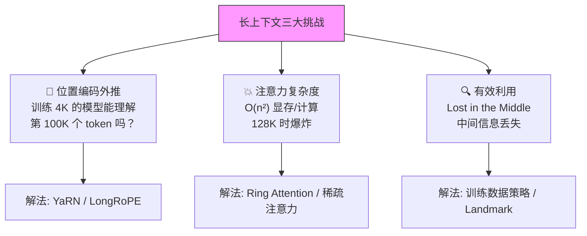
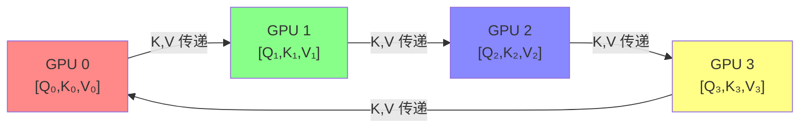
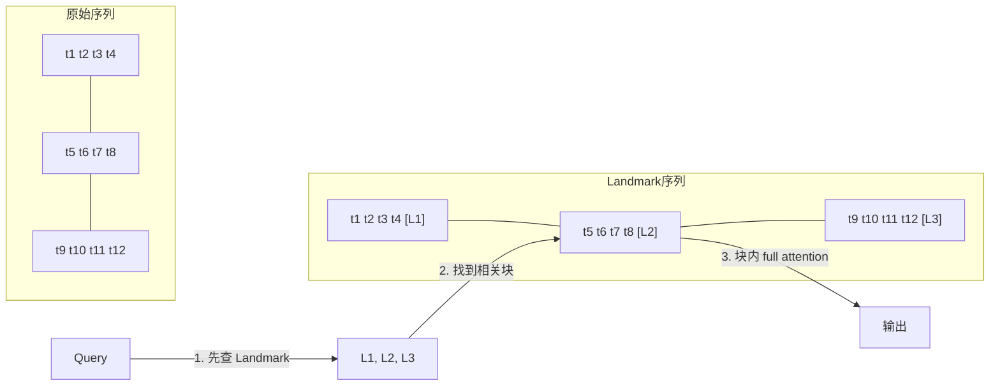

# 长上下文技术：从 4K 到 1M+ tokens

> 上下文窗口从 512 → 4K → 128K → 1M+ 的技术演进，核心在于**位置编码外推**与**注意力效率**

## 1. 长上下文的三大挑战



## 2. RoPE 基础与外推

### RoPE 回顾

参见 [[AI/3-LLM/Architecture/Transformer 位置编码|Transformer 位置编码]]。旋转位置编码 (Rotary Position Embedding) 的核心：

$$f(x, m) = x \cdot e^{im\theta}$$

其中 $\theta_i = 10000^{-2i/d}$ 是频率基底。token 位置 $m$ 通过旋转编码进 Q/K 向量。

**外推问题**：训练时只见过 $m \in [0, L_{train}]$，推理时 $m > L_{train}$ 的高频分量快速振荡 → attention score 退化。

### Position Interpolation (PI)

```
最简单的外推方案: 将位置缩放到训练范围内

原始:  θ(m) = m * θ_base
PI:    θ(m) = (m / scale) * θ_base,  scale = L_target / L_train

例: 训练 4K → 目标 32K → scale = 8
  位置 32000 → 压缩为 4000，在训练范围内

问题: 低频分量被过度压缩，近距离 token 的位置区分度下降
```

### NTK-Aware Scaling

```
核心洞察: 不应该统一缩放所有频率，高频分量需要更多保留

base' = base * scale^(d/(d-2))  # 修改频率基底

效果:
  高频维度 (编码近距离): 几乎不变 → 保持近距离精度
  低频维度 (编码远距离): 拉伸 → 支持更远位置

无需微调即可外推 2-4x，配合少量微调可达 8-16x
```

### Dynamic NTK

```python
def dynamic_ntk_rope(seq_len, base=10000, dim=128, max_position=4096):
    """动态 NTK: 根据实际序列长度自适应调整"""
    if seq_len > max_position:
        # 序列越长，缩放越大
        scale = seq_len / max_position
        base = base * (scale ** (dim / (dim - 2)))
    freqs = 1.0 / (base ** (torch.arange(0, dim, 2).float() / dim))
    t = torch.arange(seq_len)
    freqs = torch.outer(t, freqs)
    return torch.polar(torch.ones_like(freqs), freqs)
```

## 3. YaRN：高效上下文窗口扩展

### 核心创新

YaRN (Yet another RoPE extensioN) 结合了三种技术：

```
YaRN = NTK-Aware 插值 + Attention Scaling + 分频段处理

分频段策略:
  高频维度 (λ < threshold):  不插值（保持原样）
  低频维度 (λ > threshold):  全量插值
  中间维度:                  线性混合

Attention Scaling:
  在 softmax 前除以 √(1/t)，补偿插值导致的 entropy 变化
  其中 t = 0.1 × ln(scale) + 1
```

```python
def yarn_rope_scaling(dim, scale_factor, original_max_pos=4096,
                      beta_fast=32, beta_slow=1):
    """YaRN 分频段 RoPE 缩放"""
    freqs = 1.0 / (10000 ** (torch.arange(0, dim, 2).float() / dim))

    # 计算每个维度的波长
    wavelengths = 2 * torch.pi / freqs

    # 分频段
    low_freq_wavelen = original_max_pos / beta_slow   # 低频阈值
    high_freq_wavelen = original_max_pos / beta_fast   # 高频阈值

    new_freqs = []
    for i, freq in enumerate(freqs):
        wavelen = wavelengths[i]
        if wavelen > low_freq_wavelen:
            # 低频: 全量缩放 (Position Interpolation)
            new_freqs.append(freq / scale_factor)
        elif wavelen < high_freq_wavelen:
            # 高频: 不缩放
            new_freqs.append(freq)
        else:
            # 中间: 线性混合
            smooth = (wavelen - high_freq_wavelen) / (low_freq_wavelen - high_freq_wavelen)
            new_freq = (1 - smooth) * freq + smooth * (freq / scale_factor)
            new_freqs.append(new_freq)

    return torch.tensor(new_freqs)
```

### 效果

```
LLaMA 2 7B + YaRN:
  4K → 64K:   PPL 从 5.2 → 5.5 (仅 +0.3)
  4K → 128K:  PPL 从 5.2 → 6.1 (微调 400 steps)

对比:
  PI:          4K → 64K,  PPL = 7.8 (差)
  NTK-Aware:   4K → 64K,  PPL = 6.2 (中等)
  YaRN:        4K → 64K,  PPL = 5.5 (最好)
```

## 4. LongRoPE：扩展到 2M+ tokens

### 微软研究（ICML 2024）

```
LongRoPE 三大创新:

1. 非均匀 RoPE 缩放搜索
   不是手动分频段，而是用搜索算法找到每个维度的最优缩放因子
   搜索空间: 每个维度 [1, scale_factor] 的连续值
   优化目标: 最小化长序列上的 PPL

2. 渐进式扩展
   4K → 128K → 256K → 2048K (多步扩展，每步微调少量 steps)

3. 短上下文修复
   长上下文扩展后短上下文 PPL 会恶化
   用搜索找到短序列(<4K)的最优缩放因子，推理时根据输入长度切换
```

**已被集成到 Microsoft Phi-3 系列模型**。

## 5. Ring Attention：分布式长序列训练

### 核心思想

将长序列切分到多个设备上，每个设备只处理局部注意力，通过环形通信传递 KV：

> 来源：Ring Attention with Blockwise Transformers — arXiv:2310.01889 (Liu et al., 2023)



**流程**：
1. 每个 GPU 计算本地 $Q \times$ 本地 $K,V$
2. KV 沿环传递：GPU 0→1→2→3→0，每个 GPU 计算 $Q \times$ 收到的 KV，累积结果
3. 重复 $P-1$ 次，所有 GPU 见到所有 KV

**关键优化**：计算和通信重叠（overlap）— 计算本轮 attention 的同时传输下一轮的 KV → 通信几乎完全被隐藏。

```python
# Ring Attention 伪代码
def ring_attention(Q_local, K_local, V_local, world_size, rank):
    """分布式环形注意力"""
    K_recv, V_recv = K_local, V_local
    output = torch.zeros_like(Q_local)
    max_scores = torch.full((Q_local.shape[0],), -float('inf'))

    for step in range(world_size):
        # 异步发送 KV 到下一个 GPU
        send_req = isend(K_recv, V_recv, dst=(rank + 1) % world_size)
        recv_req = irecv(src=(rank - 1) % world_size)

        # 计算当前 KV 块的 attention（与通信重叠）
        scores = Q_local @ K_recv.T / sqrt(d_k)
        # Online softmax: 更新 max 和 output
        new_max = torch.max(max_scores, scores.max(dim=-1).values)
        # ... 增量更新 output（Flash Attention 风格）

        # 等待接收
        K_recv, V_recv = recv_req.wait()
        send_req.wait()

    return output
```

### 显存分析

$$\text{标准 Attention 显存} = O(n^2) \quad \text{→ 128K tokens 需 ~128 GB 仅 attention scores}$$

$$\text{Ring Attention 显存} = O\left(\frac{n^2}{P}\right) \quad \text{→ P=8 时降至 ~16 GB}$$

理论上序列长度可无限扩展（加更多 GPU）。

## 6. Landmark Attention

### 核心思想

在序列中插入 landmark tokens 作为"索引"，attention 先查 landmark 再深入对应块：



**复杂度**：$O(n\sqrt{n})$ 代替 $O(n^2)$

## 7. 实际 128K/1M 支持方案

### 模型实现对比

| 模型 | 上下文长度 | 核心技术 | 训练策略 |
|------|-----------|---------|---------|
| GPT-4 Turbo | 128K | 未公开 | 从短到长渐进训练 |
| Claude 3.5 | 200K | 未公开 | — |
| LLaMA 3.1 | 128K | RoPE + 渐进扩展 | 8K→128K 两阶段 |
| Gemini 1.5 Pro | 1M→2M | Ring Attention + 稀疏 | 多阶段训练 |
| DeepSeek-V3 | 128K | MLA + YaRN | 4K→32K→128K |
| Qwen 2.5 | 128K→1M | YaRN + NTKI | 渐进扩展 |
| MiniMax-01 | 4M | Lightning Attention | 线性复杂度 |

### 渐进扩展训练策略 (LLaMA 3.1)

```
阶段 1: 标准预训练 at 8K context
  数据: 15T tokens
  RoPE base: 500,000

阶段 2: 长上下文微调 at 128K context
  数据: ~800B tokens (长文本上采样)
  RoPE base: 500,000 → 8,000,000 (逐步提升)
  训练技巧:
    - 长文本比例逐步增加
    - 序列打包 (packing) 提高 GPU 利用率
    - GQA 减少 KV Cache 显存
```

### 实际效果与"大海捞针" (NIAH) 测试

```
Needle-in-a-Haystack Test:
  在长文本中随机位置插入一个事实 ("needle")
  让模型回答相关问题

结果 (2025):
  模型           上下文    NIAH 准确率
  GPT-4 Turbo   128K     ~98%
  Claude 3.5    200K     ~99%
  LLaMA 3.1 8B  128K     ~95%
  Qwen 2.5 72B  128K     ~97%

  "Lost in the Middle" 问题:
  - 大部分模型在文本中间的 recall 低于头部和尾部
  - 靠近位置 40-60% 处 recall 最差
  - 缓解方法: 位置编码优化 + 训练时随机化 needle 位置
```

## 8. 工程实践

### KV Cache 管理

```
128K 上下文 × 70B 模型 × FP16:
  MHA: KV Cache = 2 × 64 × 128 × 80 × 128K × 2 bytes = ~330 GB
  GQA(G=8): = ~41 GB (可接受)
  MLA(d_c=512): = ~10 GB (非常好)

PagedAttention (vLLM) + GQA:
  动态分配 KV Cache 页 → 避免预分配最大长度的显存
  → 同一 GPU 可同时服务短序列和长序列请求
```

### 推理优化工具链

```
vLLM:       PagedAttention + Continuous Batching
TensorRT-LLM: FlashAttention-2 + FP8 KV Cache 量化
SGLang:     RadixAttention (前缀共享)

长上下文推理的关键:
  1. KV Cache 量化 (FP8/INT4) → 显存减半
  2. Sliding Window Attention → 限制每层实际 attention 范围
  3. Prefix Caching → 相同前缀的请求共享 KV Cache
```

## 面试常见问题

### Q1: RoPE 为什么不能直接外推？有哪些解决方案？

RoPE 通过 $e^{im\theta_j}$ 编码位置 $m$，其中 $\theta_j$ 是频率基底。训练时只见过 $m \leq L_{train}$ 的位置。外推时 $m > L_{train}$，高频分量（大 $\theta_j$）角度超过 $2\pi$ 后快速振荡，导致 attention score 退化。解决方案按效果排序：**YaRN**（分频段差异化缩放+attention scaling，效果最好）> **NTK-Aware**（修改基底，中等效果）> **Position Interpolation**（均匀压缩，简单但近距离精度下降）> **LongRoPE**（搜索每维最优缩放因子，扩展到 2M+ 但需要多步微调）。

### Q2: Ring Attention 是如何实现百万级上下文的？

Ring Attention 将长序列切成 $P$ 段分到 $P$ 个 GPU，每个 GPU 持有局部 Q 和 KV。通过 $P-1$ 轮环形通信，每轮将 KV 传给下一个 GPU，每个 GPU 逐步与所有 KV 做 attention。关键在于**计算-通信重叠**：当前轮计算 attention 时同时传输下一轮的 KV，使通信开销几乎为零。显存从 $O(n^2)$ 降至 $O(n^2/P)$，理论上加 GPU 可无限扩展。配合 [[AI/3-LLM/Architecture/FlashAttention|FlashAttention]] 的 online softmax，无需存储完整 attention 矩阵。

### Q3: "Lost in the Middle" 问题是什么？如何缓解？

实验发现，LLM 对长上下文中间位置的信息 recall 显著低于头部和尾部（U 形曲线）。原因是：(1) 位置编码的"近端偏差"——RoPE 的相对位置编码让模型天然更关注近距离 token；(2) 训练数据中重要信息更多出现在开头/结尾。缓解方法：(1) 训练时随机化关键信息位置；(2) 推理时将关键内容放在开头或结尾；(3) 使用 RAG + reranking 将相关信息集中呈现；(4) Landmark Attention 等稀疏注意力方案。

### Q4: 渐进扩展训练策略是什么？为什么不直接训 128K？

直接在 128K 训练有两个问题：(1) **计算成本**——$O(n^2)$ 使得 128K 比 8K 慢 256 倍；(2) **长文本数据稀缺**——高质量 128K+ 文本远少于短文本。渐进策略（LLaMA 3.1）：先在 8K 完成绝大部分预训练（15T tokens），再用 ~800B 长文本 tokens 做第二阶段，逐步提高 RoPE base 和序列长度。这样用 ~5% 的额外计算就能获得 128K 能力。关键技巧：长文本上采样、序列打包、GQA 降低 KV Cache。

### Q5: 4M token 上下文的 MiniMax-01 用了什么技术？

MiniMax-01 基于**混合注意力架构**：大部分层用 Lightning Attention（线性复杂度的硬件优化线性注意力），少数关键层用 softmax attention。这避免了 $O(n^2)$ 瓶颈。配合 sliding window + global attention 的组合，每层只关注局部窗口内的 token（近距离精确），全局信息通过 linear attention 层传递。显存方面，linear attention 不需要 KV Cache（可用 RNN 形式递推），从而在 4M 长度下仍可推理。代价是 in-context recall 能力弱于纯 softmax attention，因此需要仔细选择哪些层保留 softmax。

---

## 🔧 落地应用

### 直接可用场景
- **长文档分析**：128K 上下文可直接处理 ~200 页 PDF（无需 RAG 切分），适用于合同审核、论文综述
- **代码仓库理解**：整个代码库丢进上下文窗口，减少对 RAG 的依赖
- **多轮对话**：长上下文替代传统的对话摘要策略，保持完整对话历史

### 工程实现要点
- **KV Cache 管理**：128K × 70B 的 GQA 模型 KV Cache ~41GB，必须用 PagedAttention + FP8 量化
- **YaRN 快速适配**：从 4K 扩展到 64K 仅需 400 steps 微调，成本极低
- **StreamingLLM**：无限长度推理的工程方案——保留 attention sink tokens + sliding window，适合持续对话场景

### 面试高频问法
- **Q: 长上下文 vs RAG，什么时候用哪个？**
  A: 长上下文适合需要全局理解的任务（总结、推理）；RAG 适合精确检索（问答、引用）。"Lost in the Middle" 问题使得 RAG + rerank 在精确检索场景仍更优。两者互补而非替代。

## 💡 启发与思考

### So What？对老板意味着什么
- 128K-1M 上下文正在重塑应用架构——很多之前需要复杂 RAG pipeline 的场景可以简化为"全文丢进去"
- 但**有效利用率**仍是软肋：128K 上下文不意味着模型真的理解了 128K 个 token

### 未解问题与局限
- **Lost in the Middle** 问题尚未根本解决——U 形 recall 曲线在所有模型中普遍存在
- 长上下文训练数据稀缺：高质量 128K+ 文本远少于短文本，上采样会引入偏差
- $O(n^2)$ 的注意力在 1M+ 时仍是计算瓶颈，线性注意力方案（如 Lightning Attention）尚未证明等效质量

### 脑暴：如果往下延伸
- [[AI/3-LLM/Architecture/Multi-Head Latent Attention|MLA]] 的 KV 压缩 + 长上下文 = 内存和长度同时突破
- 如果把 Landmark Attention 和 RAG 结合——模型内部自带"索引"，外部 RAG 提供精确检索？
- 无限上下文的终极方案可能不是扩展窗口，而是**学会遗忘**（StreamingLLM 思路的进化）

## 📚 推荐阅读

### 原始论文
- [YaRN: Efficient Context Window Extension of LLMs](https://arxiv.org/abs/2309.00071) — 当前最优 RoPE 外推方案 ⭐⭐⭐⭐⭐
- [LongRoPE: Extending LLM Context Window Beyond 2M Tokens](https://arxiv.org/abs/2402.13753) — 搜索式非均匀缩放，ICML 2024
- [Ring Attention with Blockwise Transformers](https://arxiv.org/abs/2310.01889) — 分布式序列并行的优雅方案
- [Efficient Streaming Language Models with Attention Sinks](https://arxiv.org/abs/2309.17453) — StreamingLLM，无限长度推理

### 深度解读
- [The Llama 3 Herd of Models](https://arxiv.org/abs/2407.21783) — Meta 官方论文，Sec. 3.4 长上下文训练策略 ⭐⭐⭐⭐⭐
- [Transformer长上下文技术综述](https://zhuanlan.zhihu.com/p/680545147) — 知乎，中文全景解读 ⭐⭐⭐⭐

### 实践资源
- [vLLM PagedAttention](https://docs.vllm.ai/) — 长上下文推理的工程核心
- [LongBench 评测](https://github.com/THUDM/LongBench) — 长上下文能力评测基准

---

## See Also

- [[AI/3-LLM/Architecture/Transformer 位置编码|Transformer 位置编码]] — RoPE 基础：长上下文技术的核心挑战正是位置编码外推问题（训练分布外的位置如何泛化）
- [[AI/3-LLM/Architecture/Attention 变体综述|Attention 变体综述]] — MLA/GQA/MQA/Flash等注意力变体全景；长上下文场景下降低KV Cache是核心设计目标
- [[AI/3-LLM/Architecture/FlashAttention|FlashAttention]] — IO感知精确注意力计算；长上下文O(n²)复杂度的硬件优化解法（Ring Attention在此基础上做分布式扩展）
- [[AI/6-应用/RAG/Advanced RAG|Advanced RAG]] — 长上下文 vs RAG 的战略选择：100K+上下文降低了RAG需求，但"Lost in the Middle"问题使RAG+精确rerank在某些场景仍更优
- [[AI/3-LLM/Inference/推理优化|LLM推理优化2026全景]] ⭐ — KV Cache管理（PagedAttention/StreamingLLM/量化）是长上下文推理的工程核心，与本文位置编码/注意力理论形成架构+工程配套

### Star Attention（Google DeepMind）
块状稀疏注意力，序列切块后 local+global attention，节省 80%+ 显存。

### Continue Pre-Training 扩展策略
先短序列预训练 → 逐步扩展（LLaMA 3.1 的标准做法）。

### ABF（Attention Bridge Function）
通过特殊 bridge token 连接长序列块，适合超长文档检索。
