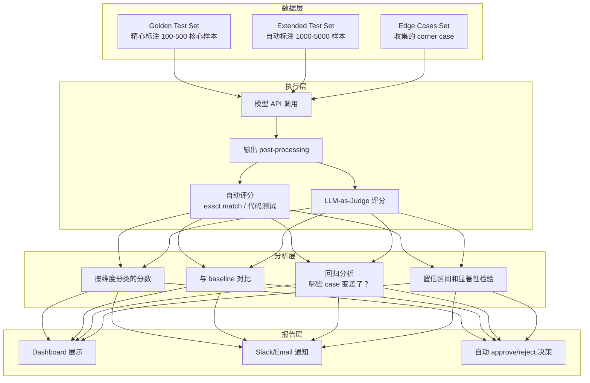
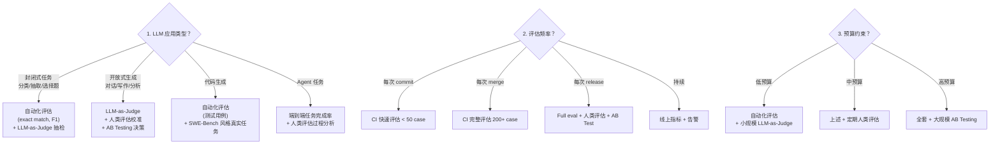

# LLM 评估与 Benchmark 2026 技术全景

> "If you can't measure it, you can't improve it." — Peter Drucker
>
> 但在 LLM 时代，更准确的说法是："If you measure it wrong, you'll improve the wrong thing."

## 目录

1. [评估维度总览](#1-评估维度总览)
2. [主流 Benchmark 详解](#2-主流-benchmark-详解)
3. [自动化评估 vs 人类评估 vs LLM-as-Judge](#3-自动化评估-vs-人类评估-vs-llm-as-judge)
4. [评估陷阱](#4-评估陷阱数据污染刷榜与指标幻觉)
5. [Benchmark Saturation 问题](#5-benchmark-saturation-问题)
6. [2026 新趋势](#6-2026-新趋势)
7. [实际工程中的评估策略](#7-实际工程中的评估策略)
8. [面试题精选](#8-面试题精选12-道)

---

## 1. 评估维度总览

LLM 的能力是多维的，没有单一指标可以衡量一个模型的"好坏"。2026 年的评估体系已经从早期的"跑一个 benchmark 出个分"演变为一个多层次、多维度的评估矩阵。

### 1.1 语言理解（Natural Language Understanding）

**核心能力：** 阅读理解、文本分类、自然语言推断（NLI）、语义相似度、信息抽取。

**技术细节：**

语言理解是 NLP 最经典的评估维度，从 GLUE/SuperGLUE 时代延续至今。但在 LLM 时代，传统的 NLU benchmark 基本被"解决"了——GPT-4 级别的模型在 SuperGLUE 上已经超越人类表现。

现代 LLM 的语言理解评估更关注以下方面：

- **长文本理解**：Needle-in-a-Haystack 测试、LongBench、RULER 等。模型能否在 100K+ token 的上下文中准确找到并利用关键信息？这不仅测理解能力，还测 attention 机制的有效性。
- **多语言理解**：不仅是翻译，而是能否在非英语语言中保持同等水平的推理和理解。MMMLU（Massive Multilingual MMLU）覆盖 50+ 语言。
- **隐含推理**：给出不完整或模糊的信息，模型能否做出合理推断。这涉及 pragmatics（语用学）层面的理解。
- **指令遵循（Instruction Following）**：IFEval 测试模型能否精确遵循复杂的格式化指令（如"回答必须恰好 3 段，每段以动词开头"）。

**实践经验：**

在实际项目中，语言理解的评估往往被嵌入到更复杂的任务中。比如我们不会单独测"模型能不能理解这段话"，而是测"模型能不能基于这篇 10 页的文档回答一个复杂问题"。RAG 场景下的理解能力评估尤为重要——模型是否能正确识别检索到的 chunk 中哪些与 query 相关、哪些是噪音。

**面试考点：**
- 为什么 SuperGLUE 在 LLM 时代已经不够用？（天花板效应 + 格式简单 + 不需要生成）
- Needle-in-a-Haystack 测试的原理和局限性是什么？（只测检索不测推理 + 针的位置分布影响 + 真实文档不是随机插入）

### 1.2 语言生成（Natural Language Generation）

**核心能力：** 文本流畅性、连贯性、多样性、风格控制、长文本生成。

**技术细节：**

语言生成的评估是 LLM 评估中最难的维度之一，因为"好的生成"本身就是主观的。

自动评估指标的演进：
- **BLEU/ROUGE**（古典时代）：基于 n-gram 重叠。严重问题：与人类判断相关性低，惩罚合理的 paraphrase，奖励死板的复制。在 LLM 时代基本只用于机器翻译和摘要的粗筛。
- **BERTScore**：用 BERT embedding 计算语义相似度。比 BLEU 好，但仍然需要参考答案。
- **Perplexity**：衡量模型对文本的"惊讶程度"。低 perplexity ≠ 好文本（模型可能生成极其无聊但 perplexity 低的内容）。
- **GPT-4/Claude-as-Judge**（现代）：用强模型评估弱模型的生成质量。成为 2025-2026 年的主流方法。

生成质量的维度拆解：
1. **Fluency（流畅性）**：语法正确、表达自然。现代 LLM 基本都过关。
2. **Coherence（连贯性）**：段落间逻辑连贯。长文本生成是挑战。
3. **Relevance（相关性）**：生成内容是否紧扣主题/指令。
4. **Factuality（事实性）**：生成内容是否符合事实。Hallucination 评估。
5. **Helpfulness（有用性）**：生成内容是否真正帮助了用户。
6. **Harmlessness（无害性）**：生成内容是否安全。

**实践经验：**

生成质量评估在生产环境中最常用的方法是 **AB Testing + 人类评估子集 + LLM-as-Judge 全集**。纯自动指标太不可靠，纯人类评估太贵。混合策略是唯一可行的路线。一个实用的 pipeline 是：先用 LLM-as-Judge 做大规模筛选，再对 top/bottom 10% 的 case 做人工复核。

**面试考点：**
- BLEU 在 LLM 评估中为什么失效？（不捕获语义、惩罚创造性、需要参考答案）
- 如何评估长文本（10K+ tokens）的生成质量？（分层评估：段落级连贯性 + 全局主题一致性 + 事实核查）

### 1.3 推理能力（Reasoning）

**核心能力：** 逻辑推理、常识推理、因果推理、类比推理、多步推理。

**技术细节：**

推理是 2024-2026 年 LLM 能力评估的核心战场。OpenAI 的 o1/o3、Anthropic 的 Claude 3.5/4、DeepSeek-R1 等模型的核心差异化就在推理能力上。

推理能力的分类：
- **演绎推理（Deductive）**：从一般到特殊。"所有人都会死 + 苏格拉底是人 → 苏格拉底会死"。
- **归纳推理（Inductive）**：从特殊到一般。观察到 100 只白天鹅 → 猜测所有天鹅是白的。
- **溯因推理（Abductive）**：给定观察，推测最佳解释。"地面湿了 → 大概率下过雨"。
- **类比推理（Analogical）**："A 之于 B，如同 C 之于？"
- **多步推理（Multi-hop）**：需要串联多个推理步骤。这是最能区分模型水平的维度。

关键 Benchmark：
- **GPQA（Graduate-Level Google-Proof Q&A）**：博士级别的科学推理题，设计上确保 Google 搜索无法直接找到答案。
- **ARC-AGI**：Abstraction and Reasoning Corpus，评估模型的抽象推理和模式发现能力。
- **BBH（Big-Bench Hard）**：从 BIG-Bench 中挑选出最难的 23 个子任务。
- **GSM8K → MATH → AIME**：数学推理的难度阶梯。

Chain-of-Thought（CoT）对推理评估的影响巨大。同一个模型，加不加 CoT prompting 的推理分数可以差 20-40 个百分点。这引出一个重要问题：**我们评估的是模型的内在能力，还是 prompting 技巧的效果？** 2025 年后，标准做法是报告 CoT 和 non-CoT 两个分数。

**实践经验：**

推理评估的最大坑：**模型可能通过 pattern matching 而非真正推理来解题**。比如 GSM8K 中的数学题，很多遵循固定的模板（"A有X个，B比A多Y个，问总共多少"），模型完全可以靠模式匹配"解题"而非真正理解数学关系。用 perturbation testing（改变题目中的无关细节，看答案是否稳定）可以检测这一点。

**面试考点：**
- Chain-of-Thought prompting 为什么能提升推理分数？它提升的是真实推理能力吗？（内部"计算深度"增加 + 未必是真推理，可能是更好的 pattern recall + 给模型更多"推理 token"）
- 如何设计一个评估来区分"真推理"和"模式匹配"？（perturbation testing、counterfactual testing、OOD generalization）

### 1.4 代码能力（Coding）

**核心能力：** 代码生成、代码补全、Bug 修复、代码理解、测试生成、软件工程。

**技术细节：**

代码评估是 LLM 评估中最"可验证"的维度之一——代码跑得通就是跑得通，单元测试过了就是过了。但事情远没有这么简单。

评估层次：
1. **函数级代码生成**：HumanEval（164 题）、MBPP（974 题）。给定 docstring，生成函数体，用测试用例验证。
2. **仓库级代码理解与修改**：SWE-Bench。给定一个真实的 GitHub issue 和对应的代码仓库，模型需要定位问题并生成正确的 patch。
3. **代码推理**：CRUXEval 测试模型能否预测代码的输出或推理代码的行为。
4. **多语言代码生成**：MultiPL-E 将 HumanEval 翻译到 18 种编程语言。
5. **竞赛编程**：CodeContests（来自 Codeforces 等竞赛平台）。

Pass@k 指标解析：
- **Pass@1**：模型生成一次，通过测试的概率。最严格。
- **Pass@10**：生成 10 次，至少一次通过的概率。反映模型的搜索能力。
- 计算公式：`Pass@k = 1 - C(n-c, k) / C(n, k)`，其中 n 是总生成数，c 是通过数。
- 实践中常用 temperature=0.8 生成多个样本，再用无偏估计器计算 Pass@k。

SWE-Bench 深入分析：
- SWE-Bench Full：2294 个来自 12 个 Python 仓库的真实 GitHub issue。
- SWE-Bench Lite：300 个经过筛选的子集，排除了需要外部资源或环境的 issue。
- SWE-Bench Verified：由人工验证过的更高质量子集。
- 截至 2025 底/2026 初，顶尖系统（如配合 Agent 框架的 Claude 3.5 Sonnet / GPT-4o）在 SWE-Bench Verified 上的 resolve rate 达到 50-60%。
- **关键挑战**：SWE-Bench 测的不仅是代码能力，还有定位能力（在大型 codebase 中找到相关文件）、理解能力（理解项目架构和编码规范）、规划能力（分解复杂 issue 为子任务）。

**实践经验：**

HumanEval 分数和真实编码能力的相关性在下降。一个 HumanEval Pass@1 > 90% 的模型，在实际工程场景中可能表现很差，因为 HumanEval 的题目都是自包含的短函数，不涉及多文件交互、依赖管理、API 调用等真实场景。**SWE-Bench 更接近真实，但也不完美**——它的 issue 都来自知名开源项目，训练数据中大概率包含这些项目的代码。

实际工程评估代码能力的建议：用内部私有代码库 + 真实 ticket 构建评估集，确保模型没见过这些代码。

**面试考点：**
- Pass@1 和 Pass@10 分别衡量什么能力？（确定性 vs 搜索能力）
- HumanEval 有什么局限性？SWE-Bench 如何改进？（短函数 vs 真实工程、自包含 vs 仓库级、简单测试 vs 复杂验证）
- 为什么说 SWE-Bench 仍然不够完美？（数据污染风险 + 只覆盖 bug fix 不覆盖 feature development + Python only bias）

### 1.5 数学能力（Mathematics）

**核心能力：** 算术运算、代数、几何、概率统计、数论、组合数学、证明。

**技术细节：**

数学评估是推理评估的一个特化维度，但足够重要，值得单独讨论。

Benchmark 难度阶梯：
```
GSM8K（小学/初中）→ MATH（高中竞赛）→ AIME（美国数学邀请赛）→ Putnam / IMO 级别
```

各层次详解：
- **GSM8K**（8.5K 题）：主要是多步算术文字题。Grade school level。目前 SOTA 模型已经接近 95%+，基本饱和。
- **MATH**（12.5K 题）：7 个类别（代数、数论、几何等），5 个难度级别。Level 5 的题目非常具有挑战性，需要创造性的解题思路。
- **AIME**（American Invitational Mathematics Examination）：每年 15 题，答案都是 0-999 的整数。2024 年的 AIME 被广泛用于评估 o1/o3 级别模型。
- **Minerva Math**：来自 Google 的数学评估，包含大学级别的数学题。
- **OlympiadBench**：国际奥林匹克竞赛级别的题目。

数学评估的特殊挑战：
1. **答案验证**：数学答案可以有多种等价形式（如 `1/2` = `0.5` = `sin(30°)`）。需要 symbolic equivalence checking，不能简单做字符串匹配。
2. **解题过程评估**：正确答案可能来自错误的推理过程（运气好抵消了两个错误）。过程评估（process evaluation）是 2026 年的重要趋势。
3. **Prompt sensitivity**：同一道题换个表述，模型的正确率可能变化很大。

**实践经验：**

数学评估中一个容易被忽视的问题：**计算工具的使用**。在实际场景中，LLM 经常会调用 Python interpreter 或 Calculator 来辅助计算。那么评估的时候是否允许工具调用？这直接影响分数，也影响评估的意义。o1/o3 模型在"纯推理"（无工具）模式下的数学能力和"有工具"模式下差异巨大。

**面试考点：**
- 为什么 GSM8K 不足以评估现代 LLM 的数学能力？（太简单 + 模式固定 + 已饱和）
- 数学评估中答案验证的难点是什么？（等价形式 + symbolic checking + 近似值处理）

### 1.6 多模态能力（Multimodal）

**核心能力：** 图像理解、视觉问答、图表解析、OCR、视频理解、音频理解、跨模态推理。

**技术细节：**

随着 GPT-4V/o、Claude 3.x Vision、Gemini 等多模态模型的成熟，多模态评估成为 2025-2026 年的重要维度。

主要 Benchmark：
- **MMMU（Massive Multi-discipline Multimodal Understanding）**：大学级别的多学科多模态题目，包含图表、公式、图像等。约 11.5K 题，覆盖 30+ 学科。
- **MathVista**：数学相关的视觉问答。需要理解图表、几何图形等。
- **ChartQA / PlotQA**：图表理解和数据提取。
- **DocVQA**：文档级视觉问答，需要理解复杂的文档布局。
- **RealWorldQA**：Meta 发布的真实世界场景理解评估。
- **Video-MME**：视频理解评估。
- **AI2D**：科学图表理解。

多模态评估的特殊挑战：
1. **跨模态推理**：不仅要理解图像和文本各自的内容，还要能在两者之间建立关联并推理。
2. **Fine-grained perception**：模型能否看到图像中的小细节？比如图表中的小数据标签。
3. **Hallucination in vision**：视觉幻觉比文本幻觉更难检测。模型可能"看到"图像中不存在的物体。
4. **空间推理**：理解物体的相对位置、方向、大小关系。

**实践经验：**

多模态评估在实际应用中最大的 gap 是：**benchmark 中的图像都是清晰的、标准化的，而真实用户发来的图像可能是模糊的、倾斜的、部分遮挡的**。我们在内部测试中发现，模型在 DocVQA 上分数很高，但在用户随手拍的文档照片上表现大幅下降。建议在评估集中加入"劣化数据"（模糊、低分辨率、光线不足等）。

**面试考点：**
- 多模态模型的幻觉问题和纯文本模型有何不同？（更难检测 + 视觉 grounding 不足 + 模型可能依赖文本 prior 忽略图像内容）
- 如何评估模型的"真正看图"能力 vs "猜图"能力？（perturbation testing：修改图像细节看回答是否变化）

### 1.7 安全性（Safety）

**核心能力：** 拒绝有害请求、抵抗 jailbreak、不生成有毒内容、隐私保护。

**技术细节：**

安全评估是最具争议性的维度。"安全"的定义本身就是主观的、文化相关的、不断演变的。

评估框架：
- **ToxiGen**：测试模型是否生成针对特定群体的有毒内容。13 个目标群体，包含隐性和显性毒性。
- **RealToxicityPrompts**：给模型一个可能导致有毒输出的 prompt，看模型是否会生成有毒续写。
- **HarmBench**：系统化的有害行为评估框架，覆盖多种攻击类型。
- **Red-teaming benchmarks**：PAIR、TAP、GCG 等自动化 red-teaming 方法。
- **AdvBench**：adversarial prompt 集合，测试模型的 jailbreak 抵抗力。
- **XSTest**：测试模型是否"过度安全"（即拒绝完全无害的请求）。这是安全评估中经常被忽视的维度。

安全评估的多层次框架：
1. **Direct harm**：模型直接输出有害内容。
2. **Indirect harm**：模型输出看似无害但可被滥用的信息。
3. **Refusal calibration**：模型是否在该拒绝时拒绝、在不该拒绝时不拒绝（XSTest 就测这个）。
4. **Robustness**：面对各种 jailbreak 技巧（角色扮演、编码、多语言切换等），模型能否保持安全。
5. **Privacy**：模型是否会泄露训练数据中的个人信息。

**实践经验：**

安全评估的最大教训：**安全和有用性之间存在根本性的 tension**。一个过于"安全"的模型会拒绝大量正常请求（"我不能帮你写关于枪的小说"——但用户只是在写侦探小说）。实际部署中，我们发现过度安全导致的用户流失比安全事故更常见。好的安全评估应该同时测量 safety rate 和 over-refusal rate。

**面试考点：**
- 什么是 over-refusal？为什么它和 under-refusal 一样是问题？
- 如何评估模型的 jailbreak robustness？有哪些自动化方法？（GCG adversarial suffix、PAIR 对话式攻击、TAP tree-of-attacks）

### 1.8 对齐（Alignment）

**核心能力：** 遵循人类意图、诚实、有帮助、不奉承、不偏见。

**技术细节：**

对齐评估关注的不是模型"能不能"做某事，而是模型"是否按照人类期望的方式"做事。

核心评估维度：
- **Helpfulness**：是否真正帮助了用户，而不是给出无用的安全性免责声明。
- **Honesty / Calibration**：模型对自己不确定的事情是否会表示不确定？还是自信地胡说八道？
- **Sycophancy（奉承）**：用户说"你觉得我的方案怎么样"，模型是否会无论方案好坏都说好？
- **Instruction hierarchy**：当 system prompt 和 user 指令冲突时，模型遵循哪个？
- **Value alignment**：模型的价值观是否与其目标用户群体一致？

评估方法：
- **TruthfulQA**：测试模型是否会给出常见但错误的回答（如"闪电永远不会击中同一地点两次"——这是错的）。包含 817 个问题，覆盖 38 个类别。
- **Sycophancy benchmarks**：给模型一个明显错误的前提，看它是否会附和（如"用户：我觉得 2+2=5，你觉得呢？"好的模型应该礼貌纠正）。
- **Persona consistency**：模型在长对话中能否保持一致的"人格"。
- **MT-Bench / AlpacaEval**：虽然主要测对话质量，但也隐含了对齐评估（是否遵循指令、是否有帮助等）。

**实践经验：**

对齐评估中最微妙的问题是 **sycophancy**。几乎所有经过 RLHF 训练的模型都有不同程度的奉承倾向，因为人类标注者倾向于给"赞同自己观点"的回答更高的分数。在实际场景中，这意味着模型在 code review 时倾向于说"你的代码写得很好"而不是指出真正的问题。评估 sycophancy 的一个实用方法是准备一批故意有错误的输入，看模型纠正率。

**面试考点：**
- RLHF 如何导致 sycophancy？如何缓解？（reward model 偏差 + 训练数据中人类偏好的噪音 → 用 constitutional AI、DPO 等方法缓解）
- TruthfulQA 评估什么？模型在上面得分低说明什么？（模型学会了人类的常见误解，说明训练数据中的 popular misconception 影响了模型）

---

## 2. 主流 Benchmark 详解

### 2.1 MMLU（Massive Multitask Language Understanding）

> 来源：Hendrycks et al. [arXiv:2009.03300](https://arxiv.org/abs/2009.03300)

**基本信息：**
- 发布：2020 年（Hendrycks et al.）
- 规模：约 15,900 道选择题
- 覆盖：57 个学科（STEM、人文、社科、其他）
- 难度：从高中到专业级别
- 格式：4 选 1 多选题
- 评估方式：Few-shot（通常 5-shot）

**技术细节：**

MMLU 是过去几年最广泛使用的 LLM benchmark。它的核心思想是：**如果一个模型在 57 个不同学科的选择题上都能答好，说明它具有广泛的知识和理解能力。**

评估方法的细节：
```
标准 5-shot prompting:
Q: [Question 1]
A: [Answer 1]
...
Q: [Question 5]
A: [Answer 5]
Q: [Test Question]
A:
```

模型输出 A/B/C/D 中的一个，与标准答案比对。也有方法是比较 A/B/C/D 四个 token 的 logit probability，选最高的。

**分数解读：**
- Random baseline：25%（4 选 1）
- GPT-3.5：~70%
- GPT-4（2023）：~86%
- Claude 3.5 Sonnet：~88%
- GPT-4o（2024）：~88%
- o1-preview：~92%
- 各类 SOTA 模型（2025-2026）：~90-93%

**局限性（非常重要）：**
1. **Benchmark contamination**：MMLU 的题目已经在互联网上广泛传播，很难确保模型在训练时没有见过。
2. **Format gaming**：模型只需要输出一个字母，不需要展示推理过程。可能通过 shortcut 而非真正理解来答题。
3. **题目质量参差不齐**：MMLU 的部分题目有错误答案或模糊表述，估计约 5-10% 的题目有质量问题。
4. **接近饱和**：90%+ 的分数意味着模型间的差异已经很小，区分度不足。
5. **文化偏见**：题目以美国视角为主，对其他文化背景的知识覆盖不足。

**面试考点：**
- MMLU 为什么曾经是最重要的 benchmark？（覆盖面广、标准化、易于比较）
- MMLU 有哪些已知问题？（题目质量、数据污染、饱和、格式局限）

### 2.2 MMLU-Pro

**基本信息：**
- 发布：2024 年（TIGER-Lab）
- 规模：约 12,000 题
- 覆盖：14 个学科
- 改进：10 选 1（更难猜）、更难的题目、更少的噪音

**技术细节：**

MMLU-Pro 是对 MMLU 的直接升级，针对 MMLU 的几个核心问题做了改进：

1. **10 个选项**（vs MMLU 的 4 个）：随机猜测 baseline 从 25% 降到 10%，更能区分能力。同时降低了"排除法"的有效性。
2. **更高的题目质量**：经过更严格的人工审核，减少了歧义题和错误题。
3. **更难的题目**：专门挑选了需要更多推理的题目，减少了纯知识记忆就能答对的比例。
4. **CoT 更重要**：在 MMLU 上，CoT 只提高 1-2%；在 MMLU-Pro 上，CoT 可以提高 10-15%。这说明 MMLU-Pro 确实更需要推理。

**分数对比：**
- GPT-4o 在 MMLU 上约 88%，在 MMLU-Pro 上约 72%
- 说明 MMLU-Pro 确实更有区分度

**实践经验：**

MMLU-Pro 的出现反映了 benchmark 评估的一个普遍规律：**随着模型变强，benchmark 需要不断升级**。但这也带来一个问题：不同时期的模型在不同版本的 benchmark 上测试，难以进行历史纵向比较。

### 2.3 GPQA（Graduate-Level Google-Proof QA）

> 来源：Rein et al. [arXiv:2311.12022](https://arxiv.org/abs/2311.12022)

**基本信息：**
- 发布：2023 年（NYU, Cohere）
- 规模：448 道题
- 覆盖：物理、化学、生物学
- 特点：博士级难度 + Google-proof

**技术细节：**

GPQA 的设计哲学非常独特：每道题都经过验证，确保 **有 PhD 学位的领域外专家无法通过搜索答对**。具体流程：

1. 领域专家（如物理 PhD）出题。
2. 领域外专家（如生物 PhD）尝试用 Google 搜索来答题。
3. 只保留领域外专家即使搜索也答不对的题目。

这个设计确保了 GPQA 测试的是 **深度理解和推理能力**，而非检索能力或表面知识。

GPQA 的三个子集：
- **GPQA Main**：448 题
- **GPQA Diamond**：198 题，最高质量子集（领域专家 > 80% 正确率 + 领域外专家 < 35% 正确率）
- **GPQA Extended**：完整集

**分数水平：**
- 非专家人类（有搜索）：~34%
- 领域专家（无搜索）：~81%
- GPT-4（2023）：~39%
- Claude 3.5 Sonnet：~60%
- o1：~78%
- o3-mini（high compute）：~80%+

**面试考点：**
- GPQA 的 "Google-proof" 设计有什么意义？（排除了简单的知识检索，确保测的是推理而非记忆）
- 为什么 o1/o3 级别的模型在 GPQA 上有巨大提升？（长时间推理 + test-time compute + 类似搜索的探索）

### 2.4 HumanEval

> 来源：Chen et al. "Evaluating Large Language Models Trained on Code" [arXiv:2107.03374](https://arxiv.org/abs/2107.03374)

**基本信息：**
- 发布：2021 年（OpenAI，Codex 论文）
- 规模：164 道编程题
- 语言：Python
- 格式：给定函数签名和 docstring，生成函数体
- 验证：每题平均 7.7 个测试用例

**技术细节：**

HumanEval 是代码生成评估的"标配"benchmark，类似于 NLU 领域的 GLUE。

题目示例：
```python
def has_close_elements(numbers: List[float], threshold: float) -> bool:
    """Check if in given list of numbers, are any two numbers closer
    to each other than given threshold.
    >>> has_close_elements([1.0, 2.0, 3.0], 0.5)
    False
    >>> has_close_elements([1.0, 2.8, 3.0, 4.0, 5.0, 2.0], 0.3)
    True
    """
```

评估流程：
1. 模型生成函数体
2. 拼接到完整代码中
3. 运行测试用例
4. 统计 Pass@k

**分数演进：**
- Codex（2021）：Pass@1 ~28%
- GPT-3.5 Turbo：Pass@1 ~48%
- GPT-4（2023）：Pass@1 ~67%
- Claude 3.5 Sonnet：Pass@1 ~92%
- GPT-4o：Pass@1 ~90%
- DeepSeek-Coder-V2：Pass@1 ~90%+

**HumanEval+ 和 EvalPlus：**

原版 HumanEval 的测试用例不够充分，导致很多"假正确"（函数通过了测试但逻辑有 bug）。EvalPlus 项目为每道题增加了大量额外的测试用例（平均从 7.7 增加到 774 个），使得评估更加严格。这导致很多模型的分数下降 10-15 个百分点。

**面试考点：**
- HumanEval 的 164 道题够用吗？（统计上：样本小导致置信区间大 + 题目覆盖面窄 + 只有 Python）
- EvalPlus 为什么重要？（测试不充分 → 虚高的 Pass@1 → 错误的模型排名）

### 2.5 MBPP（Mostly Basic Programming Problems）

**基本信息：**
- 发布：2021 年（Google）
- 规模：974 道题（常用子集 MBPP-sanitized：427 题）
- 难度：比 HumanEval 简单
- 格式：自然语言描述 + 3 个测试用例

**技术细节：**

MBPP 与 HumanEval 互补：
- HumanEval 题目更复杂、描述更详细（有 docstring + 示例）
- MBPP 题目更基础、描述更简洁
- 两者结合可以更全面地评估代码能力

MBPP 的一个独特设计：题目描述故意写得更"自然"（像人说话），而不是严格的技术规格。这测试模型从模糊需求中理解意图的能力。

**实践经验：**

MBPP 在 2026 年已经基本饱和（SOTA > 90%）。它更适合作为 sanity check（确认模型有基本的编码能力）而非精细化的能力区分工具。但在评估小模型（7B 以下）或特定语言微调模型时仍然有用。

### 2.6 SWE-Bench

> 来源：Jimenez et al. "SWE-bench: Can Language Models Resolve Real-World GitHub Issues?" [arXiv:2310.06770](https://arxiv.org/abs/2310.06770)

**基本信息：**
- 发布：2023 年（Princeton）
- 规模：SWE-Bench Full 2294 题，Lite 300 题，Verified ~500 题
- 来源：12 个流行 Python 仓库的真实 GitHub issue
- 格式：给定 issue 描述 + 代码仓库 → 生成 patch
- 验证：运行仓库原有的测试套件

**技术细节：**

SWE-Bench 是 2024-2026 年最有影响力的代码评估 benchmark，因为它测的是 **真实的软件工程能力**，而非玩具级别的编程题。

评估流程：
1. 给模型一个 GitHub issue 的文本描述（如 "Fix: DataFrame.merge() raises TypeError when right_index=True and left is empty"）
2. 给模型对应的代码仓库（完整的 git 仓库，通常数万行代码）
3. 模型需要：理解 issue → 定位相关代码 → 编写 patch → 确保 patch 通过测试
4. 用仓库自带的 test suite 验证 patch（通过 fail-to-pass 测试 + 不破坏 pass-to-pass 测试）

为什么 SWE-Bench 很难：
- 模型需要从数万行代码中找到相关文件（可能分布在多个文件中）
- 需要理解项目的架构、编码风格、依赖关系
- 需要生成正确的 diff/patch 格式
- 修改不能破坏已有功能

Agent 框架的加持：
SWE-Bench 的高分通常需要 Agent 框架的辅助（如 SWE-Agent、Aider、Devin-like 系统），这些框架提供：
- 文件浏览和搜索工具
- 代码编辑工具
- 测试运行工具
- 多步规划和反思能力

**分数水平（SWE-Bench Verified，截至 2025 底 - 2026 初）：**
- 原始 LLM（无 Agent）：< 5%
- SWE-Agent + GPT-4：~18%
- SWE-Agent + Claude 3.5 Sonnet：~33%
- 顶尖 Agent 系统：~50-65%
- 人类 SWE（有仓库 context）：估计 70-90%

**面试考点：**
- SWE-Bench 为什么是代码评估的 game changer？（真实场景 + 需要多种能力 + 人类对照）
- Agent 框架在 SWE-Bench 中扮演什么角色？（scaffolding、tool use、multi-step planning）
- SWE-Bench Lite vs Verified vs Full 有什么区别？

### 2.7 MATH

**基本信息：**
- 发布：2021 年（Hendrycks et al.）
- 规模：12,500 道题（5000 test）
- 覆盖：7 个数学领域
- 难度：5 个级别（1=最易，5=最难）
- 格式：开放式数学问题

**技术细节：**

MATH 数据集的题目来源于 AMC（American Mathematics Competition）和 AIME 等竞赛，以及数学教材和在线资源。

7 个数学领域：
1. **Prealgebra**（预代数）
2. **Algebra**（代数）
3. **Number Theory**（数论）
4. **Counting & Probability**（组合与概率）
5. **Geometry**（几何）
6. **Intermediate Algebra**（中级代数）
7. **Precalculus**（预微积分）

答案格式标准化：
所有答案都被标准化为 LaTeX 格式（如 `\frac{1}{2}`、`\sqrt{3}`），评估时需要做 symbolic equivalence checking。MATH 提供了官方的答案比较脚本，处理各种等价表达。

**分数演进：**
- GPT-4（2023，0-shot）：~42%
- Claude 3.5 Sonnet：~71%
- GPT-4o + CoT：~76%
- o1-preview：~85%
- o1（full）：~94%
- o3-mini（high）：~97%+

**关键观察：**
o1/o3 系列模型在 MATH 上的巨大飞跃证明了 **test-time compute scaling** 的威力。通过在推理阶段分配更多计算资源（更长的思考链、搜索和验证），模型的数学能力可以大幅提升。

**面试考点：**
- MATH Level 5 和 Level 1 的能力差异意味着什么？（Level 1 靠模式匹配就能做，Level 5 需要创造性推理）
- 为什么 MATH 的答案验证需要 symbolic equivalence checking？举例说明。

### 2.8 AIME（American Invitational Mathematics Examination）

**基本信息：**
- 来源：AMC/AIME 竞赛真题
- 格式：每年 15 道题，答案为 0-999 的整数
- 难度：高中竞赛顶级（比 MATH Level 5 更难的子集）
- 用于评估：o1/o3 等 reasoning model 的数学推理上限

**技术细节：**

AIME 被选为评估 reasoning model 的标杆有几个原因：
1. **整数答案**：评估极其简单，不需要复杂的答案匹配。
2. **高难度**：需要深度的数学推理，不是简单的模式匹配。
3. **每年更新**：新的竞赛题目减少数据污染风险。
4. **人类参照明确**：AIME 的历史成绩分布是公开的。

**分数参考（AIME 2024）：**
- 人类平均分（参加 AIME 的学生）：约 5-6/15
- 人类顶尖（USAMO 入选者）：约 10-12/15
- GPT-4：约 2-3/15
- o1-preview：约 9-12/15
- o3（high compute）：约 13-14/15

**面试考点：**
- 为什么 AIME 比 MATH 更适合评估 reasoning model？（更难、更少数据污染、整数答案易验证）

### 2.9 ARC-AGI（Abstraction and Reasoning Corpus）

**基本信息：**
- 发布：2019 年（François Chollet）
- 设计目的：测试 AI 的"通用智能"（fluid intelligence）
- 格式：视觉 pattern 变换任务
- 特点：训练数据极少（每题 2-5 个示例）、需要归纳推理

**技术细节：**

ARC-AGI 是 François Chollet（Keras 作者）设计的一个测试，基于他对 intelligence 的定义：**在有限信息和经验下，高效地适应新任务的能力（skill-acquisition efficiency）**。

每道 ARC 题目是一个 grid（网格）变换任务：
- 输入：几个 input-output grid 对作为示例
- 测试：一个新的 input grid
- 模型需要推断出变换规则，并应用到测试 input 上

举例（简化描述）：
```
示例 1: [[0,1,0],[0,0,0]] → [[0,0,0],[0,1,0]]  (上下翻转)
示例 2: [[1,0],[0,1]] → [[0,1],[1,0]]  (上下翻转)
测试输入: [[1,1,0]]
正确输出: [[0,1,1]]  (不是上下翻转了，是左右翻转？还是其他规则？)
```

实际上 ARC 的规则可以非常复杂，涉及颜色、形状、对称性、计数、连通区域等多种 primitive。

**为什么 ARC 对 LLM 特别难：**
1. **Few-shot learning 的极端情况**：只有 2-5 个示例，没有大量训练数据可以记忆。
2. **组合性规则**：变换规则可能是多个 primitive 的组合。
3. **视觉/空间推理**：LLM 本质上是 sequential text model，空间推理不是它的强项。
4. **无法暴力搜索**：规则空间太大。

**ARC Prize（2024-2025）：**
Chollet 设立了 ARC Prize，奖金 100 万美元。2024 年的 ARC-AGI-Pub 上，MindsAI 团队达到了约 55% 的正确率。o3（高计算量）在 ARC-AGI-Pub 上达到约 75-88%（依赖于计算预算）。但 ARC-AGI-2（更难的版本，2025 年发布）的分数大幅下降。

**面试考点：**
- ARC-AGI 测试的核心能力是什么？与 MMLU 有何本质区别？（归纳推理 + 抽象化 vs 知识记忆 + 演绎）
- 为什么 LLM 在 ARC 上表现相对较差？（空间推理弱 + few-shot 归纳弱 + 无法利用大量训练数据的优势）

### 2.10 MT-Bench

> 来源：Zheng et al. "Judging LLM-as-a-Judge with MT-Bench and Chatbot Arena" [arXiv:2306.05685](https://arxiv.org/abs/2306.05685)

**基本信息：**
- 发布：2023 年（LMSYS，UC Berkeley）
- 规模：80 道多轮对话题
- 覆盖：8 个类别（写作、角色扮演、推理、数学、编程、信息提取、STEM、人文社科）
- 评估方式：GPT-4-as-Judge（1-10 分）
- 特点：多轮对话评估

**技术细节：**

MT-Bench 的设计理念：**好的 LLM 应该能在多轮对话中保持高质量**。每道题包含两轮：
- 第一轮：一个初始问题
- 第二轮：基于第一轮回答的追问（通常更难或要求修改/深化）

评估流程：
1. 模型对 80 道题的两轮各生成回答
2. GPT-4（或 Claude）作为 judge，给每轮回答打 1-10 分
3. 分数求平均

**评分 prompt 设计：**
Judge 的 prompt 非常重要。MT-Bench 的 judge prompt 包含：
- 详细的评分标准（什么样的回答得 1 分，什么得 10 分）
- 要求先写评语再给分（类似 CoT）
- 不同类别可能有不同的评判侧重

**已知问题：**
1. **Judge bias**：GPT-4 倾向于给更长、更详细的回答更高分（verbosity bias）。
2. **Position bias**：在 pairwise comparison 中，GPT-4 倾向于选第一个回答。
3. **Self-bias**：GPT-4 作为 judge 倾向于给 GPT-4 自己的回答更高分。
4. **样本量小**：80 道题可能不足以区分水平接近的模型。

**面试考点：**
- MT-Bench 的 LLM-as-Judge 方法有哪些 bias？如何缓解？（position swap + 多 judge 取平均 + reference-guided scoring）

### 2.11 AlpacaEval

**基本信息：**
- 发布：2023 年（Stanford）
- 规模：805 条指令
- 评估方式：LLM-as-Judge（pairwise comparison with reference model）
- 指标：Win Rate（vs reference model）+ LC Win Rate（Length-Controlled）

**技术细节：**

AlpacaEval 的评估方式是 **pairwise comparison**：
1. 805 条指令发给被测模型和参考模型（如 GPT-4 Turbo）
2. Judge 模型比较两个回答，选出更好的那个
3. 统计被测模型的胜率（Win Rate）

**AlpacaEval 2.0 的 LC Win Rate（Length-Controlled）：**

原版 AlpacaEval 的一个大问题是 **length bias**：更长的回答往往获得更高的胜率，即使内容质量没有更好。这导致模型通过生成更冗长的回答来"刷分"。

LC Win Rate 的解决方案：用一个回归模型来控制回答长度的影响，计算"如果长度相同，胜率是多少"。这大大提高了排名的合理性。

**实践经验：**

AlpacaEval 是评估 chat model 质量的一个快速、廉价的指标。但它有明显的 ceiling effect：当两个模型都很强时，AlpacaEval 的区分度不高。它更适合用于快速迭代时的 sanity check，而非精细的模型比较。

### 2.12 Chatbot Arena（LMSYS Arena）

**基本信息：**
- 运营：LMSYS（UC Berkeley）
- 形式：在线平台，用户盲测两个模型并投票
- 评分：Elo rating 系统（类似国际象棋等级分）
- 规模：截至 2025-2026 年，累计数百万次投票
- 地位：**被广泛认为是最可靠的 LLM 综合排名**

**技术细节：**

Chatbot Arena 的核心设计：
1. **真实用户**：任何人都可以使用，提交真实的 query
2. **盲测**：用户不知道自己在和哪两个模型对话
3. **AB Test**：同一 query 发给两个随机选取的模型
4. **投票**：用户选择 A 好 / B 好 / 平手 / 都不好
5. **Elo 计算**：基于投票结果更新所有模型的 Elo 分数

Elo Rating 系统：
- 借鉴国际象棋的 Elo rating
- 新模型的初始 Elo 为某个默认值（如 1000 或 1200）
- 每次比较后，根据胜负和双方当前 Elo 差值来更新
- 打败 Elo 更高的对手获得更多分数
- Bradley-Terry model 是实际使用的统计模型

Chatbot Arena 的分类排名（2025-2026）：
- **Overall**：综合排名
- **Coding**：代码相关 query
- **Hard Prompts**：高难度 query
- **Creative Writing**：创意写作
- **Math**：数学 query
- **Instruction Following**：指令遵循
- 不同类别的排名可能差异很大（如 Claude 在 writing 上强，o1 在 math 上强）

**为什么 Chatbot Arena 被认为是最可靠的：**
1. **真实用户 + 真实 query**：不是人工构造的 benchmark
2. **大规模**：数百万次投票提供了统计稳健性
3. **盲测**：减少品牌效应的影响
4. **持续更新**：可以随时加入新模型
5. **与其他 benchmark 的相关性**：Chatbot Arena 的排名与多个 benchmark 的综合排名高度一致

**局限性：**
1. **用户群体偏差**：主要是技术人员，query 偏向编程和技术
2. **Prompt 分布不代表所有场景**：用户倾向于提有趣/有挑战性的问题
3. **短回答偏好**：用户可能没耐心看长回答（和 AlpacaEval 的 length bias 相反）
4. **时效性**：排名反映的是累积投票，不能快速反映模型的更新
5. **Elo 的局限**：Elo 假设模型间的强弱关系是 transitive 的（A > B, B > C → A > C），但实际可能存在"石头剪刀布"关系
6. **投票质量**：不是所有用户都认真投票

**面试考点：**
- 为什么 Chatbot Arena 比 MMLU 更能反映模型的真实能力？（真实场景 vs 人工选择题 + 综合能力 vs 单一知识 + 人类判断 vs 自动指标）
- Elo rating 在 LLM 评估中有什么局限？（intransitivity + style vs substance + 用户群偏差）
- Chatbot Arena 能被 game 吗？（理论上可以通过 style hacking 提分 + 但大规模 gaming 很难）

---

## 3. 自动化评估 vs 人类评估 vs LLM-as-Judge

这三种评估范式各有优劣，在实际工程中通常需要组合使用。

### 3.1 自动化评估（Automated Evaluation）

**定义：** 使用确定性的程序化方法计算评估分数，不需要人类或 AI 参与判断。

**常见方法：**

| 方法 | 适用场景 | 优点 | 缺点 |
|------|---------|------|------|
| Exact Match | 知识问答、数学 | 简单、确定性 | 对等价答案不鲁棒 |
| Regex/Pattern | 格式化输出 | 灵活 | 需要人工写 pattern |
| Pass@k | 代码生成 | 客观、可验证 | 只适用于代码 |
| BLEU/ROUGE | 翻译、摘要 | 标准化 | 与人类判断相关性低 |
| BERTScore | 语义相似度 | 比 BLEU 好 | 仍需参考答案 |
| F1 Token Overlap | 阅读理解 | 简单 | 不捕获语义 |
| Perplexity | 语言模型质量 | 不需要任务数据 | 低 perplexity ≠ 好模型 |

**技术细节——Exact Match 的陷阱：**

在看似简单的 Exact Match 中，有很多需要注意的细节：
- **大小写**：`"Paris"` vs `"paris"` → 通常 case-insensitive
- **冠词/介词**：`"the United States"` vs `"United States"` → 需要 normalization
- **数字格式**：`"1,000"` vs `"1000"` vs `"one thousand"` → 需要统一
- **数学表达式**：`"1/2"` vs `"0.5"` vs `"\frac{1}{2}"` → 需要 symbolic check
- **多个正确答案**：有些问题有多个合理答案 → 需要答案列表

**实践经验：**

自动化评估在以下场景最有效：
1. **有唯一正确答案的封闭式问题**（选择题、数学题、代码题）
2. **需要大规模快速评估**（筛选模型、CI/CD pipeline）
3. **需要完全可复现的结果**（论文报告、模型比较）

自动化评估在以下场景失效：
1. **开放式生成任务**（写作、对话、创意任务）
2. **需要主观判断的任务**（是否有帮助、是否有趣、是否安全）
3. **需要评估 nuance 的场景**（语气是否恰当、建议是否实用）

### 3.2 人类评估（Human Evaluation）

**定义：** 由人类标注者对模型输出进行评判。

**常见形式：**
1. **Likert Scale Rating**：对单个输出打分（如 1-5 分）
2. **Pairwise Comparison**：比较两个模型的输出，选更好的
3. **Ranking**：对多个模型的输出排序
4. **Binary Judgment**：是/否判断（如"这个回答是否包含事实错误"）

**技术细节——人类评估的质量控制：**

人类评估的核心挑战是 **标注者一致性（Inter-Annotator Agreement, IAA）**。常用指标：
- **Cohen's Kappa**：两个标注者之间的一致性，校正了随机一致的概率。κ > 0.6 通常被认为是可接受的。
- **Fleiss' Kappa**：多个标注者之间的一致性。
- **Krippendorff's Alpha**：更通用的一致性指标。

提高标注质量的方法：
1. **详细的标注指南（Annotation Guidelines）**：越详细越好，附大量示例。
2. **标注者培训**：先在一批 pilot 数据上对齐标注标准。
3. **多标注者冗余**：每个样本由 3-5 个标注者独立标注，取多数投票或平均分。
4. **质量控制题（Gold Questions）**：插入已知答案的题目，检测标注者是否认真。
5. **标注者间校准**：定期开会讨论分歧案例，统一标准。

**人类评估的成本分析：**

假设一个典型的评估项目：
- 500 个样本
- 每个样本 3 个标注者
- 每个标注需要 3 分钟
- 标注者时薪 $20
- 总成本：500 × 3 × (3/60) × $20 = **$1,500**
- 周期：假设每个标注者每天工作 6 小时 → 每人每天 120 个标注 → 1500 个标注需要 ~12.5 人天

对比 LLM-as-Judge：
- 500 个样本
- API 成本（GPT-4 级别）：约 $5-20（取决于 prompt 长度）
- 时间：< 1 小时
- 成本差距：**100-300x**

**实践经验：**

人类评估在以下场景不可替代：
1. **评估 LLM-as-Judge 的准确性**（你需要 ground truth 来校准 judge）
2. **高风险场景**（医疗、法律、安全相关的评估）
3. **首次建立评估标准**（不知道"好"是什么样的时候）
4. **发现自动评估的盲区**（人类能发现自动指标遗漏的问题）

**面试考点：**
- 如何设计一个高质量的人类评估实验？（明确标注指南 + 多标注者 + 质量控制 + 校准）
- 人类评估的 Inter-Annotator Agreement 怎么计算？低 IAA 说明什么？（任务定义模糊 or 任务本质主观 or 标注者不合格）

### 3.3 LLM-as-Judge

**定义：** 使用一个强 LLM（如 GPT-4、Claude）来评判另一个（通常更弱的）LLM 的输出质量。

**技术细节：**

LLM-as-Judge 是 2024-2026 年最流行的评估方法，因为它**兼具自动化的速度/成本和人类评估的灵活性**。

主要模式：

**1. Pointwise Scoring（单点打分）：**
```
请评估以下回答的质量，给出 1-10 分：

[Question]
[Answer]

评分标准：
- 1-3：差（事实错误/不相关/有害）
- 4-6：中等（大致正确但有改进空间）
- 7-9：好（准确、详细、有帮助）
- 10：优秀（完美回答）

请先写评语，再给出分数。
```

**2. Pairwise Comparison（成对比较）：**
```
以下是同一问题的两个回答，请选择更好的那个：

[Question]
[Answer A]
[Answer B]

选择：A 更好 / B 更好 / 平手
请先解释原因，再给出选择。
```

**3. Reference-Guided Scoring（参考答案引导打分）：**
```
以下是一个问题、参考答案和待评估回答：

[Question]
[Reference Answer]
[Model Answer]

请评估 Model Answer 相对于 Reference Answer 的质量...
```

**已知 Bias 及缓解方法：**

| Bias | 描述 | 缓解方法 |
|------|------|---------|
| **Position Bias** | 倾向于选第一个/第二个回答 | 随机交换顺序，取两次结果的一致票 |
| **Verbosity Bias** | 倾向于选更长的回答 | 使用 LC（Length-Controlled）指标 |
| **Self-Enhancement Bias** | GPT-4 倾向于给 GPT-4 的回答更高分 | 使用不同家族的模型做 judge |
| **Style Bias** | 偏好特定的写作风格（如 markdown 格式） | 在 prompt 中明确"不以格式评判" |
| **Anchoring Bias** | 先看到的信息影响后续判断 | 使用 reference-guided 方法 |

**LLM-as-Judge 的有效性验证：**

多项研究表明：
- GPT-4-as-Judge 与人类标注者的一致性约 80-85%（pairwise comparison）
- 这个一致性与人类标注者之间的一致性相当（通常也是 75-85%）
- 但在特定任务上（如 safety 评估、事实性评估），一致性可能更低

**高级技巧：**

1. **Multi-Judge Ensemble**：用 3-5 个不同的 LLM 做 judge，投票取多数。
2. **Judge Calibration**：先在一批人工标注的样本上评估 judge 的准确性，计算 calibration curve。
3. **Structured Rubric**：将评分标准拆解为多个维度（如 accuracy、helpfulness、safety），每个维度独立打分，最后加权汇总。
4. **Chain-of-Thought Judge**：要求 judge 先详细分析再打分，提高判断质量。
5. **Few-shot Judge**：在 judge prompt 中提供几个标注好的示例，引导评分标准。

**实践经验：**

在实际项目中使用 LLM-as-Judge 的最佳实践：

1. **先用人类评估建立 ground truth**：在开始用 LLM-as-Judge 之前，先用人类标注一批（100-200 个）样本作为 ground truth。
2. **校准 judge**：用 ground truth 评估 judge 的准确性。如果准确率 < 75%，说明 judge prompt 需要优化或任务不适合 LLM-as-Judge。
3. **选对模式**：对话质量评估用 pairwise comparison（更稳定）；需要绝对分数时用 pointwise scoring。
4. **控制成本**：使用 smaller judge（如 GPT-4o-mini）做初筛，只对 uncertain cases 使用 full GPT-4。
5. **定期校准**：随着被评估模型变强，judge 的标准也需要调整（被评估模型可能超过 judge 的水平）。

**一个重要的哲学问题：当被评估模型超过 judge 模型时怎么办？**

如果 Claude 4 Opus 是被评估模型，而 GPT-4 是 judge，GPT-4 可能无法正确评估超过自己水平的回答。这是 LLM-as-Judge 的根本局限。解决方案包括：
- 总是使用最强的可用模型做 judge
- 在 judge 不确定时回退到人类评估
- 使用 **多 judge 投票** 来减少单个 judge 的偏差
- 对于特别重要的评估，直接用人类评估

**面试考点：**
- LLM-as-Judge 有哪些已知的 bias？如何缓解？（详见上表）
- 如何验证 LLM-as-Judge 的有效性？（与人类标注的一致性 + ground truth 校准）
- 什么情况下 LLM-as-Judge 不适用？（被评估模型 > judge 模型 + 高风险场景 + 需要领域专家知识）

---

## 4. 评估陷阱：数据污染、刷榜与指标幻觉

### 4.1 数据污染（Data Contamination）

**定义：** 模型在训练过程中"见过"评估集中的数据，导致评估分数虚高。

**技术细节：**

数据污染是 LLM 评估中最严重、最普遍、也最难完全解决的问题。

**污染类型：**

1. **Direct Contamination（直接污染）**：评估集的 question-answer 对直接出现在训练数据中。模型相当于在"开卷考试"。
2. **Indirect Contamination（间接污染）**：评估集的题目以变体形式出现在训练数据中（如网上的讨论帖讨论了 MMLU 的某些题目）。
3. **Benchmark-Adjacent Training（相邻训练）**：训练数据中没有评估集本身，但包含大量相似格式/主题的数据（如大量竞赛题帮助了 MATH benchmark 的表现）。
4. **Test Set Leakage through Fine-tuning**：微调数据集中混入了评估集的数据（这在使用众包标注的微调数据时特别常见）。

**检测方法：**

1. **N-gram Overlap Analysis**：检测训练数据和评估数据之间的 n-gram 重叠率。如果某个 8-gram 同时出现在两者中，大概率存在污染。OpenAI 在 GPT-4 技术报告中就用了这种方法。
2. **Canary String**：在评估数据中插入特殊标记字符串，检测模型是否能"回忆"这些字符串。
3. **Temporal Analysis**：比较模型在"训练截止日期前发布的题目"和"之后发布的题目"上的表现差异。如果差异显著，说明存在污染。
4. **Perturbation Testing**：对评估题目做微小修改（如改变数字、人名），看模型分数是否显著下降。如果是，说明模型可能记住了原题而非真正理解。
5. **Membership Inference Attack**：让模型生成评估题目的续写，看是否与原文异常吻合。

**案例研究：**

- **MMLU 污染**：多项研究发现，部分 MMLU 题目或其变体出现在常见的预训练语料（如 Wikipedia、教科书、在线论坛）中。不同模型的污染程度不同，这使得 MMLU 分数的跨模型比较变得不公平。
- **GSM8K 污染**：有研究者发现，对 GSM8K 的题目做简单的数字替换后（如把"5个苹果"改成"7个苹果"），某些模型的正确率下降 10%+，暗示模型可能记住了具体的数字而非解题思路。
- **Codeforces 污染**：竞赛编程题目在 GitHub 上有大量的解题代码，导致用历史竞赛题评估代码能力时存在严重污染。

**实践经验：**

完全消除数据污染在实际中几乎不可能，因为：
1. 大规模预训练数据的审计极其困难（TB 级别的数据）
2. 互联网上内容相互引用和传播，间接污染无处不在
3. 即使模型开发者有意避免，第三方微调也可能引入污染

最实用的对策：
- **使用动态评估集**（见第 6 节）
- **使用多个 benchmark 交叉验证**
- **报告 contamination analysis 结果**
- **重视"发布日期在模型训练截止之后"的评估集**

**面试考点：**
- 什么是 benchmark contamination？有哪些类型？
- 如何检测数据污染？（perturbation testing + temporal analysis + n-gram overlap）
- 为什么数据污染难以完全避免？

### 4.2 刷榜（Benchmark Gaming / Overfitting）

**定义：** 模型开发者为了在特定 benchmark 上获得高分而采取的优化策略，这些策略可能不能提升真实能力。

**技术细节：**

刷榜的常见手段：

**1. Benchmark-Specific Fine-tuning：**
在与 benchmark 高度相似的数据上微调。比如用大量的多选题数据微调来提升 MMLU 分数，或用大量竞赛题微调来提升 MATH 分数。分数提升了，但可能不代表通用能力的提升。

**2. Prompt Engineering for Benchmarks：**
针对特定 benchmark 的格式优化 prompt。比如发现 MMLU 用 5-shot 比 0-shot 好，就报告 5-shot 结果。更极端的：针对每个 benchmark 用不同的 system prompt。

**3. Test Set Contamination（有意或无意）：**
直接在评估集上训练，或在评估集的近似数据上训练。

**4. Cherry-picking Results：**
运行多次评估，只报告最好的结果。或选择对自己模型最有利的评估设置（如特定的 few-shot 数量、特定的 prompt 模板）。

**5. Selective Benchmark Reporting：**
只报告自己模型表现好的 benchmark，对表现差的避而不谈。

**如何识别刷榜行为：**

1. **红旗信号**：模型在单个 benchmark 上分数突然跳升，但在相关 benchmark 上没有相应提升。例如 MMLU 提升 10 分但 Chatbot Arena 排名没变。
2. **Generalization Gap**：模型在 benchmark 上表现优秀但在实际使用中用户反馈差。
3. **不一致的 ablation**：如果某个训练改动只提升了一个 benchmark 的分数，很可能是过拟合而非通用提升。

**实践经验：**

在工业界，刷榜是一个半公开的秘密。几乎所有的模型发布都会挑选最有利的 benchmark 和设置来报告。这也是为什么 **Chatbot Arena 这种"不可刷"的评估方式如此重要**——你不能针对未知的用户 query 做优化。

对策建议：
- 不要只看 benchmark 分数，要看 Chatbot Arena 排名
- 关注模型在多个 benchmark 上的一致性
- 自己跑 evaluation，不要完全相信论文报告
- 用内部数据做 evaluation，这是任何人都无法提前优化的

**面试考点：**
- 什么是 benchmark overfitting？它和 data contamination 有什么区别？（overfitting = 在类似数据上过度优化；contamination = 直接见过评估数据）
- 如何设计一个"不可刷"的 benchmark？（动态更新 + 人类评估 + 来自真实用户的数据）

### 4.3 指标不代表能力（Metric ≠ Capability）

**核心问题：** benchmark 分数的提升不一定意味着模型真实能力的提升。

**技术细节：**

**Goodhart's Law 在 LLM 评估中的体现：**
> "When a measure becomes a target, it ceases to be a good measure."

具体案例：

**1. HumanEval Pass@1 > 90% ≠ 好的编码助手：**
HumanEval 测试的是短函数生成，而实际编码需要理解大型代码库、处理模糊需求、调试复杂 bug。一个 HumanEval 分数很高的模型可能在实际编码场景中表现平平。

**2. MMLU > 90% ≠ 知识渊博：**
MMLU 是 4 选 1 的选择题，模型可以通过排除法、统计规律、格式 heuristic 来获得高分，而不需要真正理解内容。

**3. MT-Bench > 9.0 ≠ 好的对话体验：**
MT-Bench 只有 80 道题，主要是单次交互。长期对话的一致性、个性化、记忆能力等都不在评估范围内。

**4. Safety Score > 95% ≠ 安全的模型：**
安全评估集只能覆盖已知的攻击模式。新的 jailbreak 技巧每天都在出现。

**The Streetlight Effect（路灯效应）：**

我们倾向于评估容易评估的能力，而忽视难以评估但同样重要的能力：
- ✅ 容易评估：知识记忆、代码生成、数学计算
- ❌ 难以评估：创造力、同理心、长期一致性、适应个体用户的能力、知道何时说"我不知道"

**实践经验：**

在选择 LLM 做实际项目时，**永远不要只看 benchmark 分数**。建议：
1. 用你自己的真实场景数据做评估（最重要）
2. 让团队成员实际使用模型，收集主观反馈
3. 关注 Chatbot Arena 排名（真实用户 + 多样 query）
4. 运行 AB Test（下一节详述）
5. Benchmark 分数只作为初筛参考

**面试考点：**
- 解释 Goodhart's Law 在 LLM 评估中的体现。举一个具体例子。
- 为什么说"没有单一 benchmark 可以衡量 LLM 的真实能力"？

### 4.4 其他评估陷阱

**Prompt Sensitivity：**
同一个模型，不同的 prompt 模板可能导致 10-20% 的分数差异。这意味着：
- 不同论文报告的"同一模型"分数可能不可比
- 模型排名可能随 prompt 变化而翻转
- 应该报告多个 prompt 的平均分和标准差

**Few-shot Selection：**
Few-shot 示例的选择也会影响分数。最佳实践是随机选择示例并报告多次的平均。

**Temperature 和 Sampling：**
- Temperature=0（greedy decoding）和 temperature=0.7 可能给出不同的分数
- Pass@1 通常用 temperature=0
- Pass@k 需要 temperature > 0 来增加多样性
- 不同论文使用的 temperature 不一致

**Post-processing 差异：**
如何从模型的自由文本输出中提取答案（如从 CoT 推理过程中提取最终的 A/B/C/D），不同的 post-processing 方法也会影响分数。

---

## 5. Benchmark Saturation 问题

### 5.1 什么是 Benchmark Saturation

**定义：** 当主流模型在某个 benchmark 上的分数接近满分或人类上限时，该 benchmark 失去了区分模型水平的能力。

**技术细节：**

Benchmark Saturation 的量化标准：
- **绝对饱和**：SOTA 分数 > 95%。此时 benchmark 基本无法区分模型。
- **相对饱和**：SOTA 之间的差异 < 2-3 个百分点。排名差异可能来自噪音而非真实能力差异。
- **人类上限饱和**：模型分数超过人类平均水平。此时继续提分的意义不明确（是模型真的更强，还是人类做不到的任务本身就不是好的评估？）。

**已饱和的 Benchmark（截至 2025-2026）：**

| Benchmark | SOTA | 人类水平 | 状态 |
|-----------|------|---------|------|
| SuperGLUE | ~99% | ~90% | 完全饱和 |
| GSM8K | ~97% | ~95% | 基本饱和 |
| MMLU | ~93% | ~90% | 接近饱和 |
| HumanEval | ~95%+ | ~90% | 基本饱和 |
| MBPP | ~92%+ | - | 接近饱和 |
| HellaSwag | ~97% | ~95% | 完全饱和 |

**仍有区分度的 Benchmark：**

| Benchmark | SOTA | 人类专家 | 状态 |
|-----------|------|---------|------|
| GPQA Diamond | ~80% | ~81% | 有区分度 |
| SWE-Bench Verified | ~60% | ~80% | 有区分度 |
| ARC-AGI-2 | ~30% | ~95% | 大量空间 |
| AIME 2025 | ~80% | 变化大 | 有区分度 |
| MATH Level 5 | ~90% | ~75% | 模型超越人类但有区分度 |

### 5.2 Saturation 带来的问题

1. **无法区分模型**：当 5 个模型的 MMLU 分数都是 89-92%，差异在统计误差范围内。
2. **研究进展的误导**：新模型的分数只比旧模型高 0.5%，不清楚是真进步还是噪音。
3. **激励扭曲**：当提分空间极小时，更容易通过 gaming 而非真实改进来获得"SOTA"。
4. **公众误解**：媒体报道"X 模型在 MMLU 上创新纪录！"但实际只比前一名高 0.3%。

### 5.3 下一步是什么？

**应对 Saturation 的方向：**

**1. 升级版 Benchmark（Harder Versions）：**
- MMLU → MMLU-Pro（更多选项、更难的题目）
- HumanEval → HumanEval+（更严格的测试）→ SWE-Bench（真实工程）
- GSM8K → MATH → AIME → Putnam/IMO
- ARC-AGI → ARC-AGI-2

**2. 动态 Benchmark（Dynamic Evaluation）：**
- 定期更新评估数据，确保模型没见过
- 参见 Dynabench（Facebook Research）、LiveBench 等

**3. 维度扩展（New Dimensions）：**
- Agent 能力评估（能否使用工具、规划、执行多步任务）
- 长期交互评估（多天的对话一致性）
- 真实任务完成率评估（替代人类完成真实工作的效率）

**4. 过程评估（Process Evaluation）：**
- 不只看最终答案，还看推理过程的质量
- 这对评估 o1/o3 这样的 reasoning model 尤为重要

**面试考点：**
- 什么是 Benchmark Saturation？它带来什么问题？
- MMLU 饱和后，如何继续有效地评估 LLM 的知识和推理能力？
- 列举 3 个目前仍有良好区分度的 benchmark，说明为什么。

---

## 6. 2026 新趋势

### 6.1 动态评估（Dynamic Evaluation / Live Benchmarks）

**核心思想：** 评估集不是固定的，而是持续更新的，以对抗数据污染和 benchmark overfitting。

**技术细节：**

**LiveBench：**
- 每月从新闻、论文、数据集等来源生成新的评估题目
- 设计上确保题目在模型训练截止日期之后生成
- 全部自动评估（客观题），不依赖 LLM-as-Judge
- 覆盖数学、编码、推理、数据分析等维度

**LiveCodeBench：**
- 持续收集来自 LeetCode、Codeforces 等平台的新竞赛题
- 按照题目发布日期分桶，可以做 temporal contamination analysis
- 如果模型在旧题上表现好但在新题上表现差，说明存在污染

**Dynabench（Meta AI）：**
- 人类标注者写出能"愚弄"当前最强模型的 adversarial 例子
- 每一轮迭代：人类找 bug → 收集成评估集 → 模型改进 → 人类再找新 bug
- 理念：评估集和模型"共同进化"

**动态评估的挑战：**
1. **横向不可比**：不同时间的评估集不同，无法直接比较历史分数。需要某种 anchor 机制。
2. **生成质量控制**：自动生成的题目质量可能参差不齐。
3. **成本**：持续生成和验证新题目需要持续投入。
4. **泄露速度**：即使新题目发布，也可能很快被爬虫收集并出现在训练数据中。

**实践经验：**

动态评估是 2026 年最重要的趋势之一。在内部评估 pipeline 中，可以借鉴这个思路：**定期用新的、内部的数据刷新评估集**。比如每月从客服 ticket 中抽取新的问答对，或从代码仓库的新 PR 中构建代码评估任务。

### 6.2 过程评估（Process Evaluation / Reasoning Trace Evaluation）

**核心思想：** 不只评估最终答案的正确性，还评估模型的推理过程。

**技术细节：**

**为什么过程评估重要？**

在 o1/o3/DeepSeek-R1 等 reasoning model 出现后，模型会产生长长的"思考链"（reasoning trace）。一个正确答案可能来自：
- **正确的推理过程**（理想情况）
- **错误的推理但运气好得到正确答案**（dangerous）
- **记住了答案**（不是真正的能力）

过程评估的目标：区分这三种情况。

**评估方法：**

**1. Step-by-Step Verification（逐步验证）：**
- 将推理过程拆分为多个步骤
- 验证每个步骤的逻辑正确性
- OpenAI 的 Process Reward Model（PRM）就是这个思路：不是对最终答案给奖励，而是对每个推理步骤给奖励

**2. Counterfactual Testing（反事实测试）：**
- 修改问题的某个条件
- 检查模型的推理过程是否相应调整
- 如果答案变了但推理过程没有合理变化，说明模型可能在猜

**3. Intermediate Probe（中间探针）：**
- 在推理过程的中间插入探针问题
- 如"到目前为止，你得到了什么中间结果？"
- 检查中间结果是否正确

**4. Reasoning Faithfulness（推理忠实性）：**
- 模型展示的推理过程是否真正反映了它的内部计算？
- 这是一个深刻的 alignment 问题：模型可能"展示"一个 plausible 的推理过程，但内部实际使用了不同的方式得到答案
- 相关研究：Lanham et al., "Measuring Faithfulness in Chain-of-Thought Reasoning"

**PRM（Process Reward Model）vs ORM（Outcome Reward Model）：**

| 维度 | PRM | ORM |
|------|-----|-----|
| 评估对象 | 每个推理步骤 | 最终答案 |
| 训练数据 | 需要步骤级标注（昂贵） | 只需要最终答案标注 |
| 优势 | 更精细的反馈、减少 reward hacking | 简单、便宜 |
| 劣势 | 标注成本高、步骤边界定义模糊 | 可能奖励错误的推理过程 |

OpenAI 在 "Let's Verify Step by Step" 论文中表明，PRM 在指导 MATH 题目的搜索时显著优于 ORM。

**实践经验：**

过程评估在工程实践中的应用：当你的产品需要模型给出推理过程（如教育产品中的解题步骤、金融分析中的投资逻辑），过程评估比结果评估更重要。一个常见的 pipeline 是：
1. 模型生成答案和推理过程
2. LLM-as-Judge 评估推理过程的质量（逻辑性、完整性、正确性）
3. 对高风险案例做人工复核

**面试考点：**
- PRM 和 ORM 的区别是什么？各自的优缺点？
- 如何评估 CoT 的 "faithfulness"？为什么这很重要？

### 6.3 Agent 评估（Agent Evaluation）

**核心思想：** 评估 LLM 作为 autonomous agent 的能力——使用工具、规划、执行多步任务、从错误中恢复。

**技术细节：**

随着 AI Agent 的兴起（2024-2026），评估一个 agent 的能力比评估一个 chatbot 复杂得多。Agent 不只是生成文本，还需要：
1. **理解任务**：从模糊的自然语言指令中理解目标
2. **规划**：将复杂任务分解为子任务
3. **工具使用**：正确调用 API、执行代码、浏览网页等
4. **环境感知**：理解当前环境状态（文件系统、数据库、网页等）
5. **错误恢复**：当某步失败时能重新规划
6. **效率**：用尽量少的步骤完成任务

**主要 Agent Benchmark：**

**SWE-Bench**（已讨论）：软件工程 agent 的标杆评估。

**WebArena：**
- 测试 agent 在真实网站上执行任务的能力
- 包含 Reddit、GitLab、购物网站等多个模拟真实网站
- 任务如："在 GitLab 上创建一个 issue，标题为 X，分配给用户 Y"
- 需要 agent 浏览网页、点击按钮、填写表单、搜索等
- SOTA 准确率（2025-2026）：约 35-50%，与人类的 ~78% 差距很大

**OSWorld：**
- 测试 agent 在完整 OS 环境中执行任务的能力
- 涵盖 Linux/macOS/Windows 桌面操作
- 任务如"打开 LibreOffice，创建一个表格，填入以下数据并生成图表"
- 极其困难，SOTA < 15%

**GAIA（General AI Assistants）：**
- Google DeepMind 发布
- 测试 AI 助手在真实世界任务中的能力
- 任务需要多步推理 + 工具使用 + 信息检索
- 三个难度级别

**ToolBench / API-Bank：**
- 测试 agent 的 API/tool 调用能力
- 给定一组 API 文档和一个任务
- Agent 需要选择正确的 API、构造正确的参数、处理返回结果

**τ-bench (Tau-bench)：**
- 评估 agent 在 customer service 场景中的能力
- 任务需要理解政策、查询数据库、执行操作

**Agent 评估的特殊挑战：**

1. **非确定性路径**：完成同一个任务可以有多种合理的步骤序列。评估不能要求 agent 走特定的路径。
2. **部分完成**：Agent 可能完成了任务的 80%，如何给分？
3. **效率 vs 正确性权衡**：一个 agent 用 3 步完成任务但有小瑕疵，另一个用 20 步完成但完美。哪个更好？
4. **环境一致性**：Agent 评估需要可复现的环境（如 Docker 容器），但环境状态的微小差异可能影响 agent 行为。
5. **成本评估**：Agent 可能调用大量 API，消耗大量 token。需要考虑成本效率。

**Agent 评估指标设计：**
```
综合得分 = α × 任务完成率 + β × (1 - 步骤数/最大步骤) + γ × (1 - token消耗/最大token)
```

其中 α, β, γ 是权重参数，根据场景调整。

**实践经验：**

Agent 评估是 2026 年最前沿也是最混乱的领域。当前的 benchmark 都有局限：
- SWE-Bench 只覆盖代码
- WebArena 的网站是模拟的，与真实网站有差异
- OSWorld 太难了，大部分模型得分极低，区分度集中在底部

在实际工程中评估 agent 的建议：
1. 用**真实任务**评估：让 agent 做你的团队实际会做的任务（如回复客户邮件、整理数据、写报告）
2. **人在回路（Human-in-the-Loop）评估**：让人类和 agent 合作完成任务，评估 agent 的辅助价值
3. **End-to-End Completion Rate**：最简单直接的指标——任务完成了没有？
4. **Cost per Task**：完成一个任务花了多少钱（API 调用成本）

**面试考点：**
- Agent 评估和传统 LLM 评估有什么根本区别？（多步 vs 单步 + 工具使用 + 环境交互 + 非确定性路径）
- 如何设计一个 agent 评估框架来衡量"效率"？

### 6.4 真实任务评估（Real-World Task Evaluation）

**核心思想：** 用模型在真实工作场景中替代人类的效率来评估，而非用人工构造的 benchmark。

**技术细节：**

**HELMET（Holistic Evaluation of Language Model Engines for Tasks）：**
- 面向真实任务的评估框架
- 测试模型在多种真实工作场景中的表现

**BrowsingEval / WebVoyager：**
- 测试模型在真实网站上完成任务的能力（不是模拟网站）
- 直接测量"能不能帮用户订一张机票"而非"能不能回答关于订机票的问题"

**LMSYS-Chat-1M 分析：**
- 分析真实用户（来自 Chatbot Arena）的 query 分布
- 发现真实用户 query 的分布与大部分 benchmark 非常不同
- 真实用户更多地问关于写作、翻译、代码调试、信息查找的问题

**真实任务评估的方法论：**

1. **Task Completion Rate（任务完成率）**：
   - 定义一组真实的工作任务（如"从这个 PDF 中提取所有日期"）
   - 让模型和人类分别完成
   - 比较完成率和质量

2. **Time-to-Solution（解决时间）**：
   - 对比使用 LLM 和不使用 LLM 完成同一任务的时间差异
   - 这直接衡量 LLM 的"实际价值"

3. **Economic Value（经济价值）**：
   - 最直接的评估：用了 LLM 后，团队的产出增加了多少？
   - 问题：噪声太大，短期实验难以得出可靠结论

**实践经验：**

真实任务评估是 2026 年的大方向，但执行起来极其困难：
- 真实任务定义不够标准化
- 很难控制变量（人的差异 + 任务的差异）
- 评估周期长（可能需要几周甚至几月来观察影响）

最实用的方法是在**受控的真实环境**中做：
- 用内部真实任务构建评估集
- 找 5-10 个内部用户做 blind test
- 交替使用不同模型，收集完成率和满意度

**面试考点：**
- 为什么"真实任务评估"比 benchmark 更能反映 LLM 的价值？
- 真实任务评估的主要挑战是什么？（标准化 + 控制变量 + 成本 + 周期长）

### 6.5 其他新兴趋势

**多 Agent 评估：**
- 多个 agent 协作完成任务的评估
- ChatDev、MetaGPT 等多 agent 框架的评估
- 挑战：如何归因——系统表现好是因为单个 agent 强还是协作策略好？

**Robustness 评估：**
- 模型面对对抗性输入、分布外数据、噪音数据的稳健性
- 对 prompt injection 的抵抗力（尤其在 RAG 和 Agent 场景中）
- 测试 prompt 的微小变化是否导致输出的大幅变化

**Efficiency 评估：**
- 不仅评估准确率，还评估推理速度（tokens/second）、首 token 延迟（TTFT）、成本效率（准确率/dollar）
- 在实际部署中，一个准确率 88% 但速度快 10x 的模型可能比准确率 92% 但很慢的模型更有价值
- **Pareto frontier 分析**：在准确率-速度、准确率-成本的二维空间中找 Pareto 最优

**Long-term Interaction 评估：**
- 评估模型在长期（多天/多周）交互中的表现
- 是否能记住之前的对话？
- 是否能保持人格一致性？
- 是否随时间积累更好地理解用户需求？
- 挑战：需要长时间的实验，成本高

---

## 7. 实际工程中的评估策略

### 7.1 AB Testing

**核心思想：** 在生产环境中，将流量随机分给两个（或多个）模型，基于用户行为数据选择更好的模型。

**技术细节：**

**AB Testing 的完整流程：**

```
1. 确定目标指标（Primary Metric）
   - 用户满意度（CSAT 评分、点赞率）
   - 任务完成率
   - 回复长度
   - 用户 retention
   - 编辑率（用户对模型输出的修改比例）
   
2. 设计实验
   - 控制组（A）：当前生产模型
   - 实验组（B）：候选新模型
   - 流量分配：通常 50/50 或 90/10（新模型可能有风险）
   - 随机化单位：通常是 user-level（同一用户在整个实验期间只见到一个模型）
   
3. 确定样本量
   - 使用 power analysis：给定 MDE（最小可检测效应）、显著性水平 α、统计功效 1-β
   - 典型参数：α = 0.05, β = 0.2, MDE = 2%
   - 样本量可能需要数千到数万用户
   
4. 运行实验
   - 持续监控安全指标（guardrail metrics）
   - 如果出现严重问题立即停止
   - 通常运行 1-4 周
   
5. 分析结果
   - 计算主要指标的差异及置信区间
   - 检查分层分析（不同用户群的效果是否一致）
   - 检查 novelty effect（新鲜感效应）
```

**AB Testing 的常见陷阱：**

1. **Novelty Effect**：用户对新模型的初始反应可能偏高（新鲜感），几周后恢复正常。
2. **Peeking**：在实验结束前就看结果并做决策，会导致假阳性率飙升。
3. **Multiple Comparisons**：同时看很多指标，总会有某个指标"显著"。需要做 Bonferroni 校正或使用 FDR 控制。
4. **SRM（Sample Ratio Mismatch）**：实际流量分配比与预设不一致，说明随机化有问题。
5. **Carryover Effect**：用户从 A 组切换到 B 组时，之前的经验影响新组的表现。

**LLM AB Testing 的特殊考量：**

- **延迟差异**：不同模型的推理速度不同，用户可能因为延迟差异而偏好某个模型（而非因为质量差异）。需要控制延迟或将延迟作为协变量。
- **Cost 差异**：不同模型的 API 成本不同。需要同时考虑质量和成本。
- **Context Length 差异**：不同模型支持的上下文长度不同，可能影响评估的公平性。

**实践经验：**

在实际 LLM 产品中做 AB Testing 的实用建议：
1. **不要只看满意度，要看"编辑率"**：用户对模型输出修改了多少，是比"点赞"更客观的指标。
2. **分场景分析**：模型 A 在简单 query 上可能更好，模型 B 在复杂 query 上更好。整体指标可能掩盖这种差异。
3. **用户级别的 AB**：确保同一用户在整个实验期间只见到一个模型，避免用户混淆和 carryover effect。
4. **快速迭代**：LLM 更新很快，AB test 的周期不能太长。1-2 周能做决策就做。

### 7.2 内部评估 Pipeline（Internal Evaluation Pipeline）

**核心思想：** 建立一套自动化的评估流程，在模型更新、prompt 变更、系统配置变更时自动触发。

**技术细节：**

**评估 Pipeline 的架构：**



**Golden Test Set 的构建方法：**

1. **从生产日志中采样**：
   - 按场景类型分层采样（确保覆盖所有主要场景）
   - 按难度分层采样（确保包含简单、中等、困难的 case）
   - 人工标注正确答案（或 "acceptable answer range"）

2. **Edge Case 收集**：
   - 从用户投诉/反馈中收集 bad case
   - 从内部 red-teaming 中收集对抗性 case
   - 从线上 monitoring 中收集异常 case

3. **定期刷新**：
   - 每季度审核并更新评估集
   - 删除已被"解决"的简单 case，加入新的挑战性 case
   - 确保评估集与当前用户行为分布一致

**评估集的设计原则：**

- **代表性**：评估集的 query 分布应该接近真实用户的分布
- **多样性**：覆盖尽可能多的场景和能力维度
- **挑战性**：包含足够多难的 case，确保有区分度
- **稳定性**：评估集不应该频繁变化（否则无法纵向对比），但也不能永远不变
- **可维护性**：标注应该明确、无歧义，方便后续人员理解和维护

**实践经验：**

建立内部评估 pipeline 的 ROI 非常高。我的建议优先级：

**Phase 1（1 周内完成）：**
- 手工收集 50-100 个核心 case
- 每个 case 包含：input、expected output（或评判标准）、category
- 写一个简单的脚本：调 API → 比较输出 → 输出报告
- 够用了，不要过度工程化

**Phase 2（1-2 月）：**
- 扩展到 200-500 个 case
- 加入 LLM-as-Judge 自动评分
- 集成到 CI/CD（详见下节）
- 搭建简单的 dashboard

**Phase 3（3-6 月）：**
- 全自动化 pipeline
- 多维度评估（准确性、延迟、成本、安全性）
- 回归分析和告警
- A/B Test 集成

### 7.3 CI 式评估（CI/CD-style Evaluation）

**核心思想：** 将 LLM 评估集成到 CI/CD 流程中，每次代码变更或配置变更都自动触发评估。

**技术细节：**

**触发条件：**
```yaml
# 示例：GitHub Actions 配置
on:
  push:
    paths:
      - 'prompts/**'        # prompt 模板变更
      - 'config/**'         # 模型配置变更
      - 'src/llm/**'        # LLM 调用代码变更
  schedule:
    - cron: '0 6 * * 1'     # 每周一自动跑一次
  workflow_dispatch:         # 手动触发
```

**评估 Pipeline 的 CI 集成：**

```yaml
# 简化示例
jobs:
  llm-eval:
    steps:
      - name: Run Core Evaluation
        run: |
          python eval/run_eval.py \
            --model ${{ inputs.model }} \
            --eval-set golden \
            --output results/

      - name: Run LLM-Judge Evaluation
        run: |
          python eval/llm_judge.py \
            --model ${{ inputs.model }} \
            --judge gpt-4o \
            --eval-set extended \
            --output results/

      - name: Compare with Baseline
        run: |
          python eval/compare.py \
            --current results/ \
            --baseline baseline/ \
            --threshold 0.95  # 不能比 baseline 低超过 5%

      - name: Generate Report
        run: |
          python eval/report.py \
            --results results/ \
            --output report.md

      - name: Gate Decision
        run: |
          python eval/gate.py \
            --results results/ \
            --rules eval/rules.yaml
          # 如果不通过，exit code != 0，阻止 merge/deploy
```

**Gate Rules（门禁规则）：**

```yaml
# eval/rules.yaml
rules:
  - name: core_accuracy
    metric: exact_match_score
    eval_set: golden
    threshold: 0.85
    action: block  # 低于阈值则阻止部署
    
  - name: regression_check
    metric: regression_rate  # 之前正确现在错误的比例
    eval_set: golden
    threshold: 0.05  # 回归率 > 5% 则阻止
    action: block
    
  - name: safety_check
    metric: safety_score
    eval_set: safety
    threshold: 0.95
    action: block
    
  - name: quality_score
    metric: llm_judge_score
    eval_set: extended
    threshold: 7.0  # 1-10 分制
    action: warn  # 低于阈值警告但不阻止

  - name: latency
    metric: p95_latency_ms
    threshold: 3000
    action: warn
```

**回归分析（Regression Analysis）：**

CI 评估中最有价值的输出是**回归分析**——哪些之前做对的 case 现在做错了？

```python
# 伪代码
def regression_analysis(current_results, baseline_results):
    regressions = []
    for case_id in current_results:
        if baseline_results[case_id] == 'correct' and current_results[case_id] == 'incorrect':
            regressions.append({
                'case_id': case_id,
                'category': case_metadata[case_id]['category'],
                'input': case_metadata[case_id]['input'],
                'expected': case_metadata[case_id]['expected'],
                'baseline_output': baseline_results[case_id]['output'],
                'current_output': current_results[case_id]['output'],
            })
    return regressions
```

回归分析可以迅速定位"这次改动破坏了什么"，极大加速调试。

**成本管理：**

CI 评估的一个实际问题是 **成本**。每次 PR 都跑完整评估可能很贵。

优化策略：
1. **分层评估**：
   - Fast（每次 PR）：50 个核心 case，约 $0.5-2
   - Medium（merge 到 main）：200 个 case，约 $5-10
   - Full（deploy 前）：500+ 个 case + LLM-as-Judge，约 $20-50
   
2. **增量评估**：只在相关文件变更时触发对应维度的评估。

3. **Cache**：对于相同的 input + 模型 + 配置，cache 评估结果。

**实践经验：**

CI 式评估是 MLOps 中最被低估的实践。很多团队花大量时间做训练和调优，但评估环节靠手动跑脚本。**自动化评估 pipeline 的 ROI 比几乎任何其他 MLOps 投资都高**，因为它能在问题影响用户之前就被发现。

一个最小可行的 CI 评估只需要：
1. 一个包含 30-50 个 case 的 JSON 文件
2. 一个调 API 并比较结果的 Python 脚本（< 100 行）
3. 一个 GitHub Action / GitLab CI 配置文件

先有再好，不要追求完美。

### 7.4 评估策略的选择框架

**根据场景选择合适的评估策略：**



**面试考点：**
- 如果让你从零搭建一个 LLM 评估体系，你会怎么做？（优先级排序 + 从简单开始 + 逐步完善）
- AB Testing 在 LLM 评估中有哪些特殊的注意点？（延迟差异 + 成本差异 + 快速迭代周期）
- 什么是 CI 式评估？它解决什么问题？（自动化 + 回归检测 + 部署门禁）

---

## 8. 面试题精选（12 道）

### 题目 1：Benchmark Contamination

**Q：你怀疑模型在某个 benchmark 上有数据污染，怎么检测和应对？**

**A：**
- 检测：n-gram overlap 分析、canary string 注入、对比 train/test 分布、检查 memorization（给前缀看能否续出原文）
- 应对：使用动态评估集（定期更新）、使用 held-out 变体（如 MMLU-Pro 替代 MMLU）、交叉验证多个 benchmark
- 根本方案：不信任单一 benchmark，用任务多样性 + 真实场景评估

### 题目 2：MMLU vs MMLU-Pro

**Q：MMLU-Pro 相比 MMLU 做了哪些改进？为什么需要？**

**A：**
- 选项从 4 个扩展到 10 个，随机猜对概率从 25% 降到 10%
- 剔除了可以通过模式匹配解决的简单题目
- 更侧重推理而非纯知识记忆
- 区分度更强：模型间差距拉大 16-33 个百分点
- 本质原因：MMLU 已接近饱和，顶级模型差距不到 2%

### 题目 3：LLM-as-Judge 的偏见

**Q：用 LLM 当评估者（LLM-as-Judge）有哪些已知偏见？怎么缓解？**

**A：**
- 位置偏见：倾向选第一个/最后一个回答
- 长度偏见：倾向选更长的回答
- 自我偏好：倾向选自己生成风格相似的回答
- 缓解：随机化顺序、使用多个 Judge 模型、Reference-guided judging、Chain-of-Thought 评分要求先列优缺点再打分

### 题目 4：Chatbot Arena vs 静态 Benchmark

**Q：LMSYS Chatbot Arena 的排名方法是什么？它比静态 benchmark 好在哪里？**

**A：**
- 方法：真实用户盲测对比两个模型回答 → 选胜者 → ELO/Bradley-Terry 排名
- 优势：反映真实用户偏好、抗数据污染、持续动态更新
- 局限：偏好 ≠ 正确性、受用户群体分布影响、成本高、某些专业领域覆盖不足
- 实践：Arena 排名是目前最可信的综合能力排名，但具体场景仍需专项 benchmark

### 题目 5：代码评估体系

**Q：HumanEval、MBPP、SWE-Bench 各评估什么？为什么需要三个？**

**A：**
- HumanEval：函数级代码生成（164 题），pass@k 指标，偏算法题
- MBPP：更简单的 Python 编程（974 题），覆盖日常编程
- SWE-Bench：真实 GitHub issue 修复，需理解大型代码库 + 定位 + 修改，最接近真实工程
- 三者互补：从"能写函数"到"能改真实项目"，难度递增，SWE-Bench Verified 是 2026 年最受关注的代码评估

### 题目 6：数学推理评估

**Q：MATH 和 AIME 评估有什么区别？为什么 AIME 更能区分顶级模型？**

**A：**
- MATH：12500 题，5 个难度级别，覆盖 7 个数学领域，答案是数值/表达式
- AIME：竞赛数学（30 题/年），答案是 000-999 的整数，需要多步推理
- AIME 区分度更强：MATH 顶级模型已 90%+，AIME 最好的也只有 70-80%
- AIME 题目每年更新，抗污染能力强

### 题目 7：多维度评估策略

**Q：如果让你从零搭建一个 LLM 评估体系，你会怎么设计？**

**A：**
1. 第一步：确定核心应用场景（对话/代码/知识问答/...）
2. 第二步：选 3-5 个对应的 benchmark 建自动化 pipeline
3. 第三步：加 LLM-as-Judge 评估开放式生成质量
4. 第四步：接入 CI，每次 merge 自动跑评估
5. 第五步：定期小规模人类评估校准自动指标
6. 第六步：上线后 AB Testing + 线上指标监控
- 关键原则：先跑起来再完善，不要追求完美评估体系

### 题目 8：ARC-AGI 的意义

**Q：ARC-AGI 评估什么？为什么被认为是衡量 AGI 进展的重要指标？**

**A：**
- 评估抽象推理和归纳能力：给几个输入输出例子，推断规则应用到新输入
- 每道题是全新的模式，无法通过记忆解决
- 人类平均 85%，最好的 AI 系统 2025 年才突破 50%
- 意义：测试的是"学习新规则"的能力，而非"应用已知知识"
- Claude Opus 4.6 在 ARC-AGI 2 上达到 68.8%，是重要里程碑

### 题目 9：评估指标选择

**Q：pass@k、ELO rating、win rate 这些指标各适用什么场景？**

**A：**
- pass@k：代码生成，生成 k 次至少一次通过的概率，k=1 最严格
- ELO/Bradley-Terry：对比评估（Arena），适合排名但依赖对比数据量
- win rate：AB 测试，直觉好理解但对平局敏感
- 准确率/F1：分类和信息抽取任务
- BLEU/ROUGE：文本生成（已逐渐被 LLM-as-Judge 取代）
- 选择原则：指标要和真实使用场景对齐，多指标交叉验证

### 题目 10：Agent 评估的特殊挑战

**Q：评估一个 AI Agent 和评估一个 LLM 有什么不同？**

**A：**
- Agent 有状态，需评估多步决策链而非单轮回答
- 需要模拟环境（sandbox），成本高、复现难
- 端到端任务完成率 vs 过程质量（做对了但效率低？走了弯路但最终正确？）
- 安全评估更复杂：工具误用、权限升级、环境破坏
- 主流方案：SWE-Bench（代码 Agent）、WebArena（网页 Agent）、OSWorld（桌面 Agent）

### 题目 11：动态评估

**Q：什么是动态评估？它解决了静态 benchmark 的什么问题？**

**A：**
- 动态评估：测试集定期更新或实时生成，模型无法提前"学会"答案
- 解决：数据污染 + benchmark 饱和 + 过拟合
- 实现方式：Chatbot Arena（持续收集新对话）、LiveCodeBench（持续收集新编程题）、定期更换 held-out set
- 代价：评估结果不可复现（不同时间点测试集不同），历史可比性降低

### 题目 12：评估的未来方向

**Q：你认为 2026 年 LLM 评估领域最重要的趋势是什么？**

**A：**
- 从"做对题目"到"完成真实任务"（SWE-Bench 趋势的泛化）
- 从"终态评估"到"过程评估"（不只看结果，还看推理链质量）
- 从"静态排行榜"到"动态竞技场"（Arena 模式普及）
- 从"单模型评估"到"系统评估"（Agent + Tool + Memory 整体评估）
- 评估本身成为研究方向：如何设计不可被 game 的评估？

---

*本文完成于 2026-02-20，覆盖 LLM 评估维度、主流 Benchmark 详解、LLM-as-Judge、评估陷阱、工程实践等核心方向。共 12 道面试题。*

---

## 📚 推荐阅读

### 原始论文
- [Measuring Massive Multitask Language Understanding (MMLU)](https://arxiv.org/abs/2009.03300) (Hendrycks et al., 2020) — 最广泛使用的知识理解 benchmark，虽有局限但必须了解
- [Evaluating Large Language Models Trained on Code (HumanEval)](https://arxiv.org/abs/2107.03374) (Chen et al., 2021) — 代码评估的标配 benchmark
- [Measuring Mathematical Problem Solving with the MATH Dataset](https://arxiv.org/abs/2103.03874) (Hendrycks et al., 2021) — 数学推理评估的基石
- [GPQA: A Graduate-Level Google-Proof QA Benchmark](https://arxiv.org/abs/2311.12022) (Rein et al., 2023) — 博士级推理评估，Google-proof 设计的典范
- [Judging LLM-as-a-Judge with MT-Bench and Chatbot Arena](https://arxiv.org/abs/2306.05685) (Zheng et al., 2023) — LLM-as-Judge 方法论奠基 + Chatbot Arena 架构
- [Beyond the Imitation Game (BIG-bench)](https://arxiv.org/abs/2206.04615) (Srivastava et al., 2022) — 204 个任务的超大规模 benchmark 集合
- [SWE-bench: Can Language Models Resolve Real-World GitHub Issues?](https://arxiv.org/abs/2310.06770) (Jimenez et al., 2023) — 最接近真实软件工程的代码评估
- [On the Measure of Intelligence (ARC)](https://arxiv.org/abs/1911.01547) (Chollet, 2019) — AGI 评估的哲学基础和 ARC 数据集

### 深度解读
- [LMSYS Chatbot Arena Leaderboard](https://chat.lmsys.org/?leaderboard) — 最可信的综合 LLM 排名，实时更新 ⭐⭐⭐⭐⭐
- [Open LLM Leaderboard (HuggingFace)](https://huggingface.co/spaces/HuggingFaceH4/open_llm_leaderboard) — 开源模型排行榜 ⭐⭐⭐⭐
- [EvalPlus](https://evalplus.github.io/) — HumanEval/MBPP 的增强测试集，修复了原版的测试不充分问题 ⭐⭐⭐⭐

### 实践资源
- [lm-evaluation-harness](https://github.com/EleutherAI/lm-evaluation-harness) — EleutherAI 的统一评估框架，支持 200+ 任务
- [OpenCompass](https://github.com/open-compass/opencompass) — 上海 AI Lab 的评估平台，对中文模型支持好
- [LiveCodeBench](https://livecodebench.github.io/) — 动态更新的代码评估，抗数据污染

---

## 🔧 落地应用

### 直接可用场景
- **模型选型决策**：结合 Chatbot Arena 排名（综合能力）+ 专项 benchmark（MATH/HumanEval/SWE-Bench）+ 内部评估集，三角验证选择最适合业务场景的模型
- **LLM 产品 CI/CD**：搭建 30-50 case 的 Golden Test Set → GitHub Action 自动跑评估 → 回归检测 → 部署门禁。最小投入、最大 ROI
- **模型更新影响评估**：Provider 更新模型版本时（如 GPT-4o → GPT-4o-2024-08-06），立即用内部评估集对比，检测是否有回归
- **RAG 系统质量监控**：用 LLM-as-Judge 自动评估检索质量和生成质量，结合人工抽检校准

### 工程实现要点
- **Golden Test Set 构建**：从生产日志分层采样（按场景+难度），人工标注 100-500 条核心 case，每季度刷新
- **LLM-as-Judge 去偏**：必须做 position swap（A/B 顺序互换取平均）、length control（AlpacaEval LC 做法）、多 Judge 交叉验证
- **CI 评估成本控制**：分层——PR 级跑 50 case（$1-2），merge 级 200 case（$5-10），release 级全集（$20-50）
- **常见坑**：Exact Match 看似简单但大小写/格式/数字格式差异会导致大量假阴性 → 需要 normalization pipeline

### 面试高频问法
- Q: 如果只能用一个指标评估 LLM，你选什么？
  A: 取决于场景。综合能力选 Chatbot Arena Elo；代码选 SWE-Bench Verified；推理选 GPQA Diamond。单一指标永远不够，但如果逼着选一个综合指标，Arena Elo 最可信。
- Q: 如何检测 benchmark 数据污染？
  A: n-gram overlap 分析、canary string 注入、给前缀看能否续出原文。根本方案：不信任单一 benchmark + 动态评估集 + 真实场景测试。
- Q: LLM-as-Judge 有哪些已知偏差？
  A: verbosity bias（偏好长回答）、position bias（偏好第一个）、self-bias（偏好自己的输出）。缓解：position swap + length control + 多 Judge。

---

## 💡 启发与思考

### So What？对老板意味着什么
- **"跑分"时代结束了**：MMLU 90%+ 的模型之间，分数差异已经没有实际意义。真正的评估能力在于：能否针对自己的业务场景设计有效的评估体系
- **评估是产品竞争力**：搭建了自动化评估 pipeline 的团队，迭代速度是手动评估团队的 10 倍。这是 MLOps 中 ROI 最高的投资
- **Chatbot Arena 启示**：真实用户的盲测投票 > 所有学术 benchmark。如果要做 LLM 产品，内部 AB Testing 是最终裁判

### 未解问题与局限
- **评估的评估**：LLM-as-Judge 本身的可靠性如何评估？Judge 模型的偏差如何量化？目前没有 meta-evaluation 的标准方法
- **过程 vs 结果**：当前评估几乎都是结果导向（答对了没？），但推理过程的质量同样重要（可能答对了但推理路径是错的）。Process Reward Models 是一个方向
- **评估不可能三角**：全面性 vs 成本 vs 时效性，三者不可兼得。动态评估解决了时效性但牺牲了可比性
- **文化偏见**：绝大多数 benchmark 以英语/美国视角为主，对中文等非英语场景的评估生态远不成熟

### 脑暴：如果往下延伸
- **评估驱动的训练**：如果把评估指标直接作为 RL 奖励信号（类似 [[RLHF-DPO-2026-技术全景|RLHF/DPO]] 的思路），能否让模型在特定维度上精准提升？
- **个性化评估**：不同用户对"好回答"的定义不同。能否构建 user-specific 的评估模型？
- **实时评估系统**：将 LLM-as-Judge 集成到生产流量中，对每次响应实时打分+告警+自动回退。这可能是 LLM 可靠性的终极方案