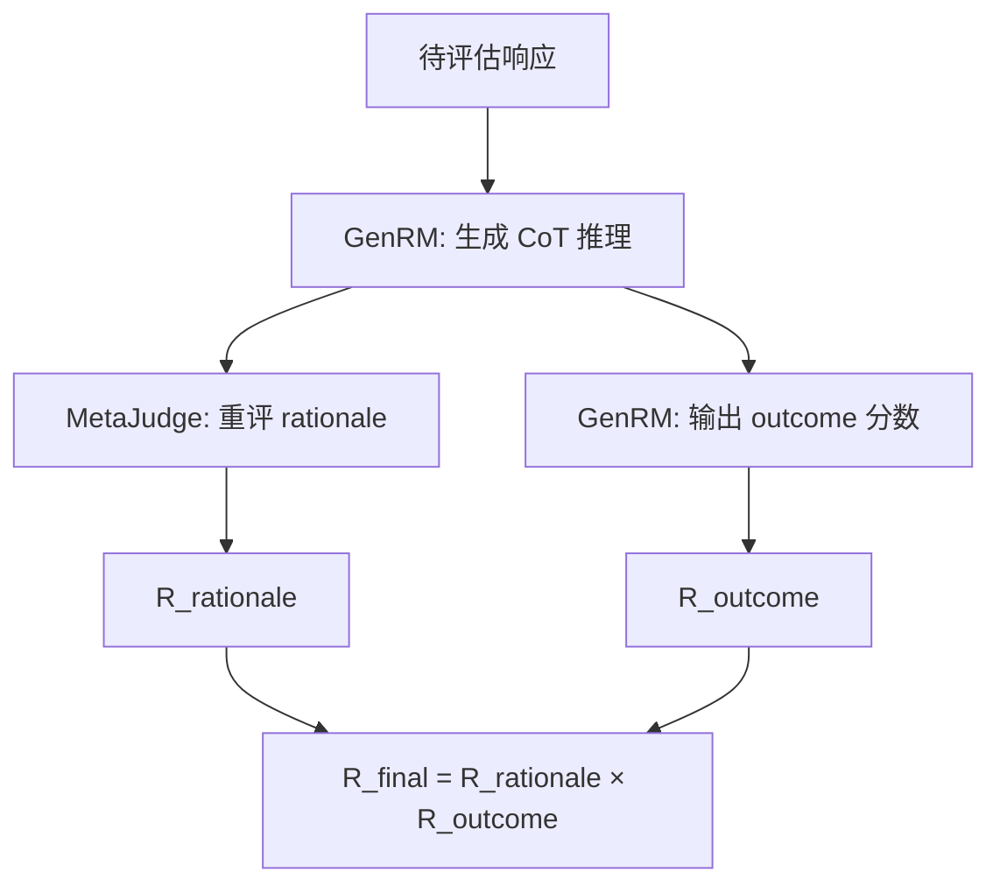
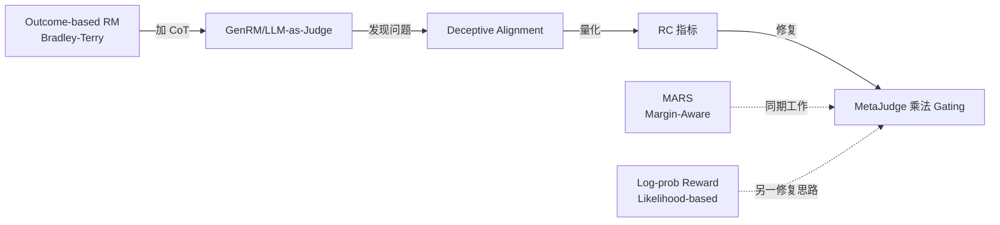

> ⚠️ **DEPRECATED** — 请使用正式完整版：[[AI/3-LLM/RL/Theory/Rationale-Consistency-GenRM-Deceptive-Alignment|Rationale Consistency（完整版）]]
> 正式版包含完整数学推导、实验数据、我的分析视角，本文是简化重写版本。

---

# MetaJudge：GenRM 的欺骗性对齐问题与推理一致性修复

> **一句话**：GenRM 会写出听起来有道理的推理链然后得出错误结论——这是 reward model 层面的 deceptive alignment，MetaJudge 用"外部裁判重评推理"的方式量化并修复。

## 问题背景：GenRM 为什么比 outcome-only RM 更脆弱？

Generative Reward Models（GenRM）= 让 LLM 先写 Chain-of-Thought 推理，再输出 reward 分数。理论上推理过程应该**提升** reward 的可靠性。实践中发现了相反的事情：

**GenRM 存在 Deceptive Alignment（欺骗性对齐）**：
- 模型可以生成**表面合理但实质错误**的推理链
- 推理链和最终 outcome 判断之间存在语义断裂
- 从外部看 outcome 正确（高 accuracy），但推理过程无效甚至反向
- 这意味着模型在"表演推理"而非"真正推理"

这个问题在 RLHF 训练中特别危险：如果 reward model 的推理不可靠，那么基于它的对齐训练是在一个有缺陷的信号上优化。

## 核心方案：RC（Rationale Consistency）

### 定义

**RC（Rationale Consistency）**= 用**外部 LLM** 重新评估 GenRM 的 rationale，测量其是否真正支持 outcome 判断。

形式化：

$$RC = \mathbb{E}\left[\mathbb{1}[\text{MetaJudge}(rationale) = outcome]\right]$$

即：把 GenRM 写的推理链送给独立的元评判者，问它"这段推理支持哪个结论"，然后对比 GenRM 实际的 outcome。一致 = 推理有效；不一致 = deceptive alignment。

### 乘法 Gating

最终 reward 用乘法结合推理质量和结果质量：

$$R_{\text{final}} = R_{\text{rationale}} \times R_{\text{outcome}}$$

- 任一为 0 → 整体为 0（强约束）
- $R_{\text{rationale}}$ = MetaJudge 对推理链的评分
- $R_{\text{outcome}}$ = 原始 GenRM 的 outcome 分数

乘法而非加法的意义：**拒绝 trade-off**。不能用好的 outcome 来弥补坏的推理，也不能用好的推理来弥补坏的 outcome。

## MetaJudge 框架架构

**两层评判**：
1. **GenRM 层**：正常推理 + outcome，得 $R_{\text{outcome}}$
2. **MetaJudge 层**（元评判者）：独立审查推理链，得 $R_{\text{rationale}}$

MetaJudge 本身也是一个 LLM，专门训练来识别推理-结论的一致性。

## 训练方法

混合数据训练：
- **Outcome-only 数据**：传统 preference pairs，保证基础 outcome 判断能力
- **RC 标注数据**：人工/自动标注 rationale-outcome 一致性

关键思路：不需要从零收集所有数据，在已有 GenRM 训练数据上叠加 RC 标注层。

## 实验结果

### Benchmark 表现

| Benchmark | MetaJudge | 最佳 baseline |
|-----------|-----------|--------------|
| RM-Bench | **87.1%** | ~82% |
| JudgeBench | **82%** | ~78% |

### Frontier 模型 RC 测量（令人震惊）

| 模型 | RC 值 |
|------|-------|
| o3 | ~0.4 |
| o3-mini | ~0.2 |
| GPT-4o | ~0.3 |
| 其他 frontier | < 0.4 |

**o3 RC ≈ 0.4 意味着什么**：即使是最强的推理模型，其 GenRM 推理链也只有 40% 的概率真正支持其给出的 outcome 判断。o3-mini 更差（20%）。

这说明：**RC 是当前所有 GenRM 的系统性瓶颈**，不是某个弱模型的问题。

### RLHF 应用效果

- 创意写作任务：MetaJudge reward 信号 → RLHF 提升 **7%**
- 说明修复 RC 对下游对齐有实质改善

## 为什么 Deceptive Alignment 难被发现？

传统 reward model 评估只看 **accuracy**（outcome 是否正确），不看 **过程**（推理是否支持 outcome）。这导致：

1. GenRM 在标准 benchmark 上 accuracy 不错 → 被认为可靠
2. 实际 RLHF 中，reward 信号有内在矛盾 → 对齐效果不稳定
3. 问题被归因于 policy 或数据，而非 reward model 本身

RC 提供了一个**过程可追溯**的评估维度，把黑盒打开了一层。

## 与已有工作的关系

- [[AI/3-LLM/RL/Theory/MARS-Margin-Aware-Reward-Modeling-Self-Refinement]] — 同期工作，从 margin 角度改进 reward
- [[AI/3-LLM/RL/Theory/Likelihood-Based-Reward-Designs-CoT-RL]] — 用 log-probability 替代 discrete outcome，避开 RC 问题的另一思路
- [[Reward-Design-2026-Panorama]] — 三篇合并视角综合分析

## 学者评价

**为什么 ★★★★★**：

这篇论文提出了一个**以前没人命名、但所有人都在经历**的问题——GenRM 的 deceptive alignment。RC 指标简洁、可量化、普适，而且 empirical 结果足以震惊：o3 这样的模型 RC 只有 40%。

乘法 gating 虽然简单，但正确。加法会允许推理质量和结果质量互相补偿，乘法强制同时满足，逻辑更严格。

**局限**：
- MetaJudge 本身是 LLM，它对 rationale 的判断也可能有偏差（谁来评判评判者？）
- RC ≈ 0.4 的上限是否有 fundamental 原因，还是训练数据/方法问题？论文未充分回答
- 乘法 gating 如果 $R_{\text{rationale}}$ 估计不准，会引入噪声惩罚好的 outcome

**深层含义**：GenRM 的问题本质是 **CoT faithfulness**，和 REMuL（[[AI/3-LLM/RL/Theory/REMuL-CoT-Faithfulness-Multi-Listener-RL]]）从 policy 侧解决的是同一枚硬币的两面。MetaJudge 从 judge 侧解决，REMuL 从 policy 侧解决——两者结合才是完整方案。

## 面试高频问法

**Q: GenRM 相比 outcome-only RM 有什么优势和风险？**

优势：推理过程可解释，理论上更准确。风险：deceptive alignment——推理链表面合理但不支持 outcome，RC 测量揭示 frontier 模型普遍 RC < 0.5。

**Q: 如何评估 LLM-as-Judge 的可靠性？**

传统只看 accuracy（agreement with human）；MetaJudge 增加 Rationale Consistency 维度——问推理链是否支持 outcome 判断，乘法 gating 强制一致性。

**Q: RLHF 中 reward model 质量如何影响最终对齐效果？**

RC 问题说明 reward signal 本身可能有内在矛盾，导致 policy 优化方向不稳定。MetaJudge 7% 提升说明修复 reward quality 直接改善 RLHF 效果，不是 policy 层面的问题。

## 落地应用

**可用场景**：
- 任何使用 GenRM/LLM-as-Judge 做 RLHF reward 的系统
- 评估 reward model 可靠性的 audit 工具
- 多 judge ensemble 中的质量过滤器

**工程要点**：
- MetaJudge 需要独立于 GenRM（不能自评自），避免 confirmation bias
- 乘法 gating 中，$R_{\text{rationale}}$ 的评分尺度需要校准（避免过度惩罚）
- RC < 0.3 的 reward signal 应该 flag 并人工 review

## 推荐阅读

- **原始论文**：[arXiv:2602.04649](https://arxiv.org/abs/2602.04649)
- **同期工作**：[[AI/3-LLM/RL/Theory/MARS-Margin-Aware-Reward-Modeling-Self-Refinement]]（margin-aware reward）
- **CoT 侧修复**：[[AI/3-LLM/RL/Theory/REMuL-CoT-Faithfulness-Multi-Listener-RL]]（policy 端 CoT faithfulness）
- **综合视角**：[[Reward-Design-2026-Panorama]]（三篇合并分析）
- **Log-prob 方案**：[[AI/3-LLM/RL/Theory/Likelihood-Based-Reward-Designs-CoT-RL]]（避开 RC 问题的另一路）
