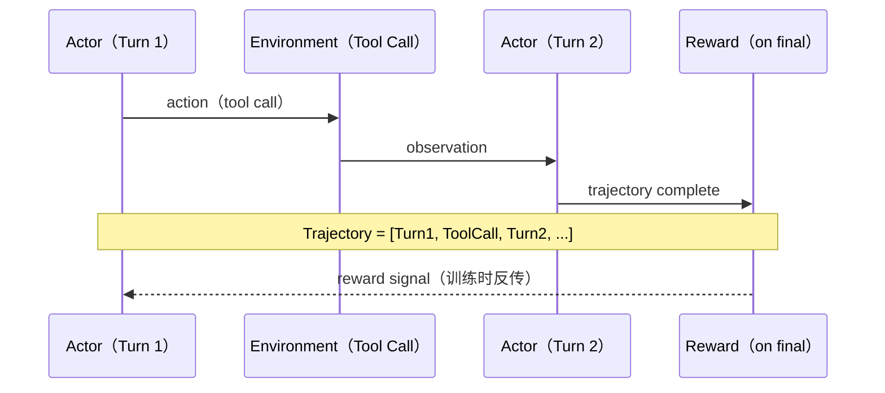

# 多轮 RL 训练交互

> 参考：https://verl.readthedocs.io/en/latest/sglang_multiturn/interaction_system.html#overview

## 为什么需要多轮

标准 RL 训练是单轮的：prompt → response → reward → update。但很多真实场景是多轮的：

- **Agent 交互**：模型调用工具 → 获取结果 → 继续推理 → 再调工具...
- **对话**：多轮对话中每一步都可能需要 reward signal
- **代码调试**：生成代码 → 执行报错 → 修复 → 再执行...

单轮 RL 训不出这种能力，因为模型从没在训练时经历过"中间反馈"。

## verl 多轮交互架构

verl 基于 SGLang 实现了一套多轮交互系统：



关键设计：
- **Trajectory**：多轮对话的完整轨迹，包含所有 turn 的 token
- **Reward 分配**：通常只在最后一轮给 reward（outcome-based），也可以每轮给（process-based）
- **Environment**：外部系统（工具、沙箱、数据库），响应模型的动作

## 核心概念

### Trajectory vs Episode

```python
# 单轮 RL 的 trajectory
trajectory = {
    "prompt": "What is 2+3?",
    "response": "The answer is 5.",
    "reward": 1.0
}

# 多轮 RL 的 trajectory
trajectory = {
    "turns": [
        {
            "role": "user",
            "content": "Calculate the factorial of 10"
        },
        {
            "role": "assistant",
            "content": "<tool_call>python\nimport math\nprint(math.factorial(10))\n</tool_call>"
        },
        {
            "role": "tool",
            "content": "3628800"
        },
        {
            "role": "assistant",
            "content": "The factorial of 10 is 3,628,800."
        }
    ],
    "reward": 1.0,  # 只看最终结果
    "per_turn_rewards": [0, 0.5, 0, 1.0]  # 也可以每轮打分
}
```

### Environment Interface

```python
class ToolEnvironment:
    """多轮交互的环境接口"""
    
    def __init__(self, tools: dict):
        self.tools = tools
    
    def step(self, action: str) -> tuple[str, bool]:
        """
        接收模型的 action，返回 observation 和是否结束
        
        Returns:
            observation: 环境返回的文本
            done: 是否结束交互
        """
        # 解析 tool call
        tool_name, args = parse_tool_call(action)
        
        if tool_name is None:
            # 模型没有调用工具，交互结束
            return "", True
        
        if tool_name not in self.tools:
            return f"Error: Unknown tool '{tool_name}'", False
        
        # 执行工具
        try:
            result = self.tools[tool_name](**args)
            return str(result), False
        except Exception as e:
            return f"Error: {str(e)}", False
    
    def reset(self):
        """重置环境状态"""
        pass
```

## SGLang 集成

verl 利用 SGLang 的高性能推理引擎做多轮 rollout，核心优势是 **prefix caching**：

```python
# SGLang 多轮推理 - 前几轮的 KV cache 可以复用
# 这对多轮 RL 的性能至关重要

# 不用 SGLang: 每轮都重新编码完整历史
# Turn 1: encode [system, user_1] → generate response_1
# Turn 2: encode [system, user_1, response_1, tool_result] → generate response_2
#          ^^^^^^^^^^^^^^^^^^^^^^^^^^^^^^^^^^^^ 重复计算

# 用 SGLang: prefix cache 命中
# Turn 1: encode [system, user_1] → generate response_1 → cache KV
# Turn 2: cache hit! 只需增量编码 [tool_result] → generate response_2
```

配置方式：

```yaml
rollout:
  engine: "sglang"
  multiturn:
    enabled: true
    max_turns: 5           # 最大交互轮数
    stop_tokens: ["</s>"]  # 每轮的停止 token
    
    environment:
      type: "tool_calling"
      tools:
        - name: "python"
          type: "sandbox"
          endpoint: "http://sandbox:8080"
        - name: "search"
          type: "api"
          endpoint: "http://search:3000"
```

## Reward 设计

多轮场景的 reward 分配比单轮复杂得多：

```python
def multiturn_reward(trajectory):
    """多轮 reward 设计"""
    turns = trajectory["turns"]
    n_turns = len([t for t in turns if t["role"] == "assistant"])
    
    # 1. Outcome reward: 只看最终结果
    final_response = turns[-1]["content"]
    correctness = verify_answer(final_response)  # 0 or 1
    
    # 2. Efficiency bonus: 轮数越少越好
    efficiency = max(0, 1.0 - 0.1 * n_turns)
    
    # 3. Tool usage quality: 是否正确使用工具
    tool_quality = evaluate_tool_usage(turns)
    
    # 加权
    reward = 0.6 * correctness + 0.2 * efficiency + 0.2 * tool_quality
    return reward
```

**经验**：
- 起步阶段只用 outcome reward（简单有效），等模型能用工具了再加细粒度 reward
- 不要给太强的 efficiency reward，否则模型会学到"不调工具直接瞎猜"

## Credit Assignment 问题

多轮 RL 的核心挑战：最终 reward 如何分配到每一轮？

```python
# 方案 1: 所有 turn 共享最终 reward（最简单）
for turn in trajectory.turns:
    turn.reward = final_reward

# 方案 2: 衰减分配（越接近结果的 turn 功劳越大）
gamma = 0.95
for i, turn in enumerate(reversed(trajectory.turns)):
    turn.reward = final_reward * (gamma ** i)

# 方案 3: 用 Critic 做 value estimation（最精确但最复杂）
# 需要训练一个多轮 Critic，预测每个 turn 的 state value
```

## 相关

- [[AI/3-LLM/Frameworks/verl/verl 概述|verl 概述]]
- [[AI/3-LLM/Frameworks/verl/Sandbox Fusion 沙箱|Sandbox Fusion 沙箱]]
- [[AI/3-LLM/Frameworks/verl/Reward Function|Reward Function]]
- [[AI/3-LLM/Frameworks/verl/算法概述|算法概述]]
- [[AI/3-LLM/Frameworks/verl/训练后端|训练后端]]
