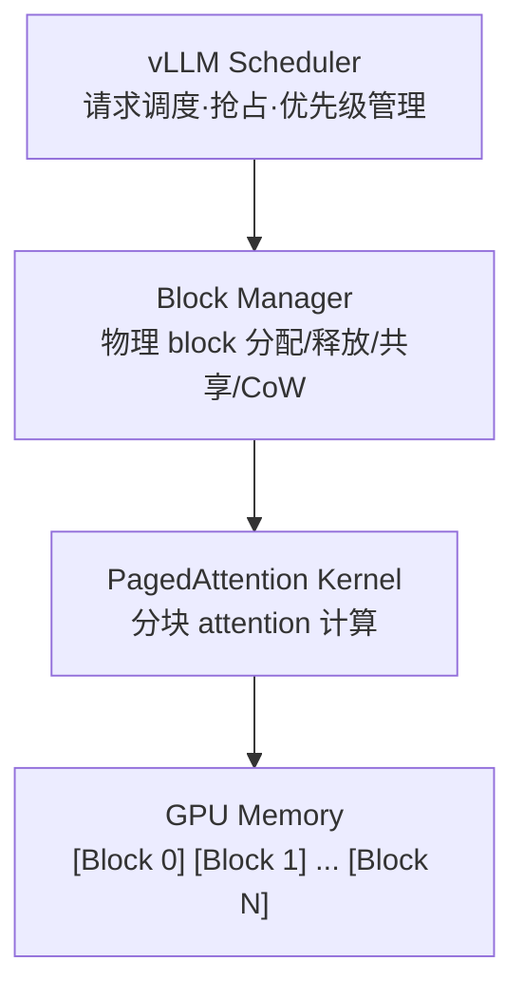
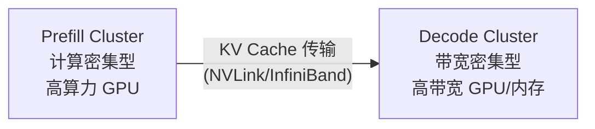

> [!info] 另有面试版
> Foundations 精简版：[[AI/1-Foundations/Inference/KV Cache]]

# KV Cache 原理与优化：深度面试笔记

## 1. KV Cache 基本原理

### 1.1 自回归解码的本质

Transformer 语言模型（GPT、LLaMA、Qwen 等）在生成文本时采用**自回归（Autoregressive）**方式：每一步只生成一个 token，然后将该 token 拼接到输入序列末尾，再进行下一步生成。形式化地：

$$P(x_1, x_2, \ldots, x_T) = \prod_{t=1}^{T} P(x_t \mid x_1, x_2, \ldots, x_{t-1})$$

这意味着生成第 $t$ 个 token 时，模型需要对前 $t-1$ 个 token 的完整上下文进行注意力计算。

### 1.2 计算冗余问题

在标准 Self-Attention 中，对于输入序列 $X \in \mathbb{R}^{n \times d}$：

$$Q = XW_Q, \quad K = XW_K, \quad V = XW_V$$
$$\text{Attention}(Q, K, V) = \text{softmax}\left(\frac{QK^T}{\sqrt{d_k}}\right) V$$

**如果不使用 KV Cache**，生成第 $t$ 个 token 时：
- 需要用前 $t$ 个 token 的完整序列重新计算 $Q$、$K$、$V$
- 计算复杂度为 $O(t^2 \cdot d)$
- 生成长度为 $T$ 的序列，总计算量为 $O(T^3 \cdot d)$（因为 $\sum_{t=1}^{T} t^2 \approx T^3/3$）

**关键观察**：在生成第 $t$ 个 token 时，前 $t-1$ 个 token 对应的 $K$ 和 $V$ 矩阵与第 $t-1$ 步计算时完全相同（因为 causal mask 的存在，前面的 token 不会看到后面的 token）。只有 $Q$ 向量是新的——它仅对应当前待生成的 token。

### 1.3 KV Cache 的核心思想

**KV Cache 就是将已经计算过的 Key 和 Value 缓存下来，避免重复计算。**

具体流程：

1. **Prefill 阶段**：输入完整 prompt（长度为 $n$），一次性计算所有 token 的 $K$、$V$，存入缓存
2. **Decode 阶段**：每一步只需要：
   - 用新 token 计算 $q_t$（$1 \times d$ 的向量）
   - 用新 token 计算 $k_t$ 和 $v_t$，追加到缓存
   - 用 $q_t$ 与缓存中所有 $K_{1:t}$ 做注意力计算
   - 加权求和缓存中的 $V_{1:t}$ 得到输出

**使用 KV Cache 后**：
- 每步 decode 的计算复杂度从 $O(t^2 \cdot d)$ 降低到 $O(t \cdot d)$
- 生成长度为 $T$ 的序列，总计算量从 $O(T^3 \cdot d)$ 降低到 $O(T^2 \cdot d)$

### 1.4 为什么只缓存 K 和 V，不缓存 Q？

- 在 decode 阶段，$Q$ 只有当前 token 的一个向量 $q_t$，且每步都不同
- 之前 token 的 $Q$ 已经用过了，不会再被用到（causal attention 中，token $i$ 的 query 只影响 token $i$ 自身的输出）
- 而 $K$ 和 $V$ 需要被后续所有 token 的 query 访问，所以必须保留

### 1.5 直观类比

可以把 KV Cache 类比为**数据库索引**：
- Key 是索引键，Value 是存储的数据
- 每次查询（Query）来了，通过 Key 找到相关数据（Value）
- 已经建好的索引不需要重建，只需要追加新数据的索引

---

## 2. KV Cache 显存占用分析

### 2.1 单层单头的 KV Cache 大小

对于 Transformer 的一个注意力头，缓存一个 token 的 K 和 V 需要：
- K 向量：$d_{\text{head}}$ 个元素
- V 向量：$d_{\text{head}}$ 个元素
- 合计：$2 \times d_{\text{head}}$ 个元素

### 2.2 完整模型的 KV Cache 公式

$$\text{KV Cache Size} = 2 \times n_{\text{layers}} \times n_{\text{heads}} \times d_{\text{head}} \times s \times b \times \text{dtype\_bytes}$$

其中：
| 符号 | 含义 | 典型值（LLaMA-2 70B） |
|------|------|----------------------|
| 2 | K 和 V 两部分 | 2 |
| $n_{\text{layers}}$ | Transformer 层数 | 80 |
| $n_{\text{heads}}$ | 注意力头数（KV 头数） | 8（GQA） |
| $d_{\text{head}}$ | 每个头的维度 | 128 |
| $s$ | 序列长度 | 4096 |
| $b$ | batch size | 1 |
| dtype_bytes | 数据类型字节数 | 2（FP16） |

### 2.3 实际计算示例

**LLaMA-2 7B（MHA，32 层，32 头，head_dim=128）**：

$$\text{KV Cache} = 2 \times 32 \times 32 \times 128 \times 4096 \times 1 \times 2 = 2,147,483,648 \text{ bytes} = 2 \text{ GB}$$

一个请求在 seq_len=4096 时就需要 **2 GB** 显存存放 KV Cache！

**LLaMA-2 70B（GQA，80 层，8 KV头，head_dim=128）**：

$$\text{KV Cache} = 2 \times 80 \times 8 \times 128 \times 4096 \times 1 \times 2 = 1,342,177,280 \text{ bytes} \approx 1.25 \text{ GB}$$

由于使用了 GQA（8 个 KV 头而非 64 个），70B 模型的 KV Cache 反而比 7B 小。

**Batch 场景**：如果 batch_size=64，LLaMA-2 7B 的 KV Cache 将达到 **128 GB**，远超模型参数本身（14 GB FP16）。

### 2.4 KV Cache 占比分析

在高吞吐推理场景中：
- 模型参数：固定大小，不随 batch/seq_len 变化
- KV Cache：随 $b \times s$ 线性增长
- 激活值：远小于 KV Cache（decode 阶段每步只有一个 token）

因此，**KV Cache 往往是推理阶段显存占用的主要瓶颈**，尤其在长上下文和大 batch 场景下。

### 2.5 KV Cache 与最大吞吐量的关系

可用于 KV Cache 的显存 = 总显存 - 模型参数 - 其他开销

$$\text{max\_batch\_size} = \frac{\text{GPU Memory} - \text{Model Size}}{\text{KV Cache per request}}$$

例如：A100 80GB，模型 14GB（LLaMA-2 7B FP16），KV Cache per request（seq_len=2048）≈ 1GB：

$$\text{max\_batch\_size} \approx \frac{80 - 14 - 5(\text{其他})}{1} = 61$$

**KV Cache 的优化直接决定了推理系统的最大并发能力。**

---

## 3. Multi-Query Attention (MQA) 与 Grouped-Query Attention (GQA)

### 3.1 标准 Multi-Head Attention (MHA) 的 KV Cache 问题

在标准 MHA 中，$n_{\text{heads}}$ 个注意力头各自拥有独立的 $K$、$V$ 投影：

$$K_i = XW_{K_i}, \quad V_i = XW_{V_i}, \quad i = 1, 2, \ldots, n_{\text{heads}}$$

KV Cache 需要存储每个头独立的 K 和 V，大小与 $n_{\text{heads}}$ 成正比。

### 3.2 Multi-Query Attention (MQA)

> 来源：Shazeer, "Fast Transformer Decoding: One Write-Head is All You Need", arXiv:1911.02150

**核心思想**：所有注意力头共享同一组 $K$ 和 $V$，只有 $Q$ 保持多头。

$$Q_i = XW_{Q_i}, \quad K = XW_K, \quad V = XW_V$$

$$\text{head}_i = \text{Attention}(Q_i, K, V)$$

**KV Cache 节省**：
- MHA：$2 \times n_{\text{heads}} \times d_{\text{head}}$ per token per layer
- MQA：$2 \times 1 \times d_{\text{head}}$ per token per layer
- **减少倍数**：$n_{\text{heads}}$ 倍（如 32 头 → 减少 32×）

**代价**：
- 模型表达能力略有下降（不同头看到相同的 K/V 信息）
- 实际效果：在充分训练后，精度损失可控（约 0.5-1% 的 benchmark 下降）
- 代表模型：PaLM、Falcon、StarCoder

### 3.3 Grouped-Query Attention (GQA)

> 来源：Ainslie et al., "GQA: Training Generalized Multi-Query Attention from Multi-Head Checkpoints", arXiv:2305.13245, EMNLP 2023

**核心思想**：将 $n_{\text{heads}}$ 个 query 头分成 $g$ 组，每组共享一组 K/V 头。

$$\text{group}_j = \{Q_i\}_{i \in \text{group } j}, \quad K_j, V_j$$

- 当 $g = 1$：退化为 MQA
- 当 $g = n_{\text{heads}}$：退化为标准 MHA
- 典型配置：$g = 8$（LLaMA-2 70B）

**KV Cache 节省**：
- GQA：$2 \times g \times d_{\text{head}}$ per token per layer
- 相比 MHA 减少 $n_{\text{heads}} / g$ 倍

**GQA 的优势**：
1. 在 MQA 和 MHA 之间取得平衡：接近 MQA 的推理速度，接近 MHA 的模型质量
2. 可以从现有 MHA 模型通过 **uptrain** 转换（将多个 KV 头的权重取均值初始化为一组 KV 头）
3. 已成为大模型的主流选择：LLaMA-2 70B、LLaMA-3、Mistral、Qwen-2 等

### 3.4 MHA / MQA / GQA 对比总结

| 特性 | MHA | GQA | MQA |
|------|-----|-----|-----|
| KV 头数 | $n_{\text{heads}}$ | $g$（$1 < g < n_{\text{heads}}$） | 1 |
| KV Cache 大小 | 基准 | 基准 $\times g / n_{\text{heads}}$ | 基准 $/ n_{\text{heads}}$ |
| 模型质量 | 最高 | 接近 MHA | 略有下降 |
| 推理速度 | 最慢 | 接近 MQA | 最快 |
| 代表模型 | GPT-3, LLaMA-1 | LLaMA-2 70B, LLaMA-3, Mistral | PaLM, Falcon |

### 3.5 额外优化：Multi-Head Latent Attention (MLA)

> 来源：Liu et al., "DeepSeek-V2: A Strong, Economical, and Efficient MoE Language Model", arXiv:2405.04434

DeepSeek-V2 提出的 MLA 是另一种路线：

- 将 KV Cache 压缩到低秩潜空间（latent space）
- 缓存的不是完整的 K/V，而是压缩后的 latent 向量 $c_t$
- 推理时从 $c_t$ 恢复 K 和 V
- 相比 GQA 进一步减少 KV Cache，且不损失模型质量
- 代价：恢复 K/V 需要额外的矩阵乘法，增加计算量（但在 memory-bound 的 decode 阶段，这种 trade-off 是值得的）

---

## 4. PagedAttention 原理

### 4.1 传统 KV Cache 管理的问题

传统推理框架（如 HuggingFace Transformers）为每个请求**预分配**一块连续的 KV Cache 显存：

```
Request 1: [__________KV Cache (max_seq_len)__________]
Request 2: [__________KV Cache (max_seq_len)__________]
Request 3: [__________KV Cache (max_seq_len)__________]
```

**问题**：
1. **内部碎片**：必须按 `max_seq_len` 预分配，但实际生成长度远小于最大值，大量显存浪费
2. **外部碎片**：请求结束释放显存后，留下大小不一的空洞，新请求可能无法使用
3. **无法共享**：Parallel Sampling（同一个 prompt 生成多个回复）时，每个回复都有独立的 prompt KV Cache 副本

据 vLLM 论文统计，传统方案的显存浪费率高达 **60-80%**。

### 4.2 PagedAttention 的核心思想

> 来源：Kwon et al., "Efficient Memory Management for Large Language Model Serving with PagedAttention", arXiv:2309.06180, SOSP 2023

PagedAttention 借鉴操作系统的**虚拟内存与分页**机制：

| 操作系统概念 | PagedAttention 对应 |
|-------------|-------------------|
| 虚拟页（Page） | 逻辑 KV Block |
| 物理页帧（Frame） | 物理 GPU 显存块 |
| 页表（Page Table） | Block Table |
| 按需分页（Demand Paging） | 按需分配 KV Block |
| 写时复制（Copy-on-Write） | 共享 Prompt KV Cache |

### 4.3 具体实现

**Block 设计**：
- 将 KV Cache 按固定大小的 **block** 管理（如每个 block 存 16 个 token 的 KV）
- 每个 block 是物理显存上的一个固定大小区域
- 序列的 KV Cache 由多个 block 组成，block 之间**不需要物理连续**

**Block Table**：
- 每个序列维护一个 block table，记录逻辑 block 到物理 block 的映射
- 类似于操作系统的页表

```
Sequence 1 Block Table:
  Logical Block 0 → Physical Block 7
  Logical Block 1 → Physical Block 3
  Logical Block 2 → Physical Block 12

Sequence 2 Block Table:
  Logical Block 0 → Physical Block 7  ← 共享（同 prompt）
  Logical Block 1 → Physical Block 3  ← 共享
  Logical Block 2 → Physical Block 5  ← 不同回复，不同 block
```

**按需分配**：
- 不预分配完整的 `max_seq_len` 空间
- 每当一个 block 填满时，才分配新的物理 block
- 显存利用率接近 100%

### 4.4 关键优化

**1. Copy-on-Write（写时复制）**：
- Beam Search 或 Parallel Sampling 中，多个序列共享相同的 prompt KV Cache
- 只有当某个序列要修改共享 block 时，才复制该 block
- 大幅减少共享前缀的显存开销

**2. 消除碎片**：
- 内部碎片：最多浪费一个 block 的空间（最后一个 block 未填满）
- 外部碎片：完全消除（任何空闲 block 都可以分配给任何序列）
- 论文实验：显存浪费从 60-80% 降到 **< 4%**

**3. 高效的 Attention Kernel**：
- 修改 attention 计算逻辑，支持从不连续的物理 block 中读取 KV
- 实现了分块（block-wise）的 FlashAttention 变体

### 4.5 vLLM 的整体架构



**调度策略**：
- 当 GPU 显存不足时，可以将低优先级请求的 KV Cache **swap** 到 CPU 内存
- 待显存空闲后再 swap 回 GPU
- 类似操作系统的 page swap

### 4.6 性能提升

根据 vLLM 论文和实际测试：
- 相比 HuggingFace Transformers：**吞吐量提升 2-4×**
- 相比 text-generation-inference（TGI）：**吞吐量提升 2-3×**
- 在 Parallel Sampling 场景：**吞吐量提升可达 6×**（得益于 CoW）

---

## 5. KV Cache 量化

### 5.1 动机

KV Cache 在 FP16 精度下显存占用巨大。模型参数已有成熟的量化方案（GPTQ、AWQ、GGUF 等），**KV Cache 是否也能量化？**

KV Cache 的特点：
- 每次推理动态生成，不能离线量化
- 精度敏感（直接参与 attention 计算，误差会传播到每一步）
- 需要在线（on-the-fly）量化，低延迟

### 5.2 KV Cache INT8 量化

**方案**：将 KV Cache 从 FP16 量化到 INT8，显存减半。

**Per-token 量化**（最常见）：
```python
# 量化
scale = max(abs(kv_fp16)) / 127.0
kv_int8 = round(kv_fp16 / scale)

# 反量化
kv_fp16_approx = kv_int8 * scale
```

**Per-channel 量化**：
- 对每个 head_dim 维度独立计算 scale
- 精度更高，额外存储 scale 的开销可忽略

**实际效果**：
- 显存减少约 50%
- 精度损失：在大多数任务上 < 0.5%（perplexity 变化极小）
- vLLM、TensorRT-LLM 均已支持

### 5.3 KV Cache FP8 量化

FP8 格式（E4M3 或 E5M2）的优势：
- 与 INT8 相同的显存节省
- 无需量化/反量化：FP8 是浮点格式，硬件直接支持（H100、Ada Lovelace）
- 精度通常优于 INT8（动态范围更大）
- NVIDIA Hopper 架构原生支持 FP8 Tensor Core

**TensorRT-LLM 的 FP8 KV Cache**：
- Prefill 阶段计算出 FP16 的 K/V，立即转换为 FP8 存入缓存
- Decode 阶段从缓存读取 FP8 K/V，在 attention kernel 中转换为 FP16 计算
- 几乎零精度损失，吞吐量显著提升

### 5.4 更激进的量化：INT4 / INT2

研究前沿：
- **KIVI**（2024）：Key 用 per-channel INT2 量化，Value 用 per-token INT2 量化
  - 观察到 Key 的通道分布集中，适合 per-channel
  - Value 的 token 维度分布集中，适合 per-token
  - 相比 FP16，显存减少 **87.5%**，精度损失约 1-2%

- **KVQuant**（2024）：
  - 通过校准数据集学习最优量化参数
  - 支持 non-uniform 量化
  - 结合残差量化进一步提升精度

### 5.5 量化方案对比

| 方案 | 显存节省 | 精度影响 | 硬件要求 | 实现复杂度 |
|------|---------|---------|---------|-----------|
| FP16（基线） | 0% | 无 | 通用 | 低 |
| FP8 | 50% | 极小 | H100/Ada | 低 |
| INT8 | 50% | 小（< 0.5%） | 通用 | 中 |
| INT4 | 75% | 中（1-2%） | 通用 | 高 |
| INT2 | 87.5% | 较大（2-5%） | 通用 | 高 |

---

## 6. KV Cache 驱逐策略

### 6.1 问题背景

长上下文推理（128K、1M tokens）中，KV Cache 可能占用几十甚至上百 GB 显存。一个自然的想法：**能否只保留"重要"的 KV，丢弃不重要的？**

这引出了 KV Cache 驱逐（Eviction）策略的研究。

### 6.2 StreamingLLM

> 来源：Xiao et al., "Efficient Streaming Language Models with Attention Sinks", arXiv:2309.17453, ICLR 2024

**核心发现**：
- 注意力分数中，前几个 token（尤其是第一个 token）总是获得异常高的注意力权重
- 这些 token 被称为 **Attention Sinks**
- 它们不一定语义重要，但起到了"注意力汇聚点"的作用（softmax 的数值稳定性需要）

**策略**：
- 保留前 $k$ 个 token 的 KV（Attention Sinks，通常 $k=4$）
- 保留最近 $w$ 个 token 的 KV（滑动窗口）
- 丢弃中间所有 token 的 KV

```
保留: [Sink tokens (4)] ... [丢弃] ... [Recent window (w)]
```

**优点**：
- 实现极其简单
- KV Cache 大小固定为 $k + w$，与输入长度无关
- 支持"无限长度"的流式推理

**缺点**：
- 中间信息完全丢失
- 不适合需要引用中间内容的任务（如长文档问答）

### 6.3 H2O（Heavy-Hitter Oracle）

**论文**：*H2O: Heavy-Hitter Oracle for Efficient Generative Inference of Large Language Models*（Zhang et al., 2023）

**核心观察**：
- 少量 token（约 5-10%）在多个注意力头中都获得高注意力分数
- 这些 token 被称为 **Heavy Hitters (H2)**
- 丢弃非 Heavy Hitter 的 KV 对输出影响很小

**策略**：
- 维护每个 token 的累积注意力分数
- 保留 Top-$k$ 的 Heavy Hitter tokens + 最近的窗口 tokens
- 动态更新：新 token 可能成为 Heavy Hitter，旧的 Heavy Hitter 可能被替换

**算法**：
```
for each decode step:
    1. 计算当前 token 的 attention scores
    2. 累加到每个 token 的 total_score
    3. 如果 cache 已满：
       a. 在非保护区（非最近窗口）中找 score 最低的 token
       b. 驱逐该 token 的 KV
    4. 插入新 token 的 KV
```

**优势**：相比 StreamingLLM，能保留语义上重要的中间 token。

### 6.4 Scissorhands

**论文**：*Scissorhands: Exploiting the Persistence of Importance Hypothesis for LLM KV Cache Compression*（Liu et al., 2023）

**核心假设（Persistence of Importance）**：
- 如果一个 token 在历史注意力计算中不重要，那么它在未来也大概率不重要
- "重要性是持久的"

**与 H2O 的区别**：
- Scissorhands 强调一次性判断后就可以驱逐
- 不需要持续维护累积分数
- 实现更简单，计算开销更低

### 6.5 动态稀疏注意力

更广义地，可以在 attention 计算中引入稀疏性：

**FastGen**（2024）：
- 对不同注意力头采用不同的压缩策略（有的头用 attention sink，有的用 heavy hitter）
- 因为不同头的注意力模式不同
- 自适应选择最优策略

**Quest**（2024）：
- 将 KV Cache 分成 page（多个 token 一组）
- 每个 page 维护 key 的统计摘要（min/max）
- Query 先与 page 摘要比较，跳过不相关的 page
- 类似数据库的索引剪枝

### 6.6 驱逐策略对比

| 方法 | 保留策略 | KV Cache 大小 | 长距离依赖 | 实现复杂度 |
|------|---------|-------------|-----------|-----------|
| Full Cache | 全部保留 | $O(n)$ | ✅ 完整 | 低 |
| StreamingLLM | Sink + 滑动窗口 | $O(k+w)$ 固定 | ❌ 丢失中间 | 很低 |
| H2O | Heavy Hitter + 窗口 | $O(b)$ 固定 | ⚠️ 部分保留 | 中 |
| Scissorhands | 历史重要性 | $O(b)$ 固定 | ⚠️ 部分保留 | 低 |
| Quest | Page-level 剪枝 | $O(n)$ 存，$O(n')$ 算 | ✅ 近似完整 | 中 |

---

## 7. 多轮对话中的 KV Cache 复用

### 7.1 问题场景

多轮对话中，system prompt 和历史对话在每轮都重复出现：

```
Round 1: [System Prompt] [User: Q1]
Round 2: [System Prompt] [User: Q1] [Assistant: A1] [User: Q2]
Round 3: [System Prompt] [User: Q1] [Assistant: A1] [User: Q2] [Assistant: A2] [User: Q3]
```

如果每轮都从头计算 KV Cache，system prompt 和历史部分的 KV Cache 被反复重算，造成巨大浪费。

### 7.2 Prefix Caching / Prompt Caching

**核心思想**：对共享前缀的 KV Cache 进行缓存和复用。

**实现方式一：Hash-based Prefix Caching（vLLM 的方案）**

1. 将 token 序列按 block 大小分块
2. 计算每个 block 的 hash（基于 block 内的 token ids + 前置 block 的 hash）
3. 维护 hash → 物理 block 的全局缓存表
4. 新请求来时：
   - 逐 block 计算 hash
   - 如果 hash 命中，直接复用物理 block
   - 如果 miss，从该 block 开始正常计算

```
请求 A: [sys prompt][user Q1] → hash(block0)=0xAB, hash(block1)=0xCD
请求 B: [sys prompt][user Q2] → hash(block0)=0xAB（命中！）, hash(block1)=0xEF（miss）

请求 B 只需要从 block1 开始计算，block0 的 KV Cache 直接复用。
```

**实现方式二：Radix Tree（SGLang 的方案）**

- 将所有请求的 token 前缀组织成一棵 Radix Tree（基数树）
- 树的每个节点对应一个 KV Cache block
- 共享前缀的请求共享树中的路径
- 查找共享前缀的时间复杂度为 $O(\text{prefix length})$

### 7.3 Anthropic / OpenAI 的 Prompt Caching

**Anthropic Prompt Caching**（2024）：
- 在 API 层面支持 prompt caching
- 标记 system prompt 为 `cache_control: ephemeral`
- 5 分钟内的相同前缀自动命中缓存
- 缓存命中时，input token 费用降低 **90%**
- 本质上就是服务端的 prefix caching

**OpenAI Cached Tokens**（2024）：
- 自动检测请求间的共享前缀
- 无需用户显式标记
- 缓存命中时，input token 费用降低 **50%**

### 7.4 Prefix Caching 的限制

1. **只能复用前缀**：中间相同但前缀不同的部分无法复用
2. **Token 级别匹配**：哪怕差一个 token，后续所有 block 都需要重新计算（因为 attention 的位置依赖）
3. **缓存淘汰**：GPU 显存有限，需要 LRU 等策略淘汰旧缓存
4. **多用户隔离**：不同用户的 prompt 不应共享（安全性考虑），但 system prompt 可以

### 7.5 更进一步：跨请求的 KV Cache 复用

**CacheBlend**（2024）：
- 即使 prefix 不完全匹配，也尝试复用相近的 KV Cache
- 选择性地重新计算注意力，修正误差
- 适用于 RAG 场景（检索到的文档片段可能重复出现）

**ChunkAttention**（2024）：
- 将 KV Cache 组织为 chunk tree
- 自动发现和合并重复 chunk
- 支持非前缀位置的 KV Cache 共享

---

## 8. KV Cache 在 Prefill vs Decode 阶段的不同行为

### 8.1 两阶段概述

LLM 推理分为两个截然不同的阶段：

| 特性 | Prefill 阶段 | Decode 阶段 |
|------|------------|------------|
| 输入 | 完整 prompt（$n$ tokens） | 单个 token |
| 输出 | 第一个生成 token + KV Cache | 下一个 token + 更新 KV Cache |
| 计算模式 | **Compute-bound** | **Memory-bound** |
| 并行度 | 高（$n$ tokens 同时计算） | 低（1 token） |
| FLOPS 利用率 | 高 | 低 |
| 瓶颈 | GPU 算力 | 显存带宽 |

### 8.2 Prefill 阶段的 KV Cache 行为

1. **一次性计算**：将整个 prompt 的 $n$ 个 token 输入模型，一次性计算所有层的 $K$ 和 $V$
2. **矩阵级并行**：$Q, K, V \in \mathbb{R}^{n \times d}$，是矩阵-矩阵乘法（GEMM），GPU 利用率高
3. **批量写入**：将 $n$ 个 token 的 KV 一次性写入缓存
4. **Attention 计算**：$QK^T$ 是 $n \times n$ 的矩阵运算

**特点**：
- Prefill 的耗时与 prompt 长度近似线性（FlashAttention 下）
- 这个阶段的延迟直接决定了 TTFT（Time To First Token）
- 长 prompt 的 prefill 可能需要几秒甚至几十秒

### 8.3 Decode 阶段的 KV Cache 行为

1. **逐 token 计算**：每步只有一个新 token
2. **向量级操作**：$q_t \in \mathbb{R}^{1 \times d}$，$K \in \mathbb{R}^{t \times d}$，是矩阵-向量乘法（GEMV）
3. **追加写入**：将新 token 的 $k_t, v_t$ 追加到缓存末尾
4. **读取瓶颈**：每步需要读取所有历史 KV Cache（$O(t \cdot d)$ 的数据量）

**为什么是 Memory-bound？**

以 LLaMA-2 7B 为例，decode 一步：
- 计算量：约 14B FLOPs（模型参数量 × 2）
- 数据读取量：约 14 GB（模型参数 FP16）+ KV Cache
- A100 算力：312 TFLOPS（FP16）
- A100 带宽：2 TB/s

$$\text{计算时间} = \frac{14 \times 10^9}{312 \times 10^{12}} = 0.045 \text{ ms}$$
$$\text{数据读取时间} = \frac{14 \text{ GB}}{2 \text{ TB/s}} = 7 \text{ ms}$$

数据读取时间是计算时间的 **155 倍**。GPU 大部分时间在等待数据，算力严重空闲。

### 8.4 Prefill-Decode 解耦（Disaggregated Serving）

**Splitwise / DistServe / Mooncake 的思路**：

由于 prefill 和 decode 的计算特性完全不同，可以用不同的硬件分别处理：



- **Prefill 节点**：选择算力强的 GPU，最大化 TTFT
- **Decode 节点**：选择带宽高的配置，最大化吞吐量
- **KV Cache 传输**：Prefill 完成后，将 KV Cache 通过高速网络（NVLink、InfiniBand）传输到 Decode 节点

**挑战**：
- KV Cache 传输的网络开销（可能几百 MB 到几 GB）
- 调度复杂度增加
- 需要平衡两个集群的负载

### 8.5 Chunked Prefill

**Sarathi / Sarathi-Serve 的优化**：

长 prompt 的 prefill 可能占用 GPU 很长时间，阻塞其他请求的 decode。

**方案**：将 prefill 拆分为多个 chunk，与 decode 请求交替执行：

```
时间线：
[Prefill chunk 1][Decode batch][Prefill chunk 2][Decode batch]...
```

好处：
- 减少 decode 请求的排队延迟
- 保持 TPOT（Time Per Output Token）的稳定性
- 更好的 GPU 利用率（prefill chunk 利用算力，decode batch 利用带宽）

### 8.6 Speculative Decoding 与 KV Cache

推测解码中的 KV Cache 管理更复杂：

1. **Draft model** 生成 $k$ 个候选 token，每个都需要维护临时 KV Cache
2. **Target model** 验证这 $k$ 个 token，一次性处理
3. 被接受的 token 的 KV Cache 保留，被拒绝的丢弃
4. 需要支持 KV Cache 的**回滚（rollback）**操作

---

## 9. 面试题及详细回答要点

### 面试题 1：请解释什么是 KV Cache，为什么它对 LLM 推理性能至关重要？

**回答要点**：

1. **定义**：KV Cache 是在自回归解码过程中，将已经计算过的 Key 和 Value 向量缓存下来的技术，避免重复计算。

2. **必要性**：
   - Transformer 自回归生成时，每一步都需要对所有历史 token 做注意力计算
   - 由于 causal mask，历史 token 的 K/V 在每一步的值相同
   - 不使用 KV Cache 时，生成 $T$ 个 token 的总计算量为 $O(T^3 d)$
   - 使用 KV Cache 后降为 $O(T^2 d)$，节省巨大计算

3. **Trade-off**：
   - 用**显存**换**计算**：缓存占用大量 GPU 显存
   - 在长序列和大 batch 下，KV Cache 可能成为显存瓶颈
   - 因此产生了各种 KV Cache 优化技术

4. **加分点**：提及 KV Cache 只缓存 K 和 V 而非 Q 的原因（Q 只用一次，K/V 被后续所有 token 引用）

---

### 面试题 2：vLLM 的 PagedAttention 是如何工作的？它解决了什么问题？

**回答要点**：

1. **问题**：
   - 传统方案预分配连续显存，内部碎片（预分配 > 实际使用）和外部碎片（释放后空洞）导致 60-80% 显存浪费
   - 无法高效共享 prompt 的 KV Cache

2. **方案**：借鉴操作系统虚拟内存的分页机制
   - 将 KV Cache 划分为固定大小的 block（如 16 tokens）
   - 用 block table（页表）维护逻辑到物理的映射
   - 按需分配物理 block，无需连续

3. **关键优化**：
   - **消除碎片**：任何空闲 block 可分配给任何序列
   - **Copy-on-Write**：Beam Search/Parallel Sampling 共享前缀 block
   - **Swap**：显存不足时，KV Cache 可以 swap 到 CPU

4. **效果**：吞吐量提升 2-4×，显存浪费降至 < 4%

5. **加分点**：提到 attention kernel 需要修改以支持非连续内存访问

---

### 面试题 3：MHA、MQA、GQA 之间的区别是什么？它们如何影响 KV Cache？

**回答要点**：

1. **MHA（Multi-Head Attention）**：
   - 每个注意力头有独立的 Q、K、V
   - KV Cache 大小 ∝ $n_{\text{heads}}$

2. **MQA（Multi-Query Attention）**：
   - 所有头共享一组 K/V，只有 Q 保持多头
   - KV Cache 减少 $n_{\text{heads}}$ 倍
   - 代价：模型质量略降

3. **GQA（Grouped-Query Attention）**：
   - $n_{\text{heads}}$ 个 Q 头分成 $g$ 组，每组共享 K/V
   - KV Cache 减少 $n_{\text{heads}}/g$ 倍
   - 在 MQA 和 MHA 间取平衡
   - 已成主流：LLaMA-2 70B ($g=8$)、LLaMA-3、Mistral

4. **加分点**：
   - 提到 MLA（DeepSeek-V2 的 Multi-Head Latent Attention）：用低秩压缩进一步缩小 KV Cache
   - MHA → GQA 的 uptrain 方法：将多个 KV 头的权重取均值初始化

---

### 面试题 4：LLM 推理中 Prefill 和 Decode 阶段有什么区别？KV Cache 在两个阶段分别扮演什么角色？

**回答要点**：

1. **Prefill 阶段**：
   - 处理完整 prompt（$n$ tokens），一次性计算
   - **Compute-bound**：大量矩阵乘法，GPU 算力被充分利用
   - KV Cache 角色：**批量生成**，将 $n$ 个 token 的 K/V 写入缓存
   - 决定 TTFT（Time To First Token）

2. **Decode 阶段**：
   - 每步处理 1 个 token，逐 token 生成
   - **Memory-bound**：主要瓶颈是读取模型参数和 KV Cache
   - KV Cache 角色：**增量更新 + 全量读取**，每步追加一个 token 的 KV，但需要读取所有历史 KV
   - 决定 TPOT（Time Per Output Token）

3. **为什么 decode 是 memory-bound**：
   - 计算量只有一个 token 的前向传播（~2N FLOPs）
   - 但需要读取全部模型参数 + KV Cache
   - GPU 算力远大于所需，瓶颈在显存带宽

4. **加分点**：
   - Disaggregated Serving（prefill 和 decode 用不同硬件）
   - Chunked Prefill（避免长 prefill 阻塞 decode）
   - Continuous Batching（prefill 和 decode 请求混合调度）

---

### 面试题 5：在长上下文场景下，有哪些优化 KV Cache 的策略？请至少说出 3 种并分析其优缺点。

**回答要点**：

**策略一：KV Cache 量化**
- 将 KV Cache 从 FP16 量化到 INT8/FP8
- 优点：显存减半，实现相对简单
- 缺点：精度有轻微损失，需要硬件支持（FP8 需要 H100）
- 适用场景：通用，几乎所有长上下文场景

**策略二：KV Cache 驱逐（StreamingLLM / H2O）**
- StreamingLLM：保留 attention sinks + 滑动窗口，丢弃中间 KV
- H2O：基于累积注意力分数保留 heavy hitter tokens
- 优点：KV Cache 大小固定，支持任意长度
- 缺点：丢失信息，可能影响需要引用中间内容的任务
- 适用场景：流式推理、聊天机器人（不太需要精确引用历史）

**策略三：GQA / MLA**
- 架构级别减少 KV Cache 的 head 数量
- 优点：无精度损失（训练时已适应）、无额外推理开销
- 缺点：需要在训练时确定，不能后期改
- 适用场景：新模型设计

**策略四：PagedAttention**
- 不减少 KV Cache 总量，但提高显存利用率
- 优点：消除碎片，支持共享
- 缺点：需要修改 attention kernel，有轻微 overhead
- 适用场景：高并发服务

**策略五：Prefix Caching**
- 复用共享前缀的 KV Cache
- 优点：避免重复 prefill 计算，降低 TTFT
- 缺点：只能复用前缀，对非前缀共享无效
- 适用场景：多轮对话、同 system prompt 的批量请求

**加分点**：
- 这些策略可以**组合使用**：例如 GQA + PagedAttention + FP8 量化 + Prefix Caching
- 提到具体数字：如 LLaMA-2 70B 在 128K 上下文下 KV Cache 的大小
- 讨论 KV Cache 优化对最大并发量（max batch size）的直接影响

---

## 附录：关键公式速查

| 公式 | 含义 |
|------|------|
| $2 \times L \times h \times d \times s \times b \times \text{bytes}$ | KV Cache 总大小 |
| $O(T^3 d) \to O(T^2 d)$ | KV Cache 带来的计算复杂度降低 |
| KV Cache 减少 $n_h / g$ 倍 | GQA 相比 MHA 的 KV Cache 节省 |
| 显存浪费 60-80% → < 4% | PagedAttention 的碎片消除效果 |
| TTFT ∝ prompt length | Prefill 阶段的延迟特性 |
| TPOT ∝ (model size + KV cache) / bandwidth | Decode 阶段的延迟特性 |

---

## 🔧 落地应用

### 直接可用场景
- **推理服务容量规划**：公式 $\text{max\_batch} = \frac{\text{GPU\_mem} - \text{model\_size} - \text{overhead}}{2 \times n_{kv} \times d_k \times L \times s \times \text{bytes}}$，直接计算最大并发数
- **KV Cache 量化上线**：vLLM 和 TensorRT-LLM 均已支持 FP8/INT8 KV Cache 量化，显存减半且精度损失 <0.5%
- **多轮对话优化**：启用 Prefix Caching（vLLM 的 `--enable-prefix-caching`），同一 system prompt 的多轮对话自动复用 KV Cache

### 工程实现要点
- PagedAttention 的 block size 通常选 16 tokens，太大浪费（内部碎片），太小管理开销高
- Prefix Caching 的 hash 计算基于 token ids + 前置 block hash，确保因果一致性
- Disaggregated Serving 的 KV Cache 传输需要高速网络（NVLink/IB），传输量 = KV Cache 大小（几百 MB~几 GB）

### 面试高频问法
- Q: KV Cache 为什么只缓存 K 和 V 不缓存 Q？
  A: Q 只在当前 token 用一次，历史 Q 不会被后续 token 引用（causal attention）；K/V 需要被所有后续 token 的 query 访问
- Q: PagedAttention 如何解决显存碎片？
  A: 借鉴 OS 虚拟内存分页：固定大小 block + block table 映射 + 按需分配 + CoW 共享

---

## 💡 启发与思考

### So What？对老板意味着什么
- **KV Cache 是推理成本的决定性因素**——它直接决定了最大并发数和每 token 成本。优化 KV Cache = 直接降低推理成本
- **PagedAttention 的 OS 思想迁移是经典设计模式**：虚拟内存、分页、CoW 这些 40 年前的 OS 概念在 GPU 显存管理中焕发新生

### 未解问题与局限
- 驱逐策略（StreamingLLM/H2O）在需要精确引用中间内容的任务（如长文档 QA）上仍会丢失信息
- Disaggregated Serving 的 KV Cache 网络传输延迟可能成为新瓶颈
- KV Cache INT4/INT2 量化的精度损失在数学推理等高精度任务上仍需验证

### 脑暴：如果往下延伸
- 如果把 [[GQA-MQA|GQA]] + [[量化综述|FP8 量化]] + [[AI/3-LLM/Inference/KV Cache|PagedAttention]] 三者叠加，KV Cache 可压缩到原始的 ~6%（87.5% × 50%），使 128K 上下文长 batch 推理成为可能
- Prefix Caching + CacheBlend 的方向可能催生"KV Cache as a Service"——跨请求、跨用户的 KV Cache 共享池

---

## 📚 推荐阅读

### 原始论文
- [PagedAttention (vLLM)](https://arxiv.org/abs/2309.06180) — 推理服务内存管理的里程碑论文，SOSP 2023
- [StreamingLLM](https://arxiv.org/abs/2309.17453) — Attention Sinks 发现 + 无限长度流式推理
- [GQA](https://arxiv.org/abs/2305.13245) — KV Cache 架构级优化的事实标准
- [DeepSeek-V2 (MLA)](https://arxiv.org/abs/2405.04434) — 最激进的 KV 压缩方案
- [H2O](https://arxiv.org/abs/2310.15916) — Heavy-Hitter 驱逐策略

### 深度解读
- [vLLM Blog: PagedAttention](https://blog.vllm.ai/2023/06/20/vllm.html) — vLLM 团队亲自解读 PagedAttention ⭐⭐⭐⭐⭐
- [Lilian Weng: "Large Transformer Model Inference Optimization"](https://lilianweng.github.io/posts/2023-01-10-inference-optimization/) — 推理优化综述 ⭐⭐⭐⭐⭐

### 实践资源
- [vLLM GitHub](https://github.com/vllm-project/vllm) — PagedAttention + Prefix Caching 的工业级实现
- [SGLang GitHub](https://github.com/sgl-project/sglang) — Radix Tree 式 Prefix Caching 的高效实现

---

## 参考文献

1. Shazeer, N. (2019). *Fast Transformer Decoding: One Write-Head is All You Need*. arXiv:1911.02150
2. Ainslie, J. et al. (2023). *GQA: Training Generalized Multi-Query Attention from Multi-Head Checkpoints*. EMNLP 2023
3. Kwon, W. et al. (2023). *Efficient Memory Management for Large Language Model Serving with PagedAttention*. SOSP 2023
4. Xiao, G. et al. (2023). *Efficient Streaming Language Models with Attention Sinks*. ICLR 2024
5. Zhang, Z. et al. (2023). *H2O: Heavy-Hitter Oracle for Efficient Generative Inference of Large Language Models*. NeurIPS 2023
6. Liu, Z. et al. (2023). *Scissorhands: Exploiting the Persistence of Importance Hypothesis for LLM KV Cache Compression*. NeurIPS 2023
7. Liu, A. et al. (2024). *DeepSeek-V2: A Strong, Economical, and Efficient Mixture-of-Experts Language Model*. arXiv:2405.04434
8. Hooper, C. et al. (2024). *KVQuant: Towards 10 Million Context Length LLM Inference with KV Cache Quantization*. arXiv:2401.18079
9. Liu, Z. et al. (2024). *KIVI: A Tuning-Free Asymmetric 2bit Quantization for KV Cache*. arXiv:2402.02750
10. Zheng, L. et al. (2024). *SGLang: Efficient Execution of Structured Language Model Programs*. arXiv:2312.07104

---

## See Also

> 🔗 See also: [[GQA-MQA|GQA/MQA]] — KV Cache 架构级优化的核心方案
> 🔗 See also: [[FlashAttention|FlashAttention]] — Attention 计算加速，与 PagedAttention（内存管理）互补
> 🔗 See also: [[Attention 变体综述|Attention 变体综述]] — 从 MHA→MLA 的演进直接决定 KV Cache 大小
> 🔗 See also: [[量化综述|量化综述]] — KV Cache 量化（FP8/INT8/INT4）的技术细节
> 🔗 See also: [[Continuous Batching|Continuous Batching]] — KV Cache 管理与请求调度的协同
