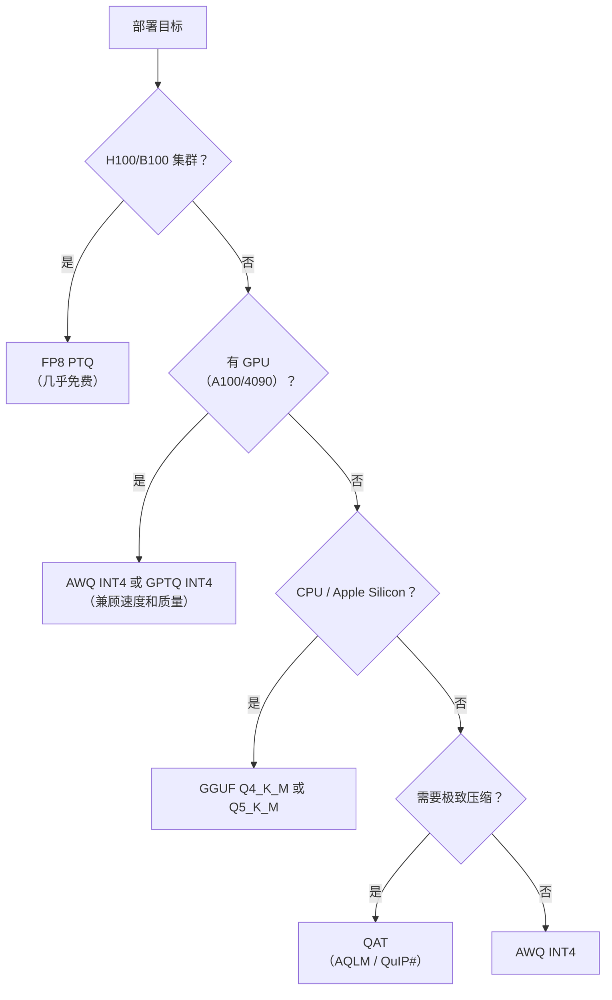
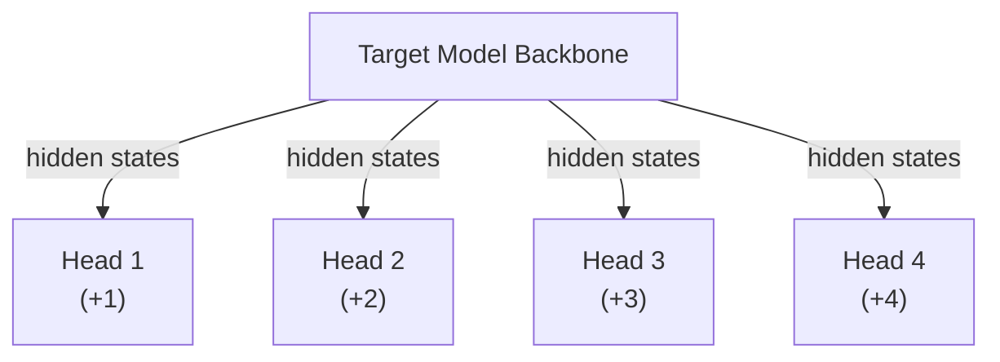

# LLM 推理优化 2026 技术全景（面试武器版）

> 这篇笔记覆盖 LLM 推理（Inference）领域截至 2026 年初的核心优化技术。每一节以"面试官会问"开头，适合系统性复习和面试准备。

---

## 1. 推理性能瓶颈：Compute-Bound vs Memory-Bound

### 面试官会问

**"LLM 推理的核心瓶颈是什么？Prefill 和 Decode 阶段有什么区别？为什么 Decode 阶段通常是 memory-bound 的？"**

### 1.1 两个基本瓶颈

LLM 推理的性能受限于两个物理资源：

| 瓶颈类型 | 限制因素 | 衡量指标 | 典型场景 |
|----------|---------|----------|---------|
| **Compute-Bound** | GPU 算力（FLOPS） | Arithmetic Intensity（FLOP/Byte） | Prefill 阶段、大 batch 推理 |
| **Memory-Bound** | 显存带宽（GB/s） | Memory Bandwidth Utilization | Decode 阶段、小 batch 推理 |

关键概念：**Arithmetic Intensity**（算术强度）= 每字节数据传输所执行的浮点运算次数。当算术强度低于 GPU 的 "Roofline" 拐点时，系统是 memory-bound；高于拐点则是 compute-bound。

以 A100 80GB 为例：
- FP16 峰值算力：312 TFLOPS
- 显存带宽：2.0 TB/s
- Roofline 拐点：312 / 2.0 ≈ 156 FLOP/Byte

### 1.2 Prefill vs Decode 阶段

**Prefill（预填充）阶段：**
- 处理整个 input prompt，一次性并行计算所有 token 的 KV Cache
- 矩阵乘法为 `[seq_len, d_model] × [d_model, d_model]`，seq_len 可能很大
- 算术强度高 → **通常是 compute-bound**
- 核心指标：**TTFT**（Time To First Token）

**Decode（解码）阶段：**
- 自回归逐 token 生成，每步只处理 1 个新 token
- 矩阵乘法退化为 `[1, d_model] × [d_model, d_model]`，本质是 matrix-vector 乘法
- 每次需要从显存加载整个模型权重 + 累积的 KV Cache，但计算量很小
- 算术强度极低 → **几乎总是 memory-bound**
- 核心指标：**TPOT**（Time Per Output Token）、**TPS**（Tokens Per Second）

### 1.3 为什么 Decode 是 Memory-Bound？

数值直觉：一个 70B 参数的模型（FP16），权重约 140GB。Decode 每个 token 需要加载全部权重做一次前向传播，但只执行 ~140G × 2 = 280 GFLOP 计算。在 A100 上，加载 140GB 需要 70ms（2TB/s 带宽），而 280 GFLOP 计算只需 0.9ms（312 TFLOPS）。**加载数据的时间是计算时间的 ~78 倍**——这就是 memory-bound。

### 1.4 Batch Size 的杠杆效应

增大 batch size 是对抗 memory-bound 最直接的方法：
- 模型权重只加载一次，但为 B 个请求同时计算
- 算术强度线性增长：从 `2d/2 = 1` 变为 `2Bd/2 = B`
- **临界 batch size**：当 `B ≈ Roofline 拐点` 时，系统从 memory-bound 过渡到 compute-bound

但 batch size 受 KV Cache 显存限制：每个请求的 KV Cache = `2 × n_layers × n_heads × d_head × seq_len × dtype_size`。对于 LLaMA-70B（80层、64头、d=128、FP16），每个请求 2048 token 的 KV Cache ≈ 2 × 80 × 64 × 128 × 2048 × 2B ≈ 5.2GB。80GB 显存减去模型权重后，能容纳的并发请求非常有限。

### 1.5 面试要点速记

```
Prefill = 并行处理 prompt → compute-bound → 优化方向：算力利用率
Decode  = 逐 token 生成   → memory-bound  → 优化方向：减少数据搬运
Batch   = 摊薄权重加载成本 → 提高算术强度  → 受限于 KV Cache 显存
```

---

## 2. 注意力优化：Flash Attention、PagedAttention、Sparse Attention

### 面试官会问

**"Flash Attention 的核心思想是什么？它解决了什么问题？Flash Attention 2 和 3 分别有什么改进？PagedAttention 和 Flash Attention 的关系是什么？"**

### 2.1 标准 Attention 的问题

标准 Self-Attention：`O = softmax(QK^T / √d) V`

对于序列长度 N、头维度 d：
- 需要显式计算 N×N 的 attention 矩阵 S = QK^T
- 显存占用 O(N²)，N=128K 时一个 attention 矩阵就要 ~64GB（FP16）
- 大量 HBM 读写：Q、K → S → softmax → P → PV → O，每步都要写回 HBM

### 2.2 Flash Attention v1（Dao et al., 2022）

> 来源：FlashAttention: Fast and Memory-Efficient Exact Attention with IO-Awareness — Dao et al. [arXiv:2205.14135](https://arxiv.org/abs/2205.14135)

**核心思想：Tiling + Online Softmax + Kernel Fusion**

- **Tiling（分块）：** 将 Q、K、V 分成小块，每块能放入 GPU SRAM（shared memory，~20MB on A100 vs 80GB HBM）
- **Online Softmax：** 利用 Milakov & Gimelshein 2018 的 online softmax 算法，分块计算 softmax 时无需看到完整的一行。维护一个 running max 和 running sum，逐块更新
- **Kernel Fusion：** 整个 attention 计算在一个 CUDA kernel 中完成，中间结果 S、P 从不写回 HBM
- **不存储 Attention 矩阵：** 正向传播不保存 N×N 的 P 矩阵；反向传播时从 O 和 logsumexp 重新计算（recomputation trade-off）

**效果：**
- 显存从 O(N²) 降至 O(N)
- 端到端墙钟时间加速 2-4×（减少 HBM 访问是主因）
- IO 复杂度：O(N²d²/M)，其中 M 是 SRAM 大小

### 2.3 Flash Attention v2（Dao, 2023）

> 来源：FlashAttention-2: Faster Attention with Better Parallelism and Work Partitioning — Dao [arXiv:2307.08691](https://arxiv.org/abs/2307.08691)

在 v1 基础上的工程优化，重点提升 GPU 利用率：

| 改进点 | 具体做法 | 效果 |
|--------|---------|------|
| **减少非矩阵乘 FLOPs** | 将 softmax 的 rescaling 推迟，减少 online softmax 的冗余计算 | 提升算术强度 |
| **并行化改进** | 外循环改为在 seq_len_Q 维度并行（v1 在 seq_len_K 维度），使得 causal mask 下负载更均衡 | 长序列 causal attention 显著加速 |
| **Warp 级优化** | 改善 warp 间的工作分配，减少 shared memory 的读写和同步 | 接近理论峰值 |
| **支持更多头维度** | 支持 d=64, 96, 128, 160, 192, 224, 256 | 更广泛适用 |

**效果：** 在 A100 上达到 ~70% 的理论峰值 FLOPS，比 v1 快 ~2×。

### 2.4 Flash Attention v3（Shah et al., 2024）

> 来源：FlashAttention-3: Fast and Accurate Attention with Asynchrony and Low-precision — Shah et al. [arXiv:2407.08691](https://arxiv.org/abs/2407.08691)

针对 Hopper 架构（H100）的深度优化：

- **利用 WGMMA 指令：** Hopper 的 Warp Group Matrix Multiply-Accumulate，直接从 shared memory 异步发起矩阵乘法
- **FP8 支持：** 原生 FP8 tensor core，带 incoherent processing（随机 Hadamard 变换减少量化误差）
- **Ping-Pong Scheduling：** 在两个 SM 之间交替执行 softmax 和 GEMM，隐藏 softmax 的非 tensor core 计算延迟
- **异步化：** 利用 Hopper 的 TMA（Tensor Memory Accelerator）实现 HBM→SRAM 的异步拷贝，与计算 overlap

**效果：** FP16 达到 ~740 TFLOPS（H100 理论峰值 989 TFLOPS 的 ~75%），FP8 更高。

### 2.5 PagedAttention（vLLM, Kwon et al., 2023）

> 来源：Efficient Memory Management for Large Language Model Serving with PagedAttention — Kwon et al. [arXiv:2309.06180](https://arxiv.org/abs/2309.06180)

**解决的问题：** KV Cache 的显存碎片化。

传统做法为每个请求预分配最大长度的连续 KV Cache，导致：
- **内部碎片（Internal Fragmentation）：** 实际序列长度 < 预分配长度，浪费显存
- **外部碎片（External Fragmentation）：** 不同请求的 KV Cache 大小不一，释放后留下不可用的空洞
- 实测浪费可达 60-80% 的 KV Cache 显存

**PagedAttention 的解法：** 借鉴操作系统虚拟内存的分页机制：
- KV Cache 被分成固定大小的 **block**（如 16 tokens 一个 block）
- 每个请求维护一个 **block table**（类似页表），逻辑连续但物理不连续
- 新 token 生成时按需分配 block，序列结束时释放 block
- 支持 **Copy-on-Write（CoW）：** beam search 或 parallel sampling 时，共享相同前缀的 block，只在分叉时复制

**效果：** 显存浪费从 60-80% 降至 <4%，吞吐量提升 2-4×（[arXiv:2309.06180](https://arxiv.org/abs/2309.06180), Sec. 5 实验）。

**注意：** PagedAttention 和 Flash Attention 解决不同问题——FA 优化 attention 计算的速度和显存，PA 优化 KV Cache 的内存管理。两者可以且应该组合使用。

### 2.6 Sparse Attention

**动机：** 完整 attention 矩阵中很多位置的权重接近 0，可以跳过计算。

**主要方法：**

| 方法 | 稀疏模式 | 特点 |
|------|---------|------|
| **Local/Sliding Window** | 每个 token 只看窗口内的 k 个邻居 | 简单有效，Mistral 使用 |
| **Dilated** | 间隔采样 | 扩大感受野 |
| **Longformer** | Local + Global（特殊 token attend 全部） | 线性复杂度 |
| **BigBird** | Local + Global + Random | 理论上保持图连通性 |
| **H2O（Heavy-Hitter Oracle）** | 动态保留累积 attention score 最高的 token | 训练无关，推理时用 |
| **StreamingLLM** | Attention Sink（前几个 token）+ Sliding Window | 支持无限长推理 |
| **MInference** | 动态识别 A-shape、Vertical-Slash 等稀疏模式 | 适用于长上下文 prefill |

**关键权衡：** 稀疏 attention 降低计算量和显存，但可能损失模型质量。实践中 Sliding Window + Attention Sink 的组合（StreamingLLM 风格）在推理场景被广泛采用。

---

## 3. KV Cache 优化：MQA/GQA/MLA、量化、分层存储、Sliding Window

### 面试官会问

**"MQA、GQA、MLA 分别是什么？它们如何减少 KV Cache？KV Cache 量化的思路是什么？DeepSeek-V2 的 MLA 原理能讲一下吗？"**

### 3.1 KV Cache 为什么是瓶颈

KV Cache 大小公式（FP16）：
```
KV_size = 2 × n_layers × n_kv_heads × d_head × seq_len × 2 bytes
```

以 LLaMA-2-70B（80层、8 KV heads via GQA、d=128）为例：
- 单请求 4096 tokens：2 × 80 × 8 × 128 × 4096 × 2B ≈ 1.3 GB
- 并发 32 请求：~42 GB — 超过 A100 一半显存

KV Cache 的三大问题：
1. **显存占用大** → 限制 batch size → 限制吞吐
2. **带宽消耗大** → Decode 每步要读取完整 KV Cache → 延迟高
3. **线性增长** → 序列越长越严重

### 3.2 架构级优化：MQA → GQA → MLA

**Multi-Head Attention（MHA）：** 标准方案。Q、K、V 各有 n_heads 个头。KV Cache = 2 × n_heads × d_head × seq_len。

**Multi-Query Attention（MQA，Shazeer 2019）：**
- 所有 Q 头共享 **1 组** K 和 V
- KV Cache 缩小 n_heads 倍（如 32× 或 64×）
- 代价：模型质量略有下降，特别是大模型
- 使用者：PaLM、Falcon、StarCoder

**Grouped-Query Attention（GQA，Ainslie et al. 2023）：**
- Q 头分成 G 组，每组共享 1 组 K、V
- KV Cache 缩小 n_heads/G 倍
- 在 MHA 和 MQA 之间取平衡
- G=1 即 MQA，G=n_heads 即 MHA
- 使用者：LLaMA-2-70B（G=8）、Mistral、Gemma

**Multi-head Latent Attention（MLA，DeepSeek-V2, 2024，[arXiv:2405.04434](https://arxiv.org/abs/2405.04434)）：**
- 核心思想：不直接缓存 K、V，而是缓存一个**低秩压缩的 latent vector**
- 具体做法：
  - 将 K、V 联合压缩：`c_kv = W_dkv · x`，c_kv 维度 d_c << n_heads × d_head
  - 推理时从 c_kv 恢复 K、V：`K = W_uk · c_kv`，`V = W_uv · c_kv`
  - 巧妙之处：**将 W_uk 吸收进 W_q**，避免实际恢复 K，直接用压缩表示计算 attention
- KV Cache 从 `2 × n_heads × d_head` 降至 `d_c`（如 512 vs 16384）
- 还引入 **RoPE 解耦：** 额外维度单独用于 RoPE，因为 RoPE 和低秩压缩不兼容
- 使用者：DeepSeek-V2/V3/R1

**对比总结：**

| 方法 | KV Cache / token（相对） | 模型质量 | 代表模型 |
|------|------------------------|---------|---------|
| MHA | 1× (baseline) | 最好 | GPT-3, LLaMA-1 |
| GQA | 1/G × | 接近 MHA | LLaMA-2-70B, Mistral |
| MQA | 1/n_heads × | 略降 | PaLM, Falcon |
| MLA | ~1/16× 或更低 | 接近 MHA | DeepSeek-V2/V3 |

### 3.3 KV Cache 量化

**思路：** 将 KV Cache 从 FP16 量化到 INT8/INT4/FP8，直接减半或减至 1/4。

**挑战：** KV Cache 中存在 outlier（异常大值），直接量化会严重损失精度。

**主要方案：**

- **Per-Channel Quantization：** 每个 head 或每个 channel 独立量化，减少 outlier 影响
- **KV Cache INT8/FP8：** 在 vLLM 等框架中已原生支持，几乎无损
- **KIVI（2024）：** K 用 per-channel INT2，V 用 per-token INT2，利用 K 和 V 不同的 outlier 分布特征
- **Gear（2024）：** 对大部分值低精度量化 + 对 outlier 用稀疏矩阵单独存储

**实践建议：** KV Cache INT8/FP8 基本是免费午餐（精度损失 <0.1%），应该默认开启。INT4 需要更谨慎的量化策略。

### 3.4 分层存储（Offloading）

当 GPU 显存不够时，将部分 KV Cache 卸载到 CPU 内存甚至 SSD：

- **InfiniGen / FlexGen：** 整体框架支持 GPU-CPU-Disk 三级存储
- **思路：** 最近的 KV Cache 在 GPU，较早的在 CPU，按需 prefetch
- **挑战：** PCIe 带宽（~64 GB/s）远低于 HBM（2-3 TB/s），需要精心的 prefetch 策略
- **CacheGen：** 将 KV Cache 编码压缩后存储/传输，解码时恢复

### 3.5 Sliding Window Attention

**思路：** 每个 token 只关注最近 W 个 token 的 KV Cache，超出窗口的 KV 直接丢弃。

- KV Cache 从 O(seq_len) 降至 O(W)，长序列时节省巨大
- **Mistral 7B** 率先使用（W=4096），配合 Attention Sink 处理前缀
- **分层策略（Gemma-2 等）：** 交替使用 full attention 层和 sliding window 层，兼顾全局建模和效率
- **StreamingLLM：** 保留前 4 个 token（attention sink）+ sliding window，支持理论上无限长的推理

**面试要点：** Sliding Window 不是简单截断——需要配合 attention sink 避免 PPL 爆炸，也可以分层使用不同策略。

---

## 4. 模型量化：GPTQ/AWQ/GGUF/FP8、PTQ vs QAT

### 面试官会问

**"PTQ 和 QAT 的区别？GPTQ 和 AWQ 的原理分别是什么？实际部署中你会选哪种量化方案？FP8 相比 INT8 有什么优势？"**

### 4.1 量化基础

**量化 = 用更少的比特表示权重/激活值**

| 精度 | 比特数 | 模型大小（7B） | 吞吐量提升 |
|------|--------|---------------|-----------|
| FP32 | 32 | ~28 GB | 1× (baseline) |
| FP16/BF16 | 16 | ~14 GB | ~2× |
| FP8 (E4M3/E5M2) | 8 | ~7 GB | ~2-4× |
| INT8 | 8 | ~7 GB | ~2× |
| INT4 | 4 | ~3.5 GB | ~3-4× |

**PTQ（Post-Training Quantization）：** 训练后量化。不需要重新训练，使用校准数据集统计分布后量化。快速但精度可能受损。

**QAT（Quantization-Aware Training）：** 训练感知量化。在训练/微调过程中模拟量化误差，模型学会适应低精度。精度更好但成本高。

### 4.2 GPTQ（Frantar et al., 2022）

> 来源：GPTQ: Accurate Post-Training Quantization for Generative Pre-Trained Transformers — Frantar et al. [arXiv:2210.17323](https://arxiv.org/abs/2210.17323)

**核心思想：** 基于 Optimal Brain Quantization（OBQ）的逐层 PTQ。

**算法流程：**
1. 对每一层，逐列量化权重矩阵
2. 量化一列后，用 Hessian 信息补偿其他未量化列的权重（减少量化误差的传播）
3. 利用 Cholesky 分解加速 Hessian 逆的计算
4. 通常使用 128 条校准样本

**关键特点：**
- **逐层量化 + 误差补偿**：不是简单 round-to-nearest
- 支持 INT4/INT3/INT2
- 单 GPU 数小时可量化 175B 模型
- Group-wise 量化（如 group_size=128）：每 128 个权重共享 scale 和 zero-point

**缺点：** 量化后的权重格式需要专门的 kernel 支持反量化（dequantization）。

### 4.3 AWQ（Lin et al., 2023）

> 来源：AWQ: Activation-aware Weight Quantization for LLM Compression and Acceleration — Lin et al. [arXiv:2306.00978](https://arxiv.org/abs/2306.00978)

**核心洞察：** 不是所有权重同等重要。~1% 的"显著权重"（salient weights）对应激活值中的 outlier channel，对模型质量至关重要。

**方法：**
1. 通过激活值分布识别哪些权重 channel 是显著的（观察激活值的 magnitude）
2. 对显著 channel 应用 per-channel scaling：先放大显著权重（等效缩小激活），再量化
3. 搜索最优的 scaling factor，最小化量化误差

**优势：**
- 比 GPTQ 更简单（不需要 Hessian），但效果相当或更好
- **硬件友好：** 量化后的格式更容易被 INT4 kernel 高效执行
- 在 TinyChat、vLLM 中广泛支持

### 4.4 GGUF（llama.cpp 生态）

**GGUF** 是 llama.cpp 的模型格式（GGML Universal Format），不是量化算法本身，但集成了多种量化方案：

| 量化类型 | 描述 | 7B 模型大小 | 质量 |
|---------|------|-----------|------|
| Q8_0 | INT8 逐块量化 | ~7.0 GB | ≈ FP16 |
| Q6_K | INT6 混合量化 | ~5.5 GB | 很好 |
| Q5_K_M | INT5 混合量化 | ~4.8 GB | 好 |
| Q4_K_M | INT4 混合量化 | ~4.1 GB | 可用 |
| Q3_K_M | INT3 混合量化 | ~3.3 GB | 有损 |
| Q2_K | INT2 混合量化 | ~2.7 GB | 明显有损 |
| IQ4_XS | Importance Matrix INT4 | ~3.8 GB | 超过 Q4_K_M |

**特点：**
- `_K` 后缀 = K-Quant（不同层用不同精度，重要层用更高精度）
- `IQ` 前缀 = Importance Matrix（用校准数据确定层的重要性）
- 面向 CPU 和 Apple Silicon 优化，不依赖 CUDA
- 生态最活跃，HuggingFace 上大量 GGUF 模型

### 4.5 FP8 量化

FP8 是 Hopper（H100）及后续架构原生支持的 8-bit 浮点格式：

| 格式 | 指数位 | 尾数位 | 动态范围 | 适用场景 |
|------|--------|--------|---------|---------|
| E4M3 | 4 | 3 | ±240 | 权重和激活的前向传播 |
| E5M2 | 5 | 2 | ±57344 | 梯度（训练时） |

**FP8 vs INT8：**
- FP8 不需要 scale/zero-point 的精细管理（浮点自带缩放）
- INT8 需要 per-tensor 或 per-channel 的 scale 校准
- FP8 对 outlier 更鲁棒（浮点的非线性表示天然适应长尾分布）
- H100/B100 的 FP8 tensor core 吞吐量是 FP16 的 2×

**实践：** FP8 PTQ 在大多数模型上几乎无损（<0.1% 精度损失），且无需校准数据。已成为 H100 部署的默认选择。

### 4.6 混合精度量化（Mixed-Precision）

不同层对量化的敏感度不同：
- 第一层和最后几层通常最敏感 → 保持高精度
- 中间层更鲁棒 → 可以用更低精度
- Attention 层 vs FFN 层敏感度也不同

**SqueezeLLM、SpQR** 等方法自动分析每层敏感度并分配精度。

### 4.7 实战决策树



---

## 5. 投机解码：Speculative Decoding、Medusa、EAGLE

### 面试官会问

**"Speculative Decoding 的原理是什么？它为什么能加速但不改变输出分布？Medusa 和 EAGLE 跟标准 Speculative Decoding 有什么不同？"**

### 5.1 核心问题

Autoregressive decode 的瓶颈：每个 token 需要一次完整的模型前向传播，且是 memory-bound。即使模型一次验证 10 个 token 的计算量几乎等同于生成 1 个 token（因为 memory-bound 下，带宽是瓶颈，多 token 验证可以并行化为矩阵运算）。

**关键洞察：验证比生成便宜。**

### 5.2 标准 Speculative Decoding（Leviathan et al., Chen et al., 2023）

> 来源：Fast Inference from Transformers via Speculative Decoding — Leviathan et al. [arXiv:2211.17192](https://arxiv.org/abs/2211.17192)；Accelerating Large Language Model Decoding with Speculative Sampling — Chen et al. [arXiv:2302.01318](https://arxiv.org/abs/2302.01318)

**流程：**
1. **Draft 阶段：** 用一个小而快的 draft model（如 7B 给 70B 做 draft）自回归生成 K 个候选 token（称为 γ 个 draft token）
2. **Verify 阶段：** 将这 γ 个 token 一起送入 target model 做一次前向传播（并行验证）
3. **Accept/Reject：** 逐个比较 draft 和 target 的概率分布：
   - 如果 `q(x) ≤ p(x)`：直接 accept（draft model 的建议在 target 的分布内）
   - 如果 `q(x) > p(x)`：以概率 `p(x)/q(x)` accept，否则 reject 并从修正分布 `norm(max(0, p-q))` 重采样
4. 第一个 reject 位置之后的 draft 全部丢弃

**关键性质：**
- **输出分布完全等价于 target model** — 这不是近似！通过 rejection sampling 的数学保证
- 期望加速：每步接受 `α` 个 token（α 取决于 draft 和 target 的分布一致性）
- 加速比 ≈ (1 - α^(γ+1)) / ((1-α) × (c + γ × c_draft/c_target))

**实际加速：** 2-3× 对于 code/math 等规律性强的任务；1.5-2× 对于创意写作等。

### 5.3 Medusa（Cai et al., 2024）

> 来源：Medusa: Simple LLM Inference Acceleration Framework with Multiple Decoding Heads — Cai et al. [arXiv:2401.10774](https://arxiv.org/abs/2401.10774)

**核心改进：** 不用单独的 draft model，而是在 target model 上加几个 **Medusa head**（额外的 FFN 层），每个 head 预测未来第 i 个位置的 token。

**架构：**


**流程：**
1. 每个 Medusa head 独立预测一个未来位置的 top-k 候选
2. 组合成一棵 **candidate tree**（树形结构而非线性序列）
3. 用 tree attention 一次性验证整棵树
4. 从 root 到任何叶子的最长有效路径就是本步接受的 token

**优势：**
- 无需 draft model，减少了部署复杂度和显存开销
- Medusa head 只需少量训练（frozen backbone + train heads）
- 树形验证比线性验证更高效

**Medusa-2：** 结合 typical acceptance 放宽验证标准，加速更多但输出分布会略有变化。

### 5.4 EAGLE（Li et al., 2024）

> 来源：EAGLE: Speculative Sampling Requires Rethinking Feature Uncertainty — Li et al. [arXiv:2401.15077](https://arxiv.org/abs/2401.15077)

**核心思想：** 在 feature level（hidden states）而非 token level 做 draft。

**与 Medusa 的区别：**
- Medusa 的每个 head 独立预测，忽略了位置间的依赖关系
- EAGLE 训练一个轻量级自回归模型，输入是 target model 的 hidden states，输出是下一个位置的 hidden state
- 然后用 target model 的 LM head 将 hidden state 解码为 token

**EAGLE-2：** 引入 context-aware dynamic draft tree，根据当前 token 的置信度动态调整树的宽度和深度。高置信度 → 更深的树（连续猜更多 token），低置信度 → 更宽的树（候选更多但步数更少）。

**效果：** EAGLE-2 在多个 benchmark 上比 Medusa 和标准 Speculative Decoding 更快，加速比 3-4×。

### 5.5 其他变体

| 方法 | 特点 |
|------|------|
| **Self-Speculative** | 用同一模型的浅层（early exit）做 draft |
| **Lookahead Decoding** | 利用 Jacobi iteration 并行生成 n-gram |
| **REST** | 用 retrieval 从数据库检索 draft（非模型生成） |
| **DistillSpec** | 蒸馏一个专用 draft model，和 target 更对齐 |
| **Staged Speculative** | 多级 draft（tiny → small → medium → target） |
| **CLLM** | Consistency Large Language Model，一步生成多 token |

### 5.6 面试要点

```
标准 Spec Decoding：数学严格等价输出分布（rejection sampling）
Medusa：加 head 做树形 draft，不需额外模型
EAGLE：在 hidden state 层做自回归 draft，更准
加速的本质：把 memory-bound 的串行生成变成 compute-bound 的并行验证
```

---

## 6. 批处理优化：Continuous Batching、Chunked Prefill、Disaggregated PD

### 面试官会问

**"什么是 Continuous Batching？它和 Static Batching 的区别？Chunked Prefill 解决什么问题？Prefill-Decode 分离的思路是什么？"**

### 6.1 Static Batching 的问题

传统 batching：收集 B 个请求，一起处理，等所有请求都完成后才接收新请求。

问题：
- **排队延迟高：** 新请求必须等当前 batch 完成
- **GPU 利用率低：** 短请求早早结束，但要等最长请求完成才能释放位置
- 浪费严重：假设 batch 中最长序列 2000 token，最短 100 token，那短请求产出 100 token 后空转 1900 步

### 6.2 Continuous Batching（Iteration-Level Scheduling）

**核心思想：** 在每个 decode 步（iteration）级别调度，而非 batch 级别。

**流程：**
1. 维护一个运行中请求的集合（in-flight batch）
2. 每完成一个 decode step，检查是否有请求完成（生成 EOS）
3. 已完成的请求立即移除，新请求立即插入
4. GPU 始终处于满载状态

**效果：** 吞吐量提升 2-8× 相比 static batching（取决于序列长度的方差）。

**首创：** Orca（Yu et al., 2022）（[arXiv:2207.04836](https://arxiv.org/abs/2207.04836)），现已成为所有 serving 框架的标配。

### 6.3 Chunked Prefill（Sarathi-Serve, Agrawal et al., 2024）

> 来源：Sarathi-Serve: Efficient LLM Inference by Piggybacking Decodes with Chunked Prefills — Agrawal et al. [arXiv:2308.16369](https://arxiv.org/abs/2308.16369)

**问题：** Prefill 和 Decode 混合 batching 时的干扰问题。

长 prompt 的 prefill 是 compute-bound，要大量 FLOPS。如果在一个 batch 中同时处理一个 10K token 的 prefill 和多个正在 decode 的请求：
- Prefill 独占 GPU 算力，decode 请求被阻塞
- Decode 请求的 TPOT 发生 **stall**（尖峰延迟）

**Chunked Prefill 解法：**
1. 将长 prompt 的 prefill 分成固定大小的 chunk（如 512 或 1024 tokens）
2. 每个 chunk 的 prefill 和当前 decode 请求一起 batching
3. 一个 iteration 处理：若干个 decode token + 一个 prefill chunk
4. 通过 token budget 控制每个 iteration 的总 token 数

**效果：**
- Decode 延迟波动大幅减少（P99 TPOT 改善 3-5×）
- TTFT 略有增加（prefill 被拆成多步），但 decode 质量大幅改善
- 整体吞吐量保持或提升

### 6.4 Disaggregated Prefill-Decode（PD 分离）

**核心思想：** Prefill 和 Decode 的计算特征完全不同，为什么要在同一组 GPU 上混跑？

| 特征 | Prefill | Decode |
|------|---------|--------|
| 计算模式 | Compute-bound | Memory-bound |
| Batch 维度 | 1 个请求的大矩阵 | 多个请求的小矩阵 |
| GPU 需求 | 高算力 | 高带宽 |
| 最优 batch size | 小（受限于显存） | 大（摊薄带宽成本） |

**Disaggregated PD（DistServe, Splitwise 等）：**
1. **Prefill 节点：** 专门做 prefill，高 GPU 利用率
2. **Decode 节点：** 专门做 decode，高 batch size
3. Prefill 完成后，KV Cache 通过高速网络（如 NVLink、InfiniBand）迁移到 decode 节点
4. 两者独立 scaling

**挑战：**
- KV Cache 迁移的带宽开销（70B 模型，4K 长度的 KV Cache ≈ 1.3GB）
- 需要高速互连
- 调度策略复杂（如何匹配 prefill 和 decode 的速率）

**DeepSeek 的实践：** DeepSeek-V3 的 serving 架构大规模使用了 PD 分离，prefill 集群使用 H800 + 大量 TP 并行，decode 集群使用更高 batch size。

### 6.5 Prefix Caching

**场景：** 多个请求共享相同的 system prompt 或 few-shot examples。

**做法：** 缓存公共前缀的 KV Cache，新请求直接复用，跳过重复 prefill。

**实现层次：**
- **请求级：** Radix tree（SGLang）—— 用前缀树管理所有活跃请求的 KV Cache，最长公共前缀自动复用
- **全局级：** 磁盘/分布式缓存共享前缀（如 Mooncake 的 KVCache-centric 架构）

**效果：** 对 agent/tool-calling 场景（system prompt 可能占总 token 的 80%+），TTFT 加速 5-10×。

---

## 7. MoE 推理：Expert Parallelism、Routing 策略

### 面试官会问

**"MoE 模型的推理和 Dense 模型有什么不同？Expert Parallelism 是什么？MoE 的 Load Balancing 为什么重要？"**

### 7.1 MoE 基础

**Mixture of Experts（MoE）：** FFN 层被拆成 N 个 expert，每个 token 只激活其中 K 个。

典型配置：
- Mixtral 8x7B：8 experts，top-2 routing，总参数 47B，激活参数 ~13B
- DeepSeek-V3：256 experts + 1 shared expert，top-8 routing，总参数 671B，激活参数 ~37B

**MoE 推理的特殊挑战：**

| 挑战 | 说明 |
|------|------|
| **显存占用大** | 所有 expert 都要加载到显存（即使只激活部分） |
| **负载不均衡** | 不同 expert 被路由到的 token 数量差异大 |
| **通信开销** | Expert Parallelism 下 token 需要 all-to-all 通信 |
| **batch size 碎片化** | 原始 batch 被路由分散到各 expert，每个 expert 的有效 batch 很小 |

### 7.2 并行策略

**Tensor Parallelism（TP）：** 每个 expert 在多个 GPU 上拆分 → 通信量大，适合节点内。

**Expert Parallelism（EP）：** 不同 expert 放在不同 GPU 上。
- 每个 GPU 负责 N/P 个 expert（P 个 GPU）
- 需要 **all-to-all** 通信：token 发给对应 expert 所在的 GPU 处理，结果发回
- 通信量 = 2 × batch_tokens × d_model × sizeof(dtype)（发送 + 接收）
- 适合节点间（通信量相对小于 TP）

**EP + TP 混合：**
- 节点内 TP（NVLink 高带宽）
- 节点间 EP（InfiniBand）
- DeepSeek-V3 使用：节点内 TP-4，跨节点 EP-64

**Expert Offloading：** 不常用的 expert 放 CPU，热门 expert 留 GPU。适合端侧部署。
- 预测下一个 token 可能路由到哪些 expert，提前 prefetch
- 但延迟增加明显，仅适合 latency 不敏感场景

### 7.3 Routing 策略

**标准 Top-K Routing：**
```python
gate_logits = x @ W_gate  # [batch, n_experts]
top_k_idx = topk(gate_logits, k)
weights = softmax(gate_logits[top_k_idx])
output = sum(weights[i] * expert_i(x) for i in top_k_idx)
```

**Load Balancing 问题：**
- 某些 expert 被大量 token 路由到（"popular expert"），其他 expert 空闲
- Popular expert 成为延迟瓶颈（木桶效应）
- 导致 GPU 利用率不均

**解决方案：**

| 方法 | 做法 |
|------|------|
| **Auxiliary Loss** | 训练时加 load balancing loss，鼓励均匀路由 |
| **Expert Choice（Zhou et al.）** | 让 expert 选 token，而非 token 选 expert。每个 expert 选 top-k 个 token |
| **Capacity Factor** | 设定每个 expert 的最大处理 token 数，溢出的 token 被丢弃或路由到 shared expert |
| **DeepSeek 的方案** | Auxiliary-loss-free：用 bias term 动态调整路由，不影响梯度 |

### 7.4 DeepSeek-V3 的 MoE 创新

1. **Fine-Grained Expert Segmentation：** 256 个小 expert 而非 8 个大 expert，路由更灵活
2. **Shared Expert：** 1 个 shared expert 始终被激活，处理通用知识
3. **Auxiliary-Loss-Free Balancing：** 用可学习的 bias 项调整路由概率，避免 auxiliary loss 干扰训练
4. **Multi-Token Prediction（MTP）：** 每个位置同时预测多个未来 token，可用于 speculative decoding

---

## 8. Serving 框架对比：vLLM / SGLang / TensorRT-LLM / llama.cpp

### 面试官会问

**"主流 LLM Serving 框架各有什么特点？你会根据什么条件选择框架？"**

### 8.1 vLLM

**定位：** 最流行的开源 LLM serving 框架。

**核心技术：**
- **PagedAttention：** 首创，解决 KV Cache 碎片化
- **Continuous Batching：** iteration-level scheduling
- **支持广泛的模型：** LLaMA、Mistral、Qwen、ChatGLM、MPT、Falcon 等 50+ 架构
- **多种量化支持：** GPTQ、AWQ、FP8、GGUF（实验性）
- **分布式推理：** TP、PP（Pipeline Parallelism）

**优势：**
- 社区最活跃，模型支持最全
- 开箱即用，API 兼容 OpenAI
- 稳定可靠，生产环境验证充分

**劣势：**
- Prefill 优化相对弱（Chunked Prefill 后来才加）
- 某些极端场景吞吐不如 SGLang
- Python 调度器开销（正在重写为 Rust/C++）

**适用场景：** 通用 LLM serving，最安全的默认选择。

### 8.2 SGLang

**定位：** 高性能推理框架，强调结构化生成和前缀复用。

**核心技术：**
- **RadixAttention：** 用 Radix Tree 管理 KV Cache，自动复用最长公共前缀
- **Compressed FSM（Finite State Machine）：** 高效的受约束生成（JSON mode、regex 等），比 Outlines 快 3×
- **Flashinfer Backend：** 自研的高性能 attention kernel
- **Chunked Prefill + DP Attention：** 数据并行的 attention 计算
- **Zero-Overhead Batch Scheduler：** 高效的调度器

**优势：**
- Prefix caching 性能最佳（agent 场景杀手锏）
- 结构化输出最快
- 在高并发 short-prompt 场景吞吐领先 vLLM
- 支持 DeepSeek-V3 的 MLA、MTP

**劣势：**
- 模型支持面略窄于 vLLM（但在快速追赶）
- 社区较新，文档不如 vLLM 丰富

**适用场景：** Agent/tool-calling（高前缀复用）、结构化输出、DeepSeek 系列模型。

### 8.3 TensorRT-LLM

**定位：** NVIDIA 官方推理框架，极致性能。

**核心技术：**
- 基于 TensorRT 的图优化和 kernel fusion
- FP8/INT4/INT8 原生支持
- **Inflight Batching：** NVIDIA 版的 continuous batching
- **KV Cache 量化：** INT8/FP8
- **Speculative Decoding** 内置支持
- **Encoder-Decoder** 模型支持（T5 等）

**优势：**
- NVIDIA GPU 上单卡性能最佳（kernel 深度优化）
- 企业级支持（NVIDIA 背书）
- 与 Triton Inference Server 无缝集成

**劣势：**
- **闭源**（虽然代码公开但 NVIDIA 控制）
- 模型需要编译（build engine），迭代慢
- 新模型支持速度慢于 vLLM/SGLang
- 仅支持 NVIDIA GPU
- 文档和 debug 体验差

**适用场景：** 追求极致单卡性能、NVIDIA 全家桶企业环境。

### 8.4 llama.cpp

**定位：** 纯 C/C++ 推理框架，面向边缘和消费级硬件。

**核心技术：**
- 纯 CPU 推理 + 可选 GPU offload
- GGUF 量化格式（2-8 bit）
- Apple Silicon（Metal）优化
- CUDA/Vulkan/OpenCL 后端

**优势：**
- **跨平台王者：** Mac/Windows/Linux/Android/iOS
- 量化方案最丰富（Q2 到 Q8，IQ 系列）
- 单文件部署，零依赖
- Apple Silicon M 系列芯片上性能极佳
- 社区活跃度极高

**劣势：**
- 没有 continuous batching（服务器场景吞吐低）
- 不适合高并发生产 serving
- 分布式推理能力弱

**适用场景：** 本地部署、边缘设备、Mac 用户、原型开发。

### 8.5 其他框架速览

| 框架 | 特点 |
|------|------|
| **MLC-LLM** | 编译优化（TVM），支持手机/浏览器 |
| **DeepSpeed-MII** | 微软出品，与 DeepSpeed 训练框架协同 |
| **LMDeploy** | 商汤出品，TurboMind 引擎，国产模型支持好 |
| **Ollama** | llama.cpp 的易用封装，面向个人用户 |
| **ExLlamaV2** | EXL2 量化格式，消费级 GPU 极致优化 |
| **PowerInfer** | 基于 activation locality 的 GPU-CPU 混合推理 |

### 8.6 选型决策表

| 场景 | 推荐框架 | 理由 |
|------|---------|------|
| 通用生产 serving | vLLM | 最稳定、模型最全 |
| Agent/高并发/结构化 | SGLang | Prefix caching + 受约束生成 |
| NVIDIA 极致性能 | TensorRT-LLM | Kernel 级优化 |
| Mac 本地 | llama.cpp / Ollama | Metal 优化 + GGUF |
| 移动端 | MLC-LLM / llama.cpp | 跨平台 |
| 国产模型 | LMDeploy / vLLM | 适配好 |

---

## 9. 面试高频题 12 道 + 参考答案

### Q1: LLM 推理为什么慢？主要瓶颈在哪？

**答：** LLM 推理分为 prefill 和 decode 两个阶段。Prefill 处理 prompt 是 compute-bound（大矩阵乘法），其延迟决定 TTFT。Decode 逐 token 自回归生成是 memory-bound（每个 token 需加载全部模型权重和 KV Cache，但计算量很小），其延迟决定 TPOT。

对于大多数 serving 场景，decode 是主要瓶颈，因为：
1. 自回归的串行性质导致无法并行
2. 每步的计算量远小于数据搬运量（arithmetic intensity 极低）
3. KV Cache 线性增长，进一步加重带宽压力

### Q2: Flash Attention 的核心思想？为什么能加速？

**答：** Flash Attention 的核心是 **tiling + online softmax + kernel fusion**：
1. 将 Q、K、V 分块（tile），每块放入 GPU SRAM（~20MB，比 HBM 快 10×+）
2. 用 online softmax 算法分块计算 softmax（维护 running max 和 sum）
3. 整个 attention 在一个 CUDA kernel 中完成，中间不写回 HBM

加速原因不是减少 FLOPS（实际 FLOPS 因为 recomputation 还略增），而是**大幅减少 HBM 读写**。标准 attention 需要写回 N×N 的 attention 矩阵到 HBM 再读回来，Flash Attention 完全避免了这一步。IO 复杂度从 O(N²) 降至 O(N²d/M)，其中 M 是 SRAM 大小。

### Q3: PagedAttention 和 Flash Attention 是什么关系？

**答：** 两者解决不同问题，是**互补关系**：
- **Flash Attention** 优化 attention 计算的**速度**和**显存**（不存储 N×N 矩阵）
- **PagedAttention** 优化 KV Cache 的**内存管理**（解决碎片化和浪费）

Flash Attention 关注的是"怎么算 attention 更快"，PagedAttention 关注的是"KV Cache 怎么存更省"。在 vLLM 中两者同时使用。

### Q4: GQA 和 MQA 的区别？MLA 的优势是什么？

**答：**
- **MQA（Multi-Query Attention）：** 所有 query head 共享一组 K、V。KV Cache 缩小 n_heads 倍，但可能损失质量。
- **GQA（Grouped-Query Attention）：** query head 分成 G 组，每组共享一组 K、V。G=1 即 MQA，G=n_heads 即 MHA。是二者的平衡。
- **MLA（Multi-head Latent Attention）：** DeepSeek-V2 提出。不直接缓存 K、V，而是缓存一个低维 latent vector c_kv，推理时通过线性投影恢复。关键技巧是将恢复矩阵吸收进 query 的投影矩阵，避免显式恢复。KV Cache 压缩比超过 MQA，且不损失模型质量。

### Q5: GPTQ 和 AWQ 的核心区别？

**答：**
- **GPTQ：** 基于 OBQ 的逐层逐列量化。量化一个权重列后，用 Hessian 信息补偿其他列的误差。数学上更严谨，但需要计算/存储 Hessian 逆。
- **AWQ：** 观察到 ~1% 的"显著权重"对应 activation 中的 outlier channel。对这些 channel 应用 per-channel scaling（放大权重使量化误差等效减小），然后统一量化。更简单，不需要 Hessian。

实践中 AWQ 在相同精度下速度略快（格式更硬件友好），质量相当。如果追求极致精度用 GPTQ（group_size=128），追求部署简便用 AWQ。

### Q6: Speculative Decoding 为什么不改变输出分布？

**答：** 通过 **rejection sampling** 保证。具体来说：

对于 draft model 预测概率 q(x) 和 target model 预测概率 p(x)：
- 当 q(x) ≤ p(x) 时，token 一定被接受（draft 的选择在 target 分布之内）
- 当 q(x) > p(x) 时，以概率 p(x)/q(x) 接受，否则从 `max(0, p(x)-q(x))` 归一化后的分布重采样

可以证明（全概率公式）：最终采样的分布恰好是 p(x)。这不是近似——是数学上精确等价的。加速来源于 memory-bound 下，验证 K 个 token 的成本 ≈ 生成 1 个 token，但期望接受了多个。

### Q7: Continuous Batching 和 Static Batching 的核心区别？

**答：**
- **Static Batching：** 一批请求一起开始，等全部完成后才接新请求。短请求完成后空等。
- **Continuous Batching：** 在每个 decode iteration 级别调度。一个请求完成就立即释放位置，新请求立即加入。

核心区别是**调度粒度**：static 是 batch 级别，continuous 是 iteration 级别。Continuous batching 使 GPU 利用率从可能的 30-50% 提升到 90%+，吞吐量提升 2-8×。

### Q8: Chunked Prefill 解决什么问题？

**答：** 解决 prefill-decode 混合 batching 时的**互相干扰（interference）问题**。

长 prompt 的 prefill 是 compute-bound，一次性处理会长时间独占 GPU，导致同 batch 中 decode 请求的 TPOT 出现严重延迟尖峰。

Chunked Prefill 将长 prompt 切成小块（如 512 token），每块和 decode 请求混合处理。好处：decode 的延迟稳定（P99 改善 3-5×），代价是 TTFT 略增（prefill 被分步完成）。

### Q9: PD 分离（Disaggregated Prefill-Decode）的动机和挑战？

**答：**

**动机：** Prefill（compute-bound）和 Decode（memory-bound）的计算特征完全不同，混跑时两者都无法达到最优——Prefill 需要高算力，Decode 需要高带宽和大 batch size。分离后各自可以独立优化和 scaling。

**挑战：**
1. **KV Cache 迁移成本：** Prefill 完成后要把 KV Cache 传给 Decode 节点，大模型的 KV Cache 可能有 GB 级
2. **网络依赖：** 需要高速互连（InfiniBand/NVLink），否则迁移延迟抵消收益
3. **调度复杂：** 需要全局调度器匹配 Prefill 和 Decode 的速率
4. **系统复杂度：** 比单机 serving 复杂得多

### Q10: MoE 推理的主要挑战？

**答：** 四大挑战：
1. **显存：** 即使只激活 top-K expert，所有 expert 都要常驻显存。Mixtral 47B 总参数远大于同等激活参数的 dense 模型。
2. **负载不均衡：** 某些 expert 被高频路由（popular expert），成为延迟瓶颈。
3. **通信开销：** Expert Parallelism 下需要 all-to-all 通信，token 发给 expert 所在 GPU 处理后再发回。
4. **Batch 碎片化：** 原始 batch 按路由分散到各 expert，每个 expert 的有效 batch size 很小，GPU 利用率低。

解决方向：Load balancing（auxiliary loss、expert choice routing）、EP 和 TP 混合并行、expert offloading + prefetch。

### Q11: 如果你要将一个 70B 模型部署到 4 张 A100 80GB 上，你会怎么做？

**答：** 系统性分析：

1. **显存预算：** 4 × 80 = 320 GB 总显存
2. **模型权重：** 70B × 2 bytes（FP16）= 140 GB → TP-4 分布，每卡 35 GB
3. **KV Cache 预算：** 每卡剩余 ~40 GB，考虑其他开销 ~35 GB 可用于 KV Cache
4. **量化选择：** 
   - 权重 FP8：70 GB → 每卡 ~17.5 GB → 更多 KV Cache 空间
   - KV Cache FP8：进一步省 50%
5. **Serving 框架：** vLLM 或 SGLang，开启 continuous batching
6. **具体配置：**
   - TP-4（NVLink 互连）
   - PagedAttention（block_size=16）
   - Chunked Prefill（token_budget=2048）
   - FP8 权重 + FP8 KV Cache（如果 A100 不原生支持 FP8，则 INT8）
   - max_num_seqs 根据实际 KV Cache 预算和目标序列长度计算

### Q12: 如何评估一个 LLM serving 系统的性能？关键指标有哪些？

**答：** 核心指标分三层：

**延迟指标：**
- **TTFT（Time To First Token）：** 用户发请求到看到第一个 token 的时间，反映 prefill 性能
- **TPOT（Time Per Output Token）：** 每个输出 token 的平均生成时间，反映 decode 性能
- **E2E Latency：** 端到端延迟 = TTFT + TPOT × output_len
- **ITL（Inter-Token Latency）P99：** 第 99 百分位的 token 间延迟，反映延迟稳定性

**吞吐指标：**
- **Throughput（tokens/s）：** 系统级吞吐量（所有请求的 output tokens 之和 / 总时间）
- **Requests/s：** 每秒完成的请求数
- **Goodput：** 满足 SLA 的有效吞吐（如只统计 TTFT < 2s 且 TPOT < 50ms 的请求）

**效率指标：**
- **GPU Utilization：** MFU（Model FLOPS Utilization）
- **Cost per token：** 每千 token 的成本
- **Tokens per GPU-hour：** 单卡时产出

**测试方法：** 用 benchmark 工具（如 vLLM 的 benchmark_serving.py）模拟真实负载（Poisson 到达率 + 真实输入/输出长度分布），测量上述指标。

---

## 附录：技术发展时间线

| 时间 | 里程碑 | 出处/机构 |
|------|--------|----------|
| 2022-05 | Flash Attention v1 | Dao et al. [arXiv:2205.14135](https://arxiv.org/abs/2205.14135) |
| 2022-06 | Orca — Continuous Batching | Yu et al. [arXiv:2207.04836](https://arxiv.org/abs/2207.04836) |
| 2022-10 | GPTQ | Frantar et al. [arXiv:2210.17323](https://arxiv.org/abs/2210.17323) |
| 2023-03 | GQA in LLaMA-2 | Ainslie et al. [arXiv:2305.13245](https://arxiv.org/abs/2305.13245) |
| 2023-06 | Flash Attention v2 | Dao [arXiv:2307.08691](https://arxiv.org/abs/2307.08691) |
| 2023-06 | PagedAttention / vLLM | Kwon et al. [arXiv:2309.06180](https://arxiv.org/abs/2309.06180) |
| 2023-06 | AWQ | Lin et al. [arXiv:2306.00978](https://arxiv.org/abs/2306.00978) |
| 2023-09 | Speculative Decoding | Leviathan et al. [arXiv:2211.17192](https://arxiv.org/abs/2211.17192) |
| 2023-09 | StreamingLLM | Xiao et al. [arXiv:2309.17453](https://arxiv.org/abs/2309.17453) |
| 2023-09 | Medusa | Cai et al. [arXiv:2401.10774](https://arxiv.org/abs/2401.10774) |
| 2023-12 | Mixtral 8x7B | Mistral AI |
| 2024-01 | SGLang + RadixAttention | Zheng et al. |
| 2024-05 | DeepSeek-V2 + MLA | DeepSeek [arXiv:2405.04434](https://arxiv.org/abs/2405.04434) |
| 2024-07 | Flash Attention v3 | Shah et al. [arXiv:2407.08691](https://arxiv.org/abs/2407.08691) |
| 2024-07 | EAGLE-2 | Li et al. [arXiv:2401.15077](https://arxiv.org/abs/2401.15077) |
| 2024-08 | Sarathi-Serve / Chunked Prefill | Agrawal et al. [arXiv:2308.16369](https://arxiv.org/abs/2308.16369) |
| 2024-09 | DistServe / Splitwise（PD 分离）| Zhong et al. / Patel et al. |
| 2024-12 | DeepSeek-V3 (671B MoE) | DeepSeek |
| 2025-01 | DeepSeek-R1 | DeepSeek |

---

## 附录：核心公式速查

**Arithmetic Intensity（算术强度）：**

$$\text{AI} = \frac{\text{FLOPs}}{\text{Bytes\_transferred}}$$

**KV Cache 大小（bytes, FP16）：**

$$\text{KV} = 2 \times L \times H_{\text{kv}} \times D \times S \times 2$$

**Roofline 拐点：**

$$\text{Balance\_point} = \frac{\text{Peak\_FLOPS}}{\text{Memory\_Bandwidth}}$$

**Speculative Decoding 期望接受长度（[arXiv:2211.17192](https://arxiv.org/abs/2211.17192), Sec. 3）：**

$$\mathbb{E}[\text{accepted}] = \frac{1 - \alpha^{\gamma+1}}{1 - \alpha}, \quad \alpha = \text{acceptance rate}$$

**Attention 计算复杂度：**

| 方法 | FLOPs | 显存 |
|------|-------|------|
| Standard | $O(N^2 \cdot D)$ | $O(N^2)$ |
| Flash Attention | $O(N^2 \cdot D)$ | $O(N)$ |
| Sparse Attention | $O(N \cdot W \cdot D)$，$W$ = window size | $O(N \cdot W)$ |

---

> 📌 **面试心法：** 不要只背名词。面试官想听到的是：这个技术解决什么问题 → 怎么解决的 → 有什么代价 → 实际什么时候用。能画出 prefill/decode 的数据流图、能写出 KV Cache 的大小公式、能解释 rejection sampling 为什么保证分布等价——这些是区分度。

---

## 🔧 落地应用

### 直接可用场景

- **线上 API Serving（ChatGPT 类）**：vLLM/SGLang + Continuous Batching + PagedAttention + FP8/INT8 KV Cache 是当前标准方案，可直接参考 vLLM 官方 benchmark 配置
- **边缘部署（手机/Mac）**：llama.cpp + GGUF Q4_K_M 量化，Apple Silicon 通过 Metal 后端可达到实用速度
- **Agent/Tool-Calling 高频调用场景**：SGLang 的 RadixAttention 前缀缓存可将 TTFT 降低 5-10×（system prompt 占比高时效果最显著）
- **长上下文推理（128K+）**：Sliding Window Attention + Attention Sink + KV Cache 量化组合使用，避免 OOM

### 工程实现要点

- **KV Cache 显存预算**：先算模型权重占用，剩余空间才是 KV Cache 预算。公式：$\text{KV} = 2 \times L \times H_{\text{kv}} \times D \times S \times \text{dtype\_size}$，务必在部署前计算 max concurrent requests
- **量化选型**：H100 → FP8（免费午餐）；A100/4090 → AWQ INT4；Mac → GGUF Q4_K_M/Q5_K_M
- **Chunked Prefill token budget**：通常设为 512-2048，过小增加 TTFT，过大干扰 decode 延迟
- **Speculative Decoding draft model 选型**：draft 模型要和 target 分布对齐度高（同系列小模型最佳，如 Llama-3-8B 给 Llama-3-70B 做 draft）

### 面试高频问法

- Q: 如果你要把 70B 模型部署到 4 张 A100 上，你会怎么做？说说显存预算分配。
  A: 见本文 Q11 的系统性分析——TP-4 分布权重 + FP8 量化 + PagedAttention + Chunked Prefill，关键是算清 KV Cache 预算。
- Q: Flash Attention 加速了什么？为什么 FLOPS 没减少却更快了？
  A: 减少的是 HBM IO，不是计算量。Tiling + Kernel Fusion 让中间结果全部在 SRAM 内完成，避免了 N² 级别的 HBM 读写。
- Q: PagedAttention 和 Flash Attention 经常一起出现，它们到底什么关系？
  A: 互补。FA 优化"attention 怎么算更快"，PA 优化"KV Cache 怎么存更省"。vLLM 中两者同时使用。

---

## 💡 启发与思考

### So What？对老板意味着什么

- **推理成本是 LLM 商业化的核心瓶颈**：训练是一次性成本，推理是持续成本。每降低 1% 推理成本 = 服务利润率提升。这篇笔记的技术就是降本的弹药库。
- **端侧推理正在解锁新场景**：llama.cpp + 量化使手机/Mac 可以跑 7B-13B 模型，隐私敏感场景（法律、医疗）的本地化部署变得可行。
- **PD 分离是下一代 Serving 架构方向**：理解 Prefill/Decode 的本质差异，是理解 DeepSeek、OpenAI 等大厂 Serving 架构的关键。

### 未解问题与局限

- **KV Cache 压缩的质量 ceiling**：MLA 压缩比很高但是否有信息损失的长尾效应？在超长上下文（1M token）场景下 MLA 的表现还需更多验证
- **Speculative Decoding 在创意任务上的加速有限**：acceptance rate 取决于 draft-target 分布一致性，开放性生成任务加速比通常 < 2×
- **MoE 推理的 Expert 通信瓶颈**：All-to-all 通信在跨节点场景仍然是核心瓶颈，256 expert 的 DeepSeek-V3 级别模型的推理部署工程门槛极高

### 脑暴：如果往下延伸

- 如果把 [[RLHF-DPO-2026-技术全景|RLHF/DPO 对齐训练]] 和推理优化结合考虑——GRPO 的 group generation 阶段本身就是密集推理，推理加速直接影响 RL 训练速度
- Speculative Decoding + [[MoE 深度解析|MoE]] 的组合：用 MoE 的 shared expert 做 draft，routing 到 full expert 做 verify，是否可行？
- 6 个月后预测：FP4 量化 + 更激进的 KV Cache 压缩 + 端侧专用芯片（Apple M5、高通 Snapdragon X）将使 13B 模型在手机上流畅运行

---

## 📚 推荐阅读

### 原始论文

- [FlashAttention: Fast and Memory-Efficient Exact Attention with IO-Awareness](https://arxiv.org/abs/2205.14135) — Flash Attention v1 开创性工作，理解 IO-aware algorithm design 的必读
- [FlashAttention-2: Faster Attention with Better Parallelism and Work Partitioning](https://arxiv.org/abs/2307.08691) — 工程优化典范，理解 GPU warp-level 优化
- [Efficient Memory Management for Large Language Model Serving with PagedAttention](https://arxiv.org/abs/2309.06180) — vLLM 核心论文，OS 思想在 ML 系统中的经典应用
- [Fast Inference from Transformers via Speculative Decoding](https://arxiv.org/abs/2211.17192) — 投机解码原始论文，rejection sampling 保证输出等价的数学之美
- [Medusa: Simple LLM Inference Acceleration Framework with Multiple Decoding Heads](https://arxiv.org/abs/2401.10774) — 树形验证思路，无需额外 draft model
- [EAGLE: Speculative Sampling Requires Rethinking Feature Uncertainty](https://arxiv.org/abs/2401.15077) — feature-level draft，当前 spec decoding SOTA
- [Orca: A Distributed Serving System for Transformer-Based Generative Models](https://arxiv.org/abs/2207.04836) — Continuous Batching 首创，改变了 LLM serving 范式

### 深度解读

- [vLLM 官方博客: PagedAttention 详解](https://blog.vllm.ai/2023/06/20/vllm.html) — 图文并茂讲解 PagedAttention 原理 ⭐⭐⭐⭐⭐
- [Tri Dao 的 Flash Attention 系列解读](https://tridao.me/publications/) — 作者本人的技术解读
- [A Guide to Quantization in LLMs (Novice to Expert)](https://symbl.ai/developers/blog/a-guide-to-quantization-in-llms/) — 量化从入门到精通 ⭐⭐⭐⭐

### 实践资源

- [vLLM GitHub](https://github.com/vllm-project/vllm) — 最流行的 LLM serving 框架，支持 PagedAttention + Continuous Batching
- [SGLang GitHub](https://github.com/sgl-project/sglang) — RadixAttention + 高性能推理，Agent 场景首选
- [TensorRT-LLM GitHub](https://github.com/NVIDIA/TensorRT-LLM) — NVIDIA 官方推理框架，极致 kernel 优化
- [llama.cpp GitHub](https://github.com/ggerganov/llama.cpp) — 跨平台推理，GGUF 量化生态

---

## See Also

- [[AI/3-LLM/Inference/KV Cache|KV Cache 优化]] — 推理优化的核心技术
- [[AI/3-LLM/Inference/Speculative Decoding|Speculative Decoding]] — 推理加速的代表方法
- [[知识蒸馏与模型压缩-2026技术全景|知识蒸馏 2026 全景]] — 推理优化的模型侧手段
- [[MoE 深度解析|MoE 深度解析]] — MoE 架构与推理挑战
-  — 大语言模型知识全图谱

**代码手撕（理论 → 代码）：**
- [[AI/3-LLM/Inference/FlashAttention-手撕实操|FlashAttention-手撕实操]] — CUDA kernel 级别的 IO-aware 注意力实现，手写 Tiling/SRAM 管理 ⭐⭐⭐⭐⭐
- [[AI/3-LLM/Inference/vLLM-手撕实操|vLLM-手撕实操]] — PagedAttention + Continuous Batching 完整实现，LLM 推理系统必读代码 ⭐⭐⭐⭐⭐
- [[MA-RLHF-手撕实操-系列索引|MA-RLHF 手撕实操系列索引]] — 推理/架构/Infra 全链路代码索引
