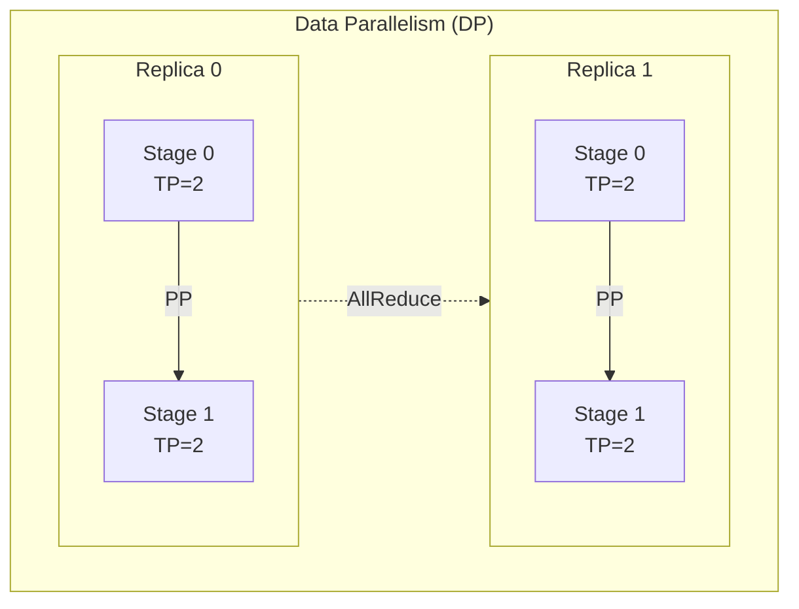

# Megatron-LM

> NVIDIA 出品的大规模语言模型训练框架，核心卖点是**高效的模型并行**。

官方仓库：https://github.com/NVIDIA/Megatron-LM

## 为什么需要 Megatron-LM

单卡放不下大模型，这是最朴素的动机。PyTorch 原生的 `DistributedDataParallel` 只解决了数据并行，模型本身得塞进一张卡。当参数量到 7B 以上，fp16 下光权重就要 14GB，加上 optimizer states、activations，一张 80GB A100 都捉襟见肘。

Megatron-LM 的核心贡献：**把 Tensor Parallelism 做到了极致**，并且和 Pipeline Parallelism、Data Parallelism 无缝组合。

> 来源：Shoeybi et al., "Megatron-LM: Training Multi-Billion Parameter Language Models Using Model Parallelism" arXiv:1909.08053

## 三维并行 (3D Parallelism)


> 图：Megatron-LM 3D 并行示意——DP 层包裹 PP（stage 分层），每个 stage 内部做 TP 切分

### Tensor Parallelism (TP)

将单个 Transformer 层内的矩阵运算切分到多卡。以 MLP 为例：

```python
# 原始: Y = GeLU(XA) * B
# TP 切分: A 按列切, B 按行切
# GPU 0: Y_0 = GeLU(X @ A_0) @ B_0
# GPU 1: Y_1 = GeLU(X @ A_1) @ B_1
# AllReduce: Y = Y_0 + Y_1
```

关键设计：每个 TP 组内只需要 **2 次 AllReduce**（forward 一次，backward 一次），通信量和单层参数量成正比。TP 适合放在 **NVLink 连接的同机卡间**，因为通信密集。

> 来源：Shoeybi et al. arXiv:1909.08053, Sec. 3 — MLP 列切分/行切分的通信分析

### Pipeline Parallelism (PP)

将模型按层分成多个 stage，不同 stage 放在不同节点。朴素的 PP 会有严重的 bubble（空闲时间），Megatron 用了 **1F1B schedule**（interleaved）来减少 bubble：

```
# 4 micro-batches, 2 stages
# 朴素:  [F0 F1 F2 F3] [B3 B2 B1 B0]  -- 大量 bubble
# 1F1B:  [F0 F1] [F2 B0] [F3 B1] [B2 B3]  -- bubble 显著减少
```

PP 适合放在 **跨节点** 场景，因为只需要在 stage 边界传递 activations，通信量相对小。

> 来源：Narayanan et al. arXiv:2104.04473, Sec. 2.3 — Interleaved 1F1B schedule 的 bubble 分析

### Data Parallelism (DP)

最外层包一圈 DP。Megatron 同时支持传统 DP 和 ZeRO-style 的分布式优化器（类似 DeepSpeed ZeRO-1）。

## 核心组件

| 组件 | 功能 |
|------|------|
| `megatron/core/transformer` | Transformer 层实现，内建 TP 支持 |
| `megatron/core/pipeline_parallel` | PP schedule（1F1B, interleaved） |
| `megatron/core/distributed` | 分布式通信、梯度 AllReduce |
| `megatron/core/optimizer` | 分布式优化器 |
| `megatron/training` | 训练主循环、checkpoint 管理 |

## Megatron-Core vs Megatron-LM

从 v0.5 开始，NVIDIA 把核心并行逻辑抽成了 **Megatron-Core**（`megatron/core/`），可以独立安装使用。上层的 Megatron-LM 是基于它的完整训练方案。很多框架（NeMo、verl）直接依赖 Megatron-Core。

## 与 DeepSpeed 的对比

| 维度 | Megatron-LM | [[DeepSpeed]] |
|------|-------------|---------------|
| 核心优势 | TP 极致优化 + PP 调度 | ZeRO 系列省显存，API 友好 |
| TP 支持 | 原生内建 | 需额外配置 |
| 上手门槛 | 高 | 中 |
| 实践组合 | 经常与 DeepSpeed 混用（Megatron-DeepSpeed） | — |

我的观点：**训练 70B+ 模型，Megatron 的 TP + PP 基本是标配**。[[DeepSpeed]] ZeRO-3 虽然也能跑，但通信效率在大规模集群上不如 Megatron 的手动并行。小模型（< 13B）直接用 DeepSpeed ZeRO-2/3 更省心。

## 踩坑记录

1. **TP size 必须整除 attention heads 数量**：比如 32 heads 只能用 TP=1/2/4/8/16/32
2. **PP 的 num_layers 必须能被 PP size 整除**：否则直接报错
3. **混合精度**：Megatron 默认用自己的 `Float16Module`，和 PyTorch AMP 不是一回事
4. **Checkpoint 格式**：Megatron 的 checkpoint 和 HuggingFace 格式不通用，需要转换脚本

## 📚 推荐阅读

### 原始论文
- [Megatron-LM: Training Multi-Billion Parameter Language Models Using Model Parallelism](https://arxiv.org/abs/1909.08053) — 奠基之作，TP 的列切分/行切分设计
- [Efficient Large-Scale Language Model Training on GPU Clusters](https://arxiv.org/abs/2104.04473) — Megatron-LM v2，3D 并行 + interleaved 1F1B schedule

### 深度解读
- [Megatron-LM 源码解读系列（知乎）](https://zhuanlan.zhihu.com/p/622212228) — 中文社区最详细的代码走读 ⭐⭐⭐⭐
- [NVIDIA Megatron-Core 官方文档](https://docs.nvidia.com/megatron-core/developer-guide/latest/index.html) — 模块化 API 参考

### 实践资源
- [NVIDIA/Megatron-LM GitHub](https://github.com/NVIDIA/Megatron-LM) — 官方仓库，含预训练脚本和模型转换工具
- [NeMo Framework](https://github.com/NVIDIA/NeMo) — 基于 Megatron-Core 的上层训练框架

## 🔧 落地应用

### 直接可用场景
- **70B+ 模型预训练**：Megatron TP+PP 是大规模集群训练的标配方案
- **RLHF/RL 训练后端**：[[训练后端|verl]] 和 NeMo-Aligner 直接调用 Megatron-Core 做模型并行

### 工程实现要点
- **TP size 选择**：必须整除 attention heads 数，通常 TP=8（单节点 NVLink）
- **PP + 1F1B**：micro-batch 数量 $M$ 越大 bubble ratio $\frac{P-1}{M+P-1}$ 越小，建议 $M \geq 4P$
- **Checkpoint 转换**：Megatron ↔ HuggingFace 格式需要专用脚本，不可直接互通

### 面试高频问法
- Q: Megatron-LM 的 Tensor Parallelism 是怎么切分 MLP 和 Attention 的？
  A: MLP 的第一个线性层按列切分（$A = [A_1 | A_2]$），第二个按行切分；Attention 按 head 切分，天然适合 TP。每层只需 2 次 AllReduce（forward + backward）。

## 💡 启发与思考

### So What？对老板意味着什么
- Megatron-Core 已成为 LLM 训练基础设施的"标准件"——verl、NeMo、OpenRLHF 都依赖它；理解 TP/PP 的通信模式是优化训练吞吐的前提
- 训练成本优化的关键在于 **TP/PP/DP 三维比例的调优**，而非简单堆卡

### 未解问题与局限
- Megatron 的 PP schedule 在异构硬件（不同代 GPU 混部）上调度效率未验证
- FSDP2 + torch.compile 正在追赶 Megatron 的性能，PyTorch 原生方案是否会取代 Megatron 是开放问题

### 脑暴：如果往下延伸
- 如果把 [[模型并行策略|模型并行策略]] 的 Zero Bubble PP 和 Megatron 结合，能否进一步压缩万卡训练的 bubble？
- Megatron-Core 作为"并行原语库"，能否标准化为类似 NCCL 的行业基础层？

## 相关

> 🔗 See also: [[DeepSpeed|DeepSpeed]] — ZeRO 系显存优化，与 Megatron TP/PP 互补
> 🔗 See also: [[FSDP|FSDP]] — PyTorch 原生竞品方案（ZeRO-3 等价）
> 🔗 See also: [[模型并行策略|模型并行策略]] — DP/TP/PP/SP/CP 全景对比

- [[分布式训练|分布式训练]] — 并行策略全景
- [[Ray|Ray]] — 另一个分布式计算框架
- [[训练后端|verl 训练后端]] — verl 中使用 Megatron 后端
- [[HybridFlow|HybridFlow]] — verl 的混合并行编排
- [[verl 概述|verl 概述]]
- [[TRL 概述|TRL 概述]]
- [[OpenRLHF|OpenRLHF]]
