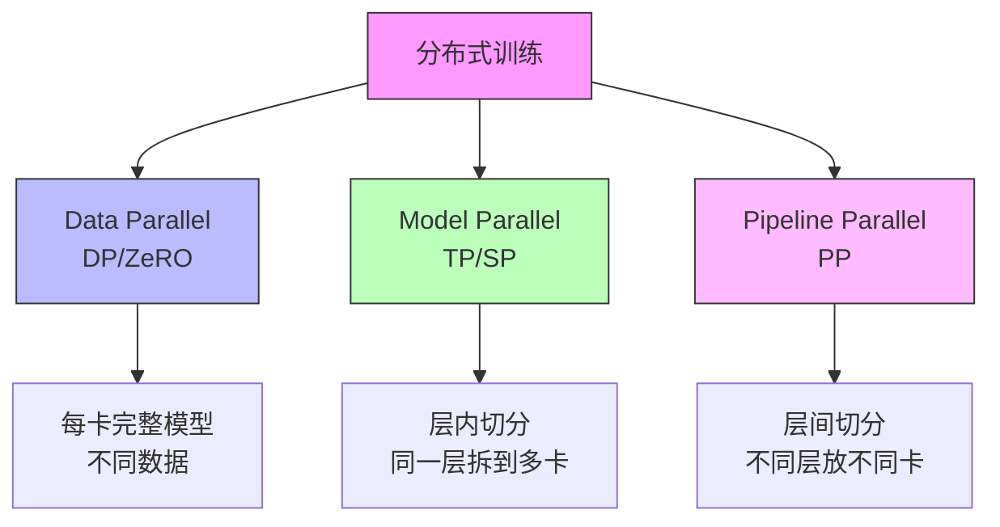
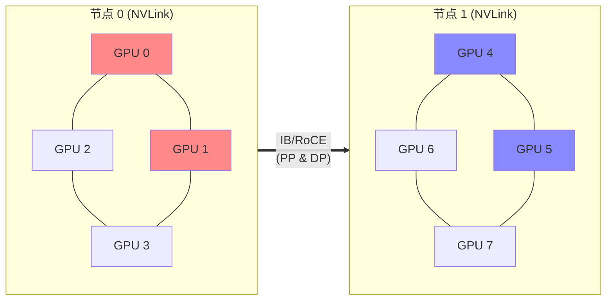

# 分布式训练：从数据并行到三维混合并行

> 大模型训练的核心命题：怎么把一个装不进单卡的模型高效地训起来。

> 来源：Megatron-LM arXiv:1909.08053, ZeRO arXiv:1910.02054, GPipe arXiv:1811.06965

参考视频：https://space.bilibili.com/59807853/lists/1384251?type=season
verl 分布式训练：https://verl.readthedocs.io/en/latest/start/multinode.html

## 并行策略全景



### Data Parallelism (DP)

> 来源：ZeRO arXiv:1910.02054 (Rajbhandari et al., 2019)

最简单的并行：每张卡放一份完整模型，喂不同的数据，梯度做 AllReduce。

```python
# PyTorch DDP - 最朴素的 DP
model = DistributedDataParallel(model, device_ids=[local_rank])

# 问题：模型太大放不下一张卡怎么办？
# 答案：ZeRO
```

**ZeRO (Zero Redundancy Optimizer)**：DeepSpeed 的核心贡献。

| 级别 | 切分内容 | 显存节省 | 通信量 |
|------|---------|---------|--------|
| ZeRO-1 | Optimizer States | ~4x | 不变 |
| ZeRO-2 | + Gradients | ~8x | 不变 |
| ZeRO-3 | + Parameters | ~N倍(N=GPU数) | 增加 1.5x |

ZeRO-3 通信量增加的原因：forward/backward 时需要 AllGather 参数，相当于多了一轮通信。

**ZeRO 显存公式**（假设模型参数 $\Phi$、Adam 优化器、$N$ 张卡）：

$$\text{ZeRO-1 per GPU} = 2\Phi + 2\Phi + \frac{12\Phi}{N} \quad \text{(参数+梯度+优化器状态/N)}$$

$$\text{ZeRO-3 per GPU} = \frac{16\Phi}{N} \quad \text{(一切均分)}$$

> 来源：ZeRO arXiv:1910.02054, Table 1

### Tensor Parallelism (TP)

> 来源：Megatron-LM arXiv:1909.08053 (Shoeybi et al., 2019)

把单个矩阵乘法拆到多卡。**Megatron-LM** 的核心贡献。

```python
# Self-Attention: Q, K, V 按 head 维度切分
# 每张卡只计算部分 heads，最后 AllReduce

# MLP: 
# W1 按列切 → 每卡算部分 hidden
# W2 按行切 → AllReduce 聚合
```

TP 的通信发生在**每一层的 forward 和 backward**，非常频繁，所以必须用高带宽互连（NVLink/NVSwitch，900GB/s）。**绝对不要跨节点做 TP**。

**TP 通信量公式**：每个 Transformer layer 的 forward+backward 需要 4 次 AllReduce（2 次 MLP + 2 次 Attention），每次通信量为 $2bs \cdot h$（$b$=batch, $s$=seq\_len, $h$=hidden\_dim）。

### Pipeline Parallelism (PP)

> 来源：GPipe arXiv:1811.06965 (Huang et al., 2019), Megatron-LM arXiv:2104.04473

按层切分，不同层放不同卡/节点。

```python
# 核心问题：bubble（空闲等待）
# 假设 4 个 stage，1 个 micro-batch：
# Stage 0: [F] [  ] [  ] [B]  ← 75% 时间在等
# Stage 1: [  ] [F] [B] [  ]
# Stage 2: [  ] [F] [B] [  ]
# Stage 3: [  ] [  ] [F] [B]

# 解决方案：micro-batching + 1F1B schedule
# 把 batch 切成 M 个 micro-batch，M >> PP_size
# bubble 比例 ≈ (PP_size - 1) / M
```

**PP Bubble 比例**：

$$\text{Bubble ratio} = \frac{P - 1}{M} \quad (P = \text{PP stages}, M = \text{micro-batches})$$

当 $M \gg P$ 时 bubble 趋近于零。1F1B schedule 进一步优化显存峰值。

### Sequence Parallelism (SP)

> 来源：Reducing Activation Recomputation in Large Transformer Models — arXiv:2205.05198 (Korthikanti et al., 2022)

TP 的延伸：在非 TP 区域（LayerNorm、Dropout）也做切分，避免这些操作重复计算。Megatron-LM v3 引入。

## 混合并行的最佳实践

训练一个 70B 模型，集群有 64 张 A100-80GB：

```
TP = 8   (一个节点 8 卡，NVLink 互连)
PP = 2   (2 个节点串联)
DP = 4   (4 组并行数据)
总 GPU = 8 × 2 × 4 = 64 ✓

# 不同并行度对通信的需求：
# TP: 高带宽、低延迟 → NVLink (同节点)
# PP: 中等带宽 → IB/RoCE (可跨节点)
# DP: 低频大块 → IB/RoCE (可跨节点)
```

## FSDP vs ZeRO

PyTorch 原生的 `FullyShardedDataParallel` 本质上就是 ZeRO-3：

```python
from torch.distributed.fsdp import FullyShardedDataParallel as FSDP

model = FSDP(
    model,
    sharding_strategy=ShardingStrategy.FULL_SHARD,  # ZeRO-3
    # ShardingStrategy.SHARD_GRAD_OP → ZeRO-2
    # ShardingStrategy.NO_SHARD → DDP
)
```

FSDP 的优势是**原生 PyTorch**，和生态兼容性好。缺点是早期实现不够成熟，checkpoint 格式变来变去。PyTorch 2.x 的 FSDP2 改进了不少。

## 通信原语速查

| 原语 | 场景 | 通信量 |
|------|------|--------|
| AllReduce | DP 梯度聚合 | 2(N-1)/N × size |
| AllGather | ZeRO-3 参数聚合 | (N-1)/N × size |
| ReduceScatter | ZeRO-3 梯度分发 | (N-1)/N × size |
| P2P Send/Recv | PP stage 间传递 | activation size |

## 我的经验

1. **7B 以下**：单卡或 DDP/ZeRO-2，不需要模型并行
2. **7B-13B**：ZeRO-3 或 FSDP，还是数据并行思路
3. **13B-70B**：TP + DP，有条件加 PP
4. **70B+**：三维并行，Megatron 基本是标配
5. **RL 训练**：用 Ray 编排，比 torchrun 灵活得多

## 混合并行通信拓扑



> TP 限制在节点内（NVLink 900 GB/s），PP/DP 可跨节点（InfiniBand 200-400 Gb/s）

## 🔧 落地应用

### 直接可用场景
- **7B 以下微调**：单卡或 DDP/ZeRO-2 足够，不需要模型并行
- **7B-13B 全参数训练**：ZeRO-3 / FSDP，仍是数据并行思路
- **13B-70B**：TP=8（节点内） + DP，有条件加 PP
- **70B+ 预训练**：三维并行（TP×PP×DP），Megatron-LM 基本是标配

### 工程实现要点
- **通信优化**：梯度通信与计算重叠（`overlap_comm=True`），ZeRO-3 的 prefetch 参数
- **显存调优**：gradient checkpointing 牺牲 ~33% 计算换 ~60% 显存
- **RL 场景**：用 [[AI/3-LLM/Infra/Ray|Ray]] 编排 actor/critic/ref 模型的分布式部署，比 torchrun 灵活

### 面试高频问法
- **Q: ZeRO-3 和 FSDP 的区别？**
  A: 本质相同（都是参数+梯度+优化器状态全分片），FSDP 是 PyTorch 原生实现，ZeRO-3 是 DeepSpeed 实现。FSDP 生态兼容好，ZeRO-3 功能更丰富（offload 到 CPU/NVMe）。
- **Q: 为什么 TP 不能跨节点？**
  A: TP 在每层 forward/backward 各需 4 次 AllReduce，通信频率极高。跨节点延迟和带宽都不够（IB ~200 Gb/s vs NVLink ~900 GB/s），会成为严重瓶颈。
- **Q: PP 的 bubble 问题怎么解决？**
  A: 增大 micro-batch 数 $M$（bubble ratio $= (P-1)/M$），使用 1F1B schedule，或 interleaved schedule（Megatron v2）进一步减少。

## 💡 启发与思考

### So What？对老板意味着什么
- 分布式训练不只是"加卡"——并行策略的选择直接决定训练效率和成本，选错策略可能浪费 50%+ 的 GPU 时间
- 理解 ZeRO/TP/PP 的通信模式是做大模型训练性价比评估的基础

### 未解问题与局限
- **异构集群**：不同型号 GPU 混合训练的负载均衡仍是开放问题
- **弹性训练**：节点故障自动恢复（elastic training）在大规模集群中仍不成熟
- **RL 训练的并行**：RLHF/GRPO 需要多个模型同时在线，资源编排比纯预训练复杂得多

### 脑暴：如果往下延伸
- 结合 [[AI/3-LLM/Infra/混合精度训练|混合精度训练]] 的 FP8，通信量可以进一步减半
- [[MoE 进阶|MoE 模型]] 引入了第四种并行——Expert Parallelism，通信模式从 AllReduce 变为 All-to-All

## 📚 推荐阅读

### 原始论文
- [Megatron-LM: Training Multi-Billion Parameter Language Models Using Model Parallelism](https://arxiv.org/abs/1909.08053) — TP 的奠基之作，必读
- [ZeRO: Memory Optimizations Toward Training Trillion Parameter Models](https://arxiv.org/abs/1910.02054) — 理解 ZeRO-1/2/3 显存分析的核心论文
- [Efficient Large-Scale Language Model Training on GPU Clusters](https://arxiv.org/abs/2104.04473) — Megatron v2，三维并行最佳实践

### 深度解读
- [Transformer Math 101](https://blog.eleuther.ai/transformer-math/) — EleutherAI，⭐⭐⭐⭐⭐，显存/计算/通信一站式计算
- [The Ultra-Scale Playbook](https://huggingface.co/spaces/nanotron/ultrascale-playbook) — HuggingFace 大规模训练手册 ⭐⭐⭐⭐

### 实践资源
- [DeepSpeed ZeRO Tutorial](https://www.deepspeed.ai/tutorials/zero/) — 官方教程，配置示例清晰
- [PyTorch FSDP Guide](https://pytorch.org/tutorials/intermediate/FSDP_tutorial.html) — 原生 FSDP 入门

### 代码手撕（理论 → 代码）
- [[AI/3-LLM/Infra/分布式训练通信原语-手撕实操|分布式训练通信原语-手撕实操]] ⭐⭐⭐⭐⭐ — AllReduce/AllGather/ReduceScatter/P2P 从零实现，理解 NCCL 通信原语
- [[AI/3-LLM/Infra/ZeRO-手撕实操|ZeRO-手撕实操]] ⭐⭐⭐⭐⭐ — ZeRO-1/2/3 三阶段状态分区完整实现
- [[AI/3-LLM/Infra/Tensor-Parallel-手撕实操|Tensor-Parallel-手撕实操]] ⭐⭐⭐⭐⭐ — 行/列并行、QKV 分割的矩阵分布式实现
- [[AI/3-LLM/Infra/Pipeline-Parallel-手撕实操|Pipeline-Parallel-手撕实操]] ⭐⭐⭐⭐⭐ — 1F1B 调度、micro-batch、bubble 分析
- [[AI/3-LLM/Infra/MoE-Context-Parallel-手撕实操|MoE-Context-Parallel-手撕实操]] ⭐⭐⭐⭐ — Expert Parallelism + Context Parallelism 实现
- [[AI/3-LLM/Infra/Ray-分布式RL训练实操|Ray-分布式RL训练实操]] ⭐⭐⭐⭐ — RL 场景下 Ray cluster 编排
- [[AI/3-LLM/Infra/MA-RLHF-手撕实操-系列索引|MA-RLHF 手撕实操系列索引]] — 架构/推理/Infra/RL 全链路代码总索引

---

## See Also

- [[AI/3-LLM/Infra/Megatron-LM|Megatron-LM]] — TP/PP 的工业级实现，本文理论的代码落地
- [[AI/3-LLM/Infra/DeepSpeed|DeepSpeed]] — ZeRO 系列的原始实现框架，支持 offload 等高级特性
- [[AI/3-LLM/Infra/FSDP|FSDP]] — PyTorch 原生 ZeRO-3 实现，与本文 ZeRO 段落互补
- [[AI/3-LLM/Infra/混合精度训练|混合精度训练]] — 分布式训练的精度策略配套：BF16/FP8 直接影响通信量和显存占用
- [[AI/3-LLM/Infra/GPU 显存计算指南|GPU 显存计算指南]] — 估算不同并行策略下每卡显存需求的实操指南
- [[MoE 进阶|MoE 进阶]] — Expert Parallelism 是分布式训练的第四维度，All-to-All 通信模式
- [[AI/3-LLM/Infra/Ray|Ray]] — RL 训练场景的分布式编排框架
- [[AI/3-LLM/Frameworks/verl/训练后端|verl 训练后端]] — verl 的分布式后端选择
- [[AI/3-LLM/Frameworks/verl/硬件资源预估|硬件资源预估]] — 资源规划
